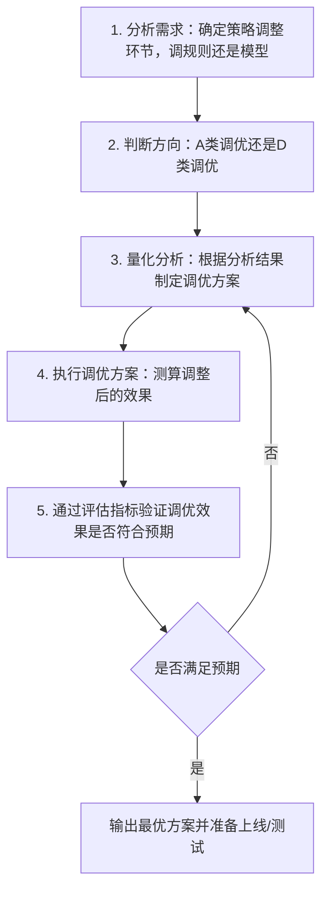
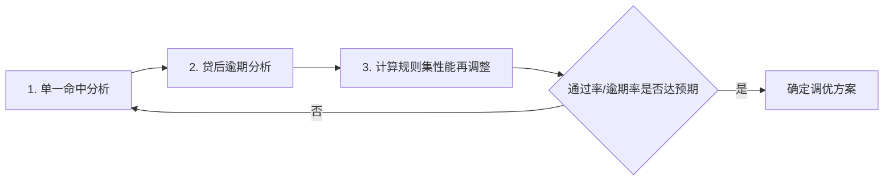
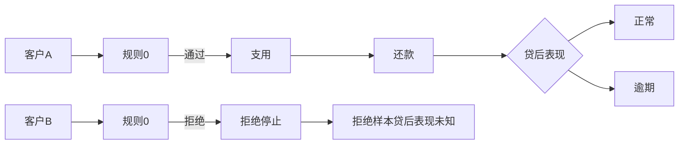
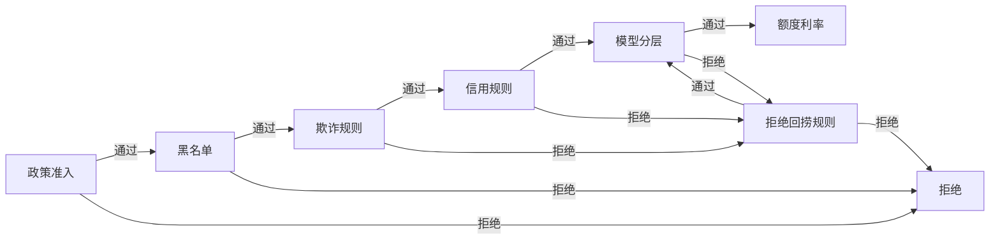
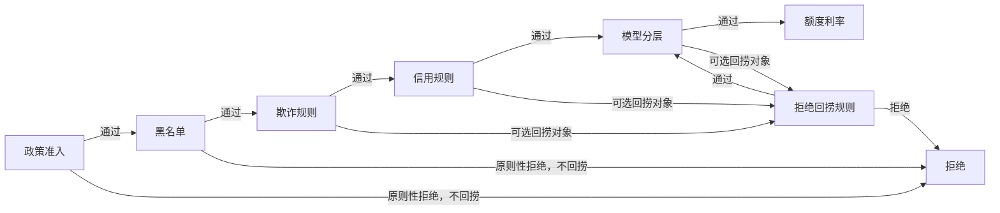
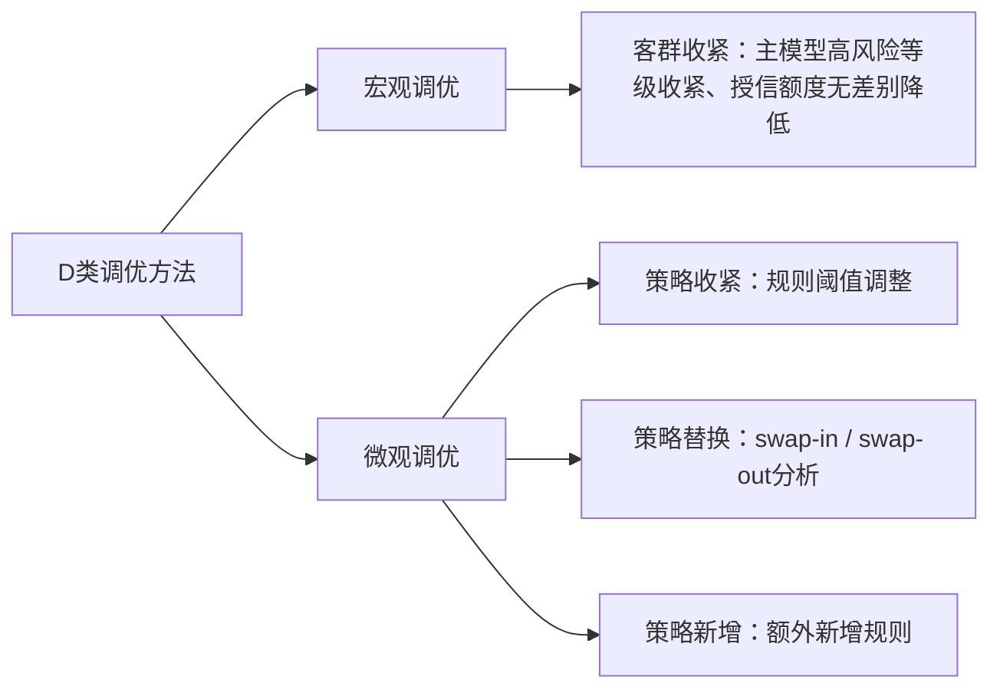
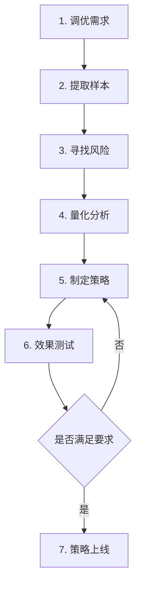
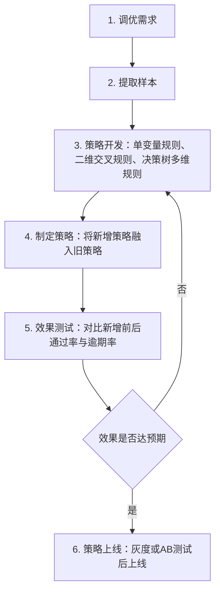
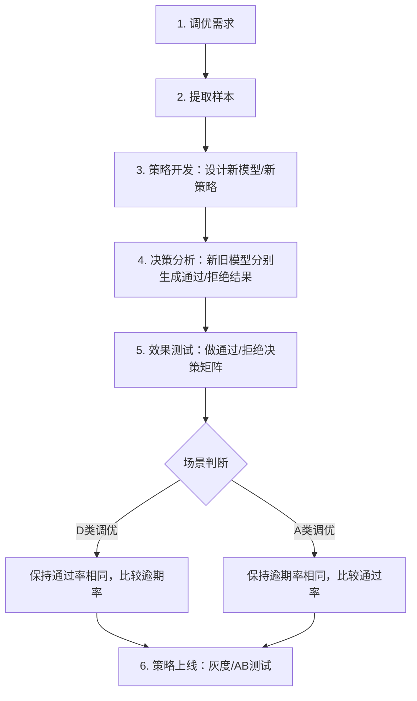

# 策略调优系列PDF完整Markdown提取

> 本文件按“PDF文件 → 页码 → 标题 → 正文 → 表格/图示说明”的结构整理。  
> 图片、流程图、概念图已转换为Markdown文字说明或Mermaid流程图；表格截图已按可读Markdown表格重建。  
> 公式以 LaTeX 或文字公式表达。

## 目录

1. 策略调优体系和方法论
2. 规则集A类调优：理论介绍
3. 基于单变量规则的A类调优：拒绝客户坏账预测
4. 基于拒绝回捞的A类调优
5. 客群对象上的A类调优：客群下探
6. 规则的D类调优：cutoff收紧
7. 策略新增的D类调优：理论介绍
8. 置换策略的D类调优：理论介绍

---

## 策略调优体系和方法论

**来源PDF：** `策略调优方法论_unlocked(3).pdf`

---

### 第 1 页：策略调优体系和方法论


### 第 2 页：1. 什么是策略调优？

风控策略开发上线后并不是一成不变的，它会受业务目标、市场变化、数据质量效果等很多方面的影响，比如：

- ✓ 业务不同发展阶段下会有不同的业务目标，策略需跟随调整；

- ✓ 客群质量变好或者变差，策略需进行放松或收紧的调整；

- ✓ 监管政策变化，比如要求定价不得高于24%，策略需要调整；

- ✓ 数据下线或者效果衰减，策略需进行下线或者替换的调整；

- ✓ …

所以策略是需要不断调整优化的。简单理解，策略调优就是根据当前最新的变化对现有策略所做出的调整，以适应最新的变化。这个变化可能来自业务、市场、产品、数据、技术等可能影响策略的各种因素。因此我们说，没有最完美的策略，只有不同变化下最合适的策略。


### 第 3 页：1.1. 什么是策略调优？

风控策略的主基调要根据公司整体的风险偏好来制定，有保守、激进、平稳几类。

一般情况下，在市场行情好的时期，策略可以偏激进一些，这时迅速占有市场用户为主要目标，可以快速扩大规模，形成规模效应。而在市场行情不好的时期，策略需要调整为保守一些，这时以稳定发展为主，大多是在经营前期吸收的存量客户，对于风险较高的新客户谨慎处理。因此，从大的市场环境角度考虑，这就是策略调优的价值所在。

当然，在什么时间点切入做调优也是一个非常关键的点。因为风险往往是滞后的，如果在市场环境不好之前可以提前捕捉预判进行收紧，那么后期的贷后压力就会很小。而如果盲目乐观等到了市场变差的时候再做调整，那么后期风险集中，压力会非常大。

**图示说明：风险偏好与调优方向**

页面底部用一条横向风险偏好带表示：左侧为“保守”，右侧为“激进”，中间为“调优”。含义是策略不能一成不变，而是在保守与激进之间根据业务目标、市场环境和资产质量动态调整。


### 第 4 页：2. 策略调优的方向做策略所关注的2个核心指标是：通过率、逾期率。

基于这2个指标，策略调优可分为两个方向：提高通过率、降低逾期率，简称“A类调优”和“D类调优”。

01 A类调优（提高通过率） 02 D类调优（降低逾期率）

- ✓ 含义：A是Ascending的缩写，代表提升通 ✓ 含义：D是Dscending的缩写，代表降低

过率，即从现有策略拒绝的客户中寻找好 通过率，即从现有策略通过的客户中寻找

客户进行通过。 差客户进行拒绝。


### 第 5 页：3. 策略调优的步骤策略调优的离线分析步骤大致如下：

**流程图重建：策略调优离线分析步骤**




### 第 6 页：4.1. A类调优的业务场景以下是做策略A类调优的3种常见业务场景。

**图示说明：A类调优的3类业务场景**

| 场景 | 说明 |
|---|---|
| 资金充足有业绩压力 | 当放款资金非常充足、现有通过率下客户无法消耗完资金时，可适当提高通过率完成放款业绩。常见于银行金融机构有明确贷款规模目标的场景。 |
| 策略过于保守 | 在风险可控且有大利润空间时，可适当提高通过率以最大化收益。业务初期冷启动阶段往往因审慎导致新客通过率偏低，随着表现积累，如风险很低，说明策略可能过于保守。 |
| 监控报表通过率下降 | 当监控发现规则或模型命中率逐渐变高、通过率下降，需要定位原因并调优，让通过率回到正常水平。 |


### 第 7 页：4.2. A类调优的方法A类调优可以分为宏观和微观两个层面的。宏观层面通过客群下探进行通过率的提升，涉及到下探客群的差异化审批策略、额度定价策略；微观层面对现有客群进行策略调优，包括策略放松、策略下线、策略替换，以及决策流程中的拒绝回捞等方式。

A类调优没有客户贷后表现，实际预测时需借助一些量化方法或者AB测试，难度相对高一些。

**图示说明：A类调优方法体系**

| 层面 | 方法 | 说明 |
|---|---|---|
| 宏观调优 | 客群下探 | 通过下探模型风险等级或新客群，提升整体通过率，通常伴随额度、定价、产品流程的差异化设计。 |
| 微观调优 | 策略放松 | 放松已有规则阈值或模型cutoff，释放部分原拒绝客户。 |
| 微观调优 | 策略下线 | 对效果衰减、不可用、误杀严重的数据或规则进行下线。 |
| 微观调优 | 策略替换 | 用新模型/新规则替代旧策略，实现置入置出。 |
| 微观调优 | 拒绝回捞 | 在决策流程中对特定拒绝客户用强特征规则重新捞回。 |


### 第 8 页：5.1. D类调优的业务场景以下是做策略D类调优的4种常见业务场景。

**图示说明：D类调优的4类业务场景**

| 场景 | 说明 |
|---|---|
| 监控发现逾期上升 | 监控报表发现逾期率明显上升，需要定位原因并调整策略。 |
| 实际逾期率超过预期目标 | 实际逾期率显著高于离线分析或业务目标，需要调整改至目标水平。 |
| 放款头寸变少 | 机构放款资金不足时，可以收紧策略，只放款给资质较好的用户。 |
| 市场环境下行控制风险敞口 | 外部市场下行、资产质量整体变差时，可适当收紧策略控制风险敞口。 |


### 第 9 页：5.2. D类调优的方法D类调优也可以分为宏观和微观两个层面的。宏观层面通过对整体客群收紧达到控制逾期率的目的；微观层面只对现有客群进行策略调优，包括策略收紧、策略替换、策略新增等。

D类调优从通过客户中寻找差客户拒绝，因为有客户的贷后表现，离线分析的实际效果更准确，难度较A类调优相对小一些。

**图示说明：D类调优方法体系**

| 层面 | 方法 | 说明 |
|---|---|---|
| 宏观调优 | 客群收紧 | 例如主模型高风险等级收紧、授信额度无差别降低。 |
| 微观调优 | 策略收紧 | 调整规则或模型阈值，例如提高准入要求、拒绝更多高风险客户。 |
| 微观调优 | 策略替换 | 通过swap-in / swap-out分析，用新策略替代旧策略。 |
| 微观调优 | 策略新增 | 在原策略不变基础上新增审批规则，额外拦截风险客户。 |


---

## 规则集A类调优：理论介绍

**来源PDF：** `并行规则集的A类调优：理论介绍 (1)_unlocked(3).pdf`

---

### 第 1 页：规则集A类调优：理论介绍


### 第 2 页：1. 策略调优介绍策略调优就是对已有策略进行放松或者收紧的调整，来应对市场风险变化，主要关注的两个指标：通过率、逾期率。

围绕这两个指标，对已有策略如何保持通过率不变，降低逾期率；或者保持逾期率不变，提高通过率，是策略调优的两个重点工作。按照通过率提升或者降低的角度考虑，策略调优可分两大类：
A类调优、D类调优。

01 A类调优（提高通过率） 02 D类调优（降低通过率）

- ✓ 含义：A是Ascending的缩写，代表提升通过率， ✓ 含义：D是Dscending的缩写，代表降低通过率，

即从已有策略拒绝的客户中寻找好客户进行通过。 即从已有策略通过的客户中寻找差客户进行拒绝。

- ✓ 场景：通过监控报表发现，某规则集、模型命中 ✓ 场景：通过监控报表发现，近期贷后逾期率不断

率逐渐变高导致通过降低；业务初期通过率较低 升高，离线分析后发现某一部分客群风险过高，

风险可控，希望提供通过率扩大业务范围。 需要拒掉；

- ✓ 方式：无客户贷后表现，需通过历史数据推演进 ✓ 方式：基于通过客户贷后表现做单变量分析、交

行拒绝客户逾期表现的推断。 叉表、决策树等方式的分析。


### 第 3 页：2. 规则集A类调优分析流程对于并行的规则集而言，客户进入规则集的节点以后，我们可以无差别地获取规则集内部每个规则的数据以及命中情况，这是并行规则集的优势，这种优势主要就体现在策略调优上。

作为策略三种常用形式之一的“规则集”，如何利用已观察到的规则数据进行通过率的调优调整呢？下面是对于规则集提升通过率（A类调优）的一般分析流程。

01 02 03单一命中率分析 贷后逾期分析 计算规则集性能再调整
- ✓ 计算规则的单一命中率以及 ✓ 筛选出拒绝客户逾期率更低 ✓ 执行调整，并且整个规则集单一命中率的纯度 的规则 进行性能计算，评估调整后
- ✓ 筛选可以用于通过率调优(A ✓ 尝试进行阈值(cutoff)的放松 规则集的效果有多少提升。
类调优)的规则 ✓ 如果效果不如预期那么就返回步骤12重新筛选调整的规则和阈值，直到达到效果为止。


### 第 4 页：3.1. 单一命中率、单一命中纯度介绍第一个首要问题是：对于规则集内部众多条规则，如何找到需要调整的规则？什么样的规则适合做调整？就并行规则集来说，可通过规则的“单一命中率、单一规则命中纯度”来解决这个问题。

✓ 自然命中率：规则A命中的数量占总数量的比例

- ✓ 单一命中率：只有规则A命中，但其它并行规则均未命中的数量占总数量的比例

- ✓ 单一命中纯度：单一命中率/自然命中率，反映单一命中的占比，其他占比则为与剩余规则交叉命中部分

综合命中率A 规则A的单一命中率

规则B的单一命中率 规则C的单一命中率B C

**图示说明：自然命中率、单一命中率、综合命中率**

图中用A/B/C三个相交圆表示并行规则集：
- 外层虚线区域表示规则集综合命中率。
- A、B、C各自圆内表示各规则自然命中区域。
- 每个圆中不与其它规则重叠的区域表示对应规则的单一命中率。
- 圆之间重叠区域表示多规则交叉命中，不能直接转化为单条规则调优带来的通过率提升。


### 第 5 页：3.2. 单一命中率案例分析具体筛选逻辑为：

1）寻找连续型的弱规则，排除强规则、政策性规则、以及非连续性规则（可调空间不大）

2）对“单一命中率、单一命中纯度”两者比例均较大的进行优先筛选。单一命中率降低多少会直接反映在整体的综合命中率上。

以下是一个人行征信数据维度的并行规则集，总共申请客户数量1000个，统计规则集内部所有规则的单一命中率、自然命中率、单一命中纯度。

**重建表格：人行征信规则集RS01单一命中率案例**

| 规则集 | 规则 | 含义 | 总数量 | 单一命中数量 | 自然命中数量 | 单一命中率 | 自然命中率 | 单一命中纯度 |
|---|---|---|---:|---:|---:|---:|---:|---:|
| RS01 | RULE0 | 近一个月贷款审批查询次数 >= 5 | 1000 | 39 | 51 | 3.90% | 5.10% | 76.47% |
| RS01 | RULE1 | 年龄不在18-55之间 | 1000 | 1 | 13 | 0.10% | 1.30% | 7.69% |
| RS01 | RULE2 | 申请人对外担保五级分类非正常（次级、可疑、损失） | 1000 | 0 | 3 | 0.00% | 0.30% | 0.00% |
| RS01 | RULE3 | 近3个月非银查询机构数 >= 5 | 1000 | 11 | 31 | 1.10% | 3.10% | 35.48% |
| RS01 | RULE4 | 最近6个月新开信贷账户数 >= 3 | 1000 | 13 | 17 | 1.30% | 1.70% | 76.47% |
| RS01 | RULE5 | 无征信记录白户 | 1000 | 11 | 28 | 1.10% | 2.80% | 39.29% |
| RS01 | RULE6 | 近5年逾期30天及以上次数 >= 3 | 1000 | 13 | 30 | 1.30% | 3.00% | 43.33% |
| RS01 | RULE7 | 最近6个月逾期1-30天的次数 >= 2 | 1000 | 38 | 55 | 3.80% | 5.50% | 69.09% |
| RS01 | RULE8 | 现行消费贷款机构数 >= 8 | 1000 | 1 | 1 | 0.10% | 0.10% | 100.00% |
| 总计 | - | - | 1000 | 127 | 229 | 12.70% | - | - |


### 第 6 页：3.2. 单一命中率案例分析假如现在只对“RULE7”进行阈值调整， “RULE7”单一命中率由3.8%降至2.1%，降低

1.7%，而整个规则集RS01的综合命中率由17.5%降至15.8%，也降低1.7%。

**重建表格：只调整RULE7前后对比**

调整前：

| rule | pure_hit_rate | hit_rate | pure_hit_pct |
|---|---:|---:|---:|
| RULE0_hit | 3.900000 | 5.100000 | 76.470600 |
| RULE7_hit | 3.800000 | 5.500000 | 69.090900 |
| RULE4_hit | 1.300000 | 1.700000 | 76.470600 |
| RULE6_hit | 1.300000 | 3.000000 | 43.333300 |
| RULE5_hit | 1.100000 | 2.800000 | 39.285700 |
| RULE3_hit | 1.100000 | 3.100000 | 35.483900 |
| RULE8_hit | 0.100000 | 0.100000 | 100.000000 |
| RULE1_hit | 0.100000 | 1.300000 | 7.692300 |
| RULE2_hit | 0.000000 | 0.300000 | 0.000000 |
| 总计 | 12.700000 | 22.900000 | 447.827300 |

调整后：

| rule | pure_hit_rate | hit_rate | pure_hit_pct |
|---|---:|---:|---:|
| RULE0_hit | 3.900000 | 5.100000 | 76.470600 |
| RULE7_hit | 2.100000 | 2.800000 | 75.000000 |
| RULE4_hit | 1.300000 | 1.700000 | 76.470600 |
| RULE5_hit | 1.300000 | 2.800000 | 46.428600 |
| RULE6_hit | 1.300000 | 3.000000 | 43.333300 |
| RULE3_hit | 1.200000 | 3.100000 | 38.709700 |
| RULE1_hit | 0.300000 | 1.300000 | 23.076900 |
| RULE8_hit | 0.100000 | 0.100000 | 100.000000 |
| RULE2_hit | 0.000000 | 0.300000 | 0.000000 |
| 总计 | 11.500000 | 20.200000 | 479.489700 |

核心变化：RULE7单一命中率从3.8%降至2.1%，下降1.7%；规则集RS01综合命中率从17.5%降至15.8%，也下降1.7%。


### 第 7 页：4.1. 贷后逾期分析介绍当筛选完可调规则之后，我们要确定这些规则的阈值（也就是cutoff）如何调整，因为通常来说，通过率的提升也会伴随着逾期率的上升，那么如何对规则的逾期率进行分析呢？

提供通过率意味着要对规则阈值进行放松，比如下面这个规则“近3个月非银查询机构数>=5”，一直以来将>=5的客户拒绝，现在需要将>=5的通过。做A类调优的一个难点是：拒绝客户没有贷后表现，因此风险是未知的，对于放开的尺度难以量化评估。

**重建表格：RULE0通过样本贷后表现**

| RULE0 | good | bad | total | bad_rate |
|---:|---:|---:|---:|---:|
| 0 | 384 | 10 | 394 | 2.54% |
| 1 | 243 | 15 | 258 | 5.81% |
| 2 | 236 | 23 | 259 | 8.88% |
| 3 | 225 | 26 | 251 | 10.36% |
| 4 | 162 | 26 | 188 | 13.83% |
| 5 | - | - | - | ? |
| 总计 | 1250 | 100 | 1350 | 7.41% |


### 第 8 页：4.2. 贷后逾期分析方法规则的A类调优可分为两种情况，有拒绝数据参考、无拒绝数据参考。筛选的核心原则就是优先释放逾期率更低的拒绝段。

有拒绝数据 无拒绝数据

- ✓ 当前规则曾经做过随机测试，有拒绝段完整的贷后表 ✓ 规则拒绝段没有任何贷后表现。
现；规则上线前做过AB测试或者灰度测试，对于规则 ✓ 方法执行但决策不生效的样本，筛选规则拒绝段的贷后表 ① 做随机测试获取拒绝段贷后表现，但需一定的观察周现。 期，且要付出一定的逾期损失；

- ✓ 对比各规则拒绝段的历史逾期率表现，优先释放历史 ② 基于规则“区间坏账率单调性”的性能判断，如果单

逾期率较低的规则。 调性较强说明规则区分效果较好，拒绝段逾期率大概率会按照单调趋势延续，可大致预估或者通过建回归模型量化方法预测逾期率，该种情况下逾期率一般较高。因此，优先选择单调性较差的规则释放拒绝段。


### 第 9 页：4.3. 贷后逾期分析方法

RULE0=5，RULE4=4，RULE7=2，对应的预估badrate分别约为16%，19%，12%

**重建表格：贷后逾期分析方法示例**

RULE0分箱：

| variable | bin | count | count_distr | good | bad | badprop | woe | bin_iv | total_iv | breaks | is_special_values |
|---|---|---:|---:|---:|---:|---:|---:|---:|---:|---:|---|
| RULE0 | [-inf,1.0) | 394 | 0.291852 | 384 | 10 | 0.025381 | -1.122329 | 0.232547 | 0.372397 | 1.0 | False |
| RULE0 | [1.0,2.0) | 258 | 0.191111 | 243 | 15 | 0.058140 | -0.259283 | 0.011512 | 0.372397 | 2.0 | False |
| RULE0 | [2.0,3.0) | 259 | 0.191852 | 236 | 23 | 0.088803 | 0.197391 | 0.008133 | 0.372397 | 3.0 | False |
| RULE0 | [3.0,4.0) | 251 | 0.185926 | 225 | 26 | 0.103586 | 0.367725 | 0.029418 | 0.372397 | 4.0 | False |
| RULE0 | [4.0,inf) | 188 | 0.139259 | 162 | 26 | 0.138298 | 0.696229 | 0.090788 | 0.372397 | inf | False |

RULE4分箱：

| variable | bin | count | count_distr | good | bad | badprop | woe | bin_iv | total_iv | breaks | is_special_values |
|---|---|---:|---:|---:|---:|---:|---:|---:|---:|---:|---|
| RULE4 | [-inf,1.0) | 570 | 0.422222 | 553 | 17 | 0.029825 | -0.956416 | 0.260528 | 0.450213 | 1.0 | False |
| RULE4 | [1.0,2.0) | 291 | 0.215556 | 270 | 21 | 0.072165 | -0.028171 | 0.000169 | 0.450213 | 2.0 | False |
| RULE4 | [2.0,3.0) | 268 | 0.198519 | 240 | 28 | 0.104478 | 0.377294 | 0.033202 | 0.450213 | 3.0 | False |
| RULE4 | [3.0,inf) | 221 | 0.163704 | 187 | 34 | 0.153846 | 0.820981 | 0.156315 | 0.450213 | inf | False |

RULE7分箱：

| variable | bin | count | count_distr | good | bad | badprop | woe | bin_iv | total_iv | breaks | is_special_values |
|---|---|---:|---:|---:|---:|---:|---:|---:|---:|---:|---|
| RULE7 | [-inf,1.0) | 517 | 0.382963 | 491 | 26 | 0.050290 | -0.412619 | 0.054796 | 0.081063 | 1.0 | False |
| RULE7 | [1.0,inf) | 833 | 0.617037 | 759 | 74 | 0.088836 | 0.197792 | 0.026267 | 0.081063 | inf | False |

预估结论：RULE0=5、RULE4=4、RULE7=2，对应预估 badrate 分别约为16%、19%、12%。


### 第 10 页：5. 计算规则集性能再调整当我们筛选出要调优的规则并且调整完阈值后，整个规则集的通过率会发生变化。因为规则之间有重复命中的情况，所以最终的通过率是升高还是降低，提升了具体是多少，这些就需要对整个规则集重新计算。

如果通过提升没有达到我们的预期，那我们可以再返回第1和2步骤进行调整，比如阈值进一步放松，或者增加更多规则进行阈值的放松等等，可以有各种组合的调整方式。当然也可以先列举出所有备选方案，同时执行调整策略，最后对比各方案调整后的规则集效果，从中选择最优。

**流程图重建：规则集性能再调整闭环**




---

## 基于单变量规则的A类调优(1)：理论介绍

**来源PDF：** `基于单变量规则的A类调优(1)：拒绝客户坏账预测 (1)_unlocked(3).pdf`

---

### 第 1 页：基于单变量规则的A类调优(1)：理论介绍


### 第 2 页：1. 什么是规则阈值放松？

我们举一个简单的例子，先解释一下什么是单变量规则阈值的放松。

比如，线上决策引擎中有“RULE0”的征信审批规则，含义是“最近一个月贷款审批查询次数”，它的判断标准是：RULE0>=5时则命中，否则未命中。

假如，现在我们想对RULE0规则进行阈值的放松，比如将cutoff阈值调整为>=6时拒绝。这样就可以将原来>=5被拒绝的客户通过，进而提高通过率，达到A类调优的效果。

**重建表格：RULE0变量分箱与贷后表现**


| variable | bin | count | count_distr | good | bad | badprob | woe | bin_iv | total_iv | breaks | is_special_values |
|---|---|---:|---:|---:|---:|---:|---:|---:|---:|---:|---|
| RULE0 | [-inf,1.0) | 394 | 0.291852 | 384 | 10 | 0.025381 | -1.122329 | 0.232547 | 0.372397 | 1.0 | False |
| RULE0 | [1.0,2.0) | 258 | 0.191111 | 243 | 15 | 0.058140 | -0.259283 | 0.011512 | 0.372397 | 2.0 | False |
| RULE0 | [2.0,3.0) | 259 | 0.191852 | 236 | 23 | 0.088803 | 0.197391 | 0.008133 | 0.372397 | 3.0 | False |
| RULE0 | [3.0,4.0) | 251 | 0.185926 | 225 | 26 | 0.103586 | 0.367725 | 0.029418 | 0.372397 | 4.0 | False |
| RULE0 | [4.0,inf) | 188 | 0.139259 | 162 | 26 | 0.138298 | 0.696229 | 0.090788 | 0.372397 | inf | False |


### 第 3 页：2. 规则阈值放松的难点做A类调优的一个难点就是：被拒绝的客户无法借款，也就没有贷后表现（风险未知），因此对于“是否可以放松”以及“放松的程度”是难以量化分析的。

通过样本的贷后表现

5 拒绝样本的贷后表现?

**流程图说明：被拒绝样本无贷后表现**




### 第 4 页：3. 拒绝样本贷后表现的量化方法有常见的3个方法可以参考：

① 回归预测：如果规则的通过样本分箱badrate有一定的单调性，可尝试基于通过样本的badrate拟合回归模型来预测拒绝样本分箱下的badrate。该方法的使用条件是规则本身具备一定的区分能力，特点就是badrate有单调趋势。

② 其它强变量：不依赖于规则通过样本badrate的单调排序性，而是借助其它的强变量来预测拒绝样本贷后表现，即规则通过样本的badrate单调性可强可弱，但都不影响其它强变量的区分效果。在实际业务中，一般这种强变量大多数是模型分，或者融合模型分。

③ 实际测试：如历史做过“灰度测试”或“AB测试”，可参考历史数据预估；如没有历史测试，可通过“随机测试” 放行想要放松的客户，通过实际贷后表现来准确获取信息。

note：对拒绝样本贷后表现进行预测本身就是一个非常难的问题。如果有多种量化分析方法，最好是可以结合起来使用，综合多个维度分析得到的结果，说服力就更强，预测值就更加准确。


### 第 5 页：3.1. 回归预测方法这种方法的前置条件是变量分箱后区间坏账（badrate）需要有明显的单调性，如下图所示。

按照badrate的增长趋势或者增速可预估出拒绝段分箱内的badrate水平。实现方式和做模型类似，用通过样本训练拟合出模型，然后对拒绝样本进行预测即可。

比如下面拒绝段的第5/6分箱的badrate经过拟合模型预测后分别为0.1642和0.1914。

5 0.1642

6 0.1914

**重建表格：回归预测示例**


| variable | bin | count | count_distr | good | bad | badprob | woe | bin_iv | total_iv | breaks | is_special_values |
|---|---|---:|---:|---:|---:|---:|---:|---:|---:|---:|---|
| RULE0 | [-inf,1.0) | 394 | 0.291852 | 384 | 10 | 0.025381 | -1.122329 | 0.232547 | 0.372397 | 1.0 | False |
| RULE0 | [1.0,2.0) | 258 | 0.191111 | 243 | 15 | 0.058140 | -0.259283 | 0.011512 | 0.372397 | 2.0 | False |
| RULE0 | [2.0,3.0) | 259 | 0.191852 | 236 | 23 | 0.088803 | 0.197391 | 0.008133 | 0.372397 | 3.0 | False |
| RULE0 | [3.0,4.0) | 251 | 0.185926 | 225 | 26 | 0.103586 | 0.367725 | 0.029418 | 0.372397 | 4.0 | False |
| RULE0 | [4.0,inf) | 188 | 0.139259 | 162 | 26 | 0.138298 | 0.696229 | 0.090788 | 0.372397 | inf | False |


拒绝段预测结果：

| 拒绝段分箱 | 预测 badrate |
|---:|---:|
| 5 | 0.1642 |
| 6 | 0.1914 |


### 第 6 页：3.1. 回归预测方法Python实操回归模型在Python中可以通过以下方式实现，主要是借助Numpy的polyfit()函数拟合出线性方程的系数和截距项。如下图所示，通过RULE0的变量分箱及对应的badrate数值训练得到一个一元线性方程：y = 0.0271x + 0.0286。然后使用该方程预测出拒绝样本的badrate。

Python代码 执行结果

根据通过样本训练模型 训练样本(分箱及对应的badrate)

拟合出一元线性方程

**公式与代码重建：Numpy `polyfit()` 拟合一元线性方程**

拟合得到的线性方程：

$$y = 0.0271x + 0.0286$$

页面中的Python代码逻辑可整理如下：

```python
def reg_func(df: pd.DataFrame, rule_name: str):
    # 变量拒绝段逾期率预测
    x = df.index.to_numpy()
    y = df.badprob.to_numpy()
    p = np.polyfit(x, y, 1)  # 根据通过样本训练模型
    trendline = np.polyval(p, x)
    print("{}生成回归公式：y = {}x + {}".format(rule_name, round(p[0], 4), round(p[1], 4)))
    t1 = max(x) + 1
    t2 = max(x) + 2
    grp1 = round(p[0] * t1 + p[1], 4)
    grp2 = round(p[0] * t2 + p[1], 4)
    lift1 = round(grp1 / totalbadrate, 2)
    lift2 = round(grp2 / totalbadrate, 2)
    print("第{}箱的badrate：{}，lift：{}".format(t1, grp1, lift1))
    print("第{}箱的badrate：{}，lift：{}".format(t2, grp2, lift2))
```

执行结果：RULE0生成回归公式 `y = 0.0271x + 0.0286`；第5箱 badrate = 0.1642，lift = 2.22；第6箱 badrate = 0.1914，lift = 2.58。


### 第 7 页：3.1. 回归预测方法Excel实操在Excel中也可以拟合出回归方程。具体操作方式为：

1）选中数据插入折线图，右键点击折线图，在弹窗中选择“添加趋势线”

2）在趋势线选项中可以勾选“显示公式”和“显示R平方值”，趋势先类型可以默认为“线性”

**Excel实操说明**

1. 选中数据，插入折线图；
2. 右键点击折线图，选择“添加趋势线”；
3. 在趋势线选项中勾选“显示公式”和“显示R平方值”；
4. 趋势线类型可默认选择“线性”；
5. 页面示例中，折线图对应RULE0的bad_rate，拟合公式与R²显示在图上，用于评估线性拟合和预测拒绝段。


### 第 8 页：3.2. 其它强变量案例实操以下通过强变量“模型分0”对“规则1在[5,6)拒绝段的badrate”进行量化预测。

步骤2：

1）统计模型分0对规则1在[5,6)拒绝段样本打分的分布。（假设模型分0在相同分箱下对通过和拒绝样本的badrate一样）

2）根据模型分0的cutoff计算该拒绝段的坏客户数量

步骤1：模型分0对以上通过样本打分的分数分布，根据lift制定cutoff 3）命中cutoff的坏样本数/该拒绝段总样本数

**重建表格：规则1通过样本分箱统计**

| no | bin | count | count_distr | good | bad | badprob |
|---:|---|---:|---:|---:|---:|---:|
| 0 | [0,1) | 2000 | 20.00% | 1935 | 65 | 3.3% |
| 1 | [1,2) | 2000 | 20.00% | 1923 | 77 | 3.9% |
| 2 | [2,3) | 2000 | 20.00% | 1911 | 89 | 4.5% |
| 3 | [3,4) | 2000 | 20.00% | 1900 | 100 | 5.0% |
| 4 | [4,5) | 2000 | 20.00% | 1883 | 117 | 5.9% |
| all | - | 10000 | 100.00% | 9552 | 448 | 4.48% |

**重建表格：步骤1，模型分0对通过样本打分分布，根据lift制定cutoff**

| no | bin | count | count_distr | good | bad | badprob |
|---:|---|---:|---:|---:|---:|---:|
| 0 | [-inf,300.0) | 537 | 5.37% | 467 | 70 | 13.04% |
| 1 | [300.0,400.0) | 1300 | 13.00% | 1180 | 120 | 9.23% |
| 2 | [400.0,500.0) | 2300 | 23.00% | 2167 | 133 | 5.78% |
| 3 | [500.0,600.0) | 579 | 5.79% | 554 | 25 | 4.32% |
| 4 | [600.0,700.0) | 1200 | 12.00% | 1159 | 41 | 3.42% |
| 5 | [700.0,800.0) | 1200 | 12.00% | 1169 | 31 | 2.58% |
| 6 | [800.0,900.0) | 1600 | 16.00% | 1579 | 21 | 1.31% |
| 7 | [900.0,inf) | 1284 | 12.84% | 1277 | 7 | 0.55% |
| all | - | 10000 | 100.00% | 9552 | 448 | 4.48% |

**重建表格：步骤2，模型分0对规则1在[5,6)拒绝段样本打分分布及坏客户估计**

| bin | count | count_distr | badprob | bad |
|---|---:|---:|---:|---:|
| [-inf,300.0) | 700 | 35.00% | 13.04% | 91 |
| [300.0,400.0) | 600 | 30.00% | 9.23% | 55 |
| [400.0,500.0) | 200 | 10.00% | 5.78% | 12 |
| [500.0,600.0) | 150 | 7.50% | 4.32% | 6 |
| [600.0,700.0) | 130 | 6.50% | 3.42% | 4 |
| [700.0,800.0) | 100 | 5.00% | 2.58% | 3 |
| [800.0,900.0) | 70 | 3.50% | 1.31% | 1 |
| [900.0,inf) | 50 | 2.50% | 0.55% | 0 |
| all | 2000 | 100.00% | - | - |

计算逻辑：命中cutoff的坏样本数 / 该拒绝段总样本数，即可得到拒绝段 badrate 的预测值。


### 第 9 页：3.3. 实际测试

① 使用“随机测试”直接获取拒绝样本的贷后表现

- ✓ 分流比例：比例不宜过高（结合样本量考虑，一般控制在2%以内），以避免损失严重，同时样本量需满足最小统计要求，否则没有统计意义

- ✓ 豁免：随机测试样本，只打分不生效，且会“豁免”直接通过审批，不会被决策流后面策略拒绝，否则获取的贷后表现可能失真

- ✓ 优缺点：优点是获取信息最为准确，无需预测，缺点是需要一定的观察周期，并且会产生一定的坏账损失。

② 如果历史有做过“AB测试”或“灰度测试”，可以使用测试期间样本的贷后表现预估

- ✓ AB测试：如果规则策略上线时进行AB测试，比如A组（对照组）只打分不生效，B组（实验组）打分并生效。由于B组中低于cutoff的客户将会被策略拒绝，那么就可以从A组中低于cutoff的放贷客群的badrate作为B组的近似估计。

- ✓ 灰度测试：如果规则策略上线前存在灰度测试，灰度期间只打分不生效，可以用来预估规则拒绝样本的badrate。灰度时间距今至少要有1个月以上的表现期（如果是观察首逾指标），且灰度期间积累的样本量要满足统计数量的最小要求。


---

## 基于拒绝回捞的A类调优

**来源PDF：** `03-基于拒绝回捞的A类调优_unlocked(3).pdf`

---

### 第 1 页：基于拒绝回捞的A类调优


### 第 2 页：1. 什么是拒绝回捞？

拒绝回捞是指“被拒绝的客户重新通过的过程”。

广义理解上等同于做A类调优，涵盖各类调优方法。狭义理解上，是决策流程中的一个回捞动作，或者回捞节点，如下图所示。

为了减少好客户的误杀，并且考虑对通过率的影响，会设计拒绝回捞策略。

**流程图重建：决策流中的拒绝回捞节点**



含义：政策准入、黑名单等原则性拒绝通常不进入回捞；欺诈规则、信用规则或模型分层拒绝的客户，可在特定回捞节点用强特征重新判断。


### 第 3 页：1. 什么是拒绝回捞？

回捞策略

通过

**概念图说明：规则边界与回捞策略**

左图表示仅依赖征信规则时，规则线左侧为通过、右侧为拒绝，但拒绝区中仍存在一部分好客户；右图在征信规则之后加入“回捞策略”斜线，用额外维度从原拒绝区中识别出部分好客户，使其重新通过。


### 第 4 页：2. 拒绝回捞策略的核心逻辑拒绝回捞策略的核心逻辑是：选取明显的好客户特征，并且这些特征最好与前面已执行审批策略的数据维度相关性越小越好，通过这些特征或者特征组合，从拒绝客户中进行捞回。

1）什么是明显的好客户特征呢？

可以参考白名单的筛选规则，比如，客户是公务员、事业单位或者500强集团企业员工；再比如客户公积金缴存基数大于xxx，等等。这些都属于明显的好客户特征，通过实际贷后表现分析也是如此，这类客户的风险很低。

2）为什么用明显的好客户特征呢？

拒绝客户是因为命中某些规则而被拒绝的，说明了在某个维度上风险是很高的。如果想让其他维度风险高的客户通过，必须有非常强的特征维度来覆盖掉这个风险，或者抵消这个风险，才能被捞回通过。


### 第 5 页：3. 拒绝回捞策略规则设计拒绝回捞策略设计上一般以规则及规则的组合为主（模型分也属于规则范畴），根据规则区分效果的强弱、以及对通过率的影响综合考虑。

1）如果想要回捞的力度大，提高更多的通过率，可以选择用比较强的单一规则进行回捞。

比如前面被某些规则拒绝的客户，如果现在命中了机构的内部白名单，则回捞通过；反之则保持拒绝状态。这里的逻辑是我们更相信内部白名单的效用，更有说服力。

2）如果想要回捞的更加精准，可以选择使用多维度交叉的规则组合。

比如前面被某些规则拒绝的客户，如果现在命中了机构的内部白名单，并且基于三方数据源的融合模型分>700，则回捞通过；反之则保持拒绝状态。这种规则组合的形式对通过率提升不如第一种，但回捞的更精准（因为通过两个强的维度交叉判断出来的）。


### 第 6 页：3. 拒绝回捞策略规则设计回捞的规则及规则组合不仅限于一种，可以从多个维度设置多条规则形成规则集。可以是串行或者并行。下面是一个并行回捞规则集的示例：

**图示说明：并行拒绝回捞规则集示例**

| 回捞规则/组合 | 回捞类型 | 含义 |
|---|---|---|
| 优质客户白名单 | 无差别回捞 | 命中强白名单后直接回捞。 |
| 优质企业单位员工 + 公积金推测收入 > 8000 | 无差别回捞 | 单位属性与收入能力同时较强，可直接回捞。 |
| 近2年有负债无逾期 + 违约成本高 | 有针对性回捞 | 针对负债但还款记录较好的客户。 |
| 资金紧张评级低 + 模型分A > 600 | 有针对性回捞 | 资金压力指标较好，同时模型分达标。 |
| 征信白户 + 模型分B > 700 | 有针对性回捞 | 对无征信客户借助替代模型分判断。 |


### 第 7 页：3. 拒绝回捞策略规则设计公司前期一直对白户拒绝，当下想要下探客群对白户进行适当放开。那么在征信数据全无的情况下，可以借助三方数据来补充信息。

下面是一个基于三方数据源的融合模型分，基于以往贷后表现分箱并统计了分箱下的区间坏账率bad rate。整体大盘的bad rate为4.48%，>=800的bad rate不到2%，因此我们可以切出一个cutoff，那么回捞规则为：如果是征信白户 且 三方数据融合模型分数>=800，则进行回捞。

**重建表格：基于三方数据融合模型分的白户回捞示例**

| no | bin | count | count_distr | good | bad | badprob |
|---:|---|---:|---:|---:|---:|---:|
| 0 | [-inf,300.0) | 537 | 5.37% | 467 | 70 | 13.04% |
| 1 | [300.0,400.0) | 1300 | 13.00% | 1180 | 120 | 9.23% |
| 2 | [400.0,500.0) | 2300 | 23.00% | 2167 | 133 | 5.78% |
| 3 | [500.0,600.0) | 579 | 5.79% | 554 | 25 | 4.32% |
| 4 | [600.0,700.0) | 1200 | 12.00% | 1159 | 41 | 3.42% |
| 5 | [700.0,800.0) | 1200 | 12.00% | 1169 | 31 | 2.58% |
| 6 | [800.0,900.0) | 1600 | 16.00% | 1579 | 21 | 1.31% |
| 7 | [900.0,inf) | 1284 | 12.84% | 1277 | 7 | 0.55% |
| all | - | 10000 | 100.00% | 9552 | 448 | 4.48% |

策略规则：如果客户是征信白户，且三方数据融合模型分数 >= 800，则进行回捞。逻辑依据是整体大盘 bad rate 为4.48%，而模型分 >=800 的 bad rate 不到2%。


### 第 8 页：4. 拒绝回捞策略流程设计

1）确定不可回捞对象，哪些拒绝客户不可回捞？

比如下面示例中，被政策和黑名单命中的客户会直接拒绝，不进行任何回捞动作，因为这个两个属于原则性的底线，因此在配置决策流程上需注意不可对此类客户回捞。

2）确定需回捞对象，要对哪些拒绝客户回捞？

这个需要结合业务考虑，比如可以只对信用规则拒绝的客户回捞，也可以只对欺诈规则拒绝客户回捞，或者同时都回捞，不同的回捞对象对应的回捞节点位置不同。

**流程图重建：拒绝回捞策略流程设计**




### 第 9 页：5. 拒绝回捞策略离线分析和做其他策略一样，拒绝回捞策略也需要进行具体详尽的离线分析，具体步骤归纳如下：

1）确定回捞变量：通过数据分析和业务经验，挖掘明显的好客户特征变量，或者加工出有针对性的捞回变量，我们统称“用于回捞的变量”。

2）回溯回捞变量：与历史样本数据对齐（包括通过、拒绝样本在策略上的决策数据、以及通过样本的Y标签）。回捞变量可能已经在历史样本中了，则不需要回溯。同时统计历史样本数据的逾期率，即大盘风险，作为后续回捞策略的参照。

3）筛选回捞变量：筛选各回捞变量下的客群，分别统计其被策略规则拒绝的比例，主要用于评估是否有回捞的空间。如果比例非常小说明回捞空间不大可以忽略，如果比例适中则可考虑进行回捞。


### 第 10 页：5. 拒绝回捞策略离线分析

4）设计回捞策略：根据步骤3分析结果初步设计回捞策略，用代码执行回捞策略，并测算回捞效果，评估通过率、逾期率指标。

- ✓ 通过率比较好计算，主要就是看整体回捞策略的命中率，并且细致一点还会看回捞策略中每个规则的单一命中情况。

- ✓ 逾期率的计算要分情况，如果是用已经有贷后表现的变量做回捞，比如已有策略在用的模型分，那就不需要预估了，可以直接拿来用。如果用没有贷后表现的新变量，那就面临着拒绝样本没有贷后表现的问题，如果有历史的测试结果，比如随机测试或者AB测试等，可作为参考来预估逾期率的水平。一般情况下回捞客群逾期率和整体相比，要有明显低的优势，比如整体坏账bad rate是2%，那么回捞客群的bad rate最好控制在1.5%以下，否则捞回的和整体没有什么区别，也就失去做的意义了。

5）评估回捞效果：最后根据评估指标，来调整回捞策略，重复步骤4。评估完成后还要用近期的样本再计算回捞策略的命中率，以评估策略的稳定性，因为历史样本和近期的样本可能有一定的客群变化差异。


### 第 11 页：6. 拒绝回捞策略上线和监控

1）AB测试

确定回捞策略以后，出于对风险审慎的原则，可以通过AB测试的方式上线，比如切出来20%的比例做拒绝回捞（实验组），并打上回捞的标签，用于后续分析。剩余80%的比例保持原有策略，不执行回捞（对照组）。

2）线上监控

由于捞回策略有一定的风险，上线后要重点关注捞回资产的质量。

- ✓ 上线初期：资产还未有贷后表现。这时我们主要关注捞回人群占比的稳定性，是否与我们离线分析时保持一致。并且如果出现某一天捞回量突然上升的情况，也需要立即去排查原因。毕竟捞回量越高，风险就一般会越高，这是一个预警信号。

- ✓ 上线中期：当资产开始具备贷后表现以后，如首逾率FPD7/15/30+，那么就可以比较捞回与大盘的风险差异。如果说回捞风险与大盘接近甚至比大盘还高，那么可以考虑下线做重新调整。如果回捞风险较低，有明显优势，则可以逐渐将实验组分流比例放大，稳定后切到全量。

- ✓ 上线后期：随着贷后表现丰富可以进一步分析DPD30+term3/4/5等风险暴露更充分的指标衡量风险。稳定后可以全面上线。另外持续监控回捞命中率情况，对于单一命中率为0或者失效的规则进行再迭代优化。


---

## 客群对象上的A类调优：客群下探

**来源PDF：** `客群对象上的A类调优：客群下探_unlocked(3).pdf`

---

### 第 1 页：客群对象上的A类调优：客群下探


### 第 2 页：1. 客群下探的理解和应用场景

1）概念理解

什么是客群下探？简单理解，就是对被策略拒绝的“一类风险人群”进行适当放开的过程。相比具体策略规则的微调，客群的调整属于更宏观层面的，策略规则调整好比“战术调整”，而客群调整好比“战略调整”。

对客群调整时，除了考虑风控策略以外，还需要业务、产品、开发一起联动配合。从业务角度来看，客群下探其实就是做的一个新的产品，因为下探客群风险是更高一层的，产品设计，流程设计，风控策略设计都要跟着改变和适配，所以涉及部门更多，考虑的因素也更多。

2）应用场景

业务初期的冷启动阶段，出于风险审慎考虑对于新客的通过率往往比较低。随着业务发展逐渐积累了一些贷后表现，如果通过客群的风险稳定可控且安全垫足够高，说明此时风控策略偏保守。
一般情况下，企业就会开始规划进行客群的下探，对被拒绝掉的下沉客群适当的开放，扩大业务量实现收益最大化。或者我们抛开业务发展阶段，总结来说，就是只要公司业务做的偏保守的时候，都有空间来做客群下探。


### 第 3 页：2. 客群下探的意义

3）意义和目标

终极目标是可以让收益最大化，具体从不同维度考虑：

- ✓ 从市场端角度来看：做客群下探的意义在于，尽量去留住自己的资产，避免资源浪费。

- ✓ 从资产端角度来看：可以丰富公司的资产结构，多业务条线并行发展。

- ✓ 从风控端角度来看：可以大幅提升授信审批通过率，但同时大盘风险也会提升，所以一般来讲下探客群的策略设计上更严苛，且产品上也会控制风险。

以上的想法是从最大化收益的角度来说的。像某些公司整体的政策就是偏保守，只要老老实实做好自己的客群就好了，不做其他风险更高的业务。因此客群要不要做下探，要根据公司整体风险偏好具体来看。如果单从收益最大化的角度考虑，只要有盈利空间，在监管要求的范围内就可以一直做下探，直到边际效应越来越低，再考虑做收紧。


### 第 4 页：3. 客群下探策略(1)实现方式客群下探主要在贷前场景中应用，由于目前大多数企业的贷前策略体系属于“模型为主，策略为辅”的，即通过模型输出的风险等级对风险分层，并以此为基础实现额度和定价的差异化制定，所以做客群下探的一种有效方式就是“下探模型分层的风险等级”。

**图示说明：下探模型分层风险等级**

图中模型风险等级从A到F排列。原策略中A、B通过，C、D、E、F拒绝；下探后将C等级纳入通过范围，即A、B、C通过，D、E、F拒绝。核心是通过风险等级边界移动扩大通过客群。


### 第 5 页：3. 客群下探策略(2)下探节奏由于下探的新客群风险未知， 因此出于风险审慎原则，也可以在模型分层后对高风险等级客群单独增设一些审批规则，实现有条件地通过（相当于从高风险客群中筛选相对更优质的客户通过）。这种下探就比较丝滑，没有一步到位，类似阶梯式的逐步下探。

核心思想和业务初期通过白名单做业务冷启动是一个道理，待有了一定贷后表现以后再根据实际情况决定是否继续下探，整体的下探节奏是阶梯式逐步开展的，便于控制整体风险。

**图示说明：阶梯式下探节奏**

原策略中A、B通过，C拒绝。下探方案不是让C全量通过，而是在C等级上增加一组“审批规则集”：C等级客户进入审批规则集后，满足附加规则的通过，不满足的拒绝。这样相当于先在高风险等级中筛选相对优质的客户，有贷后表现后再决定是否继续扩大。


### 第 6 页：3. 客群下探策略(3)效果测算

1）风控指标测算—通过率、逾期率

提取近期样本的决策执行数据，统计模型等级的分布情况。比如下面是按月分组统计各风险等级下的客户数量和占比，C风险等级的占总体比例为18.2%，如果我们对C等级客户下探，全部通过，那整体授信通过率会提升18.2%。如果是对下探客群单独加了审批规则的，那么需要统计经审批规则筛选后的通过率，通过率会降低。

逾期率的测算难度较大，如果有历史随机测试、ab测试等可进行参考预估；如果没有，建议参考公司已有类似产品，或者去市场调研同类额度定价产品的逾期表现，再结合通过客户的贷后表现按风险等级区间坏账的排序性做线性测算，综合来预估逾期率。

**效果测算说明：通过率与逾期率**

页面示例说明：按月统计各风险等级的客户数量和占比，C风险等级占总体比例为18.2%。如果C等级客户全部下探通过，则整体授信通过率提升18.2%；如果对C等级增设审批规则，则实际提升需要乘以审批规则筛选后的通过率。逾期率需结合历史随机测试/AB测试、类似产品表现、市场竞品产品、以及已有通过客户按风险等级的坏账排序性综合预估。


### 第 7 页：3. 客群下探策略(3)效果测算

2）业务测算—业务规模、收益

另外如果从业务端角度考虑，还要预估出下探能带来多少业务量的提升。例如，我们要预估客群下探正式实施上线以后，每个月的新增放款规模有多少？

每月新增放款规模=C等级月均申请客户数量*用信转化率*件均额度*额度系数。对于当月授信并用信的客户，假设不考虑提前结清的情况，那么每个月预计增长的在贷余额约为新增放款规模。对于更长时间的预估，在假设进件量稳定的情况下，以上公式乘以月数即可。

**公式重建：每月新增放款规模**

$$	ext{每月新增放款规模} = 	ext{C等级月均申请客户数量} 	imes 	ext{用信转化率} 	imes 	ext{件均额度} 	imes 	ext{额度系数}$$

若不考虑提前结清，当月授信并用信客户带来的每月预计在贷余额约等于新增放款规模。若进件量稳定，更长期预估可在上述公式基础上乘以月数。


### 第 8 页：3. 客群下探策略(4)风险预警和处置

3）风险预警和处置

同样还是由于风险未知，在做新客群之前要将所有情况都进行盘点，其中也包括了风险预警，即上线后如果实际风险比预期风险要高，如何做应对的措施。从风险管理角度来看，一般需要提前制定2个风险线，一个是预警线，一个是拉闸线。

- ✓ 拉闸线：就是风险的底线，坚决不能逾越的，如果超过了直接将“业务停掉整顿”。

- ✓ 预警线：就是在即将达到拉闸线之前打一个提前量，提前进行风险预警，预警触发后需立即查找原因进行调整。因为业务停掉是最坏最坏的情况，停掉意味着业务全无，所以要尽量在预警时将问题解决，以免影响业务运转。此外预警的时机也需要结合业务情况具体来制定，可以评估业务风险的滞后程度。举个例子，现在设置拉闸线为3%，对于还款方式为先息后本的，风险集中在最后一期，属于风险相对滞后的了，此时预警线提前量可以设置偏大一些，比如到2%就开始预警；而对于还款方式为等额本息的，风险相对没那么滞后，预警线提前量可以设置适中，比如到了2.5%开始预警。


### 第 9 页：4. 客群下探的产品设计基于模型分层做下探，是针对一个新的风险区间的客户群体，而不是简单的某个单一维度下探，可视为一个新业务产品，因此在产品设计上也需要进行适配调整。从产品要素设计角度控制风险的几点原则是：

**图示/要点说明：产品设计原则**

页面标题指出：基于模型分层做下探，本质是面对一个新的风险区间客户群，不是简单单一维度放松，因此可视为新业务产品。产品设计需围绕额度、期限、定价、还款方式等要素控制风险。


### 第 10 页：4. 客群下探的产品设计案例：A/B风险客群的产品信息为定价3%-8%，额度盖帽20万，还款方式可先息后本或者等额本息，先息后本最长1年期限，等额本息最长3年期限。现在计划对C风险客群进行下探，产品要素调整为定价8%-12%，额度盖帽10万，还款方式仅为等额本息，且最长1年期限。

**案例重建：A/B客群与C客群产品要素对比**

| 产品要素 | A/B风险客群 | C风险客群下探方案 |
|---|---|---|
| 定价 | 3%-8% | 8%-12% |
| 额度盖帽 | 20万 | 10万 |
| 还款方式 | 先息后本或等额本息 | 仅等额本息 |
| 最长期限 | 先息后本最长1年；等额本息最长3年 | 最长1年 |


### 第 11 页：4. 客群下探的产品设计产品优化：从产品上控制风险也是一把双刃剑。比如前期如果对额度盖帽定的比较低，或者说定价偏高，从市场预期的角度，客户可能希望得到更好的权益，但实际上没有。这样会导致授信通过率是有很大提高的，但是用信转化率很低，所以整体业务规模还是无法打开。

从风控的角度来说，前期还是以谨慎原则为主，业务线上试运行一段时间，或者空跑一段时间，通过观察进件客户的授信和用信情况，来决定是否对产品调整。现实工作中，因为授信通过是可以自己来控制的，大部分金融机构面临的难点是用信转化率低，对解决该问题最直接有效的方式就是调整额度和定价，可通过AB测试来做客户激活率上的优化。

如果调整定价对用信转化率无明显效果，说明该下探的客群对于定价不敏感，可能更关注产品的额度，可以适当提高额度，来观察转化效果；如果调整额度对用信转化率无明显效果，说明该下探客群对于产品额度不敏感，可能更关心利率的高低。一般经验而言，风险低的优质客群更关心定价，因为额度上各机构给的差不多，比的就是定价的优惠政策；而对于下沉客群而言，对于定价反而不敏感，更关心额度的多少，各家机构给的定价都偏高，此时额度的需求更多一些。


---

## 规则的D类调优(1)：cutoff收紧

**来源PDF：** `06-规则的D类调优(1)：cutoff收紧_unlocked(3).pdf`

---

### 第 1 页：规则的D类调优(1)：cutoff收紧


### 第 2 页：1. D类调优的业务场景

**图示说明：D类调优业务场景**

| 场景 | 说明 |
|---|---|
| 监控发现逾期上升 | 通过监控报表发现逾期率明显上升，需要及时定位原因、调整策略。 |
| 实际逾期率超过预期目标 | 实际逾期率比离线分析高很多，且超过预期目标值，需要调整改到与目标一致。 |
| 放款头寸变少 | 放款资金不足时收紧策略，只放款给资质较好的用户。 |
| 市场环境下行控制风险敞口 | 外部市场环境下行，资产质量整体变差，可适当收紧策略、控制风险敞口。 |


### 第 3 页：2. D类调优的方法论D类调优可分为宏观和微观两个层面的。

✓ 宏观层面：对“整体风险客群”的收紧，而非某个具体维度的客群；

- ✓ 微观层面：对某个维度的客群（非整体）进行策略收紧，以达到优化策略效用的目的，具体方法包括了策略收紧、策略替换、策略新增。

**图示说明：D类调优方法论**




### 第 4 页：3. 什么是策略收紧？

1）概念理解

策略收紧（狭义上理解）这里特指，对规则或模型的阈值进行收紧调整，将原通过的客群进行一定比例的拒绝，以达到降低逾期率的目的。注：这里的策略收紧指的是狭义上的理解，一种具体的方法，仅对规则或模型本身的阈值进行调整，不借助其他变量（比如策略新增、策略替换）。

2）适用对象

策略收紧的分析方法同时适用于规则和模型（因为模型本身就是一个强规则）。规则是微观的调整，调整范围小，而模型是宏观调整，收紧的调整范围更大，比如对主模型融合模型的风险等级进行收紧拒绝一类风险客群，那将会大幅度的降低通过率和逾期率。

3）方法特点

策略收紧是通过有贷后表现的样本分析后制定的，和A类调优的阈值放松相比，有更好的量化分析条件基础，分析过程更容易。


### 第 5 页：4. 阈值收紧的分析步骤无论是对规则还是模型，其阈值收紧的分析步骤大致如下：

1）调优需求：政策指导、市场变化导致资产质量变差、监控报表发现逾期率升高等

2）提取样本：挑选合适的历史样本（代表性、充分性、数据可回溯性、时效性），并且回溯数据（具体可参考模型篇“样本设计”内容）

3）寻找风险：一般遵循“从大到小”的顺序向下拆解逐个分析和排查出风险点（寻找可优化点）

4）量化分析：对分析对象(规则或模型)进行分箱，统计分箱下的样本数量、区间坏账率（ bad rate ）和Lift值等评估指标，确定可调优的对象。

5）制定策略：执行策略调整方案(可能有多个)，对比分箱下bad rate和大盘风险指标，制定阈值收紧策略

6）效果测试：在“历史样本、近期样本”上执行收紧策略，对通过率、逾期率进行效果测算，与收紧前对比。如效果未达预期需重新调整策略后再进行评估，直到满足要求为止，完成最终调整方案的确定。

7）策略上线：决策引擎配置策略后，进行灰度测试或者AB测试，最后再正式上线

**流程图重建：阈值收紧分析步骤**




### 第 6 页：5. 量化分析

1）背景介绍

策略分析人员通过监控报表发现，近期FPD7+的首逾指标不断升高，达到风险预警线需要进行策略调整。
假设经过分析发现了贷前策略的“规则集”在通过样本上的风险较高，此时我们需要对该规则集内部的规则进行量化分析。

对规则集内部所有的单个规则进行分箱处理，并计算分箱下的区间坏账率 bad rate 和 Lift，对比找出 Lift值较大的，结合业务逻辑来确定可调优的规则对象。比如下面是其中一个多头类的规则（含义是“最近6个月申请贷款机构数”），它在线上已有的判断逻辑是：>=4时命中拒绝，否则未命中通过。分析后发现已通过样本的[3,4) 区间对应的 Lift=3.87>3，在所有规则中最高（bad rate接近 31%，远高于大盘平均风险水平7.95%）。

**重建表格：多头类规则量化分析**

规则变量：`ovd_order_cnt_6m_grade`，含义为“最近6个月申请贷款机构数”。线上原判断逻辑：>=4 时命中拒绝，否则未命中通过。分析发现已通过样本 `[3,4)` 区间 Lift=3.875795，bad rate 接近31%，远高于大盘平均风险7.95%。

| variable | bin | count | count_distr | good | bad | badprop | woe | bin_iv | total_iv | breaks | is_special_values | lift |
|---|---|---:|---:|---:|---:|---:|---:|---:|---:|---:|---|---:|
| ovd_order_cnt_6m_grade | [-inf,2.0) | 37512 | 0.829049 | 35837 | 1675 | 0.044652 | -0.613362 | 0.241951 | 0.793710 | 2.0 | False | 0.561999 |
| ovd_order_cnt_6m_grade | [2.0,3.0) | 4663 | 0.103057 | 3689 | 974 | 0.208878 | 1.118106 | 0.203903 | 0.793710 | 3.0 | False | 2.628963 |
| ovd_order_cnt_6m_grade | [3.0,inf) | 3072 | 0.067894 | 2126 | 946 | 0.307943 | 1.640050 | 0.347857 | 0.793710 | inf | False | 3.875795 |


### 第 7 页：6. 制定策略方案对于“规则阈值收紧”的调整比较简单，比如上面的多头类规则，就是将其阈值>=4拒绝变为>=3拒绝（以下红色部分）。

在一个规则集内部，可调整规则对象可能不止一个，需决定对哪些规则进行调整。一般的经验方法是：

1）筛选规则变量 bad rate 有单调性的，且具有一定的业务含义

2）然后优先筛选 Lift 值较大的（单调性较强的），在信贷场景中一般 Lift 2-3 可认为提升度较大（至少为2以上），可进行收紧处理。因此需对所有变量Lift值排序，然后挑选符合标准的来做收紧

3）在制定策略时由于不清楚调整后的效果，可先制定出一个初版的调整方案做效果测算，如不满足要求，再返回进行规则组合的增减。此外还需注意规则阈值调整后对未调整其他规则的影响，可分析各规则的单一命中率的变化。

**策略方案重建**

将多头类规则的拒绝阈值从 `>=4` 收紧为 `>=3`。红色标注的 `[3.0, inf)` 区间是新增拒绝区间。制定方案时遵循：

1. 筛选 bad rate 有单调性且有业务意义的规则变量；
2. 优先筛选 Lift 值较大的变量，信贷场景中 Lift 2-3 通常可认为提升度较大，至少应大于2；
3. 先制定初版方案做效果测算，如不满足要求再回到规则组合增减；同时关注阈值调整后对其它规则单一命中率的影响。


### 第 8 页：6. 制定策略方案制定策略优化的方案是一个分析的过程，确定好之后需将策略用代码在当前离线分析环境下执行。

右侧的函数ruleset_calc为执行策略的Python代码，将调整后的策略执行后计算规则集的综合命中率、单一命中率、自然命中率，主要用于反映规则集命中的变化情况、以及内部规则互相之间的影响。

**代码图示说明：`ruleset_calc`函数**

页面右侧展示了用于离线执行调整策略的Python函数。核心功能是：在离线样本上执行调整后的规则集，计算规则集综合命中率、单一命中率、自然命中率，以反映规则集整体命中变化和内部规则之间的互相影响。


### 第 9 页：7. 效果测算效果测试主要是评估，调整前后策略对于“通过率、逾期率”的变化影响。理论上来说，做规则阈值收紧的D类调优后，通过率和逾期率会同步下降，如何去评估调优后的效果呢？

可以“对比通过率和逾期率下降的幅度”来评估是否有效。因为通过率和逾期率的量纲不一致，对比绝对值是没有意义的，因此可对比相对值。比如收紧调整后，逾期率下降幅度为20%，通过下降幅度为6.79%，说明逾期率下降的程度更多，即牺牲了少部分好客户拒绝了更多的坏客户。

此外还要注意，如果是日常策略调整（微调），业务上不允许大幅度的下降通过率，这会直接导致业务不稳定，一般可控制在1-2%左右或者不变；如果是做大规模的收紧调整，通过率下降幅度较大的情况，则需要更详细的效果测算。

比如，可以从“成本收益”的角度进行测算。按照“其他成本(资金成本、人力成本、投放成本、运营成本、数据成本等)+风险损失成本>=利息+罚息”的公式，如果策略收紧调整后，增加拒绝的客群中，成本总和超过了收益总和，则认为策略是有效的。不过该测算过程需要额外补充和匹配还款相关的数据，另外其他成本项也需要进行合理的预估。


---

## 策略新增的D类调优(1)：理论介绍

**来源PDF：** `07-策略新增的D类调优(1)：理论介绍_unlocked(3).pdf`

---

### 第 1 页：策略新增的D类调优(1)：理论介绍


### 第 2 页：1. 什么是策略新增？

1）概念理解

策略新增就是，在不改变已有策略的基础上（保持不变）额外增加新的策略，来达到策略调优的目的，一般应用在D类的收紧策略中。

2）使用场景

使用策略新增，通常的需求是 “已有策略没有收紧的空间，即通过已有策略的调整无法满足业务要求，需要其他维度的信息补充”。比如贷前场景中发现近期的风险逐渐升高，需要做收紧的调优策略，但经过通过样本的量化分析后发现没有调整空间，此时可考虑接入新的三方数据源作为补充。基于新的数据维度制定规则策略，补充到决策流程中。因为已有策略不变，额外增加了新的审批策略，通过率会下降。


### 第 3 页：2. 什么是策略新增？

旧策略 新增策略

更多拒绝

**概念图说明：新增策略带来更多拒绝**

左图为旧策略，右图为新增策略。新增策略是在旧策略不变的基础上增加新的拒绝边界，导致原本通过区中一部分高风险客户被额外拒绝，因此通过率下降、拒绝更多。


### 第 4 页：3. 分析步骤分析步骤大致如下：

1）调优需求：政策指导、市场变化导致资产质量变差、监控报表发现逾期率升高等

2）提取样本：挑选合适的历史样本（代表性、充分性、数据可回溯性、时效性），并且回溯数据（具体可参考模型篇“样本设计”内容）

3）策略开发：单变量规则、二维交叉规则、决策树生成多维规则组合（具体可参考策略开发篇内容）

4）制定策略： 将新增策略融入旧策略中，执行策略

5）效果测试：在“历史样本、近期样本”上执行策略，对通过率、逾期率进行效果测算，与新增前对比。
如效果未达预期需重新调整策略后再进行评估，直到满足要求为止，完成最终调整方案的确定。

6）策略上线：决策引擎配置策略后，进行灰度测试或者AB测试，最后再正式上线

**流程图重建：策略新增分析步骤**




### 第 5 页：4. 策略开发简单、维度少

1）规则策略的几种形态

策略新增的过程其实就是“策略开发”，即分析变量区分效果并制定规则的过程。

以规则为主的策略形式主要包含基于单变量的规则、二维交叉的规则、基于决策树生成的多维交叉规则这几种。
如右侧所示，从上到下，其特点可以归纳为：“随着维度更多，复杂度增加，同时命中率更低，识别能力更加精准”。

最终需要综合考虑对“逾期率、通过率”这两者的影响来决定使用哪种形式。
复杂、维度多

**图表重建：规则策略的几种形态**

| 规则形态 | 复杂度/维度 | 命中率 | 识别能力 | 示例数据 |
|---|---|---|---|---|
| 一维变量 | 简单、维度少 | 相对高 | 相对粗 | bins: (-0.001,0.5] bad rate 2.69%；(0.5,1.5] 9.80%；(1.5,2.5] 15.03%；(2.5,28.0] 20.30% |
| 二维变量 | 中等 | 中等 | 更精细 | “最近6个月新开信贷账户数” × “当前公积金状态” 的bad rate交叉表 |
| 多维变量 / 逻辑回归评分卡 | 复杂、维度多 | 更低 | 更精准 | 多变量综合评分 |

二维交叉表重建：

| 最近6个月新开信贷账户数 / 当前公积金状态 | -9999 | 1 | 2 |
|---|---:|---:|---:|
| (-0.001,0.5] | 4.24% | 1.60% | 2.97% |
| (0.5,1.5] | 12.60% | 6.12% | 13.04% |
| (1.5,2.5] | 21.74% | 8.82% | 17.95% |
| (2.5,28.0] | 19.18% | 12.66% | 34.00% |


### 第 6 页：4. 策略开发

2）二维交叉规则示例

下面是一个二维交叉的规则组合，评估交叉格子中的区间坏账率(Lift)和样本数量占比，反映对于逾期率、和通过率的影响。

**重建表格：二维交叉规则示例 - Lift矩阵**

行：risk_score；列：ovd_order_cnt_6m_grade。

| risk_score \ ovd_order_cnt_6m_grade | 1 | 2 | 3 | 4 | 5 |
|---:|---:|---:|---:|---:|---:|
| 1 | 0.03 | 0.09 | 0.09 | 0.00 | 0.38 |
| 2 | 0.09 | 0.42 | 0.61 | 0.60 | 0.31 |
| 3 | 0.25 | 0.82 | 1.06 | 1.85 | 1.74 |
| 4 | 0.45 | 1.31 | 1.61 | 2.00 | 1.51 |
| 5 | 0.85 | 2.19 | 2.73 | 3.20 | 3.46 |
| 6 | 1.90 | 3.60 | 3.61 | 3.83 | 4.08 |
| 7 | 3.56 | 4.94 | 5.29 | 5.23 | 5.95 |
| 8 | 5.95 | 7.10 | 7.26 | 7.40 | 8.17 |

**重建表格：二维交叉规则示例 - 样本占比矩阵 cnt_percent(%)**

| risk_score \ ovd_order_cnt_6m_grade | 1 | 2 | 3 | 4 | 5 |
|---:|---:|---:|---:|---:|---:|
| 1 | 21.4358 | 0.7569 | 0.2509 | 0.1075 | 0.0590 |
| 2 | 13.6559 | 1.0458 | 0.4765 | 0.1476 | 0.1434 |
| 3 | 14.2399 | 1.4569 | 0.7337 | 0.2994 | 0.2678 |
| 4 | 12.7409 | 1.6825 | 0.9256 | 0.4449 | 0.3521 |
| 5 | 10.9656 | 2.2960 | 1.3957 | 0.7548 | 0.5650 |
| 6 | 3.1246 | 1.0795 | 0.8855 | 0.4575 | 0.4027 |
| 7 | 1.1723 | 0.6156 | 0.6915 | 0.3943 | 0.3394 |
| 8 | 0.7949 | 0.6937 | 0.9804 | 0.6114 | 0.5566 |


### 第 7 页：4. 策略开发

3）策略开发的变量从何而来？

结合已有策略的维度上来看，可分成两种：

同一个维度的场景。比如，变量开发的团队近期针对征信报文衍生了一批新业务逻辑的征信变量，与线上在用规则有一定程度上的区分。验证逻辑无误后就可以测试新衍生的变量，并加入到线上征信规则集中来，作为增量的贷前审批策略。

不同维度的场景。再比如，数据源团队近期测试几家数据源的产品，包括模型分及变量进行了离线回溯的POC测试，发现其中几个模型分的风险区分能力不错，且和已有策略的变量相关性很低，可以作为一个效果的补充。


### 第 8 页：5. 制定策略&效果测算在策略调优的需求下，新策略开发只是其中一环，能否融入旧策略中，还需要测算整体策略的效果，主要的关注点是新策略能否带来增益，一是额外命中的比例有多少？二是评估新增后对“逾期率、通过率”的影响。

在进行效果测算时，需要注意以下几点：

1）要将已有策略和新策略的数据，用“同一批样本”进行分析。这样制定新策略后才能与旧策略融合，以进行综合效果评估。

2）新策略风险区分效果好不一定就可以对旧策略带来增益。可能二者的相关性较高，或者重叠度较大，大部分是重复命中的，那么新增后也不会有多大提升效果。因此，该部分的数据分析流程：可先进行相关性的分析，或者做二维交叉的决策矩阵，看分布下是否“互有单调性”，最后再通过命中率的测算来看最终效果。


### 第 9 页：5. 制定策略&效果测算单变量规则策略的形式和具体方案可以有多种，也要结合与已有旧策略融合后的效果来看。

举个比较常见的场景，如果使用了单变量规则，可能会导致通过率大幅度下降。此时若要兼顾通过率和逾期率，可以采取二维交叉的规则组合来进行平滑。

二维交叉规则我们观察到，单变量规则增加约
12.8%的命中率，即通过率下降12.8%，虽然拒绝样本的坏客户浓度较高，但通过率降低的绝对值比较大，业务上是否可以接受大幅度的变量（可能导致业务量减少）。

二维交叉规则则比较平滑，根据格子挑选灵活度更大，通过率仅降低6.85%，但逾期率降低幅度没有单变量规则明显。

**重建表格：单变量规则风险分箱**

| variable | bin | count | count_distr | good | bad | badprob | woe | bin_iv | total_iv | breaks | is_special_values | lift |
|---|---|---:|---:|---:|---:|---:|---:|---:|---:|---:|---|---:|
| risk_score | [-inf,2.0) | 10724 | 0.226102 | 10690 | 34 | 0.003170 | -3.496927 | 0.844532 | 2.414019 | 2.0 | False | 0.033365 |
| risk_score | [2.0,3.0) | 7337 | 0.154691 | 7244 | 93 | 0.012675 | -2.101553 | 0.311309 | 2.414019 | 3.0 | False | 0.133392 |
| risk_score | [3.0,4.0) | 8062 | 0.169977 | 7768 | 294 | 0.036467 | -1.020412 | 0.118106 | 2.414019 | 4.0 | False | 0.383769 |
| risk_score | [4.0,5.0) | 7658 | 0.161459 | 7169 | 489 | 0.063855 | -0.431383 | 0.025245 | 2.414019 | 5.0 | False | 0.671984 |
| risk_score | [5.0,6.0) | 7578 | 0.159772 | 6560 | 1018 | 0.134336 | 0.390625 | 0.028531 | 2.414019 | 6.0 | False | 1.413705 |
| risk_score | [6.0,7.0) | 2822 | 0.059498 | 2082 | 740 | 0.262225 | 1.219342 | 0.141058 | 2.414019 | 7.0 | False | 2.759563 |
| risk_score | [7.0,inf) | 3249 | 0.068501 | 1410 | 1839 | 0.566020 | 2.519408 | 0.945238 | 2.414019 | inf | False | 5.956588 |

单变量规则结论：单变量规则增加约12.8%的命中率，即通过率下降12.8%；拒绝样本坏客户浓度高，但通过率下降绝对值较大。

二维交叉规则结论：根据格子挑选更灵活，通过率仅降低6.85%，但逾期率降低幅度没有单变量规则明显。


---

## 置换策略的D类调优(1)：理论介绍

**来源PDF：** `置换策略的D类调优(1)：理论介绍_unlocked(3).pdf`

---

### 第 1 页：置换策略的D类调优(1)：理论介绍


### 第 2 页：1. 什么是置换策略？

1）概念理解

置换策略，又叫“swap-in-swap-out”置入置出策略，是通过设计一个全新的策略来替代已有旧策略的优化方法。它与规则阈值收紧、策略新增不同，不是在已有策略上做调整、新增或者收紧，而是完全替换。该优化方法在策略的优化迭代中频繁使用，是策略分析师必备的技能之一。

2）业务场景

置换策略既可以应用在A类调优，也可以应用在D类调优场景中。通过置入置出，可以实现“保持通过率不变，降低逾期率”或者“保持逾期率不变，提高通过率”的目的。

3）置换对象

置换对象可以是以规则为主的策略，也可以是以模型为主的策略。例如，模型策略的置换，近期通过监控报表发现，线上主模型KS指标持续下滑，为此模型团队迭代了一版新模型，交付给了策略团队。策略团队需要做一件事情：从业务角度，对新/旧模型进行离线对比测试，此时就需要用到置换策略，即对模型的置换分析。


### 第 3 页：2. 什么是置入置出？

所谓“置换”，包括置入和置出两部分，什么是置入置出呢？

举例说明下。右侧是模型迭代前后的置换 置出

分析示例，展示了新旧模型在通过和拒绝状态下样本的浓度，其中绿色样本代表好客户，红色样本代表坏客户。

- ✓ 置入：旧模型(策略)拒绝的，而新模型通过的

- ✓ 置出：旧模型(策略)通过的，而新模型拒绝的

在这个示例中，置换就是新旧模型在决策上的“差异部分”，可以看到，置入部分的坏客户浓度要低于置出部分。

置入

**图示说明：置入与置出**

二维矩阵中，横轴是新模型决策（通过/拒绝），纵轴是旧模型决策（通过/拒绝）：

| 旧模型 \ 新模型 | 通过 | 拒绝 |
|---|---|---|
| 通过 | 双方都通过 | 置出：旧模型通过、新模型拒绝 |
| 拒绝 | 置入：旧模型拒绝、新模型通过 | 双方都拒绝 |

绿色点代表好客户，红色点代表坏客户。示例中置入部分坏客户浓度低于置出部分，说明新模型可能更优。


### 第 4 页：3. 分析步骤分析步骤大致如下：

1）调优需求：政策指导、市场变化导致资产质量变差、监控报表发现逾期率升高等。

2）提取样本：挑选合适的历史样本（代表性、充分性、数据可回溯性、时效性），并且回溯数据（具体可参考模型篇“样本设计”内容）

3）策略开发：开发设计出新模型(策略)

4）决策分析： 分别执行新、旧模型(策略)的决策判断，生成决策结果

5）效果测试：对新旧模型(策略)的决策结果（“通过”和“拒绝”两个状态）进行决策矩阵分析。如果是D类调优，则将新旧模型(策略)的通过率保持相同，比较逾期率的大小；如果是A类调优，则将新旧模型(策略)的逾期率保持相同，比较通过率的大小。

6）策略上线：决策引擎配置策略后，进行灰度测试或者AB测试观察效果，想确认后再正式上线

**流程图重建：置换策略分析步骤**




### 第 5 页：4. 决策结果交叉分析以下是新旧模型(策略)的决策结果交叉分析，以D类调优场景为例，我们想实现“通过率不变或升高的情况下，降低逾期率”。分析步骤：1）首先开发出新模型(策略)；2）计算新旧模型(策略)决策结果；3）透视表交叉统计，统计出区间坏客户数量、总客户数量；4）基于步骤3结果（左侧上下两图）计算出区间坏账率bad rate、区间客户的占比，分别反映逾期率和通过率（e.g. 区间坏账率(bad rate) 4.51%=1641/36417；区间客户占比

72.83%=36417/50000）；5）比较新旧模型的通过率和逾期率

**重建表格：决策结果交叉分析**

区间坏客户数量：

| 旧模型 \ 新模型 | 通过 | 拒绝 | All |
|---|---:|---:|---:|
| 通过 | 1641 | 1508 | 3149 |
| 拒绝 | 0 | 0 | NaN |
| All | 1641 | 1508 | 3149 |

区间总客户数量：

| 旧模型 \ 新模型 | 通过 | 拒绝 | All |
|---|---:|---:|---:|
| 通过 | 36417 | 3990 | 40407 |
| 拒绝 | 6729 | 2864 | 9593 |
| All | 43146 | 6854 | 50000 |

区间坏账率（badrate）：

| 旧模型 \ 新模型 | 通过 | 拒绝 | All |
|---|---:|---:|---:|
| 通过 | 4.51% | 37.79% | 7.79% |
| 拒绝 | 0.00% | 0.00% | 0.00% |
| All | 3.80% | 22.00% | 6.30% |

区间客户占比：

| 旧模型 \ 新模型 | 通过 | 拒绝 | All |
|---|---:|---:|---:|
| 通过 | 72.83% | 7.98% | 80.81% |
| 拒绝 | 13.46% | 5.73% | 19.19% |
| All | 86.29% | 13.71% | 100.00% |

示例计算：区间坏账率 4.51% = 1641 / 36417；区间客户占比 72.83% = 36417 / 50000。


### 第 6 页：5. 新旧效果对比如何对比新旧模型(策略)的效果呢？

在D类调优场景中，完成决策结果交叉分析后，我们先看通过率的对比情况，目的是保持新模型(策略)的通过率与旧模型(策略)相同。如果说通过率相差太多则需要重新调整新模型(策略)的阈值，再来重新做透视交叉统计。

然后基于此条件下，再去对比二者的坏账率，即新模型(策略)置入和置出的部分。如果说新模型置入部分的坏账率低于置出部分的坏账率，则说明新模型(策略)是更优的，否则就是不如原模型(策略)。


### 第 7 页：6. 置入样本坏账率预测—离线预估由于旧模型(策略)拒绝样本没有贷后表现，为比较新模型(策略)置入和置出部分的坏账率大小，需要对置入部分的坏账率进行预估。在离线分析时如何进行预估呢？这里提供一种测算方法。

核心思想是：一般来说新开发的模型要优于旧模型，所以我们先假设新模型效果是更好的。然后基于新模型在通过样本上的风险分层，来衡量置入部分的贷后表现。

具体操作为：

1）对新模型在通过样本上进行风险分层，统计区间坏账率；

2）将该分层在旧模型拒绝样本上执行，并统计数量的分布；

3）此时通过1/2步骤得到的分层是一样的，但分布有差异（由于新旧模型不同），用步骤2分层下的样本数量乘以新模型在通过样本上的区间坏账率，即得到了拒绝样本分层下的坏客户数量；

4）最后，根据新模型(策略)的cutoff(需与计算决策结果时保持一致)来计算置入部分的坏账率。

该方法的缺陷是：由于新模型是在通过样本上开发的，而现在用来预测拒绝样本的贷后表现，在客群上是存在一定偏差的，因此对于置入部分的坏账率测算存在低估的可能。


### 第 8 页：6. 置入样本坏账率预测—离线预估

1）对新模型在通过样本上进行风险分层，统计区间坏账率 2）统计旧模型拒绝样本的数量分布

拒绝样本分布及坏客户
3）计算拒绝样本分层下的坏客户数量

4）对新模型置入部分计算坏账率为6.65%

**重建表格：置入样本坏账率预测 - 离线预估**

1）新模型在通过样本上的风险分层：

| no | variable | bin | count | count_distr | good | bad | badprob |
|---:|---|---|---:|---:|---:|---:|---:|
| 0 | risk_score | [-inf,2.0) | 10085 | 24.96% | 10053 | 32 | 0.32% |
| 1 | risk_score | [2.0,3.0) | 6652 | 16.46% | 6558 | 94 | 1.41% |
| 2 | risk_score | [3.0,4.0) | 7103 | 17.58% | 6828 | 275 | 3.87% |
| 3 | risk_score | [4.0,5.0) | 6457 | 15.98% | 6041 | 416 | 6.44% |
| 4 | risk_score | [5.0,6.0) | 6120 | 15.15% | 5296 | 824 | 13.46% |
| 5 | risk_score | [6.0,inf) | 3990 | 9.87% | 2482 | 1508 | 37.79% |

2）旧模型拒绝样本数量分布：

| no | variable | risk_score | bins_cnt |
|---:|---|---|---:|
| 0 | card_level | [-inf,2.0) | 866 |
| 1 | card_level | [2.0,3.0) | 868 |
| 2 | card_level | [3.0,4.0) | 1317 |
| 3 | card_level | [4.0,5.0) | 1619 |
| 4 | card_level | [5.0,6.0) | 2059 |
| 5 | card_level | [6.0,inf) | 2864 |

3）拒绝样本分层下的坏客户数量估计：

| variable | bin | count | count_distr | good | bad | badprob | bins_cnt | jjbad_cnt |
|---|---|---:|---:|---:|---:|---:|---:|---:|
| risk_score | [-inf,2.0) | 10085 | 24.96% | 10053 | 32 | 0.32% | 866 | 3 |
| risk_score | [2.0,3.0) | 6652 | 16.46% | 6558 | 94 | 1.41% | 868 | 12 |
| risk_score | [3.0,4.0) | 7103 | 17.58% | 6828 | 275 | 3.87% | 1317 | 51 |
| risk_score | [4.0,5.0) | 6457 | 15.98% | 6041 | 416 | 6.44% | 1619 | 104 |
| risk_score | [5.0,6.0) | 6120 | 15.15% | 5296 | 824 | 13.46% | 2059 | 277 |
| risk_score | [6.0,inf) | 3990 | 9.87% | 2482 | 1508 | 37.79% | 2864 | 1082 |

4）新模型置入部分坏账率：6.65%。


### 第 9 页：6. 置入样本坏账率预测—离线预估经过前面计算后，获取了置入部分的坏账率预估，结果如下。

✓ 通过率对比

  - ◆ 新模型通过率为86.29%，旧模型通过率为80.81%；

- ✓ 逾期率对比

  - ◆ 新模型置入部分的坏账率为6.65%，置出部分的坏账率为37.79%；新模型通过部分的坏账率为4.84%，旧模型通过部分的坏账率为7.79%。

**重建表格：置入样本坏账率预估后的结果**

区间坏客户数量：

| 旧模型 \ 新模型 | 通过 | 拒绝 | All |
|---|---:|---:|---:|
| 通过 | 1641 | 1508 | 3149 |
| 拒绝 | 448 | 0 | NaN |
| All | 2089 | 1508 | 3149 |

区间总客户数量：

| 旧模型 \ 新模型 | 通过 | 拒绝 | All |
|---|---:|---:|---:|
| 通过 | 36417 | 3990 | 40407 |
| 拒绝 | 6729 | 2864 | 9593 |
| All | 43146 | 6854 | 50000 |

区间坏账率（badrate）：

| 旧模型 \ 新模型 | 通过 | 拒绝 | All |
|---|---:|---:|---:|
| 通过 | 4.51% | 37.79% | 7.79% |
| 拒绝 | 6.65% | 0.00% | 0.00% |
| All | 4.84% | 22.00% | 6.30% |

区间客户占比：

| 旧模型 \ 新模型 | 通过 | 拒绝 | All |
|---|---:|---:|---:|
| 通过 | 72.83% | 7.98% | 80.81% |
| 拒绝 | 13.46% | 5.73% | 19.19% |
| All | 86.29% | 13.71% | 100.00% |

结论：新模型通过率86.29%，旧模型通过率80.81%；新模型置入部分坏账率6.65%，置出部分坏账率37.79%；新模型通过部分坏账率4.84%，旧模型通过部分坏账率7.79%。


### 第 10 页：6. 置入样本坏账率预测—线上测试

① 如果历史有做过“AB测试”或“灰度测试”，可以使用测试期间样本的贷后表现预估

- ✓ AB测试：如果旧模型(策略)上线时有进行过AB测试，比如A组（对照组）只打分不生效，B组（实验组）
打分并生效。由于B组中低于cutoff的客户将会被策略拒绝，那么就可以从A组中低于cutoff的放贷客群的badrate作为B组的近似估计。

- ✓ 灰度测试：如果旧模型(策略)上线前进行过灰度测试，由于灰度期间只打分不生效，可以用来预估旧模型(策略)拒绝样本的bad rate。

② 使用“随机测试”直接获取拒绝样本的贷后表现

- ✓ 分流比例：比例不宜过高（结合样本量考虑，一般控制在2%以内），以避免损失严重，同时样本量需满足最小统计要求，否则没有统计意义。

- ✓ 豁免：随机测试样本，只打分不生效，且会“豁免”直接通过审批，不会被决策流后面策略拒绝，否则获取的贷后表现可能失真。

- ✓ 优缺点：优点是获取信息最为准确，无需预测，缺点是需要一定的观察周期，并且会产生一定的坏账损失。


---
