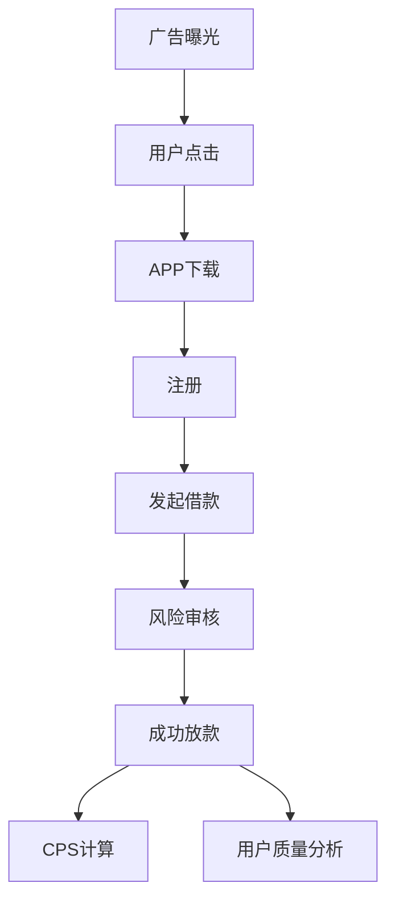
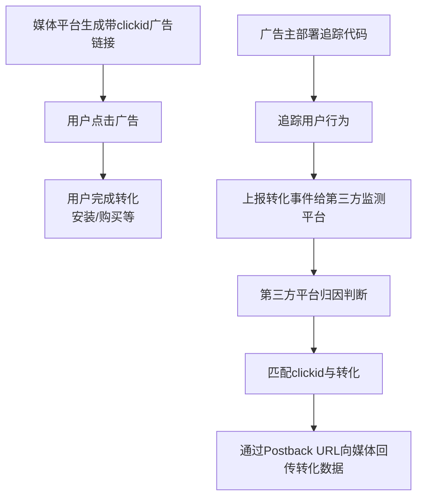
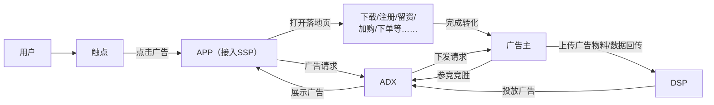
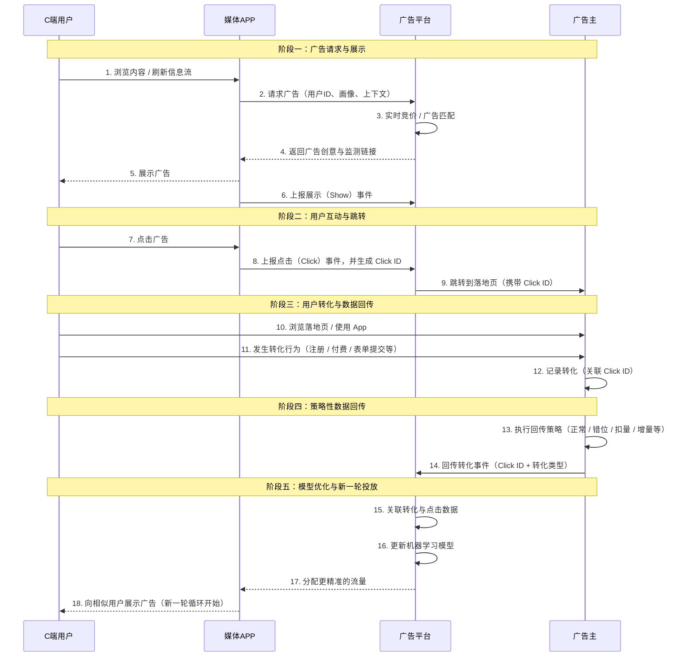

# 信贷投放延伸阅读合集

> 本合集由「06-信贷投放专题」目录下四份延伸阅读文档合并而成：**投放实战合集（十篇）**、**信贷投放博弈论（总论 + 五篇）**、**投放策略与数据分析方法论（十五章）**、**广告回传全流程**。
>
> **合并原则**：四份原文内容全量保留；仅删除原文内重复的段落（如竞价示例的重复小结、重复标题行）与失效的图片占位符；各文档原有标题整体下移一级、并入本合集统一的「部分」结构；原文档各自的目录已并入下方总目录。
>
> 合并时间：2026-09-08

## 总目录

### 第一部分 投放实战合集（十篇）

1. 为什么同样是投流，有人赚钱有人亏？——聊聊投放这件事（投放本质与指标体系）
2. 信贷投放的四大渠道：Google、Facebook、TikTok、应用商店怎么选？怎么配？
3. 预算与节奏：钱要花在"值"的地方（预算线 / 买量线 / 边际 CPS / 预算节奏）
4. 出价高不一定赢？广告竞价的底层逻辑（出价方式 / eCPM / GSP·VCG·GFP / Google vs Meta）
5. 没有归因，投放就是浪费钱——归因（上篇）
6. 归因的底层架构与隐私时代的归因——归因（下篇）
7. 回传的博弈：广告主如何"喂"算法，平台如何反制
8. 素材与创意：海外信贷投放的"第一道风控"
9. 海外信贷投放：印尼、菲律宾、墨西哥的差异化打法
10. iOS 数据不准，信贷投放的 A/B 测试还能信吗？

### 第二部分 信贷投放博弈论（总论 + 五篇）

- 总论：信贷投放博弈全景
- 第 1 篇：学习期与种子人群的攻防战
- 第 2 篇：归因与回传策略的较量
- 第 3 篇：产品命名与行业归属的灰度操作
- 第 4 篇：素材与创意的暗战
- 第 5 篇：AI Agent 时代的新博弈

### 第三部分 投放策略与数据分析方法论（十五章）

- 第一篇 投放业务全景（第 1~9 章）：业务逻辑与数据分析师职责 / 广告投放基础概念 / 核心投放指标体系 / 预算制定与目标管理 / 投放异动分析 / 广告归因策略 / 回传策略方法论 / 素材分析方法 / 投放 Dashboard 与数据监控体系
- 第二篇 归因与回传机制深度拆解（第 10~15 章）：确定性归因与概率归因 / 自归因渠道与非自归因渠道 / 归因体系的重要性 / 广告回传机制 / eCPM 广告竞价机制拆解 / 回传策略优化案例

### 第四部分 广告回传全流程

- 什么是广告回传 / 为什么要回传 / 广告回传技术流程 / 广告回传方式
- 核心回传策略（正常·虚拟回传 / 分层回传 / 助攻回传 / 生命周期阶段回传策略）
- 分行业广告主回传指标 / 回传策略选择决策表

---

# 第一部分 投放实战合集（十篇）

> 本合集聚焦海外信贷投放，共 10 篇：投放本质、四大渠道、预算与节奏、竞价机制、归因（上/下）、回传博弈、素材与创意、三大出海市场、A/B 测试。

## 一、为什么同样是投流，有人赚钱有人亏？——聊聊投放这件事

本文是「流量与风控」合集的第一篇，尝试把"投放到底是什么"这件事讲清楚。

主要聊三件事：**投放的本质是什么，投放关注什么，以及怎么才能做得更好。**

### 1. 什么是投放？

"什么是投放"听起来像是一个不需要回答的问题——投放不就是花钱买流量吗？在抖音投广告、在 Google 投关键词、在 Facebook 投信息流，把钱花出去，把人带进来。

这个理解不能算错，但太浅了。

如果投放只是"花钱买流量"，那为什么同样的预算、同样的平台，有人越投越赚钱，有人越投越亏？为什么有些团队花 100 万能带来 200 万的价值，有些团队花 100 万只拿回 80 万？

**根本区别在于：前者把投放当成"系统"在运营，后者把投放当成"动作"在执行。**

投放本质上解决的是三个问题：**谁（目标客群）、在哪（渠道）、怎么触达（素材+出价）**

精准是手段，获取是动作，而真正的目的：**在可持续的成本内，获取能产生正向收益的用户。**

所以，如果让我用一句话定义投放：

> **投放的本质 = 如何更精准地获取能产生可持续正向收益的目标客群。**

**对于信贷的投放，我会把这句话再往前推一步：**

> **信贷投放的目标 = 在风控约束下，以可控成本精准获取"能通过审核、愿意借款、按时还款、持续复借"的用户。**

### 2. 投放关注什么指标？怎么算？

投放的指标很多，但不需要全部记住。按照"从浅到深"的层次，可以分成三层：

- **第一层：前端效率指标** ——流量进得顺不顺
- **第二层：后端效果指标** ——钱花得值不值
- **第三层：经营健康度指标** ——体系是否良性

此外，**信贷投放**还必须在前后端指标之外，增加**风控相关指标** ——这是信贷投放区别于其他投放最核心的地方。

#### 投放指标体系

##### 一、前端效率指标（流量进得顺不顺）

> 核心关注：广告流量获取效率，衡量用户从曝光、点击到转化的前链路表现。

| 指标 | 英文               | 含义         | 计算公式                 | 说明                                                     |
| ---- | ------------------ | ------------ | ------------------------ | -------------------------------------------------------- |
| CPM  | Cost Per Mille     | 千次展示成本 | 消耗 ÷ 展示量 × 1000   | 衡量广告曝光成本，CPM高通常说明流量获取成本较高          |
| CTR  | Click-Through Rate | 点击率       | 点击量 ÷ 展示量 × 100% | 反映素材吸引力，CTR低说明素材吸引力不足或定向不精准      |
| CPC  | Cost Per Click     | 单次点击成本 | 消耗 ÷ 点击量           | 衡量获取一次点击的成本                                   |
| CVR  | Conversion Rate    | 点击转化率   | 转化量 ÷ 点击量 × 100% | 反映落地页承接能力，CTR高但CVR低说明用户点击后未完成转化 |
| CPI  | Cost Per Install   | 单次安装成本 | 消耗 ÷ 安装量           | App推广核心指标，衡量获取一个安装用户成本                |
| CPA  | Cost Per Action    | 单次行为成本 | 消耗 ÷ 转化量           | 衡量用户完成注册、申请等目标行为的成本                   |
| CPS  | Cost Per Sale      | 单次成交成本 | 消耗 ÷ 成交量           | 衡量最终成交用户获取成本                                 |

###### 前端投放漏斗

```
预算
 ↓
CPM（曝光成本）
 ↓
CTR（点击率）
 ↓
CPC（点击成本）
 ↓
CVR（转化率）
 ↓
CPA（行为成本）
 ↓
成交量
 ↓
CPS（成交成本）
```

---

#### 二、后端效果指标（钱花得值不值）

> 核心关注：用户长期价值以及投放投入产出效率。

| 指标     | 英文                      | 含义                 | 计算公式                    | 判断标准                                             |
| -------- | ------------------------- | -------------------- | --------------------------- | ---------------------------------------------------- |
| ROI      | Return On Investment      | 投入产出比           | 收入 ÷ 消耗                | ROI > 1表示收入覆盖成本，需要达到目标ROI才能持续放量 |
| LTV      | Lifetime Value            | 用户生命周期价值     | 单用户生命周期贡献收入      | 衡量用户长期贡献价值                                 |
| CAC      | Customer Acquisition Cost | 用户获取成本         | 总获客成本 ÷ 获客数量      | 不仅包含广告成本，还包括运营、激励等成本             |
| LTV/CAC  | -                         | 用户价值与获客成本比 | LTV ÷ CAC                  | >3通常认为商业模型较健康                             |
| 回本周期 | Payback Period            | 收回获客成本时间     | 累计收入覆盖成本时间        | 越短越好，需要结合现金流考虑                         |
| 留存率   | Retention Rate            | 用户持续使用比例     | N日后仍活跃用户 ÷ 新增用户 | 衡量用户质量和产品粘性                               |

---

#### 三、经营健康指标（体系是否良性）

> 核心关注：投放增长是否具备长期可持续性。

| 指标         | 含义                             | 关注价值                                                           |
| ------------ | -------------------------------- | ------------------------------------------------------------------ |
| 边际获客成本 | 每新增一个用户需要增加多少成本   | 如果边际成本持续升高，说明目标人群接近饱和，需要拓展新渠道或新人群 |
| 渠道集中度   | 用户是否过度依赖少数渠道         | 单一渠道占比过高存在风险，需要优化渠道结构                         |
| 新老客占比   | 新增用户与回流用户比例           | 判断增长主要来源，新客不足说明增长能力下降                         |
| 预算分配效率 | 不同渠道、人群、素材投入产出差异 | 持续调整预算，将资源投入高价值方向                                 |

---

#### 四、信贷投放新增指标（风险相关指标）

> 核心关注：信贷业务中用户质量和资产风险水平。

| 指标       | 英文                        | 含义                       | 说明                                           |
| ---------- | --------------------------- | -------------------------- | ---------------------------------------------- |
| 授信通过率 | Approval Rate               | 申请用户中最终获得授信比例 | 下降可能意味着流量质量下降，或者风控策略收紧   |
| 首逾率     | FPD (First Payment Default) | 首次还款逾期比例           | 反映新客质量，首逾率升高通常意味着获客质量下降 |
| 不良率     | NPL (Non Performing Loan)   | 一定期限内坏账比例         | 衡量资产风险水平                               |
| 复借率     | Repeat Borrowing Rate       | 用户再次借款比例           | 信贷业务利润的重要来源，影响用户生命周期价值   |

---

#### 投放指标体系整体框架

```
投放指标体系

├── 前端效率指标（流量进得顺不顺）
│
│   ├── CPM
│   │   └── 曝光成本
│   │
│   ├── CTR
│   │   └── 点击效率
│   │
│   ├── CPC
│   │   └── 点击成本
│   │
│   ├── CVR
│   │   └── 转化能力
│   │
│   ├── CPA
│   │   └── 用户行为成本
│   │
│   └── CPS
│       └── 成交成本
│
├── 后端效果指标（钱花得值不值）
│
│   ├── ROI
│   │   └── 投入产出效率
│   │
│   ├── LTV
│   │   └── 用户长期价值
│   │
│   ├── CAC
│   │   └── 用户获取成本
│   │
│   ├── LTV/CAC
│   │   └── 商业健康度
│   │
│   ├── 回本周期
│   │   └── 资金回收速度
│   │
│   └── 留存率
│       └── 用户质量
│
├── 经营健康指标（是否可持续）
│
│   ├── 边际获客成本
│   ├── 渠道集中度
│   ├── 新老客占比
│   └── 预算分配效率
│
└── 信贷投放指标（风险控制）
  
    ├── 授信通过率
    ├── 首逾率 FPD
    ├── 不良率 NPL
    └── 复借率
```

---

#### 信贷投放指标核心关注逻辑

```
流量质量
   ↓
申请转化
   ↓
授信通过
   ↓
首次还款表现
   ↓
长期复借价值
   ↓
用户生命周期价值

对应指标：

CTR / CVR
        ↓
Approval Rate
        ↓
FPD
        ↓
NPL
        ↓
Repeat Borrowing Rate
        ↓
LTV
```

### 3. 投放做的到底是什么？

投放的日常工作可以拆解为六个模块：

- **预算分配：** 预算是"分散下注"还是"集中押注"？
- **渠道选择：** 在对的地方出现。选择"流量精准但贵"还是"流量便宜但不那么精准"？
- **人群定向：** 找对的人。定向越精准，量越少、价越高；定向越宽，量越大、价越低但质量波动也越大。
- **素材创意：** 说对的话。同一套素材在不同渠道效果完全不一样，需要针对性适配。
- **出价策略：** 在对的时机出现。出价低了跑不动，出价高了亏本，找到平衡点就是投手的核心价值。
- **数据复盘与迭代：** 数据不是用来看的，是用来指导下一步行动的。

这六个模块不是孤立的，而是一个**循环**：

> 预算分配 → 渠道选择 → 人群定向 → 素材创意 → 出价策略 → 数据复盘 → 调整预算分配 → ……

**每跑完一轮，你手上的信息就比上一轮更多、更准，下一轮的决策质量就更高。**

### 4. 如何更好地做投放？

理解本质和指标之后，最后落到那个最实际的问题：**怎么才能做得更好？**

- **目标要对，把"目的"和"手段"分清楚**

  投放的最终目的是**在可控成本内获取能产生正向收益的用户**，而不是把某个指标做得漂亮。目标设错了，后面做得再好也是白费。
- **账要算细，把每一分钱的流向都搞清楚**

  "大概还行"、"差不多"是投放的大忌。算不清账就不知道钱花在哪、花得值不值、下一步该往哪走。
- **拆解要细，大盘是幻觉，拆解才是真相**

  同一个渠道拆到广告系列级别，同一套素材拆到人群包级别。拆得越细，真相越清晰。不拆解，你看到的一切都是平均数，而平均数最容易骗人。
- **测试要勤，把 A/B 测试变成工作习惯**

  投放没有标准答案——别人跑得好的素材，你拿来不一定跑得动；昨天有效的策略，今天可能就失效了。唯一可靠的方法，是持续测试。
- **归因要准，功劳是谁的？如何优化？**

  用户可能看了你的 Facebook 广告、又点了你的 Google 搜索广告、最后直接搜索下载了 App——这个用户算谁的？归因不准，后续所有决策都可能被误导。

### 写在最后

投放不是花钱买流量——**是在用预算和数据，买入有价值的用户资产。**

信贷投放，从来不是追求"量大"，而是追求**"精准识别"**：

> **识别谁需要你，识别谁能借，识别谁会还，识别谁值钱。**

流量只是入口，真正的价值在于：**你带进来的这个人，在他的生命周期里，到底能贡献多少。**

## 二、信贷投放的四大渠道：Google、Facebook、TikTok、应用商店怎么选？怎么配？

聊完投放的本质和指标，接下来自然要回答一个更实际的问题：预算到底该往哪投？

Google、Facebook、TikTok 以及应用商店，是目前出海信贷投放的四大主战场。它们之间不是简单的"哪个更好"的关系，而是各自扮演着完全不同的角色。

### 1. Google Ads：最精准的"需求拦截"

**核心逻辑：人找信息**

用户在搜索框里输入关键词的那一刻，意图已经非常明确。Google 搜索广告的转化链路是所有渠道里最短的——用户主动搜索"loan""cash"时，已经处在决策的最后一环。

从搜索到下载、付费、使用行为，Google 能看到完整的用户行为链条，模型能预测 LTV 和 ROAS。

**信贷场景下的定位：**

最适合做"收割"——当用户搜索"快速贷款""印尼现金贷"时，Google 广告是拦截这些高意向流量的最佳工具。

### 2. Facebook/Meta Ads：最精准的"人群圈选"

**核心逻辑：信息找人**

如果说 Google 是"人找信息"，那 Facebook 就是"信息找人"——用户在刷动态、看视频，你通过精准定向把广告推到他面前。

通过类似受众（LAL）、兴趣包等方法，基于用户的兴趣、行为、社交关系做精准圈人。创意质量直接决定广告成败，一个好素材甚至可以"拉爆"一个广告系列。

**信贷场景下的定位：**

Facebook 是海外 APP 投放的稳量核心渠道。适合在用户还没有明确借款需求时，通过社交场景建立品牌认知。

### 3. TikTok Ads：最低成本的"兴趣引爆"

**核心逻辑：算法推荐 + 内容种草**

用户在刷短视频时被你的内容吸引，从"不知道"到"被种草"可能只需要 3 秒。爆发力极强——单个素材一旦命中算法，安装量可能在极短时间内指数级增长，低预算即可撬动海量曝光。

**信贷场景下的定位：**

海外 APP 投放的爆发拉新渠道，核心触达年轻增量用户。

需要注意：TikTok 投放效果起伏较大，单个素材的黄金投放周期只有几天，需要持续不断地产出大量素材。此外，TikTok 点击归因周期只有 1 天，对长周期转化的信贷产品来说，归因难度较大。

### 4. 应用商店（ASA / Google Play）：最高质量的"精准流量"

**核心逻辑：意图截获**

应用商店投放与其他三个渠道有本质区别——用户已经打开了应用商店，意图已经非常明确：我要下载一个 APP。

- **ASO（应用商店优化）：** 通过优化标题、关键词、图标、截图等提升自然搜索排名，是一种"低成本获客"手段，效应是累积的。
- **ASA（Apple Search Ads）：** 仅限 iOS 生态，覆盖 App Store 搜索和推荐位，用户质量高、转化率高。

**信贷场景下的定位：**

最适合"补量"和"精准获客"。如果信贷产品的目标客群偏高端，ASA 是绕不开的渠道。

补充说明：Google Play 的投放逻辑与 Google Ads UAC 有重叠，实际投放中建议统一规划，避免内部竞争。

### 5. 一张图看懂四大渠道的差异

#### 不同投放渠道用户特征对比

| 维度         | Google               | Facebook / Meta      | TikTok               | 应用商店             |
| ------------ | -------------------- | -------------------- | -------------------- | -------------------- |
| 核心逻辑     | 需求拦截（人找信息） | 人群圈选（信息找人） | 兴趣引爆（内容种草） | 意图拦截（我要下载） |
| 用户意图     | 极高（主动搜索）     | 低（被动浏览）       | 中低（娱乐心态）     | 极高（主动下载）     |
| 核心用户年龄 | 全年龄段             | 25-44岁为主          | 16-30岁为主          | 全年龄段             |
| 起量速度     | 慢（模型学习期）     | 中（素材切换快）     | 快（爆发式）         | 慢                   |
| 稳定性       | 高（长期稳定）       | 中（素材疲劳会掉）   | 低（波动较大）       | 高                   |
| 归因周期     | 30天（点击）         | 28天（点击）         | 1天（点击）          | 取决于具体渠道       |
| 最适合场景   | 收割高意向流量       | 长期铺量拉新         | 冷启动爆发           | 补充高质量用户       |

---

#### 渠道投放特点总结

##### Google

###### 核心特点

- 用户主动搜索，需求明确
- 用户意图最高
- 更适合承接已有需求用户

###### 优势

- 转化质量高
- 长期稳定
- 高意向流量获取能力强

###### 劣势

- 起量速度慢
- 需要模型学习周期

###### 适合场景

> 收割高意向流量

---

##### Facebook / Meta

###### 核心特点

- 基于用户画像和兴趣进行人群匹配
- 主动发现潜在用户

###### 优势

- 人群覆盖广
- 素材测试灵活
- 适合规模化拉新

###### 劣势

- 用户主动意愿较低
- 素材容易疲劳，需要持续优化

###### 适合场景

> 长期铺量拉新

---

##### TikTok

###### 核心特点

- 依靠内容兴趣触发用户需求
- 通过算法快速探索人群

###### 优势

- 起量速度快
- 爆发能力强
- 适合冷启动测试

###### 劣势

- 流量波动大
- 用户购买/申请意愿相对弱

###### 适合场景

> 冷启动爆发

---

##### 应用商店

###### 核心特点

- 用户已经具备下载意愿
- 直接承接应用需求

###### 优势

- 用户意图高
- 用户质量稳定

###### 劣势

- 起量较慢
- 依赖具体渠道能力

###### 适合场景

> 补充高质量用户

---

#### 信贷业务投放策略建议

```
用户意愿

高
│
│        Google        应用商店
│
│
│
│        Meta
│
│
│        TikTok
│
低
└────────────────────
      起量速度
```

##### 不同阶段组合策略

| 阶段           | 推荐渠道          | 核心目标           |
| -------------- | ----------------- | ------------------ |
| 冷启动阶段     | TikTok + Meta     | 快速探索用户和素材 |
| 稳定增长阶段   | Meta + Google     | 平衡规模与质量     |
| 高质量获客阶段 | Google + 应用商店 | 获取高意向用户     |
| 大规模放量阶段 | 多渠道组合        | 控制成本，提高LTV  |

```
需求捕获 → Google / 应用商店

人群扩展 → Meta

兴趣激发 → TikTok

最终目标 → 提升用户质量，提高LTV/CAC
```

### 6. 信贷投放的特殊考量

信贷投放选择渠道时，有几个特殊问题需要额外注意：

1. **合规风险是第一道坎**

   金融类广告在海外属于"高敏感"类别。Google、Facebook、TikTok 对金融广告的审核政策各不相同，开户前务必搞清楚每个平台的政策要求。

   以 Google 为例，金融广告有三条红线：年化利率（APR）、还款期限、产品透明度。任何一条踩线，都可能面临封户风险。
2. **归因周期与信贷回款周期不匹配**

   TikTok 的归因周期只有 1 天，但信贷产品的回款周期可能是 7 天、14 天甚至 30 天。这意味着 TikTok 带来的用户质量，可能需要一个月后才能准确评估。
3. **用户质量 vs 用户数量**

   Facebook 早期拉量快，但用户留存和 LTV 通常不如 Google。信贷投放的核心是"找能还钱的人"而不是"找愿意借钱的人"——渠道选择时要优先考虑用户质量，而非单纯的获客成本。
4. **多渠道投放的数据衔接**

   三个渠道的归因逻辑和周期不同，需要建立统一的归因框架（如 AppsFlyer）来评估各渠道的真实贡献，避免重复计算或漏算。

### 7. 小结

没有哪个渠道是"最好"的，关键是在正确的时候、用正确的渠道、达成正确的目标。

#### 投放渠道角色定位

| 渠道            | 角色 | 一句话                             |
| --------------- | ---- | ---------------------------------- |
| Google          | 守   | 拦截高意向流量，守住转化的最后一环 |
| Facebook / Meta | 养   | 精准圈人，长期培养用户认知         |
| TikTok          | 冲   | 低成本爆发，快速拉新               |
| 应用商店        | 补   | 高质量补量，提升整体用户质量       |

---

#### 渠道组合策略

```
TikTok
  ↓
快速探索用户 + 低成本拉新

Facebook / Meta
  ↓
持续触达用户 + 培养用户认知

Google
  ↓
承接高意向需求 + 提升转化效率

应用商店
  ↓
补充高质量用户 + 优化整体质量
```

---

#### 信贷业务投放定位

| 渠道            | 核心目标             | 关注指标                     |
| --------------- | -------------------- | ---------------------------- |
| Google          | 收割明确贷款需求用户 | CVR、CPA、Approval Rate、FPD |
| Facebook / Meta | 扩大目标人群池       | CAC、LTV、留存率             |
| TikTok          | 快速获取新用户       | CPM、CTR、CPC、注册成本      |
| 应用商店        | 获取高质量用户       | 授信率、复借率、LTV          |

---

#### 总体策略

> **TikTok 负责冲规模，Facebook 负责养用户，Google 负责收转化，应用商店负责补质量。**

形成：

```
规模增长 → TikTok
用户培育 → Facebook
高意向转化 → Google
质量优化 → 应用商店
```

一个成熟的信贷投放组合：

- **主力：** Google + Facebook（占 70-80%）
- **创新测试：** TikTok（10-15%）
- **补充：** 应用商店（10-15%）
- **剩余预算：** 用于探索新渠道

### 附录：ROAS 是什么？

ROAS = Return On Advertising Spend，中文叫广告支出回报率。

衡量的是：每花一块钱广告费，能直接赚回多少钱的营收。

**计算公式：**

> ROAS = 广告带来的收入 ÷ 广告花费 × 100%

**ROAS vs ROI（千万别搞混）**

#### ROAS 与 ROI 对比

| 对比维度     | ROAS                            | ROI                                                |
| ------------ | ------------------------------- | -------------------------------------------------- |
| 全称         | Return On Advertising Spend     | Return On Investment                               |
| 中文         | 广告支出回报率                  | 投资回报率                                         |
| 计算公式     | 收入 ÷ 广告花费                | （收入 - 全部成本）÷ 全部成本                     |
| 考虑哪些成本 | 只看广告费用                    | 广告费 + 资金成本 + 坏账损失 + 运营成本 + 其他成本 |
| 结果意义     | 广告投放的“营收倍数”          | 业务整体的“净利润率”                             |
| 能大于100%吗 | 可以，通常300%+说明投放效率较好 | 不一定，需要考虑全部成本，超过0%才表示盈利         |

---

#### ROAS vs ROI 核心区别

##### ROAS（广告投放效率）

关注：

> 花 1 元广告费，带来了多少收入。

公式：

```
ROAS = 广告收入 ÷ 广告花费
```

示例：

```
广告花费：10,000元

带来收入：40,000元

ROAS = 40,000 ÷ 10,000 = 4

即 ROAS = 400%
```

说明：

- 每投入 1 元广告费，产生 4 元收入
- 主要用于衡量渠道和广告效果

---

##### ROI（业务真实盈利能力）

关注：

> 扣除所有业务成本后，投入是否赚钱。

公式：

```
ROI = （收入 - 全部成本）÷ 全部成本
```

成本包括：

```
广告成本
+
资金成本
+
坏账损失
+
运营成本
+
人工成本
+
其他业务成本
```

示例：

```
收入：100,000元

广告成本：20,000元
资金成本：15,000元
坏账损失：10,000元
运营成本：5,000元

总成本：50,000元

ROI = (100,000 - 50,000) ÷ 50,000

= 100%
```

说明：

- ROAS看广告是否有效
- ROI看业务是否赚钱

---

#### 信贷投放场景中的关系

```
广告投放

    ↓

ROAS
（广告带来的收入效率）

    ↓

扣除业务成本

    ↓

ROI
（真实盈利能力）
```

---

#### 信贷业务重点关注

| 阶段         | 关注指标 | 目的                     |
| ------------ | -------- | ------------------------ |
| 渠道测试     | ROAS     | 判断广告流量是否值得投入 |
| 用户质量评估 | LTV/CAC  | 判断用户长期价值         |
| 业务经营     | ROI      | 判断整体是否盈利         |
| 长期增长     | LTV      | 判断用户生命周期贡献     |

---

#### 核心总结

> **ROAS 衡量“广告投得好不好”，ROI 衡量“业务赚不赚钱”。**

对于信贷业务：

```
ROAS ↑
不代表
ROI ↑

因为还需要考虑：

用户质量
↓
审批通过率
↓
放款金额
↓
还款表现
↓
坏账成本
↓
最终利润
```

核心结论：ROAS 高 ≠ 一定赚钱。ROAS 是广告侧的效率指标，ROI 才是业务侧的生死指标。信贷投放尤其要关注长期 ROAS（D30、D90、D180），把时间拉长到回款周期结束，才能真正判断一个渠道值不值得继续投入。

信贷投放的核心逻辑之一：不是看今天花出去的钱今天能回来多少，而是跟踪这个用户在未来 3 个月、6 个月里累计贡献的收入，计算"长期 ROAS"（本质就是 LTV / CAC 的另一种表达方式）。

## 三、预算与节奏：钱要花在"值"的地方

前两篇我们聊了投放的本质、指标体系，以及四大渠道怎么选、怎么配。这一篇，我们把视角从"投什么"转向"怎么投"？预算怎么定？节奏怎么控？钱怎么花才算"值"？

钱怎么花？什么时候花？花多少？

这不是简单的"预算分配"，而是投放的节奏控制。预算花得太慢，量起不来，市场被竞品抢占；花得太快，成本失控，ROI 被打穿。

预算是投放节奏的方向盘——花在哪儿、花多少、什么时候花，决定了投放这辆车是平稳行驶还是冲出赛道。

这篇文章，我们把预算与节奏的核心逻辑拆开来看：买量线怎么定？边际 CPS 怎么算？预算节奏怎么把控？

### 1. 预算目标：先算账，再花钱

**1.1 算清盈亏线：LTV 是预算的起点**

投放预算不是拍脑袋定的——它由业务端反推而来。

> 预算 = 目标放款量 × CPS

预算的上限，取决于你能接受的获客成本。而获客成本的底线，由用户的生命周期价值（LTV）决定。

逻辑链条是这样的：

> 用户 LTV → 可接受的 CPS 上限 → 可接受的 CPA 上限 → 反推各环节转化率要求 → 确定各渠道预算分配

举个例子：

- 一个新客的 LTV = 500 元（利息收入 − 资金成本 − 坏账损失 − 其他成本）
- 你要求投放端 LTV/CAC ≥ 3，即获客成本 ≤ 167 元
- 如果当前授信通过率 = 20%、放款转化率 = 60%，那么当 CPS = 167 元时，CPA（发起借款的成本）= 167 × 20% × 60% = 20 元
- 每个环节的成本都不能超过这个天花板，否则整体模型算不过账

也就是说，每个环节的成本上限，都是由 LTV 倒推出来的——不是"能花多少花多少"，而是"花到能赚回来的程度"。

**1.2 三个关键的预算线**

#### 投放预算控制线

| 预算线     | 定义                      | 说明                                           |
| ---------- | ------------------------- | ---------------------------------------------- |
| 盈亏平衡线 | 获客成本 = 用户LTV        | 花出去的钱刚好等于用户贡献的价值，不赚不亏     |
| 目标ROI线  | 获客成本 = LTV ÷ 目标ROI | 在保证利润目标的前提下，能够接受的最高获客成本 |
| 止损线     | 预设的最大允许成本        | 当某渠道的CPS超过预算线时，立即暂停或减少预算  |

---

#### 三条预算控制线逻辑

##### 1. 盈亏平衡线

公式：

```
获客成本 = 用户LTV
```

含义：

- 用户产生的长期价值刚好覆盖获客成本
- 业务处于盈亏平衡状态
- 不盈利，也不亏损

示例：

```
用户LTV = 500元

可接受最高获客成本 = 500元
```

---

##### 2. 目标ROI线

公式：

```
获客成本 = LTV ÷ 目标ROI
```

含义：

- 在满足业务利润目标的情况下
- 计算可以接受的最高获客成本

示例：

```
用户LTV = 1000元

目标ROI = 200%

最大获客成本：

1000 ÷ 2 = 500元
```

即：

> 每获取一个用户最多花费500元，才能满足目标收益。

---

##### 3. 止损线

定义：

```
预设最大允许获客成本
```

含义：

- 当渠道成本持续超过限制
- 说明投放效率不足
- 需要降低预算或暂停投放

示例：

```
渠道CPS > 止损线

↓

减少预算 / 暂停渠道

↓

重新优化素材、人群或策略
```

---

#### 信贷投放预算管理逻辑

```
用户LTV

    ↓

计算最大可接受CAC

    ↓

设置目标ROI线

    ↓

渠道投放

    ↓

监控CPS / CAC

    ↓

超过止损线？

    ├── 否 → 持续放量
    │
    └── 是 → 降预算 / 优化 / 暂停
```

---

#### 核心总结

| 控制线     | 解决的问题           |
| ---------- | -------------------- |
| 盈亏平衡线 | 这个用户值不值得买   |
| 目标ROI线  | 应该花多少钱买用户   |
| 止损线     | 什么时候停止继续投入 |

> 投放预算管理的核心：以用户长期价值（LTV）为基础，通过ROI目标约束获客成本，通过止损线控制风险。

### 2. 买量线：每获客一个放款用户，最多花多少钱不亏

买量线是预算管理中最重要的概念——它定义了：为了获取一个放款用户，你最多愿意花多少钱。

**2.1 买量线的核心逻辑**

- 理想情况：实际 CPS = 买量线，说明刚好达到成本预期
- 实际情况：实际 CPS < 买量线，说明可加大投放力度；实际 CPS > 买量线，说明需要优化或暂停

**2.2 买量线的计算公式**

> 买量线 = 用户 LTV × 目标利润率系数

注：目标利润率系数取决于业务阶段。如果是扩张期，可以接受微亏换规模，系数可能 >1；如果是盈利期，系数 <1。

**2.3 简化的计算示例（其它成本暂不考虑）**

#### 用户LTV测算示例

##### 一、基础假设

| 项目               | 计算    |
| ------------------ | ------- |
| 单用户平均借款金额 | 5,000元 |
| 平均借款周期       | 30天    |
| 年化利率           | 36%     |
| 用户平均复借次数   | 3次/年  |

---

##### 二、收入测算

| 项目            | 计算               | 结果  |
| --------------- | ------------------ | ----- |
| 单笔利息收入    | 5,000 × 36% ÷ 12 | 150元 |
| 年LTV（毛收入） | 150 × 3次复借     | 450元 |

说明：

> 用户一年平均贡献450元利息收入。

---

##### 三、成本扣除

###### 1. 资金成本

假设：

```
年化资金成本 = 8%
```

计算：

```
5,000 × 8% × 3 ÷ 12
= 100元
```

| 项目       | 金额  |
| ---------- | ----- |
| 年资金成本 | 100元 |

---

###### 2. 坏账损失

假设：

```
坏账率 = 3%
```

计算：

```
5,000 × 3% × 3
= 450元
```

说明：

> 实际按风险敞口预估。

| 项目       | 金额  |
| ---------- | ----- |
| 年坏账损失 | 450元 |

---

##### 四、净LTV计算

公式：

```
净LTV = 毛LTV - 资金成本 - 坏账损失
```

计算：

```
净LTV

= 450 - 100 - 450

= -100元
```

结果：

| 项目            |   金额 |
| --------------- | -----: |
| 年LTV（毛收入） |  450元 |
| 资金成本        | -100元 |
| 坏账损失        | -450元 |
| 净LTV           | -100元 |

---

#### 信贷投放价值判断

```
用户收入贡献（LTV）

        ↓

扣除资金成本

        ↓

扣除风险成本（坏账）

        ↓

得到真实用户价值（净LTV）
```

##### 核心结论

- 不能只看贷款金额或利息收入，需要关注净LTV。
- 如果净LTV < 0：

  - 用户长期价值不足；
  - 获客成本越高，亏损越严重；
  - 需要优化获客渠道、人群质量或风险策略。
- 如果净LTV > CAC：

  - 用户具备投放价值；
  - 可以扩大投放规模。

---

#### 投放决策关系

```
净LTV

  >

获客成本 CAC

  ↓

用户值得购买

  ↓

扩大投放

```

简化例子说明：如果 LTV 算出来是负的，整个业务模型就不成立。要么提高利率/复借率，要么降低坏账率/资金成本，要么降低获客成本，否则投得越多亏得越多。

如果调整策略后，净 LTV 变成 300 元，且目标 ROI 为 20%，那么：

> 最大可接受 CPS = 300 ÷ (1+20%) = 250 元

买量线就定在 250 元。

### 3. 边际 CPS：新增用户到底值不值

预算管理不是"算总账"就完了——新增量的成本可能完全不同于存量。

**3.1 什么是边际 CPS？**

边际 CPS 衡量的是：每多花一笔预算，每多获取一个放款用户，新增的成本是多少。

**3.2 计算示例**

#### 边际获客成本（Marginal CAC）测算

##### 一、投放规模变化

| 维度       |    本月 |    下月 |   变化 |
| ---------- | ------: | ------: | -----: |
| 投放预算   |   200万 |   300万 | +100万 |
| 放款用户数 | 2,000人 | 2,800人 | +800人 |
| 平均CPS    | 1,000元 | 1,071元 |  +71元 |
| 边际CPS    |       - | 1,250元 |      - |

---

##### 二、指标计算

###### 1. 平均CPS

公式：

```
平均CPS = 投放预算 ÷ 放款用户数
```

本月：

```
200万 ÷ 2000人 = 1000元/人
```

下月：

```
300万 ÷ 2800人 ≈ 1071元/人
```

说明：

> 整体获客成本从1000元提升至1071元。

---

###### 2. 边际CPS

公式：

```
边际CPS =
新增预算 ÷ 新增用户数
```

计算：

```
(300万 - 200万) ÷ (2800 - 2000)

= 100万 ÷ 800

= 1250元/人
```

---

##### 三、核心含义

| 指标    | 含义                             |
| ------- | -------------------------------- |
| 平均CPS | 当前整体获客成本水平             |
| 边际CPS | 额外增加预算后，新获取用户的成本 |

---

#### 投放决策意义

```
预算增加

    ↓

新增用户增长

    ↓

计算边际CPS

    ↓

与目标CAC / LTV比较

```

判断：

###### 情况1：边际CPS < 用户价值

```
边际CPS < LTV
```

说明：

- 新增预算仍然有效
- 可以继续放量

###### 情况2：边际CPS > 用户价值

```
边际CPS > LTV
```

说明：

- 增量用户成本过高
- 继续投入可能亏损
- 需要优化渠道、人群或素材

---

#### 信贷投放中的应用

例如：

```
用户净LTV = 1500元

目标CAC = 1000元

当前平均CPS = 1000元

边际CPS = 1250元
```

判断：

- 当前整体投放仍可接受
- 但新增预算的人群质量下降
- 需要关注边际用户价值

---

#### 核心结论

> 平均CPS看当前投放效率，边际CPS看继续扩量是否值得。

在预算扩张阶段：

```
不要只看平均成本下降/上升

重点关注：

新增预算带来的新增用户成本

即：

边际CPS
```

解读：

- 平均 CPS 从 1,000 元涨到 1,071 元，看起来涨幅不大
- 但边际 CPS 达到了 1,250 元——说明新增的 800 个用户，每个花了 1,250 元
- 如果买量线是 1,100 元，那这批新增用户就是亏钱的

**3.3 边际 CPS 的三种形态**

#### 边际CPS变化分析

##### 一、边际CPS变化形态

| 形态         | 边际CPS变化        | 含义                                                                     |
| ------------ | ------------------ | ------------------------------------------------------------------------ |
| 规模效应     | 边际CPS < 平均CPS  | 随着投放量增加，成本反而下降，通常在冷启动期出现，因为模型持续学习并优化 |
| 线性增长     | 边际CPS ≈ 平均CPS | 成本保持稳定，可以持续加量                                               |
| 边际效应递减 | 边际CPS > 平均CPS  | 新增用户越来越贵，需要警惕，是大部分渠道扩量后的常态                     |

---

#### 二、投放扩量判断逻辑

```
增加预算

    ↓

观察新增用户成本（边际CPS）

    ↓

与平均CPS比较

    ↓

判断是否继续扩量
```

---

##### 情况1：规模效应

公式：

```
边际CPS < 平均CPS
```

说明：

- 新增预算带来的用户成本更低
- 算法模型持续优化
- 人群匹配效率提升

策略：

```
继续增加预算
扩大投放规模
```

---

##### 情况2：线性增长

公式：

```
边际CPS ≈ 平均CPS
```

说明：

- 投放效率稳定
- 新增用户成本没有明显变化

策略：

```
保持当前投放节奏
持续观察LTV和ROI
```

---

##### 情况3：边际效应递减

公式：

```
边际CPS > 平均CPS
```

说明：

- 优质用户已经被覆盖
- 新增用户质量下降
- 获取同等价值用户需要更高成本

策略：

```
降低扩量速度

↓

优化：

- 投放人群
- 素材策略
- 渠道组合
- 出价策略
```

---

#### 三、信贷投放应用

在信贷业务中：

```
边际CPS

    vs

用户净LTV
```

是判断是否继续扩量的核心。

| 判断             | 结果             | 策略               |
| ---------------- | ---------------- | ------------------ |
| 边际CPS < 净LTV  | 增量用户仍有价值 | 可以继续放量       |
| 边际CPS ≈ 净LTV | 接近盈亏平衡     | 控制节奏           |
| 边际CPS > 净LTV  | 增量用户亏损     | 停止扩量或优化策略 |

---

#### 核心结论

> 平均CPS决定当前投放效率，边际CPS决定下一笔预算是否值得投入。

扩量过程中重点关注：

```
新增预算

↓

新增用户

↓

边际CPS变化

↓

用户LTV变化

↓

决定继续扩量还是收缩
```

### 4. 预算节奏：什么时候花、花多少

**4.1 预算节奏的两个维度**

#### 投放预算分配核心问题

| 维度     | 核心问题                                                         |
| -------- | ---------------------------------------------------------------- |
| 时间维度 | 预算如何分配到天/周/月？月初花多少？月中花多少？月末花多少？     |
| 渠道维度 | 预算在不同渠道之间如何分配？哪个渠道优先放量？哪个渠道作为补充？ |

---

#### 一、时间维度预算管理

核心关注：

> 如何根据用户需求、渠道表现和业务目标，在不同时间周期合理分配预算。

需要考虑：

| 时间阶段 | 关注问题                                     |
| -------- | -------------------------------------------- |
| 月初     | 是否快速测试渠道效果？是否需要提前抢占流量？ |
| 月中     | 根据投放效果动态调整预算，提高资金利用率     |
| 月末     | 是否冲刺目标？是否控制成本避免低效消耗       |

预算分配逻辑：

```
月度预算

    ↓

拆分到周

    ↓

拆分到每日

    ↓

根据实时效果动态调整
```

---

#### 二、渠道维度预算管理

核心关注：

> 不同渠道承担不同角色，需要根据渠道价值进行预算分配。

渠道定位：

| 渠道            | 角色               | 预算策略                     |
| --------------- | ------------------ | ---------------------------- |
| Google          | 收割高意向用户     | 保证稳定预算，获取高质量转化 |
| Facebook / Meta | 人群培养和规模增长 | 持续投入，扩大用户池         |
| TikTok          | 快速探索和拉新     | 测试预算，寻找增长机会       |
| 应用商店        | 补充高质量用户     | 根据用户质量灵活调整         |

---

#### 预算优化核心逻辑

```
预算分配

    ↓

渠道表现分析

    ↓

用户质量评估

    ↓

ROI / LTV / CPS判断

    ↓

预算迁移

    ↓

提升整体投放效率
```

---

#### 信贷投放场景重点关注

预算调整不能只看：

```
点击成本
注册成本
申请成本
```

需要结合：

```
获客成本 CAC

↓

授信通过率

↓

放款率

↓

首逾率 FPD

↓

复借率

↓

净LTV

↓

ROI
```

最终目标：

> 将预算从低价值流量迁移到高LTV、高ROI用户群体。

**4.2 预算节奏的常见误区**

- 预算平均分配：每天花一样的钱，忽略了用户行为的周期性（如：周末/发薪日转化率不同）
- 预算一次性花完：月初狂烧，月中预算耗尽，错过了后续的优质流量
- 预算集中投单一渠道：渠道政策变化可能导致全盘崩掉
- 预算不设止损：某个渠道 ROI 下降却不暂停，持续亏损

**4.3 预算节奏的实操策略**

- 冷启动期：小预算测试、多方向探索，找到盈利渠道和素材方向
- 放量期：将预算集中到已验证的高 ROI 渠道和素材上
- 稳定期：主力渠道匀速放量，测试渠道保持 15-20% 的探索预算
- 收缩期：当市场成本普涨超过买量线时，缩减预算、只保留核心渠道

**4.4 预算节奏的"生命周期"管理**

任何一个渠道、一套素材，都有自己的生命周期。

#### 投放预算阶段管理

| 阶段   | 时间    | 预算占比   | 核心目标                       |
| ------ | ------- | ---------- | ------------------------------ |
| 起量期 | 1-7天   | 5%-10%     | 测试渠道效果，通过验证后再放大 |
| 放量期 | 7-30天  | 50%-70%    | 快速扩大规模，获取更多用户     |
| 稳定期 | 30-60天 | 20%-30%    | 保持稳定投放，优化成本和质量   |
| 衰退期 | 60天+   | 降低或暂停 | 寻找替代方案，避免低效投入     |

---

#### 投放阶段策略

##### 1. 起量期（1-7天）

###### 预算策略

```
投入预算：5%-10%
```

###### 核心目标

- 测试渠道是否有效
- 验证素材、人群、出价策略
- 判断是否具备放量潜力

###### 重点关注指标

```
CTR
↓
CVR
↓
CPA/CPS
↓
用户质量
```

判断：

```
效果达标 → 增加预算

效果不足 → 优化或停止
```

---

##### 2. 放量期（7-30天）

###### 预算策略

```
投入预算：50%-70%
```

###### 核心目标

- 快速扩大用户规模
- 提升获客数量
- 获取市场份额

###### 重点关注指标

```
边际CPS

+

ROI

+

用户质量
```

策略：

- 持续增加预算
- 控制边际成本增长
- 避免规模扩大导致用户质量下降

---

##### 3. 稳定期（30-60天）

###### 预算策略

```
投入预算：20%-30%
```

###### 核心目标

- 保持稳定获客
- 优化投放效率
- 提升用户价值

###### 重点关注指标

```
CAC
LTV/CAC
ROI
FPD
复借率
```

策略：

- 优化渠道组合
- 淘汰低质量流量
- 提升用户生命周期价值

---

##### 4. 衰退期（60天+）

###### 预算策略

```
降低预算或暂停
```

###### 核心目标

- 识别渠道衰退原因
- 寻找新的增长来源

###### 常见原因

- 人群覆盖饱和
- 素材疲劳
- 获客成本上升
- 用户质量下降

策略：

```
降低预算

↓

测试新渠道

↓

替换素材/人群

↓

重新进入起量期
```

---

#### 投放生命周期模型

```
起量期
  ↓
验证渠道价值

放量期
  ↓
扩大规模

稳定期
  ↓
优化效率

衰退期
  ↓
寻找新的增长机会
```

---

#### 信贷业务投放核心逻辑

```
测试流量质量

        ↓

扩大有效渠道

        ↓

控制边际CPS

        ↓

提升净LTV

        ↓

实现长期ROI增长
```

### 写在最后

预算和节奏管理，表面是控成本，本质是提效率。

花钱之前先算账——这笔钱花出去，能赚回来多少？低于买量线，大胆投；高于买量线，果断停。

## 四、出价高不一定赢？广告竞价的底层逻辑

投放不是在"买流量"，而是在"竞拍用户注意力"。

这一篇，我们把视角拉到最底层：广告竞价到底是怎么运作的？"竞拍"到底怎么拍？出价最高就一定赢吗？赢了之后付多少钱？为什么同样的出价，在 Google 和 Facebook 上效果完全不同？

### 1. 主流的出价方式：CPM、CPC、CPA、oCPX

在竞价之前，广告主首先需要选择以什么方式出价。这是广告主主动选择的策略，决定了"你愿意为什么样的结果付费"。

#### 广告出价方式对比

| 对比维度   | CPM                        | CPC                                  | CPA                               | oCPM / oCPC / oCPA                 |
| ---------- | -------------------------- | ------------------------------------ | --------------------------------- | ---------------------------------- |
| 计费逻辑   | 每展示1000次付费           | 用户点击一次付费                     | 用户完成转化付费                  | 设定目标成本，平台自动优化         |
| 谁承担风险 | 广告主承担全部风险         | 平台承担展示风险，广告主承担转化风险 | 平台承担大部分风险                | 平台承担优化责任                   |
| 适用场景   | 品牌曝光                   | 效果导向的点击获取                   | 效果导向的转化                    | 追求稳定成本的规模化投放           |
| 优点       | 简单透明，CPM稳定可控      | 只为兴趣付费，用户至少表达了兴趣     | 广告主承担风险少，只关注结果      | 成本可控，平台自动优化             |
| 缺点       | 不保证效果，展示可能被浪费 | 点击不意味着转化                     | 平台可能提高价格，导致CPA单价上涨 | 算法需要足够的数据样本才能有效优化 |

---

#### 各出价模式说明

##### 1. CPM（Cost Per Mille）

###### 计费方式

```
按照曝光次数收费

CPM = 消耗 ÷ 展示量 × 1000
```

###### 特点

优势：

- 规则简单透明
- 曝光成本可控
- 适合品牌宣传和大规模曝光

风险：

- 只保证展示，不保证用户行为
- 可能产生低价值曝光

适合：

```
品牌曝光
市场教育
提升认知
```

---

##### 2. CPC（Cost Per Click）

###### 计费方式

```
按照点击次数收费

CPC = 消耗 ÷ 点击量
```

###### 特点

优势：

- 只有用户点击才产生费用
- 用户至少表现出兴趣

风险：

- 点击不代表注册、申请或成交
- 可能出现低质量点击

适合：

```
引流
网站访问
产品了解
```

---

##### 3. CPA（Cost Per Action）

###### 计费方式

```
按照用户完成目标行为收费

CPA = 消耗 ÷ 转化量
```

目标行为包括：

- 注册
- 下载
- 申请
- 购买

###### 特点

优势：

- 广告主风险较低
- 更关注最终业务结果

风险：

- 平台可能提高流量价格
- CPA可能逐渐上涨

适合：

```
明确转化目标的效果广告
```

---

##### 4. oCPM / oCPC / oCPA

###### 计费方式

```
广告主设定目标成本

平台算法自动寻找高概率用户
```

例如：

```
目标CPA = 100元

系统自动优化：

人群
素材
出价
展示机会
```

###### 特点

优势：

- 平台自动优化
- 成本相对稳定
- 适合规模化投放

风险：

- 需要足够转化数据
- 冷启动阶段效果可能不稳定

适合：

```
成熟投放阶段
大规模效果广告
自动化增长
```

---

#### 信贷投放场景推荐

| 阶段         | 推荐模式      | 原因                   |
| ------------ | ------------- | ---------------------- |
| 冷启动测试   | CPM / CPC     | 快速验证素材、人群     |
| 获取申请用户 | oCPC / oCPA   | 优化高意向用户         |
| 放量阶段     | oCPA          | 控制获客成本，扩大规模 |
| 稳定经营阶段 | CPA + LTV优化 | 关注用户长期价值       |

---

#### 信贷广告优化链路

```
曝光

 ↓

点击

 ↓

注册

 ↓

申请

 ↓

授信

 ↓

放款

 ↓

还款表现

 ↓

用户LTV
```

对应优化目标：

```
CPM → 获取流量

CPC → 获取兴趣用户

CPA → 获取转化用户

oCPA → 获取高价值用户
```

---

#### 核心总结

> CPM关注曝光，CPC关注兴趣，CPA关注结果，oCPM/oCPC/oCPA关注算法驱动的规模化效果。

在信贷业务中，最终目标不是最低CPA，而是：

```
最低获客成本

+

最高用户质量

+

最高净LTV

=

最优投放ROI
```

oCPX 的本质是：广告主表达"我想要什么成本"，平台用算法去实现这个成本目标。

在 oCPX 模式下的 eCPM 计算会动态调整：平台会尝试不同的出价组合，找到既能达成广告主目标成本、又能最大化自身 eCPM 的平衡点。

### 2. eCPM：平台的"通用货币"

**2.1 eCPM 解决了什么问题？**

理解了出价方式，下一个问题是：广告主用不同方式出价（有人出 CPM，有人出 CPC，有人出 CPA），平台怎么放在一起排序？

这就需要引入 eCPM（Effective CPM，有效千次展示成本）。

互联网广告早期的交易非常简单：媒体卖广告位，广告主买广告位，按展示次数付费。这就是 CPM。一个固定的价格，买 1000 次展示，付 1000 次的钱。

问题在于：同样的广告位，不同的广告带来的价值完全不同。

一个卖奢侈品的广告和一个卖快消品的广告，放在同一个位置，点击率可能差 10 倍，转化率可能差 20 倍。如果按同样的 CPM 收费，媒体觉得亏了（好广告应该收更贵），广告主也觉得亏了（差广告凭什么收一样的钱）。

于是行业开始思考：能不能让价格"浮动"？让好广告付更多钱，差广告付更少钱？

这就是 eCPM 的由来——不是"你愿意付多少"，而是"平台实际能赚多少"。

**2.2 eCPM 的公式逻辑**

> eCPM = 出价 × 预估点击率（pCTR）× 预估转化率（pCVR）× 1000

这个公式的核心思想是：平台不关心你"想"付多少钱，平台关心的是"每次展示能帮我赚多少钱"。

- 出价：你愿意为一次点击/转化付多少钱
- pCTR：平台预估用户看到广告后点击的概率
- pCVR：平台预估用户点击后完成转化（下载/注册/借款）的概率

这次展示，我能赚多少？你出价 1 元，预估点 10%，预估转 20% → eCPM = 20 元。

**2.3 为什么 eCPM 是"通用货币"？**

因为无论你在哪个平台投放，无论你用什么出价方式，最终所有广告都要被转换成 eCPM 来参与排序。

#### 不同出价方式 eCPM 计算

##### eCPM 定义

> eCPM（effective Cost Per Mille）表示每千次展示的实际收益，用于统一比较不同广告出价模式的流量价值。

公式：

```
eCPM = 每千次展示收入
```

---

##### 不同出价方式换算

| 出价方式 | eCPM计算公式                       |
| -------- | ---------------------------------- |
| CPM 出价 | eCPM = CPM                         |
| CPC 出价 | eCPM = CPC × pCTR × 1000         |
| CPA 出价 | eCPM = CPA × pCVR × pCTR × 1000 |

---

#### 公式解释

##### 1. CPM 出价

公式：

```
eCPM = CPM
```

说明：

- CPM直接按照曝光收费
- 每1000次展示的收入就是广告主设置的CPM价格

示例：

```
CPM = 50元

eCPM = 50元
```

---

##### 2. CPC 出价

公式：

```
eCPM = CPC × pCTR × 1000
```

其中：

| 参数 | 含义             |
| ---- | ---------------- |
| CPC  | 单次点击价格     |
| pCTR | 预测点击率       |
| 1000 | 换算为每千次曝光 |

示例：

```
CPC = 2元

pCTR = 5%

eCPM = 2 × 5% × 1000

= 100元
```

含义：

> 虽然按照点击收费，但平台会根据预测点击率计算每千次曝光价值。

---

##### 3. CPA 出价

公式：

```
eCPM = CPA × pCVR × pCTR × 1000
```

其中：

| 参数 | 含义               |
| ---- | ------------------ |
| CPA  | 单次转化成本       |
| pCTR | 预测点击率         |
| pCVR | 点击后的预测转化率 |
| 1000 | 曝光换算           |

示例：

```
CPA = 200元

pCTR = 5%

pCVR = 10%

eCPM = 200 × 5% × 10% × 1000

= 100元
```

含义：

> CPA出价不仅考虑点击概率，还考虑点击后完成目标行为的概率。

---

#### 平台排序逻辑

广告平台通常会将不同出价方式统一转换为eCPM：

```
CPM

↓

CPC × 点击概率

↓

CPA × 点击概率 × 转化概率

↓

eCPM排序

↓

决定广告展示机会
```

---

#### 信贷投放场景应用

对于贷款业务：

```
曝光

 ↓ pCTR

点击

 ↓ pCVR

申请

 ↓ Approval Rate

放款

 ↓

用户价值(LTV)
```

因此：

- CPM：关注曝光效率
- CPC：关注点击意愿
- CPA：关注申请转化
- oCPA：进一步优化高价值用户

最终目标：

```
提升eCPM

+

控制CAC

+

提高净LTV

=

提升投放ROI
```

CPM 和 eCPM 的区别在于：CPM 是你"愿意付"的价格，eCPM 是平台"实际能赚"的价格——后者才是平台真正关心的。

谁的广告能给平台带来最高的 eCPM，谁的广告就能赢得展示机会。你不是在和"人"竞争，你是在和"数据"竞争。

这意味着：出价低不一定输，出价高不一定赢。如果你的素材点击率高、落地页转化好，即使出价低于竞争对手，你的 eCPM 仍可能更高——这就是"以小博大"的空间。

eCPM 只是平台的"算账逻辑"——真正决定谁赢、谁付多少钱的，是每个平台自己设计的竞价规则。

### 3. 主流的竞价机制：平台如何决定"谁赢、付多少"

**3.1 出价方式 vs 竞价机制**

出价方式（CPM/CPC/CPA）是"广告主怎么报价"，而竞价机制是"平台怎么定输赢、怎么收费"。

两者是完全不同的概念——前者是广告主的策略选择，后者是平台的规则设计。

任何一个广告竞价机制，都需要回答两个核心问题：

- 问题一：谁赢？——在众多 competing 广告中，如何决定哪个广告获得展示？
- 问题二：付多少？——赢家需要支付多少钱？

这两个问题的答案，决定了平台的收入、广告主的成本、以及整个生态的效率和公平性。

**3.2 主流竞价机制一览**

当前主流的广告竞价机制主要有三种：GSP、VCG 和 GFP。

#### 广告竞价机制对比

| 对比维度       | GSP（广义第二价格）Generalized Second Price | VCGVickrey-Clarke-Groves                   | First Price（一价拍卖）Generalized First Price |
| -------------- | ------------------------------------------- | ------------------------------------------ | ---------------------------------------------- |
| 核心逻辑       | 出价高者赢，支付第二名的价格                | 价值最高者赢，支付给别人造成的损害         | 出价高者赢，支付自己的出价                     |
| 赢者判定       | 按出价（或 Ad Rank）排序                    | 按总价值（出价 × 行动率 × 用户价值）排序 | 按出价排序                                     |
| 扣费规则       | 下一名出价 + 最小增量                       | 被挤掉竞标者的价值之和                     | 自己的出价                                     |
| 典型平台       | Google、TikTok、大部分传统DSP               | Meta（Facebook）                           | 部分RTB交易、部分海外新平台                    |
| 广告主最优策略 | 报真实价值，适度博弈质量分                  | 诚实出价是占优策略                         | 需要预估竞争对手出价                           |
| 注意事项       | 可以“小博大”，优化质量分弥补出价不足      | 任何策略性出价长期都会反噬                 | 信息不对称，容易出价过高或过低                 |

---

#### 一、GSP（Generalized Second Price）

##### 核心逻辑

> 出价最高者获得广告位，但支付第二名的价格。

公式：

```
实际支付价格
=
下一名出价 + 最小增量
```

示例：

```
广告位竞争：

A 出价：5元
B 出价：4元
C 出价：3元

A 获胜

实际支付：

4元 + 最小增量
```

---

##### 特点

优势：

- 降低恶意竞价压力
- 广告主不需要支付自己的最高报价
- 允许通过质量分提升竞争力

风险：

- 需要关注Ad Rank
- 单纯提高出价不一定最优

---

#### 二、VCG（Vickrey-Clarke-Groves）

##### 核心逻辑

> 价值最高的广告主获胜，支付给其他竞标者造成的机会损失。

排序：

```
用户价值 × 出价 × 行动概率
```

而不是单纯看：

```
出价
```

---

##### 特点

优势：

- 更关注真实价值
- 鼓励广告主诚实报价
- 理论上实现效率最大化

风险：

- 计算复杂
- 实际商业系统较少完全采用

典型：

```
Meta（Facebook）
```

---

#### 三、First Price（一价拍卖）

##### 核心逻辑

> 谁出价最高谁赢，并支付自己的报价。

公式：

```
支付价格 = 自己出价
```

示例：

```
A 出价：5元
B 出价：4元

A 获胜

支付：

5元
```

---

##### 特点

优势：

- 规则简单透明
- 平台收益更高

风险：

- 容易出现过度竞价
- 广告主需要预测竞争环境

---

#### 三种竞价机制对比

| 维度       | GSP                 | VCG      | First Price  |
| ---------- | ------------------- | -------- | ------------ |
| 排序依据   | 出价/Ad Rank        | 综合价值 | 出价         |
| 支付价格   | 第二名价格          | 机会成本 | 自己报价     |
| 广告主策略 | 真实价值 + 质量优化 | 诚实报价 | 预测竞争对手 |
| 平台收益   | 中等                | 较低     | 较高         |
| 复杂度     | 中等                | 高       | 低           |
| 常见场景   | 搜索广告、DSP       | 社交广告 | RTB实时竞价  |

---

#### 信贷广告投放中的影响

广告竞价最终目标不是单纯提高出价，而是提升：

```
广告价值

=

出价

×

点击概率

×

转化概率

×

用户价值
```

对于信贷业务：

```
展示机会

↓

点击概率 CTR

↓

申请概率 CVR

↓

审批通过率

↓

放款价值

↓

用户LTV
```

因此：

- 高价值用户可以支撑更高竞价
- 单纯降低CPC不一定带来更高ROI
- 应优化：

```
人群质量

+

转化概率

+

用户生命周期价值
```

三种机制的本质区别是扣费规则：

- GSP：付"下一名"的价格（出价高的人不用付自己的最高价）
- VCG：付"给别人造成的损害"
- GFP：付自己的出价

### 4. Google：GSP + Ad Rank，价格优先，质量为辅

**4.1 为什么 Google 选择了 GSP？**

Google 的核心业务是搜索。用户带着明确意图来到搜索框，广告是"对搜索结果的补充"——广告越相关，用户越满意。

GSP 的逻辑天然契合搜索场景：

- 出价高的人赢，但质量得分可以帮你"打折"
- 质量得分衡量的是广告与搜索词的相关性
- 相关性越高，用户越满意，Google 的长期价值越大

**4.2 Ad Rank：Google 的排名公式**

Google 的排名并不仅仅只看价格，而是看 Ad Rank（广告评级）。

> Ad Rank = 出价 × 质量得分 + 广告附加信息影响

质量得分基于三个核心因素：预估点击率、广告相关性、落地页体验。

实际扣费逻辑：

> 实际 CPC = 下一名的 Ad Rank ÷ 你的质量得分 + $0.01

这意味着：即使竞争对手出价更高，只要你的质量分足够高，你仍可能以更低出价赢得更好位置。优化质量分比单纯加价更可持续。

**4.3 GSP 的工程优势**

GSP 计算简单、系统负载低，适合处理 Google 每秒数百万次的搜索广告请求。在工业界，"够用且好用"往往比"理论上最优"更重要。

### 5. Meta：VCG，用户体验优先的"个性化拍卖"

**5.1 为什么 Meta 选择了 VCG？**

Meta 的核心业务是社交。用户在刷信息流，广告是"内容流的一部分"——广告如果太"硬"，用户直接划走，甚至屏蔽。Meta 的核心逻辑是：让广告看起来不像广告，而像内容。

Meta 的 VCG 逻辑天然契合社交场景：

- 它不仅把广告和广告放在一起排名，还把广告和"所有其他可能出现在用户信息流里的内容"放在一起排名
- "用户价值"直接体现在排名公式中
- 总价值 = 广告主出价 × 预估行动率 + 用户价值

其中"用户价值"包括点赞、评论、分享等正向反馈，以及屏蔽、投诉等负向反馈。用户不喜欢你的广告，即使出价再高，也拿不到好位置。

**5.2 激励兼容：诚实出价是占优策略**

VCG 最核心的理论优势是"激励兼容"（Incentive Compatibility）——诚实出价是每个广告主的占优策略（Dominant Strategy）。

这意味着：不要试图"玩弄"出价策略。任何偏离真实估值的出价，长期都会损害自身利益。与其花时间琢磨如何"骗过"算法，不如把精力放在提高广告质量和用户价值上。

### 6. Google vs Meta：两种机制的关键对比

选择不同的竞价机制，本质在于两家公司的商业模式完全不同——Google 的用户带着明确意图来搜索，广告越相关越好；Meta 的用户在刷社交内容，广告如果太"硬"或太"泛"，用户会直接划走甚至屏蔽。

#### Google 与 Meta 广告竞价机制对比

| 维度     | Google（GSP + Ad Rank）                | Meta（VCG）                             |
| -------- | -------------------------------------- | --------------------------------------- |
| 竞价机制 | GSP（广义第二价格拍卖）                | VCG（Vickrey-Clarke-Groves拍卖）        |
| 排名依据 | Ad Rank = 出价 × 质量得分             | 总价值 = 出价 × 预估行动率 × 用户价值 |
| 赢家判定 | Ad Rank最高者                          | 总价值最高者                            |
| 扣费规则 | 下一名 Ad Rank ÷ 你的质量得分 + $0.01 | 被你“挤掉”的竞标者损失的价值          |
| 激励兼容 | 部分（质量分可博弈）                   | 强（诚实出价是占优策略）                |
| 平台哲学 | 搜索结果质量优先                       | 用户体验和个性化优先                    |
| 收入目标 | 短期收入最大化                         | 长期生态价值最大化                      |

---

#### 一、Google（GSP + Ad Rank）

##### 核心逻辑

Google广告排序并不是简单按照出价高低，而是：

```
Ad Rank = 出价 × 质量得分
```

质量得分通常受以下因素影响：

- 预估点击率 CTR
- 广告相关性
- 落地页体验

---

##### 赢者判定

```
Ad Rank最高者获得展示机会
```

示例：

| 广告主 | 出价 | 质量分 | Ad Rank |
| ------ | ---: | -----: | ------: |
| A      |  5元 |      8 |      40 |
| B      |  6元 |      5 |      30 |

结果：

```
A获胜

虽然出价低，但质量更高
```

---

##### 扣费规则

公式：

```
实际CPC

=
下一名Ad Rank ÷ 自己质量得分

+ 0.01美元
```

特点：

- 不一定支付自己的最高报价
- 高质量广告可以降低点击成本

---

##### 平台目标

```
提升搜索结果质量

↓

提高用户满意度

↓

增加长期广告收入
```

---

#### 二、Meta（VCG）

##### 核心逻辑

Meta更加关注广告带来的整体价值：

```
总价值

=

出价

×

预估行动率

×

用户价值
```

排序不仅看广告主愿意支付多少钱，还考虑：

- 用户点击概率
- 转化概率
- 用户长期价值

---

##### 赢者判定

```
总价值最高者获得展示
```

示例：

| 广告主 | 出价 | 转化概率 | 用户价值 | 综合价值 |
| ------ | ---: | -------: | -------: | -------: |
| A      |  5元 |       高 |       高 |       高 |
| B      |  8元 |       低 |       低 |       低 |

结果：

```
A可能获胜

因为用户价值更高
```

---

##### 扣费规则

支付：

```
被你挤掉的竞争者损失价值
```

特点：

- 鼓励真实表达广告价值
- 不鼓励恶意提高报价

---

##### 平台目标

```
提升用户体验

↓

提高广告相关性

↓

长期生态价值最大化
```

---

#### 三、Google vs Meta 核心差异

| 对比项   | Google         | Meta                       |
| -------- | -------------- | -------------------------- |
| 用户状态 | 主动搜索需求   | 被动发现需求               |
| 核心排序 | 出价 × 质量分 | 出价 × 行动率 × 用户价值 |
| 核心目标 | 满足搜索意图   | 最大化用户长期价值         |
| 优化方向 | 提升广告质量   | 提升用户匹配效率           |
| 更关注   | 短期转化       | 长期用户价值               |

---

#### 信贷投放中的启示

##### Google

适合：

```
已有贷款需求用户

↓

搜索关键词

↓

高意向转化
```

优化重点：

- 提升关键词匹配
- 提升CTR
- 优化落地页
- 降低CPC

---

##### Meta

适合：

```
潜在用户发现

↓

兴趣触达

↓

培养申请意愿
```

优化重点：

- 用户画像
- 转化预测
- 高价值人群扩展
- LTV优化

---

#### 信贷广告价值排序

未来广告竞争核心：

```
不是：

谁出价最高

而是：

谁能带来最高价值用户
```

价值公式：

```
广告价值

=

点击概率

×

申请概率

×

审批概率

×

用户净LTV
```

最终目标：

```
提升广告价值

↓

获得更多曝光

↓

降低CAC

↓

提升ROI
```

#### Google vs Meta 广告投放策略对比

| 维度     | Google                                     | Meta                                                              |
| -------- | ------------------------------------------ | ----------------------------------------------------------------- |
| 出价策略 | 有效，但受质量分调节，出价高不一定赢       | 有效，但受用户价值调节，出价必须反映真实价值，VCG让策略性出价失效 |
| 优化方向 | 优化质量分（相关性、落地页）比加价更可持续 | 优化素材创意和用户价值，让用户喜欢你的广告                        |
| 扣费逻辑 | 你的扣费取决于下一名的 Ad Rank             | 你的扣费取决于你“挤掉了谁”                                      |
| 心态     | 可以“小博大”                             | 诚实出价，长期最优                                                |

---

#### 一、Google 投放策略

##### 出价策略

核心逻辑：

```
出价 × 质量得分 = Ad Rank
```

特点：

- 出价高不一定获胜
- 高质量广告可以用较低价格获得更好排名
- 提升质量分比单纯提高出价更有效

---

##### 优化方向

重点：

```
提升质量分
```

包括：

- 提高广告相关性
- 提升点击率 CTR
- 优化落地页体验

相比：

```
提高出价
```

质量优化更加可持续。

---

##### 扣费逻辑

公式：

```
实际支付价格

=

下一名 Ad Rank ÷ 自己质量得分

+ 最小增量
```

特点：

- 不是支付自己的最高报价
- 竞争对手质量和出价影响你的成本

---

##### 投放心态

```
利用质量优势“小博大”
```

即：

- 更好的广告质量
- 更精准的关键词匹配
- 更高的用户体验

可以降低获客成本。

---

#### 二、Meta 投放策略

##### 出价策略

核心逻辑：

```
广告价值

=

出价 × 预估行动率 × 用户价值
```

特点：

- 不只看价格
- 更关注用户长期价值
- 出价需要反映真实商业价值

---

##### 优化方向

重点：

```
提升用户价值
```

包括：

- 优化素材创意
- 提升用户兴趣
- 提高转化概率
- 找到高价值人群

目标：

> 让用户喜欢你的广告，而不是单纯提高预算。

---

##### 扣费逻辑

核心：

```
你的扣费取决于你“挤掉了谁”
```

即：

- 竞争对手价值
- 用户机会成本
- 广告整体价值

共同决定最终成本。

---

##### 投放心态

```
诚实出价，长期最优
```

原因：

VCG机制鼓励：

- 真实表达用户价值
- 避免策略性压价
- 长期获得更优效果

---

#### 三、Google vs Meta 核心区别

| 对比         | Google               | Meta                 |
| ------------ | -------------------- | -------------------- |
| 核心竞争     | 谁能更好满足搜索需求 | 谁能提供更高用户价值 |
| 优化重点     | 质量分               | 用户价值             |
| 提升效果方式 | 提升相关性和落地页   | 提升素材和人群匹配   |
| 出价逻辑     | 出价 + 质量竞争      | 价值竞争             |
| 最优策略     | 优化质量，降低成本   | 真实反映用户价值     |

---

#### 信贷投放启示

##### Google

适合：

```
已有贷款需求用户

↓

搜索

↓

高意向转化
```

重点优化：

- 关键词匹配
- CTR
- Landing Page
- 转化率

---

##### Meta

适合：

```
潜在用户发现

↓

兴趣触达

↓

用户培养

↓

申请转化
```

重点优化：

- 用户画像
- 素材质量
- 高价值人群识别
- LTV预测

---

#### 核心结论

> Google 更像“需求收割”，通过质量优化获得竞争优势；Meta 更像“价值竞争”，通过识别高价值用户获得长期收益。

最终目标：

```
提升广告价值

↓

降低CAC

↓

提高用户LTV

↓

提升ROI
```

总结：Google 的 GSP 是"价格优先、质量为辅"——出价高的人赢，但质量分可以帮你"打折"；Meta 的 VCG 是"价值优先"——谁能给用户创造更多价值谁赢，价格只是价值的一部分。

### 7. 广告出价与计费方式示例

---

#### 示例一：CPC 出价 + eCPM排名（通用场景）

##### 计算公式

```
eCPM = CPC × pCTR × 1000
```

其中：

- CPC：单次点击出价
- pCTR：预测点击率
- eCPM：每千次展示价值

---

##### 竞价示例

| 广告主 | CPC 出价 | pCTR |  eCPM |
| ------ | -------: | ---: | ----: |
| A      |      5元 | 0.02 | 100元 |
| B      |      3元 | 0.05 | 150元 |
| C      |      4元 | 0.03 | 120元 |

---

##### 排名结果

```
B > C > A
```

原因：

- B出价最低（3元）
- 但点击率最高（5%）
- 因此eCPM最高（150元）

---

##### 核心结论

> 出价低不一定输，点击率可以弥补出价不足。

平台实际关注：

```
广告价值

=

出价

×

用户点击概率

```

而不是单纯比较CPC。

---

#### 示例二：CPM出价 + GSP（Google场景）

##### 排名公式

Google广告排序：

```
Ad Rank = 出价 × 质量得分
```

---

##### 竞价示例

| 广告主 | CPM 出价 | 质量得分 | Ad Rank |
| ------ | -------: | -------: | ------: |
| A      |    100元 |        1 |     100 |
| B      |     80元 |      1.5 |     120 |
| C      |     60元 |        2 |     120 |

---

##### 排名结果

| 排名 | 广告主 | Ad Rank |
| ---- | ------ | ------: |
| 1    | B / C  |     120 |
| 2    | A      |     100 |

---

##### 扣费计算

B实际支付：

```
下一名Ad Rank ÷ 自己质量得分 + 0.01

= 120 ÷ 1.5 + 0.01

= 80.01元
```

---

##### 分析

- A出价最高（100元）
- 但质量分最低
- 最终Ad Rank最低

B和C：

- Ad Rank相同
- B因为出价更高获得展示

---

##### 核心结论

> 出价最高不一定赢，提高质量分可以“小博大”。

优化方向：

```
提升质量分

↓

提高Ad Rank

↓

降低实际成本
```

---

#### 示例三：Meta VCG场景

##### 核心公式

Meta排序：

```
总价值

=

出价 × 行动率 × 用户价值
```

---

##### 竞价示例

假设三个广告主竞争同一个信息流广告位：

| 广告主 | 出价 × 行动率 + 用户价值 = 总价值 |
| ------ | ---------------------------------- |
| A      | 2.0 + 0.5 = 2.5                    |
| B      | 1.8 + 1.2 = 3.0                    |
| C      | 2.2 + 0.2 = 2.4                    |

---

##### 排名结果

```
B > A > C
```

B获得展示。

原因：

```
B总价值最高 = 3.0
```

---

##### 扣费逻辑

B支付：

```
支付价格

=

被B挤掉广告主造成的价值损失
```

计算：

```
4.9 - 3.0 = 1.9
```

---

##### 核心结论

> 用户价值可以弥补出价不足，但支付价格可能高于自己的出价部分。

Meta更关注：

```
广告主价值

+

用户体验

+

长期生态价值
```

---

#### 三种竞价机制总结

| 类型       | 核心排序                   | 获胜因素   |
| ---------- | -------------------------- | ---------- |
| CPC + eCPM | 出价 × 点击率             | 高点击概率 |
| Google GSP | 出价 × 质量分             | 高质量广告 |
| Meta VCG   | 出价 × 行动率 × 用户价值 | 高价值用户 |

---

#### 信贷投放启示

广告竞争最终不是：

```
谁出价最高
```

而是：

```
谁能带来最高价值用户
```

信贷广告价值：

```
广告曝光

↓

点击概率 CTR

↓

申请概率 CVR

↓

审批通过率

↓

放款金额

↓

用户净LTV
```

因此优化方向：

```
提升用户价值

+

提升转化概率

+

降低获客成本

=

提升ROI
```

### 8. 投放的启示

**8.1 在 Google：把优化质量分当作长期投资**

- 提高广告相关性：让广告文案与搜索词紧密匹配
- 优化落地页体验：加载速度、移动端适配、信息清晰度
- 善用广告附加信息：站点链接、标注、结构化摘要等

与其在竞价中不断加价，不如花时间优化质量分。一个高质量分的广告，可以用更低的出价赢得更好的位置。

**8.2 在 Meta：诚实出价，专注内容质量**

- 不要试图"压价"或"虚报"——VCG 的激励兼容设计会让这种行为反噬
- 把精力放在素材创意和用户价值上——用户喜欢你的广告，平台就给你更低的成本
- 关注"用户价值"信号：点赞、评论、分享、屏蔽率——这些直接影响你的总价值得分

**8.3 跨平台投放：理解规则差异，制定差异化策略**

同一个出价策略，在 Google 和 Meta 上效果完全不同。不要用同一套出价逻辑打两个平台。

### 写在最后

广告竞价的底层逻辑，本质上就三句话：

1. **eCPM 是平台算账的通用货币**——理解 eCPM 的公式，你就知道优化点击率和转化率比单纯加价更划算。
2. **Google — GSP 是"价格优先、质量为辅"**——把精力花在优化相关性、落地页体验上，这是对抗高预算竞品最有效的武器。
3. **Meta — VCG 是"价值优先"**——诚实出价是最优策略，试图"玩弄"出价长期来看只会伤害自己。

理解这些，不是为了"玩弄"平台——而是在规则之内做最聪明的选择。

## 五、没有归因，投放就是浪费钱——归因（上篇）

这一篇开始，我们进入一个更隐秘但更关键的领域——归因与回传。先讲归因：什么是归因？为什么必须做归因？归因在信贷场景下的特殊价值。

### 1. 什么是归因？

归因要回答的问题是：这个转化（下载、注册、借款），到底应该算在哪个渠道、哪次广告的头上？

这个问题听起来简单，但在真实世界中极其复杂。

一个典型的信贷用户旅程可能是这样的：

- 周一在 Facebook 上刷到你的广告，没点；
- 周三在 TikTok 上又刷到一条，点进去看了看，没下载；
- 周五在 Google 搜索"现金贷"，点击了搜索广告，下载了 App，最终完成了借款。

这个借款，算谁的？

- 算 Facebook？它是用户第一次看到的地方。
- 算 TikTok？它是用户第一次点击的地方。
- 算 Google？它是用户最终下载的地方。

不同的答案，意味着完全不同的预算分配决策。

这就是归因要解决的问题。

### 2. 没有归因，投放就是"盲打"

回到开篇那个问题：一个用户辗转三个渠道才完成转化——这次的转化功劳到底归谁？

如果你没有归因，答案就是：你永远不知道。

而"不知道"的代价，远比想象中沉重。

你每天在 Google、Facebook、TikTok 上花着几万、几十万的预算，换来一堆下载、一堆注册、一堆借款申请。

然后呢？

面对两个现实问题，你完全无法回答：

**问题一：账算不清——哪个渠道真正在赚钱？**

你看到 TikTok 的 CPI 最低，Facebook 的量最大，Google 的留存最高。但如果你把后端的还款数据拉回来：

- TikTok 来的用户首逾率 35%
- Facebook 来的用户首逾率 25%
- Google 来的用户首逾率 15%

只看前端成本，TikTok 最便宜；看后端质量，Google 最值钱。

如果没有归因，你根本不知道这些借款、这些还款分别来自哪个渠道。

你只知道"总量"，不知道分渠道的真实 ROI。你甚至可能把大量预算持续砸在一个"看似便宜、实则亏钱"的渠道上，而真正赚钱的渠道因为没有数据支撑，迟迟拿不到更多预算。

**问题二：优化没方向——出了问题，找不到原因**

首逾率突然飙升，你翻遍后台也找不到答案。因为这些数据没有和渠道绑定。

你不知道是 TikTok 新素材带来的用户不行？还是 Facebook 某个人群包出了问题？还是 Google 的某个关键词精准度在下降？

你只能"凭感觉"猜，然后"凭运气"调整。

没有归因，你手上的数据是"无源之水"。看到波动，却不知道源头在哪。投放就变成了玄学。失去了整个投放体系赖以运转的根基。

### 3. 归因的商业价值：让每一分钱都有"档案"

归因的本质，就是把"转化"和"源头"绑定——让每一个下载、注册、借款，都能追溯到它来自哪个渠道、哪条广告、哪个关键词、哪个人群。

有了归因，你能做到三件事：

1. **真正算清楚 ROI**——不只是"整体赚不赚钱"，而是"每个渠道赚不赚钱、每个素材赚不赚钱、每个人群赚不赚钱"。你甚至可以按渠道做 LTV 预测，知道哪个渠道来的用户 3 个月后贡献最大。
2. **精准调配预算**——知道谁在赚钱，就把钱往那里集中；知道谁在亏钱，就果断停掉或优化。预算决策从"拍脑袋"变成"看数据"。
3. **让平台算法为你工作**——把后端转化的数据（尤其是授信、放款、还款）回传给平台，让算法学习"什么样的人能还钱"，而不是学习"什么样的人会注册"。算法越接近你的真实目标，投放效率就越高。

### 4. 一张表看懂：有归因 vs 没有归因

#### 投放分析：有归因 vs 没有归因

| 维度       | 有归因                                 | 没有归因                             |
| ---------- | -------------------------------------- | ------------------------------------ |
| 账目清晰度 | 知道每个渠道的LTV、CAC、ROI、回本周期  | 只能看大盘，不知道钱花在哪里，值不值 |
| 预算分配   | 基于数据精准调配                       | 凭感觉：“我觉得这个渠道还行”       |
| 异常排查   | 沿着渠道、素材、人群逐层下钻，快速定位 | 全盲，只能猜，调错方向是常态         |
| 平台模型   | 回传深度事件，模型持续优化             | 只回传表层事件，模型只优化用户画像   |
| 与平台博弈 | 掌握主动权，知道谁在“抢功”           | 完全依赖平台自报数据，被牵着走       |

---

#### 有归因投放体系价值

##### 1. 账目清晰

通过归因体系，可以明确：

```
渠道

↓

用户

↓

成本

↓

收入

↓

价值
```

核心指标：

- LTV（用户生命周期价值）
- CAC（用户获取成本）
- ROI（投入产出比）
- 回本周期

最终知道：

> 哪些渠道真正创造价值。

---

##### 2. 精准预算分配

有归因：

```
数据分析

↓

识别高价值渠道

↓

增加预算

↓

扩大收益
```

没有归因：

```
经验判断

↓

预算试错

↓

资源浪费
```

---

##### 3. 快速异常定位

有归因：

```
整体效果下降

↓

渠道分析

↓

素材分析

↓

人群分析

↓

定位问题
```

没有归因：

```
效果下降

↓

猜原因

↓

调整方向不确定
```

---

##### 4. 优化平台模型

广告平台依赖回传数据进行机器学习。

有归因：

```
深层转化事件

↓

平台学习高价值用户

↓

优化投放
```

例如：

不仅回传：

- 点击
- 注册

还回传：

- 授信通过
- 放款
- 首逾表现
- 用户LTV

---

##### 5. 提升平台博弈能力

有归因：

- 知道真实贡献渠道
- 识别渠道归因偏差
- 避免平台“抢功”

没有归因：

- 完全依赖平台报告
- 无法判断真实增量价值

---

#### 信贷投放归因链路

```
广告渠道

↓

点击

↓

申请

↓

授信

↓

放款

↓

还款表现

↓

净LTV

↓

ROI
```

---

#### 核心结论

> 归因体系的价值，不只是知道“用户来自哪里”，而是知道“哪个渠道带来了真正有价值的用户”。

最终实现：

```
精准衡量

↓

精准分配预算

↓

精准优化模型

↓

提升ROI
```

### 5. 信贷场景下，归因的四大硬核价值

**价值一：反欺诈——识别"假量"和"坏人"**

没有归因，你只能看到"来了多少人"；有了归因，你能看到"这些人是怎么来的"。

如果某个渠道的点击量暴增，但后续的注册、申请转化率极低（甚至设备指纹大量重复），归因数据会直接暴露这种异常。

结合 IP、设备指纹、点击时间戳，系统能识别出机器刷量、点击农场等作弊手段。对于按 CPA/CPS 结算的信贷产品，这直接省的是真金白银。

同时，如果某个渠道带来的用户首逾率显著高于其他渠道（比如高出一倍），归因能帮你快速锁定"坏流量源"，在投放端直接拉黑或降低出价，从源头阻断欺诈用户进入风控漏斗。

**价值二：打破数据孤岛——把投放、产品、风控、财务串起来**

在很多公司，投放数据在投手手里，用户行为数据在产品/BI 手里，风控数据在风控团队手里，财务数据在财务手里——各部门各看各的数据，谁也说服不了谁。

归因是唯一能把这几块数据用"用户 ID"串联起来的工具：

- 投放 + 风控：知道这个用户是哪个渠道来的，首逾多少。
- 投放 + 财务：知道这个渠道花了多少钱，收回了多少利息。
- 投放 + 产品：知道哪个渠道的用户在哪个环节流失最多。

有了归因，所有部门看的是同一套数字——投放说"我带来了 1 万个注册"，风控说"这里面只有 2000 个能通过"，财务说"这 2000 个用户贡献了 50 万利息"。

**价值三：算法优化的"燃料"——让模型学得更准**

这一点容易被忽视：归因不只是用来算账的，它还是广告平台机器学习模型的"训练标签"。

当你把归因后的深度事件（比如授信成功、放款成功、甚至还款正常）回传 Google/Meta，平台就知道："哦，这类用户才是广告主真正想要的。"

于是算法会学着去找"看起来像这些能还款用户"的相似人群。

回传的事件越深、越准，平台找人的精度就越高。归因的颗粒度决定了算法优化的天花板。

**价值四：渠道议价的"底气"——不被平台牵着走**

当媒体（尤其是大媒体如 Google、Meta）拿着它们自己的"自归因"数据告诉你"你看，我给你带来了这么多转化"时，当你只有平台的数据，那么只能被动接受。

如果你有一套独立于平台的第三方归因（MMP）数据：

- 你可以跟平台对账："你说你带来了 100 个转化，为什么我的归因系统只认领了 80 个？"
- 你可以做增量测试："暂停你这个渠道一周，我的整体转化只掉了 5%，说明你夸大了自己的贡献。"
- 你有数据支撑去谈判返点、争取更宽松的归因窗口、或者要求平台提供更细颗粒度的数据回传。

有独立归因，你才不是"盲人摸象"，才不会被平台牵着走。

### 写在最后

归因不是"选配"，是"标配"。

- 它是你投放的**导航仪**：有了它，你才知道钱应该往哪花、花多少、什么时候停。
- 它是你平台的**驾驶舱**：有了它，你才能看到完整的业务全景。
- 在信贷领域，它更是你**风控的第一道防线**：不是等用户进来了再筛，而是在投放的那一刻就知道：哪些渠道值得深耕，哪些渠道要设防。

归因做得越扎实，你在投放上的账本越厚、子弹越准、底气越足。

## 六、归因的底层架构与隐私时代的归因——归因（下篇）

上一篇我们聊了为什么要做归因——没有归因，投放就是盲打。

这一篇，我们进入归因的底层架构：归因有哪些核心要素？有哪些归因模型？归因工具怎么选？归因瀑布如何运作？以及隐私时代归因该怎么做？

### 1. 归因的核心要素

在深入具体模型之前，先理解归因系统的三个底层要素。

**1.1 归因窗口（Attribution Window）**

归因窗口是指从广告触点到转化发生，系统允许追溯的最大时间跨度。

| 平台             | 点击归因窗口         | 浏览归因窗口 |
| ---------------- | -------------------- | ------------ |
| Google Ads       | 30天（默认）         | 1天          |
| Facebook / Meta  | 28天（默认，可调整） | 1天          |
| TikTok           | 1天                  | 不支持       |
| Apple Search Ads | 30天                 | 不支持       |

对信贷投放的意义：信贷产品的转化周期长，从点击广告到最终借款，可能间隔数天甚至数周。如果归因窗口过短（如 TikTok），大量真实转化将无法被归因，渠道价值被严重低估。

窗口的本质是一道"时间沙盒"：系统会在内存中为每次广告交互设置一个过期销毁时间（TTL）。如果用户在点击广告后的第 8 天才下载 App，而窗口期是 7 天，那么这次交互的记录早已被系统自动释放，该用户将被判定为"自然量"。

**1.2 归因触点（Attribution Touchpoint）**

触点是指用户与广告发生的每一次交互——包括曝光（Impression，看到但没点）和点击（Click，点了）。

归因系统需要决定：哪些触点应该被纳入考量？只算点击，还是连曝光也算？

通常的优先级是：点击 > 曝光。也就是说，如果同一个用户既有曝光又有点击，系统优先用点击来做归因。

**1.3 归因方法（Attribution Method）**

归因方法决定了用什么技术手段来匹配"广告触点"和"转化行为"。这是归因系统最底层的技术选择。

| 类型              | 原理                                                             | 价值                                         | 局限                                       |
| ----------------- | ---------------------------------------------------------------- | -------------------------------------------- | ------------------------------------------ |
| 确定性归因        | 基于设备ID（IDFA/GAID）精准匹配点击与转化                        | 精确、可靠，是归因的“黄金标准”             | 受隐私政策影响越来越大，IDFA获取率大幅下降 |
| 概率性归因        | 基于IP地址、设备型号、系统版本、地理位置等信号进行模糊匹配和推断 | 在无法获取设备ID时提供替代方案，覆盖更多转化 | 准确性低于确定性归因，存在误匹配风险       |
| 自归因渠道（SRN） | Google、Meta等大型广告平台自行完成归因，再将结果告知MMP          | 平台掌握最全的点击数据，归因更完整           | 存在利益冲突，裁判由参赛选手担任           |

归因的优先级顺序是：确定性归因优先，仅在确定性归因不可用时才自动启用概率性归因。

### 2. 归因模型的分类

理解了底层要素，再看归因模型——也就是"功劳怎么分"的规则。

**2.1 单触点归因模型（Single-Touch Attribution）**

单触点模型将 100% 的转化功劳分配给用户旅程中的某一个触点。

| 归因模型                                | 逻辑                           | 适用场景                                                | 价值                                       |
| --------------------------------------- | ------------------------------ | ------------------------------------------------------- | ------------------------------------------ |
| 最后点击归因（Last Click Attribution）  | 100%功劳给转化前的最后一次点击 | 移动端用户获取的默认模型，大多数MMP和广告网络的默认方法 | 简单、明确、可执行，适合以效果为导向的投放 |
| 首次点击归因（First Click Attribution） | 100%功劳给用户第一次互动的渠道 | 衡量品牌认知和发现渠道的效果                            | 能识别谁带来了新用户，适合评估上层渠道     |

最后点击归因是当前行业的绝对主导。

它的优势在于简单、明确、可执行。广告主和媒体都清楚"最后一次点击是谁，钱就付给谁"。

**2.2 多触点归因模型（Multi-Touch Attribution, MTA）**

多触点归因根据用户从发现到转化全过程中的多次触点，按权重分配转化贡献。

#### 多触点归因模型对比

| 归因模型                               | 逻辑                                     | 适用场景                   | 价值                                 |
| -------------------------------------- | ---------------------------------------- | -------------------------- | ------------------------------------ |
| 线性归因（Linear Attribution）         | 功劳平均分配给所有参与触点               | 希望均衡评估各渠道贡献     | 公平但稀释了关键触点的价值           |
| 时间衰减归因（Time Decay Attribution） | 越接近转化的触点权重越高                 | 转化周期较短的场景         | 兼顾“最后点击”和“多点接触”的逻辑 |
| 位置归因（Position Attribution）       | 首次和末次触点各占40%，中间触点平均分20% | 既重视拉新又重视转化的场景 | 平衡“发现”和“促成”两个关键节点   |

多触点归因能更全面地评估广告展示、搜索点击和再营销等行为对转化的合力影响。

但它也有明显局限：依赖于用户旅程的可见性，而隐私政策正在不断压缩精细化用户数据的获取空间。

**2.3 算法驱动归因（Data-Driven Attribution, DDA）**

Google 等平台提供的数据驱动归因，基于历史转化数据，用机器学习模型动态计算每个触点的贡献权重。

它不预设固定的分配规则，而是让数据"说话"——哪个渠道在历史转化中实际贡献更大，模型就给它更高的权重。

| 归因模型 | 逻辑                     | 适用场景                   | 价值                                             |
| -------- | ------------------------ | -------------------------- | ------------------------------------------------ |
| 算法归因 | 基于数据模型动态分配权重 | 有足够数据量支撑的成熟账户 | 最科学，但需要大量数据支持，对中小广告主不太友好 |

局限：需要足够的数据量支撑，对中小广告主不友好；且模型本身是"黑箱"，广告主难以验证其公平性。

### 3. 归因的技术实现：谁来做？

归因不是广告主自己说了算的。在移动广告生态中，归因的技术实现主要有三种角色。

**3.1 MMP（移动归因平台）**

MMP（Mobile Measurement Partner）是独立的第三方归因工具，充当"裁判"的角色——中立地追踪和匹配点击与转化。

通过归因链接或 SDK，追踪用户的点击、安装、激活等行为，再通过确定性归因（基于设备 ID 匹配）或概率性归因（基于 IP、设备型号等信号推断）来匹配渠道来源。

MMP 的核心价值在于独立、客观——广告主不用完全信任任何一个媒体平台自报的数据。

主流 MMP 的定位差异：

#### 主流 MMP（Mobile Measurement Partner）对比

| MMP       | 特点                                                  |
| --------- | ----------------------------------------------------- |
| AppsFlyer | 覆盖 12,000+ 广告合作伙伴，反欺诈能力强，全球规模最大 |
| Adjust    | 被 AppLovin 以10亿美元收购，游戏和应用商店优化领域强  |
| Singular  | 在 G2 报告中与 AppsFlyer、Adjust 并列领先             |
| Branch    | 深度链接和用户旅程追踪能力强                          |
| Kochava   | 反欺诈和隐私合规方面具有特色                          |

**3.2 SRN（自归因渠道）**

SRN（Self-Attributing Network）是指自己完成归因、再把结果告诉 MMP 的大型广告平台。Google、Meta 都是 SRN。

这意味着：裁判的数据，有一部分来自参赛选手的"自报"。

当多个平台同时对一个转化进行自归因时，就会出现"各算各账"的数据偏差：同一个真实用户，可能被 Google、Facebook 同时判定为自己的功劳，导致企业的整体激活数被膨胀数倍。

**3.3 归因瀑布（Attribution 瀑布模型）**

归因瀑布是 MMP 内部的一套归因决策流。即，当一次转化可能匹配到多个广告触点时，MMP 按照既定规则决定"功劳最终归谁"。

理解归因瀑布，需要先区分两个层面：

系统层面决定"有没有数据"，MMP 层面决定"有数据的话怎么算"。

先看系统层面——它能提供什么信号，决定了归因瀑布的起点。

以 iOS 为例：

- 授权用户（IDFA 可用）→ 确定性归因（IDFA 匹配）→ MMP 归因
- 未授权用户（IDFA 不可用）→ SKAdNetwork 聚合归因

再看 MMP 层面——在系统提供了数据之后，各 MMP 用自己的规则决定归因归属。不同 MMP 的归因瀑布略有差异：

- 以 Adjust 为例：精确归因（确定性）优先于概率模型。
- 以 AppsFlyer 为例：点击优先于展示，同时确定性匹配优先于概率匹配。

这意味着：即使用户先看到了 TikTok 的广告，后点击了 Google 的广告，只要 Google 的点击能被确定性匹配，功劳就归 Google——而不是 TikTok。

> 归因的优先级：直接归因 > 概率归因 > 聚合归因。

这也解释了为什么同一投放在媒体后台、第三方归因和内部 BI 中会出现数据差异——三套系统用的归因逻辑和数据源不同。

### 4. 隐私时代的归因革命

**4.1 iOS 14.5 与 ATT 框架**

2021 年，Apple 推出 AppTrackingTransparency（ATT）框架，要求 App 在访问设备广告标识符（IDFA）之前必须获得用户明确同意。

由于大多数用户选择退出，确定性归因的基石：设备 ID 大面积失效了。IDFA 的获取率从接近 100% 骤降至 20%-35%。

**4.2 SKAdNetwork：Apple 的"隐私优先"答案**

SKAdNetwork（SKAN）是 Apple 为 iOS 应用广告开发的隐私保护归因框架。

SKAdNetwork 对归因的根本改变：广告主不再拥有独立的中间机构来验证点击发生的确切时间，必须信任 Apple（以及各广告平台）报告的数据。

**4.3 归因博弈的底层逻辑**

当"最后点击归因"遇上"隐私优先"的环境，一个根本性的问题浮现了：

如果没有人能验证点击时间的真实性，每个平台都有动机策略性地延迟报告自己的点击时间——谁的点击被记录为"更晚发生"，谁就更可能成为"最后一次点击"，从而独占全部功劳。

当所有平台都这样做时，归因就成了一场"逐底竞争"——归因准确性持续下降，广告主的数据可信度持续恶化。

### 5. 信贷场景下的归因实践建议

信贷在归因配置上可以遵循以下原则：

1. **统一归因窗口**——信贷产品转化周期长，建议在 MMP 层面统一设置点击归因窗口 30 天，避免因各平台默认窗口不同导致渠道价值被系统性低估。
2. **以 MMP 数据为准，不迷信平台自报**——各平台自归因数据存在"抢功"问题，建议以 MMP 的归因结果作为内部决策和渠道评估的基准。
3. **内部采用多触点归因（MTA）**——虽然效果广告结算以最后点击为主，但内部评估渠道价值时，建议采用多触点归因模型，识别"助攻"渠道的贡献。
4. **隐私时代的归因策略**——iOS 端的归因策略本质上是"双轨并行"：

| 用户类型               | 归因方式            | 数据粒度 | 实操建议                                                                             |
| ---------------------- | ------------------- | -------- | ------------------------------------------------------------------------------------ |
| ATT授权用户（约14%）   | IDFA确定性归因      | 用户级   | 作为优化洞察使用。虽然样本较小，但可以提供用户行为的深度洞察，用于素材优化和人群分析 |
| ATT未授权用户（约86%） | SKAdNetwork聚合归因 | 聚合级   | 作为结算基准使用。结合广告主后台和网络归因结果进行效果评估                           |

注意：两个数据源不要尝试去重——Apple 的设计本身就不支持去重。

Android 的隐私环境相对稳定，但非一成不变。在 Android 端，短期内继续以 GAID 确定性归因为主，但同时关注 Google 的后续政策变化，提前做好切换到聚合归因的心理和技术准备。

### 写在最后

归因不是"算账"这么简单。

它是广告生态的底层协议——决定了钱怎么分、预算怎么花、谁被奖励、谁被淘汰。理解归因的底层逻辑，不是为了寻找规则的缝隙，而是为了在日益复杂的生态中，做出更理性的决策。

归因的黄金时代已经结束，但归因本身不会消失——只是换了一种形式存在。

## 七、回传的博弈：广告主如何"喂"算法，平台如何反制

归因解决"功劳归谁"，回传解决"数据给谁、给多少"。

如果说归因是"算账"，那回传就是"报账"——广告主把用户的转化行为数据发回给广告平台，告诉平台"什么样的人是我想要的"。

但"报多少、怎么报、什么时候报"——每一个决策背后，都是一场精密的博弈。

### 1. 什么是回传？为什么它如此重要？

**1.1 回传的定义**

回传（Postback）是指广告主把用户在 App 内的行为数据（注册、申请、授信、借款、还款等）发送回广告平台的过程。

在 oCPX（按转化目标优化的智能出价）模式下，回传是算法运转的命脉：

没有回传，平台的模型就是瞎子。不知道哪些用户最终转化了，就无法找到相似的人群，无法优化出价。

回传的质量，直接决定了算法学习的方向和效率。

**1.2 回传的底层逻辑**

广告平台通过你回传的转化数据让模型找到更多类似的人。你给的信号越多、越准、越及时，模型找人越准确。

这句话的背后，是整个 oCPX 模式的运行逻辑：

> 广告主回传转化数据 → 平台训练出价模型 → 模型预估每次展示的转化价值 → 自动出价 → 持续优化

回传是"数据闭环"的最后一公里，也是第一公里。

没有回传，算法就没有"学习材料"；回传质量差，算法就学偏了。

**1.3 回传的演变：从 T+1 到准实时**

过去，回传数据进模型很多都是 T+1（隔天）。但现在的回传信号在主流媒体平台基本都是准实时进模型。

这意味着：广告主的每一个回传决策，都在实时影响模型的判断。回传什么、回传多少、何时回传——每一个变量都在被算法实时消化。

### 2. 如何把数据回传给平台？

回传的技术实现方式，决定了数据能不能准确、及时地到达平台。

目前主流的回传方式有三种：

**方式一：通过 SDK 直接上报（App 端）**

这是最基础的方式——在 App 中集成广告平台（如 Google、Meta）或第三方归因工具（如 AppsFlyer、Adjust）的 SDK，当用户触发转化事件时，SDK 直接向平台发送回传数据。

- 优点：实时性高，数据链路短
- 缺点：受限于 App 端的数据采集能力；iOS 隐私政策下，部分用户级数据无法获取

**方式二：通过 MMP 回传（服务端聚合）**

这是目前最主流的方式——广告主将转化事件上报给 MMP（AppsFlyer/Adjust），MMP 完成归因后，统一将归因结果回传给各广告平台。

- 优点：一套回传配置对接所有渠道，降低重复开发成本；MMP 提供数据校验和去重能力
- 缺点：数据经过中转，存在延迟风险；依赖 MMP 与各平台的对接稳定性

**方式三：通过媒体 API 回传（服务端）**

以 Meta 的 CAPI（Conversions API）为代表——广告主将关键行为数据直接从服务器端发送给媒体平台，绕过 App 端和浏览器端的限制。

- 优点：不受浏览器端事件追踪能力减弱的影响（如 iOS 隐私政策、广告拦截器等）；数据更稳定、更完整
- 缺点：需要技术开发投入；需要与 Pixel 配合去重

三种方式的对比：

| 回传方式        | 数据链路                   | 实时性 | 隐私影响                   | 适用场景                     |
| --------------- | -------------------------- | ------ | -------------------------- | ---------------------------- |
| SDK直接上报     | App → 广告平台SDK → 平台 | 高     | 高（受系统权限限制）       | 浅层事件（安装、启动）       |
| MMP回传         | App → MMP → 广告平台     | 中     | 中（MMP做数据脱敏）        | 主流方式，覆盖全事件类型     |
| 媒体API（CAPI） | 服务端 → 媒体平台         | 高     | 低（服务端数据，可控性强） | 深度事件（授信、放款、还款） |

对于信贷产品，建议采用"MMP 回传 + CAPI 补充"的双轨策略：

- MMP 回传：作为主通道，覆盖归因和对账需求
- CAPI 补传：作为增强通道，补传深层转化事件（尤其是授信、放款、还款），确保关键信号不被浏览器端限制所影响

### 3. 广告主的回传策略工具箱

既然回传决定算法，广告主自然有动机通过控制回传来引导算法。

但策略的选择远非"回传"或"不回传"这么简单——回传什么事件、回传多少比例、何时回传、是否延迟、是否加权？每一个变量都对应着不同的策略路径，也各自承担着不同的风险。

以下是广告主在实际操作中常用的几种回传策略：

#### 广告回传策略对比

| 策略                   | 核心做法                                      | 底层逻辑                                         | 主要优势                                             | 核心风险                                               |
| ---------------------- | --------------------------------------------- | ------------------------------------------------ | ---------------------------------------------------- | ------------------------------------------------------ |
| 全量真实回传           | 将所有转化事件完整、实时回传给平台            | 平台看到最真实的数据，训练最准确模型             | 账户权重积累快，模型稳定性高；长期ROI可持续          | 短期无法通过“控量”获得成本优势；完全暴露真实转化成本 |
| 策略性扣量             | 减少回传转化数据（如实际100次转化只回传80次） | 平台认为转化少，误判流量质量，降低出价或扩大探索 | 短期可能降低计算成本                                 | 平台样本失真，导致算法优化能力受限；模型长期效果下降   |
| 前置回传（预测性回传） | 基于用户行为预测转化，在实际转化前提前回传    | 让模型更早学习“高价值用户”特征，加速优化       | 信号提前，模型学习速度加快；冷启动CPM下降20%-40%     | 预测不准会导致模型学到错误信号                         |
| 关键行为替代回传       | 用与最终转化强相关的行为替代真实转化事件      | 在真实转化样本不足时，用代理事件帮助模型学习     | 解决样本不足问题，加速模型收敛                       | 替代行为与真实转化相关性发生变化，模型会失偏           |
| 高价值用户强化回传     | 对高价值用户进行多次回传                      | 增强模型对高价值用户的识别能力                   | 提升模型识别高价值用户能力；让模型记住高价值用户特征 | 需注意平台去重策略，多次回传可能被合并                 |
| 延迟回传               | 将转化事件延迟一段时间再回传                  | 让平台看到更完整的转化数据（尤其长周期事件）     | 平台看到更真实的转化价值                             | 延迟过长可能导致平台学习滞后                           |
| 分层回传               | 对不同价值事件设置不同回传权重                | 让模型区分“行为”和“深层转化”的价值差异       | 在样本量和信号质量之间取得平衡                       | 权重设置需要数据支持，容易影响模型效果                 |

### 4. 平台的识别与反制机制

广告主有策略，平台就有反制。以下是平台识别和反制"策略性回传"的主要手段。

**4.1 信号验证与签名校验**

平台会对回传数据进行签名验证——广告主回传数据时附带签名，平台根据相同规则生成签名进行比对，一致则校验通过，否则回传失败。

这意味着：篡改回传数据会被直接拒绝，且部分平台不会返回错误提示——广告主甚至不知道自己被"静默拒绝"了。

**4.2 异常行为识别体系**

平台建立了完整的异常行为识别体系，包括：

- 回传比例异常检测：如果某个广告主的回传比例显著低于行业基准或历史水平，系统会自动标记
- 转化模式异常检测：如果转化时间分布、用户行为路径出现异常模式，系统会触发预警
- 计费比监控：平台通过监控计费比（预期成本与实际成本的比率）来确保自身利益。如果计费比偏高，平台可能采取缩量或掺量等措施，将计费比拉回到正常水平

平台通过历史数据积累了对不同类型预算的转化事件和真实转化率的基准认知。任何偏离基准的操作都可能被敏锐捕捉。

**4.3 模型对抗性训练**

平台的机器学习模型会进行对抗性训练——在训练数据中混入各种"策略性回传"的模拟数据，让模型学会识别和抵御这类操作。

这意味着：广告主的"创新"回传策略，可能很快就被平台的模型学会并反制。

**4.4 实时惩罚与恢复机制**

当平台识别到策略性回传后，会触发一系列实时惩罚：

- 限流：减少该广告主的流量分配
- 成本上升：提高该广告主的竞价门槛
- 账户降权：降低该广告主的账户权重
- 恢复机制：当广告主恢复正常的回传行为后，账户权重可以逐步恢复

**4.5 归因巡查系统**

部分平台建立了广告归因巡查系统来监测广告主的漏报和错报。

它能解决：广告主非主动的漏报和错报，以及其他场景被抢归因的问题。

它不能解决：广告主主动卡回传的问题。"你永远都无法叫醒一个装睡的人"——对于主动策略性扣量，巡查系统的作用有限。

### 5. 博弈的本质：非合作均衡

广告主和平台之间的回传博弈，本质上是一场非合作博弈——双方都追求自身利益最大化，而非整体效率最优。

**5.1 博弈的起点：oCPX 的"对赌"结构**

oCPX 广告的本质是"以一价为优化目标"——广告主设定目标 CPA，平台承诺"帮你把成本控制在出价附近"。

但这份承诺有一个前提：广告主必须把转化数据完整回传给平台。

这个结构本身就埋下了博弈的种子——双方的利益并不天然一致。

**5.2 广告主的动机："卡回传"**

广告主有主动"卡回传"（减少回传）的动机。

逻辑很简单：通过扣留部分转化数据，广告主可以降低计费成本。

比如一个渠道实际带来了 100 个转化，广告主只回传 80 个——平台以为转化效率低于预期，就会降低出价或减少曝光，广告主的实际支出随之下降。

但这把双刃剑的另一面是：广告主扣留数据的同时，平台因样本缺失导致算法优化能力受限。平台无法准确识别相似人群，后续的投放效率反而下降。

结果：短期获得了成本节约，长期却牺牲了模型效果——成本最终可能反弹甚至上升。

**5.3 平台的反制：技术权力格局的重塑**

博弈不只是广告主"卡回传"，平台也在通过技术手段重塑权力格局：

- 数据黑箱化：SKAdNetwork、隐私沙盒等框架让广告主失去用户级数据的可见性
- 算法控制权收拢：模型驱动的自动化投放逐渐成为主流，人工干预的空间正在收窄
- 归因主动权转移：广告主越来越依赖平台"自报"的归因结果，而非第三方独立验证

平台正在逐渐收回广告主的投放控制权，构建"黑箱化"的自动化生态。广告主必须"在数据归因与效果优化中重建主动权"。

**5.4 博弈的均衡：谁也无法"赢"**

回传博弈的本质是：

广告主想用最少的数据换取平台最好的模型服务；平台想用最多的数据训练最强的模型，同时掌握定价权。

双方在"数据换效率"和"数据换控制权"之间反复拉锯——谁也无法单方面"赢"。

#### 广告回传策略中的参与方与目标

| 参与方   | 策略                               | 目标                           |
| -------- | ---------------------------------- | ------------------------------ |
| 广告主   | 选择回传比例（回传多少数据）       | 降低获客成本，提高ROI          |
| 广告平台 | 选择信任度（对回传数据的信任程度） | 最大化平台收入，维护模型稳定性 |

### 6. 信贷场景下的回传实践建议

基于以上分析，信贷广告主在回传策略上可以遵循以下原则：

1. **从"扣量"转向"巧传"**——物理扣量是一条死路。正确的方向是巧传：

   - 前置回传：基于用户行为预测转化，提前回传信号
   - 关键行为替代：用强相关行为替代真实转化事件回传
   - 分层回传：对不同价值的用户设置不同的回传权重
2. **分阶段设计回传策略**：

   # 广告回传策略阶段管理

   | 阶段       | 回传策略                                 | 理由                                   |
   | ---------- | ---------------------------------------- | -------------------------------------- |
   | 冷启动期   | 以浅层事件（注册、申请）为主回传         | 确保算法有足够的样本量完成学习         |
   | 模型收敛期 | 逐步增加深层事件（授信、放款）的回传比例 | 引导算法向“优质转化”方向收敛         |
   | 稳定期     | 多节点回传、差异化加权                   | 让算法同时拥有“量”和“质”的双重信号 |

3. **利用好 Meta CAPI**——随着 iOS 隐私策略的持续升级，浏览器端的事件追踪能力正在减弱。CAPI（Conversions API）是 Meta 推出的服务器端事件回传方式，能把关键行为直接从服务器发送给 Meta。CAPI 的核心价值：补传真实成交信号，让系统重新"看见"真实转化。
4. **保持回传策略的相对稳定性**——频繁调整回传策略可能导致转化率的剧烈波动，这会对买量模型产生负面影响。模型需要在稳定的状态下进行学习和优化。转化率的忽高忽低会使模型陷入非稳态，需要不断重新学习和探索。结果可能是：模型长时间无法收敛，最终导致买量失败；或模型在长期探索过程中增加成本，影响买量效益。
5. **接受平台的"利润空间阈值"**——平台通过历史数据建立了对不同类型预算的基准认知。在平台允许的范围内优化回传策略，而不是试图突破底线。

### 写在最后

回传是广告主与平台之间最隐秘的博弈场。

- 广告主的逻辑：通过控制回传什么、回传多少、何时回传，引导算法向自己定义的"优质用户"收敛。
- 平台的逻辑：通过信号验证、异常检测、模型对抗、实时惩罚，确保算法不被"带偏"。
- 博弈的结局：系统会收敛到某个均衡点。试图突破平台利润空间阈值的操作，最终都会被识别和反制。

真正聪明的做法：

- 不要扣量——短期获益，长期受损
- 学会巧传——前置回传、关键行为替代、分层回传
- 保持稳定——频繁调整会让模型陷入非稳态
- 接受边界——在平台允许的范围内做最优解

回传策略会衰退，就像素材会衰退一样。不要一直盯着一个回传策略，要持续挖掘新的方法。当然，不同的回传策略要搭配不同的投放策略。

## 八、素材与创意：海外信贷投放的"第一道风控"

我们从投放的本质聊到渠道选择，从预算节奏聊到竞价机制，从归因架构聊到回传博弈。

但有一个问题始终没有深入回答：在海外的信贷投放中，什么样的素材能打动人？怎么持续产出好素材？

这一篇，我们专门聊素材与创意，视角聚焦在海外信贷市场。

### 1. 为什么素材是海外信贷投放的"第一道风控"？

在海外信贷广告投放中，素材决定点击率（CTR）。

素材不只是"广告内容"——它是投放的第一道筛选器。

为什么这么说？

**第一，素材决定了"谁来"**

一套素材吸引什么样的人，直接决定了后续风控通过率和首逾率。

如果你用"No credit check""Instant approval"这类素材，吸引来的大概率是资质差、还款意愿低的用户——首逾率会教你做人。

反之，一套突出"合规持牌、利率透明"的素材，虽然量可能小一些，但进来的用户质量会明显更高。

**第二，素材决定了成本**

CTR 每提升 1 个百分点，CPC 可能下降 10%-20%。

在海外市场，同样的预算，好的素材能撬动 3-5 倍的优质流量。这不是夸张——东南亚信贷市场的一线实战数据验证了这一点。

**第三，素材是合规的第一道关卡**

海外金融监管机构（如印尼 OJK、菲律宾 SEC）对信贷广告有严格的政策要求——利率展示、资金方信息、禁止误导性宣传。

素材踩了合规红线，轻则审核不通过，重则账户被封。

素材不是在"做广告"，而是在"做筛选"。

好的素材自带风控属性——它天然吸引对的人，天然劝退错的人。

### 2. 什么样的素材能打动人？

"打动用户"不是靠灵感，而是靠对用户心理的精准把握。

**2.1 海外信贷用户的三大决策特征**

- 特征一："资金需求"驱动

  大部分借款用户是因为他们当下有真实的资金缺口——薪资花完了需要周转、店铺进货缺一笔钱、临时有大额支出。他们的核心状态是"缺钱"。

  与国内信贷广告有本质区别。海外新兴市场的用户画像更加多元化——很多人不是"被银行拒绝的人"。他们的核心是"我需要一笔钱来解决当下的问题，越快越好"。
- 特征二：即时性

  用户希望"当天申请、当天放款"。在他们最需要资金的时刻，快速响应就是最大的价值。

  在海外新兴市场，传统银行审批流程慢、门槛高，数字信贷的"速度"本身就是核心卖点。
- 特征三：信任依赖

  海外用户对借贷平台的信任度普遍较低——担心信息泄露、担心隐性费用、担心暴力催收。

  专业背书（如 OJK 注册号、银行合作标识、用户真实评价）能显著提升转化率。

基于这三个特征，素材要回应的核心诉求是：唤醒需求、承诺速度、建立信任。

- 唤醒需求：用真实的用款场景（交房租、进货、发工资前周转）让用户产生"对，我现在就需要这个"的共鸣。不是制造焦虑，而是帮助用户识别自己的真实需求。
- 承诺速度：用具体、可信的方式展示"申请流程简单、放款快速"。让用户看到清晰的路径和预期，而不是喊口号。
- 建立信任：用合规资质、用户评价、透明条款消除顾虑。信任是转化的最后一公里。

**2.2 高转化素材的结构化公式**

基于以上逻辑，信贷素材的"爆款公式"可以概括为：

> 真实场景切入（前 3 秒）+ 简单流程展示（中段）+ 清晰行动引导（结尾）

可以拆解为四个核心公式：

**公式一：3 秒真实场景开场 + 解决方案**

这是信息流广告最经典的打法：

- 开场：用真实的用款场景切入。比如"下周要交房租了，但工资还没发怎么办？""店铺进货缺钱，银行审批要两周？"——让用户产生"对，这就是我"的代入感。
- 中段：展示申请全流程。"只需身份证+手机号，3 步完成申请"——让用户看到清晰的路径。
- 结尾：用信任元素收尾。"已服务 XX 万用户""OJK 注册持牌机构"——让用户放心点击。

数据参考：东南亚信贷市场的一线实战数据显示，此类素材的 CTR 可以稳定在 2.5%-4.5% 之间，远高于纯促销型素材的 0.8%-1.5%。

**公式二：信任感前置**

海外用户对借贷平台天然警惕。

在素材中前置信任元素，是东南亚信贷市场验证过的关键打法：

- 合规牌照展示：在视频前 5 秒或图片核心位置展示 OJK/SEC 注册号
- 用户评价切片：真实用户的还款成功截图或评价（需脱敏）
- 数据背书："已服务 XX 万用户""累计放款 XX 亿"

信任感前置的素材，转化率通常比纯利益驱动型素材高出 30%-50%。

**公式三：动态信息植入**

根据用户特征动态调整素材内容：

- 地域化：自动匹配用户所在城市，展示"本地用户已成功借款"
- 客群定制：根据设备特征或人群标签，展示不同的用款场景

个性化素材的转化率通常比通用素材高出 50%-80%。

**公式四：场景剧 vs 口播——因"客群"而异**

- 本地场景剧：面向大众客群（小额消费贷、薪资周转）——代入感强，CTR 普遍更高
- 专业口播：面向小微商户/大额贷（经营贷、进货贷）——信任度提升明显

两种类型没有绝对的"谁更好"，关键是匹配你的目标客群。

**2.3 素材的"需求逻辑"**

最后，回到一个本质问题：用户在刷到借贷广告时，他的状态是什么？

不是"我在找贷款"，而是"我在刷信息流"。他要的不是一个"贷款产品介绍"，而是一个"对我有用的信息"。

所以素材要回答的核心问题是："这个广告对我有什么用？"

- "急需一笔钱周转"是一个情境
- "3 步申请当天放款"是一个解决方案
- "已服务 10 万用户"是一个信任背书

三者结合，就是素材的价值。

用户不想看"贷款广告"，用户想看"能解决我燃眉之急的信息"。

这个认知，是海外素材创意的起点。

### 3. 不同平台、不同市场的素材策略

同一套素材，在不同平台、不同市场，效果可能天差地别。

#### 3.1 海外主流平台的素材适配

| 平台                 | 内容特点                      | 素材策略                                                                 |
| -------------------- | ----------------------------- | ------------------------------------------------------------------------ |
| TikTok               | 15-30秒短视频，完播率决定流量 | 前3秒真实场景切入 + 中间解决方案 + 结尾信任背书；结合本地热门BGM和挑战赛 |
| Facebook / Instagram | 社交浏览，被动触达            | 情景化内容 + 精准定向，强调本地用户案例和信任背书                        |
| Google（UAC）        | 搜索 + 展示 + 视频混合        | 关键词精准匹配，展示利率、额度等核心利益点                               |
| YouTube              | 中长视频，品牌认知            | 真实用户故事 + 产品详细介绍，适合建立长期信任                            |

---

#### 3.2 海外市场的差异化打法

| 市场   | 用户特征                              | 素材策略                                                               | 关键注意事项                                   |
| ------ | ------------------------------------- | ---------------------------------------------------------------------- | ---------------------------------------------- |
| 印尼   | 2.7亿人口，金融渗透率低               | 必须使用印尼语；突出“本地用户故事”；强调“无需银行账户”“快速到账” | OJK合规要求严格，避免违规承诺，强化版权审核    |
| 菲律宾 | 1.1亿人口，英语普及率高               | 英语素材可接受，但需本地语境包装；强调“快速到账”“透明费率”         | SEC注册号需明确展示，用户对透明度敏感          |
| 墨西哥 | 1.3亿人口，中产阶级成长，金融覆盖提升 | 必须使用西班牙语；强调灵活还款与资金安全保障；突出“公开透明”         | 征信体系相对完善，可强调信用记录和正规申请渠道 |

**3.3 本地化的真实含义**

海外素材的"本地化"，不是把中文素材翻译成英文/印尼语/西班牙语就完了。

真正的本地化是四个层面的深度融合：

- 语言本地化：用本地用户的日常表达方式，而不是"翻译腔"。印尼人不说"pinjaman cepat"，他们更常说"pinjaman online cepat cair"——加了"online"和"cair"（到账）才更贴近真实搜索习惯。
- 场景本地化：用本地用户熟悉的场景做切入。印尼用户对"warung"（小卖部）的场景比"办公室白领"更有共鸣。菲律宾用户对"sari-sari store"（社区小杂货店）的亲近感远高于"购物中心"。
- 视觉本地化：用本地面孔、本地场景、本地服装风格。一个"看起来像本地人"的素材，信任度远高于"外国面孔+本地字幕"。
- 信任逻辑本地化：不同市场对"信任"的定义不同。印尼用户更信任 OJK 牌照和本地银行合作标识；菲律宾用户更看重用户评价和 SEC 注册；墨西哥用户更关注"是否合法合规"。

本地化做得越深，用户越觉得"这是给我的"，转化率自然越高。

一个真实的案例：某现金贷 App 深耕拉美与东南亚市场，通过"信任感型+对比型+情景剧情型"的素材组合，配合本地化语言和视觉风格，最终实现 CTR 翻倍、CPC 降低 30%-40%。

### 4. 海外信贷素材的合规边界

海外信贷素材的特殊性在于：它不仅要"打动用户"，还要"满足各国监管要求"。

**4.1 海外各市场的合规要点**

#### 海外信贷广告合规要求对比

| 市场   | 监管机构 | 核心合规要求                                      | 常见红线                                |
| ------ | -------- | ------------------------------------------------- | --------------------------------------- |
| 印尼   | OJK      | 必须展示OJK注册号；利率展示需符合日息0.3%上限要求 | 无OJK注册号投放；承诺“保证通过”       |
| 菲律宾 | SEC      | SEC注册号明确展示；遵守利率上限规定               | 无SEC注册号；使用“无信用检查”等禁用语 |
| 墨西哥 | CNBV     | 金融科技注册要求；利率需透明展示                  | 无牌照运营；利率展示不清晰              |

**4.2 平台审核的通用红线**

Google、Facebook、TikTok 对金融广告的审核政策各不相同，但有以下通用红线：

- 禁止承诺"保证批准"或"100% 通过"
- 禁止展示误导性的利率（必须展示 APR）
- 禁止使用"无信用检查"作为卖点
- 必须清晰展示资金方/贷款方身份

**4.3 合规的代价**

一个素材踩了合规红线，不只是"审核不通过"这么简单：

- 广告账户可能被暂停或永久封禁
- 品牌域名可能被加入黑名单
- 公司主体可能被平台标记为"高风险"

合规不仅仅是"法务的事"，从投放端就要开始。素材踩线，代价是预算白花、账户被封、品牌受损。

### 5. 如何持续产出好素材？

好素材不能靠"灵感"，要靠"体系"。

**5.1 素材的"速死"宿命**

信息流广告素材的衰减周期极短。在有人群定向的条件下，素材衰减周期约为 2-7 天。

一套素材上线后，CTR 会迅速下降，必须持续迭代。靠"碰运气"产出素材，注定跟不上衰减的速度。

**5.2 素材生产的三步走**

- 第一步：需求洞察
  - 每日分析各市场的关键词搜索趋势和竞品素材
  - 跟踪各市场的政策变化和用户反馈
  - 实时监测素材衰退信号（建议 CTR 下降 1.5% 触发迭代）
- 第二步：创意生产
  - 本地团队主导创意方向，总部提供方法论支持
  - 演员库覆盖本地各类型的借贷用户群体
  - 场景库复刻本地真实的用款场景
- 第三步：快速迭代
  - 素材上线后 48 小时内完成效果评估
  - 跨平台效果对标，识别高转化素材的特征
  - 每周固定产出一定数量的新素材

**5.3 AI 赋能素材生产**

AI 正在改变海外素材的生产效率：

- 智能翻译与本地化：AI 辅助翻译+本地人工校验，快速生成多语言版本
- 批量生成：一套素材自动生成横版、竖版、不同时长版本
- 效果预测：基于历史数据预测新素材的可能表现

效率的提升，让"持续产出"从理想变成了现实。

### 6. 海外信贷素材的实战检查清单

每次素材制作前，用以下清单做自检：

- 合规层面：
  - 是否展示了当地监管要求的注册号（如 OJK/SEC）？
  - 年化利率是否清晰、透明地展示？
  - 是否避免了"保证通过""无信用检查"等敏感词？
- 内容层面：
  - 前 3 秒是否用真实场景切入，而非推销式开场？
  - 是否展示了清晰的申请流程？
  - 结尾是否有明确的行动引导（CTA）？
  - 是否根据平台特性做了适配？
- 本地化层面：
  - 语言是否使用本地用户的日常表达方式？
  - 场景和角色是否符合本地文化？
  - 信任背书是否符合本地用户的信任逻辑？
- 效果层面：
  - 是否准备了多版本进行 A/B 测试？
  - 是否设置了 CTR 衰退监控（建议 1.5% 触发线）？
  - 是否有备用素材准备迭代？

### 写在最后

素材是信贷投放的"第一道风控"。

好的素材不是"广告"，而是"筛选器"。

海外素材的终极能力：理解本地用户、理解各国合规、理解平台规则、理解数据——然后把这四个理解揉进每一套素材里。

回传策略会衰退，出价策略会失效，但素材能力的积累是复利的。

你今天了解的一个本地用户的真实需求，可以被反复验证和复用。

你今天踩的一个合规坑，可以避免下次再犯。

素材不是成本，是资产。

## 九、海外信贷投放：印尼、菲律宾、墨西哥的差异化打法

同样的方法论，换一个市场还 work 吗？

这一篇，我们把视角拉到具体的市场——印尼、菲律宾、墨西哥，这三个目前中资信贷出海最热的目的地。它们的监管环境、用户特征、竞争格局、获客成本完全不同——用同一套策略打三个市场，注定行不通。

（数据来源：各国监管机构、政府公报、行业报告等，数据截至 2026 年 8 月。）

### 1. 为什么要单独聊"市场差异"？

信贷投放的通用能力——渠道操作、数据分析、素材创意，在任何市场都适用。

但，真正决定成败的是对每个市场独特性的理解和尊重。

国内信贷市场经过了十几年的发展，征信体系成熟、数据源丰富、用户画像清晰。但海外新兴市场完全不同：征信体系缺失、数据分散、用户行为差异巨大、监管框架在快速变化。

在国内，你是在"优化"；在海外，你是在"探索"。

这三个市场代表了三种完全不同的状态：

| 维度     | 印尼                 | 菲律宾                | 墨西哥                   |
| -------- | -------------------- | --------------------- | ------------------------ |
| 市场阶段 | 成熟期（红海）       | 成长期（窗口期）      | 成长期（竞争激烈）       |
| 监管环境 | 最严（OJK全面监管）  | 收紧中（SEC执法加强） | 中等（金融科技法落地）   |
| 利率上限 | 有（日息0.1%-0.3%）  | 部分限制              | 无明确上限               |
| 竞争程度 | 最高                 | 中等                  | 高                       |
| 语言要求 | 印尼语（必须）       | 英语为主，也加强辅助  | 西班牙语（必须）         |
| 获客成本 | $20+                 | $10-$20               | $20-$100                 |
| 最大机会 | 品牌深耕、精细化运营 | 监管窗口期、先发优势  | 高利润空间、征信数据可用 |
| 最大风险 | 合规成本高、获客贵   | 监管突然收紧          | 无利率上限可能被干预     |

接下来，一个一个拆。

### 2. 印尼市场：合规最严，但规模最大

**2.1 监管环境：OJK 的"铁腕"治理**

印尼是三个市场中监管最严、也最成型的。金融服务管理局（OJK）对金融科技贷款有完整的监管框架，且仍在持续收紧。

2025-2026 年的关键监管动作：

- 利率上限阶梯式下调：OJK 早在 2023 年就发布了利率下调路线图。2024 年 1 月 1 日起日息上限降至 0.3%；2025 年降至 0.2%；2026 年降至 0.1%。虽然 2024 年底 OJK 将 6 个月及以下期限产品日息放宽至最高不超过千分之三，但长期来看，利率下行是不可逆的趋势。

  这对投放意味着什么？利润空间被压缩，获客成本的容忍度必须同步下降。
- POJK 30/2025（治理与风险管理）：2025 年发布，2026 年 7 月 1 日正式生效，对金融科技平台的治理和风险管理提出了系统性要求。
- POJK 8/2026（数据报送）：2026 年 8 月发布，要求在线借贷平台向 OJK 完整、准确、及时地报送融资交易数据。平台须通过 OJK 管理的报告系统提交数据，并指定一名董事负责数据报送工作。这意味着监管从"结果导向"转向了"过程导向"——不仅要看你的逾期率，还要看你的数据是否透明。
- TWP90 监管门槛：OJK 要求在线借贷行业 TWP90 率（逾期 90 天以上贷款率）不超过 4%。但截至 2026 年 5 月，行业整体 TWP90 率仍高于 4%。这说明合规压力仍在加大，风控能力不足的平台正在被加速淘汰。

**对投放的影响：**

- 素材必须严格合规，利率展示、还款期限、产品透明度是三条红线
- 平台必须有 OJK 注册号，否则无法在主流渠道正常开户投放
- 合规成本高，但好处是市场秩序相对规范，头部玩家的竞争环境更可预测

**2.2 市场格局：从蓝海到红海**

印尼曾是出海的第一站。早期获客成本仅需几美元，如今已涨到十几甚至几十美元。

竞争激烈程度在三个市场中最高——头部玩家已经建立起品牌和规模壁垒。印尼下载量前十的现金贷 APP 中，60% 以上具有中资背景。

但市场规模依然可观：印尼 2.7 亿人口，40% 成年人缺乏银行服务，数字信贷覆盖率低。OJK 数据显示，2025 年 7 月印尼 P2P 部门贷款总额达到约 84.66 万亿印尼盾，同比增长约 22%。

**2.3 用户特征与投放策略**

用户特征：

- 18-35 岁年轻群体为主，女性占比近 40%
- 借款目的多为日常周转、紧急需求（交房租、看病等）
- 件均较低，通常在几百元人民币量级
- 用户搜索习惯高度本地化——印尼用户常用"pinjaman online cepat cair"（快速到账在线贷款）等本土关键词

投放策略：

| 策略方向     | 具体做法                                                                         |
| ------------ | -------------------------------------------------------------------------------- |
| 语言本地化   | 必须使用印尼语素材和关键词，而非英语。抓“爪哇语长尾词”，避开竞品扎堆的大词竞争 |
| 合规前置     | 素材中必须展示OJK注册号，利率展示清晰透明                                        |
| 生态合作降本 | 与本地出行平台（如Gojek）、支付工具（如OVO）合作，通过流量互换获取精准用户       |
| 品牌深耕     | 在红海市场中，品牌认知度是降低长期获客成本的关键                                 |
| 伊斯兰合规   | 印尼是全球穆斯林人口最多的国家，素材和产品设计需考虑宗教因素                     |

一句话总结印尼：合规是生命线，品牌是护城河。获客成本已经很高，比拼的是精细化运营和用户生命周期管理，而不是谁更敢花钱。

### 3. 菲律宾市场：窗口期正在打开

**3.1 监管环境：SEC 解除五年禁令**

菲律宾是三个市场中变化最大的。

2026 年 7 月，菲律宾证券交易委员会（SEC）正式解除了长达近五年的在线贷款平台注册禁令，自 2026 年 8 月 1 日起，新平台可以重新申请注册。

解除禁令的同时，SEC 也大幅提高了准入门槛：

#### 菲律宾在线贷款平台（OLP）监管要求

| 要求         | 细则                                                                  |
| ------------ | --------------------------------------------------------------------- |
| 融资公司     | 运营1个OLP需缴资本200万比索（约合人民币250万元）；运营5个OLP需1亿比索 |
| 贷款公司     | 运营1个OLP需缴资本100万比索；运营5个OLP需5000万比索                   |
| 平台数量上限 | 单家公司最多拥有、运营或控制5个在线贷款平台                           |
| 过渡期       | 现有运营者有12个月过渡期来满足新的资本金要求                          |
| 信息披露     | 所有OLP名称必须注册并向SEC披露；平台必须在其数字平台上明确标识身份    |

借款人保护规则也全面升级：贷款确认前必须清晰披露贷款总额、实际放款金额、适用利率、实际利率、费用、还款计划和贷款期限；借款人必须明确确认这些披露信息。催收活动必须公平、透明地进行。

**对投放的影响：**

- 窗口期已经打开，但门槛大幅提高——不是谁都能进来，资本金要求会淘汰一批小玩家
- 合规成本上升，但竞争格局可能比印尼更健康——不会出现"千团大战"的混乱局面
- 广告素材必须符合 SEC 的披露要求，否则面临行政处罚

**3.2 市场格局**

菲律宾数字贷款市场估值约 560 亿比索（约合 10 亿美元）。2025 年下半年，菲律宾数字贷款市场预计突破 10 亿美元，其中非银行数字贷款机构占 55.2%（约 5.565 亿美元）。

竞争激烈程度低于印尼，机会相对更大。但菲律宾市场也有其独特挑战。

**3.3 用户特征与投放策略**

用户特征：

- 菲律宾人口约 1.1 亿，智能手机普及率较高
- 年轻人口占比高，政策鼓励现金贷机构接入征信系统
- 用户对"快速到账"有强烈需求
- 英语普及率高，但本地语言（他加禄语）在特定场景下转化优势明显

投放策略：

#### 菲律宾市场信贷投放策略

| 策略方向        | 具体做法                                                                       |
| --------------- | ------------------------------------------------------------------------------ |
| 抓住窗口期      | 菲律宾监管刚刚解除禁令，现在是布局的好时机。但要注意资本门槛，提前做好合规准备 |
| 语言双轨        | 英语素材可广泛使用，但他加禄语素材在特定场景下转化更优                         |
| 强调速度        | 菲律宾用户对“快速到账”极度敏感，素材中要突出“当天放款”                     |
| SEC注册号展示   | 合规展示是硬性要求，也是建立信任的关键                                         |
| 关注SEC政策变化 | 监管是最大的变量，需要持续跟踪                                                 |

一句话总结菲律宾：抓住窗口期快速布局，用速度换空间。但不要以为监管放松就是"随便搞"——SEC 的门槛已经大幅提高，合规是入场券。

### 4. 墨西哥市场：高回报、高门槛

**4.1 监管环境：金融科技法已落地，但利率无上限**

墨西哥是拉美最大的金融科技市场之一。

2023 年实施的金融科技法（FinTech Law）为在线贷款平台建立了法律框架。CNBV（国家银行和证券委员会）是核心监管机构。

2026 年的关键监管动向：

- CNBV 加强身份验证要求：2026 年 7 月，CNBV 发布决议，将面部识别正式纳入经批准的身份验证机制，与指纹验证并列。信贷机构有 90 个工作日（至 2026 年 10 月底或 11 月初）全面合规。
- 反洗钱要求升级：金融科技平台需获得 CNBV 关于反洗钱/反恐融资的技术意见（dictamen técnico）后才能向 CONDUSEF 注册。

与印尼最大的不同：墨西哥没有明确的短期消费贷款利率上限。这意味着定价空间更大、利润天花板更高。

但"无利率上限"是一把双刃剑——利润空间大，但也容易吸引监管关注。

**对投放的影响：**

- 利率无上限意味着更高的利润空间，但也意味着更高的坏账风险
- 合规门槛高于菲律宾，需要专业的法务和合规团队
- 面部识别等生物识别要求正在成为标配，产品和技术需要提前适配

**4.2 市场格局**

墨西哥人口约 1.28 亿，金融覆盖率不足 30%，但数字基建完善。

信用卡渗透率低，为数字信贷留下了巨大空间。

获客成本：单个借款人超过 20 美元，部分机构报告的平均获客成本在 50-100 美元之间。

好消息是：部分平台的客户获取成本环比下降了 19%，盈利环比提升。这可能意味着市场正在从"野蛮增长"走向"精细化运营"阶段。

**4.3 用户特征与投放策略**

用户特征：

- 墨西哥成年人口约 50% 拥有银行账户，智能手机拥有率接近 80%
- 中产阶级被传统金融排斥——有稳定收入但缺乏信用记录的人群是核心客群
- 墨西哥有相对完善的征信体系，这是与菲律宾最大的不同
- 靠近美国，部分用户有跨境借贷需求

投放策略：

#### 墨西哥市场信贷投放策略

| 策略方向         | 具体做法                                                                                  |
| ---------------- | ----------------------------------------------------------------------------------------- |
| 利用征信数据     | 墨西哥征信体系相对完善，可在投放定向时利用征信数据做预筛选，提高流量质量                  |
| 强调合规与透明   | 素材需突出“公平信贷”、“透明定价”、“合法持牌”，墨西哥用户对合规性高度敏感            |
| 必须使用西班牙语 | 素材必须使用西班牙语，并符合本地表达习惯                                                  |
| 场景化获客       | 参考滴滴金融模式，依托本地生活场景（出行、外卖、电商）获客                                |
| 算清每一笔账     | 无利率上限意味着高利润，但也意味着高竞争，核心能力是LTV/CAC、回本周期、坏账率的精细化计算 |

一句话总结墨西哥：不要被"无利率上限"冲昏头。高利润吸引的是高度竞争，核心能力是"算得清账"——而不是"敢投"。

### 5. 投放的三个建议

**建议一：不要用同一套策略打三个市场**

三个市场的差异化程度远超想象：

- 印尼要"守"：合规是生命线，品牌是护城河。获客成本已经很高，比拼的是精细化运营和用户生命周期管理。
- 菲律宾要"抢"：窗口期不会永远存在。在 SEC 新规框架下快速合规、建立市场份额，是降低长期获客成本的关键。
- 墨西哥要"算"：无利率上限意味着高利润，但也意味着高竞争。核心能力是"算得清账"——LTV/CAC、回本周期、坏账率，每一个数字都要算到骨子里。

**建议二：本地化不是翻译，是重新理解用户**

很多团队做"本地化"，就是把素材翻译成当地语言——这远远不够。

- 印尼：要考虑伊斯兰合规、爪哇语长尾词、与本地出行/支付平台的生态合作
- 菲律宾：要理解"快速到账"对用户的极端重要性，素材要强调"速度"而非"利率"；同时要抓住 SEC 解除禁令的窗口期
- 墨西哥：要理解中产阶级被传统金融排斥的痛点，强调"公平信贷"和"透明定价"；利用征信数据做精准投放

**建议三：把风控"前置"到投放环节**

不同市场的风控数据源不同——印尼、墨西哥征信体系相对完善，菲律宾则在发展中。

这意味着：

- 在印尼和墨西哥：可以在投放定向时就利用征信数据做预筛选，提高流量质量
- 在菲律宾：需要更依赖设备指纹、多头借贷等替代数据做前置风控
- 理想的状态是通过 RTA（Real-Time API）实现更精细的实时前置筛选——在广告曝光前，广告主的自有风控系统通过 API 接口直接判断该用户的风险等级，返回"参竞"或"不参竞"的决策，让每一分预算只花在风险可接受的用户身上

不过在海外信贷市场，RTA 生态远不如国内成熟，落地需评估平台支持程度和数据合规要求。

无论哪个市场，"投放带来的人，风控能接住多少"都是核心命题。获客成本越高，风控前置的价值就越大。

### 写在最后

印尼、菲律宾、墨西哥——三个市场，三种完全不同的打法。

- 印尼是"红海中的红海"：合规成本高、竞争激烈，但规模最大、生态最成熟。在这里，比拼的是精细化运营和品牌深耕。
- 菲律宾是"窗口期的蓝海"：SEC 刚刚解除禁令，竞争尚未饱和。但门槛已经大幅提高——资本金要求、信息披露、借款人保护——合规是入场券。
- 墨西哥是"高回报的高地"：无利率上限带来高利润空间，在这里，核心能力是"算账"。

三个市场的共同点是：获客成本都在上升，合规门槛都在提高，竞争都在加剧。不同的是各自所处的阶段和节奏。

通用能力是基础，真正决定成败的是：对每个市场独特性的理解和尊重。

## 十、iOS 数据不准，信贷投放的 A/B 测试还能信吗？

投放预算每天都在烧，素材每天在换，定向每天在调——但你凭什么说"这个素材比那个好"？凭什么说"这个渠道值得加预算"？

海外信贷渠道投放的 A/B 测试怎么做？怎么判断？以及 iOS 归因不准的时候怎么处理？

> 创作素材来源：A/B 测试做了 200 组素材后，我总结出"3 个必测变量"让 ROI 翻倍

### 1. 为什么信贷投放需要 A/B 测试？

信贷投放和电商投放有一个根本区别：信贷的转化周期长、反馈信号滞后。

- 电商投流今天换素材，明天就能看到 ROI 变化。
- 信贷投流今天换素材，用户可能要 3-7 天才能完成注册→申请→授信→借款的全流程，首逾率要 30 天甚至更久才能验证。

反馈越滞后，越需要科学的方法论来区分"有效变化"和"随机波动"。

A/B 测试的价值在于：基于证据而非假设或直觉来做出决策。

在信贷领域，A/B 测试尤其重要，因为信贷投放的决策链条长、变量多、成本高——一个错误的渠道判断，可能导致数十万预算的浪费。

A/B 测试在信贷投放中可以应用于多个场景：

（原稿此处有图，图片缺失）

### 2. A/B 测试的核心原则

**原则一：每次只测一个变量**

这是 A/B 测试最基础、也最容易被忽视的原则。

如果同时改变素材和定向，你无法判断效果提升来自素材还是定向。

在信贷投放中，常见的单一变量测试包括：

（原稿此处有图，图片缺失）

Garanti Bank 的信用卡申请 A/B 测试是一个典型案例。他们发现申请流程过长导致用户放弃填写，于是测试了三种不同的横幅文案变体，最终第一个变体（强调"每月有 300 多个优惠"）将申请量提升了 24%。

关键操作：测试期间，除测试变量外，所有其他因素（预算、出价、时段、版位）保持一致。

**原则二：样本量要够，统计显著性要验证**

A/B 测试最大的陷阱是"看到数字变化就下结论"。

信贷投放的特殊性：转化率通常较低（1%-5%），意味着需要更大的样本量才能达到统计显著性。

行业基准：对于金融 App 的 A/B 测试，转化率提升 20% 不一定意味着真的有提高，还需要进行统计学检验。

实操建议：

- 使用统计学工具（如 T 检验、卡方检验）验证显著性
- 设定显著性水平（通常 p<0.05）
- 确保控制组和测试组的样本量足够大（建议每组至少 1000 个点击）
- 信贷场景下，由于转化周期长，建议测试周期至少覆盖一个完整的转化窗口（7-14 天）

**原则三：关注后端指标，而非前端指标**

这是信贷投放与电商投放最核心的区别。

- 电商投流的 A/B 测试：看 CTR、CVR、ROI 就够了。
- 信贷投流的 A/B 测试：CTR 高不一定好——可能吸引来大量低质量用户；CVR 高不一定好——可能吸引来大量申请但通不过风控的用户。

信贷 A/B 测试的指标体系：

（原稿此处有图，图片缺失）

核心原则：一个 A/B 测试的"赢家"应该是后端表现更好的那个，而不是前端数据更好看的那个。

**原则四：考虑外部变量的干扰**

信贷市场受季节性、政策变化、竞品动作等外部因素影响极大。

常见的干扰因素：

- 发薪日前后（用户借款需求波动）
- 节假日（流量质量和成本变化）
- 监管政策变化（利率上限调整、广告合规要求变化）
- 竞品大促（竞争加剧，成本上升）

应对方法：

- 控制组和测试组同时运行（而非先后运行），消除时间因素影响
- 测试周期覆盖完整的业务周期（包含工作日和周末）
- 信贷测试周期建议至少 2-4 周，以覆盖完整的用户转化窗口

### 3. iOS 归因不准——信贷 A/B 测试的最大挑战

这是海外信贷投放中最棘手的问题：iOS 端的归因数据严重不准，A/B 测试的结果还能信吗？

**3.1 iOS 归因不准的根源**

ATT（App Tracking Transparency）框架实施后，iOS 端的归因发生了根本性变化：

- ATT 授权用户（约 14%-35%）：可获取 IDFA，支持精确归因
- ATT 未授权用户（约 65%-86%）：无法获取 IDFA，只能依赖 SKAdNetwork 的聚合归因

行业数据显示，iOS 18 的归因数据缺失率可能达到 50%-70%。

归因不准的四个维度：

（原稿此处有图，图片缺失）

对信贷 A/B 测试的影响：

如果你在 iOS 端做 A/B 测试，直接对比两个组的转化数据——你对比的可能不是"效果差异"，而是"归因偏差差异"。

**3.2 解决方案一：单一变量测试 + 固定归因窗口**

核心思路：既然归因不准，那就通过"控制变量"来最小化归因偏差对结论的干扰。

具体做法：

1. 归因窗口统一——不同平台的归因窗口不同（Google 30 天、Facebook 28 天、TikTok 1 天）。在 MMP 层面统一设置归因窗口（建议信贷产品 30 天），确保 A/B 测试的两个组使用相同的归因规则。
2. 设备级分流 + 渠道级汇总——这是最关键的实操方案：
   - 方案 A：按设备 ID 分流（推荐）——在 MMP（AppsFlyer/Adjust）层面，按设备 ID 将用户随机分配到控制组和测试组。两组用户看到的素材/定向不同，但归因逻辑完全相同。
     - 优点：归因偏差对两组的影响是对称的，差异主要来自测试变量本身
     - 实施：在广告平台设置两个独立的广告系列，使用相同的归因链接但不同的素材/定向
     - 信贷场景：信贷产品转化周期长，建议将测试周期拉长至 4-6 周，覆盖完整的转化窗口
   - 方案 B：地理区域分流——在特定地理区域投放测试组，其他区域作为控制组。这种方法可以规避设备级归因不准的问题，但需要确保两个区域的用户特征可比。
3. 只看"相对差异"，不看"绝对数值"——在 iOS 归因不准的环境下，绝对数值不可信，相对差异可信。
   - 错误做法："测试组 CPI 是 5 美元，控制组是 7 美元，测试组更好"
   - 正确做法："测试组 CPI 比控制组低 28%，且这种差异在两组归因偏差对称的前提下是可信的"

**3.3 解决方案二：SKAdNetwork + 转化值（Conversion Value）**

SKAdNetwork 是 Apple 的隐私归因方案，虽然数据粒度粗，但数据是确定的、可对比的。

实操方法：

1. 设置转化值（Conversion Value）——在 SKAdNetwork 中，广告主可以根据用户安装后的行为设置转化值（0-63 的整数），用于区分不同深度的转化。

   信贷场景的转化值设计：

   （原稿此处有图，图片缺失）
2. A/B 测试时对比转化值分布——即使无法精确知道"每个用户来自哪个广告"，但可以通过转化值的分布差异来判断两个测试组的效果差异。

   - 如果测试组的转化值 3（授信通过）占比显著高于控制组 → 测试组吸引了更高质量的用户
   - 如果测试组的转化值 1（注册）占比高但转化值 4（借款）占比低 → 测试组吸引的用户质量可能偏低

**3.4 解决方案三：增量测试（Incrementality Testing）**

这是最可靠但成本最高的方法。

核心逻辑：不依赖归因数据，而是通过"有无广告"的对比来测量广告的真实增量效果。

实施方法：

1. 地理区域增量测试（Geo-Lift）——选择两个相似的地理区域：
   - 测试区域：正常投放广告
   - 控制区域：暂停投放广告
   - 对比两个区域的转化差异 → 广告的真实增量效果
2. 时间增量测试——在特定时间段暂停投放（或降低预算），对比投放期间和非投放期间的转化差异。

信贷场景的特殊考量：

- 信贷转化周期长，增量测试的观察期需要至少 4-8 周
- 需要考虑季节性因素（如发薪日、节假日）
- 控制区域和测试区域的用户特征需要可比

**3.5 解决方案四：Android 作为"参考系"**

核心思路：Android 端的归因相对准确（GAID 获取率高），可以作为 iOS 端的"参照系"。

实操方法：

- 在 Android 端运行与 iOS 端完全相同的 A/B 测试
- Android 端的结果作为"真实效果"的参考基准
- iOS 端的结果与 Android 端对比，判断 iOS 归因偏差的方向和幅度

局限性：iOS 和 Android 的用户群体可能存在差异，不能完全等同。

### 4. 实战案例：PrimeCredit 的 A/B 测试

PrimeCredit 是一家香港贷款公司，通过 Meta 的 Advanced Efficiency Shopping Campaigns（ASC+）进行了一次 A/B 测试。

（数据来源：https://insights.topkee.com.sg/dynamic/ai-facebook-ads-loan-leads）

测试设置：

（原稿此处有图，图片缺失）

测试周期：2023 年 12 月 18 日至 2024 年 1 月 1 日，确保在市场条件相似的情况下公平对比。

结果：

（原稿此处有图，图片缺失）

对信贷 A/B 测试的启示：

- 测试周期虽然只有 2 周，但信贷产品的申请转化窗口相对较短（从点击到提交申请通常在 1-3 天内完成）
- 对于需要评估后端表现（首逾率、LTV）的测试，需要延长观察期至 30 天以上
- AI 驱动的自动化投放正在成为趋势，人工干预的作用正在逐渐减弱

### 5. 信贷 A/B 测试的完整流程

**第一步：定义假设**

好的假设是可量化的：

例如，"将视频素材的前 3 秒从'快速到账'改为'低利率'，对比申请提交率"。

信贷场景的特殊性：假设不仅要考虑前端指标（CTR、CVR），还要考虑后端指标（授信通过率、首逾率）。一个素材 CTR 很高，但如果吸引来的用户首逾率飙升，这个素材就是失败的。

**第二步：设计测试**

- 确定变量：只改一个变量（如前 3 秒的卖点）
- 确定样本量：基于历史数据估算所需样本量
- 确定周期：信贷产品建议至少 2-4 周
- 确定指标：前端指标（CTR、CPC）+ 中端指标（申请提交率、授信通过率）+ 后端指标（放款率、首逾率）

**第三步：执行测试**

关键操作：

- 控制组和测试组同时运行
- 除测试变量外，所有其他因素保持一致
- 记录测试期间的外部变化（竞品动作、政策变化、节假日等）

**第四步：分析结果**

- Step 1：验证统计显著性——金融 App 的 A/B 测试中，转化率提升 20% 不一定真的有提高，需要进行统计学检验。
- Step 2：分层分析
  - 按渠道分层：不同渠道的效果是否一致？
  - 按市场分层：印尼 vs 菲律宾 vs 墨西哥的效果是否一致？
  - 按设备分层：iOS vs Android 的效果是否一致？（iOS 归因偏差需要特别关注）
- Step 3：关注后端表现——信贷 A/B 测试的"赢家"应该是后端表现更好的那个，而不是前端数据更好看的那个。

**第五步：决策与迭代**

- 效果显著且后端表现良好 → 全量上线
- 前端效果好但后端表现差 → 分析原因，可能是素材吸引了低质量用户
- 效果不显著 → 分析原因，调整假设，重新测试
- 效果显著但存在市场差异 → 分市场差异化执行

### 写在最后

信贷渠道投放的 A/B 测试，本质上是在回答三个问题：

- 什么有效？——哪些素材、定向、渠道能带来真正高质量的信贷用户
- 为什么有效？——有效背后的逻辑是什么，能否复制和规模化
- 在 iOS 归因不准时，还能相信什么？——当数据不可靠时，方法论和实验设计比数据本身更重要

A/B 测试的价值，在于让决策基于证据而非直觉。在信贷投放中，一个错误的渠道判断可能导致数十万预算的浪费——A/B 测试的投入，是成本最低的保险。

三条核心建议：

- 每次只测一个变量——在 iOS 归因不准的环境下，单一变量测试是唯一能确保结论可靠的方法
- 关注后端，而非前端——信贷投放的终极指标是 LTV 和首逾率，不是 CTR 和 CPI
- 接受 iOS 归因的不完美——用"相对差异"替代"绝对数值"，用"增量测试"替代"归因依赖"

信贷投放的 A/B 测试，不是在做"精准科学"，而是在做"在不确定中寻找确定性"的决策艺术。


---

# 第二部分 信贷投放博弈论（总论 + 五篇）

### 文档说明

本文基于「信贷投放博弈论」系列文章进行结构化整理。

**整理原则**

- 保留原文全部核心内容，不删减原始观点、案例和数据；
- 清理原始提取中的图片占位符、微信外链和排版噪音；
- 统一章节层级与编号，补充目录与结构说明；
- 本合集由一篇总论 + 五篇系列文章构成。其中第 1、2、5 篇原文自带「信贷投放博弈论·第 N 篇」标题；第 3、4 篇的篇目标题在提取中丢失，已按总论「内容框架」中的主题补全（正文顺序即发布顺序：产品命名在前、素材在后）。

## 总论：信贷投放博弈全景

### 一、为什么是"博弈"？

在互联网广告投放的世界里，尤其是信贷行业，客户与媒体平台之间从来不是单纯的"买方—卖方"关系，而更像一场持续的**博弈**：

- 客户希望用更低的获客成本，拿到更高质量的授信用户；
- 媒体希望广告主持续花钱，同时保证广告体验和平台收益；
- 双方在算法与策略的交错中，不断试探、调整、反制。

因此，信贷投放的每一个环节，都可以被看作是一场"攻防战"。

### 二、为什么信贷行业特别典型？

信贷广告投放和其他行业有几个显著不同：

**1. 投放目标的复杂性**

电商的转化可能是"一次购买"，游戏的转化可能是"一次注册"，但信贷的转化至少要经历"表单提交—下载—登录—进件—授信—放款—还款"多个节点的链路。

**2. 客户定义的转化 ≠ 媒体定义的转化**

- 客户满意的是"最终还款用户"；
- 媒体满意的是"点击/安装/注册"。

**3. 合规与成本的双重压力**

- 广告素材、行业归属、用户标签都有监管红线；
- 获客成本（CAC）高企，动辄上千元。

在这样的背景下，客户必然会尝试一切方式来"博弈"算法，以获取自己定义的"满意用户"。

### 三、常见的博弈手法

在实践中，客户和媒体之间的博弈，往往体现在几个关键环节：

| 环节               | 博弈手法                                                                 |
| ------------------ | ------------------------------------------------------------------------ |
| 学习期与种子人群   | 通过调整种子人群的质量和数量来影响算法的学习路径                         |
| 回传与归因策略     | 多归因、多回传 vs 只回传高价值转化用户，甚至在不同转化节点采用差异化回传 |
| 素材方向           | 通过不同的创意风格、话术表达来绕开审核或影响点击行为                     |
| 产品命名与行业归属 | 通过更改产品标签，让算法误判流量归属，从而降低出价                       |
| 辅助策略           | 例如通过搭配低价值节点回传来"养算法"，再逐步切换到高价值节点             |

这些动作，本质上都是客户与平台在算法规则之内进行的"策略博弈"。

### 四、媒体平台的反制

当然，媒体平台并不会坐视不理。它们有一整套"守门人"机制：

| 反制手段     | 说明                                                             |
| ------------ | ---------------------------------------------------------------- |
| 算法自动收敛 | 即便客户调整学习期种子人群，平台也会根据大样本回流数据逐渐修正   |
| 归因校准     | 媒体更倾向于用自己的 MTA（多触点归因）逻辑，不完全依赖客户的回传 |
| 素材识别     | AI 审核系统越来越智能，素材作弊的空间越来越小                    |
| 行业归属校验 | 通过大数据行为监测，避免客户"打擦边球"                           |

所以，这是一场动态平衡：客户不断探索，媒体不断反制，最终达成某种"均衡状态"。

### 五、内容框架

在接下来的文章中，我们将系统拆解这场"博弈论"：

| 篇目    | 主题                         | 核心问题                                                        |
| ------- | ---------------------------- | --------------------------------------------------------------- |
| 第 1 篇 | 学习期与种子人群的攻防战     | 客户如何影响学习期？平台如何收敛？                              |
| 第 2 篇 | 归因与回传策略的较量         | 多归因、多回传 vs 高价值节点回传；不同回传策略对投放 ROI 的差异 |
| 第 3 篇 | 素材与创意的暗战             | 信贷广告素材的常见优化套路；平台如何识别与限制                  |
| 第 4 篇 | 产品命名与行业归属的灰度操作 | 为什么行业归属会影响转化成本？客户如何利用分类漏洞？            |
| 第 5 篇 | 转化的定义之争               | 客户满意 vs 平台满意：转化事件该如何设定？Funnel 回传的最佳实践 |
| 第 6 篇 | AI Agent 时代的新博弈        | 客户自动化策略测试；平台反制与未来可能的合作模式                |

---

## 【信贷投放博弈论·第 1 篇】学习期与种子人群的攻防战

### 一、引言

在所有的广告投放环节里，**学习期**是最关键、也最容易被"操作"的阶段。

算法在学习期内会尝试从**种子人群**中找到"谁更有可能转化"，然后逐步扩展人群池。

在电商、游戏等行业，种子人群大、转化链路短、目标清晰，学习期往往相对容易。但在信贷行业，情况完全不同：

- **目标人群稀缺**：高质量金融用户总量有限；
- **转化链路复杂**：从点击 → 留资 → 授信 → 放款 → 还款，任何一个环节掉队都可能导致最终利润为负；
- **用户价值极高**：相比一次性购买的电商用户，一个优质信贷用户可能带来数千元以上 LTV。

也正因如此，学习期种子人群的质量，几乎直接决定了一次投放的成败。

### 二、客户的策略：如何操控种子人群？

在实践中，客户常用的"博弈手法"包括：

**1. 种子人群精挑细选**

不会放全部转化用户，而是只选出"通过授信、放款成功"的优质样本作为种子。

> 目的：让算法直接学习到"高价值金融用户"的画像，而不是被"浅层转化"干扰。

**2. 刻意放大样本量**

有些客户会故意在学习期灌入较大样本（包括中低质量用户），让算法先快速跑完学习期。

> 后续再通过回传筛选，逐渐把算法往优质人群上收敛。

**3. 混淆样本策略**

在学习期中掺杂不同类型的用户（高净值 + 下沉市场），以降低投放初期的单价。

> 后续通过分层优化，再逐步"切出"核心客群。

📌 本质：客户在想办法**影响算法的第一印象**，让平台尽快收敛到对自己有利的人群上。

### 三、媒体平台的反制：算法如何"校准"

媒体当然不会完全被客户牵着走。主流平台在学习期都有自己的"自校准逻辑"：

**1. 大样本优先**

平台更倾向于依赖大规模样本数据，而非客户回传的少量高质量种子。

> 这是为了避免"客户只给正样本，导致算法偏斜"。

**2. 多维信号交叉验证**

平台除了看客户回传的转化，还会结合点击行为、停留时长、表单完整度等指标来修正。

**3. 学习期自动延长**

如果平台识别到样本过窄或不稳定，会自动延长学习期，以防算法过拟合。

📌 平台逻辑：宁可慢一点，也要让算法有"全局视野"，而不是完全依赖客户提供的那一小撮用户。

### 四、信贷行业的特殊性：稀缺与高价值

为什么在信贷广告里，学习期的博弈如此激烈？

- **用户量少**：金融高净值人群只占总体互联网用户的一小部分；
- **转化链路长**：从点击到最终放款，可能要经历 3-5 个环节，漏斗损耗极大；
- **价值极高**：一个优质客户带来的 LTV 往往远超电商或游戏。

📌 所以：在学习期就把算法"喂好"，能极大降低后续成本；反之，错过窗口期，整个广告账户可能被错误地推向低价值人群，后续怎么调都难以拉回来。

### 五、典型案例

**案例 A：精挑细选策略**

据某消金机构专家所述，在投放初期采用了"精挑细选"策略，只把"授信通过 + 放款成功"的用户作为种子。

- 前期投放量级受限，但学习期过后，广告算法精准锁定了高质量用户群；
- 单客 CAC 虽然略高，但 M3+ 逾期率下降 30%，ROI 实现正向。

**案例 B：灌量策略**

另一家机构在学习期"灌量"，快速跑完学习期，结果算法被引导至大量低质量用户。

- 短期成本低，但授信通过率不到 20%，最终导致 ROI 亏损。

### 六、学习期就是"第一战场"

在信贷广告里，学习期与种子人群的博弈，决定了投放能否跑通。

- 客户希望通过"投机"让算法快速锁定高价值用户；
- 平台则用算法规则保持稳定，避免被操纵；
- 双方的角力，最终决定了广告账户的健康度。

对客户来说，学习期是一场不能输的战役。

对平台来说，学习期是守住利润的防火墙。

这就是信贷投放博弈的第一篇：从第一批种子人群开始，客户与平台的攻防就已展开。

---

## 【信贷投放博弈论·第 2 篇】归因与回传策略的较量

### 一、引言

在广告投放的世界里，**归因与回传**是连接客户与媒体的关键桥梁。

- 对客户来说：回传什么、如何归因，决定了平台算法是否能学习到"满意的用户"。
- 对媒体来说：如何定义转化、如何收敛数据，决定了投放能否保持"平台利益最大化"。

因此，围绕"转化事件如何回传、归因规则如何设置"，客户与媒体之间的博弈，几乎贯穿了整个投放周期。

### 二、客户视角：回传策略的"暗战"

信贷客户常用的几种回传与归因策略：

**1. 多归因、多回传**

- 在点击、安装、表单提交、授信成功等多个节点都进行回传；
- 优点：算法快速积累样本量；
- 风险：平台学习的目标模糊，可能导致低质量流量。

**2. 只回传高价值转化用户**

- 例如只回传"授信通过"或"放款成功"的用户；
- 优点：让算法直接锁定"优质客群"；
- 风险：样本量小，学习期拉长，算法收敛变慢。

**3. 用户辅助节点回传**

- 在主转化之外，增加"表单完整度""点击深度"等辅助节点；
- 优点：既保证样本量，又能逐步引导算法；
- 风险：需要客户强大的数据埋点和分层逻辑。

**4. 差异化归因策略**

- 对不同转化节点设置不同的权重，例如：
  - 表单提交 = 0.2
  - 授信成功 = 0.5
  - 放款成功 = 1.0
- 本质是模拟**多触点归因（MTA）**，让算法有更精细的优化方向。

📌 客户的诉求：通过归因和回传，把算法"喂饱又喂好"，让投放更接近自己定义的"满意转化"。

### 三、媒体视角：归因规则的"防火墙"

媒体平台并不会被客户的策略轻易左右，它们有自己的归因逻辑：

**1. 默认单点归因**

多数平台以"点击归因"为主，安装/注册后 7 天或 14 天内发生转化，则归因到该点击。

**2. 多触点归因的局限**

即便客户希望多归因，平台往往只承认"最后点击"或"最后一次广告触达"，避免重复计费。

**3. 算法优先级**

- 平台算法更信任大样本、全局数据，而非客户自定义的"高价值小样本"；
- 对于只回传高价值转化的客户，平台常会延长学习期，或自动补充低层级信号。

**4. 回传反作弊机制**

平台会检测回传数据是否异常（如过少、过集中），一旦识别为"策略性回传"，可能降低信号权重。

📌 平台的诉求：保证算法"稳健"，避免被客户过度操控。

### 四、博弈的本质：谁定义"转化"？

- **客户眼中的转化**：最终带来利润的用户（授信成功 + 放款成功 + 正常还款）。
- **平台眼中的转化**：能被清晰识别、规模足够大的行为节点（点击、安装、注册）。

这就导致了天然冲突：

- 客户希望算法朝着"最终价值"学习；
- 平台希望算法先有"量"再逐步筛"质"。

最终的结果，是双方在**回传策略**上不断角力，寻找一个动态平衡点。

### 五、最佳实践：如何平衡客户与平台的诉求？

**1. 分阶段回传**

- 学习期：以低价值节点（表单提交）为主，确保样本量；
- 收敛期：逐步增加高价值节点（授信、放款）；
- 稳定期：多节点回传，差异化加权。

**2. 归因分层**

- 在客户内部使用 MTA，建立真实利润归因模型；
- 向平台回传时，则保持"既有量，又有质"的信号。

**3. 回传透明度**

- 与媒体保持一定沟通，避免过度操控被识别；
- 在合规边界内，做到"平台可接受，客户有收益"。

### 六、结语

在信贷广告投放中，归因与回传不是单纯的"技术环节"，而是客户与平台之间**话语权的较量**。

- 客户希望通过高价值回传，把算法拉向利润；
- 平台希望通过大样本归因，保证算法稳定与收益。

这场拉锯没有固定答案，只有**动态博弈与动态平衡**。

最终，谁能在归因策略上更好地兼顾"量与质"，谁就能在激烈的市场竞争中跑赢对手。

---

## 【信贷投放博弈论·第 3 篇】产品命名与行业归属的灰度操作

### 一、引言

在广告投放体系里，**产品命名与行业归属**看似是后台配置的"基础信息"，但在信贷广告中，却是客户与媒体博弈的关键一环。

- 对客户来说，不同的命名方式和行业标签，直接决定了**广告审核速度、流量分发逻辑、出价成本**；
- 对媒体平台来说，行业归属不仅关系到**算法定向与广告体验**，更关系到**合规监管与风险隔离**。

因此，产品如何命名、归属于哪个行业，远不是一个"格式问题"，而是一场**关于成本与流量的暗战**。

### 二、客户的策略：命名与归属的灰度操作

**1. 产品命名的技巧**

📌 客户动机：**降低敏感度，提高广告放量机会**。

- 避开敏感词：如将"借贷"改为"钱包""小金库"，降低审核风险；
- 模糊定位：用"周转工具""生活助手"代替"贷款产品"，增加通过率；
- 品牌包装：用"科技""智能""生活"类词汇包装，弱化金融属性。

**2. 行业归属的调整**

📌 客户动机：**规避金融高风险标签，降低 CPM/CPA**。

- 从"金融-信贷"切换到"工具-效率"或"生活-服务"，借此获取更低的出价竞争；
- 在不同子类之间切换，如"消费金融"与"互联网服务"，利用标签模糊性，争取更广泛流量；
- 将信贷产品伪装成"内容资讯"或"教育培训"，通过行业分类漏洞跑量。

**3. 辅助操作**

- 多产品矩阵：同一机构同时上线多个不同命名/分类的产品，测试哪一类标签流量性价比更高；
- 版本 A/B 测试：在不同行业标签下跑同一素材，比较成本与转化差异。

### 三、平台的反制：算法与规则的"再归类"

**1. 算法识别**

- NLP + 语义分析：即使客户用"钱包""助手"，算法也能通过语义识别推测这是信贷相关产品；
- 用户行为数据：如果点击-转化链条表现与信贷高度吻合，平台会重新打标。

**2. 人工审核**

- 高风险行业采用"人工 + AI 双审核"，金融广告常常需要人工二审；
- 一旦识别出"行业错归"，可能直接拉黑账户。

**3. 流量限制**

即便投放通过，若行业标签与真实转化不匹配，平台也会**限制流量**，降低权重。

📌 平台逻辑：**行业归属必须真实，不能被客户左右，否则会影响算法健康和监管合规**。

### 四、博弈背后的逻辑：成本与合规的拉锯

- **客户诉求**：降低投放成本，绕开金融行业的高风险标签；
- **平台诉求**：保障生态合规，避免灰产与欺诈风险。

这场博弈本质上是**"成本最小化 vs 风险最小化"**的矛盾：

- 客户想方设法打擦边球，追求低 CAC；
- 平台通过算法回标、人工审核来收紧规则。

### 五、真实案例（简化版）

- 某区域小贷公司，将产品归属放在"生活服务"，短期内获客成本降低了 30%，但三周后被平台识别为"错归类"，广告账户冻结；
- 某大型持牌机构，通过不同子类测试，发现"互联网服务-工具类"标签下，流量广但转化率低，最终 CAC 反而更高——说明行业标签并非越宽松越好，而是需要**ROI 综合平衡**。

### 六、未来趋势：AI 判别与归类更智能

1. **算法更强大**：大模型让平台更容易识别模糊命名和错归类行为；
2. **监管更严格**：信贷广告未来可能强制要求产品备案与金融牌照匹配；
3. **客户更精细化**：广告主可能通过多产品矩阵试探 ROI，但真正的突破点在于**合规内的精细化优化**，而非灰色归类。

📌 趋势结论：**行业归属的博弈空间会越来越小，客户需要转向合规内的差异化竞争。**

### 七、结语

在信贷广告中，**产品命名与行业归属远不是表面上的后台配置**，而是客户与平台的暗战：

- 客户希望用更低敏感度的命名、更宽泛的行业标签来降低成本；
- 平台则通过算法回标、人工审核守住合规底线。

这是一场**短期成本与长期合规**的拉锯战。最终能真正获利的，不是踩线玩家，而是那些能在**合规框架内找到创意命名与精准归属**的机构。

---

## 【信贷投放博弈论·第 4 篇】素材与创意的暗战

### 一、引言：为什么素材是投放攻防的"第一战场"？

在信贷广告投放里，素材决定点击率（CTR），点击率决定学习期速度，学习期决定成本和量级。

但与电商、游戏相比，信贷广告的素材面临三大特殊压力：

- **合规红线更密集**：信贷广告的监管政策要求必须披露年化利率、资金方主体等敏感信息；
- **用户门槛更高**：信贷用户少、价值高，素材必须足够精准，否则高昂的获客成本会被浪费；
- **制作成本更高**：需要兼顾专业性、合规性与转化力，每次迭代的成本远超电商短视频。

因此，客户必然希望在素材上压缩成本、突破边界，而平台则必须在审核、判重、原创保护上不断收紧，双方在这里展开了一场长期的暗战。

### 二、合规边界：红线、灰线与踩线

**1. 客户的典型手法**

- 利益点放大：突出"快速到账""最高可贷 X 万""无需抵押"，淡化利率和审核条件；
- 话术模糊：用"灵活借还""轻松周转"替代"高利率""分期年化"等敏感表达；
- 擦边绕行：通过拼音缩写、谐音字、图片嵌字来回避平台敏感词检测。

**2. 平台的反制**

- 文本审核：NLP 模型 + 敏感词库，自动拦截高风险词；
- 图片审核：OCR 提取图片中文字，检测违规表达；
- 视频审核：逐帧截图 + 语音转文本识别，锁定不合规内容；
- 合规强制项：要求明确展示"资金提供方""综合年化利率"，否则不予放量。

**3. 行业案例**

- 头部持牌消金机构：因为素材未披露资金来源，被点名整改，导致广告停投两周；
- 区域小贷公司：用"秒批秒下"作为素材卖点，前期 CTR 飙升，但三天后被平台识别并封号。

📌 结论：客户追求点击率，平台守住合规线，二者在灰色地带不断角力。

### 三、原创与判重：算法对抗与创意成本的平衡

**1. 为什么判重？**

- 平台必须保证用户体验，避免同质化广告"轰炸"；
- 鼓励广告主持续投入原创内容，而不是"换皮复制"。

**2. 客户的博弈策略**

- 低成本复用：改几个字、换个封面，就当新素材投放；
- 多版本铺量：同时提交多个"轻改版"，让算法测试出高效版本；
- 判重试探：逐步测试素材变化比例（文案改动 10%、画面改动 20%），寻找算法判重阈值。

**3. 平台的识别机制**

- 哈希比对：对图片、视频生成哈希值，检测重复度；
- 语义分析：即使替换同义词，也能通过语义相似度识别；
- 视频帧抽样：抽取关键帧检测内容一致性；
- 账号级判重：同一广告主重复投放的素材，即便轻微改动也会被限流。

**4. 成本逻辑**

- 客户角度：原创内容贵（视频成本可达几万一条），复用能摊薄成本；
- 平台角度：过度复用会恶化用户体验，降低广告价值；
- 平衡点：客户会在"复用降低成本"和"原创换取流量激励"之间反复权衡。

### 四、创意实验与算法的微妙关系

素材不仅影响审核与判重，还直接决定**学习期的效率**：

- CTR 决定 CPM：点击率越高，eCPM 越低，投放效率越好；
- 学习期信号：高 CTR 素材能更快让算法识别潜在人群，加速模型收敛；
- 算法倾斜：平台会优先放量给表现优质的创意，从而导致"强者恒强"。

这使得客户会采取以下实验策略：

- 批量上传：一次性提交 10+ 素材，让算法快速筛选；
- AB 测试：同一人群，不同文案/画风，测试差异化转化；
- 灰度测试：小预算跑素材，找到黑马后再放大投放。

📌 本质：素材实验 = 投放成本优化的第一步。

### 五、未来趋势：AI 生成素材与新一轮博弈

**客户侧**

- 借助 AIGC 工具（如文案生成、视频生成），客户能以更低成本产出海量素材；
- 通过快速迭代，找到最优解，降低 CAC。

**平台侧**

- 平台将升级 AI 判重与违规检测，识别"AI 生成 + 轻度改写"的素材；
- 可能推出**素材溯源机制**，要求标注 AI 生成内容；
- 同时，通过**原创激励**（额外流量扶持）推动广告主加大优质内容投入。

📌 趋势结论：AI 降低了素材产出成本，但平台管控更严，博弈不会消失，而是更自动化、更精细化。

### 六、结语

在信贷广告投放中，素材与创意从来不只是"设计问题"，而是**客户成本逻辑与平台规则博弈的缩影**：

- 客户希望用最小的创意成本，换取最大的点击率和转化；
- 平台则必须守住合规底线、维护用户体验、保障广告生态。

合规边界、原创规则、判重阈值，都只是表象；背后的核心，是"谁来定义流量价值、谁来决定成本边界"的持续对抗。

最终能笑到最后的，不是走灰产和投机的广告主，而是那些能在**合规内找到差异化表达、利用 AI 实现高效迭代**的玩家。

---

## 【信贷投放博弈论·第 5 篇】AI Agent 时代的新博弈

### 一、引言

过去几年，客户与媒体平台的博弈主要围绕**人**展开：

- 客户：投放团队、风控团队、数据科学家在调参、回传、归因中不断试探；
- 平台：通过算法、审核、归因规则和行业标签来防御与收紧。

但随着 AI Agent 的兴起，局面正在发生根本变化：

- 客户不再依赖"人工测试"，而是让 AI 自动生成创意、自动调优出价、自动测试回传策略；
- 媒体平台面对的，不是单一客户的策略，而是一套**批量、自动化、迭代速度远超人工**的博弈机器。

这意味着：信贷广告投放的博弈，将进入 **AI vs 平台算法**的新阶段。

### 二、客户：AI Agent 自动化策略测试

**1. 自动化的优势**

AI Agent 的应用，使客户能够：

- **快速生成并测试素材**：自动生成不同文案/图片/视频，批量投放测试 CTR 与 CVR；
- **动态调整回传策略**：根据实时 ROI，决定回传注册、授信还是放款用户，甚至动态调整 Funnel 权重；
- **自动化竞价与出价**：结合 RTA，AI Agent 能按人群价值、风险分数、Vintage 预测自动出价，真正实现"千人千价"；
- **策略迭代加速**：AI 可以在一天内完成上百次小规模测试，而人工团队可能需要数周。

**2. 信贷行业的特殊性**

- 金融用户稀缺且价值极高，CAC 动辄上千；
- AI Agent 的**快速试错能力**，意味着客户能更快找到低成本"切口"；
- 这直接挑战了媒体平台的算法稳定性。

📌 客户逻辑：用 AI 把灰度策略自动化，让投放效率无限逼近利润最大化。

### 三、平台：反制与防御

媒体平台不会坐视不理，它们的反制主要体现在三个方面：

**1. 检测 AI 驱动的异常行为**

- 平台会监控素材上传频率、内容相似度、回传数据异常波动；
- 如果识别出"非自然的自动化模式"，可能限流或封号。

**2. 加强合规与判重**

- 对金融广告素材增加 AI 审核：不仅检测敏感词，还能通过语义识别判断"暗示性违规"；
- 判重阈值收紧，防止客户通过 AI 批量生成轻度改写素材"薅流量"。

**3. 归因规则收紧**

- 平台可能拒绝客户自定义的 Funnel 加权，只允许标准事件；
- 对异常回传模式（如只回传极少量高价值用户）降低信号权重。

📌 平台逻辑：守住算法稳定性和商业收益，避免被 AI Agent"操控"。

### 四、新博弈：AI vs 平台算法

这场新博弈的特点是：

- **速度之争**：AI Agent 的策略迭代速度远超人工，平台算法必须更快识别异常；
- **规则之争**：客户希望更多灵活度（Funnel 加权、利润回传），平台则收紧规则，保证生态稳定；
- **价值之争**：客户追求真实利润，平台追求广告营收和用户体验，二者目标存在天然错位。

最终结果，不会是单方面的胜利，而是双方不断博弈，直到形成新的均衡。

### 五、未来可能的合作模式

虽然短期内是"攻防战"，但长期看，客户与平台可能走向**合作**：

**1. 利润导向的出价模型（Value-based Bidding）**

平台允许客户直接上传用户价值或利润预估，算法根据价值出价。这让客户与平台目标趋同：高价值用户获得更多预算，低价值用户被自动过滤。

**2. AI Agent 接入官方 API**

平台可能推出"合规化的 AI Agent 接口"，允许客户在一定范围内使用自动化策略；平台保留风控与合规审查，客户获得效率提升。

**3. 共建风险模型**

客户提供 Vintage、坏账率数据，平台提供投放数据，共同训练风控优化模型，让广告预算的分配更贴近利润逻辑。

📌 未来趋势：博弈最终会走向"算法共赢"，而不是零和对抗。

### 六、结语

AI Agent 的介入，把信贷广告投放带入了全新的博弈阶段：

- 客户可以自动化测试与优化，用机器取代人；
- 平台则必须用更强的算法来防御，避免被"操控"；
- 双方短期拉锯，长期可能通过**价值出价与 AI API 合作**达成均衡。

最终，胜出的客户不是"灰度博弈"的极限玩家，而是能在**合规框架下用 AI 最大化利润**的机构；胜出的平台，也不是单纯收紧的"防守者"，而是能与客户共建价值模型的伙伴。


---

# 第三部分 投放策略与数据分析方法论（十五章）

### 文档说明

本文基于「信贷行业广告投放策略与数据分析」系列文章进行结构化整理。

**整理原则**

- 保留原文全部核心内容，不删减原始观点、案例和公式；
- 清理原始提取中的分页噪音（页码、URL、时间戳等）并修复断句；
- 调整章节层级，补充目录与结构说明，使其更适合作为信贷行业广告投放分析方法论文档阅读；
- 原文由两篇系列文章构成：第一篇覆盖投放业务全景（第 1~9 章），第二篇对归因与回传机制做深度拆解（第 10~15 章），整理时保留这一递进结构。

**原始出处**：数据分析社区嘉宾-我爱数学（微信公众号：渭河数分星球），原文链接：https://mp.weixin.qq.com/s/4WNo4ojwb2YKHIjRPi4M6Q

## 第一篇 投放业务全景

### 一、业务逻辑与数据分析师职责

放贷行业本身的业务逻辑很简单：公司需要找到**风险资质好**（不容易违约的）、且有**借款意愿**（缺钱的）的用户，然后**定价**（计算借他多少钱），把钱借出去。

前半句话就是投放侧的数据分析师在干的事：**如何获取用户**。

本文就来讲一下投放侧需要数据驱动业务的分析板块，以及一些基础的投放相关概念。投放是一个非常复杂的业务板块，也是互金的核心，中间的每一个 part 都可以单独写一篇文章，本文只起介绍作用。

### 二、广告投放基础概念

**消耗**：每天花多少钱进行投放。

**渠道**：投放的 channel，让用户在什么地方看到我们。国内的抖音、快手、B站，海外的 Google、Facebook、Meta 是一些主流的大媒体渠道，也是花钱的主战场；一些手机的应用商城、金融网站就是一些小流量渠道。

**素材**：投放时广告长什么样就是素材，如真人口播、图片、短视频。

**归因**：我要让人知道我们的 App，就要投广告，小红书、抖音、快手等等都可以投，人家看到我的广告就会下载。但有个问题：我同时在 3 个平台都投了，小张在三个平台都看到了我的广告，他下载了 App，那你觉得是哪个渠道的功劳呢？这就是广告最核心的**归因逻辑**——把用户的每一次行为归到某个渠道上。注意是每一个行为：小张在 A 渠道下载了 App，但是没注册；1 个月后在 B 渠道看到了广告、打开了 App，这时候注册了。那注册和下载的功劳分别应该归给谁？这就是归因。

### 三、核心投放指标体系

| 指标 | 公式 | 说明 |
|------|------|------|
| CPS | 消耗 / 放款人数 | 获取一名放款用户的成本 |
| CPA% | 消耗 / 放款金额 | 消耗占放款金额的比例 |
| CPI | 消耗 / 下载人数 | 获取一个下载用户的成本 |
| CPA | 消耗 / 发起借款人数 | 获取一个发起借款用户的成本 |
| CTR | 素材点击率 | 广告点击效果 |
| 风险通过率 | 成功放款的人 / 发起借款的人 | 借款用户质量 |
| 逾期率 | FPD7（短期风险）、FPD14（长期风险） | 贷款逾期水平 |

> 备注：这些指标同样是广告行业的通用指标。如 CPS（Cost Per Sale），概念是以实际销售产品数量来换算广告刊登金额，这里的产品数量等价于放款人数，消耗等于广告消耗金额——是同一个概念在不同业务下的换算逻辑。

### 四、预算制定与目标管理

每个月花多少钱？在哪些渠道花钱？每个月 CPS 目标是什么？这部分就是**预算和目标制定**，它直接决定了我们一个月的投放节奏：

- 预算拍得少了，月初向老板申请预算也少；如果市场环境很好，没钱加量，就错过了起量的机会；
- 预算拍得多了，月末没花完，和老板也不好解释。

那我们一般是怎么制定目标和预算的呢？

#### Step 1：计算买量线边界

这部分一般是和经营分析的同学一起做的：计算出本月买一个用户花多少钱不会亏，以及今天花的这笔钱大概多久会收回来，也就是**回本周期**。如果一个用户需要平均 100 块获客，但他最终可能只能带来 80 的收益，那就是亏本买卖。

注意，这里带来的 80 元收益是包含**长尾效应**的——今天投了一个广告，可能今天就带来了一个新用户，但随着时间积累，可能来的用户越来越多。数据分析师就需要根据历史数据估算：今天投了 100 块，按照比例折算，今天带来多少用户才不亏本。这里面有预测的成分在。如果老板希望回本周期提前，那我们就要尽量压低买量线。

#### Step 2：计算现在的边际 CPS

假设最近两周的消耗分别是 100、200，放款用户数是 2、3，那边际 CPS 就是 (200-100)/(3-2) = 100——意味着按照现在的投放节奏，多买一个用户需要多花 100 块钱。这个比例如果在买量线内，我们就认为是合理的，本月可以加量；如果超了，那就只能维持观察。

#### Step 3：根据月初制定的预算目标和 CPS 目标，动态调整预算

比如近期风险很差、逾期用户比例很高，那哪怕我们的 CPS 成本很低，也不能加量；如果 CPS 很好、风险也很好，那我们可以在一定程度上增加消耗。

### 五、投放异动分析

一般投放最核心的两个北极星指标的异动分析就是**消耗**和 **CPS**。

#### 消耗异动

你可能会觉得奇怪，消耗不是想花多少就花多少吗？其实不是——有的渠道不是你想花钱就花得出去的。以下是一些可能的原因：

**1. 出价过低**

在竞价广告系统中，出价是你愿意为一次点击或转化支付的价格。如果你的出价比竞争对手低，系统在竞价中就会处于劣势，无法赢得足够的曝光机会。

> 例子：销售高端护肤品，目标转化出价设为 50 元，但竞争对手们为了抢量出到了 80 元甚至更高。系统在寻找可能进行高价购买的用户时，会优先将广告展示给出价更高的广告主，导致你的广告很少被展示，消耗自然跑不起来。

**2. 广告计划处于"学习期"**

新的广告投放计划上线后，系统需要一段时间（通常是几天）收集足够的数据（约 50 个转化）来学习"谁是你的目标用户"。在学习期内，系统探索效率较低，消耗可能会不稳定或偏慢。

> 例子：新建了一个以"购买"为转化目标的计划，头几个小时系统可能消耗很慢，因为它还在试探性地向不同用户展示广告，观察谁会真的下单。一旦学习成功，消耗速度就会加快。

**3. 定向条件过窄**

设置的受众范围太小，系统没有足够的空间去寻找用户。

> 例子：在北京开了一家线下猫咖馆，投放时设置了定向：北京 + 朝阳区 + 20-25 岁 + 女性 + 最近养猫 + 喜欢搜索"布偶猫"关键词。这个群体可能总共就只有几万人，其中今天会打开 App 并且看到广告位的更是少之又少。盘子太小，预算当然花不出去。解决方案是逐步放宽定向，比如先扩大到全北京，年龄放宽到 18-35 岁等。

#### CPS 异动

CPS 一般是我们最终的目标，对于 CPS 波动的分析就很重要了，常见的原因：

1. **市场环境在变激烈**：大家都在花高价买用户，我不得不也提高出价，成本自然变高。
2. **用户结构变化**：虽然我能很便宜地买到用户下载我们的 App，但是风险通过率在降低，来了他们借款都过不了——也就是 CPI 低但 CPS 高，主要是因为风险通过率低。
3. **用户借款意愿变弱**：来的用户看了一眼我们的额度或者利息，不感兴趣就走了——这就是 CPI 低但 CPA 高，导致 CPS 也高。

### 六、广告归因策略

一个用户可能今天看了抖音的广告，明天又在快手看到了广告，最后通过微信小程序完成借款。借款行为的功劳应该算给谁？**归因分析就是解决这个"功劳分配"的问题。**

听着好像很简单，但其实里面非常复杂：

- 如果用户卸载了 App，看到了另一个广告再下载，算新的渠道的功劳吗？
- 用户看到了抖音的广告下载了但没注册，过了一段时间之后看到了快手的广告进入 App 注册了，这算谁的功劳？
- 如果用户看了 A 广告，过了 30 天才下载，算这个 A 广告的功劳吗？如果过了 90 天才来，还算吗？

这部分需要单独一篇文章讲。

#### 常见归因模型

| 归因模型 | 规则 | 特点 |
|----------|------|------|
| 最后点击归因 | 功劳 100% 归功于用户最后点击的那个渠道 | 简单，但可能高估了末端渠道的价值，忽略了前端渠道的"种草"作用 |
| 首次点击归因 | 功劳 100% 归功于用户第一次点击的渠道 | 与最后点击归因对称的另一种极简方案 |
| 多点归因 | 基于历史数据模型，为转化路径上的每个触点分配不同的权重 | 最科学、最公平的方式，但需要足够的数据量来支撑模型训练 |

### 七、回传策略方法论

大家有没有想过一个问题：为什么抖音推给你的视频广告这么精准？你喜欢玩游戏就给你推游戏视频，你喜欢宠物就给你推宠物视频。这后面除了推荐算法的作用以外，还有一部分就是**回传策略**的作用。

我要让抖音给那些我们希望曝光的人曝光，它是怎么知道我们需要哪些人的？就需要我们把想要的人的画像给他。抖音内部通过机器学习的方式学到这群人的画像后，之后他就会给这些人曝光了。所以**回传就是广告主和媒体方交互的一种方式：把我想要曝光的人传给媒体，让他去学**。

用户有各种行为——广告点击、App 下载、激活、注册、授信、发起借款、借款成功——我到底应该回传给媒体**触发了哪些行为**的用户？这就是回传策略。

**例子 1：回传所有下载用户，合适吗？**

假设我回传给媒体所有下载了 App 的用户，那大概率媒体侧学到的画像就是那些有贷款需求的用户，之后就会给他们曝光。但是里面有个问题：这些用户真的是好用户吗？

最开始我们就说过，我们的目的是找到既有借款意愿、同时资质又好的用户。这些下载了 App 的用户只能代表他借款意愿强，但**不代表他们资质好**——资质不好，就会在借款时被风险卡掉，那其实我是白白浪费了这笔投放费用。

**例子 2：回传所有借款用户，就是最优解吗？**

也不一定。他们虽然是真正我们希望找到的用户，但如果用户量少，其实也不利于媒体的机器学习模型去学——样本量越大，学的效果越好。这里就需要数据分析师通过不断的测试，寻找最优的回传人群。

**例子 3：风险通过率下降时，如何迭代回传策略？**

最近我们发现来我们这边借款的用户比例提高了，但是后端的风险通过率一直在降低。在风险模型没有变化的情况下，意味着我们获客的人群结构在变化，来的坏用户越来越多。这个时候我就要考虑对我的回传策略做迭代了——因为来什么用户，有很大程度是取决于我回传给媒体什么用户的。

这个时候我就会在回传给媒体的用户里做一些筛选，比如把年龄小的用户砍掉，把 A 卡分低的砍掉，这样能保证我传给媒体侧的用户资质稍微好一些。**怎么砍、怎么留、砍多少、放多少，就是回传策略需要考虑的事情。**

### 八、素材分析方法

这部分比较简单：就是我们在媒体上用哪些素材更容易吸引用户的眼球。广告素材的设计一般是由优化师和剪辑师负责的，数据分析师们大多都是充当回收数据和分析的工作。

比如：

- 红色的素材是不是比黑色的素材用户点击率更高？
- 视频素材是不是比图文素材曝光率更高？
- 视频素材里是真人口播还是场景介绍效果更好？

一般也就是通过**类 AB 实验**去对比测试。注意，这里是"类 AB 实验"，不是严格意义的 AB 实验——因为哪怕是两张除了颜色完全一样的图片，它们在媒体侧的曝光逻辑都不一样，有可能媒体天然的就喜欢给黑色图片曝光，意味着这两部分素材不是完全可比。

以上就是投放策略相关的主要数据分析内容，里面每个部分都可以单开一个专栏讲。我目前也不清楚其他行业的投放是不是和信贷的差不多，本文的内容只针对信贷行业，但我估摸着也八九不离十，希望分享的内容对大家有帮助。

### 九、投放 Dashboard 与数据监控体系

以下以一个日常的投放 Dashboard 和大家展示平时会做哪些简单的异动归因分析。

> 注：由于原始文档中 Dashboard 截图分辨率有限，无法完整识别原始表格中的所有字段名称和数值，以下按照图片可识别结构进行 Markdown 化还原。

#### Dashboard 结构

| 模块 | 主要指标 | 分析目标 |
|------|----------|----------|
| 投放消耗 | Spend / 消耗金额 | 判断预算是否正常消耗 |
| 获客成本 | CPS | 衡量获取放款用户成本 |
| 流量指标 | 曝光、点击、CTR | 判断广告流量质量 |
| 用户转化 | 下载、注册、申请借款、放款 | 分析用户转化漏斗 |
| 风险指标 | 风险通过率、逾期率 | 判断新增用户质量 |
| 渠道分析 | Channel / Media | 比较不同渠道效果 |

#### 投放分析漏斗



#### 异动分析方向

**消耗异常**

| 问题 | 分析方向 |
|------|----------|
| 消耗下降 | 出价是否过低 |
| 消耗下降 | 广告计划是否处于学习期 |
| 消耗下降 | 定向范围是否过窄 |
| 消耗异常增长 | 市场竞争变化 |

**CPS 异常**

公式：

```
CPS = 消耗 / 放款人数
```

| 现象 | 可能原因 |
|------|----------|
| CPI 低但 CPS 高 | 下载用户多，但风险通过率下降 |
| CPA 高 | 用户借款意愿下降 |
| 消耗增加但放款下降 | 用户质量下降 |

---

## 第二篇 归因与回传机制深度拆解

> 本部分为系列文章第二篇，在上一篇归因与回传的基础上，深入拆解归因的技术实现、渠道差异，以及广告竞价最核心的 eCPM 公式，最后以一个真实案例展示回传策略优化的完整动作。

### 十、确定性归因与概率归因

上一篇我们讲到了广告投放行业归因的重要性，再复习一遍：**归因是判定一次用户转化（如购买、下载）功劳应该算给哪个营销渠道的规则和方法，其核心目的是弄清钱应该花在哪儿。**

#### 1）确定性归因

这是最准确、最主流的匹配方式。它通过匹配两个完全相同的标识符来实现。具体来说：

- 当用户点击广告时，渠道记录下他的"设备 ID"；
- 用户安装 App 时，SDK 也上报"设备 ID"；
- 归因平台将两个 ID 进行比对，完全一致则匹配成功，就将用户下载 App 的行为归给了这个渠道。

确定性归因的结果是极其精准、确定无疑的，但是可能会高度依赖标识符的获取（如用户禁止追踪，就拿不到设备 ID）。

常用标识符：

- **设备 ID**：如手机的 IDFA（苹果）、GAID（谷歌安卓）；
- **用户 ID**：用户登录后的账号（如邮箱、手机号）。

#### 2）概率归因

当无法获取精确标识符时，利用多种数据进行概率算法建模，推测一次转化最可能来自哪个渠道。当用户下载 App 时，归因平台分析这些数据，计算出一个概率值（例如 93% 的匹配度），如果概率超过某个阈值，就判定为匹配。

概率归因在隐私限制加强的情况下依然能进行归因分析，但是存在误差——是"最可能的"结果，而非"确定的"结果，一般在 90% 左右。

### 十一、自归因渠道与非自归因渠道

#### 1）非自归因渠道（非 SRN）

非 SRN 指的是自我归因能力较弱或不进行自我归因的广告渠道。几乎所有除了那几个科技巨头之外的平台都属于此类，比如 Unity Ads、ironSource、AppLovin 等广告网络。

它们遵循行业通用规则，会将每次广告点击的详细数据（如设备 ID、时间、点击的广告信息）直接、实时地发送给像 AppsFlyer 这样的第三方归因平台，归因的规则完全由三方平台掌控。

#### 2）自归因渠道（SRN）

自归因渠道媒体是拥有庞大用户数据和强大技术实力的科技巨头，最典型的代表就是 Meta、Google、Twitter、TikTok Ads、Apple Search Ads 等。

它们不轻易将原始数据（如每个点击对应的设备 ID）直接共享给第三方，因此它们拥有自己的一套归因系统。当有下载或者别的用户行为发生时，它们要求第三方平台来向自己"核实"。

### 十二、归因体系的重要性

上面的东西搞清楚了，我们回到最初的点：为什么说归因很重要也复杂？一句话概括就是：**谁（广告主、三方、媒体）都可以做归因，但是大家的立场和方法不一样，导致各自的归因结果也不一样**。不一样的情况下，那我应该相信谁？比如广告主认为小张是 A 渠道来的，三方平台认为是 B 渠道来的，A 渠道和 B 渠道都认为是他们的，那谁说了算？

我们先看三者分别是怎么做归因的：

#### 媒体视角

用户访问 Meta 或 Google 等媒体时，媒体会给自己生态内的用户打上自己的标识符（如 Facebook 的 Cookie、Google 的 GCID），媒体查看在其生态系统内发生的所有用户互动完成归因。

比如一个用户在 Facebook 上点击了你的广告，但 24 小时后通过 Google 搜索你的品牌名并完成购买：

- Facebook 的逻辑："他点击过我的广告，所以这次购买是我的功劳。"
- Google 的逻辑："他是通过搜索我的渠道才完成购买的，所以这次购买是我的功劳。"

这是一个 **"黑盒"**：规则由媒体自己制定，且倾向于将转化功劳归于自己。

#### 三方平台视角

三方平台会在广告主的 App 里进行埋点，也叫 SDK。当一个设备 ID-123 安装 App 并打开，SDK 就会向三方平台上报一次下载，这个时候三方平台就会在自己的数据库中查找设备 ID-123 在归因窗口期（如 7 天）内是否有广告点击记录：

- 如果匹配到渠道 A，则归因给 A；
- 如果匹配到多个渠道，则按照预设优先级（如最后一次点击；又比如优先考虑确定性归因，再考虑概率性归因）判决。其中也会根据渠道是否是自归因渠道做区分——根据广告渠道的不同，确定性归因又分为两种模式：
  - **匹配到非自归因渠道**：用户点击广告时，渠道将包含设备 ID 的归因链接传递给三方平台（如 AF）。用户激活应用时，AF SDK 上报设备 ID，AF 通过直接匹配两个设备 ID 完成归因。
  - **匹配到自归因渠道**：应用激活时，SDK 将设备 ID 上报给三方平台的服务器。服务器会向渠道（如 Facebook）的服务器询问："这个设备 ID（1234-5678-9012）的用户是你们带来的吗？"渠道根据自己记录的数据进行核实，并返回"是"或"否"的答案及相关广告信息。三方平台根据渠道的回复完成归因。
- 如果没匹配到，则记为自然量。

#### 补充：什么是归因窗口期？

归因窗口期是指从用户发生广告互动（如点击或浏览广告）开始，到完成转化（如安装应用、购买商品）为止的一段预设时间：

- 如果转化发生在这个时间窗口内，这次转化的功劳就归功于那次广告互动；
- 如果转化发生在时间窗口之后，这次转化就不会归功于那次广告互动。

> 例子：你收到一张超市的 10 元优惠券，券上写明有效期至 2024 年 12 月 31 日。你在这个日期前去购物，结账时出示优惠券，成功抵扣 10 元，这次消费归功于这张优惠券；你在这个日期后才去购物，优惠券已经失效、无法使用，这次消费就与优惠券无关。

常见的归因窗口期通常分为两种：**点击归因窗口期**和**浏览归因窗口期**。

- **窗口期过长（如 30 天点击）**：能捕捉到更长的用户决策周期，适合高价值、长决策的产品（如汽车、旅游）。但也可能过于"贪婪"，抢走了本应属于其他渠道（如品牌搜索）的功劳，导致数据不够"新鲜"，优化调整会滞后。
- **窗口期过短（如 1 天点击）**：数据反馈快，能迅速优化广告，适合追求即时效果的快消品，但会漏掉很多延迟转化，严重低估广告的长期价值。

至于到底怎么定，是可以广告主根据自身的业务属性来自定义的，没有一个标准答案。

#### 广告主视角

广告主使用用户的一方数据，这些数据只有广告主才能获得，比如用户注册的手机号、邮箱、系统生成的用户 ID、支付信息（如信用卡号、PayPal 账号）。用户下载后，广告主会同时看：

- 第三方平台的数据；
- 各个媒体的数据。

然后将第三方平台提供的归因数据（例如，"用户 ID-456 是由 Facebook 带来的"），与自己后台的业务数据（例如，"用户 ID-456 首单消费了 200 元"）进行关联并整合，最后归因。

**数据分析师或者策略分析师需要制定一套标准**去判断什么条件下应该用谁的归因。比如我优先相信三方平台的归因结果，但是超过了 3 天，我就用自己的归因结果。这个同样没有对错，只有合理。

### 十三、广告回传机制

回传本质上是**服务器与服务器之间通过特定 URL 进行的数据传输**，用于告知媒体平台"转化"这一行为的发生。

用大白话讲就是：告诉广告主，我的广告钱，到底花得值不值？

在没有回传的时代，广告主只知道在媒体（如 Facebook、Google）上花了钱、带来了多少点击，但完全不知道这些点击最终产生了什么价值——比如有多少人真的下载了 App、购买了商品、或者填写了表单。广告主知道有多少用户下载了我的 App，但是不知道他们是哪里来的；媒体知道有多少用户看了广告，但是不知道他们最后有多少转化。**回传的出现，就是为了打通"点击"和"转化"之间的数据壁垒**，让广告主能清晰地看到从点击广告到最终转化的完整效果链条。

国内外流程差异：

- **国内投放**：广告主可以直接将转化数据给到媒体；
- **海外投放**：广告主先把转化数据给到三方监测平台，再由监测平台向媒体回传数据。

#### 回传流程示意



流程说明：

1. 媒体平台生成广告链接；
2. 用户点击广告并完成转化；
3. 广告主通过追踪代码记录用户行为；
4. 转化数据发送给第三方监测平台；
5. 第三方平台完成归因判断；
6. 归因结果通过 Postback URL 回传给媒体。

### 十四、eCPM 广告竞价机制拆解

把回传和归因讲清楚了之后，我们就可以拆解广告投放最核心的一个公式：**eCPM**。

#### eCPM 定义

eCPM 指的是**每千次展示期望收入**。这是媒体平台（如 Meta、Google、TikTok）用来给广告排序的核心指标。简单来说，eCPM 高的广告更容易获胜、获得展示机会，它代表了每条广告在一次展示竞争中的竞争力。

**eCPM = 出价 × 预估 CTR × 预估 CVR × 调价因子**

#### 因子拆解

**1. 出价**

出价是广告主在广告中设置的最高心理价位，表示广告主愿意为一次转化（如购买、注册）支付的最高费用。你告诉媒体"我的目标是用户放款，我愿意为一次放款转化出 10 美元"，媒体系统会利用它的大数据模型，自动估算出需要多少展示才能带来一次转化，并反过来帮你竞争展示机会。

出价是广告主最直接、最可控的杠杆，是 eCPM 计算的基准值。

**2. 预估 CTR**

这不是广告的历史 CTR，而是媒体平台基于实时上下文、用户画像和广告特征，**预测你这个广告对当前这位特定用户产生点击的概率**。影响因素为广告创意质量、用户兴趣标签、广告与当前媒体内容的匹配度等。

**3. 预估 CVR**

同样不是历史 CVR，而是媒体平台**预测如果这个用户点击了广告，他最终完成转化的概率**。影响因素：用户设备类型、地理位置、历史行为模式、落地页质量等。

**4. 调价因子**

调价因子是媒体平台为了帮助广告主控制成本而设置的出价上限。调价因子直接限制和影响了公式中的"出价"部分。你设置一个调价因子（例如 $10），媒体平台的算法会在不超过这个上限的前提下，智能地调整每次竞拍的实际出价，以尽可能多地获取转化。

#### 预估 CTR / CVR 是怎么计算出来的？

这其实是媒体平台和广告主之间共同决定的：媒体平台有自己的机器学习算法，而广告主把样本量给到媒体平台，让他们去学习。

为什么上面要先讲回传和归因？因为这个地方会用到：假设 A 媒体某个广告一共发生了 100 次点击，实际的转化用户数是 10 次，我把这 10 个用户全部传给媒体，那在本次的机器学习模型中，正样本就是 10 个。

但是如果我的回传和归因策略做了一些调整——我把一些我认为不是这个渠道的转化、以及一部分女性转化用户剔除了，不传给媒体——那媒体那边接受到的转化数可能就是 7 个，同样 100 次点击里正样本量就是 7 个，那模型训练出来的预估 CTR 和预估 CVR 肯定不一样。

这就是**回传策略和归因策略很重要的原因：我回传的归因的用户数直接决定了预估 CTR 和预估 CVR，间接影响 eCPM**。

那到底怎么传、传多少、传给媒体什么样的用户带来的预估 CTR 和预估 CVR 更好？这其实是个黑箱，我们只能通过不断的测试和调整才能知道效果——可能在 A 渠道我们多传效果好，在 B 渠道少传效果好。

#### 完整闭环：归因 → 回传 → 算法优化

**归因："功劳认定"**

当用户点击广告并完成转化后，归因过程会判定这次转化应该记在哪个媒体、哪个广告的头上。没有正确归因，所有的数据都是混乱的——系统无法知道哪个广告计划带来了转化，也就无法计算该广告计划的 CVR。

**回传："数据反馈"**

归因确定后，会通过回传将这次转化事件通知媒体平台。这是整个学习循环的"氧气"——回传提供了计算 CVR 所必需的"转化次数"数据。

**闭环形成与算法优化**

媒体平台收到回传后，就知道："原来这个点击，最终产生了一个价值 $X 的转化。"这些海量的回传数据持续输入媒体的算法模型，使得模型能更精准地预测：一个新用户点击广告后，他发生转化的概率（即 CVR）有多大。这个"预测 CVR"会直接代入 eCPM 公式中，用于下一次广告拍卖。

当系统通过回传数据学习到某类用户群的转化率（CVR）很高时，它在遇到类似新用户时，就会给出一个较高的"预测 CVR"，从而计算出更高的 eCPM，更积极地竞拍并向他们展示广告。

### 十五、回传策略优化案例

#### 案例背景

最近我们发现 A 渠道转化用户数在提高，但主要是因为**薅羊毛的新客用户**在增加，这其实不是一个好现象——这意味着我们广告投放带来了很多低质量的用户。

#### 策略动作

为了减少对于这部分用户的曝光，我们做了回传策略的调整：通过一个 LTV 模型把那些 LTV 值很低的用户找了出来，比如找到了分数最低的 20% 用户，他们 ARPU 很低，并且也没有复购。对于这部分用户，我们原来的回传策略是会把他们当作一个转化给到媒体去学习的，现在我们**把他们砍掉，不再当作转化用户回传了**，这个时候我们回传的量级就会减少 20%。

#### 策略带来的两个影响

1. 媒体平台学到的用户质量会变好——因为羊毛用户不会再给到媒体了；
2. 学习样本量减少。

#### 配套动作与分析

这时候策略需要相应的做的动作和分析就是：

1. **提高出价**：因为学习样本量少了，媒体能找到的人就少，如果不提高出价，可能我们曝光的量也会少；
2. **实时监控前端转化量的变化是否符合预期**：我们砍掉了 20% 的用户，是不是真实每天回传的量级就是减少了 20%？
3. **分析后续带来的用户质量是不是真的在变好**：薅羊毛用户是不是在减少？用户复购率是否提升？

---

> 本文作者：数据分析社区嘉宾-我爱数学


---

# 第四部分 广告回传全流程


## 什么是广告回传？

一句话搞懂广告回传，我给你数据，请你在茫茫人海中，帮我找到我想要的人（广告主视角）

**广告回传**——也称为广告主“转化数据回传”，是指在数字广告投放中，广告主将真实转化的用户和转化事件，发送给媒体平台（如巨量引擎、腾讯广告、Google Ads等），这一过程，由广告主自发进行，收集数据，并把数据通过广告主服务器或监测平台，回传给媒体平台的过程。

### 广告投放与转化链路



**术语说明**：SSP＝供应方平台（媒体侧接入广告流量的系统）；ADX＝广告交易平台（负责广告实时竞价的撮合）；DSP＝需求方平台（广告主侧的投放与出价系统）。

#### 原始架构文字版

```text
用户 → 触点 → 点击广告 → APP（接入SSP）
                         │
                         ├──────── 广告请求 ───────→ ADX ←──── 投放广告 ──── DSP
                         │                          │                       ↑
                         │                          └─ 展示广告 ───────────→ APP
                         │                          │
                         │                          ├─ 下发请求 ───────────→ 广告主
                         │                          ↑
                         │                       参竞竞胜
                         │                          │
                         ↓                          │
                    打开落地页                     │
                         ↓                          │
              下载/注册/留资/加购/下单等……          │
                         │                          │
                         └────── 完成转化 ─────────→ 广告主
                                                    │
                                                    └─ 上传广告物料/数据回传 ─→ DSP
```

由图可知，回传是一种 **“告知”** 机制：由**广告主告诉媒体平台**：媒体之前带来的那个用户，刚刚完成了我们约定的有价值的行为（比如下单、注册、付费等）。

举个🌰：一个水果果农，每年把自家自产的水果自销给水果批发商。水果批发商则将水果卖给想买水果的用户。由于果农不直接对顾客售卖，所以果农对于不同区域不同用户对的水果偏好是不了解的。在这个过程中，如果果农直接不管水果批发商对应的销售客群，一味的只上新水果，但水果批发商对应的客群不买单，那么就会导致水果批发商批发了水果但是卖不出去，于是不再向果农进行批发。同理，对于水果批发商而言，如果不主动告诉果农，当下市场下哪些用户对什么水果感兴趣，什么水果卖的最好，那么果农下一批要上季什么水果就只能是根据自己的揣测进行判断。结果会导致批发商进购了果农上新的水果，最终却滞销的情况。这种情况导致了果农和水果批发商双输的局面。

根据上述的例子，我们发现，要实现利益最大化，无论是果农还是水果批发商，都需要进行密切的交互合作，果农必须知道时下，水果批发商对应客群对什么类型的水果有强烈的购买欲，那么果农在给批发商上新时，双方才能利益最大化。

上述的例子中，果农充当了媒体的角色，水果充当了媒体流量角色，水果批发商充当了广告主的角色。这整个过程，不由果农主导，也不由水果批发商主导，而是完全由市场化进行主导。**广告过程同样如此，广告主和媒体之间，要确保流量价值的最大化，需要根据广告主所面向的转化客群，计算其精确价值。并基于市场反馈，为下一次市场行为进行指导。**

## 为什么要回传？

上面例子充分说明了广告主和媒体之间数据合作的必要性。但除了能够帮广告主精准找人外，广告主数据回传给媒体，是否存在风险？如果广告主不回传端内的转化数据给媒体，媒体是否还能找准用户？要理解广告主为什么要回传，我们就必须理解广告主和媒体在这个过程当中的博弈。基于广告主和媒体之间的角色一同和博弈规则进行深度分析，明白回传的作用机制，才能知道如何利用好回传，才能去做好投放。对于媒体而言，如何洞察广告主的回传数据，才能做好回传的机制建模。

| 角色   | 博弈点                                                                                                                                                                                                                                                                                                                        |
| ------ | ----------------------------------------------------------------------------------------------------------------------------------------------------------------------------------------------------------------------------------------------------------------------------------------------------------------------------- |
| 媒体   | 通过广告主反馈的真实转化数据，知道哪部分客群是该广告主的意向转化客群，通过**拿到这部分客群的数据，并基于该部分客群做精细化人群探查，通过算法推荐，持续不断为广告主供给更精准的意向用户，从而使广告主能够在此博弈过程中竞拍出高价，实现平台最大化收入（通过高效竞价）和长期生态健康（通过广告主持续投流）**              |
| 广告主 | 通过把真实已转化的用户反馈给到媒体，让媒体知道广告主的偏好人群。假设媒体算法模型识别用户足够精准，那么**广告主反馈给媒体的样本数越多，分层越精细，对于媒体而言，可用于模型建模的训练数据就越完整，模型训练的AUC（模型预测准确度指标）就越高。在此过程中，广告主核心目标是通过反哺数据，找到更合适的人，最小化CPA（每次转化成本），最大化ROI（投资回报率）** |

我们来看下C端用户，媒体APP，广告平台，广告主之间的关系，并结合其广告请求时序和回传分析：

### 广告投放与转化回传全链路

> 以下使用 Mermaid `sequenceDiagram` 保留原图的**四方泳道 + 五阶段 + 18 步时序架构**。



#### 架构摘要

**参与方：** C端用户 → 媒体APP → 广告平台 → 广告主

**阶段一：广告请求与展示**
浏览内容 → 请求广告 → 实时竞价/匹配 → 返回广告 → 展示 → 上报 Show

**阶段二：用户互动与跳转**
点击广告 → 上报 Click 并生成 Click ID → 跳转落地页

**阶段三：用户转化与数据回传**
浏览落地页 / 使用 App → 发生转化 → 广告主记录转化并关联 Click ID

**阶段四：策略性数据回传**
执行回传策略 → 回传转化事件

**阶段五：模型优化与新一轮投放**
关联点击与转化 → 更新模型 → 分配精准流量 → 新一轮广告展示

根据上面的时序流程图，我们从**媒体pCTR（预估点击率）和pCVR（预估转化率）的预估环节**和**媒体的计费模式**两个核心环节进行拆解分析：

### 从媒体pCTR和pCVR的预估环节拆解

媒体的核心技术依赖于预估模型：

- **pCTR（predicted Click\-Through Rate）**：预测用户点击广告的概率。

  - 媒体通过历史数据（如用户 demographics（人口属性特征，如年龄、性别等）、上下文信息）训练pCTR模型，但pCTR的准确性高度依赖后续转化数据。

    - *原因*：转化数据能揭示“高质量点击”的特征。eg，如果某类用户点击后高概率转化（如高消费人群），媒体可反向优化pCTR模型，优先将广告展示给类似用户。
    - *广告主回传的价值*：

      - 若广告主不回传转化数据，媒体仅能基于点击行为优化pCTR，但点击可能来自“低质量流量”（如误点或机器人），导致pCTR虚高。
      - 回传后，媒体将转化数据作为pCTR模型的**隐式反馈信号**（例如，通过多任务学习模型），区分“有效点击”和“无效点击”。这提升pCTR的精准度，减少低价值展示，间接降低广告主的无效点击成本。
    - *广告主动机*：广告主回传数据后，媒体能更精准筛选高意向用户，提升广告的**点击质量**，从而在相同预算下获得更高转化量（例如，pCTR优化后，CPM（千次展示成本）成本可能上升，但CPA下降）。
- **pCVR（predicted Conversion Rate）**：预测用户点击广告后完成转化的概率。

  - pCVR模型直接依赖转化数据训练。媒体无法直接观测转化（因转化发生在广告主站内），必须由广告主回传。

    - *原因*：pCVR是竞价中的核心出价因子。在oCPM（optimized Cost Per Mille，按转化目标优化的千次展示计费模式）等模式下，媒体基于pCVR × bid（出价）计算eCPM（有效千次展示成本），决定广告胜出概率。
    - *广告主回传的价值*：

      - 无转化数据时，媒体只能用代理指标（如点击时长、页面停留时间）粗略估计pCVR，导致**预估偏差**（例如，高估低转化用户群的pCVR）。
      - 回传后，媒体获得真实转化标签，可：
        \(1\) 校准pCVR模型（如使用深度学习模型处理延迟转化）；
        \(2\) 识别高转化用户特征（如“25\-34岁女性在晚间点击后转化率高”）；
        \(3\) 动态调整出价策略（如对高pCVR用户群提高bid）。
    - *广告主动机*：更准确的pCVR使媒体能将预算集中在高转化用户上，避免“浪费曝光”。

由此可见，在预估环节，转化数据回传是**解决信息不对称**的必要手段。广告主通过回传数据，帮助媒体构建更精准的pCTR/pCVR模型，最终实现**投放效率的帕累托改进**——媒体提升平台竞争力，广告主获得更高转化量。若广告主隐瞒数据，媒体模型将“盲人摸象”，导致广告主实际转化成本上升（例如，pCVR低估时，媒体可能过度展示给低价值用户）。

### 从媒体的计费模式进行拆解

媒体的计费模式决定广告主的付费逻辑和媒体的收入结构。转化数据回传直接影响计费可行性与公平性。

- **CPC（按点击计费）模式下的分析**：

  - 计费仅依赖点击数据，转化数据回传**非强制**，但广告主仍有动力回传。

    - *原因*：媒体虽不直接计费转化，但会用转化数据优化流量质量。

      - 若广告主不回传，媒体无法区分“高转化点击”和“低转化点击”，可能持续推送低质流量（如刷量点击），导致广告主CPA升高。
      - 回传后，媒体将转化数据纳入**流量筛选机制**（例如，对低转化率用户群降权），提升点击的“转化效率”。广告主虽按点击付费，但每次点击的转化概率上升，**实际CPA下降**。
    - *广告主动机*：长期看，回传数据可降低隐性成本。例如，某App推广广告主在CPC模式下回传安装数据，媒体优化后，点击成本微升5%，但安装率提升20%，净成本降低。
- **CPA/oCPM模式下的分析**：

  - 转化数据回传**成为计费前提**，缺失将导致系统崩溃。

    - *CPA模式*：

      - 媒体仅在转化发生时向广告主收费。若广告主不回传转化数据，媒体无法确认转化，计费流程中断。
      - *博弈陷阱*：广告主可能隐瞒数据以“逃单”（如声称未转化），但媒体会设置**数据验证机制**（如通过SKAN（苹果官方的广告归因与转化统计框架）框架或服务器回调）。长期隐瞒将导致：
        \(1\) 媒体暂停广告投放（因无法结算）；
        \(2\) 广告主失去优化支持，转化量暴跌。
      - *广告主动机*：主动回传是维持合作的基础。例如，某游戏公司使用CPA模式，回传付费用户数据后，媒体可动态调整出价，将CPA稳定在5以下；若隐瞒，媒体保守出价，*CPA*升至8\+。
    - *oCPM模式*：

      - 媒体以转化目标优化展示，出价公式为：`bid × pCVR`。
      - 转化数据是pCVR校准的**唯一真实来源**。若广告主不回传：
        \(1\) pCVR模型漂移（如新活动上线时预估失效）；
        \(2\) 媒体被迫使用过时数据，导致出价失准（例如，高估pCVR时过度消耗预算）。
      - *广告主动机*：回传数据确保媒体出价贴合实际转化价值。例如，某电商在大促期间回传实时转化数据，媒体将pCVR权重调高，广告主获得更多高意向流量，GMV（成交总额）提升25%。

在计费环节，转化数据回传是**计费闭环的基石**。CPC模式下，它提升效率；CPA/oCPM模式下，它是生存必需。广告主隐瞒数据的短期“收益”（如避免媒体提价）会被长期损失（如流量质量下降、合作终止）抵消，理性选择是主动回传。

广告回传是效果广告的基石，是广告是否能投好，投出量的关键因素之一，核心作用如下：

1. **优化投放效果（最核心的作用）**

   - 媒体平台收到回传的转化数据后，其算法可以学习到 “什么样的用户更容易转化”。
   - eg：系统发现来自A渠道、B年龄段、对C类兴趣标签的用户点击广告后，购买率很高。那么系统就会自动调整，将更多广告预算投向这类高价值人群，从而提升整体ROI（投资回报率）。
2. **实现自动出价策略**

   - 广告投放大量使用oCPM、oCPC（以转化为优化目标的按点击计费模式）等智能出价模式。这些模式的核心就是需要转化数据来指导出价。
   - 系统通过回传数据，知道一个点击大概值多少钱（能带来多少转化），从而动态地为每个展示机会出价，确保用合理的成本获取转化。
3. **准确的归因分析**

   - 回传数据帮助广告主清晰地了解，每个媒体渠道、每个广告计划甚至每个创意，分别带来了多少实际转化。这对于评估渠道价值和分配预算至关重要。
4. **数据驱动决策**

   - 为广告主提供可靠的、基于第一方数据的转化报告，用于分析用户行为、优化产品落地页和营销策略。

## 广告回传技术流程

广告回传通常通过 **Server\-to\-Server（S2S，服务器对服务器）** 的方式实现，这是一个典型流程：

1. **用户点击广告**：用户在媒体平台（如抖音）上点击了某个App的广告。
2. **媒体平台记录点击**：媒体平台生成一个唯一的 “Click ID（点击标识）”，并记录这次点击。
3. **跳转与激活**：用户被引导至应用商店下载并安装App，然后打开App（激活）。
4. **广告主服务器上报激活**：App内的SDK（软件开发工具包）或广告主服务器会向媒体平台发送一个“激活”信号，并带上之前记录的Click ID，说：“这个Click ID对应的设备安装并打开了App。”
5. **用户发生转化**：用户在App内完成了关键行为，如“注册成功”或“完成支付”。
6. **广告主服务器回传转化**：广告主的服务器将这次“转化事件”（连同对应的Click ID或设备信息）发送回媒体平台的服务器。
7. **媒体平台接收并关联**：媒体平台根据收到的Click ID，成功将这次转化与最初的广告点击关联起来，并在广告后台的报告里显示出来。

以上，我们看到了回传事件的数据流，我们拆解下回传的核心技术

- 架构简化：采集层→策略层→传输层（API（应用程序接口）/SDK）→媒体接收层→媒体应用层
- 设备 ID 统一：优先采集 OAID（安卓匿名设备标识符）/IDFA（苹果设备广告标识符）/Android ID（安卓设备标识）等唯一标识符，确保跨渠道用户行为可关联；
- 字段必选清单：必须包含「事件类型（event\_type）、时间戳（timestamp）、广告计划 ID（ad\_id）、设备 ID（device\_id）、回调标识（callback/click\_id）」，避免因字段缺失导致归因失败；
- 实时性保障：前端埋点触发后 1 秒内完成数据捕获，后端埋点（如付费）在业务逻辑执行完成后立即触发采集；
- 数据一致性：广告主侧与媒体侧通过「callback/click\_id」唯一关联，避免重复回传（通过 Redis 记录已回传 ID，去重处理；Redis 是一种高性能内存数据库）；
- 助攻数据：策略层标记「assist=true」（助攻数据标记），传输层使用单独的 API 接口（部分媒体提供专属助攻回传接口），接收层单独路由至媒体的助攻模型训练模块，不进入计费结算流程

```Plain
graph TD
    A[用户点击广告] --> B(媒体平台记录Click ID);
    B --> C[用户下载激活App];
    C --> D[广告主上报激活（带Click ID）];
    D --> E[用户在App内转化（如付费）];
    E --> F[广告主服务器回传转化事件（带Click ID）];
    F --> G(媒体平台关联数据);
    G --> H[广告后台显示转化数据];
```

## 广告回传方式

根据回传的数据粒度，可以分为：

- **离线回传**：定期（如每天一次）以文件的形式批量回传转化数据。延迟较高，但适合数据量大、对实时性要求不高的场景。
- **实时API回传**：通过API接口，在用户发生转化后几秒到几分钟内立即回传。这是目前最主流的方式，能最大程度地保证投放系统优化的实时性。

一般情况下，媒体会要求广告主通过实时回传的方式，将转化数据直接反哺给到媒体，媒体拿到这部分数据后，可以实时的进行归因数据归一化处理。但广告主为了控量和做分层的广告回传表达，所以，通常可以采用异步方式，对回传数据进行处理。

## 核心回传策略

知道了回传的基本模式，回传时，广告主还可以通过深度的回传策略来控制成本，优化自己的目标。例如广告主可以通过正常回传、虚拟回传（含错位、扣量/增量/前置），广告主既能保护数据安全，又能灵活优化投放拿量效率。

#### 一、回传策略

##### 1\. 正常回传

- 核心逻辑：**真实行为与回传事件**一一对应，激活报激活、付费报付费。
- 适用场景：数据敏感度低、需媒体精准核算效果（如按CPA结算）、追求投放透明化的广告主。

##### 2\. 虚拟回传（核心进阶策略）

###### （1）错位回传（事件包装）

- 浅报深：**浅层行为报深层事件**（激活→注册、留资→付费）

  - *目的：快速探索高潜力流量池，扩大优质获客规模*
- 深报浅：**深层行为报浅层事件**（注册→激活、付费→入群）

  - *目的：后端转化差时，提升竞价能力，精准优化获客模型*
- 深浅结合：**多事件组合搭配双出价**

  - *目的：适配广告组诉求、预算及出价目标，灵活平衡量与质*

###### （2）扣量/增量回传（数量调控）

- 扣量回传：过滤低意向用户或流量波峰期的低价量，**仅回传高价值行为**。

  - 适用场景：识别低意向用户、获客成本骤降时，可随机扣量（短剧行业高频使用）。
  - 关键操作：同步提高出价系数，保证实际获客成本不超预期。
- 增量回传：对私域转化用户重复/额外回传，**补充媒体意向用户数据**。

  - 适用场景：获客难度大、账户起量困难，需加速媒体建模。

###### （3）前置回传（时间提前）

- 核心逻辑：搭建用户评估体系，预估转化概率（如次留、付费潜力），提前回传高概率用户。
- 适用场景：转化数据滞后（如次留需次日统计），需加速媒体建模效率。

**回传策略核心目的**

- 数据安全：虚拟回传不暴露真实深层数据，规避敏感度风险。
- 拿量灵活：错位回传调整竞价优势，扣量/增量适配流量波动，前置回传加速建模。
- 成本可控：扣量\+提价、增量补数据的组合，平衡规模与成本。

#### 二、分层回传

分层回传——指的是广告主不将所有转化用户都用一个简单的“转化”信号回传给媒体，而是**根据用户的质量、生命周期价值或具体行为特征，将转化事件划分为不同的层级，并将这些不同层级的价值信号回传给媒体平台**。

随着媒体平台的能力升级，媒体侧对于广告主转化用户，也打上不同的用户质量分层的tag（标签），通过该tag媒体可以将不同用户数据，放入不同切片数据池训练并进行模型。

上图我以腾讯渠道的授信额度\-质量分模型为例，从授信额度上分别划分为高、中、低等不同的三个额度，则不同额度对应的用户在我方对应授信质量也存在差异。**核心逻辑是广告主通过授信质量\(质量分\)回传至媒体侧，让媒体在回传的用户池基于授信额度的节点，进行联合建模，并根据用户模型分层，做相似召回人群预估，分配客群流量调整到ocpx（以转化为优化目标的智能出价模式统称，如 oCPM、oCPC）的出价模型侧，在出价建议时给予到对应的出价系数分层。**

- **选择回传节点：**在不同的转化事件节点完成回传，例如：完件节点，授信节点，放款节点；
- **编辑层数**：最低3层，可在3个分层基础上不断拓展，最多支持10层；
- **编辑规则**：每一层可针对进行选择具体的数据指标，并填写对应的条件，通过规则集关联，规则集当中可设定各个子规则指标，关联好的规则条件在此处可供在下拉列表中选择对应的规则

*eg：针对授信额度\-“极优”的指标，圈选规则，授信额度＞20000，年龄区间为22\-30之间的这一部分用户，对应映射层级关系为高质量用户*

- **支持分层分值：**支持针对设计的分层层级，设置层级所对应的分值。目的是根据授信额度的人群分布可将对应分值区间，设置分层分值的稀疏程度。

#### 三、助攻回传

**助攻回传是广告领域多触点归因体系下的一种特殊数据回传方式，广告主主动将归因到其他媒体渠道的用户转化数据，回传给当前投放的目标媒体，这些数据仅用于辅助媒体优化广告模型，不参与计费和投放报表核算。**简单来讲，媒体有多套模型，一套主模型，用来计算回传的效益并进行预估建模，另外一套为辅助回传，用于模型数据采集和训练模型，确保模型不会失衡。

*eg：用户将归因给头条的用户转化数据，回传给了腾讯，帮助腾讯拿这部分样本进行训练，这种就是助攻回传。*

> 1. **核心价值**
>
>    - **补齐媒体数据短板**：单一媒体只能监测自身平台的曝光、点击行为，没法掌握用户在其他平台的互动转化情况。助攻回传能让媒体获取跨渠道数据，比如用户在抖音看了广告，却在小红书完成下单，广告主将这笔小红书的转化数据回传给抖音，就能帮抖音补全用户行为链路。
>    - **优化广告投放效果**：对转化样本少的行业来说，单媒体数据会导致模型训练不充分。而助攻回传的跨渠道数据能丰富模型训练的样本量和特征，比如OPPO广告的助攻模型，靠广告主回传的三方渠道转化数据优化pCVR，助力广告起量；快手的多触点助攻数据还能帮模型拓展相似人群，减少投放试错成本。
> 2. **典型应用场景**
>
>    - **oCPX投放起量**：广告主投放OPPO广告时，若激活成本已达出价极限，可回传OPPO设备上其他三方渠道的转化数据，助攻模型会辅助oCPX模型优化，在不提高出价的前提下提升跑量能力。
>    - **深度转化目标优化**：投放教培行业广告时，广告主不仅回传课程试听转化，还可将用户在其他平台的正价课购买数据作为助攻数据回传，媒体据此优化模型，更精准定位高付费意向人群。
>    - **跨平台链路补全**：用户在微博浏览美妆广告后，未立即购买，后续在淘宝完成复购，广告主将该复购数据回传给微博，微博可据此判断这类美妆广告的潜在价值，调整对同类用户的曝光策略。
> 3. **关键特点**
>
>    - **不计入计费结算**：助攻回传的数据仅用于模型训练，不会算进当前媒体的转化报表，也不影响广告主与媒体的计费对账，避免重复计费争议。
>    - **对数据质量要求高**：错误数据会大幅影响模型效果，因此回传需保证数据稳定准确，部分媒体还对三方数据量级有门槛要求，比如快手建议初期回传数据量为自身转化数的2倍。
>    - **多通过设备ID关联**：回传时通常依靠OAID、IDFA等设备标识符关联不同渠道的用户行为，再由媒体单独训练助攻模型，避免干扰主投放模型的原有逻辑。

#### 四、不同生命周期阶段回传策略

| 生命周期阶段               | 核心目标                                          | 关键挑战                           | 推荐回传策略                                                             | 策略详解与注意事项                                                                                                                                                                                                                                                                                                                                                       |
| -------------------------- | ------------------------------------------------- | ---------------------------------- | ------------------------------------------------------------------------ | ------------------------------------------------------------------------------------------------------------------------------------------------------------------------------------------------------------------------------------------------------------------------------------------------------------------------------------------------------------------------ |
| **1\. 冷启动阶段**   | **模型快速破冰**让系统认识“什么是转化”    | 无数据或数据少，模型无法学习       | **保守真实策略**• 正常/深报浅• **可增量回传**              | **策略逻辑：** 选择如“激活”、“注册”、“添加购物车”等发生概率高、数据延迟低的事件作为转化目标。目的是快速积累一批转化数据，帮助模型建立初步认知。“深报浅”示例： 目标是付费，但初期可回传“注册”或“关键页面浏览”。*注意事项： 切忌一开始就回传深度事件（如付费），会导致数据量过小，模型学习失败，计划永远跑不出去。*                                    |
| **2\. 起量阶段**     | **快速放量**在成本可控下扩大用户规模        | 如何突破流量瓶颈，找到更多潜在用户 | **激进探索策略**• 浅报深• **增量回传**                     | **策略逻辑：** 当模型通过浅层事件稳定后，为了寻找更多可能性，可以将浅层事件（如激活）回传为深层事件（如付费）。系统会认为你的预算充足且目标高价值，从而为你探索和竞争更广阔的流量池。*注意事项： 必须密切监控后端真实成本。此策略可能会暂时拉高转化成本，需要确保后端ROI能覆盖。*                                                                                |
| **3\. 计划稳定阶段** | **控制成本，提升价值**维持稳定投放并优化ROI | 如何花更少的钱买更好的用户         | **价值优化策略**• 分层回传• 正常回传• **扣量回传**        | **策略逻辑：** 这是进行精细化管理的最佳时期。1\. **分层回传：** 将“付费”区分为“小额付费”和“大额付费”，引导系统优先寻找高价值用户。2\. **正常回传：** 回归真实目标，让模型在真实数据上微调。3\. **扣量回传：** 过滤掉低质流量，告诉系统哪些用户你不想要，从而降低整体成本。*注意事项： 策略调整要循序渐进，避免大幅变动导致模型震荡。*    |
| **4\. 衰退阶段**     | **挽救计划，延缓衰退**重新激发模型活力      | 计划疲劳，成本上升，量级下降       | **重置与刺激策略**• 更换回传事件• **深浅结合**             | **策略逻辑：** 给模型一个新的学习目标来打破僵局。1\. **更换事件：** 如果之前回传“付费”，可以尝试改为回传“次留”或“关键行为”。2\. **深浅结合：** 使用双目标出价，一个浅层事件保量，一个深层事件保质，给模型更多优化维度。*注意事项： 此阶段是“抢救性”的，成功率并非100%。如果多次调整无效，应果断关停计划，重新创建。*                         |
| **5\. 不起量计划**   | **诊断问题或低成本测试**                    | 无法获得曝光或转化                 | **诊断与测试策略**• 回传极浅层事件• **检查归因与回传链路** | **策略逻辑：** 首先排除技术问题，然后进行极限测试。1\. **链路检查：** 确认从点击到归因再到回传的整个数据链路是否畅通。2\. **极浅层事件：** 将目标设为“点击”或“APP内关键页面浏览”，看计划能否起量。如果能，说明是转化目标设置过高；如果仍不能，可能是出价过低或创意吸引力问题。*注意事项：此类计划不应占用过多预算和精力，应快速试错，快速决策。* |

## 分行业广告主回传指标

不同行业广告投放的核心商业目标差异较大，数据回传指标也各有侧重。以下整理了短剧、电商、教育等主流行业的数据回传关键指标表，涵盖基础互动、中间转化、核心转化及长期价值类指标，适配巨量、快手等主流广告平台的优化需求。

| 行业                         | 基础互动指标（判断广告吸引力）                            | 中间转化指标（评估用户意向）                         | 核心转化指标（核心商业目标）                    | 长期价值指标（优化长期投放）                                                  |
| ---------------------------- | --------------------------------------------------------- | ---------------------------------------------------- | ----------------------------------------------- | ----------------------------------------------------------------------------- |
| 短剧                         | 曝光量、点击率（CTR）、完播率、观看时长、分享率           | 剧情节点停留时长、选集解锁点击量、试看章节完成率     | 付费解锁金额、充值金额、订阅成功数              | 次日留存率、3日付费率、用户生命周期价值（LTV）、复购充值金额                  |
| 电商                         | 曝光量、点击率（CTR）、商品页访问量、加购率               | 购物车停留时长、地址填写完成率、优惠券领取数         | 下单量、支付成功金额、订单完成数                | 复购率、客单价（Average Order Value）、广告支出回报率（ROAS）、弃单挽回成功率 |
| 教育（含K12、职业教育）      | 曝光量、点击率（CTR）、落地页停留时长、课程详情页浏览量   | 表单提交量、电话咨询量、试听预约数、直播公开课到场率 | 试听转化率、课程购买金额、报名缴费人数          | 学员续课率、课程完课率、转介绍率、线索质量分（地域/需求匹配度）               |
| 本地生活（含餐饮、到店服务） | 曝光量、点击率（CTR）、门店地址点击量、导航跳转次数       | 优惠券核销点击量、预约到店提交数、团购下单量         | 到店核销数、团购消费金额、服务体验好评数        | 门店复购率、用户到店频次、跨品类消费金额                                      |
| 金融（含理财、贷款、保险）   | 曝光量、点击率（CTR）、产品详情页访问量、测算工具使用次数 | 手机号留资量、风险测评完成率、预约咨询量             | 开户数、投保成功数、授信数、理财资金存入金额    | 账户活跃率、资金留存时长、续投金额、理赔申请处理完成率                        |
| APP推广                      | 曝光量、点击率（CTR）、下载启动数、页面打开速度           | 注册完成数、实名认证完成率、核心功能点击量           | 会员开通数、内购消费金额、付费功能使用次数      | 次日/7日留存率、月活跃用户数（MAU）、用户日均使用时长                         |
| 医美健康                     | 曝光量、点击率（CTR）、项目详情页访问量、在线咨询量       | 面诊预约数、体验套餐购买量、体检套餐预约数           | 手术/治疗成交数、套餐核销金额、健康服务购买金额 | 术后好评率、二次项目复购率、用户推荐率                                        |

## 回传策略选择决策表

| 决策维度组合                                          | 优先回传策略         | 核心操作要点                                                                                                                                                                                       | 适用行业/场景                | 风险提示                                                                   |
| ----------------------------------------------------- | -------------------- | -------------------------------------------------------------------------------------------------------------------------------------------------------------------------------------------------- | ---------------------------- | -------------------------------------------------------------------------- |
| 数据安全需求高\+ 需扩大获客规模 \+ 转化数据实时性强   | 浅报深（错位回传）   | 1\. 浅层事件（激活/留资）映射媒体深层事件（注册/付费）；2\. 控制映射比例（建议1:0\.3\~0\.5，避免过度偏离）；3\. 同步监测后端真实转化ROI                                                            | 短剧、APP推广、金融留资      | 若真实转化与回传事件偏差过大，可能导致媒体模型失效，需定期校准映射比例     |
| 数据安全需求高\+ 后端转化差 \+ 竞价能力弱             | 深报浅（错位回传）   | 1\. 深层事件（注册/付费）包装为浅层事件（激活/入群）；2\. 适度提高出价系数（1\.1\~1\.3倍），提升竞价竞争力；3\. 重点筛选高意向用户数据回传                                                         | 教育、医美健康、本地生活服务 | 避免全量深报浅，可能导致媒体误判流量质量，需搭配私域用户分层筛选           |
| 数据安全需求中\+ 双出价目标（量质兼顾） \+ 多转化节点 | 深浅结合（错位回传） | 1\. 组合事件映射（如“激活→注册”\+“留资→付费”）；2\. 按双出价权重分配回传优先级；3\. 动态调整事件组合（如获客难时增加浅层转深层比例）                                                         | 电商、教育、直播电商         | 需确保多事件回传逻辑一致，避免媒体模型混淆，建议明确主副转化目标           |
| 获客成本骤降\+ 流量波峰 \+ 可识别低意向用户           | 扣量回传             | 1\. 筛选维度：低意向标签（如停留\<3秒、非目标地域）\+ 随机扣量（短剧建议10%\~30%）；2\. 同步提价系数（1\.2\~1\.5倍），维持实际成本稳定；3\. 仅回传高价值用户数据（如付费≥50元、核心功能使用用户） | 短剧、电商、APP推广          | 扣量比例不宜过高（≤40%），否则可能导致媒体流量减少，需结合实时消耗调整    |
| 账户起量困难\+ 获客成本高 \+ 私域转化数据少           | 增量回传             | 1\. 对私域转化用户重复回传（1\~2次，避免高频刷屏）；2\. 补充相似用户行为数据（如私域内互动用户）；3\. 搭配低出价策略，降低单量成本                                                                 | 教育、金融、本地生活         | 避免无差别增量，可能导致媒体模型误判，需限定“仅转化用户”增量，且控制频次 |
| 转化数据滞后（如次留/7日付费）\+ 需加速建模           | 前置回传             | 1\. 搭建评估体系：基于用户注册后1小时行为（如页面访问深度、按钮点击次数）预估转化概率；2\. 仅回传预估概率≥60%的用户；3\. 次日用真实数据校准预估模型                                               | APP推广、教育、短剧          | 预估模型准确率需≥70%，否则可能误导媒体建模，建议初期小范围测试（10%账户） |
| 数据安全需求低\+ 按CPA结算 \+ 追求透明化              | 正常回传             | 1\. 真实行为与回传事件一一对应（激活→激活、付费→付费）；2\. 全量无过滤回传，确保数据完整性；3\. 同步回传辅助指标（如客单价、留存率）优化长期投放                                                 | 电商、本地生活、医美健康     | 无需额外操作，但需注意数据传输安全性，避免泄露核心用户信息（如手机号脱敏） |

**决策表使用说明**

1. 优先匹配“数据安全需求”\+“获客目标”核心维度，再结合流量场景微调策略；
2. 操作要点中“比例/系数”为行业通用值，需根据自身账户数据（如ROI、点击率）动态调整；
3. 风险提示需重点关注，避免过度优化导致媒体处罚（如恶意刷量、数据造假）
