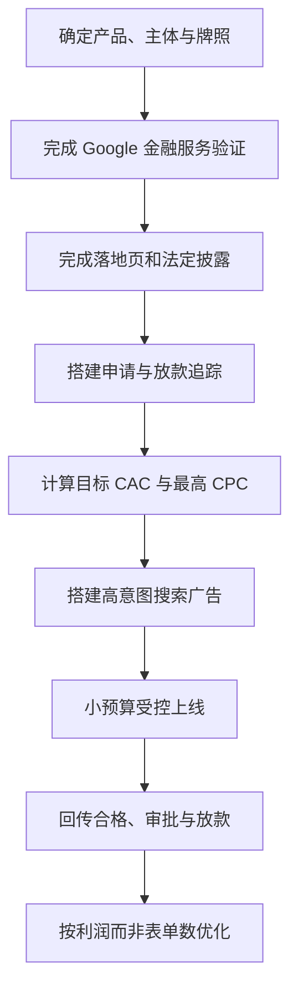
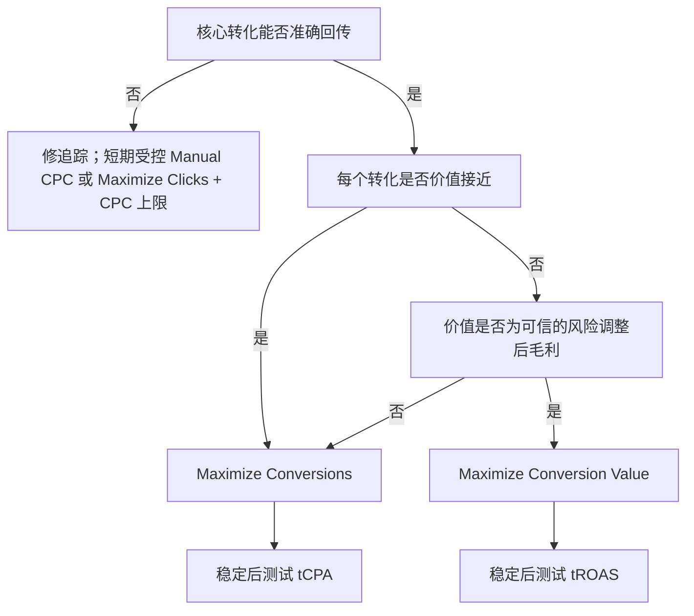
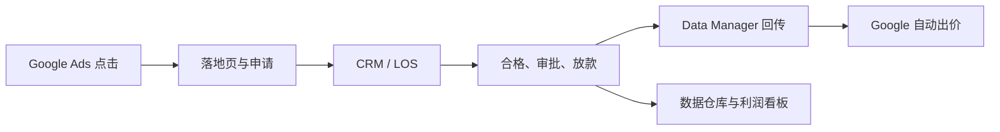
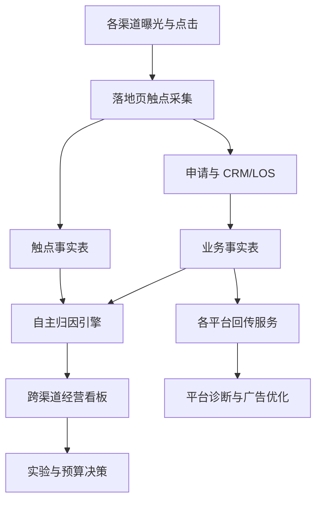
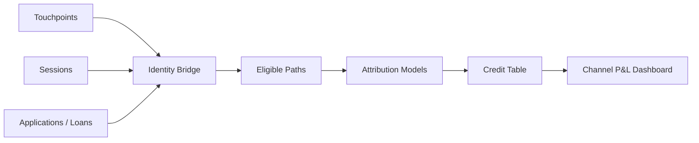
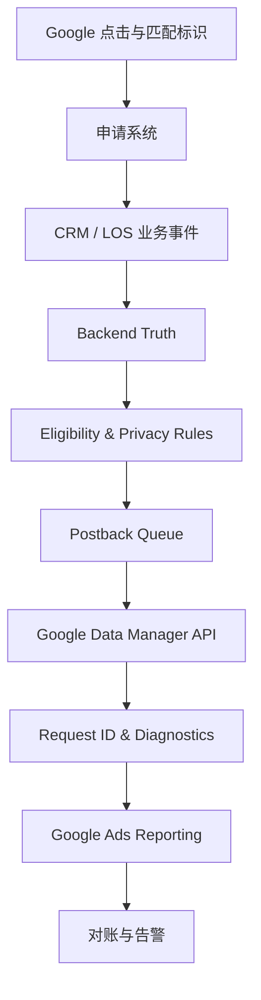

# 信贷投放实操教程合集

> 本合集由「06-信贷投放专题」目录下四份实操教程合并而成，按主题分为两个部分、四篇：**第一部分 Google Ads 澳洲信贷 0→1 投放**（第一篇 讲解版 + 第二篇 实战手册 v1.0，手册为讲解版的实战化扩展）、**第二部分 投放监控与多渠道归因**（第三篇 Google 回传监控讲解版 + 第四篇 多渠道归因与投放监控完整手册 v1.0）。
>
> **合并原则**：四份原文内容全量保留，讲解版与手册版内容互补、互不删减；仅删除各文档原有标题与目录（已并入下方总目录）、清理对话残留衔接词；标题层级统一降级并入合集结构。
>
> 合并时间：2026-09-08

## 总目录

### 第一部分 Google Ads 澳洲信贷 0→1 投放

- **第一篇 讲解版（十四讲）**：先理解整个 0→1 流程 / 定义产品（Product Brief）/ 合规与 Google 金融服务验证 / Landing Page / 申请 Funnel 与事件定义 / 归因身份传递（gclid → application_id）/ 创建 Search Campaign / Keyword / 上线后看什么指标 / 回传 Approval 与 Disbursement / Google 机器学习三阶段 / 常见错误案例 / 完整投放架构 / 从 0 开项目的 12 步顺序 + 最值得先掌握的 5 个东西
- **第二篇 实战手册 v1.0（21 节）**：先看结论与一票否决项 → 产品事实表与单位经济模型 → 合规闸门（Google 政策 / ASIC RG 234 / 高风险文案 / 隐私）→ 落地页 → 账户初始化 → 转化追踪与回传 → 关键词与账户结构 → 第一条搜索广告系列 → 出价与预算 → 广告文案与资产 → 上线验收清单 → 日周月优化 → 数据诊断 → 实验与扩量 → 回传看板与预警 → 常见故障 → 30 天执行计划 → 工作模板 → 术语表 → 官方资料索引

### 第二部分 投放监控与多渠道归因

- **第三篇 讲解版（十六讲）**：端到端回传链路（Data Manager API）→ 四层监控（业务 / 技术 / 时效 / 归因）→ Coverage 覆盖率 → Latency 时延 → API Success → Error Distribution → Identifier Coverage → Google Ads 对账（by conv. time）→ Google 自身延迟 → Google 官方监控页面 → 自建四维看板 → 表结构建议 → 按业务事件分层监控 → 完整回传基础设施架构 + 官方教程推荐
- **第四篇 完整手册 v1.0（24 节）**：监控六问与四套事实 → 事件字典与口径 → 六层监控指标地图 → 多渠道归因分析 → 渠道标记与 Click ID → Google 归因数据用法 → 自主归因搭建 → 归因模型详解 → 归因决策体系 → 回传架构与 Google 实施 → 回传四维监控 → 对账 → 看板设计 → 告警体系 → 底表数据模型 → SQL 模板 → 日周月监控机制 → 异常排查手册 → 增量实验与 MMM → 隐私合规 → 建设计划 → 验收清单 → 术语表 → 官方资料索引

---

# 第一部分 Google Ads 澳洲信贷 0→1 投放

## 第一篇 讲解版：澳大利亚信贷产品 Google Ads 0→1 投放教程

下面按你现在最需要理解的方式来讲：**假设你要在澳大利亚从 0 开一个新的消费信贷产品，然后通过 Google Ads 获取新客。**

先记住一句话：

> **Google 投放不是“建个广告 → 买流量”，而是“产品 → 页面 → 流量 → 申请 → 风控 → 放款 → 数据回传 → Google 自动找更好的客户”的完整闭环。**

---

### 一、先理解整个 0→1 流程

整个链路其实只有 8 步：

```text
① 定义信贷产品
        ↓
② 合规 / Google 金融资质
        ↓
③ 建 Landing Page / 申请流程
        ↓
④ Google Ads + 数据埋点
        ↓
⑤ 建 Search Campaign
        ↓
⑥ 用户搜索 → 点击 → 申请
        ↓
⑦ 风控 → Approval → Disbursement
        ↓
⑧ 把结果回传 Google
        ↓
Google 学习什么样的人更容易放款
        ↓
继续投放 / 优化 / 放量
```

真正重要的是 **⑧ → ⑤ 这个闭环**。

---

### 二、Step 1：先把“我要卖什么”定义清楚

不要先开 Google Ads。

第一件事是写一个非常简单的 **Product Brief**。

例如你要上线一个 Personal Loan，需要至少确定：

| 项目 | 你需要确定什么 |
|---|---|
| 产品 | Personal Loan / LOC / 其他 |
| Target Customer | 什么用户 |
| Loan Amount | 额度范围 |
| Term | 借多久 |
| Interest / Fee | 利率和费用 |
| Eligibility | 谁可以申请 |
| Risk Policy | 什么客户拒绝 |
| Approval | 怎么审批 |
| Disbursement | 怎么放款 |
| Repayment | 怎么还款 |

然后明确一个核心商业公式：

**获客成本 < 客户价值**

例如：

```text
Google Spend
    ↓
Click
    ↓
Application
    ↓
Approval
    ↓
Disbursement
    ↓
Interest / Revenue
    ↓
Credit Loss
    ↓
Profit
```

所以以后不能只看 CPC。

最终你应该关注：

> **Cost per Disbursement + Loan LTV / ROI**

---

### 三、Step 2：先解决合规，否则 Google 都可能不给你投

如果是在澳大利亚做 consumer credit，一般需要持有 Australian Credit Licence，或者获得持牌机构授权后才能开展相应 credit activity。ASIC 同时要求贷款机构履行 Responsible Lending 义务，例如了解客户财务情况、核实相关信息，并判断贷款是否不适合该客户。

参考：
- ASIC — Do you need a credit licence?  
  https://asic.gov.au/for-finance-professionals/credit-licensees/do-you-need-a-credit-licence/

而 Google 对澳大利亚金融广告还有单独的 **Financial Services Verification**。

目前澳大利亚的流程大致是：

```text
ASIC / 对应监管资质
        ↓
第三方 G2RS Verification
        ↓
Google Advertiser Verification
        ↓
Google Financial Services Verification
        ↓
Ads Account 获得金融服务投放资格
```

Google 明确要求，在澳大利亚向寻找金融服务的用户展示广告，广告主通常需要完成金融服务验证；Google 会核实监管授权或豁免情况。

参考：
- Google Ads Policy — Australia Financial Services Verification  
  https://support.google.com/adspolicy/answer/15332527?hl=zh-Hans

所以公司内部通常要先找：

**Legal / Compliance + Google Ads Account Owner**

确认：

```text
ACL / licence
Google Advertiser Verification
Google Financial Service Verification
Domain
Advertiser Entity
Payment Profile
```

全部是谁的。

---

### 四、Step 3：把 Landing Page 做出来

Google 广告最终要把用户送到一个页面。

比如：

```text
Google 搜索：
"personal loan australia"

        ↓

广告：
Flexible Personal Loans
Apply Online

        ↓

Landing Page

Personal Loan
[产品介绍]

Loan amount
Loan term
Fees
Eligibility

[Check eligibility]
```

这里有个非常重要的问题。

**金融产品不能只做一个漂亮 Landing Page。**

Google 要求金融服务页面明确披露企业实际地址和相关费用等信息；个人贷款还需要醒目披露最短/最长还款期限、最高 APR 以及代表性的贷款总成本示例。并且 Google 只允许宣传要求在放款后 **61 天或更长时间**才能全额还清的 personal loans。

参考：
- Google Ads Policy — Personal loans  
  https://support.google.com/adspolicy/answer/15187149?hl=en

ASIC 在 2026 年更新的 RG 234 也强调，金融产品和信贷广告不得误导消费者。

参考：
- ASIC RG 234 — Advertising financial products and services, including credit  
  https://www.asic.gov.au/regulatory-resources/find-a-document/regulatory-guides/rg-234-advertising-financial-products-and-services-including-credit

所以 Landing Page 通常至少包含：

```text
Product information
Loan amount
Term
Rate / Fee
Representative example
Eligibility
Responsible lending information
Company information
ACL / regulatory information
Privacy Policy
Terms & Conditions
Contact
```

---

### 五、Step 4：设计用户申请 Funnel

这一层其实就是你比较熟悉的信贷业务。

用户点广告以后：

```text
Google
 ↓
Landing Page
 ↓
Apply
 ↓
手机号 / Email
 ↓
基本个人信息
 ↓
Employment
 ↓
Income
 ↓
Bank Statement / Open Banking
 ↓
Credit Bureau
 ↓
Risk Model
 ↓
Decision
 ↓
Approved / Declined
 ↓
Disbursement
```

这个时候，你需要给每一步定义 **event**。

例如：

| Event | 含义 |
|---|---|
| page_view | 到页面 |
| apply_start | 开始申请 |
| application_submit | 提交申请 |
| kyc_pass | KYC通过 |
| approval | 审批通过 |
| disbursement | 放款 |
| repayment | 还款 |

这一步非常重要。

因为 Google 后面就是靠这些数据学习。

---

### 六、Step 5：把 Google 的“身份”一路带到放款

这是投放技术链路最核心的地方。

一个用户搜索：

> personal loan online

然后点你的 Google 广告。

Google 会留下广告归因信息，例如 click identifier。

你的系统需要做到：

```text
Google Click
     ↓
gclid / attribution id
     ↓
application_id
     ↓
user_id
     ↓
risk decision
     ↓
approval
     ↓
disbursement
```

所以建议至少有一张 attribution 表：

```text
user_id
application_id
gclid
campaign_id
ad_group_id
keyword
click_time
application_time
approval_time
disbursement_time
loan_amount
```

于是你才能知道：

> **这笔贷款到底是哪条 Google 广告带来的。**

这就是你最近在研究的 **媒体回传 / attribution tracking** 的本质。

---

### 七、Step 6：正式创建 Google Campaign

对于一个全新的 Loan Product，我建议第一阶段先理解和使用：

#### Search Campaign

因为 Search 是用户主动表达借款需求。

例如用户搜索：

```text
personal loan
personal loan australia
apply personal loan
online personal loan
```

Google Ads 的基本结构是：

```text
Google Ads Account
│
├── Campaign
│
│   Personal Loan - Search
│
├── Ad Group 1
│   Personal Loan
│
│   ├── personal loan
│   ├── "personal loan"
│   └── [personal loan]
│
├── Ad Group 2
│   Online Loan
│
└── Ads
    Headline
    Description
    Landing Page
```

Google 官方 Search Campaign 本身也是按照 **Campaign → Ad Group → Keywords → Ads** 的结构建立，并支持 broad、phrase 和 exact 等 keyword match type。

参考：
- Google Ads Help — Search campaign / keywords  
  https://support.google.com/google-ads/answer/9510373?hl=en

---

### 八、Keyword 到底是什么？

这个是 Google Search 最重要的概念。

例如用户搜索：

> best personal loan australia

你可以买：

```text
personal loan
```

Google 判断这个搜索和你的关键词相关，就进入竞价。

例如第一版可以分成：

##### 高意图词

```text
apply personal loan
personal loan online
personal loan australia
quick personal loan
```

##### 产品词

```text
personal loan
small personal loan
online loan
```

然后每天看：

```text
Search Terms
```

也就是：

> 用户到底搜了什么词以后点了我的广告？

不断：

```text
好词 → 加进去
垃圾词 → Negative Keyword
```

---

### 九、Step 7：广告上线以后，看什么指标？

刚开始不要一口气盯几十个指标。

先看漏斗：

```text
Impression
    ↓
Click
    ↓ CTR
Application
    ↓ CVR
Approval
    ↓ Approval Rate
Disbursement
    ↓
Repayment
```

对应成本：

```text
Spend / Click
= CPC

Spend / Application
= CPA_application

Spend / Approval
= CPA_approval

Spend / Disbursement
= CPA_disbursement
```

例如：

```text
Spend                $10,000

Clicks                2,000
Applications            400
Approved                160
Disbursed               120
```

那么：

```text
CPC
= 10,000 / 2,000
= $5

Cost / Application
= $25

Cost / Approval
= $62.5

Cost / Disbursement
= $83.3
```

**信贷真正应该盯的是后面几个。**

而不是：

> CPC 很便宜，所以 Campaign 很好。

---

### 十、Step 8：最关键——把 Approval / Disbursement 回传 Google

假设 Google 带来了两个人：

```text
Customer A
click
→ apply
→ decline

Customer B
click
→ apply
→ approve
→ disburse
```

如果你只告诉 Google：

```text
A = Application
B = Application
```

Google认为：

> 两个人一样好。

这是错的。

你真正应该告诉 Google：

```text
A = Application only

B =
Application
Approval
Disbursement
```

这样 Google 才逐渐学会：

> 哪一种搜索、用户上下文和流量更容易产生真正的放款。

Google 官方目前也推荐 lead generation 场景使用 **Enhanced Conversions / offline conversion** 把线下或后端结果传回 Google，以提高归因与 bidding 的准确性。2026 年相关 offline 数据接入正在迁移到 Google Ads Data Manager / Data Manager API。

参考：
- Google Ads Help — Offline conversion / enhanced conversions  
  https://support.google.com/google-ads/answer/15081888?hl=en

---

### 十一、这时候 Google 才真正开始“机器学习”

第一阶段可以优化：

```text
Maximize Conversions

目标：
Application
```

等数据稳定之后变成：

```text
Target CPA

目标：
Approval
```

再进一步：

```text
Maximize Conversion Value
 / Target ROAS

目标：
Disbursement / Value
```

Google 的 Smart Bidding 目前主要包括 Maximize Conversions、Target CPA、Maximize Conversion Value 和 Target ROAS。

参考：
- Google Ads Help — Smart Bidding  
  https://support.google.com/google-ads/answer/11095984?hl=en

对于信贷业务，我会把成熟过程理解成：

```text
Level 1

Google
↓
找最多 Application
```

↓

```text
Level 2

Google
↓
找最多 Approval
```

↓

```text
Level 3

Google
↓
找最多 Disbursement
```

↓

```text
Level 4

Google
↓
找高价值 + 好风险客户
↓
LTV / Profit Optimization
```

**Level 4 才是真正成熟的金融投放。**

---

### 十二、信贷里特别容易犯的一个错误

假设两个 Campaign：

| | Campaign A | Campaign B |
|---|---:|---:|
| Application | 1,000 | 700 |
| CPA | $20 | $25 |
| Approval Rate | 10% | 30% |
| Approved | 100 | 210 |

如果营销只看：

```text
Application CPA
```

A 看起来更好。

但实际上：

```text
A cost / approval
= $200

B cost / approval
= $83
```

**B 才是真正的好流量。**

所以金融投放一定要把：

> **Marketing 数据 × Risk 数据 × Loan 数据**

接起来。

这也是为什么你现在做的 **媒体回传质量、用户质量模型、风险模型**，实际上最后都能和投放连成一条链路。

---

### 十三、一个完整的 Google 信贷投放架构

你可以直接把整个事情记成下面这张图：

```text
                 GOOGLE ADS
                     │
            Campaign / Keyword
                     │
                     ▼
               Landing Page
                     │
                 Apply
                     │
                     ▼
              Application
                     │
        ┌────────────┴────────────┐
        │                         │
       KYC                  Bank Statement
        │                         │
        └────────────┬────────────┘
                     │
                Risk Model
                     │
              ┌──────┴──────┐
           Decline        Approval
                             │
                         Disbursement
                             │
                          Repayment
                             │
                             ▼
                    Data Warehouse
                             │
                  attribution / postback
                             │
                             ▼
                       GOOGLE ADS
                             │
                    Smart Bidding
                             │
                             ▼
                 找更多高质量客户
```

这张图理解了，**Google 信贷投放基本就理解了 70%。**

---

### 十四、如果让我真的从 0 开这个项目，我会按这个顺序做

| 阶段 | 做什么 | 最终产物 |
|---|---|---|
| 1 | Product Design | 产品规则 |
| 2 | Compliance | Licence + Google Verification |
| 3 | Landing Page | 可投页面 |
| 4 | Application Funnel | 完整申请流程 |
| 5 | Tracking | Google Click → application_id |
| 6 | Conversion | Application / Approval / Disbursement |
| 7 | Search Campaign | Keyword + Ads |
| 8 | Small-scale Test | 小预算测试 |
| 9 | Funnel Analysis | CVR / Approval / Disbursement |
| 10 | Postback | 后端结果回 Google |
| 11 | Smart Bidding | CPA / Value Optimization |
| 12 | Scale | 放量 |

---

#### 你现在最值得先掌握的 5 个东西

不用一开始学 Google Ads 所有功能。

先把这五个搞明白：

**① Campaign / Ad Group / Keyword 是什么**

**② Search → Click → Application 是怎么产生的**

**③ gclid / attribution 是什么**

**④ Conversion / Offline Conversion 是什么**

**⑤ Google 怎么通过 Approval / Disbursement 回传优化流量**

这几个理解之后，再去学 Demand Gen、PMax、Audience、ROAS 等会容易很多。

另外有一条金融广告的红线要记住：不要基于用户的**低信用分、高负债、财务困难等负面财务状态**去构建个性化广告受众；Google 将 negative financial status 视为敏感类别，并限制 advertiser-curated audiences 的使用。

参考：
- Google Ads Policy — Personalized advertising  
  https://support.google.com/adspolicy/answer/143465?hl=en


---

## 第二篇 实战手册：Google Ads 信贷产品从 0 到 1 投放（澳大利亚版）v1.0

> 版本：1.0  
> 更新日期：2026-09-07  
> 适用范围：面向澳大利亚消费者、期限固定的个人信贷/个人贷款产品；贷款机构、经纪商、比价或获客平台均可参考。  
> 重要说明：本文是投放与运营指南，不构成法律、信贷牌照、隐私或财务建议。产品上线前，应由澳大利亚持牌合规负责人或律师审核最终页面、广告、数据流和业务流程。若投放国家、主体或产品类型不同，请重新核对当地法律与 Google 的国家级验证规则。

---

### 1. 先看结论：从 0 到上线的最短路径

信贷投放不是“注册账户—选几个词—充值”这么简单。正确顺序是：



#### 第一版建议配置

| 项目 | 第一版建议 |
|---|---|
| 广告类型 | 只做 Search（搜索广告） |
| 地域 | 只投有牌照、能实际服务的澳大利亚地区；位置选项使用“所在地/经常所在地”思路，不依赖“对该地感兴趣” |
| 网络 | 先关闭 Display Network；Search Partners 先关闭，主搜索稳定后单独测试 |
| 关键词 | 高购买意图的 Exact + Phrase；Broad 暂缓 |
| 广告组 | 一组一个明确搜索意图，不按几十个细碎词拆组 |
| 广告 | 每组 2 条 RSA，内容真实且与页面一致 |
| 转化 | 页面查看不作为核心转化；至少区分申请提交、合格申请、审批、放款 |
| 核心优化目标 | 早期可暂用“合格申请”，最终必须向“放款”或经风险调整后的业务价值迁移 |
| 数据周期 | 不按单日结论频繁改动；至少覆盖业务转化延迟和一个有意义的样本周期 |
| 扩量顺序 | 新关键词/地域 → Broad 小实验 → Search Partners → PMax/视频等增量渠道 |

#### 上线前的 10 个“一票否决项”

以下任一项为“否”，就先不要投：

- [ ] 产品、放贷主体、经纪/获客关系和责任主体已写清楚。
- [ ] 所需的澳大利亚信贷牌照、授权或代表关系已由合规确认。
- [ ] Google 澳大利亚金融服务验证及广告主验证已经通过。
- [ ] 若属于 Google 定义的 personal loan，要求全额还款的最短期限不少于 61 天。
- [ ] 页面显著展示最短/最长还款期、最高 APR，以及包含费用的代表性总成本示例。
- [ ] 页面包含实体地址、全部相关费用以及所有对外资质/认证主张的证明链接。
- [ ] 如广告提及利率，比较利率（comparison rate）及相应警示已经合规审核。
- [ ] 页面、表单、标签和数据回传不会把敏感信贷信息泄露到 URL、广告标签或未经授权的第三方。
- [ ] 申请提交和后端结果能够去重，并能把合格、审批、放款与原始点击关联。
- [ ] 已算出目标获客成本和最高可承受 CPC，而不是只凭平台建议设置预算。

---

### 2. 先定义你卖的究竟是什么

投放前先做一张“产品事实表”。广告、落地页、客服话术、审批系统和 Google 验证提交的信息，都应以它为唯一事实来源。

#### 2.1 产品事实表

| 字段 | 必须写清的内容 |
|---|---|
| 法律主体 | 公司法定名称、ABN/ACN、注册地址、网站域名 |
| 业务角色 | 直接贷款人、信贷经纪、获客平台、比较平台，还是受托代理商 |
| 牌照关系 | Australian Credit Licence（ACL）号码，或 credit representative 号码和授权方 |
| 产品类别 | 固定期限个人贷款、循环信贷、信用卡、汽车贷款、抵押贷款、商业贷款等 |
| 使用目的 | 允许与禁止的贷款用途；广告不得暗示实际不提供的用途 |
| 额度 | 最低与最高可借金额 |
| 期限 | 最短与最长还款期限；确认是否满足 Google 的 61 天规则 |
| 定价 | 利率/APR 范围、最高 APR、comparison rate、风险定价逻辑 |
| 费用 | 申请费、设立费、月费、提前结清费、逾期费及其他费用 |
| 代表性示例 | 借款额、期限、利率、费用、总还款额、还款频率和假设条件 |
| 申请资格 | 年龄、澳大利亚居住/签证条件、收入、就业、银行账户、服务地区等 |
| 决策与到账 | 实际审批时长与放款时长；所有“即时”“分钟级”说法都要有证据 |
| 客诉与争议 | 内部投诉渠道、AFCA 信息和升级路径 |
| 隐私 | 隐私政策、数据收集用途、第三方共享、营销同意和撤回方式 |
| 页面证据 | 能证明每条广告主张的页面、制度或统计记录 |

#### 2.2 判断是否属于 Google 的 personal loan

Google 将 personal loan 概括为：个人一次性借入资金、且不用于购买固定资产或教育的非循环贷款。其政策通常覆盖直接贷款人、潜在客户生成商以及将用户连接到第三方贷款人的平台。按揭、汽车贷款、学生贷款、商业贷款、循环信用额度和信用卡等可能不落入这个特定定义，但仍受金融服务、当地法律、误导性陈述、数据与验证等其他规则约束。

不要仅凭产品内部名称判断。比如把短期现金贷改名为“额度服务”，不会改变其实际性质。应让合规根据真实合同、还款机制和消费者用途做分类。

官方依据：[Google Personal loans policy](https://support.google.com/adspolicy/answer/15188216?hl=en-AU)。

---

### 3. 先算清单位经济模型，再谈预算

#### 3.1 核心公式

不要用“同行一天花多少”来定预算。先计算每笔放款能承受多少营销成本。

**单笔预期贡献毛利**：

\[
M = \text{预期利息与费用收入} - \text{资金成本} - \text{预期信用损失} - \text{服务与催收成本} - \text{可变运营成本}
\]

若目标是贡献毛利与获客成本之比为 \(R\)，则：

\[
\text{目标放款 CAC} = \frac{M}{R}
\]

从点击到放款的概率为：

\[
P(\text{Funded}\mid\text{Click}) = \text{提交率} \times \text{合格率} \times \text{审批率} \times \text{放款率}
\]

可承受的理论最高 CPC：

\[
\text{最高 CPC} = \text{目标放款 CAC} \times P(\text{Funded}\mid\text{Click})
\]

如果平台早期只优化申请提交，目标申请 CPA 应为：

\[
\text{目标申请 CPA} = \text{目标放款 CAC} \times P(\text{Funded}\mid\text{Submit})
\]

#### 3.2 一个完整示例

假设：

- 单笔放款的预期贡献毛利：AUD 600；
- 希望毛利/CAC 至少为 3；
- 点击到申请提交率：8%；
- 提交后合格率：70%；
- 合格后审批率：40%；
- 审批后放款率：75%。

则：

- 目标放款 CAC = 600 ÷ 3 = **AUD 200**；
- 点击到放款率 = 8% × 70% × 40% × 75% = **1.68%**；
- 理论最高 CPC = 200 × 1.68% = **AUD 3.36**；
- 提交到放款率 = 70% × 40% × 75% = **21%**；
- 目标申请 CPA = 200 × 21% = **AUD 42**。

如果实际 CPC 为 AUD 6，虽然平台可能带来很多申请，按当前漏斗仍可能不赚钱。此时真正需要改善的是关键词质量、页面提交率、申请质量、审批或放款率，而不是单纯把“目标 CPA”调高。

#### 3.3 预算公式

若希望每月获得 100 笔放款，目标放款 CAC 为 AUD 200：

\[
\text{月度媒体预算} = 100 \times 200 = \text{AUD 20,000}
\]

Google Ads 的平均每日预算约为：

\[
\text{平均每日预算} = \frac{20,000}{30.4} \approx \text{AUD 658}
\]

注意：对大多数广告系列，Google 某一天可能花到平均每日预算的约 2 倍，但月度计费上限通常按 30.4 倍平均每日预算控制。预算机制见 [Google Ads spending limits](https://support.google.com/google-ads/answer/10486637?hl=en)。

#### 3.4 不要忽略“坏客户成本”

信贷产品的转化价值不能只写成贷款本金或审批金额。更合理的价值应基于预期贡献毛利，并纳入：

- 资金成本；
- 欺诈概率；
- 预计违约损失（PD × LGD × EAD 或公司采用的其他模型）；
- 首期未还、早期拖欠或取消概率；
- 经纪佣金、人工审核、验证与支付成本；
- 回收和服务成本。

平台先学到“谁容易提交表单”，不等于学到“谁会成为优质放款客户”。所以后端回传是信贷投放的核心，而不是高级可选项。

---

### 4. 合规闸门：没有全部通过就不要上线

本节将三类要求分开：Google 平台硬性规则、澳大利亚法律/监管要求，以及本文的稳健运营建议。最终以最新官方政策和合规意见为准。

#### 4.1 Google 对个人贷款广告的硬性要求

如果产品属于 Google 的 personal loan：

1. 只允许宣传要求在 **61 天或更长时间**内全额还款的个人贷款。
2. 落地页必须显著披露：
   - 最短与最长还款期限；
   - 最高年化百分比率（maximum APR），且不能只藏在代表性示例里；
   - 包含适用费用的代表性总成本示例。
3. 该要求同样可能适用于直接贷款人、lead generator，以及把消费者连接给第三方贷款人的平台。

美国还有 APR 不得达到或超过 36% 的额外限制；这不是澳大利亚规则，但投放美国时必须单独核对。

来源：[Google Financial products and services policy](https://support.google.com/adspolicy/answer/2464998?hl=en)、[Personal loans](https://support.google.com/adspolicy/answer/15188216?hl=en-AU)。

#### 4.2 金融服务页面披露

Google 要求金融产品和服务的广告目的地提供：

- 商家的实体地址；
- 所有相关费用；
- 对任何第三方认证、认可或背书主张的证明链接。

披露应立即、清楚可见，不能要求用户悬停、点击标签页或进入另一个页面才看到。来源：[Financial services disclosures](https://support.google.com/adspolicy/answer/15187149?hl=en)。

#### 4.3 澳大利亚金融服务验证

面向澳大利亚推广金融服务时，Google 要求相关广告主完成澳大利亚金融服务验证，且验证通常按目标国家分别处理，覆盖不同广告格式和素材。

##### 直接贷款人或受监管金融服务提供者

通常流程为：

1. 确认广告账户中的法定主体、网站域名和 ASIC 记录完全一致；
2. 通过 Google 指定的外部合规合作方 G2RS 申请第三方验证；
3. 完成 Google Advertiser Verification；
4. 使用获得的唯一验证码向 Google 提交金融服务验证表；
5. 验证通过后再提交广告。

##### 经纪、营销代理、联盟或获客平台

如果你是获授权的第三方，通常需要由已获澳大利亚验证的授权广告主发起或确认关系，并列出获批域名；然后第三方向 Google 直接申请。不要把代理商写成贷款人，也不要借用不相关公司的资质。

##### 关键注意事项

- 公司名称、域名、地址、牌照或授权信息必须与 ASIC 记录和申请资料一致。
- 一个国家通过验证，不代表其他国家自动通过。
- 变更主体、域名、账户或授权关系时，应重新检查验证状态。
- 提供虚假信息可能导致验证撤销或账户暂停。

完整流程以 [Google Australia financial services verification](https://support.google.com/adspolicy/answer/15332527?co=GENIE.CountryCode%3DAU&hl=en) 为准。广告主身份验证说明见 [Advertiser verification](https://support.google.com/adspolicy/answer/9703665?hl=en)。

#### 4.4 澳大利亚广告监管重点

ASIC Regulatory Guide 234 的实务原则包括：

- 整体印象不得误导或欺骗；标题造成的错误印象不能靠页面深处的小字纠正。
- 收益或便利与风险、条件和限制应保持平衡。
- 所有事实、比较、速度、通过率和“最低/最佳”等主张应有可复核证据。
- 警示和免责声明应醒目、易读，并在消费者形成决定之前出现。
- 谨慎使用 “from”“up to”等可能让用户只注意最佳情形的表达。
- 中文广告如需要警示，不能只用用户难以理解的英文小字来补救。
- 点击进入另一页面，不能修复第一屏或广告本身已经产生的误导印象。
- 广告若提及利率，通常需要同时展示正确计算的 comparison rate，且不得明显弱化，并遵守所需警示。

请直接参考 2026 年 6 月更新的 [ASIC RG 234](https://www.asic.gov.au/regulatory-resources/find-a-document/regulatory-guides/rg-234-advertising-financial-products-and-services-including-credit) 和 [National Credit Code 指引](https://www.asic.gov.au/regulatory-resources/credit/credit-general-conduct-obligations/national-credit-code)。责任贷款义务参见 [ASIC Responsible lending](https://www.asic.gov.au/regulatory-resources/credit/responsible-lending)。

#### 4.5 高风险文案清单

| 表述 | 风险 | 建议 |
|---|---|---|
| “Guaranteed approval / 100% approved” | 通常无法真实保证，易构成误导 | 不使用；说明需评估并适用资格条件 |
| “No credit check” | 可能与真实风控/责任贷款义务冲突 | 除非事实、合法且经书面合规批准，否则不使用 |
| “Instant cash / money in minutes” | 审批、银行入账和个案差异使其难以保证 | 用有证据的条件化表达，如“approved applications may…” |
| “Lowest rate / best loan” | 绝对比较主张需要充分、持续的市场证据 | 改为真实的利率范围和适用条件 |
| “From X%” | 容易突出极少数人的最佳条件 | 同屏说明适用条件、范围和 comparison rate |
| “Government approved/backed” | 容易产生虚假关联 | 只有具备明确正式依据时才可使用 |
| “Bad credit guaranteed” | 可能触发敏感金融困境、误导和掠夺性贷款风险 | 避免；用中性资格和评估流程说明 |
| “Fix debt now / emergency cash” | 利用消费者困境，且可能落入负面财务状态敏感分类 | 避免用恐惧或压力驱动申请 |
| “Pre-approved” | 若并未基于足够评估，可能误导 | 明确“预资格不等于最终批准”并经合规审核 |
| “No fees” | 只要存在任何相关收费就有风险 | 列清费用；只有确实为零才可使用 |

Google 将严重误导、虚假身份或规避政策视为严重问题，某些情形可在无预警情况下暂停账户。被拒登后不要新建账户、换域名或改拼写绕过审核，应先纠正根因并按官方流程申诉。参见 [Misrepresentation](https://support.google.com/adspolicy/answer/6020955?hl=en) 和 [Circumventing systems](https://support.google.com/adspolicy/answer/15938075?hl=en-AU)。

#### 4.6 受限个性化定向

与负面财务状况相关的内容属于 Google 的敏感兴趣类别。破产、高债务、失业、无家可归、福利领取、掠夺性贷款或债务困境等主题，不应使用广告主自行创建的个性化受众来定向，包括 Customer Match、自己的数据细分、类似受众或某些扩展功能。Google 预定义受众是否可用，应以界面和当前政策为准。

实践建议：

- 第一阶段以搜索意图、地理范围和合规关键词为主，不上传“被拒贷”“高负债”“逾期”等名单。
- 不用用户的信用评分、负债、拒绝原因或困境状态创建受众或相似人群。
- 不对未成年人做个性化广告。
- 若未来投放美国或加拿大的消费者金融产品，还要遵守年龄、性别、婚姻/父母状态和邮编等定向限制。

来源：[Personalized advertising—negative financial status](https://support.google.com/adspolicy/answer/16700443?hl=en)、[Consumer finance targeting in US and Canada](https://support.google.com/adspolicy/answer/16700846?hl=en)。

#### 4.7 隐私与数据最小化

- 表单和付款/身份信息页面必须使用 HTTPS。
- 不要把姓名、邮箱、电话、收入、借款用途、信用评分或审批结果放在 URL 查询参数中。
- 不要让广告标签、分析工具、聊天插件或会话回放工具读取不必要的表单字段。
- 对营销、分析和广告用途提供清晰告知与适当同意；提供易用的退订/撤回渠道。
- 上传 Google 的客户数据只能使用合规取得的第一方数据，并遵守 Google Customer Data Policies。
- 对信贷困境等敏感信息，切勿默认认为“哈希后就可以上传”。哈希降低直接识别性，不会自动解决目的、同意和敏感信息问题。
- OAIC 在 2026 年明确强调第三方 tracking pixel 的隐私风险；敏感信息经追踪像素处理通常需要明确同意。上线前应完成标签清单、数据流图和供应商评估。

来源：[Google Data collection and use](https://support.google.com/adspolicy/answer/6020956?hl=en)、[Google Customer Data Policies](https://support.google.com/adspolicy/answer/7475709?hl=en)、[OAIC Tracking pixels and privacy obligations](https://www.oaic.gov.au/privacy/privacy-guidance-for-organisations-and-government-agencies/organisations/tracking-pixels-and-privacy-obligations)、[OAIC APP 7—Direct marketing](https://www.oaic.gov.au/privacy/australian-privacy-principles/australian-privacy-principles-guidelines/chapter-7-app-7-direct-marketing)。

---

### 5. 落地页：用户和 Google 都要看懂

#### 5.1 页面推荐结构

1. **首屏**：产品是什么、金额/期限范围、真实且条件化的核心价值、主 CTA、关键定价/资格提示。
2. **费用与价格**：利率/APR、最高 APR、comparison rate、全部相关费用、影响个人报价的条件。
3. **代表性示例**：借款金额、期限、还款频率、利率、费用、总还款额和假设。
4. **资格条件**：年龄、居住、收入、就业、银行账户、用途、地区等。
5. **申请流程**：申请、核验、评估、签约、放款；明确预资格和最终审批的区别。
6. **风险与责任借贷**：逾期后果、影响、困难援助入口和理性借贷提示。
7. **身份与监管信息**：公司法定名称、实体地址、ACL/credit representative 信息和业务角色。
8. **投诉与支持**：内部投诉方式、AFCA 信息、联系方式和服务时间。
9. **法律链接**：Credit Guide、Target Market Determination（如适用）、Privacy Policy、Terms、Fees、Complaints。
10. **重复 CTA**：在用户已看到足够信息后再次提供申请入口。

#### 5.2 首屏最低信息建议

首屏不要只有“大额、低息、秒批”三个词。建议至少让用户立即看见：

- 贷款产品类别；
- 可借金额和期限范围；
- 利率/比较利率的合规呈现或明确入口；
- “申请须经资格和信用评估”等实质条件；
- 贷款人/经纪商的真实身份；
- 清晰的 CTA，例如 “Check eligibility” 或 “Start application”。

#### 5.3 代表性披露模板

下面仅是结构模板，不是可直接发布的法律文案。所有数值和措辞必须由产品、财务和合规填写：

> **Rates and fees**  
> Loans from AUD `[最低金额]` to `[最高金额]`, with terms from `[最短期限]` to `[最长期限]`. Interest rates range from `[最低利率]` to `[最高利率]` p.a. The maximum APR is `[最高 APR]`. The comparison rate is `[比较利率]` based on `[法定假设]`. Fees may include `[逐项列示]`.
>
> **Representative example**  
> For a loan of AUD `[金额]` over `[期限]` at `[利率]` p.a., with `[费用]`, `[还款频率]` repayments would be `[金额]` and the total amount payable would be `[总额]`. Actual rates, fees and approval depend on individual circumstances and assessment.

模板中的“最高 APR”应在示例之外单独披露。若广告或页面提及利率，comparison rate 的计算、位置、字号和警示须按澳大利亚法律由专业人员审核。

#### 5.4 页面技术检查

- 页面返回正常的 HTTP 状态，移动端和桌面端都可访问。
- 不按地区、设备或机器人向 Google 展示与用户不同的内容。
- Google AdsBot 可抓取；不要误被 CDN/WAF/robots 规则拦截。
- 页面加载稳定，核心内容不要等待复杂脚本才能出现。
- 域名与广告显示域名一致；跳转链短且目的地不变。
- CTA、表单和成功页可用；错误状态给出清晰解释。
- 不自动下载、不弹出无法关闭的遮罩、不制造虚假倒计时。
- 隐私、条款、费用和联系信息链接都有效。
- 对手机号、邮箱、地址、银行与身份资料使用适当安全控制。
- 可访问性：字体、对比度、键盘导航、错误提示和屏幕阅读器标签基本合格。

Google 目的地要求见 [Destination requirements](https://support.google.com/adspolicy/answer/6368661?hl=en)。

---

### 6. Google Ads 账户初始化

#### 6.1 所有权和权限

- 使用公司拥有的邮箱和付款资料，不把账户永久建在离职风险较高的个人邮箱下。
- 公司至少保留两名管理员；代理商使用独立访问权限，不共享密码。
- 若管理多个账户，可使用 Manager Account，但每个业务主体、国家与计费关系要清楚。
- 按最小权限原则分配 Admin、Standard、Read-only、Billing 等角色。
- 开启两步验证。官方说明：[2-Step Verification](https://support.google.com/google-ads/answer/12864186?hl=en)。

#### 6.2 建户时不可随意填写的项目

- **国家、币种、时区**应与业务和财务报表一致。
- Google Ads 账户时区创建后通常不能自行修改；建立前确认使用 Australia/Sydney 等正确业务时区，而不是沿用 UTC。参见 [Change your time zone](https://support.google.com/google-ads/answer/9842104?hl=en)。
- 付款主体和税务资料应与真实法律关系一致。计费说明：[Google Ads billing](https://support.google.com/google-ads/answer/2375433?hl=en)。

#### 6.3 必做账户设置

- 开启 auto-tagging，以便落地 URL 附带 GCLID 等点击标识。路径通常为 **Admin → Account settings → Auto-tagging**。参见 [Auto-tagging](https://support.google.com/google-ads/answer/3095550?hl=en)。
- 完成 Advertiser Verification 和澳大利亚 Financial Services Verification。
- 把自动应用的建议（auto-apply recommendations）逐项检查；新账户不要默认允许系统改变匹配方式、预算或出价。
- 建立命名规范、标签、预算负责人和变更日志。
- 设置拒登、付款失败、转化骤降和预算异常通知。

#### 6.4 推荐命名规范

```text
广告系列：AU_Credit_Search_NonBrand_HighIntent_202609
广告组：PersonalLoan_Core
广告：RSA_ProductFact_V1
转化：AU_Web_ApplicationSubmit
线下转化：AU_Offline_Funded
实验：EXP_BroadMatch_202610
```

名称至少包含：国家、业务、渠道、品牌/非品牌、意图或主题、版本/日期。不要把个人信息写入广告名称或标签。

---

### 7. 先把转化追踪搭好

#### 7.1 正确的信贷漏斗

| 阶段 | 建议事件名 | Google Ads 用途 | 说明 |
|---|---|---|---|
| 落地页访问 | `page_view` | 不作为核心转化 | 用于流量与页面诊断 |
| 开始申请 | `application_start` | Secondary | 判断首屏与表单启动率 |
| 完成申请 | `application_submit` | 早期可临时 Primary，成熟后多为 Secondary | 必须排除垃圾、重复和测试提交 |
| 合格申请 | `qualified_application` | 早期主要优化目标候选 | 使用中性业务资格，不向标签泄露敏感细节 |
| 审批 | `approved` | Primary 候选 | 注意审批延迟、撤销和重复更新 |
| 放款 | `funded` | 最终主要优化目标 | 最接近真实收入与 CAC |
| 首期还款/拖欠 | 内部 BI 事件 | 通常不直接上传广告平台 | 供风险、队列和利润分析；先做隐私与政策评估 |

不要同时把 `application_submit`、`qualified_application`、`approved` 和 `funded` 都设为同一个广告系列的 Primary 并直接相加，否则一次客户旅程会被当作多次业务成功。Google 的 Account-default goals 和 campaign-specific goals 应有明确治理。参见 [Conversion goals](https://support.google.com/google-ads/answer/4677036?hl=en) 和 [Campaign-specific goals](https://support.google.com/google-ads/answer/9143218?hl=en)。

#### 7.2 基础埋点方案

推荐组合：

1. 网站部署 Google tag；可通过 Google Tag Manager 管理。
2. 在 Google Ads 创建 website conversion actions。
3. GA4 用于行为分析，并与 Google Ads 链接。
4. 核心竞价转化尽量由一个权威来源导入，避免 Google Ads 原生标签和 GA4 同一事件同时都设为 Primary。
5. 后端保存点击标识并回传合格、审批、放款结果。

官方指南：[Set up web conversions](https://support.google.com/google-ads/answer/16560108?hl=en)、[Google tag](https://support.google.com/google-ads/answer/7548399?hl=en)、[Link Google Ads and GA4](https://support.google.com/analytics/answer/9379420?hl=en)。

#### 7.3 每个转化动作的推荐设置

| 设置 | Lead 类建议 | 原因 |
|---|---|---|
| Goal/Category | Submit lead form、Qualified lead 或 Converted lead | 与真实阶段对应 |
| Value | 早期可先不用；成熟后用预期贡献价值 | 不要把贷款本金当收入 |
| Count | 通常选 **One** | 同一点击产生多次表单触发时只计一次；销售购买才常用 Every |
| Attribution | Data-driven attribution（可用时） | Google 对多数转化默认采用数据驱动归因 |
| Click-through window | 按实际考虑期设置 | 应覆盖从点击到该阶段的合理时长 |
| Primary/Secondary | 只有当前出价真正要优化的事件设 Primary | 避免重复学习和虚假总量 |

参见 [Conversion counting options](https://support.google.com/google-ads/answer/3438531?hl=en)、[Data-driven attribution](https://support.google.com/google-ads/answer/6394265?hl=en)、[Conversion windows](https://support.google.com/google-ads/answer/3123169?hl=en)。

#### 7.4 去重设计

前端成功页刷新、后退、重复提交或跨设备都可能导致重复。至少做到：

- 每次申请生成不可预测的 `application_id`；
- Google Ads web conversion 使用 transaction/order ID 去重；
- 后端为每个“申请 ID × 转化阶段”建立唯一键；
- 状态只能按业务规则前进，撤销和更正另建审计记录；
- 测试数据、员工流量、自动化监控和欺诈提交标记并排除。

#### 7.5 保存点击标识

Auto-tagging 可在广告点击后的 URL 中带入 GCLID；部分环境可能使用 GBRAID/WBRAID 等标识。落地页应：

1. 读取允许使用的点击标识；
2. 安全写入第一方 cookie/session；
3. 表单提交时把它与 `application_id` 一起传到后端；
4. 在状态变化时，从后端向 Google 回传对应线下转化；
5. 保留来源、时间、同意记录和回传审计日志。

不要将信贷信息追加到广告 URL。ValueTrack 仅添加所需的广告上下文参数，例如 campaign、keyword、matchtype 或 device，并通过 tracking template/final URL suffix 规范管理。参见 [ValueTrack parameters](https://support.google.com/google-ads/answer/2375447?hl=en)。

#### 7.6 线下转化回传

截至本文日期，新实施应优先采用 Google Ads Data Manager 支持的当前连接/API 流程，并按官方模板上传点击标识、转化名称、转化时间、价值、币种和可选的订单 ID。Google 已在 2026 年调整部分 offline conversion / enhanced conversions for leads 的 API 路径；不要照抄数年前只基于 Google Ads API 的旧教程。先查看账户中的 Data Manager 与最新 [Offline data diagnostics](https://support.google.com/google-ads/answer/15249267?hl=en) 和 [Enhanced conversions for leads](https://support.google.com/google-ads/answer/15713840?hl=en)。

推荐的内部回传表结构：

| 字段 | 示例 | 说明 |
|---|---|---|
| `application_id` | `APP_...` | 内部不可重复 ID |
| `click_id_type` | `gclid` | 标识类型 |
| `click_id` | 值不在日志明文展示 | 广告点击关联键 |
| `conversion_name` | `AU_Offline_Funded` | 必须与账户动作一致 |
| `conversion_time` | 含时区的时间戳 | 使用真实状态发生时间 |
| `conversion_value` | `185.00` | 建议为预期贡献价值，而非本金 |
| `currency` | `AUD` | 与价值一致 |
| `order_id` | 阶段唯一 ID | 用于去重 |
| `consent_status` | 内部枚举 | 保存当时的告知/同意依据 |
| `upload_status` | success/error | 用于重试和监控 |

#### 7.7 回传质量监控

每天至少监控四件事：

- **覆盖率**：可关联点击标识的有效申请 ÷ 来自 Google Ads 的有效申请；
- **延迟**：业务事件发生到成功上传的 P50/P90/P99；
- **一致性**：CRM 放款数与 Ads 接收数的差异；
- **错误与重复**：API/文件错误率、未知 conversion action、过期点击、时间格式错误、重复 order ID。

建议预警例子：覆盖率较 7 日基线下降 20%；P90 延迟超过业务 SLA；连续 2 个批次无回传；CRM 与 Ads 差异超过设定阈值。阈值应根据真实量级设定，不要机械照抄。

#### 7.8 Consent Mode 与验证

如果使用同意管理平台，可按法律和业务要求配置 Consent Mode 的 `ad_storage`、`analytics_storage`、`ad_user_data`、`ad_personalization` 等信号。Consent Mode 不是获得同意的工具，也不会替代隐私告知；它只是根据用户选择调整标签行为。参见 [Consent mode reference](https://support.google.com/google-ads/answer/13802165?hl=en)。

上线前使用 Tag Assistant 和 Google Ads 的 tag diagnostics 验证：

- 页面首次加载时的默认同意状态；
- 用户接受/拒绝后的更新；
- 转化只触发一次；
- 页面之间点击标识未丢失；
- 域名跳转和支付/身份验证流程不会截断归因；
- 不向标签发送表单敏感字段。

---

### 8. 关键词研究与账户结构

#### 8.1 按用户意图分层

| 层级 | 例子（仅用于研究） | 初期动作 |
|---|---|---|
| 品牌 | `[品牌名] loan`、`[品牌名] apply` | 独立品牌广告系列，精确保护 |
| 高意图通用 | `personal loan apply`、`personal loans online`、`fixed term personal loan` | 第一批核心投放 |
| 价格/比较 | `personal loan rates`、`compare personal loans` | 页面具备真实比较和费率信息后投 |
| 用途 | `loan for home improvements` 等 | 只投产品允许且页面明确支持的用途 |
| 资格疑问 | `personal loan eligibility` | 可做教育型页面，注意流量意图混杂 |
| 困境/敏感 | `bad credit emergency loan`、`debt help loan` | 高政策、道德和质量风险；默认不投，除非专项合规评估通过 |
| 信息型 | `what is APR`、`loan calculator` | 转化通常较低；内容/再营销策略成熟后测试 |
| 招聘/服务 | `loan jobs`、`loan software`、`loan template` | 通常作为否定关键词 |

例词不能代替本地数据。使用 [Google Keyword Planner](https://business.google.com/uk/ad-tools/keyword-planner/) 获取澳大利亚目标地域的搜索量、竞争和预估 CPC；再结合 Search Terms Report 迭代。

#### 8.2 关键词研究步骤

1. 从产品事实表提取产品、用途、金额、期限、资格和品牌词。
2. 在 Keyword Planner 选择准确国家/州、语言和 Search Network。
3. 导出关键词、搜索量区间、竞争度、顶部出价估算。
4. 人工审查每个词的真实搜索意图，而不是仅看词面。
5. 查看搜索结果页和 [Google Ads Transparency Center](https://adstransparency.google.com/)；只用于理解市场表达，不复制竞争对手未经证实的承诺。
6. 标记“可投”“需合规确认”“否定”“以后测试”。
7. 按同一意图聚类，每组写能精确回应需求的广告与页面。

#### 8.3 匹配方式

| 类型 | 写法 | 实际含义 | 初期使用 |
|---|---|---|---|
| Exact | `[personal loan online]` | 可覆盖相同含义或意图，并非只匹配完全相同字符串 | 是，核心词 |
| Phrase | `"personal loan online"` | 可覆盖包含该含义的搜索，范围比 Exact 更宽 | 是，受控探索 |
| Broad | `personal loan online` | 利用更多信号扩展到相关搜索 | 数据和回传稳定后做独立实验 |

匹配不是简单的字符规则。每周必须查看真实搜索词。官方定义：[Keyword match types](https://support.google.com/google-ads/answer/7478529?hl=en)。

#### 8.4 初始否定关键词清单

以下只是候选，添加前确认不会误伤真实客户：

```text
jobs, job, career, salary, training, course, definition, meaning,
template, spreadsheet, software, API, code, calculator download,
complaint, lawsuit, scam（若用户搜索品牌投诉，应由品牌与声誉策略另行处理）, 
free money, grant, government benefit,
business loan, mortgage, home loan, car loan, student loan（若产品不提供这些）
```

中文市场还应加入与招聘、教程、合同模板、软件系统、非目标国家和非目标产品有关的中文变体。负面关键词不会自动覆盖所有近似变体、同义词、单复数，应主动加入重要变体；大小写通常无需区分。来源：[Negative keywords](https://support.google.com/google-ads/answer/2453972?hl=en)。

#### 8.5 推荐第一版账户结构

| 广告系列 | 广告组 | 关键词示例 | 页面 | 目标 |
|---|---|---|---|---|
| Brand | Brand_Core | 品牌 + loan/apply/rates | 品牌产品页 | 防守品牌需求 |
| NonBrand_HighIntent | PersonalLoan_Core | personal loan、personal loans online | 主产品页 | 获取高意图新增客户 |
| NonBrand_Rates | Rates_Compare | personal loan rates 等 | 定价/比较说明页 | 承接价格研究用户 |
| UseCase（后续） | 每个已获批用途一组 | 明确用途词 | 对应用途页 | 增量扩展 |

不要按每个拼写变体创建一个广告组，也不要把品牌词与非品牌词、不同国家或完全不同产品塞进同一广告系列。

---

### 9. 手把手创建第一条搜索广告系列

Google 界面会持续迭代，按钮名称可能略有不同；以下是稳定的决策顺序。官方流程见 [Create a Search campaign](https://support.google.com/google-ads/answer/9510373?hl=en)。

#### 第 1 步：创建广告系列

点击 **Campaigns → + New campaign**。若界面允许，选择“不使用目标指导创建”，或选择 Leads 但手动检查系统自动带入的转化目标。

#### 第 2 步：选择类型

选择 **Search**。填写真实最终网站 URL。第一阶段不建议直接用 Performance Max，因为 Search 更容易控制搜索意图、关键词、文案和合规诊断。

#### 第 3 步：选择转化目标

- 只保留这个广告系列真正要用于出价的 Primary 目标。
- 新系统尚无后端数据时，可暂用经过清洗的 `application_submit`。
- 一旦 `qualified_application` 或 `funded` 有稳定回传，应设计迁移测试。
- 电话只有在能合规录入、去重并判断质量时才作为核心转化。

#### 第 4 步：选择出价

按第 10 节的决策树选择。不要因为界面推荐，就在零转化、零回传的第一天强行设置激进 tCPA。

#### 第 5 步：网络

- 关闭 **Display Network**。
- 第一阶段建议关闭 **Google Search Partners**；主搜索数据稳定后，单独开启并观察增量质量。

Search Partners 可能默认被勾选，应主动检查。来源：[About the Google Search Network](https://support.google.com/google-ads/answer/1722047?hl=en)。

#### 第 6 步：地域

- 只选牌照允许、产品能实际服务的州/城市/地区。
- 在高级位置选项中，优先选择位于或经常位于目标地区的人，而不是仅对该地区表现出兴趣的人。
- 排除不能服务的地区，并在 CRM 验证州/邮编分布。
- 若按州定价或许可不同，分广告系列并使用对应页面和披露。

默认位置设置可能包含“所在地或对该地感兴趣”的用户，金融业务尤其需要主动确认。来源：[Advanced location options](https://support.google.com/google-ads/answer/1722038?hl=en)。

#### 第 7 步：语言

选择用户实际使用、广告与落地页能够完整支持的语言。若投中文：

- 广告、关键资格、费用、风险和警示要用用户理解的语言；
- 客服与申请流程也要能够承接；
- 不要用中文吸引后把关键条件藏在英文长文里。

#### 第 8 步：受众

早期如加入 Google 预定义受众，使用 **Observation（观察）** 而非 Targeting，避免把搜索覆盖面意外缩窄。不要用高负债、被拒、逾期等敏感第一方名单定向。

#### 第 9 步：排期与设备

- 起步可全天运行，先获取完整时段数据；若人工电话是关键，呼叫资产仅在有人接听时显示。
- 不要凭感觉第一天把移动端降价。先看移动端页面速度、提交率、质量和放款率。
- 所有设备必须完成一次真实申请测试。

#### 第 10 步：预算

使用第 3 节的单位经济模型和关键词预估。预算至少要让广告在目标时段有机会获得足够点击，但不能超过风险上限。设置账户级和财务侧的异常预警。

#### 第 11 步：广告组与关键词

- 每个广告组对应一个清晰搜索意图。
- 第一版用 Exact + Phrase。
- 把明显无关词加入共享或广告系列否定列表。
- 不使用动态搜索广告组作为第一条信贷广告的主力。

#### 第 12 步：RSA 和资产

每个广告组制作 2 条响应式搜索广告（RSA），加入 sitelinks、callouts、structured snippets 等有用资产。不要为了“Ad Strength”盲目写重复或不真实承诺。

#### 第 13 步：发布前复核

进入 Review 页面，逐项检查目标、位置、网络、预算、转化、页面、关键词、文案、资产和验证状态。先暂停广告系列，完成第 12 节验收，再择时开启。

---

### 10. 出价与预算：新账户应该怎么选

#### 10.1 出价决策树



#### 10.2 各策略适用情形

| 策略 | 适用 | 风险/说明 |
|---|---|---|
| Manual CPC | 极早期、需要严格控制单次点击成本 | 依赖人工管理；无法充分利用实时信号 |
| Maximize Clicks + CPC cap | 追踪未成熟的短期流量验证 | 系统追求点击，不保证申请或质量；必须有上限和短周期 |
| Maximize Conversions | 核心转化准确，价值近似 | 先不一定设 tCPA；预算受限时会尽量花完预算 |
| Target CPA | 有相对稳定且代表未来流量的转化历史 | 目标过低会限量，过高可能抬高成本 |
| Maximize Conversion Value | 不同客户价值差异大且价值可信 | 错误的价值会让系统主动放大坏流量 |
| Target ROAS | 价值回传和量都稳定 | 对信贷应使用风险调整后的价值，而非贷款本金 |

Google 的策略说明见 [Choose a bid strategy](https://support.google.com/google-ads/answer/2472725?hl=en) 和 [Smart Bidding](https://support.google.com/google-ads/answer/7065882?hl=en)。

#### 10.3 不存在万能“50 个转化门槛”

平台可以在低于某个民间阈值时运行自动出价，但数据越少、延迟越长、转化定义越噪，结果越不稳定。判断是否切换，不只看数量，还看：

- 最近数据能否代表未来投放；
- 转化是否准确且能去重；
- 转化延迟是否已覆盖；
- 搜索量和预算是否足够；
- 产品、页面和审批政策近期是否改变；
- 质量分布是否稳定。

自动出价变更后可能进入学习期。Google 表示校准可能需要最多约 3 周或 1–2 个转化周期，具体取决于转化量和延迟。来源：[Bid strategy learning](https://support.google.com/google-ads/answer/13020501?hl=en)。

#### 10.4 预算控制规则

- 设预算前算出公司能够接受的最坏情形，而不只看平均情形。
- 将品牌和非品牌分开预算，避免品牌低成本转化掩盖新增获客问题。
- 不在同一天同时大改预算、出价、关键词和页面。
- 单次调整幅度和观察周期应与量级、转化周期相匹配。
- 按 click cohort（点击发生日）评估最终放款，避免最近几天因转化尚未成熟而被误判。
- 如果预算每天很早花完，先看搜索词、地域、网络和小时质量，再决定加预算。

---

### 11. 写出可投放、可合规、可转化的广告

#### 11.1 RSA 基础规则

响应式搜索广告最多可提供 15 个标题和 4 个描述。常见字符上限为标题 30 个字符、描述 90 个字符、路径字段 15 个字符；中文等双宽字符可能按 2 个字符计算。系统会组合不同素材，不能假设每条都会同时展示。来源：[Responsive Search Ads](https://support.google.com/google-ads/answer/7684791?hl=en)。

建议每个广告组：

- 2 条 RSA；
- 标题覆盖产品、用户意图、真实差异、资格提示、品牌与行动；
- 描述覆盖范围、流程、条件和披露入口；
- 所有任意组合都应语义通顺且不误导；
- 如果某句法律要求每次展示，考虑固定到 H1/H2 或 Description 1，并让合规确认；固定会减少系统组合空间。

#### 11.2 标题素材框架

不要逐字照抄，先替换为已核实事实：

```text
[Brand] Personal Loans
Personal Loans From $[X]
Terms From [X] to [Y] Months
Check Your Eligibility Online
See Rates, Fees & Terms
Clear Repayment Information
Apply Online With [Brand]
For Eligible Australian Residents
Credit Assessment Applies
View a Representative Example
```

#### 11.3 描述素材框架

```text
View loan amounts, terms, rates and applicable fees before you apply. Eligibility and credit assessment apply.

Check whether a [Brand] personal loan suits your needs. See the representative example, comparison rate and full terms.

Apply online for $[X]–$[Y] over [term range]. Actual rates and approval depend on your circumstances and assessment.
```

只有当金额、期限、速度、地域和流程完全真实且页面同屏支持时才能使用。不要为了更高点击率删除关键限定。

#### 11.4 一组示范广告

> **示范结构，不是已经合规批准的成品。**

**标题候选**

1. `[Brand] Personal Loans`
2. `Loans From $[X] to $[Y]`
3. `Terms From [X]–[Y] Months`
4. `Check Eligibility Online`
5. `See Rates & Fees Upfront`
6. `Credit Assessment Applies`
7. `View Repayment Details`
8. `For Eligible AU Residents`

**描述候选**

1. `Review amounts, terms, rates, comparison rate and fees before applying. Eligibility and credit assessment apply.`
2. `Start an online application with [legal role]. Actual rates, approval and timing depend on your circumstances.`

#### 11.5 广告资产

| 资产 | 推荐内容 | 注意事项 |
|---|---|---|
| Sitelink | Rates & Fees、Eligibility、How It Works、Contact/Complaints、Responsible Lending、FAQ | 每个链接到真实对应页面 |
| Callout | Transparent Fees、Online Application、Australian Support 等 | 必须真实，不写不可证明的绝对词 |
| Structured snippet | Loan amounts、Term options、Support channels | 选择与字段含义匹配的 header |
| Call | 客服/销售电话 | 只在有人接听时展示，能记录质量和同意 |
| Image | 后期谨慎测试 | 不得制造政府、银行或第三方背书错觉 |
| Lead form asset | 初期不建议作为核心 | 自有页面更容易完整展示信贷披露、隐私和资格条件 |

资产说明：[About assets](https://support.google.com/google-ads/answer/7331111?hl=en)。Google 的 Ad Strength 是素材覆盖度诊断，不是审批或盈利保证；Quality Score 也只是关键词级诊断，不是 KPI。参见 [Ad Strength](https://support.google.com/google-ads/answer/9921843?hl=en) 和 [Quality Score](https://support.google.com/google-ads/answer/6167118?hl=en)。

---

### 12. 上线前完整验收清单

#### 12.1 法务与政策

- [ ] Google 金融服务验证、广告主验证均已通过且主体/域名正确。
- [ ] 产品期限、APR、费用和页面披露符合 Google personal loan policy。
- [ ] ACL/代表关系和业务角色已核实。
- [ ] 利率、comparison rate、代表性示例和警示经合规签字。
- [ ] 没有 guaranteed、instant、lowest、no-check 等未经证明或误导主张。
- [ ] 广告、页面、表单、客服话术一致。
- [ ] 无伪造背书、虚假倒计时、隐藏条件或规避审核行为。
- [ ] Credit Guide、隐私、条款、费用、投诉/AFCA、实体地址链接正常。

#### 12.2 账户与定向

- [ ] 国家、币种、时区和付款主体正确。
- [ ] 两步验证已开，至少两名公司管理员。
- [ ] 只选可服务地域，位置选项已人工确认。
- [ ] Display Network 已关闭；Search Partners 状态符合测试计划。
- [ ] 语言与页面、客服能力一致。
- [ ] 未使用受限的敏感自建受众。
- [ ] 品牌与非品牌预算分开。

#### 12.3 关键词与广告

- [ ] 每个广告组只有一个清晰意图。
- [ ] 第一版 Exact/Phrase 和否定词已复核。
- [ ] 每个广告组至少 2 条内容不同的 RSA。
- [ ] 所有标题与描述任意组合都真实、通顺、不误导。
- [ ] 必显法律信息已用正确方式固定或在页面显著展示。
- [ ] Sitelinks 等资产都指向正确页面。
- [ ] Final URL、移动 URL、tracking template 和参数没有 PII。

#### 12.4 页面与技术

- [ ] HTTPS、移动端、桌面端、主流浏览器都测试通过。
- [ ] 无 404、循环跳转、地区拦截或 AdsBot 误封。
- [ ] 首屏价格/条件、最高 APR、期限、费用和身份信息可见。
- [ ] 表单校验、错误提示、重复提交、成功页工作正常。
- [ ] 页面速度和交互稳定，CTA 不被 cookie banner 遮挡。
- [ ] 隐私同意与撤回流程按预期工作。

#### 12.5 测量

- [ ] Auto-tagging 已开。
- [ ] 使用真实广告测试点击，GCLID/相关点击标识可跨页保留。
- [ ] 每个转化只触发一次，order ID 去重有效。
- [ ] Google Ads 与 GA4 没有把同一事件重复设为 Primary。
- [ ] CRM 能保存来源和 `application_id`。
- [ ] 测试合格、审批和放款状态能成功回传。
- [ ] 转化时间、币种、价值和时区正确。
- [ ] 回传失败有重试、日志和预警。
- [ ] 标签未收到收入、信用评分、贷款用途等不必要的敏感字段。

#### 12.6 商业控制

- [ ] 目标放款 CAC、目标申请 CPA 和最高 CPC 已计算并批准。
- [ ] 每日、每周和月度最大媒体支出已设置。
- [ ] 有账户异常和信用风险恶化时的停投权限人。
- [ ] 客服、承保和资金能力能承接预期申请量。
- [ ] 已记录上线基线、版本、批准人和回滚方案。

---

### 13. 上线后的日、周、月优化方法

#### 13.1 第 1–3 天：确认系统健康，不急着“优化”

每天检查：

- 广告是否 Eligible、Limited 或 Disapproved；
- 实际支出与预算节奏；
- 搜索词是否明显跑偏；
- 国家/州、网络、设备是否异常；
- 点击后页面、表单和转化是否正常；
- CRM 是否能找到对应申请；
- 是否出现欺诈或重复线索。

此阶段只修明显错误：错误 URL、错误地域、无关搜索词、重复转化、失效页面、政策问题。不要因为几个点击没转化就重建广告系列。

#### 13.2 第 4–7 天：第一次流量质量清理

- 查看 Search Terms Report，而非只看关键词表。
- 把明确无关查询加为否定词，并记录原因。
- 检查 Phrase 是否扩展到不同意图。
- 比较品牌/非品牌、州、设备、时段和广告组的申请质量。
- 抽样听电话或看经脱敏的申请质检结果。
- 确认 Ads 表单数、CRM 有效申请数和回传数差异。

搜索词报告说明：[Search terms report](https://support.google.com/google-ads/answer/2472708?hl=en)。

#### 13.3 第 2–4 周：开始按漏斗优化

1. 将花费关联到申请、合格、审批和放款。
2. 识别“申请便宜但放款贵”的词、地域、设备和网络。
3. 对低量单元不要过早下结论，可聚合到合理主题或延长观察期。
4. 先处理明显低质量，再扩预算。
5. 对落地页、匹配方式和出价分别做实验，不一次改多个变量。
6. 当后端转化稳定后，把主要竞价目标从申请逐步迁到合格/放款。

#### 13.4 每日、每周、每月节奏

| 频率 | 工作 |
|---|---|
| 每日 | 政策/拒登、花费异常、页面故障、转化故障、搜索词重大浪费、回传失败 |
| 每周 | 搜索词、否定词、预算分配、RSA/页面表现、漏斗质量、地域/设备/时段、变更复盘 |
| 每月 | 单位经济、放款 cohort、坏账早期信号、渠道增量、实验结论、合规与标签审计 |

#### 13.5 变更纪律

- 每次变更写清假设、指标、范围、开始时间和停止条件。
- 不因单日 CPA 波动连续调整 tCPA。
- 考虑转化延迟后再评价最近日期。
- 大的页面、审批或价格变化相当于数据分布改变，应重新建立基线。
- 自动出价学习期间只修严重问题，避免反复震荡。

---

### 14. 如何读数据并定位问题

#### 14.1 核心指标公式

| 指标 | 公式 | 用途 |
|---|---|---|
| CTR | 点击 ÷ 展示 | 搜索意图与广告吸引力 |
| Avg. CPC | 花费 ÷ 点击 | 流量价格 |
| 申请提交率 | 有效申请 ÷ 点击 | 页面和表单效率 |
| 合格率 | 合格申请 ÷ 有效申请 | 流量与资格匹配 |
| 审批率 | 审批 ÷ 合格申请（或公司统一口径） | 承保匹配 |
| 放款率 | 放款 ÷ 审批或申请 | 成交和流程效率 |
| 申请 CPA | 花费 ÷ 有效申请 | 上游获客效率 |
| 放款 CAC | 花费 ÷ 放款数 | 核心业务成本 |
| Value/Cost | 风险调整贡献价值 ÷ 花费 | 接近真实商业回报 |
| Search Impression Share | 获得展示 ÷ 有资格获得展示 | 市场覆盖诊断 |
| Lost IS (budget/rank) | 因预算/排名损失的份额 | 判断扩预算还是改善排名 |

展示份额说明见 [Impression share](https://support.google.com/google-ads/answer/7103314?hl=en)。Ad Rank 同时受出价、广告与页面质量、竞争、上下文和资产预期影响，参见 [Ad Rank](https://support.google.com/google-ads/answer/1722122?hl=en)。

#### 14.2 诊断矩阵

| 现象 | 可能原因 | 优先检查 | 动作 |
|---|---|---|---|
| 展示少 | 关键词量小、排名低、地域太窄、政策限制、预算/出价不足 | 状态、搜索量、Lost IS、验证 | 先修资格/政策，再决定扩词或出价 |
| 展示多、CTR 低 | 意图不准、广告泛、竞争不匹配 | 搜索词、广告组主题、RSA 组合 | 加否定、重组意图、写更具体文案 |
| CTR 高、启动率低 | 广告承诺与首屏不一致、页面慢 | 页面速度、首屏、设备 | 对齐承诺、减摩擦、修技术 |
| 启动高、提交低 | 表单过长、错误、资格说明太晚 | 字段级掉线、错误日志 | 提前资格说明、修校验、分步表单 |
| 申请便宜、合格率低 | 宽泛词、诱导文案、资格不清 | 查询、地域、广告承诺 | 收紧意图、显著资格、改 Primary 目标 |
| 合格高、审批低 | 定义不一致、承保政策变化 | CRM 状态口径、审批原因 | 校准定义和回传；不要上传敏感原因做受众 |
| 审批高、放款低 | 报价/费用、文档、联系、竞争 | 报价接受率、联络时延 | 优化后流程和定价表达 |
| 平台转化多、CRM 少 | 重复触发、垃圾、测试、归因错误 | order ID、日志、成功页 | 去重、过滤、服务器端核对 |
| CRM 多、平台少 | 点击标识丢失、回传延迟/失败 | 覆盖率、API 错误、跳转 | 修保存、重试、同意与跨域配置 |
| 预算很早耗尽 | 查询过宽、时段/地域集中、预算不足 | 搜索词、小时、Lost IS | 先清浪费，再按利润扩预算 |

#### 14.3 两种 cohort 视角都要有

- **点击 cohort**：某天点击最终带来多少放款和价值。用于评估营销获客质量。
- **转化 cohort**：某天发生多少审批/放款。用于运营产能和财务现金流。

最近点击 cohort 天然“不成熟”。例如平均点击到放款为 7 天，昨天的点击不能用昨天已发生的放款数判断。看板应显示成熟度或预计未完成量。

---

### 15. 实验、扩量与渠道拓展

#### 15.1 扩量前置条件

至少满足：

- 核心转化准确、稳定、有监控；
- 政策和验证没有持续问题；
- 预算增加不会超过承保、客服和资金能力；
- 非品牌放款 CAC 或风险调整回报达到目标；
- 已理解最主要的搜索词、地域和质量来源；
- 数据覆盖至少一个合理转化周期。

#### 15.2 推荐扩量顺序

1. 扩充同一高意图主题中的 Exact/Phrase。
2. 扩到已获许可、单位经济相近的新地区。
3. 提高受预算限制但边际回报合格的广告系列预算。
4. 用 50/50 Search experiment 测 Broad Match 或新出价。
5. 单独测试 Search Partners，并按后端质量判断。
6. 有足够创意、受众与放款价值信号后，再评估 Performance Max、Demand Gen 或 YouTube。

Performance Max 会跨 Google 多个广告资源位投放，控制与解释方式和 Search 不同；它适合在目标、素材、追踪和价值信号成熟后作为增量渠道，而不是用来掩盖搜索基础问题。官方概览：[Performance Max](https://support.google.com/google-ads/answer/10724817?hl=en)。

#### 15.3 做实验的原则

- 一个实验只回答一个主要问题。
- 预先写主指标，例如成熟后的放款 CAC，而不是挑结果最好看的指标。
- 品牌和非品牌不要混在一个结论中。
- 保持页面、资格政策和预算等其他条件尽量一致。
- 覆盖足够转化延迟，避免提前停止。
- 记录合规影响和流量质量，不只记录平台 CPA。

Google Search campaign experiments 支持拆分原广告系列流量；通常可从 50/50 开始。参见 [Set up a custom experiment](https://support.google.com/google-ads/answer/6261395?hl=en)。

---

### 16. 信贷业务的回传、看板与预警

#### 16.1 推荐数据链路



#### 16.2 最小可用看板

按日期、广告系列、广告组、关键词/搜索词、州、设备、网络切分以下字段：

| 层 | 指标 |
|---|---|
| 媒体 | 展示、点击、CTR、CPC、花费、Impression Share、Lost IS |
| 页面 | 会话、申请开始、有效提交、提交率、页面错误 |
| 质量 | 合格申请、合格率、欺诈/重复率 |
| 信贷 | 审批、审批率、审批金额、放款、放款率 |
| 经济 | 申请 CPA、合格 CPA、放款 CAC、风险调整价值、Value/Cost |
| 数据健康 | 点击标识覆盖率、回传量、错误率、P90 延迟、Ads/CRM 差异 |

#### 16.3 推荐预警

- 今日花费超过计划节奏且无相应有效申请；
- CPC 或申请 CPA 相比同星期基线突增；
- 有效申请量突降，但点击未下降；
- 点击标识覆盖率骤降；
- 线下转化连续批次为零或大量报错；
- 页面错误率、表单错误率或加载时间恶化；
- 某地域/搜索词的低质或欺诈率显著升高；
- 放款 CAC 或风险调整回报跌破停止线；
- 政策拒登、验证失效或付款失败。

预警应先通知，再由有权限的人判断是否自动暂停。小样本账户不要因单笔波动频繁触发停投。

---

### 17. 常见故障与处理方式

#### 17.1 广告完全没有展示

按顺序检查：

1. 账户、广告系列、广告组、关键词和广告是否启用；
2. 付款和账户暂停状态；
3. 金融服务验证及广告主验证；
4. 广告/关键词是否 Under review、Limited 或 Disapproved；
5. 地域、语言、排期、受众是否过窄；
6. 关键词是否 Low search volume；
7. 预算、出价和 Ad Rank；
8. 否定关键词是否误伤；
9. 用 Ad Preview and Diagnosis 检查，不要自己反复搜索并点击广告。

#### 17.2 因 personal loan policy 被拒

- 确认真实产品期限是否至少 61 天；不满足则不能靠改广告文案解决。
- 在页面显著补齐最短/最长期限、最高 APR、代表性总成本和费用。
- 确认披露不是折叠、悬停或另页后才出现。
- 确认最终 URL 与审核 URL 相同，移动端也显示。
- 修改后再申请复审；不要重复提交没有实质修改的申诉。

#### 17.3 金融服务验证失败

- 对照 ASIC 记录逐字符检查主体、地址、牌照/授权和域名。
- 确认是直接提供者还是 approved third party 路径。
- 确认授权广告主已正确发起并包含使用域名。
- 不混用母公司、品牌名、代理商和付款主体。
- 根据拒绝原因向 G2RS 或 Google 提供真实支持材料。

#### 17.4 Destination not working

- 从澳大利亚网络、移动端、无登录/无 cookie 环境测试。
- 查看服务器、CDN、WAF、DNS、SSL 和重定向日志。
- 确认 Google AdsBot 未被防火墙阻挡。
- 检查页面是否要求不支持的应用、文件或地区权限。
- 修复后再请求审核，不要把审核机器人导向特殊页面。

#### 17.5 转化为零

- 用 Tag Assistant 完成一次测试申请。
- 检查转化 ID/label、触发条件和 consent 状态。
- 检查成功事件是在页面加载、history change 还是自定义事件触发。
- 检查跨域、iframe、支付/身份验证跳转和浏览器拦截。
- 确认 Google Ads 日期、时区和“转化日期/互动日期”口径。
- 核对该转化是否 Include in Conversions/Primary。

#### 17.6 表单很多但没有放款

先按搜索词、广告、地域、设备、网络和小时做漏斗拆解。常见根因是：

- 关键词触发了找工作、商业贷款、政府福利或债务救助意图；
- 广告用“秒批/人人可借”吸引了不符合资格的人；
- 资格条件在表单末尾才出现；
- 申请转化重复或垃圾提交；
- 审批政策改变，但投放仍在学习旧数据；
- 放款跟进慢、报价接受度低或文档流程困难。

解决方案不是直接屏蔽“低信用人群”。应从意图、真实资格说明、页面流程、反欺诈、运营和合规的状态定义入手。

#### 17.7 账户被暂停

1. 立即停止尝试新账户或新域名绕过。
2. 阅读账户通知中的具体政策类型。
3. 审计所有关联账户、主体、域名、付款资料和页面。
4. 修复根因并准备真实证据。
5. 只通过官方申诉流程提交清晰说明。

---

### 18. 第一个 30 天执行计划

| 时间 | 目标 | 具体交付 |
|---|---|---|
| 第 1–3 天 | 定义业务与经济模型 | 产品事实表、牌照关系、目标 CAC、最高 CPC、服务地区 |
| 第 4–7 天 | 完成政策与页面设计 | 验证材料、披露矩阵、落地页线框、隐私数据流 |
| 第 8–12 天 | 实现页面与测量 | 页面、Google tag/GA4、申请事件、点击 ID 保存、测试日志 |
| 第 13–15 天 | 完成后端回传 | 合格/审批/放款定义、Data Manager 流程、去重、预警 |
| 第 16–18 天 | 关键词与广告 | Keyword Planner 研究、分组、否定词、2 条 RSA/组、资产 |
| 第 19–20 天 | 全链路 QA | 广告点击到 CRM/LOS，再到线下转化回传 |
| 第 21 天 | 小预算上线 | 只开高意图 Search，记录基线和责任人 |
| 第 22–24 天 | 健康检查 | 政策、花费、搜索词、页面、去重、回传修复 |
| 第 25–27 天 | 第一次质量复盘 | 有效申请、合格率、审批率、放款早期信号 |
| 第 28–30 天 | 制定下一周期 | 预算保留/缩减、关键词清理、一个实验计划、合规复核 |

如果 Google 验证、合规审批或后端追踪未完成，时间表应顺延，而不是为了“赶第 21 天”跳过闸门。

---

### 19. 可直接复制的工作模板

#### 19.1 产品与合规简报

```markdown
# 产品简报
- 法律主体：
- 品牌：
- 网站域名：
- 业务角色（贷款人/经纪/获客平台）：
- ACL / credit representative：
- Google 金融服务验证状态：
- 产品类别：
- 金额范围：
- 期限范围：
- 利率/APR 范围：
- 最高 APR：
- Comparison rate 及假设：
- 全部费用：
- 代表性总成本示例：
- 服务地区：
- 申请资格：
- 不接受的用途/人群：
- 审批和放款时长的可证明口径：
- 客诉/AFCA：
- 隐私与同意依据：
- 合规批准人/日期：
```

#### 19.2 关键词工作表字段

```text
Campaign | Ad group | Keyword | Match type | Intent | Landing page |
Policy risk | Expected CPC | Negative? | Launch status | Owner | Notes
```

#### 19.3 广告审查表

```markdown
- 广告组/意图：
- Final URL：
- 标题/描述：
- 每一项数值的来源：
- 是否有绝对或速度主张：
- 是否展示必要条件：
- 与页面是否逐项一致：
- 任意 RSA 组合是否仍真实：
- 必显文字是否正确固定：
- 合规审查人/日期：
- Google 审核状态：
```

#### 19.4 变更日志

```markdown
| 日期时间 | 操作者 | 对象 | 原设置 | 新设置 | 假设 | 主指标 | 观察截止日 | 结果/回滚 |
|---|---|---|---|---|---|---|---|---|
```

#### 19.5 每周复盘问题

1. 花费带来了多少有效申请、合格、审批和成熟放款？
2. 品牌与非品牌各自的放款 CAC 是多少？
3. 哪些查询有量但与产品/资格不匹配？
4. 哪些单元申请便宜但后端质量差？
5. 归因覆盖率、回传延迟和重复率是否健康？
6. 最近变更是否已经覆盖足够转化周期？
7. 是否出现新政策、页面或审批流程变化？
8. 下周只优先解决哪一个最大瓶颈？

---

### 20. 术语表

| 术语 | 含义 |
|---|---|
| Campaign | 广告系列；预算、地域、网络和出价等主要设置层级 |
| Ad group | 广告组；把同一意图的关键词和广告放在一起 |
| RSA | Responsive Search Ad，响应式搜索广告 |
| Search term | 用户真正输入的查询，不等同于你设置的 keyword |
| Match type | 关键词匹配范围：Exact、Phrase、Broad |
| Negative keyword | 阻止某些查询触发广告的否定词 |
| CPC | 每次点击成本 |
| CPA | 每次指定转化成本 |
| CAC | 获得一位实际客户的成本；本文核心为 funded customer CAC |
| CTR | 点击率 |
| CVR | 转化率 |
| GCLID | Google Click Identifier，用于把广告点击与后端转化关联 |
| Primary conversion | 用于 Conversions 栏及自动出价的主要转化 |
| Secondary conversion | 观察用转化，通常不直接用于主要出价 |
| DDA | Data-driven attribution，数据驱动归因 |
| tCPA | Target CPA，目标每次转化费用 |
| tROAS | Target ROAS，目标广告支出回报 |
| Impression Share | 实际展示占可获得展示机会的比例 |
| Ad Rank | 决定广告是否展示及位置的综合值 |
| Learning | 自动出价在变化后重新校准的状态 |
| APR | 年化百分比率；具体法律口径须由当地专业人员确认 |
| Comparison rate | 澳大利亚消费者信贷中用于综合反映利率及多数费用的比较利率 |
| ACL | Australian Credit Licence |
| AFCA | Australian Financial Complaints Authority |
| LOS | Loan Origination System，贷款发起/审批系统 |
| Cohort | 以同一发生日期或条件分组追踪的一批用户 |

---

### 21. 官方资料索引

以下链接均为本教程核对时使用的官方或监管来源；政策和界面会变化，上线前应再次查看。访问/核对日期：2026-09-07。

#### Google Ads 政策与验证

- [Financial products and services policy](https://support.google.com/adspolicy/answer/2464998?hl=en)
- [Personal loans policy](https://support.google.com/adspolicy/answer/15188216?hl=en-AU)
- [Financial services disclosures](https://support.google.com/adspolicy/answer/15187149?hl=en)
- [Australia financial services verification](https://support.google.com/adspolicy/answer/15332527?co=GENIE.CountryCode%3DAU&hl=en)
- [Advertiser verification](https://support.google.com/adspolicy/answer/9703665?hl=en)
- [Misrepresentation](https://support.google.com/adspolicy/answer/6020955?hl=en)
- [Circumventing systems](https://support.google.com/adspolicy/answer/15938075?hl=en-AU)
- [Destination requirements](https://support.google.com/adspolicy/answer/6368661?hl=en)
- [Data collection and use](https://support.google.com/adspolicy/answer/6020956?hl=en)
- [Personalized advertising—negative financial status](https://support.google.com/adspolicy/answer/16700443?hl=en)
- [Customer Data Policies](https://support.google.com/adspolicy/answer/7475709?hl=en)

#### Google Ads 创建、优化与测量

- [Create a Search campaign](https://support.google.com/google-ads/answer/9510373?hl=en)
- [Search Network and Search Partners](https://support.google.com/google-ads/answer/1722047?hl=en)
- [Advanced location options](https://support.google.com/google-ads/answer/1722038?hl=en)
- [Keyword match types](https://support.google.com/google-ads/answer/7478529?hl=en)
- [Negative keywords](https://support.google.com/google-ads/answer/2453972?hl=en)
- [Search terms report](https://support.google.com/google-ads/answer/2472708?hl=en)
- [Responsive Search Ads](https://support.google.com/google-ads/answer/7684791?hl=en)
- [Choose a bid strategy](https://support.google.com/google-ads/answer/2472725?hl=en)
- [Smart Bidding](https://support.google.com/google-ads/answer/7065882?hl=en)
- [Quality Score](https://support.google.com/google-ads/answer/6167118?hl=en)
- [Impression share](https://support.google.com/google-ads/answer/7103314?hl=en)
- [Google tag](https://support.google.com/google-ads/answer/7548399?hl=en)
- [Auto-tagging](https://support.google.com/google-ads/answer/3095550?hl=en)
- [Set up web conversions](https://support.google.com/google-ads/answer/16560108?hl=en)
- [Enhanced conversions for leads](https://support.google.com/google-ads/answer/15713840?hl=en)
- [Offline data diagnostics](https://support.google.com/google-ads/answer/15249267?hl=en)
- [Consent mode](https://support.google.com/google-ads/answer/13802165?hl=en)

#### 澳大利亚监管与消费者资料

- [ASIC RG 234—Advertising financial products and services, including credit](https://www.asic.gov.au/regulatory-resources/find-a-document/regulatory-guides/rg-234-advertising-financial-products-and-services-including-credit)
- [ASIC National Credit Code](https://www.asic.gov.au/regulatory-resources/credit/credit-general-conduct-obligations/national-credit-code)
- [ASIC Responsible lending](https://www.asic.gov.au/regulatory-resources/credit/responsible-lending)
- [ASIC Responsible lending disclosure obligations](https://www.asic.gov.au/regulatory-resources/credit/responsible-lending/responsible-lending-disclosure-obligations-overview-for-credit-licensees-and-representatives)
- [Moneysmart—Personal loans](https://moneysmart.gov.au/loans/personal-loans)
- [OAIC—Tracking pixels and privacy obligations](https://www.oaic.gov.au/privacy/privacy-guidance-for-organisations-and-government-agencies/organisations/tracking-pixels-and-privacy-obligations)
- [OAIC—APP 7 Direct marketing](https://www.oaic.gov.au/privacy/australian-privacy-principles/australian-privacy-principles-guidelines/chapter-7-app-7-direct-marketing)

---

### 最终原则

一个健康的信贷 Google Ads 系统，应同时满足四件事：

1. **广告说的是真的**：主体、价格、速度、资格和风险没有误导。
2. **用户看得明白**：关键信息在决定前出现，而不是藏在小字里。
3. **平台学到的是业务结果**：最终优化合格、审批、放款和风险调整价值，而不是廉价表单。
4. **你知道为什么赚钱或亏钱**：每一笔花费能追到搜索意图、申请质量、放款与预期利润。

如果只能先做好一件事，先把“合规的真实产品事实 + 可验证的后端放款回传”做好；它们决定后面的广告能否长期运行，也决定自动出价是在放大优质业务，还是更快地放大错误。


---

# 第二部分 投放监控与多渠道归因

## 第三篇 讲解版：Google 回传监控与看板教程

我查了 Google 目前的官方教程。对于你这个**信贷业务的媒体回传监控**，建议不要只看“Google 有没有收到”，而是搭一套：

> **业务真实事件 → 待回传 → Google 接收 → Google 匹配/归因 → Google Ads 展示**

的端到端监控。

而且有一个 2026 年的重要变化：Google 从 **2026 年 6 月 15 日**开始，把新的 Offline Conversion / Enhanced Conversions for Leads 上传重点迁移到 **Data Manager API**。如果你们现在从 0 建，建议直接按 **Data Manager API + Enhanced Conversions** 设计，不要再以旧的 Google Ads API Offline Conversion Import 作为主方案。([support.google.com](https://support.google.com/google-ads/answer/15713840?hl=en&utm_source=chatgpt.com))

---

### 一、先把整个回传链路画出来

对于你们信贷业务，我建议是：

```text
Google Ads
   │
   │ click
   ▼
Landing Page
   │
   │ gclid / wbraid / gbraid
   ▼
Application
   │
   ├── application_id
   ├── user_id
   └── click_id
   │
   ▼
Risk / Loan System
   │
   ├── Application
   ├── Approval
   ├── Disbursement
   └── Repayment
   │
   ▼
Backend Truth Table
   │
   ▼
Postback Queue / Table
   │
   ▼
Google Data Manager API
   │
   ├── Accepted
   ├── Pending
   └── Error
   │
   ▼
Google Conversion Diagnostics
   │
   ▼
Google Ads Reporting
```

Google 的 Data Manager API 支持把 offline events 发给 Google Ads；事件可以携带 `gclid / gbraid / wbraid`、用户数据、conversion time、conversion value、transaction ID 等。Google 返回的请求中还有 `requestId`，可以作为链路追踪的重要字段。([developers.google.com](https://developers.google.com/data-manager/api/devguides/events/send-events?utm_source=chatgpt.com))

---

### 二、监控最重要的一点：不要只做一个“成功率”

我建议你的监控拆成 **4 层**。

| 层级 | 核心问题 | 示例 |
|---|---|---|
| 业务层 | 该回传的有没有回传 | 1000 个放款，是否都进入回传 |
| 技术层 | 发出去有没有成功 | 980 条请求，多少 Google 接收 |
| 时效层 | 回传够不够快 | 放款后多久发给 Google |
| 归因层 | Google 最终有没有认出来 | Backend 1000 笔，Google Ads 最终识别多少 |

这四层其实对应你之前提到的：

**覆盖率 + 时延 + 一致性 + 成功率。**

---

### 三、第一块看板：Coverage 回传覆盖率

这是最重要的一块。

例如今天真实发生：

```text
Backend truth

Application    10,000
Approval        3,000
Disbursement    2,000
Repayment       1,200
```

你实际准备回传：

```text
Postback

Application     9,950
Approval        2,970
Disbursement    1,960
Repayment       1,180
```

那么：

```text
Coverage
=
已进入回传链路事件数
/
Backend 真实事件数
```

例如：

```text
Disbursement Coverage
=
1960 / 2000
=
98%
```

##### 为什么分母一定是 Backend Truth？

因为：

```text
错误做法：

Google 收到 1960
/
你发送 1960
=
100%
```

看起来非常健康。

实际上：

```text
后台真实放款 = 2000
Google 最终只有 1960
```

已经丢了 40 个。

所以真正的监控应该至少分成：

| Metric | 公式 |
|---|---|
| Eligible Coverage | 有 Google identifier 的事件 / Backend Truth |
| Send Coverage | 实际发送 / Backend Truth |
| API Success Rate | Google API Accepted / 实际发送 |
| Ads Coverage | Google 最终识别 / Backend Truth |

这样出问题以后才知道到底在哪一层。

---

### 四、第二块：Latency 回传时延

每一条 conversion 至少保存三个时间：

```text
event_time
send_time
google_response_time
```

例如：

```text
放款时间
10:00:00

系统开始回传
10:03:00

Google 接口返回
10:03:01
```

可以计算：

```text
Postback latency
=
send_time - event_time
```

不要只看平均值。

看：

```text
P50
P90
P99
```

例如：

| Event | P50 | P90 | P99 |
|---|---:|---:|---:|
| Application | 1 min | 4 min | 12 min |
| Approval | 3 min | 15 min | 40 min |
| Disbursement | 5 min | 30 min | 2 hr |

Google 官方特别强调 offline conversion 不应该拖太久；其 Attribution 文档目前建议，为了 Data-Driven Attribution 更稳定，offline conversion upload latency 尽量控制在 **7 天以内**。([support.google.com](https://support.google.com/google-ads/answer/1722023?hl=en&utm_source=chatgpt.com))

但对于你们公司的运维，我不会把 7 天当目标。

我会内部定得明显更严格，例如：

```text
P90 < 30 min     正常
30 min - 1 hr   Warning
> 1 hr          Alert
```

这部分属于你们自己的 SLA，而不是 Google 官方硬性阈值。

---

### 五、第三块：Google API Success

每一笔发送都必须落日志。

我建议至少保存：

```text
application_id
user_id
event_name

event_time
send_time

gclid
gbraid
wbraid

conversion_action_id
conversion_value
currency

request_id

http_status
google_status
error_code
error_message

retry_count
```

然后看：

```text
Total Sent
Successful
Pending
Failed
Success Rate
Retry Rate
```

Google 官方本身也有 Offline Data Diagnostics，可以看到：

- total event count
- successful event count
- pending event count
- success rate
- pending rate
- alerts
- last upload time
- daily summaries
- job summaries

Google Ads API 的 diagnostics 资源甚至可以按 account 和 conversion action 两级查询。([developers.google.com](https://developers.google.com/google-ads/api/docs/conversions/upload-summaries?utm_source=chatgpt.com))

所以你的内部看板最好和 Google 官方 diagnostics 做一次对照。

---

### 六、第四块：Error Distribution

不要只显示：

> Success Rate = 97.8%

一定要再放一个：

#### Top Error

比如：

| Error | Count | Ratio |
|---|---:|---:|
| Missing Click ID | 320 | 34% |
| CLICK_NOT_FOUND | 210 | 22% |
| Duplicate Conversion | 130 | 14% |
| Invalid Conversion Action | 80 | 9% |
| Invalid Time | 50 | 5% |
| Other | 150 | 16% |

这样运营/研发看到以后马上知道应该查哪里。

Google 官方也提供 Offline Data Diagnostics 的 Alerts，并且会提示具体问题和 troubleshooting 建议。([support.google.com](https://support.google.com/google-ads/answer/13812240?hl=en&utm_source=chatgpt.com))

---

### 七、第五块：Identifier Coverage

这是我觉得你们特别应该加的一块。

因为 Google 能不能把：

```text
Disbursement
```

认回之前的广告点击，很大程度上取决于有没有有效 identifier。

例如：

```text
gclid
gbraid
wbraid
email / phone 等 user-provided data
```

Google 目前推荐 **Enhanced Conversions for Leads**，就是除了 click ID 之外，再使用经过处理的 first-party customer data 来提高 offline conversion 匹配和归因准确性。([support.google.com](https://support.google.com/google-ads/answer/15713840?hl=en&utm_source=chatgpt.com))

所以应该监控：

| Metric | Result |
|---|---:|
| Application 有 GCLID | 92% |
| Approval 有 GCLID | 91% |
| Disbursement 有 GCLID | 89% |
| 有 Enhanced Conversion user data | 96% |
| 无任何匹配标识 | 2.1% |

如果：

```text
API Success = 100%
```

但：

```text
Identifier Coverage = 70%
```

你的回传其实还是有很大问题。

因为：

> **Google“收到”不等于 Google“成功归因”。**

Google 官方也明确说明，即使 API 返回成功，也不一定代表该 conversion 最终完成 attribution。([developers.google.com](https://developers.google.com/google-ads/api/docs/conversions/upload-offline?authuser=0&hl=en&utm_source=chatgpt.com))

---

### 八、第六块：Google Ads 最终对账

这一步特别容易做错。

假设后台今天：

```text
2026-09-07

Disbursement = 1,000
```

你不能简单拿：

```text
Google Ads 2026-09-07 Conversions
```

直接比较。

因为 Google Ads 默认 conversion reporting 很多指标是按照**广告点击时间**归属的，而不是 conversion 实际发生时间。

比如：

```text
9月1日 click
9月7日 disburse
```

默认 Google Ads 可能把这个 conversion 记回 **9 月 1 日**。

Google 官方对此有明确说明。([developers.google.com](https://developers.google.com/google-ads/api/docs/conversions/legacy_oci_guide?utm_source=chatgpt.com))

---

### 九、正确的 Google 对账方法

Google 官方推荐线下 conversion 对账时使用：

> **All conv. (by conv. time)**

然后：

> segment by **Conversion action**

这样才能按照 conversion 实际发生时间去和你们 Backend 对。([support.google.com](https://support.google.com/google-ads/answer/10029210?hl=en&utm_source=chatgpt.com))

所以你的对账逻辑应该是：

```text
Backend
Disbursement
by event_time
```

vs.

```text
Google Ads
All conv. (by conv. time)

Conversion Action =
Disbursement
```

而不是默认的 Conversions。

---

### 十、还要考虑 Google 自身延迟

这点做告警非常重要。

Google 官方说明，offline conversions 上传后不会立即全部显示。

以 legacy click conversion 文档为例：

> last-click attribution 最多可能需要约 3 小时才能出现在 Google Ads 报表中；其他 attribution model 可能更久。([developers.google.com](https://developers.google.com/google-ads/api/docs/conversions/legacy_oci_guide?utm_source=chatgpt.com))

Google 在其他 conversion reporting 文档中也提醒，部分报表应考虑 **24–48 小时**的数据处理延迟。([support.google.com](https://support.google.com/google-ads/answer/6270625?hl=en&utm_source=chatgpt.com))

所以绝对不能这样告警：

```text
10:00 Backend 放款
10:05 Google 还没有显示

→ 报警
```

这是错误的。

建议：

```text
实时监控
→ API Accepted

T+数小时
→ Google Processing / Diagnostics

T+1
→ Google Ads vs Backend reconciliation
```

---

### 十一、Google 自己其实已经有一个监控页面

如果只是快速检查，不一定一开始就自己开发。

Google Ads 里面可以：

```text
Goals
↓
Summary
↓
找到 Conversion Action
↓
Status
↓
Diagnostics
```

里面可以看到：

```text
Data quality

Excellent
Good
Needs attention
No recent data

+
Alerts
```

Google 官方的 Enhanced Conversion Diagnostics 也可以直接看当前 tag / API 数据质量。([support.google.com](https://support.google.com/google-ads/answer/11956168?hl=en&utm_source=chatgpt.com))

另外 Data Manager 的 Connections 页面也有：

```text
Healthy

Needs attention

Urgent
```

这样的连接状态诊断。([support.google.com](https://support.google.com/google-ads-data-manager/answer/13944740?hl=en&utm_source=chatgpt.com))

---

### 十二、但公司内部还是应该自己建 Dashboard

如果是你让我从 0 搭，我会直接做下面这个页面。

#### Google Postback Monitoring

```text
┌─────────────────────────────────────────────────────┐
│                Google Postback Health               │
│                                                     │
│ Backend Events  Sent  Accepted  Google Matched      │
│    10,000       9,850    9,800       9,420          │
│                                                     │
│ Coverage      API Success      Match Rate    P90    │
│   98.5%          99.5%           94.2%       18m    │
└─────────────────────────────────────────────────────┘
```

第二行：

```text
┌─────────────────────────┐ ┌─────────────────────────┐
│ Coverage Trend          │ │ Postback Latency        │
│                         │ │                         │
│ Application             │ │ P50                     │
│ Approval                │ │ P90                     │
│ Disbursement            │ │ P99                     │
└─────────────────────────┘ └─────────────────────────┘
```

第三行：

```text
┌─────────────────────────┐ ┌─────────────────────────┐
│ Error Distribution      │ │ Identifier Coverage     │
│                         │ │                         │
│ Missing GCLID           │ │ GCLID                   │
│ Click not found         │ │ WBRAID                  │
│ Duplicate               │ │ GBRAID                  │
│ Invalid Time            │ │ Enhanced Data           │
└─────────────────────────┘ └─────────────────────────┘
```

第四行：

```text
┌─────────────────────────────────────────────────────┐
│               Backend vs Google                     │
│                                                     │
│          Backend   Google    Diff    Match Rate     │
│ Application 10k     9.6k    -400      96%          │
│ Approval     3k     2.85k   -150      95%          │
│ Disbursed    2k     1.88k   -120      94%          │
└─────────────────────────────────────────────────────┘
```

---

### 十三、我建议你最终固定成“四维看板”

和你之前设计的回传监控方向基本一致：

| 模块 | 核心指标 | 回答的问题 |
|---|---|---|
| **Coverage** | Backend / Sent / Google | 有没有漏传 |
| **Latency** | P50 / P90 / P99 | 回传够不够及时 |
| **Quality** | Success / Error / Retry | 技术链路有没有问题 |
| **Consistency** | Backend vs Google | Google 最终认了多少 |

然后最上面加四个总指标：

```text
Coverage
98.6%

P90 Latency
23 min

API Success
99.7%

Google Match Rate
94.1%
```

管理层看这一行基本就够。

研发再往下面钻。

---

### 十四、表结构建议

我会至少建三张表。

##### `google_conversion_truth`

```text
application_id
user_id
event_name
event_time
event_value
event_status
```

这是 **Backend Truth**。

##### `google_postback_log`

```text
application_id
event_name

gclid
gbraid
wbraid

event_time
send_time

conversion_action_id
conversion_value

request_id
response_status
error_code
error_message

retry_count
```

这是 **发送日志**。

##### `google_conversion_report`

```text
date
campaign_id
ad_group_id
conversion_action

all_conversions_by_conversion_time
conversion_value
```

这是 Google Ads 拉回来的数据。

最后做：

```text
Truth
   ↓
LEFT JOIN
Postback
   ↓
LEFT JOIN
Google Report
```

这样就能完成真正的端到端对账。

---

### 十五、你们信贷业务最好再多做一层

普通电商只需要：

```text
Purchase
```

但你们不是。

建议按：

```text
Application
↓
Approval
↓
Disbursement
↓
Repayment
```

分别监控。

最终看：

```text
              Backend   Sent   Google

Application    10000    9950    9600
Approval        3000    2970    2850
Disbursement    2000    1960    1880
Repayment       1200    1170    1080
```

这样一眼就能看到：

> **到底在哪一个业务阶段开始大量丢数据。**

---

### 十六、完整架构我建议做到这个程度

```text
                      Google Ads
                          │
                        Click
                          │
                          ▼
                GCLID / WBRAID / GBRAID
                          │
                          ▼
                     Application
                          │
                          ▼
                  Backend Truth Table
                          │
               ┌──────────┴──────────┐
               │                     │
          Risk / Loan             Tracking
               │                     │
        Approval / Loan        attribution ID
               │                     │
               └──────────┬──────────┘
                          │
                          ▼
                  Postback Event Table
                          │
                          ▼
                  Postback Service
                          │
                          ▼
                 Google Data Manager API
                          │
                ┌─────────┴─────────┐
                │                   │
             Success              Error
                │                   │
                ▼                   ▼
           Diagnostics        Retry / Alert
                │
                ▼
                 Google Ads Reporting
                          │
                          ▼
                   Reconciliation
                          │
                          ▼
                       Dashboard
```

我认为这才是一套真正完整的**媒体回传基础设施**，而不是单纯做一个 Google Ads 转化报表。

---

#### 官方教程最值得你看的 5 个

[Google：Offline data diagnostics](https://support.google.com/google-ads/answer/13812240?hl=en&utm_source=chatgpt.com)

[Google：Enhanced conversions for leads](https://support.google.com/google-ads/answer/15713840?hl=en&utm_source=chatgpt.com)

[Google Developers：Data Manager API Send Events](https://developers.google.com/data-manager/api/devguides/events/send-events?utm_source=chatgpt.com)

[Google：Offline conversion discrepancies & errors](https://support.google.com/google-ads/answer/13321563?hl=en&utm_source=chatgpt.com)

[Google Developers：Monitor offline conversion diagnostics](https://developers.google.com/google-ads/api/docs/conversions/upload-summaries?utm_source=chatgpt.com)

如果把它变成你们公司的项目，我建议第一阶段就做成：**一张对账底表 + 四维看板 + 告警 + application_id 端到端追踪**。这样既能发现“漏传”，也能区分到底是**业务源头、回传服务、Google 接收还是 Google 归因**出了问题。


---

## 第四篇 完整手册：信贷产品多渠道归因与投放监控（澳大利亚版）v1.0

> 版本：1.0  
> 更新日期：2026-09-07  
> 适用业务：澳大利亚消费信贷/个人贷款的 Web 获客，覆盖 Google Ads、Meta、TikTok、联盟、CRM、自然流量等渠道。  
> 核心漏斗：`曝光 → 点击 → 访问 → 开始申请 → 申请提交 → 合格 → 审批/授信 → 签约 → 放款 → 还款`  
> 重要说明：本文是数据、归因和监控实施手册，不构成法律或隐私建议。信贷数据、客户匹配和广告标签上线前，应由澳大利亚隐私及信贷合规负责人审核。

---

### 1. 先看结论：这套监控最终要回答什么

一套完整的信贷投放监控，不是做一张 Google Ads 报表，而是同时回答六个问题：

1. **钱花到哪里了**：各渠道、Campaign、素材、关键词实际花费多少？
2. **带来了什么人**：多少有效申请、合格申请、审批和放款？
3. **业务是否赚钱**：放款 CAC、风险调整后贡献价值、回收周期是否达标？
4. **功劳属于谁**：Google、Meta、联盟、CRM、自然流量各自贡献多少？
5. **数据有没有丢**：点击 ID、申请关联、事件回传、平台匹配分别丢了多少？
6. **广告是否真的带来增量**：如果不投广告，这些申请和放款是否仍会发生？

#### 1.1 必须同时保留“四套事实”

| 事实层 | 内容 | 主要用途 | 不能替代什么 |
|---|---|---|---|
| 业务事实 | CRM/LOS 中真实申请、审批、放款、还款 | 财务、风险、经营结果 | 不能说明哪个广告触发了结果 |
| 触点事实 | 用户的渠道、点击、会话和触点链 | 自主归因、路径分析 | 不能证明广告造成了增量 |
| 平台事实 | Google、Meta 等平台各自认领的转化 | 平台竞价、平台内优化 | 不能跨平台直接相加 |
| 因果事实 | 随机实验、地域实验或可信增量模型 | 判断真实增量与预算边际回报 | 通常不能逐笔给客户分配来源 |

#### 1.2 最重要的原则

> **平台回传是为了让平台学得更好；自主归因是为了让公司算得更清；增量实验是为了判断广告是否真的创造了结果。**

三者不能混成一个数字：

- 同一笔放款可能被 Google 和 Meta 同时认领，这是平台自归因的正常现象。
- 公司自主归因必须保证一笔放款的总功劳等于 1，或明确标为未归因。
- 即使自主归因给 Google 100% 功劳，也不等于 Google 创造了 100% 增量。

#### 1.3 推荐整体架构



#### 1.4 管理层每天只需要先看 12 个指标

| 模块 | 指标 |
|---|---|
| 投放 | Spend、Clicks、有效申请、放款数 |
| 效率 | CPC、CPA-Submit、CPA-Approved、CAC-Funded |
| 质量 | 合格率、审批率、Submit-to-Funded Rate |
| 价值 | 风险调整后 Value/Cost 或 Contribution ROAS |
| 数据健康 | 回传 Coverage、Google Reported Ratio/Match Proxy |

管理层看总览；投放、数据和研发通过下钻页面处理搜索词、素材、触点、丢数、时延和接口错误。

---

### 2. 先统一事实、口径和事件

监控项目最常见的失败，不是 BI 图表画得不好，而是不同团队对“申请”“审批”“放款”有不同定义。

#### 2.1 唯一事实源

| 数据 | 唯一事实源 | 负责人 |
|---|---|---|
| 曝光、点击、平台花费 | 各广告平台或其正式 API | 投放/数据 |
| Web 会话和行为 | 第一方埋点/GA4，二者口径要分别命名 | 产品/数据 |
| 申请提交 | CRM/申请主表，而不是前端按钮点击 | 业务/数据 |
| 合格、审批、放款 | LOS/核心信贷系统 | 风险/信贷运营 |
| 还款和收益 | 核心账务系统 | 财务/风险 |
| 渠道触点 | 自建 touchpoint 表 | 数据团队 |
| 回传发送结果 | postback log / queue | 研发/数据平台 |
| Google 最终报告 | Google Ads API/UI | 投放/数据 |

#### 2.2 信贷事件字典

| 标准事件 | 业务定义 | 唯一键 | 建议平台用途 |
|---|---|---|---|
| `ad_impression` | 平台记录一次合格曝光 | 平台聚合口径 | 只做媒体分析 |
| `ad_click` | 平台记录一次广告点击 | platform + click_id | 只做媒体分析 |
| `landing_session` | 页面产生一次有效会话 | session_id | 页面诊断，不作核心竞价 |
| `application_started` | 用户产生第一项有效申请输入或进入正式申请步骤 | application_id 或 session_id | Secondary |
| `application_submitted` | 后端成功创建、字段完整且非测试/重复的申请 | application_id | 冷启动期可临时 Primary，成熟后通常 Secondary |
| `qualified_application` | 满足预先约定的中性业务资格，不是单纯前端通过 | application_id | 早期 Primary 候选 |
| `kyc_passed` | 身份验证按统一规则通过 | application_id | 内部或 Secondary |
| `approved` | 正式审批/授信通过 | application_id + approval_version | Primary 候选 |
| `offer_accepted` | 客户接受正式报价并满足定义 | application_id | 内部或 Primary 候选 |
| `funded` / `disbursed` | 资金实际成功支付且未立即撤销 | loan_id | 最终 Primary |
| `first_repayment` | 首期真实还款成功 | loan_id + schedule_id | 默认仅内部 BI |
| `conversion_retracted` | 原结果因欺诈、取消或错误需要撤回 | original_event_id | 转化调整流程 |

#### 2.3 每个事件都要写清 10 个属性

1. 业务定义；
2. 触发系统；
3. 发生时间 `event_time`；
4. 唯一键与去重逻辑；
5. 是否允许反转；
6. 哪种状态变更算一次新事件；
7. 是否回传各平台；
8. 是否是 Primary conversion；
9. 转化价值计算方式；
10. 数据、业务和合规责任人。

#### 2.4 计数口径

- 同一 `application_id` 的申请提交只计一次。
- 同一申请可有多次模型评分，但审批事件必须按正式业务决策计数。
- 撤回后重新审批是否算新审批，应由业务制度明确，不能由 SQL 临时决定。
- 放款以核心账务成功为准，不以“点击确认”或“支付请求已发出”为准。
- 平台报表出现小数并不一定是错误；数据驱动归因可能把一笔转化拆成小数功劳。
- 所有报表必须显示事件版本、数据更新时间和时区。

#### 2.5 转化价值不要直接使用贷款本金

推荐的放款价值：

\[
\text{Expected Contribution}
= \text{Expected Interest and Fees}
- \text{Funding Cost}
- \text{Expected Credit Loss}
- \text{Servicing and Collection Cost}
- \text{Variable Operating Cost}
\]

如果尚无稳定价值模型，可暂时让同类放款使用统一价值，或先优化数量；不要把 AUD 5,000 本金当作 AUD 5,000 收入。精确到个人的风险/信用信息是否能传给平台，必须单独通过隐私和广告政策审查。

---

### 3. 完整监控体系与指标地图

#### 3.1 六层监控

| 层级 | 核心问题 | 指标示例 |
|---|---|---|
| 媒体交付层 | 广告有没有正常买到流量 | Spend、Impressions、Clicks、CPM、CTR、CPC、Impression Share |
| 页面行为层 | 点击后用户是否正常进入和申请 | Sessions、Click-to-Session、Start Rate、Submit Rate、页面错误 |
| 信贷漏斗层 | 流量是否能通过业务流程 | 合格率、KYC 通过率、审批率、Offer Accept Rate、放款率 |
| 经济价值层 | 投放是否赚钱 | CPA、CAC、风险调整价值、Contribution ROAS、Payback |
| 归因质量层 | 渠道来源是否完整可信 | UTM 完整率、Click ID 覆盖率、Unknown/Direct Rate、模型差异、路径长度 |
| 回传健康层 | 后端结果是否及时正确进入平台 | Coverage、Latency、API Success、Destination Status、Reported Ratio |

#### 3.2 指标优先级

##### P0：决定是否立即停投或修复

- 花费异常或失控；
- 网站/申请页不可用；
- 有效申请或放款突然归零；
- 核心转化重复回传；
- 回传完全中断；
- 错误 Conversion Action、币种或价值大规模进入 Google；
- 敏感信息被发送到 URL、标签或第三方；
- 账户暂停、验证失效或严重政策异常。

##### P1：决定本周预算和流量质量

- CPA-Submit、CAC-Funded；
- 合格率、审批率、放款率；
- 搜索词/素材/地域/设备质量；
- Click ID 与 UTM 覆盖；
- 回传 Send Coverage、P90 时延、Google destination status；
- Google 与后端的成熟期差异。

##### P2：决定中长期增长

- 首次触点和助攻价值；
- 跨渠道路径与协同；
- 增量转化、Incremental CAC；
- 风险调整后的 LTV/CAC；
- MMM 的边际 ROI 和预算曲线。

#### 3.3 统一漏斗公式

| 指标 | 公式 |
|---|---|
| Click-to-Session Rate | 有效落地会话 ÷ 广告点击 |
| Application Start Rate | 开始申请 ÷ 有效落地会话 |
| Submit Rate | 有效申请提交 ÷ 有效落地会话 |
| Start-to-Submit Rate | 有效申请提交 ÷ 开始申请 |
| Qualified Rate | 合格申请 ÷ 有效申请 |
| Approval Rate | 审批通过 ÷ 有效申请，另保留审批通过 ÷ 合格申请 |
| Approval-to-Funded Rate | 放款 ÷ 审批通过 |
| Submit-to-Funded Rate | 放款 ÷ 有效申请 |
| CPC | Spend ÷ Clicks |
| CPA-Submit | Spend ÷ 归因有效申请 |
| CPA-Approved | Spend ÷ 归因审批 |
| CAC-Funded | Spend ÷ 归因放款 |
| Contribution ROAS | 归因风险调整贡献价值 ÷ Spend |
| Payback Period | 累计贡献覆盖获客成本所需时间 |

桥接关系：

\[
\text{CAC-Funded}
= \frac{\text{CPA-Submit}}
{\text{Qualified Rate} \times \text{Approval Rate} \times \text{Funding Rate}}
\]

当 CPA-Submit 稳定但 CAC-Funded 上升时，必须先按三率逐项反推，不能先归因于“Google 变贵”。

#### 3.4 必须支持的切分维度

- 日期、周、月与成熟 cohort；
- 渠道、source、medium、source platform；
- account、campaign、ad group/ad set、creative/ad；
- Google keyword、match type、search term；
- 国家、州、城市或合规允许的地域层级；
- 设备、操作系统、浏览器、落地页；
- 新客/老客、品牌/非品牌；
- 产品、金额/期限的内部聚合段；
- 风险/价值分层只在受控内部环境聚合分析，默认不回传广告平台。

---

### 4. 多渠道归因分析

#### 4.1 为什么不能把平台数字相加

假设一名客户经历：

```text
9/1  Meta 广告点击
9/4  Google 自然搜索访问
9/6  Google Ads 品牌词点击
9/8  直接访问并提交
9/10 放款
```

可能出现：

- Meta 在自己的窗口中认领该放款；
- Google Ads 也根据自己的广告互动认领；
- GA4 将功劳按它的跨渠道模型分配；
- 自建最后付费点击把 100% 给 Google Ads；
- 财务系统只有 1 笔放款。

所以：

\[
\sum \text{各平台报告的转化} \neq \text{公司真实转化}
\]

正确方法是保留平台报告，但用自主归因结果做跨渠道统一比较。

#### 4.2 每个渠道要同时看四个角度

| 角度 | 回答的问题 | 推荐指标 |
|---|---|---|
| 最后触点 | 谁临门一脚促成转化 | Last Paid / Last Non-direct Funded、CAC |
| 首次触点 | 谁把新用户带进漏斗 | First-touch Applications/Funded |
| 助攻 | 谁参与但没有拿到最后功劳 | Assisted Funded、Assist Rate、Path Position |
| 增量 | 没有广告时还会发生吗 | Incremental Funded、Lift、Incremental CAC |

#### 4.3 渠道经营对比表

| Channel | Spend | Clicks | Valid Apps | Approved | Funded | CPA-Submit | CAC-Funded | Contribution ROAS | First-touch Funded | Assisted Funded |
|---|---:|---:|---:|---:|---:|---:|---:|---:|---:|---:|
| Google Search |  |  |  |  |  |  |  |  |  |  |
| Google PMax |  |  |  |  |  |  |  |  |  |  |
| Meta |  |  |  |  |  |  |  |  |  |  |
| TikTok |  |  |  |  |  |  |  |  |  |  |
| Affiliate |  |  |  |  |  |  |  |  |  |  |
| CRM/Email |  |  |  |  |  |  |  |  |  |  |
| Organic/Referral |  |  |  |  |  |  |  |  |  |  |

所有转化列必须在标题或筛选器标记所用模型，例如 `Funded — Last Paid Click 30d v1.2`。没有模型名的“渠道放款数”不可用于预算会议。

#### 4.4 多渠道路径指标

| 指标 | 定义 | 说明 |
|---|---|---|
| Path Length | 转化前有效触点数 | 看用户决策复杂度 |
| Days to Submit/Fund | 首次或指定触点至事件的天数 | 设归因窗口和成熟期 |
| Single-touch Rate | 只有一个有效触点的转化占比 | 越高，简单最后点击越可能稳定 |
| Multi-touch Rate | 两个及以上有效触点占比 | 越高，助攻和模型差异越重要 |
| Cross-channel Rate | 路径含两个及以上渠道的转化占比 | 判断渠道协同 |
| First/Last Divergence | 首触渠道与末触渠道不同的占比 | 发现被最后点击低估的渠道 |
| Assist Rate | 该渠道作为非最后触点参与的转化 ÷ 含该渠道的转化 | 看启发/助攻角色 |
| Direct Closing Rate | 最后会话为 Direct 的转化占比 | 高值可能正常，也可能是来源丢失 |
| Unknown Rate | 无法识别任何合格来源的转化 ÷ 全部转化 | 归因数据健康指标 |

#### 4.5 渠道重叠监控

如果能获取平台级事件主张或实验数据，增加：

- 同一 `application_id` 被几个平台认领；
- Google + Meta、Google + Affiliate 等重叠矩阵；
- 各平台认领总和 ÷ 后端真实转化；
- 平台认领与自主归因赢家的差异；
- 品牌搜索是否大量收割前序社媒/联盟触点。

平台通常不会提供足够的逐事件归因细节，因此重叠矩阵可能只能覆盖可确定匹配的子集。不要把无法匹配的部分强行分配。

#### 4.6 多渠道分析顺序

1. 先对齐各渠道成本、时区、币种和 Campaign ID。
2. 检查点击与会话是否完整。
3. 用后端事实计算各渠道漏斗质量。
4. 同时输出 First Touch、Last Paid Touch 和助攻路径。
5. 比较各平台自归因与自主归因，但不要求它们完全相等。
6. 对预算较大或争议最大的渠道做增量实验。
7. 最后再做预算调整。

---

### 5. 渠道标记、点击 ID 与数据采集

#### 5.1 UTM 命名规范

| 参数 | 用途 | 示例 | 规则 |
|---|---|---|---|
| `utm_source` | 渠道来源 | `google`、`meta`、`tiktok`、`affiliate_x` | 小写、固定枚举 |
| `utm_medium` | 媒介类型 | `cpc`、`paid_social`、`affiliate`、`email` | 不把 campaign 名写在这里 |
| `utm_campaign` | 可读 Campaign 名 | `au_pl_nonbrand_highintent_202609` | 与内部命名规范一致 |
| `utm_id` | 稳定 Campaign ID | `cmp_au_00124` | 名称改动时仍保持不变 |
| `utm_content` | 素材/广告变体 | `rsa_fact_v2`、`video_15s_v3` | 不含个人信息 |
| `utm_term` | 关键词或投放项 | 由渠道规则生成 | 不存用户输入的敏感内容 |

GA4 可将这些参数映射到 Manual source、medium、campaign、term 和 content 等维度；官方映射见 [Traffic-source dimensions, manual tagging, and auto-tagging](https://support.google.com/analytics/answer/11242870?hl=en)。

#### 5.2 推荐渠道字典

| 原始来源 | 规范 Channel | Source | Medium |
|---|---|---|---|
| Google Search Ads | Paid Search | `google` | `cpc` |
| Google PMax/Display/YouTube | Google Cross-network / Paid Video 等内部分类 | `google` | 按公司固定枚举 |
| Meta Facebook/Instagram | Paid Social | `meta` | `paid_social` |
| TikTok Ads | Paid Social | `tiktok` | `paid_social` |
| Affiliate | Affiliate | 唯一合作方代码 | `affiliate` |
| Email/SMS/Push | CRM | `crm` 或具体系统 | `email` / `sms` / `push` |
| Organic Search | Organic Search | `google`/`bing` 等 | `organic` |
| Organic Social | Organic Social | 平台名 | `organic_social` |
| Referring site | Referral | 推荐域名规范值 | `referral` |
| 无可识别来源 | Direct/Unknown | `(direct)` / `(unknown)` | `(none)` |

保留 `raw_source/raw_medium/raw_campaign`，再通过版本化规则映射到 normalized channel；不要直接覆盖原始值。

#### 5.3 平台点击标识

| 平台 | 常见点击标识示例 | 内部建议字段 |
|---|---|---|
| Google | `gclid`、`gbraid`、`wbraid` | `platform_click_id` + `click_id_type` |
| Meta | `fbclid` 或平台/服务端匹配标识 | 同上 |
| TikTok | `ttclid` 等 | 同上 |
| Microsoft Ads | `msclkid` | 同上 |
| Affiliate | 合作方 click/sub ID | `partner_click_id` |

平台字段会变化，实施时以各平台当前官方文档为准。数据库使用统一字段模型，同时保留原字段名和值。

#### 5.4 点击到业务事件的桥接链

```text
platform_click_id
→ anonymous_visitor_id
→ session_id
→ application_id
→ user_id
→ approval_id
→ loan_id
→ repayment_schedule_id
```

每一步都要能向前追溯，也要记录建立关系的时间和依据。不要在公开 URL、前端日志或 BI 导出中暴露姓名、手机号、收入、信用评分、银行流水或审批原因。

#### 5.5 首次访问需要保存什么

- 原始 landing URL 和 referrer；
- UTM 全字段；
- 平台、click ID 类型和值；
- 第一次触点时间、当前会话触点时间；
- 设备与页面的非敏感诊断字段；
- consent 状态与版本；
- anonymous visitor/session ID；
- 渠道映射规则版本。

同时保存 `first_touch_*` 与 `latest_touch_*`，但不要仅依赖 cookie 中的一份可覆盖字段。

#### 5.6 关键采集测试

- 点击经过短链、CDN、重定向、登录、KYC 和跨域后，click ID 是否仍保留；
- 用户拒绝/接受不同 consent 选择时，行为是否符合设计；
- 同一个人跨浏览器/设备时，不进行未经同意的指纹追踪；
- URL 中出现敏感字段时立即阻断并报警；
- 前端标签失败时，后端申请仍保留业务事实；
- 申请重复提交时不产生多个有效业务事件；
- 员工、QA、机器人和压力测试有明确标识并排除。

#### 5.7 Google 自动标记注意事项

Google Ads 应开启 auto-tagging，以获取 GCLID 等标识。GA4 官方提醒：如果已有 GCLID，又在事件中错误地附加手工 Campaign 信息，可能导致来源被 UTM 错误覆盖。Google 链路以 auto-tagging 为主；如为内部仓库同时保留 UTM，应经过完整测试，不让手工参数破坏 `google/cpc` 识别。参见 [Scopes of traffic-source dimensions](https://support.google.com/analytics/answer/11080067?hl=en)。

---

### 6. 如何使用 Google 的归因数据

#### 6.1 先区分 Google Ads 与 GA4

| 系统 | 主要视角 | 最适合 | 局限 |
|---|---|---|---|
| Google Ads | Google 广告互动内部归因 | 出价、Campaign/关键词/广告优化 | 不是完整跨媒体财务事实 |
| GA4 | 网站/App 用户与跨渠道触点 | 行为、路径、渠道比较 | 受 consent、身份、标签、模型和数据处理影响 |
| 公司后端 | 真实申请、审批、放款、还款 | 财务和信贷经营 | 需要自己建设触点与归因 |

#### 6.2 Google Ads 必加报表列

##### 媒体列

- Impressions、Clicks、CTR、Avg. CPC、Cost；
- Search Impression Share、Lost IS (budget)、Lost IS (rank)；
- Invalid clicks/invalid interactions（诊断时）。

##### 转化列

- Conversions；
- Conversion rate；
- Cost / conv.；
- Conversion value；
- Conv. value / cost；
- All conversions；
- All conversion value；
- View-through conversions；
- Cross-device conversions（适用时）；
- Conversions (by conv. time)；
- All conv. (by conv. time)；
- Conv. value (by conv. time)。

#### 6.3 Conversions 与 All conversions

- `Conversions` 主要反映被设为 Primary、用于目标和竞价的转化。
- `All conversions` 包含 Primary、Secondary 和部分特殊来源，例如 view-through conversions，因此更全面，但不能直接当“核心业务成功”。
- 按 `Conversion action` 分段，避免 `application_submitted + approved + funded` 被相加成三笔客户。
- 每个广告系列要明确它实际使用的 Goal；账户总览不等于该广告系列的竞价目标。

Google 对这些列的定义见 [Understand your conversion tracking data](https://support.google.com/google-ads/answer/6270625?hl=en)。

#### 6.4 点击日期与转化日期

Google Ads 主要转化列默认通常把转化归到广告互动发生日。例如 9 月 1 日点击、9 月 7 日放款，默认报表可能把该放款记回 9 月 1 日。这是计算 Campaign CPA/ROAS 的正确视角，因为花费也发生在点击日。

但与 CRM 对账时，应使用：

> **All conv. (by conv. time) + Segment by Conversion action**

它按转化实际发生时间展示，更适合和后端 `event_time` 比较。Google 官方也明确建议线下转化对账采用该方法：[Offline conversion imports FAQs](https://support.google.com/google-ads/answer/10029210?hl=en)。

#### 6.5 Google Ads Attribution 报告怎么用

路径通常为 **Goals → Attribution**。根据账户和界面可见性，重点查看：

| 报告 | 看什么 | 采取什么动作 |
|---|---|---|
| Conversion paths | Google Ads 内部的互动顺序 | 判断 Search、YouTube、PMax 等如何协同 |
| Path metrics | Days to conversion、interactions to conversion | 设观察周期、归因窗口和再营销节奏 |
| Assisted conversions | 哪个网络/Campaign 经常助攻而非最后点击 | 避免仅按最后点击误砍上游 Campaign |
| Model comparison | Last Click 与 Data-driven 的 CPA/ROAS 差异 | 识别被最后点击低估的关键词/Campaign |

Google Ads attribution report 的 lookback control 通常可查看 30、60 或 90 天；它与 Conversion Action 的 conversion window 不是一回事。前者控制报告回看路径多远，后者决定一次广告互动后多长时间内的转化可被记录。官方说明见 [About attribution reports](https://support.google.com/google-ads/answer/1722023?hl=en)。

#### 6.6 Google Ads 归因模型

当前实务重点是：

- **Last click**：最后一个合格 Google 广告互动获得 100% 功劳；
- **Data-driven attribution（DDA）**：根据转化与未转化路径，给多个 Google Ads 互动分配功劳。

DDA 可能产生小数转化，这是功劳被拆分，而不是“半个人放款”。用 Model comparison 比较两种模型的 Campaign、广告组、关键词、设备的 CPA 或 ROAS。旧教程里的 First click、Linear、Time decay、Position-based 已在 GA4 等场景被逐步下线，不要假设当前账户仍能直接选择。Google Ads 模型说明：[About attribution models](https://support.google.com/google-ads/answer/6259715?hl=en)。

#### 6.7 Google Ads 数据的正确用途

| 用途 | 使用数据 |
|---|---|
| 自动出价 | 当前 Primary conversion 及相应 value |
| Campaign/关键词优化 | 点击日期口径的 Conversions、Cost/conv.、Value/Cost |
| 与 CRM 事件量对账 | By conversion time + Conversion action |
| 判断路径/助攻 | Attribution paths、Assisted conversions、Model comparison |
| 判断技术质量 | Goals → Conversion summary → Diagnostics、Data Manager diagnostics |
| 跨 Google、Meta、联盟预算 | 不只用 Google Ads；使用自主归因和实验 |

#### 6.8 GA4 归因数据怎么用

##### 三种 traffic-source scope

| Scope | 常见维度 | 回答的问题 |
|---|---|---|
| User-scoped | First user source/medium/campaign | 这个用户最初从哪里被获取 |
| Session-scoped | Session source/medium/campaign | 这次会话从哪里开始 |
| Event-scoped | Source/medium/campaign、Default channel group | 这个关键事件按报告模型把功劳给谁 |

修改 GA4 的 reporting attribution model，会影响使用 event-scoped traffic dimensions 的关键事件报表，但不会改变 First user 和 Session 维度。数据驱动模型下出现 fractional credit 是正常的。参见 [Select attribution settings](https://support.google.com/analytics/answer/10597962?hl=en)。

##### Attribution 设置

在 **Admin → Data display / Events → Attribution settings 或 Key events attribution** 中检查：

- Reporting attribution model；
- Channels that can receive credit；
- Key event lookback window。

对 Web conversion，可选择 Google paid channels，或 Paid and organic channels。后者给出更完整的跨渠道视角，但改变设置可能影响共享到 Google Ads 的报表和竞价，必须记录变更时间并评估。官方说明：[Creating and managing conversions](https://support.google.com/analytics/answer/14710559?hl=en)。

##### GA4 Attribution Paths

路径通常为 **Advertising → Key event attribution paths**。按事件分别看 `application_submitted`、`approved`、`funded`，不要默认聚合所有 key events。重点观察：

- 哪些渠道 Initiate、Assist、Close；
- Days to key event；
- Touchpoints to key event；
- 早期触点和末端触点变化；
- 不同 key event 的路径是否不同。

官方说明：[Key event attribution paths report](https://support.google.com/analytics/answer/10595568?hl=en)。

#### 6.9 GA4 BigQuery 的作用

将 GA4 原始事件导出 BigQuery，可以：

- 查看事件级路径；
- 与 `application_id` 和业务事实关联；
- 自行计算 session/first touch/last touch；
- 审查 UTM、referrer、GCLID 的丢失位置；
- 与其他渠道和 CRM 合并。

Google 当前 BigQuery schema 中可使用 `session_traffic_source_last_click` 获取 session-scoped last-click 信息，并通过 traffic-source 字段做转化事件归因分析。参见 [Traffic attribution data in BigQuery](https://developers.google.com/analytics/bigquery/traffic-attribution-data)。

BigQuery 原始事件、自建 SQL 与 GA4 UI 不保证完全相同，因为身份、建模、处理、归因规则、数据更新时间和阈值可能不同。自主归因必须拥有自己的版本和口径，不要伪装成“复刻 GA4”。

#### 6.10 Google Ads 与 GA4 常见差异

- Click 不等于 Session；一次会话可包含多次点击，也可能点击后未加载标签。
- Google Ads 会过滤部分无效点击，GA4 的会话处理不同。
- 两者时区可能不同。
- 默认日期归属不同：广告互动时间 vs 事件发生时间。
- 归因模型、窗口、Primary/Secondary、计数方式不同。
- GCLID 被跳转或服务器重写移除。
- consent、浏览器限制、跨设备和 modeled conversions 导致差异。
- 转化处理和线下上传存在延迟。

Google 官方排查说明：[Clicks and Sessions discrepancy](https://support.google.com/analytics/answer/14452452?hl=en)。不要把所有差异都定义为 bug；先分类为“口径差异、处理延迟、真实漏数、模型差异”。

---

### 7. 如何搭建自主归因

#### 7.1 自主归因的目标

自主归因系统应做到：

- 每一笔真实申请/放款只存在一份业务事实；
- 能还原转化前的有效触点序列；
- 能同时计算多个归因模型；
- 每个模型中一笔转化的功劳总和等于 1；
- 能解释为什么某渠道获得功劳；
- 规则、窗口和输出可以版本化和重算；
- 平台数字变化不改写历史业务事实。

#### 7.2 数据链路



#### 7.3 身份关联优先级

1. 明确的 `application_id`；
2. 登录后的 `user_id`；
3. 合规的一方 anonymous visitor ID；
4. session ID；
5. 平台 click ID；
6. 经批准的人工/客服来源编码。

不要使用未经授权的设备指纹或模糊匹配来强行提高归因率。无法确定时标为 Unknown，比错误归因更可靠。

#### 7.4 有效触点规则

触点进入归因路径前，至少检查：

- 时间早于转化；
- 落在该模型的 lookback window 内；
- channel/source/medium 有效；
- 不是员工、测试、机器人或已确认欺诈流量；
- 用户和 consent 状态允许处理；
- 没有重复 click/session；
- 关联证据达到设定级别。

#### 7.5 归因窗口怎么定

不要凭行业惯例永久写死 30 天。先计算：

- Click → Application 的 P50/P90/P95/P99；
- Application → Approval；
- Approval → Funded；
- First Touch → Funded；
- 不同渠道和产品的延迟分布。

建议初期可用 **30 天点击窗口**作为统一分析基线，再用历史数据验证。窗口应覆盖主要决策周期，但过长会让很早的弱触点获得过多功劳。联盟结算窗口、平台回传窗口和公司分析窗口可以不同，必须分别命名。

#### 7.6 Direct 的处理

推荐：Direct 不覆盖窗口内已知的合格营销触点。只有路径内没有其他可识别来源时，才把功劳给 Direct。否则书签、手输网址或来源丢失会收割前面渠道的功劳。

#### 7.7 平台回传与自主归因赢家分开

假设客户先点 Google、再点 Meta、最后放款：

- Google 和 Meta 的回传服务可分别按各自合规的匹配条件发送真实 `funded` 事件，供各平台竞价；
- 自主 Last Paid Click 只能给其中一个渠道 100% 功劳；
- 财务只计一笔放款；
- 平台自归因数字不得相加。

字段上应分开保存：

```text
eligible_for_google_postback
eligible_for_meta_postback
owned_attribution_channel
owned_attribution_model
owned_attribution_version
```

---

### 8. 自主归因模型详解

#### 8.1 Last Paid Click

把 100% 功劳给转化前最后一个付费触点；Direct 和通常的自然回访不覆盖已有付费触点。

**优点**：简单、稳定、可审计，适合日常预算和联盟结算基线。  
**缺点**：低估种草和启发渠道，品牌搜索容易收割功劳。

#### 8.2 Last Non-direct Click

把功劳给转化前最后一个非 Direct 触点，可能是 Paid、Organic、Referral 或 CRM。

**优点**：比纯最后会话更合理。  
**缺点**：仍然偏向末端，而且 Organic/CRM 可能覆盖真实付费获客。

#### 8.3 First Touch / First Paid Touch

把 100% 功劳给最早的有效触点，或最早付费触点。

**优点**：看新客起点、渠道拓新能力。  
**缺点**：忽略后续促成，不能单独用于全部预算。

#### 8.4 Linear

路径有 \(n\) 个有效触点，每个获得：

\[
w_i = \frac{1}{n}
\]

**优点**：所有参与渠道都有功劳。  
**缺点**：默认每个触点同等重要，容易奖励无意义的重复访问。

#### 8.5 Position-based

示例规则：首触 40%、末触 40%，中间触点均分 20%。

\[
w_{first}=0.4, \quad w_{last}=0.4, \quad
w_{middle}=\frac{0.2}{n-2}
\]

**优点**：兼顾获取和促成。  
**缺点**：40/20/40 是人为假设，不是因果证据。

#### 8.6 Time-decay

离转化越近权重越大。可使用半衰期 \(h\)：

\[
raw\_w_i = 2^{-\Delta t_i/h}, \qquad
w_i = \frac{raw\_w_i}{\sum_j raw\_w_j}
\]

**优点**：适合较长决策路径。  
**缺点**：仍是规则模型，半衰期选择会显著影响结果。

#### 8.7 Markov Chain

把渠道看成路径状态，估计用户从一个渠道走向另一个渠道及转化/流失的概率。移除某渠道后，整体转化概率下降多少，即该渠道的 removal effect。

**优点**：能利用路径顺序和渠道协同。  
**缺点**：对样本量、路径清洗和状态定义敏感；相关性不等于因果。

#### 8.8 Shapley Value

将渠道视为合作博弈参与者，按渠道加入各种组合后的边际贡献平均分配功劳。概念公式：

\[
\phi_i = \sum_{S \subseteq N \setminus \{i\}}
\frac{|S|!(|N|-|S|-1)!}{|N|!}
\left[v(S \cup \{i\})-v(S)\right]
\]

**优点**：理论上公平考虑组合贡献。  
**缺点**：渠道多时计算与估计困难，结果强依赖价值函数；仍不自动成为因果结论。

#### 8.9 自建数据驱动模型

可用转化/未转化路径训练分类或生存模型，再通过移除、扰动或边际贡献分配触点价值。必须做到：

- 使用转化与未转化样本；
- 按时间切分训练/验证，防止未来信息泄漏；
- 控制频次、渠道选择偏差和用户基础意愿；
- 监控校准、稳定性和版本漂移；
- 与简单规则模型及增量实验对照；
- 不把“预测能力”误说成“因果贡献”。

#### 8.10 模型对比表

| 模型 | 易解释 | 多触点 | 可用于结算 | 可证明增量 |
|---|---:|---:|---:|---:|
| Last Paid Click | 高 | 否 | 高 | 否 |
| Last Non-direct | 高 | 否 | 中 | 否 |
| First Touch | 高 | 否 | 中 | 否 |
| Linear | 高 | 是 | 低 | 否 |
| Position-based | 中 | 是 | 低 | 否 |
| Time-decay | 中 | 是 | 低 | 否 |
| Markov | 中/低 | 是 | 低 | 否 |
| Shapley | 低 | 是 | 低 | 否 |
| Randomized Lift | 高 | 渠道/人群级 | 不用于逐笔结算 | **是** |
| MMM | 中 | 渠道聚合级 | 不用于逐笔结算 | 需校准，接近因果决策 |

---

### 9. 信贷业务推荐的归因决策体系

#### 9.1 不要只选一个模型

推荐固定输出四套口径：

| 口径 | 推荐方法 | 用途 |
|---|---|---|
| 财务总数 | Backend Truth | 全公司申请、审批、放款和价值 |
| 预算主口径 | Last Eligible Paid Click，窗口版本化 | 跨渠道 CAC、日常预算和结算 |
| 经营分析 | First Paid + Last Paid + Assisted Paths + 可选 Markov | 发现拓新、助攻和收割渠道 |
| 因果校准 | Conversion Lift、Geo Holdout、其他随机实验、MMM | 判断真实增量和边际预算 |

#### 9.2 推荐第一版规则

```text
模型名：owned_last_paid_click_30d_v1

1. 只考虑转化前 30 天的合格付费点击；
2. 排除测试、机器人、已知欺诈和时间异常触点；
3. Direct 不覆盖已知付费点击；
4. 选择距离转化最近的付费点击；
5. 同时保留 First Paid Touch 和完整路径；
6. 没有合格付费触点时，按 Last Non-direct 或 Unknown 分类；
7. 一笔 conversion 的归因权重总和必须等于 1；
8. 规则修改必须产生新版本，不覆盖历史结果。
```

30 天只是初始基线。积累数据后，根据 First/Last Touch → Submit/Funded 的延迟分布和业务合同重新确定窗口。

#### 9.3 品牌搜索单独看

品牌搜索常处于路径末端。至少输出：

- 纯品牌单触点放款；
- 品牌收口但前面存在非品牌 Google 的放款；
- 品牌收口但前面存在 Meta/TikTok/Affiliate 的放款；
- Brand Last Click 与 First Paid 的差异；
- 品牌投放的增量实验结果。

不要用品牌词的低 CAC 证明整个 Google 新客获客都很高效。

#### 9.4 联盟渠道的结算规则

- 合同归因与经营归因分开字段保存。
- 约定 click window、去重优先级、重复申请、老客、欺诈、撤销和放款定义。
- 结算前与 Google/Meta 等付费触点做重复检查。
- 合作方 sub ID 必须能追到具体来源，但不能承载个人敏感信息。
- 归因规则更新后保留旧版本和生效日。

#### 9.5 预算决策矩阵

| 自主归因回报 | 增量实验 | 决策 |
|---|---|---|
| 高 | 高 | 优先扩量，观察边际回报 |
| 高 | 低 | 可能在收割自然需求；控制预算并重做实验 |
| 低 | 高 | 归因可能低估上游价值；保留并改善承接 |
| 低 | 低 | 优先缩减或停止 |
| 不稳定 | 未测 | 保持受控预算，先修数据并做实验 |

---

### 10. 回传架构与 Google 实施方案

#### 10.1 回传链路



#### 10.2 2026 年新实施建议

对新的 Google 线下转化项目，优先使用 **Google Ads Data Manager / Data Manager API + Enhanced Conversions for Leads** 的当前方案，不以多年前的 legacy file/API 教程作为主架构。Google 的 Data Manager API 支持发送 Google Ads offline conversions 和 enhanced conversions for leads；成功请求返回 `requestId`，之后可查询 diagnostics。

从 2026 年 4 月起，Google Ads 将 web 与 leads 的 enhanced conversions 设置整合为统一开关。新实施应核对当前账户状态，并继续尽可能在事件中提供 GCLID；官方说明见 [Enhanced conversions for leads](https://support.google.com/google-ads/answer/15713840?hl=en) 和 [Data Manager API events](https://developers.google.com/data-manager/api/devguides/events)。

#### 10.3 推荐平台转化映射

| 业务事件 | Google Conversion Action | Primary/Secondary | Value |
|---|---|---|---|
| 申请提交 | `AU_Application_Submitted` | 冷启动临时 Primary；成熟后 Secondary | 可为空或统一早期值 |
| 合格申请 | `AU_Qualified_Application` | 早期 Primary 候选 | 历史转放款概率 × 预期放款贡献 |
| 审批 | `AU_Approved` | Primary 候选 | 审批后放款概率 × 预期贡献 |
| 放款 | `AU_Funded` | 最终 Primary | 风险调整后预期贡献价值 |
| 首期还款/逾期 | 默认不设平台 Action | 内部 BI | 不上传敏感负面财务状态 |

不要把四个动作同时设为同一广告系列的 Primary 后直接相加。切换出价目标时应有平行观察期、回传稳定性检查和变更记录。

#### 10.4 每笔回传至少需要的内部字段

```text
event_id
application_id
loan_id
event_name
event_time
event_value
currency

source_platform
click_id_type
click_id
consent_status

conversion_action_id/name
upload_destination
payload_version

queue_time
send_time
response_time
request_id
destination_status

http_status
error_code
error_message
retry_count
next_retry_time
final_status
```

#### 10.5 Enhanced Conversions for Leads

在有合法基础、清晰告知和适当同意的前提下，可使用网站表单中由用户提供的一方数据，例如规范化并哈希后的邮箱或电话，辅助匹配线下结果。实践要求：

- 前端标签和后端回传使用一致、正确规范化的字段；
- 继续提供 GCLID 等点击标识；
- 电话按 E.164 等要求规范；
- 不发送信用评分、高负债、逾期、拒绝原因、银行流水等敏感信贷字段；
- 哈希不是法律许可，不能替代同意、告知和数据最小化；
- 使用 Tag Assistant 和 Enhanced Conversions diagnostics 验证。

#### 10.6 上传时间与窗口

Google 当前指南提示：

- 普通 offline conversion 若在相关最后点击超过 90 天后上传，通常不会导入；
- Enhanced conversions for leads 若超过相关最后点击 63 天后上传，通常不会导入；
- 成功导入的统计常约数小时后出现；某些 GBRAID/WBRAID 转化的处理可能更久；
- 这些是外部上限/处理时间，不是内部 SLA。内部申请、审批、放款应尽量在事件确认后的分钟至小时级回传。

来源：[Guidelines for importing offline conversions](https://support.google.com/google-ads/answer/15081888?hl=en) 和 [Fix discrepancies and errors](https://support.google.com/google-ads/answer/13321563?hl=en)。

#### 10.7 队列、重试与幂等

- 业务系统只写真实事件，不直接阻塞等待 Google。
- Postback service 从 durable queue/table 取数。
- 发送前做 schema、时间、币种、action 和 consent 验证。
- 使用稳定 `event_id` 与内部唯一键保证幂等。
- 可重试错误采用指数退避并限制最大次数。
- 不可重试错误进入 dead-letter queue，附责任人和修复说明。
- 认证失败、权限错误和目标配置错误应触发高优先级告警。
- Data Manager API 使用 fast-fail 模式时，一个错误记录可能使整个请求失败；发送前严格校验，并用可控批次降低影响范围。官方迁移说明：[Data Manager API upgrade steps](https://developers.google.com/data-manager/api/devguides/events/google-ads/offline/upgrade/steps)。

#### 10.8 请求成功不等于归因成功

状态应拆成：

```text
CREATED
→ ELIGIBLE
→ QUEUED
→ SENT
→ API_ACCEPTED
→ DESTINATION_PROCESSING
→ DESTINATION_SUCCESS / PARTIAL_SUCCESS / FAILURE
→ REPORTED_AGGREGATE
```

HTTP 200 或返回 `request_id` 只说明请求被接收，不说明每笔事件最终被 Google 归因。Google 建议对成功请求保留 `request_id`，约 30 分钟后调用 `RetrieveRequestStatus`，并通过指数退避持续查询直到到达终态。参见 [Data Manager API diagnostics](https://developers.google.com/data-manager/api/devguides/diagnostics)。

#### 10.9 转化调整

如果放款因欺诈、取消或数据错误需要修正，可根据 Google 当前支持情况使用：

- **Restate**：修改 conversion value，不修改转化次数；
- **Retract**：永久撤销转化并将价值归零。

信贷场景必须事先定义哪些业务状态需要调整、允许期限、审批人和审计日志。不要因后期表现差而任意撤回真实发生的事件。官方说明：[About conversion adjustments](https://support.google.com/google-ads/answer/7686447?hl=en)。

---

### 11. 回传四维监控：覆盖率、时延、质量、一致性

#### 11.1 第一维：Coverage

覆盖率一定要从业务真实事件向下看，而不是只算 API 成功。

##### 分母分层

| 人群 | 定义 |
|---|---|
| Backend Truth | 后端去重后的全部真实业务事件 |
| Expected Google Population | 按公司规则应该给 Google 处理的真实事件，例如具有 Google 触点且符合用途规则 |
| Matchable Population | Expected 中至少有一个允许使用的有效 click/user-provided identifier |
| Upload-eligible Population | 同时满足时限、格式、consent、action 已配置等要求 |

“全部公司放款”不能直接作为 Google 匹配率分母；非 Google 获客、无可用标识或超出合法处理范围的事件本来就不会被 Google 认领。但它们仍应在总体事实看板中显示。

##### 指标公式

| 指标 | 公式 | 定位问题 |
|---|---|---|
| Attribution Coverage | 有至少一个可识别营销触点的事件 ÷ Backend Truth | 自主归因是否有来源 |
| Google Identifier Coverage | 有允许 Google 匹配标识的 Expected Google Events ÷ Expected Google Events | click ID/增强匹配是否丢失 |
| Queue Coverage | 进入回传队列的唯一事件 ÷ Upload-eligible Events | 业务到回传链路是否漏数 |
| Send Coverage | 实际发送的唯一事件 ÷ Upload-eligible Events | 调度/队列是否漏发 |
| API Accepted Rate | API accepted 请求/事件 ÷ 实际发送 | 接口是否成功接收 |
| Destination Success Rate | destination success 事件 ÷ accepted 事件 | Google 后续处理质量 |
| Reported Ratio | Google 按转化时间报告数 ÷ Expected Google Events | 最终报表覆盖代理指标 |

Reported Ratio 是聚合代理值，不等于逐事件精确匹配率，因为 Google 可能使用数据驱动归因、小数功劳、跨设备或 modeled conversion。

#### 11.2 第二维：Latency

每条事件至少记录：

```text
event_time
truth_ready_time
queue_time
send_time
api_response_time
diagnostic_terminal_time
first_report_seen_time（若可监控）
```

分段时延：

| 指标 | 公式 |
|---|---|
| Source latency | truth_ready_time − event_time |
| Queue latency | queue_time − truth_ready_time |
| Send latency | send_time − queue_time |
| API latency | api_response_time − send_time |
| Destination latency | diagnostic_terminal_time − api_response_time |
| Report latency | first_report_seen_time − event_time |

每项至少展示 P50、P90、P99 和最大值。平均值会掩盖长尾，例如 99% 在 5 分钟内、1% 卡 24 小时，平均值仍可能看起来不严重，但自动出价丢失的恰好可能是高价值事件。

内部初始 SLA 示例：

| 事件 | P50 | P90 | P99 |
|---|---:|---:|---:|
| Application | < 5 min | < 15 min | < 60 min |
| Qualified/Approved | < 10 min | < 30 min | < 2 hr |
| Funded | < 15 min | < 60 min | < 4 hr |

这些是内部示例，不是 Google 的官方硬性阈值。应根据系统批次、业务确认时间和竞价需要调整。

#### 11.3 第三维：Quality

| 指标 | 公式/内容 |
|---|---|
| API Success Rate | 成功请求或事件 ÷ 发送总量 |
| Retry Rate | 发生至少一次重试的事件 ÷ 发送事件 |
| Final Failure Rate | 达到最大重试仍失败 ÷ Upload-eligible |
| DLQ Size/Age | 死信数量与最老事件年龄 |
| Duplicate Rate | 被识别为重复的事件 ÷ 发送事件 |
| Invalid Schema Rate | 字段/格式错误 ÷ 发送事件 |
| Auth/Permission Error | 认证、权限或目标账号错误数 |
| Wrong Action/Currency Rate | action/币种/价值配置异常数 |
| Diagnostic Quality | Google Excellent/Good/Needs attention/No recent data |

Google Offline Data Diagnostics 将 well-formed 和 valid 作为数据质量核心，并提供 Overall data quality、Alerts、按天/按 job 的错误历史。官方页面：[Offline data diagnostics](https://support.google.com/google-ads/answer/13812240?hl=en)。

#### 11.4 第四维：Consistency

| 对账 | 公式 | 作用 |
|---|---|---|
| Truth vs Queue | Queue unique − Expected truth | 查事件生成/筛选问题 |
| Queue vs Sent | Sent unique − Queue unique | 查调度与积压 |
| Sent vs Accepted | Accepted − Sent | 查 API/认证/格式 |
| Accepted vs Destination | Destination success − Accepted | 查 Google 后处理 |
| Truth vs Google Report | By-conv-time report − Expected truth | 查最终归因/窗口/模型/处理差异 |
| Platform vs Owned Attribution | Platform claimed − Owned credited | 看平台自归因与公司口径差异 |

差异率统一写法：

\[
\text{Diff Rate} = \frac{\text{Observed} - \text{Expected}}{\text{Expected}}
\]

同时展示绝对差和相对差。小样本只看百分比容易制造假警报。

#### 11.5 四维健康卡

看板顶部固定：

| Coverage | P90 Latency | API Success | Google Reported Ratio |
|---:|---:|---:|---:|
|  |  |  |  |

然后必须能按 Application、Qualified、Approved、Funded 分别下钻；不要只显示所有事件混合后的平均健康度。

---

### 12. Google 与后端如何正确对账

#### 12.1 对账的五个条件必须一致

1. **同一事件**：只比较 `AU_Funded` 与后端 `funded`，不混申请和审批；
2. **同一时间口径**：后端 `event_time` 对 Google `by conv. time`；
3. **同一时区**：Google Ads account timezone 与数据仓库明确转换；
4. **同一计数方式**：One/Every、去重和撤销规则一致；
5. **同一成熟度**：给 Google 留出处理和归因延迟。

#### 12.2 正确对账方式

```text
Backend:
deduped funded events
WHERE event_time in [start, end)
AND expected_google_population = true

versus

Google Ads:
All conv. (by conv. time)
Segment = Conversion action
Conversion action = AU_Funded
same account timezone/date range
```

不要拿 upload date 对 Google 报表；Google 不提供以上传日为核心的转化报表口径。也不要拿默认点击日期的 Conversions 与当天后端放款直接比较。

#### 12.3 数据成熟期

Google 官方说明，线下转化处理通常少于 12 小时，但以 GBRAID/WBRAID 为键的转化可能最长约 72 小时。因此建议：

| 检查时点 | 用途 |
|---|---|
| 实时/T+0 | 检查 Truth、Queue、Sent、API Accepted |
| 约 30 分钟后 | 查询 Data Manager request diagnostics |
| T+1 | 初步 Google 报表对账 |
| T+3 | 覆盖 GBRAID/WBRAID 等较长处理情况 |
| T+7/业务成熟期 | 稳定归因和漏斗分析 |

实际成熟期还要加上 Click → Funded 的业务延迟。比如平均 7 天放款，就不能用昨天点击的放款数判断昨天流量好坏。

#### 12.4 对账矩阵

| Event | Backend Truth | Expected Google | Matchable | Queued | Sent | API Accepted | Destination Success | Google by Conv. Time | Diff |
|---|---:|---:|---:|---:|---:|---:|---:|---:|---:|
| Application |  |  |  |  |  |  |  |  |  |
| Qualified |  |  |  |  |  |  |  |  |  |
| Approved |  |  |  |  |  |  |  |  |  |
| Funded |  |  |  |  |  |  |  |  |  |

#### 12.5 平台少于后端的排查顺序

1. Backend 是否把重复/测试/非 Google 来源多算；
2. Google Expected population 规则是否正确；
3. UTM/GCLID/GBRAID/WBRAID 是否在跳转或跨域丢失；
4. `application_id → click_id` 是否关联失败；
5. Truth → queue 是否漏生成；
6. queue 是否积压或漏发；
7. API 是否失败、重试耗尽或 action 配错；
8. destination diagnostics 是否仍 processing/partial/failure；
9. conversion time、时区、窗口和 click age 是否有效；
10. 是否尚未等满 Google 处理时间；
11. 报表是否用了错误列、错误 Conversion Action 或 Primary 筛选；
12. Google 模型/隐私处理造成的合理差异。

#### 12.6 平台多于后端的排查顺序

1. 前端 success page 或事件重复触发；
2. Google Ads 原生 tag 与 GA4 导入同一事件都为 Primary；
3. Application、Approved、Funded 被聚合在 All conversions 中；
4. Counting method 使用 Every；
5. 同一业务事件的时间/名称变化导致去重失效；
6. View-through、engaged-view、cross-device 或 modeled conversions 被包含；
7. 后端事件被撤销/延迟入仓但 Google 尚未调整；
8. 对账时间范围或时区不一致；
9. 自主后端漏数。

---

### 13. 完整监控看板设计

#### 13.1 页面一：管理层总览

##### 顶部 KPI 卡

| Spend | Valid Applications | Approved | Funded | CAC-Funded | Contribution ROAS |
|---:|---:|---:|---:|---:|---:|
|  |  |  |  |  |  |

第二行：

| Qualified Rate | Approval Rate | Submit-to-Funded | Attribution Coverage | Postback Coverage | P90 Latency |
|---:|---:|---:|---:|---:|---:|
|  |  |  |  |  |  |

##### 趋势图

- Spend 与 Funded 双轴趋势；
- CPA-Submit、CAC-Funded、目标线；
- Contribution ROAS 与目标线；
- 成熟 cohort 与未成熟 cohort 用不同颜色/阴影。

##### 渠道表

展示各渠道 Spend、申请、审批、放款、CAC、价值、首触、末触、助攻、增量结论。默认按风险调整后贡献排序，而不是按表单数量排序。

#### 13.2 页面二：渠道与漏斗

漏斗按 Channel → Campaign → Ad group/Ad set → Creative/Keyword 下钻：

| 维度 | Spend | Click | Session | Start | Submit | Qualified | Approved | Funded | CPC | CPA | CAC |
|---|---:|---:|---:|---:|---:|---:|---:|---:|---:|---:|---:|

配套图：

- 各阶段转化率热力图；
- 渠道 × 州/设备质量矩阵；
- Google 搜索词花费—放款四象限；
- 素材的点击率与后端质量散点图。

#### 13.3 页面三：归因分析

- First Touch vs Last Paid Touch 渠道对比；
- Last Click vs DDA/Markov 的 credit、CAC、ROAS 差异；
- Top conversion paths；
- Path Length 和 Days to Fund 分布；
- Initiator、Assister、Closer 占比；
- 品牌收口路径；
- Direct/Unknown 趋势；
- 平台自归因 vs 自主归因 vs Backend Truth。

#### 13.4 页面四：Google 专项

| 模块 | 内容 |
|---|---|
| Media | Spend、Clicks、CPC、Impression Share、Lost IS |
| Conversion | Primary/All、by interaction time/by conversion time |
| Funnel | Submit、Qualified、Approved、Funded 与各率 |
| Value | Conversion value、Value/Cost、CAC-Funded |
| Attribution | Paths、Assists、Days/Interactions、DDA vs Last Click |
| Data health | Conversion status、Diagnostics、GCLID coverage、processing lag |

Google Search 还要支持 keyword、match type、search term、brand/non-brand；PMax/YouTube 等则按可获得的 channel/campaign/asset 维度单独设计，不强行套关键词口径。

#### 13.5 页面五：回传健康

顶部四卡：Coverage、P90 Latency、API Success、Google Reported Ratio。

下方依次展示：

1. Backend → Expected → Matchable → Queued → Sent → Accepted → Destination → Reported 漏斗；
2. Application/Qualified/Approved/Funded 的 Coverage 趋势；
3. 各阶段 P50/P90/P99 时延；
4. Error code 数量和占比；
5. GCLID/GBRAID/WBRAID/Enhanced Data 覆盖；
6. retry、DLQ、最老积压年龄；
7. Backend vs Google 对账矩阵；
8. request_id/application_id 单笔追踪入口。

#### 13.6 页面六：数据质量

- UTM 完整率和枚举违规；
- Click ID 入站、申请提交、CRM 入库各阶段留存率；
- `application_id` 关联成功率；
- 重复事件、孤儿事件、转化早于点击；
- 时区/币种异常；
- Source/Medium Unknown、Direct 激增；
- GA4 clicks/sessions 与平台 clicks 差异；
- 数据更新时间、任务 SLA 和表分区完整性。

#### 13.7 必备筛选器

- 日期、成熟期状态；
- 国家/州；
- 产品；
- Channel/source/medium；
- account/campaign/ad group/creative；
- 品牌/非品牌；
- event/conversion action；
- platform attribution / owned attribution model；
- device/network；
- 数据版本。

---

### 14. 告警体系与处理责任

#### 14.1 告警设计原则

- 绝对阈值 + 环比基线同时判断；
- 设置最小样本量，避免 1 笔数据造成 100% 波动告警；
- 连续两个或多个窗口异常再触发非 P0 告警；
- 区分业务自然波动与数据链路故障；
- 每条告警包含当前值、预期值、影响事件、开始时间、负责人和排查链接；
- 有恢复通知和 incident close 记录；
- 自动暂停广告仅用于明确定义、可逆且高风险的 P0 场景。

#### 14.2 示例阈值

以下只作为第一版模板，需按你们真实基线调整：

| 级别 | 条件示例 | 动作 |
|---|---|---|
| P0 | 核心页面不可用 5 分钟；Funded 回传连续 30 分钟为 0 且后台有事件；敏感字段外泄；花费严重失控 | 立即通知研发/投放/合规，必要时暂停相关 Campaign |
| P0 | 错误 Action、币种或价值批量发送；重复回传突增 | 停止发送任务，隔离批次，评估 adjustment |
| P1 | Send Coverage < 98% 持续 30 分钟且样本 ≥ 50 | 检查 event generation、queue、filter |
| P1 | API Success < 99% 或 final failure > 1% | 查看 error distribution、认证和 payload |
| P1 | Funded P90 postback latency > 60 分钟 | 检查 source、batch 和 queue latency |
| P1 | Identifier Coverage 较 7 日同星期基线下降 10 个百分点 | 检查跳转、cookie/consent、发布变更 |
| P1 | T+3 Google reported ratio 低于成熟基线 15% | 对账 action、时区、window、diagnostics |
| P2 | Direct/Unknown 连续 3 天上升 20% | 审查 UTM、referrer 和跨域 |
| P2 | CAC-Funded 较成熟 4 周基线上升 20% | 用桥接公式拆 CPC、CVR、三率 |

#### 14.3 告警路由

| 问题 | 第一责任人 | 协同 |
|---|---|---|
| Spend/预算异常 | 投放 | 财务、数据 |
| 页面/表单故障 | 产品/前端 | 投放、QA |
| Truth 事件缺失 | 业务系统/数据 | 风险、运营 |
| Click ID/UTM 丢失 | Web/数据 | 投放 |
| Queue/API/认证 | 后端/数据平台 | 投放 |
| Google diagnostics | 投放/MarTech | 后端、数据 |
| 对账差异 | 数据 | 投放、业务系统 |
| 隐私/敏感数据 | 隐私与合规 | 安全、研发、投放 |

#### 14.4 告警消息模板

```text
[P1][Google Funded Postback] Send Coverage 下降
开始时间：2026-09-07 10:00 AEST
当前值：91.2%（目标 ≥98%）
样本：Backend eligible 318，Sent 290，Missing 28
影响：AU_Funded / Account xxx / All campaigns
初步定位：24 条未进入 queue，4 条 payload validation failed
Owner：Data Platform
Runbook：<内部链接>
下次更新：30 min
```

---

### 15. 底表、字段和数据模型

#### 15.1 `marketing_touchpoint`

```text
touchpoint_id
anonymous_visitor_id
session_id
user_id
application_id

touch_time
touch_type               -- impression/click/session/manual
source_raw
medium_raw
campaign_raw
source_normalized
medium_normalized
channel_normalized

platform_account_id
campaign_id
ad_group_id
ad_id
creative_id
keyword
match_type

click_id_type
platform_click_id
landing_page
referrer
device
geo

consent_status
is_valid_touch
invalid_reason
taxonomy_version
ingested_at
```

#### 15.2 `credit_event_truth`

```text
event_id
application_id
user_id
loan_id
event_name
event_time
truth_ready_time
event_status
event_value
currency

is_test
is_duplicate
is_reversed
original_event_id
source_system
definition_version
created_at
updated_at
```

#### 15.3 `identity_bridge`

```text
bridge_id
anonymous_visitor_id
session_id
application_id
user_id
loan_id
platform
click_id_type
platform_click_id
link_method
link_confidence
consent_status
valid_from
valid_to
```

#### 15.4 `attribution_credit`

```text
conversion_event_id
model_name
model_version
lookback_window_days
touchpoint_id
channel
campaign_id
credit_weight
attributed_value
reason_code
calculated_at
```

约束：同一 `conversion_event_id + model_version` 的 `credit_weight` 总和应为 1；没有有效触点时生成一条 `Unknown` credit，而不是缺行。

#### 15.5 `platform_postback_log`

```text
postback_id
event_id
application_id
platform
destination_account_id
conversion_action_id

click_id_type
click_id_present
enhanced_data_present
consent_status

event_time
event_value
currency
payload_version

eligibility_status
eligibility_reason
queue_time
send_time
response_time
request_id
destination_status

http_status
error_code
error_message
retry_count
next_retry_time
final_status
created_at
updated_at
```

敏感匹配数据不要以可读明文进入通用日志。日志只保留存在性、格式校验结果和受控引用；原始值在必要、合规且加密的专用存储中处理。

#### 15.6 `platform_daily_report`

```text
report_date
date_basis               -- interaction_time / conversion_time
platform
account_id
campaign_id
ad_group_id
ad_id
conversion_action

impressions
clicks
spend
platform_conversions
platform_conversion_value
view_through_conversions
currency
pulled_at
report_version
```

#### 15.7 `attribution_model_registry`

```text
model_name
model_version
description
eligible_channels
lookback_rule
direct_rule
identity_rule
credit_rule
effective_from
effective_to
owner
approval_ticket
code_version
```

---

### 16. SQL 与计算逻辑模板

以下为数据库无关的伪 SQL，应由数据团队按实际表结构改写。

#### 16.1 Last Paid Click

```sql
WITH eligible_touches AS (
  SELECT
    e.event_id,
    e.event_time,
    t.touchpoint_id,
    t.touch_time,
    t.channel_normalized,
    t.campaign_id,
    ROW_NUMBER() OVER (
      PARTITION BY e.event_id
      ORDER BY t.touch_time DESC, t.touchpoint_id DESC
    ) AS rn
  FROM credit_event_truth e
  JOIN identity_bridge b
    ON e.application_id = b.application_id
  JOIN marketing_touchpoint t
    ON t.anonymous_visitor_id = b.anonymous_visitor_id
  WHERE e.event_name = 'funded'
    AND e.is_test = FALSE
    AND e.is_duplicate = FALSE
    AND t.is_valid_touch = TRUE
    AND t.medium_normalized IN ('cpc', 'paid_social', 'affiliate')
    AND t.touch_time <= e.event_time
    AND t.touch_time >= e.event_time - INTERVAL '30 day'
)
SELECT
  event_id,
  touchpoint_id,
  channel_normalized AS attributed_channel,
  campaign_id,
  1.0 AS credit_weight,
  'owned_last_paid_click_30d_v1' AS model_version
FROM eligible_touches
WHERE rn = 1;
```

生产实现还要处理多个 identity、Direct fallback、Unknown、时区、撤回和模型生效日期。

#### 16.2 Coverage 漏斗

```sql
SELECT
  DATE(event_time) AS event_date,
  event_name,
  COUNT(DISTINCT event_id) AS backend_truth,
  COUNT(DISTINCT CASE WHEN expected_google = 1 THEN event_id END) AS expected_google,
  COUNT(DISTINCT CASE WHEN identifier_present = 1 THEN event_id END) AS matchable,
  COUNT(DISTINCT CASE WHEN queue_time IS NOT NULL THEN event_id END) AS queued,
  COUNT(DISTINCT CASE WHEN send_time IS NOT NULL THEN event_id END) AS sent,
  COUNT(DISTINCT CASE WHEN final_status = 'API_ACCEPTED' THEN event_id END) AS accepted,
  SAFE_DIVIDE(
    COUNT(DISTINCT CASE WHEN send_time IS NOT NULL THEN event_id END),
    COUNT(DISTINCT CASE WHEN upload_eligible = 1 THEN event_id END)
  ) AS send_coverage
FROM postback_reconciliation
GROUP BY 1, 2;
```

#### 16.3 时延分位数

```sql
SELECT
  event_name,
  APPROX_PERCENTILE(TIMESTAMP_DIFF(send_time, event_time, SECOND), 0.50) AS p50_sec,
  APPROX_PERCENTILE(TIMESTAMP_DIFF(send_time, event_time, SECOND), 0.90) AS p90_sec,
  APPROX_PERCENTILE(TIMESTAMP_DIFF(send_time, event_time, SECOND), 0.99) AS p99_sec
FROM platform_postback_log
WHERE final_status IN ('API_ACCEPTED', 'DESTINATION_SUCCESS')
GROUP BY event_name;
```

#### 16.4 CAC-Funded 桥接

```sql
SELECT
  channel,
  spend,
  valid_applications,
  qualified_applications,
  approvals,
  funded_loans,
  spend / NULLIF(valid_applications, 0) AS cpa_submit,
  qualified_applications / NULLIF(valid_applications, 0) AS qualified_rate,
  approvals / NULLIF(qualified_applications, 0) AS approval_rate,
  funded_loans / NULLIF(approvals, 0) AS funding_rate,
  spend / NULLIF(funded_loans, 0) AS cac_funded
FROM channel_funnel_daily;
```

#### 16.5 归因权重校验

```sql
SELECT
  conversion_event_id,
  model_version,
  SUM(credit_weight) AS total_credit
FROM attribution_credit
GROUP BY 1, 2
HAVING ABS(SUM(credit_weight) - 1.0) > 0.000001;
```

该查询正常应返回 0 行。

#### 16.6 Click ID 丢失定位

```sql
SELECT
  landing_date,
  source_normalized,
  COUNT(DISTINCT session_id) AS paid_sessions,
  COUNT(DISTINCT CASE WHEN platform_click_id IS NOT NULL THEN session_id END) AS id_sessions,
  COUNT(DISTINCT CASE WHEN application_id IS NOT NULL THEN application_id END) AS applications,
  COUNT(DISTINCT CASE WHEN application_id IS NOT NULL
                       AND platform_click_id IS NOT NULL
                      THEN application_id END) AS applications_with_id
FROM touchpoint_application_bridge
WHERE medium_normalized IN ('cpc', 'paid_social')
GROUP BY 1, 2;
```

依次看“入站会话有 ID”“提交申请仍有 ID”“CRM 入库仍有 ID”，即可定位丢失发生在哪一层。

---

### 17. 日、周、月监控机制

#### 17.1 实时/小时级

- 网站、申请接口、核心页面可用性；
- Spend pacing；
- Truth/queue/sent/accepted 数量；
- API error、认证、DLQ；
- P50/P90/P99 postback latency；
- 敏感字段或异常 payload 阻断；
- 核心事件是否突然归零或重复激增。

#### 17.2 每日

- 渠道花费、点击、有效申请、CPA；
- 搜索词/素材明显异常；
- 申请、合格、审批、放款的事件日漏斗；
- Identifier、UTM、attribution coverage；
- T+1 初步 Google by-conv-time 对账；
- error distribution 与未处理 incident；
- 昨日发布/配置变更影响。

#### 17.3 每周

- 按成熟 cohort 的 CAC-Funded 和 Contribution ROAS；
- 渠道、Campaign、素材、关键词、地域、设备质量；
- First vs Last、助攻和路径变化；
- 品牌/非品牌与跨渠道重叠；
- T+3/T+7 Google 对账；
- 回传四维趋势与 SLA；
- 模型/规则/审批政策变更；
- 下周预算动作和唯一优先实验。

#### 17.4 每月

- 财务认可的投放 P&L；
- 风险调整后价值、早期还款与损失信号；
- 自主归因模型稳定性和版本审查；
- 增量实验与 MMM 校准；
- 渠道边际 ROI 和预算曲线；
- 隐私、权限、标签和数据供应商审计；
- 监控阈值、Runbook 和责任人更新。

#### 17.5 周报模板

```markdown
# 投放与归因周报

## 1. 本周结论
- Spend：
- Mature Funded：
- CAC-Funded：
- Contribution ROAS：
- 最大变化及原因：

## 2. 渠道
- Google：
- Meta：
- Affiliate：
- Organic/CRM：

## 3. 漏斗
- CPC / Submit Rate / Qualified Rate / Approval Rate / Funding Rate：
- 桥接结果：

## 4. 归因
- First vs Last 主要差异：
- Top paths：
- Direct/Unknown：

## 5. 回传健康
- Coverage：
- P90/P99：
- API Success：
- Google T+3 Reported Ratio：
- 主要错误：

## 6. 本周变更和实验
- 变更：
- 结果：
- 下周唯一优先动作：
```

---

### 18. 典型异常排查手册

#### 18.1 平台申请比后端真实申请少 15%

按三类反向排查：

| 类别 | 检查 | 指标 |
|---|---|---|
| 漏报 | 标签未触发、click ID 丢失、事件未入队、API 失败、尚在处理 | Tag trigger rate、Identifier Coverage、Queue/Send Coverage、API/Diagnostic status、Latency |
| 匹配失败 | GCLID/增强数据缺失或格式错误、超窗口、consent/跨设备 | Matchable Rate、invalid identifier、click age、Google Reported Ratio |
| 后端多算 | 重复/测试/垃圾申请、状态定义不同、时区不同 | backend dedup rate、test rate、definition version、event-time reconciliation |

#### 18.2 平台申请比后端多

- 成功页刷新重复触发；
- GTM 与原生 tag 双触发；
- GA4 导入和 Google Ads tag 双 Primary；
- Google 报表聚合多个 conversion actions；
- Counting = Every；
- view-through/modeling/cross-device 被包含；
- 后端事实延迟或漏数。

#### 18.3 CPA-Submit 稳定，但 CAC-Funded 上涨

先计算：

\[
\text{Submit-to-Funded}
= \text{Qualified Rate} \times \text{Approval Rate} \times \text{Funding Rate}
\]

再比较本周与基线三率：

- Qualified Rate 下滑：搜索词、素材承诺、资格条件或欺诈问题；
- Approval Rate 下滑：流量结构、风险策略、资料质量或定义变化；
- Funding Rate 下滑：定价、报价接受、文档、联络时效或资金流程；
- 三率不变：检查花费和归因放款数的口径/成熟度。

验证推断时按 channel/campaign/search term/geo/device/application cohort 切分，同时确认风险策略和产品价格是否同期改变。

#### 18.4 Direct/Unknown 突然上升

1. 检查 UTM 发布和短链；
2. 检查 GCLID/其他 click ID 是否被重定向移除；
3. 检查 consent banner 或标签发布；
4. 检查跨域、KYC、App/Web 切换；
5. 检查 referrer policy 与 HTTPS/HTTP；
6. 检查 channel mapping 新版本；
7. 对比浏览器、设备、落地页和发布时间定位。

#### 18.5 API Success 100%，Google 报表仍少

- API accepted 不是 destination success；查询 request diagnostics；
- 标识存在但不一定可匹配；
- 点击超出窗口；
- Conversion Action 在点击发生时未正确配置或状态异常；
- conversion time 早于 click 或时区错误；
- 等待数小时至适用的 72 小时处理期；
- 使用 by conv. time 和 Conversion Action 分段；
- 检查模型、view/engaged-view、Primary/Secondary 与计数方式。

#### 18.6 回传时延平均值正常，用户仍受影响

看 P90/P99 和事件价值分布。如果 95% 在 5 分钟内，5% 卡 12 小时，平均时延可能仍看似正常；若长尾恰好集中在高价值放款，自动出价收到的信号会系统性偏差。需要按 event、channel、批次、价值段和 error/retry 分层检查。

#### 18.7 多渠道归因总数超过后端

先确认你是否在相加平台自归因。正确展示：

- Backend Truth：唯一真实转化；
- Google claimed、Meta claimed、Affiliate claimed：分别展示，可重叠；
- Owned attribution：一笔事件在同一模型下总权重 = 1；
- Overlap：单独展示，而不是从任一平台偷偷删除。

#### 18.8 Spend 对不上财务

- 平台时区、报表日期和发票周期；
- 币种与汇率日期；
- 税费、credit、invalid activity adjustment；
- API 拉取是否漏 account/campaign；
- 当日数据是否仍回补；
- 手工上传非 Google cost 是否重复；
- 财务按账单、投放按 serving date 的差异。

---

### 19. 增量实验与 MMM

#### 19.1 归因不等于增量

Last Click、DDA、Markov 都在回答“已发生的转化如何分功劳”。它们不能单独证明广告造成了转化。真正问题是：

\[
\text{Incremental Conversions}
= Y(\text{有广告}) - Y(\text{无广告})
\]

同一客户无法同时处于两种状态，因此需要随机对照或可信准实验估计。

#### 19.2 Conversion Lift

Google Conversion Lift 将用户或地域分为 treatment 与 control，比较广告曝光带来的增量转化。适合验证：

- 品牌 Search 是否只是收割自然需求；
- YouTube/PMax 是否真的创造下游放款；
- 扩量后的增量 CAC；
- 平台自归因被高估或低估的程度。

官方概览：[About Conversion Lift](https://support.google.com/google-ads/answer/12003020?hl=en)、[Geography-based Conversion Lift](https://support.google.com/google-ads/answer/14097193?hl=en)。可用性、最小预算和 Campaign 类型以账户为准。

#### 19.3 实验指标

| 指标 | 公式 |
|---|---|
| Absolute Lift | Treatment 转化 − 反事实 Control 转化 |
| Relative Lift | Absolute Lift ÷ Control 转化 |
| Incremental Funded | 实验估计的新增放款 |
| Incremental CAC | 实验期间增量媒体成本 ÷ Incremental Funded |
| Incremental Contribution ROAS | 增量风险调整价值 ÷ 增量媒体成本 |

实验应以 `funded` 或可信下游事件为最终指标，同时关注审批/风险质量；只看表单 Lift 可能扩大低质申请。

#### 19.4 Geo Holdout

若无法用户级随机，可选择可比地域：

- 用历史趋势、规模、季节、产品覆盖和风险结构匹配；
- Treatment 正常投放，Control holdback/go-dark；
- 避免地域媒体溢出；
- 预先定义周期、功效、停止规则和主指标；
- 使用差分、Synthetic Control 或 Bayesian 方法估计并给置信区间。

不要根据实验中途结果频繁换 Control，否则显著性失真。

#### 19.5 MMM

当渠道多、隐私限制增强、需要预算曲线时，可建设 Marketing Mix Model：

- 周/日粒度的渠道花费或曝光；
- 地域差异；
- 业务 KPI（建议风险调整后放款价值）；
- 价格、利率、审批策略、季节、宏观和促销等控制变量；
- adstock、饱和效应和边际 ROI；
- 用实验结果校准先验和验证。

Google 的开源 [Meridian](https://developers.google.com/meridian/docs/basics/meridian-introduction) 可用于自建 MMM。MMM 更适合中长期预算，不用于逐笔客户归因，也不能在样本短、渠道共线严重时凭模型自动给出确定答案。

#### 19.6 三角校验

最终预算决策同时看：

1. 自主 MTA/Last Paid 的日常效率；
2. 平台 DDA 和平台内路径；
3. Lift/MMM 的真实增量。

三个结果一致时信心最高；不一致时，应把差异作为研究问题，而不是挑一个最有利的数字。

---

### 20. 隐私、合规和数据安全

#### 20.1 信贷监控的高风险数据

以下信息默认不应进入广告 URL、dataLayer、通用分析标签或广告受众：

- 信用评分、负债、逾期、破产或拒贷原因；
- 银行流水、收入明细、雇佣与福利困境；
- 身份证件、银行账户和完整地址；
- 精确贷款用途中的敏感情况；
- 风险模型标签和内部黑名单。

Google Customer Data Policies 明确将低信用评级、高负债等负面财务状态视为敏感信息。参见 [Customer data policies](https://support.google.com/adspolicy/answer/7475709?hl=en)。

#### 20.2 澳大利亚隐私要求

OAIC 在 2026 年特别强调 tracking pixel 的数据最小化和敏感信息风险；敏感信息通过 tracking pixel 收集通常需要明确同意。实施前应：

- 建立所有标签、SDK、会话回放和聊天工具清单；
- 绘制收集、使用、披露、跨境处理和保留的数据流；
- 在用户输入敏感信息的页面限制第三方脚本；
- 使用字段 allowlist，而不是默认发送整个表单/dataLayer；
- 保存 consent 版本和发生时间；
- 做隐私影响评估、供应商审查和删除流程。

官方指引：[OAIC—Tracking pixels and privacy obligations](https://www.oaic.gov.au/privacy/privacy-guidance-for-organisations-and-government-agencies/organisations/tracking-pixels-and-privacy-obligations) 和 [Your life, pixelated](https://www.oaic.gov.au/news/blog/your-life%2C-pixelated-how-tracking-pixels-watch-your-every-click)。

#### 20.3 数据安全控制

- 点击标识与个人资料分库存储或逻辑隔离；
- 传输和静态加密；
- 生产、测试、BI 使用最小权限；
- 日志脱敏，不记录完整 payload；
- 密钥放在 secret manager，定期轮换；
- 导出有审计、到期和水印；
- 建立保留期限和删除任务；
- 表和模型变更有审批、版本和回滚；
- 异常访问和大批量导出告警。

#### 20.4 不要为了提高匹配率越界

- 哈希后的敏感数据仍可能受政策和法律限制；
- Unknown 不应通过未经同意的模糊匹配或指纹强行补齐；
- 平台允许上传不等于本公司有权上传；
- 归因提升必须服从数据最小化、目的限制和用户选择。

---

### 21. 从 0 到 1 的建设计划

#### 阶段 1：口径与对账底表（第 1 周）

- 完成事件字典、唯一键、时区、撤销和责任人；
- 建 `credit_event_truth`；
- 统一渠道字典和 UTM 规范；
- 拉取各平台成本、点击和 Campaign 主数据；
- 先做一张按日、渠道、事件的 Backend 对账底表。

**验收**：任意申请可追到真实状态；全公司事件总数与业务报表一致。

#### 阶段 2：端到端触点与自主归因（第 2 周）

- 落地页保存 UTM/click ID；
- 建 identity bridge 和 touchpoint 表；
- 实现 First Touch、Last Paid 30d、Last Non-direct；
- 输出路径、Direct/Unknown 和 attribution coverage；
- 为模型加版本。

**验收**：同一转化在同一模型中 credit 总和为 1；能解释归因赢家。

#### 阶段 3：回传服务与四维监控（第 3 周）

- 配置 Google Conversion Actions；
- 建 queue、validation、retry、DLQ；
- 接入 Data Manager/API；
- 保存 request_id 并轮询 diagnostics；
- 建 Coverage、Latency、Quality、Consistency 看板和告警。

**验收**：测试申请→审批→放款能完整回传、去重、查询状态并对账。

#### 阶段 4：完整经营看板（第 4 周）

- 管理层总览；
- 渠道/Campaign/关键词/素材漏斗；
- Google 专项；
- 归因模型对比；
- T+1/T+3/T+7 cohort；
- 日报、周报和 incident 流程。

**验收**：投放、数据、风险和财务对同一周的 Spend、Funded、CAC 和价值口径签字。

#### 阶段 5：优化与增量（第 2 个月起）

- 将 Google Primary 从表单逐步迁到合格/放款；
- 引入风险调整后价值；
- 做 Conversion Lift/Geo experiment；
- 量级足够后测试 Markov、DDA 对比和 MMM；
- 用增量结果校准预算。

---

### 22. 上线验收清单

#### 22.1 业务口径

- [ ] Application、Qualified、Approved、Funded 定义已签字。
- [ ] 每个事件有唯一键、时间、撤销和去重规则。
- [ ] Backend Truth 与核心业务报表一致。
- [ ] 转化价值不是贷款本金，且计算逻辑经财务/风险认可。

#### 22.2 渠道与归因

- [ ] Source/Medium/Channel 字典和 UTM 规范已发布。
- [ ] Google auto-tagging 已开，其他渠道 click ID 已按规则保存。
- [ ] 原始值与规范值同时保留。
- [ ] First Touch、Last Paid、Last Non-direct 可重算。
- [ ] 模型名、窗口、版本和生效日完整。
- [ ] 一笔转化在同一模型中的 credit 总和等于 1。
- [ ] Direct/Unknown 有独立监控。
- [ ] 平台自归因不会跨平台直接求和。

#### 22.3 Google 数据

- [ ] Google Ads 与 GA4 正确链接，账户时区已核对。
- [ ] Primary/Secondary、One/Every、窗口和 attribution model 有清单。
- [ ] `application_submit`、`approved`、`funded` 没有重复设为同一总目标后相加。
- [ ] Google Ads 已保存业务视图和 by-conv-time 对账视图。
- [ ] Attribution paths、assists 和 model comparison 可用时已验证。
- [ ] GA4 user/session/event scope 被正确区分。

#### 22.4 回传

- [ ] Truth → eligible → queue → sent → accepted → diagnostics 状态完整。
- [ ] event_id、application_id、request_id 能端到端追踪。
- [ ] GCLID/GBRAID/WBRAID 在关键链路未丢失。
- [ ] payload 发送前有 schema、时间、币种、action、consent 校验。
- [ ] 幂等、重试、指数退避和 DLQ 已测试。
- [ ] 重复、超窗口、转化早于点击和认证错误已做异常测试。
- [ ] Google by-conv-time 对账已跑通。
- [ ] Adjustment 的 restate/retract 流程有审批和审计。

#### 22.5 监控与告警

- [ ] 管理层、渠道、归因、Google、回传、数据质量六页看板上线。
- [ ] Coverage、P50/P90/P99、API Success、Consistency 有目标线。
- [ ] 告警有样本量、连续窗口、Owner、Runbook 和恢复通知。
- [ ] T+0/T+1/T+3/T+7 的检查逻辑已配置。
- [ ] 看板显示更新时间、时区、模型版本和 cohort 成熟度。

#### 22.6 隐私与安全

- [ ] URL、标签和日志无信用评分、收入、银行流水等敏感字段。
- [ ] Enhanced data 的合法基础、告知、同意和用途已审核。
- [ ] 字段 allowlist、加密、权限、保留和删除流程已落实。
- [ ] QA/测试账号和生产数据隔离。
- [ ] 隐私、合规与安全完成最终批准。

---

### 23. 术语表

| 术语 | 含义 |
|---|---|
| Attribution | 将转化功劳分配给营销触点的规则或模型 |
| Platform attribution | 平台根据自己的数据、窗口和模型认领转化 |
| Owned attribution | 公司使用第一方事实和自定规则计算的统一归因 |
| Incrementality | 与不投广告的反事实相比，广告真正增加的结果 |
| Touchpoint | 曝光、点击、会话、邮件等营销接触点 |
| Lookback window | 从转化向前寻找合格触点的时间范围 |
| Conversion window | 广告互动之后多长时间内可记录转化 |
| First Touch | 最早有效触点 |
| Last Paid Click | 转化前最后一个有效付费点击 |
| Last Non-direct | 转化前最后一个非 Direct 触点 |
| Assist | 参与路径但不是最后触点的互动 |
| Fractional credit | 一笔转化被拆成小数功劳分给多个触点 |
| DDA | Data-driven attribution，数据驱动归因 |
| MTA | Multi-touch attribution，多触点归因 |
| MMM | Marketing Mix Modeling，营销组合模型 |
| GCLID | Google Click Identifier |
| GBRAID/WBRAID | Google 在特定隐私/应用环境使用的广告点击标识 |
| UTM | URL 中的手工 Campaign 标记参数 |
| Primary conversion | 用于主要报告和自动出价的转化 |
| Secondary conversion | 主要用于观察、不直接驱动主要竞价的转化 |
| Backend Truth | 经业务定义、去重后的后端真实事件 |
| Coverage | 真实应处理事件中进入某链路阶段的比例 |
| Latency | 业务事件发生到发送、处理或报告的时间 |
| API Accepted | 接口接收成功，不等于最终归因成功 |
| DLQ | Dead-letter queue，超过重试或不可处理事件的隔离队列 |
| CAC-Funded | 媒体花费 ÷ 归因放款客户数 |
| Contribution ROAS | 风险调整贡献价值 ÷ 媒体花费 |
| Cohort maturity | 一批点击/申请是否已经过足够时间完成下游转化 |

---

### 24. 官方资料索引

以下资料在本文编写时核对，访问日期：2026-09-07。Google 产品、API 和政策会变化，实施前需再次查看最新版本。

#### Google Ads 归因与报表

- [About attribution reports](https://support.google.com/google-ads/answer/1722023?hl=en)
- [About attribution models](https://support.google.com/google-ads/answer/6259715?hl=en)
- [About data-driven attribution](https://support.google.com/google-ads/answer/6394265?hl=en)
- [Understand your conversion tracking data](https://support.google.com/google-ads/answer/6270625?hl=en)
- [Offline conversion imports FAQs](https://support.google.com/google-ads/answer/10029210?hl=en)
- [Fix discrepancies and errors in offline conversion imports](https://support.google.com/google-ads/answer/13321563?hl=en)
- [Guidelines for importing offline conversions](https://support.google.com/google-ads/answer/15081888?hl=en)
- [About conversion adjustments](https://support.google.com/google-ads/answer/7686447?hl=en)

#### GA4 与跨渠道

- [Get started with attribution](https://support.google.com/analytics/answer/10596866?hl=en)
- [Select attribution settings](https://support.google.com/analytics/answer/10597962?hl=en)
- [Key event attribution models report](https://support.google.com/analytics/answer/10596865?hl=en)
- [Key event attribution paths report](https://support.google.com/analytics/answer/10595568?hl=en)
- [Creating and managing conversions](https://support.google.com/analytics/answer/14710559?hl=en)
- [Traffic-source dimensions and UTM mapping](https://support.google.com/analytics/answer/11242870?hl=en)
- [Traffic-source dimension scopes](https://support.google.com/analytics/answer/11080067?hl=en)
- [Import non-Google campaign data](https://support.google.com/analytics/answer/10071305?hl=en)
- [GA4 BigQuery export](https://developers.google.com/analytics/bigquery/overview)
- [GA4 BigQuery traffic attribution data](https://developers.google.com/analytics/bigquery/traffic-attribution-data)

#### Google 回传与诊断

- [Data Manager API—Events overview](https://developers.google.com/data-manager/api/devguides/events)
- [Data Manager API—Send events](https://developers.google.com/data-manager/api/devguides/events/send-events)
- [Data Manager API—Diagnostics](https://developers.google.com/data-manager/api/devguides/diagnostics)
- [Google Ads offline conversions with Data Manager API](https://developers.google.com/data-manager/api/devguides/events/google-ads/offline)
- [Enhanced conversions for leads](https://support.google.com/google-ads/answer/15713840?hl=en)
- [Enhanced conversions for leads diagnostics](https://support.google.com/google-ads/answer/15249267?hl=en)
- [Offline data diagnostics](https://support.google.com/google-ads/answer/13812240?hl=en)

#### 增量与 MMM

- [About Conversion Lift](https://support.google.com/google-ads/answer/12003020?hl=en)
- [Conversion Lift based on users](https://support.google.com/google-ads/answer/12005564?hl=en)
- [Conversion Lift based on geography](https://support.google.com/google-ads/answer/14097193?hl=en)
- [Google Meridian](https://developers.google.com/meridian/docs/basics/meridian-introduction)

#### 隐私与信贷数据

- [Google Customer data policies](https://support.google.com/adspolicy/answer/7475709?hl=en)
- [Negative financial status in personalized advertising](https://support.google.com/adspolicy/answer/16700443?hl=en)
- [OAIC—Tracking pixels and privacy obligations](https://www.oaic.gov.au/privacy/privacy-guidance-for-organisations-and-government-agencies/organisations/tracking-pixels-and-privacy-obligations)
- [OAIC—Your life, pixelated](https://www.oaic.gov.au/news/blog/your-life%2C-pixelated-how-tracking-pixels-watch-your-every-click)

---

### 最终落地原则

真正可用的投放监控，必须把下面四条链同时打通：

1. **媒体链**：Spend → Impression → Click；
2. **业务链**：Application → Qualified → Approved → Funded → Value；
3. **归因链**：Touchpoint → Identity → Path → Credit → Channel P&L；
4. **回传链**：Truth → Queue → Sent → Accepted → Diagnostics → Google Report。

最终判断投放好坏时：

- 用 Backend Truth 确认真实业务结果；
- 用自主归因统一比较多个渠道；
- 用平台归因指导平台内部出价；
- 用回传四维监控保证数据可信；
- 用增量实验和 MMM 校准预算，而不是相信任一平台单方面报告。

如果只能先建设最小版本，按这个顺序：

> **一张 Backend 对账底表 → 统一 UTM/Click ID → Last Paid 自主归因 → 四维回传看板 → 告警 → application_id 端到端追踪 → 增量实验。**
