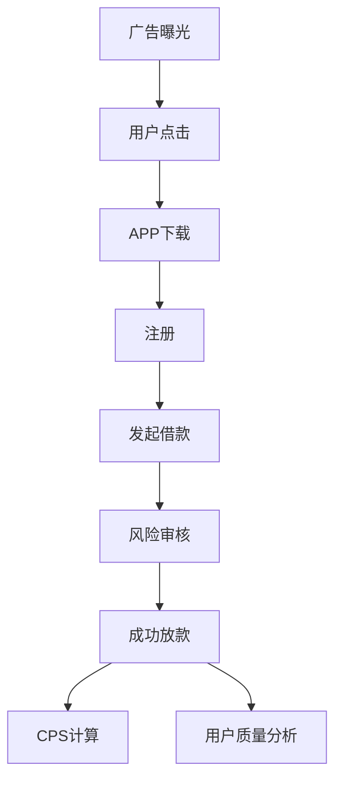
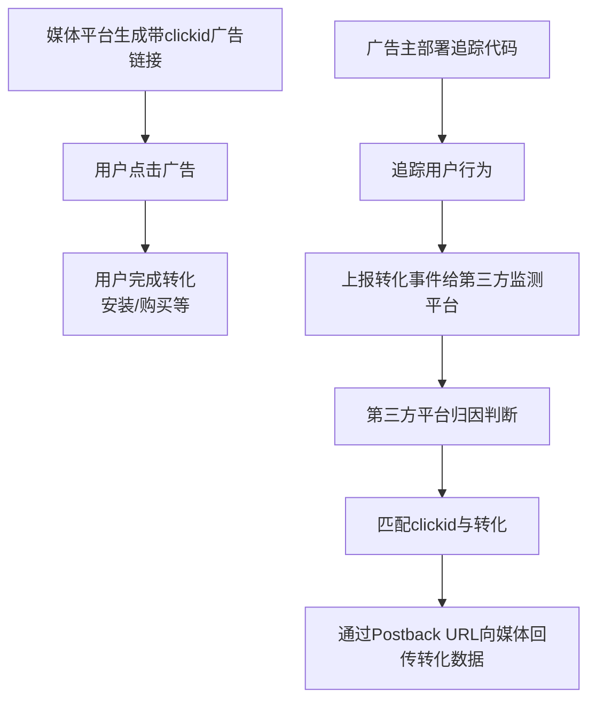

# 信贷行业广告投放策略与数据分析：完整方法论版

## 文档说明

本文基于「信贷行业广告投放策略与数据分析」系列文章进行结构化整理。

**整理原则**

- 保留原文全部核心内容，不删减原始观点、案例和公式；
- 清理原始提取中的分页噪音（页码、URL、时间戳等）并修复断句；
- 调整章节层级，补充目录与结构说明，使其更适合作为信贷行业广告投放分析方法论文档阅读；
- 原文由两篇系列文章构成：第一篇覆盖投放业务全景（第 1~9 章），第二篇对归因与回传机制做深度拆解（第 10~15 章），整理时保留这一递进结构。

**原始出处**：数据分析社区嘉宾-我爱数学（微信公众号：渭河数分星球），原文链接：https://mp.weixin.qq.com/s/4WNo4ojwb2YKHIjRPi4M6Q

## 目录

**第一部分 投放业务全景**

1. 业务逻辑与数据分析师职责
2. 广告投放基础概念
3. 核心投放指标体系
4. 预算制定与目标管理
5. 投放异动分析
6. 广告归因策略
7. 回传策略方法论
8. 素材分析方法
9. 投放 Dashboard 与数据监控体系

**第二部分 归因与回传机制深度拆解**

10. 确定性归因与概率归因
11. 自归因渠道与非自归因渠道
12. 归因体系的重要性
13. 广告回传机制
14. eCPM 广告竞价机制拆解
15. 回传策略优化案例

---

# 第一部分 投放业务全景

## 一、业务逻辑与数据分析师职责

放贷行业本身的业务逻辑很简单：公司需要找到**风险资质好**（不容易违约的）、且有**借款意愿**（缺钱的）的用户，然后**定价**（计算借他多少钱），把钱借出去。

前半句话就是投放侧的数据分析师在干的事：**如何获取用户**。

本文就来讲一下投放侧需要数据驱动业务的分析板块，以及一些基础的投放相关概念。投放是一个非常复杂的业务板块，也是互金的核心，中间的每一个 part 都可以单独写一篇文章，本文只起介绍作用。

## 二、广告投放基础概念

**消耗**：每天花多少钱进行投放。

**渠道**：投放的 channel，让用户在什么地方看到我们。国内的抖音、快手、B站，海外的 Google、Facebook、Meta 是一些主流的大媒体渠道，也是花钱的主战场；一些手机的应用商城、金融网站就是一些小流量渠道。

**素材**：投放时广告长什么样就是素材，如真人口播、图片、短视频。

**归因**：我要让人知道我们的 App，就要投广告，小红书、抖音、快手等等都可以投，人家看到我的广告就会下载。但有个问题：我同时在 3 个平台都投了，小张在三个平台都看到了我的广告，他下载了 App，那你觉得是哪个渠道的功劳呢？这就是广告最核心的**归因逻辑**——把用户的每一次行为归到某个渠道上。注意是每一个行为：小张在 A 渠道下载了 App，但是没注册；1 个月后在 B 渠道看到了广告、打开了 App，这时候注册了。那注册和下载的功劳分别应该归给谁？这就是归因。

## 三、核心投放指标体系

| 指标 | 公式 | 说明 |
|------|------|------|
| CPS | 消耗 / 放款人数 | 获取一名放款用户的成本 |
| CPA% | 消耗 / 放款金额 | 消耗占放款金额的比例 |
| CPI | 消耗 / 下载人数 | 获取一个下载用户的成本 |
| CPA | 消耗 / 发起借款人数 | 获取一个发起借款用户的成本 |
| CTR | 素材点击率 | 广告点击效果 |
| 风险通过率 | 成功放款的人 / 发起借款的人 | 借款用户质量 |
| 逾期率 | FPD7（短期风险）、FPD14（长期风险） | 贷款逾期水平 |

> 备注：这些指标同样是广告行业的通用指标。如 CPS（Cost Per Sale），概念是以实际销售产品数量来换算广告刊登金额，这里的产品数量等价于放款人数，消耗等于广告消耗金额——是同一个概念在不同业务下的换算逻辑。

## 四、预算制定与目标管理

每个月花多少钱？在哪些渠道花钱？每个月 CPS 目标是什么？这部分就是**预算和目标制定**，它直接决定了我们一个月的投放节奏：

- 预算拍得少了，月初向老板申请预算也少；如果市场环境很好，没钱加量，就错过了起量的机会；
- 预算拍得多了，月末没花完，和老板也不好解释。

那我们一般是怎么制定目标和预算的呢？

### Step 1：计算买量线边界

这部分一般是和经营分析的同学一起做的：计算出本月买一个用户花多少钱不会亏，以及今天花的这笔钱大概多久会收回来，也就是**回本周期**。如果一个用户需要平均 100 块获客，但他最终可能只能带来 80 的收益，那就是亏本买卖。

注意，这里带来的 80 元收益是包含**长尾效应**的——今天投了一个广告，可能今天就带来了一个新用户，但随着时间积累，可能来的用户越来越多。数据分析师就需要根据历史数据估算：今天投了 100 块，按照比例折算，今天带来多少用户才不亏本。这里面有预测的成分在。如果老板希望回本周期提前，那我们就要尽量压低买量线。

### Step 2：计算现在的边际 CPS

假设最近两周的消耗分别是 100、200，放款用户数是 2、3，那边际 CPS 就是 (200-100)/(3-2) = 100——意味着按照现在的投放节奏，多买一个用户需要多花 100 块钱。这个比例如果在买量线内，我们就认为是合理的，本月可以加量；如果超了，那就只能维持观察。

### Step 3：根据月初制定的预算目标和 CPS 目标，动态调整预算

比如近期风险很差、逾期用户比例很高，那哪怕我们的 CPS 成本很低，也不能加量；如果 CPS 很好、风险也很好，那我们可以在一定程度上增加消耗。

## 五、投放异动分析

一般投放最核心的两个北极星指标的异动分析就是**消耗**和 **CPS**。

### 消耗异动

你可能会觉得奇怪，消耗不是想花多少就花多少吗？其实不是——有的渠道不是你想花钱就花得出去的。以下是一些可能的原因：

**1. 出价过低**

在竞价广告系统中，出价是你愿意为一次点击或转化支付的价格。如果你的出价比竞争对手低，系统在竞价中就会处于劣势，无法赢得足够的曝光机会。

> 例子：销售高端护肤品，目标转化出价设为 50 元，但竞争对手们为了抢量出到了 80 元甚至更高。系统在寻找可能进行高价购买的用户时，会优先将广告展示给出价更高的广告主，导致你的广告很少被展示，消耗自然跑不起来。

**2. 广告计划处于"学习期"**

新的广告投放计划上线后，系统需要一段时间（通常是几天）收集足够的数据（约 50 个转化）来学习"谁是你的目标用户"。在学习期内，系统探索效率较低，消耗可能会不稳定或偏慢。

> 例子：新建了一个以"购买"为转化目标的计划，头几个小时系统可能消耗很慢，因为它还在试探性地向不同用户展示广告，观察谁会真的下单。一旦学习成功，消耗速度就会加快。

**3. 定向条件过窄**

设置的受众范围太小，系统没有足够的空间去寻找用户。

> 例子：在北京开了一家线下猫咖馆，投放时设置了定向：北京 + 朝阳区 + 20-25 岁 + 女性 + 最近养猫 + 喜欢搜索"布偶猫"关键词。这个群体可能总共就只有几万人，其中今天会打开 App 并且看到广告位的更是少之又少。盘子太小，预算当然花不出去。解决方案是逐步放宽定向，比如先扩大到全北京，年龄放宽到 18-35 岁等。

### CPS 异动

CPS 一般是我们最终的目标，对于 CPS 波动的分析就很重要了，常见的原因：

1. **市场环境在变激烈**：大家都在花高价买用户，我不得不也提高出价，成本自然变高。
2. **用户结构变化**：虽然我能很便宜地买到用户下载我们的 App，但是风险通过率在降低，来了他们借款都过不了——也就是 CPI 低但 CPS 高，主要是因为风险通过率低。
3. **用户借款意愿变弱**：来的用户看了一眼我们的额度或者利息，不感兴趣就走了——这就是 CPI 低但 CPA 高，导致 CPS 也高。

## 六、广告归因策略

一个用户可能今天看了抖音的广告，明天又在快手看到了广告，最后通过微信小程序完成借款。借款行为的功劳应该算给谁？**归因分析就是解决这个"功劳分配"的问题。**

听着好像很简单，但其实里面非常复杂：

- 如果用户卸载了 App，看到了另一个广告再下载，算新的渠道的功劳吗？
- 用户看到了抖音的广告下载了但没注册，过了一段时间之后看到了快手的广告进入 App 注册了，这算谁的功劳？
- 如果用户看了 A 广告，过了 30 天才下载，算这个 A 广告的功劳吗？如果过了 90 天才来，还算吗？

这部分需要单独一篇文章讲。

### 常见归因模型

| 归因模型 | 规则 | 特点 |
|----------|------|------|
| 最后点击归因 | 功劳 100% 归功于用户最后点击的那个渠道 | 简单，但可能高估了末端渠道的价值，忽略了前端渠道的"种草"作用 |
| 首次点击归因 | 功劳 100% 归功于用户第一次点击的渠道 | 与最后点击归因对称的另一种极简方案 |
| 多点归因 | 基于历史数据模型，为转化路径上的每个触点分配不同的权重 | 最科学、最公平的方式，但需要足够的数据量来支撑模型训练 |

## 七、回传策略方法论

大家有没有想过一个问题：为什么抖音推给你的视频广告这么精准？你喜欢玩游戏就给你推游戏视频，你喜欢宠物就给你推宠物视频。这后面除了推荐算法的作用以外，还有一部分就是**回传策略**的作用。

我要让抖音给那些我们希望曝光的人曝光，它是怎么知道我们需要哪些人的？就需要我们把想要的人的画像给他。抖音内部通过机器学习的方式学到这群人的画像后，之后他就会给这些人曝光了。所以**回传就是广告主和媒体方交互的一种方式：把我想要曝光的人传给媒体，让他去学**。

用户有各种行为——广告点击、App 下载、激活、注册、授信、发起借款、借款成功——我到底应该回传给媒体**触发了哪些行为**的用户？这就是回传策略。

**例子 1：回传所有下载用户，合适吗？**

假设我回传给媒体所有下载了 App 的用户，那大概率媒体侧学到的画像就是那些有贷款需求的用户，之后就会给他们曝光。但是里面有个问题：这些用户真的是好用户吗？

最开始我们就说过，我们的目的是找到既有借款意愿、同时资质又好的用户。这些下载了 App 的用户只能代表他借款意愿强，但**不代表他们资质好**——资质不好，就会在借款时被风险卡掉，那其实我是白白浪费了这笔投放费用。

**例子 2：回传所有借款用户，就是最优解吗？**

也不一定。他们虽然是真正我们希望找到的用户，但如果用户量少，其实也不利于媒体的机器学习模型去学——样本量越大，学的效果越好。这里就需要数据分析师通过不断的测试，寻找最优的回传人群。

**例子 3：风险通过率下降时，如何迭代回传策略？**

最近我们发现来我们这边借款的用户比例提高了，但是后端的风险通过率一直在降低。在风险模型没有变化的情况下，意味着我们获客的人群结构在变化，来的坏用户越来越多。这个时候我就要考虑对我的回传策略做迭代了——因为来什么用户，有很大程度是取决于我回传给媒体什么用户的。

这个时候我就会在回传给媒体的用户里做一些筛选，比如把年龄小的用户砍掉，把 A 卡分低的砍掉，这样能保证我传给媒体侧的用户资质稍微好一些。**怎么砍、怎么留、砍多少、放多少，就是回传策略需要考虑的事情。**

## 八、素材分析方法

这部分比较简单：就是我们在媒体上用哪些素材更容易吸引用户的眼球。广告素材的设计一般是由优化师和剪辑师负责的，数据分析师们大多都是充当回收数据和分析的工作。

比如：

- 红色的素材是不是比黑色的素材用户点击率更高？
- 视频素材是不是比图文素材曝光率更高？
- 视频素材里是真人口播还是场景介绍效果更好？

一般也就是通过**类 AB 实验**去对比测试。注意，这里是"类 AB 实验"，不是严格意义的 AB 实验——因为哪怕是两张除了颜色完全一样的图片，它们在媒体侧的曝光逻辑都不一样，有可能媒体天然的就喜欢给黑色图片曝光，意味着这两部分素材不是完全可比。

以上就是投放策略相关的主要数据分析内容，里面每个部分都可以单开一个专栏讲。我目前也不清楚其他行业的投放是不是和信贷的差不多，本文的内容只针对信贷行业，但我估摸着也八九不离十，希望分享的内容对大家有帮助。

## 九、投放 Dashboard 与数据监控体系

以下以一个日常的投放 Dashboard 和大家展示平时会做哪些简单的异动归因分析。

> 注：由于原始文档中 Dashboard 截图分辨率有限，无法完整识别原始表格中的所有字段名称和数值，以下按照图片可识别结构进行 Markdown 化还原。

### Dashboard 结构

| 模块 | 主要指标 | 分析目标 |
|------|----------|----------|
| 投放消耗 | Spend / 消耗金额 | 判断预算是否正常消耗 |
| 获客成本 | CPS | 衡量获取放款用户成本 |
| 流量指标 | 曝光、点击、CTR | 判断广告流量质量 |
| 用户转化 | 下载、注册、申请借款、放款 | 分析用户转化漏斗 |
| 风险指标 | 风险通过率、逾期率 | 判断新增用户质量 |
| 渠道分析 | Channel / Media | 比较不同渠道效果 |

### 投放分析漏斗



### 异动分析方向

**消耗异常**

| 问题 | 分析方向 |
|------|----------|
| 消耗下降 | 出价是否过低 |
| 消耗下降 | 广告计划是否处于学习期 |
| 消耗下降 | 定向范围是否过窄 |
| 消耗异常增长 | 市场竞争变化 |

**CPS 异常**

公式：

```
CPS = 消耗 / 放款人数
```

| 现象 | 可能原因 |
|------|----------|
| CPI 低但 CPS 高 | 下载用户多，但风险通过率下降 |
| CPA 高 | 用户借款意愿下降 |
| 消耗增加但放款下降 | 用户质量下降 |

---

# 第二部分 归因与回传机制深度拆解

> 本部分为系列文章第二篇，在上一篇归因与回传的基础上，深入拆解归因的技术实现、渠道差异，以及广告竞价最核心的 eCPM 公式，最后以一个真实案例展示回传策略优化的完整动作。

## 十、确定性归因与概率归因

上一篇我们讲到了广告投放行业归因的重要性，再复习一遍：**归因是判定一次用户转化（如购买、下载）功劳应该算给哪个营销渠道的规则和方法，其核心目的是弄清钱应该花在哪儿。**

### 1）确定性归因

这是最准确、最主流的匹配方式。它通过匹配两个完全相同的标识符来实现。具体来说：

- 当用户点击广告时，渠道记录下他的"设备 ID"；
- 用户安装 App 时，SDK 也上报"设备 ID"；
- 归因平台将两个 ID 进行比对，完全一致则匹配成功，就将用户下载 App 的行为归给了这个渠道。

确定性归因的结果是极其精准、确定无疑的，但是可能会高度依赖标识符的获取（如用户禁止追踪，就拿不到设备 ID）。

常用标识符：

- **设备 ID**：如手机的 IDFA（苹果）、GAID（谷歌安卓）；
- **用户 ID**：用户登录后的账号（如邮箱、手机号）。

### 2）概率归因

当无法获取精确标识符时，利用多种数据进行概率算法建模，推测一次转化最可能来自哪个渠道。当用户下载 App 时，归因平台分析这些数据，计算出一个概率值（例如 93% 的匹配度），如果概率超过某个阈值，就判定为匹配。

概率归因在隐私限制加强的情况下依然能进行归因分析，但是存在误差——是"最可能的"结果，而非"确定的"结果，一般在 90% 左右。

## 十一、自归因渠道与非自归因渠道

### 1）非自归因渠道（非 SRN）

非 SRN 指的是自我归因能力较弱或不进行自我归因的广告渠道。几乎所有除了那几个科技巨头之外的平台都属于此类，比如 Unity Ads、ironSource、AppLovin 等广告网络。

它们遵循行业通用规则，会将每次广告点击的详细数据（如设备 ID、时间、点击的广告信息）直接、实时地发送给像 AppsFlyer 这样的第三方归因平台，归因的规则完全由三方平台掌控。

### 2）自归因渠道（SRN）

自归因渠道媒体是拥有庞大用户数据和强大技术实力的科技巨头，最典型的代表就是 Meta、Google、Twitter、TikTok Ads、Apple Search Ads 等。

它们不轻易将原始数据（如每个点击对应的设备 ID）直接共享给第三方，因此它们拥有自己的一套归因系统。当有下载或者别的用户行为发生时，它们要求第三方平台来向自己"核实"。

## 十二、归因体系的重要性

上面的东西搞清楚了，我们回到最初的点：为什么说归因很重要也复杂？一句话概括就是：**谁（广告主、三方、媒体）都可以做归因，但是大家的立场和方法不一样，导致各自的归因结果也不一样**。不一样的情况下，那我应该相信谁？比如广告主认为小张是 A 渠道来的，三方平台认为是 B 渠道来的，A 渠道和 B 渠道都认为是他们的，那谁说了算？

我们先看三者分别是怎么做归因的：

### 媒体视角

用户访问 Meta 或 Google 等媒体时，媒体会给自己生态内的用户打上自己的标识符（如 Facebook 的 Cookie、Google 的 GCID），媒体查看在其生态系统内发生的所有用户互动完成归因。

比如一个用户在 Facebook 上点击了你的广告，但 24 小时后通过 Google 搜索你的品牌名并完成购买：

- Facebook 的逻辑："他点击过我的广告，所以这次购买是我的功劳。"
- Google 的逻辑："他是通过搜索我的渠道才完成购买的，所以这次购买是我的功劳。"

这是一个 **"黑盒"**：规则由媒体自己制定，且倾向于将转化功劳归于自己。

### 三方平台视角

三方平台会在广告主的 App 里进行埋点，也叫 SDK。当一个设备 ID-123 安装 App 并打开，SDK 就会向三方平台上报一次下载，这个时候三方平台就会在自己的数据库中查找设备 ID-123 在归因窗口期（如 7 天）内是否有广告点击记录：

- 如果匹配到渠道 A，则归因给 A；
- 如果匹配到多个渠道，则按照预设优先级（如最后一次点击；又比如优先考虑确定性归因，再考虑概率性归因）判决。其中也会根据渠道是否是自归因渠道做区分——根据广告渠道的不同，确定性归因又分为两种模式：
  - **匹配到非自归因渠道**：用户点击广告时，渠道将包含设备 ID 的归因链接传递给三方平台（如 AF）。用户激活应用时，AF SDK 上报设备 ID，AF 通过直接匹配两个设备 ID 完成归因。
  - **匹配到自归因渠道**：应用激活时，SDK 将设备 ID 上报给三方平台的服务器。服务器会向渠道（如 Facebook）的服务器询问："这个设备 ID（1234-5678-9012）的用户是你们带来的吗？"渠道根据自己记录的数据进行核实，并返回"是"或"否"的答案及相关广告信息。三方平台根据渠道的回复完成归因。
- 如果没匹配到，则记为自然量。

### 补充：什么是归因窗口期？

归因窗口期是指从用户发生广告互动（如点击或浏览广告）开始，到完成转化（如安装应用、购买商品）为止的一段预设时间：

- 如果转化发生在这个时间窗口内，这次转化的功劳就归功于那次广告互动；
- 如果转化发生在时间窗口之后，这次转化就不会归功于那次广告互动。

> 例子：你收到一张超市的 10 元优惠券，券上写明有效期至 2024 年 12 月 31 日。你在这个日期前去购物，结账时出示优惠券，成功抵扣 10 元，这次消费归功于这张优惠券；你在这个日期后才去购物，优惠券已经失效、无法使用，这次消费就与优惠券无关。

常见的归因窗口期通常分为两种：**点击归因窗口期**和**浏览归因窗口期**。

- **窗口期过长（如 30 天点击）**：能捕捉到更长的用户决策周期，适合高价值、长决策的产品（如汽车、旅游）。但也可能过于"贪婪"，抢走了本应属于其他渠道（如品牌搜索）的功劳，导致数据不够"新鲜"，优化调整会滞后。
- **窗口期过短（如 1 天点击）**：数据反馈快，能迅速优化广告，适合追求即时效果的快消品，但会漏掉很多延迟转化，严重低估广告的长期价值。

至于到底怎么定，是可以广告主根据自身的业务属性来自定义的，没有一个标准答案。

### 广告主视角

广告主使用用户的一方数据，这些数据只有广告主才能获得，比如用户注册的手机号、邮箱、系统生成的用户 ID、支付信息（如信用卡号、PayPal 账号）。用户下载后，广告主会同时看：

- 第三方平台的数据；
- 各个媒体的数据。

然后将第三方平台提供的归因数据（例如，"用户 ID-456 是由 Facebook 带来的"），与自己后台的业务数据（例如，"用户 ID-456 首单消费了 200 元"）进行关联并整合，最后归因。

**数据分析师或者策略分析师需要制定一套标准**去判断什么条件下应该用谁的归因。比如我优先相信三方平台的归因结果，但是超过了 3 天，我就用自己的归因结果。这个同样没有对错，只有合理。

## 十三、广告回传机制

回传本质上是**服务器与服务器之间通过特定 URL 进行的数据传输**，用于告知媒体平台"转化"这一行为的发生。

用大白话讲就是：告诉广告主，我的广告钱，到底花得值不值？

在没有回传的时代，广告主只知道在媒体（如 Facebook、Google）上花了钱、带来了多少点击，但完全不知道这些点击最终产生了什么价值——比如有多少人真的下载了 App、购买了商品、或者填写了表单。广告主知道有多少用户下载了我的 App，但是不知道他们是哪里来的；媒体知道有多少用户看了广告，但是不知道他们最后有多少转化。**回传的出现，就是为了打通"点击"和"转化"之间的数据壁垒**，让广告主能清晰地看到从点击广告到最终转化的完整效果链条。

国内外流程差异：

- **国内投放**：广告主可以直接将转化数据给到媒体；
- **海外投放**：广告主先把转化数据给到三方监测平台，再由监测平台向媒体回传数据。

### 回传流程示意



流程说明：

1. 媒体平台生成广告链接；
2. 用户点击广告并完成转化；
3. 广告主通过追踪代码记录用户行为；
4. 转化数据发送给第三方监测平台；
5. 第三方平台完成归因判断；
6. 归因结果通过 Postback URL 回传给媒体。

## 十四、eCPM 广告竞价机制拆解

把回传和归因讲清楚了之后，我们就可以拆解广告投放最核心的一个公式：**eCPM**。

### eCPM 定义

eCPM 指的是**每千次展示期望收入**。这是媒体平台（如 Meta、Google、TikTok）用来给广告排序的核心指标。简单来说，eCPM 高的广告更容易获胜、获得展示机会，它代表了每条广告在一次展示竞争中的竞争力。

**eCPM = 出价 × 预估 CTR × 预估 CVR × 调价因子**

### 因子拆解

**1. 出价**

出价是广告主在广告中设置的最高心理价位，表示广告主愿意为一次转化（如购买、注册）支付的最高费用。你告诉媒体"我的目标是用户放款，我愿意为一次放款转化出 10 美元"，媒体系统会利用它的大数据模型，自动估算出需要多少展示才能带来一次转化，并反过来帮你竞争展示机会。

出价是广告主最直接、最可控的杠杆，是 eCPM 计算的基准值。

**2. 预估 CTR**

这不是广告的历史 CTR，而是媒体平台基于实时上下文、用户画像和广告特征，**预测你这个广告对当前这位特定用户产生点击的概率**。影响因素为广告创意质量、用户兴趣标签、广告与当前媒体内容的匹配度等。

**3. 预估 CVR**

同样不是历史 CVR，而是媒体平台**预测如果这个用户点击了广告，他最终完成转化的概率**。影响因素：用户设备类型、地理位置、历史行为模式、落地页质量等。

**4. 调价因子**

调价因子是媒体平台为了帮助广告主控制成本而设置的出价上限。调价因子直接限制和影响了公式中的"出价"部分。你设置一个调价因子（例如 $10），媒体平台的算法会在不超过这个上限的前提下，智能地调整每次竞拍的实际出价，以尽可能多地获取转化。

### 预估 CTR / CVR 是怎么计算出来的？

这其实是媒体平台和广告主之间共同决定的：媒体平台有自己的机器学习算法，而广告主把样本量给到媒体平台，让他们去学习。

为什么上面要先讲回传和归因？因为这个地方会用到：假设 A 媒体某个广告一共发生了 100 次点击，实际的转化用户数是 10 次，我把这 10 个用户全部传给媒体，那在本次的机器学习模型中，正样本就是 10 个。

但是如果我的回传和归因策略做了一些调整——我把一些我认为不是这个渠道的转化、以及一部分女性转化用户剔除了，不传给媒体——那媒体那边接受到的转化数可能就是 7 个，同样 100 次点击里正样本量就是 7 个，那模型训练出来的预估 CTR 和预估 CVR 肯定不一样。

这就是**回传策略和归因策略很重要的原因：我回传的归因的用户数直接决定了预估 CTR 和预估 CVR，间接影响 eCPM**。

那到底怎么传、传多少、传给媒体什么样的用户带来的预估 CTR 和预估 CVR 更好？这其实是个黑箱，我们只能通过不断的测试和调整才能知道效果——可能在 A 渠道我们多传效果好，在 B 渠道少传效果好。

### 完整闭环：归因 → 回传 → 算法优化

**归因："功劳认定"**

当用户点击广告并完成转化后，归因过程会判定这次转化应该记在哪个媒体、哪个广告的头上。没有正确归因，所有的数据都是混乱的——系统无法知道哪个广告计划带来了转化，也就无法计算该广告计划的 CVR。

**回传："数据反馈"**

归因确定后，会通过回传将这次转化事件通知媒体平台。这是整个学习循环的"氧气"——回传提供了计算 CVR 所必需的"转化次数"数据。

**闭环形成与算法优化**

媒体平台收到回传后，就知道："原来这个点击，最终产生了一个价值 $X 的转化。"这些海量的回传数据持续输入媒体的算法模型，使得模型能更精准地预测：一个新用户点击广告后，他发生转化的概率（即 CVR）有多大。这个"预测 CVR"会直接代入 eCPM 公式中，用于下一次广告拍卖。

当系统通过回传数据学习到某类用户群的转化率（CVR）很高时，它在遇到类似新用户时，就会给出一个较高的"预测 CVR"，从而计算出更高的 eCPM，更积极地竞拍并向他们展示广告。

## 十五、回传策略优化案例

### 案例背景

最近我们发现 A 渠道转化用户数在提高，但主要是因为**薅羊毛的新客用户**在增加，这其实不是一个好现象——这意味着我们广告投放带来了很多低质量的用户。

### 策略动作

为了减少对于这部分用户的曝光，我们做了回传策略的调整：通过一个 LTV 模型把那些 LTV 值很低的用户找了出来，比如找到了分数最低的 20% 用户，他们 ARPU 很低，并且也没有复购。对于这部分用户，我们原来的回传策略是会把他们当作一个转化给到媒体去学习的，现在我们**把他们砍掉，不再当作转化用户回传了**，这个时候我们回传的量级就会减少 20%。

### 策略带来的两个影响

1. 媒体平台学到的用户质量会变好——因为羊毛用户不会再给到媒体了；
2. 学习样本量减少。

### 配套动作与分析

这时候策略需要相应的做的动作和分析就是：

1. **提高出价**：因为学习样本量少了，媒体能找到的人就少，如果不提高出价，可能我们曝光的量也会少；
2. **实时监控前端转化量的变化是否符合预期**：我们砍掉了 20% 的用户，是不是真实每天回传的量级就是减少了 20%？
3. **分析后续带来的用户质量是不是真的在变好**：薅羊毛用户是不是在减少？用户复购率是否提升？

---

> 本文作者：数据分析社区嘉宾-我爱数学
