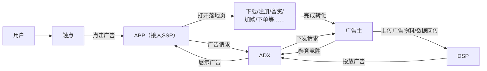
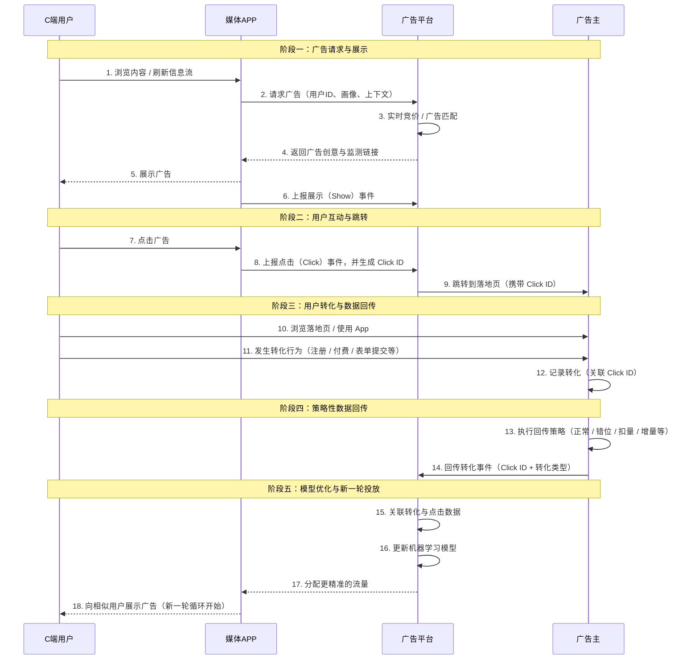

# 广告回传全流程

# 什么是广告回传？

一句话搞懂广告回传，我给你数据，请你在茫茫人海中，帮我找到我想要的人（广告主视角）

**广告回传**——也称为广告主“转化数据回传”，是指在数字广告投放中，广告主将真实转化的用户和转化事件，发送给媒体平台（如巨量引擎、腾讯广告、Google Ads等），这一过程，由广告主自发进行，收集数据，并把数据通过广告主服务器或监测平台，回传给媒体平台的过程。

## 广告投放与转化链路



### 原始架构文字版

```text
用户 → 触点 → 点击广告 → APP（接入SSP）
                         │
                         ├──────── 广告请求 ───────→ ADX ←──── 投放广告 ──── DSP
                         │                          │                       ↑
                         │                          └─ 展示广告 ───────────→ APP
                         │                          │
                         │                          ├─ 下发请求 ───────────→ 广告主
                         │                          ↑
                         │                       参竞竞胜
                         │                          │
                         ↓                          │
                    打开落地页                     │
                         ↓                          │
              下载/注册/留资/加购/下单等……          │
                         │                          │
                         └────── 完成转化 ─────────→ 广告主
                                                    │
                                                    └─ 上传广告物料/数据回传 ─→ DSP
```

由图可知，回传是一种 **“告知”** 机制：由**广告主告诉媒体平台**：媒体之前带来的那个用户，刚刚完成了我们约定的有价值的行为（比如下单、注册、付费等）。

举个🌰：一个水果果农，每年把自家自产的水果自销给水果批发商。水果批发商则将水果卖给想买水果的用户。由于果农不直接对顾客售卖，所以果农对于不同区域不同用户对的水果偏好是不了解的。在这个过程中，如果果农直接不管水果批发商对应的销售客群，一味的只上新水果，但水果批发商对应的客群不买单，那么就会导致水果批发商批发了水果但是卖不出去，于是不再向果农进行批发。同理，对于水果批发商而言，如果不主动告诉果农，当下市场下哪些用户对什么水果感兴趣，什么水果卖的最好，那么果农下一批要上季什么水果就只能是根据自己的揣测进行判断。结果会导致批发商进购了果农上新的水果，最终却滞销的情况。这种情况导致了果农和水果批发商双输的局面。

根据上述的例子，我们发现，要实现利益最大化，无论是果农还是水果批发商，都需要进行密切的交互合作，果农必须知道时下，水果批发商对应客群对什么类型的水果有强烈的购买欲，那么果农在给批发商上新时，双方才能利益最大化。

上述的例子中，果农充当了媒体的角色，水果充当了媒体流量角色，水果批发商充当了广告主的角色。这整个过程，不由果农主导，也不由水果批发商主导，而是完全由市场化进行主导。**广告过程同样如此，广告主和媒体之间，要确保流量价值的最大化，需要根据广告主所面向的转化客群，计算其精确价值。并基于市场反馈，为下一次市场行为进行指导。**

# 为什么要回传？

上面例子充分说明了广告主和媒体之间数据合作的必要性。但除了能够帮广告主精准找人外，广告主数据回传给媒体，是否存在风险？如果广告主不回传端内的转化数据给媒体，媒体是否还能找准用户？要理解广告主为什么要回传，我们就必须理解广告主和媒体在这个过程当中的博弈。基于广告主和媒体之间的角色一同和博弈规则进行深度分析，明白回传的作用机制，才能知道如何利用好回传，才能去做好投放。对于媒体而言，如何洞察广告主的回传数据，才能做好回传的机制建模。

| 角色   | 博弈点                                                                                                                                                                                                                                                                                                                        |
| ------ | ----------------------------------------------------------------------------------------------------------------------------------------------------------------------------------------------------------------------------------------------------------------------------------------------------------------------------- |
| 媒体   | 通过广告主反馈的真实转化数据，知道哪部分客群是该广告主的意向转化客群，通过**拿到这部分客群的数据，并基于该部分客群做精细化人群探查，通过算法推荐，持续不断为广告主供给更精准的意向用户，从而使广告主能够在此博弈过程中竞拍出高价，实现平台最大化收入（通过高效竞价）和长期生态健康（通过广告主持续投流）**              |
| 广告主 | 通过把真实已转化的用户反馈给到媒体，让媒体知道广告主的偏好人群。假设媒体算法模型识别用户足够精准，那么**广告主反馈给媒体的样本数越多，分层越精细，对于媒体而言，可用于模型建模的训练数据就越完整，模型训练的AUC就越高。在此过程中，广告主核心目标是通过反哺数据，找到更合适的人，最小化CPA（每次转化成本），最大化ROI** |

我们来看下C端用户，媒体APP，广告平台，广告主之间的关系，并结合其广告请求时序和回传分析：

## 广告投放与转化回传全链路

> 以下使用 Mermaid `sequenceDiagram` 保留原图的**四方泳道 + 五阶段 + 18 步时序架构**。



### 架构摘要

**参与方：** C端用户 → 媒体APP → 广告平台 → 广告主

**阶段一：广告请求与展示**
浏览内容 → 请求广告 → 实时竞价/匹配 → 返回广告 → 展示 → 上报 Show

**阶段二：用户互动与跳转**
点击广告 → 上报 Click 并生成 Click ID → 跳转落地页

**阶段三：用户转化与数据回传**
浏览落地页 / 使用 App → 发生转化 → 广告主记录转化并关联 Click ID

**阶段四：策略性数据回传**
执行回传策略 → 回传转化事件

**阶段五：模型优化与新一轮投放**
关联点击与转化 → 更新模型 → 分配精准流量 → 新一轮广告展示

根据上面的时序流程图，我们从**媒体pCTR和pCVR的预估环节**和**媒体的计费模式**两个核心环节进行拆解分析：

## 从媒体pCTR和pCVR的预估环节拆解

媒体的核心技术依赖于预估模型：

- **pCTR（predicted Click\-Through Rate）**：预测用户点击广告的概率。

  - 媒体通过历史数据（如用户 demographics、上下文信息）训练pCTR模型，但pCTR的准确性高度依赖后续转化数据。

    - *原因*：转化数据能揭示“高质量点击”的特征。eg，如果某类用户点击后高概率转化（如高消费人群），媒体可反向优化pCTR模型，优先将广告展示给类似用户。
    - *广告主回传的价值*：

      - 若广告主不回传转化数据，媒体仅能基于点击行为优化pCTR，但点击可能来自“低质量流量”（如误点或机器人），导致pCTR虚高。
      - 回传后，媒体将转化数据作为pCTR模型的**隐式反馈信号**（例如，通过多任务学习模型），区分“有效点击”和“无效点击”。这提升pCTR的精准度，减少低价值展示，间接降低广告主的无效点击成本。
    - *广告主动机*：广告主回传数据后，媒体能更精准筛选高意向用户，提升广告的**点击质量**，从而在相同预算下获得更高转化量（例如，pCTR优化后，CPM成本可能上升，但CPA下降）。
- **pCVR（predicted Conversion Rate）**：预测用户点击广告后完成转化的概率。

  - pCVR模型直接依赖转化数据训练。媒体无法直接观测转化（因转化发生在广告主站内），必须由广告主回传。

    - *原因*：pCVR是竞价中的核心出价因子。在oCPM（optimized Cost Per Mille）等模式下，媒体基于pCVR × bid计算eCPM（有效千次展示成本），决定广告胜出概率。
    - *广告主回传的价值*：

      - 无转化数据时，媒体只能用代理指标（如点击时长、页面停留时间）粗略估计pCVR，导致**预估偏差**（例如，高估低转化用户群的pCVR）。
      - 回传后，媒体获得真实转化标签，可：
        \(1\) 校准pCVR模型（如使用深度学习模型处理延迟转化）；
        \(2\) 识别高转化用户特征（如“25\-34岁女性在晚间点击后转化率高”）；
        \(3\) 动态调整出价策略（如对高pCVR用户群提高bid）。
    - *广告主动机*：更准确的pCVR使媒体能将预算集中在高转化用户上，避免“浪费曝光”。

由此可见，在预估环节，转化数据回传是**解决信息不对称**的必要手段。广告主通过回传数据，帮助媒体构建更精准的pCTR/pCVR模型，最终实现**投放效率的帕累托改进**——媒体提升平台竞争力，广告主获得更高转化量。若广告主隐瞒数据，媒体模型将“盲人摸象”，导致广告主实际转化成本上升（例如，pCVR低估时，媒体可能过度展示给低价值用户）。

## 从媒体的计费模式进行拆解

媒体的计费模式决定广告主的付费逻辑和媒体的收入结构。转化数据回传直接影响计费可行性与公平性。

- **CPC模式下的分析**：

  - 计费仅依赖点击数据，转化数据回传**非强制**，但广告主仍有动力回传。

    - *原因*：媒体虽不直接计费转化，但会用转化数据优化流量质量。

      - 若广告主不回传，媒体无法区分“高转化点击”和“低转化点击”，可能持续推送低质流量（如刷量点击），导致广告主CPA升高。
      - 回传后，媒体将转化数据纳入**流量筛选机制**（例如，对低转化率用户群降权），提升点击的“转化效率”。广告主虽按点击付费，但每次点击的转化概率上升，**实际CPA下降**。
    - *广告主动机*：长期看，回传数据可降低隐性成本。例如，某App推广广告主在CPC模式下回传安装数据，媒体优化后，点击成本微升5%，但安装率提升20%，净成本降低。
- **CPA/oCPM模式下的分析**：

  - 转化数据回传**成为计费前提**，缺失将导致系统崩溃。

    - *CPA模式*：

      - 媒体仅在转化发生时向广告主收费。若广告主不回传转化数据，媒体无法确认转化，计费流程中断。
      - *博弈陷阱*：广告主可能隐瞒数据以“逃单”（如声称未转化），但媒体会设置**数据验证机制**（如通过SKAN框架或服务器回调）。长期隐瞒将导致：
        \(1\) 媒体暂停广告投放（因无法结算）；
        \(2\) 广告主失去优化支持，转化量暴跌。
      - *广告主动机*：主动回传是维持合作的基础。例如，某游戏公司使用CPA模式，回传付费用户数据后，媒体可动态调整出价，将CPA稳定在5以下；若隐瞒，媒体保守出价，*CPA*升至8\+。
    - *oCPM模式*：

      - 媒体以转化目标优化展示，出价公式为：`bid × pCVR`。
      - 转化数据是pCVR校准的**唯一真实来源**。若广告主不回传：
        \(1\) pCVR模型漂移（如新活动上线时预估失效）；
        \(2\) 媒体被迫使用过时数据，导致出价失准（例如，高估pCVR时过度消耗预算）。
      - *广告主动机*：回传数据确保媒体出价贴合实际转化价值。例如，某电商在大促期间回传实时转化数据，媒体将pCVR权重调高，广告主获得更多高意向流量，GMV提升25%。

在计费环节，转化数据回传是**计费闭环的基石**。CPC模式下，它提升效率；CPA/oCPM模式下，它是生存必需。广告主隐瞒数据的短期“收益”（如避免媒体提价）会被长期损失（如流量质量下降、合作终止）抵消，理性选择是主动回传。

广告回传是效果广告的基石，是广告是否能投好，投出量的关键因素之一，核心作用如下：

1. **优化投放效果（最核心的作用）**

   - 媒体平台收到回传的转化数据后，其算法可以学习到 “什么样的用户更容易转化”。
   - eg：系统发现来自A渠道、B年龄段、对C类兴趣标签的用户点击广告后，购买率很高。那么系统就会自动调整，将更多广告预算投向这类高价值人群，从而提升整体ROI（投资回报率）。
2. **实现自动出价策略**

   - 广告投放大量使用oCPM、oCPC等智能出价模式。这些模式的核心就是需要转化数据来指导出价。
   - 系统通过回传数据，知道一个点击大概值多少钱（能带来多少转化），从而动态地为每个展示机会出价，确保用合理的成本获取转化。
3. **准确的归因分析**

   - 回传数据帮助广告主清晰地了解，每个媒体渠道、每个广告计划甚至每个创意，分别带来了多少实际转化。这对于评估渠道价值和分配预算至关重要。
4. **数据驱动决策**

   - 为广告主提供可靠的、基于第一方数据的转化报告，用于分析用户行为、优化产品落地页和营销策略。

# 广告回传技术流程

广告回传通常通过 **Server\-to\-Server（S2S）** 的方式实现，这是一个典型流程：

1. **用户点击广告**：用户在媒体平台（如抖音）上点击了某个App的广告。
2. **媒体平台记录点击**：媒体平台生成一个唯一的 “Click ID”，并记录这次点击。
3. **跳转与激活**：用户被引导至应用商店下载并安装App，然后打开App（激活）。
4. **广告主服务器上报激活**：App内的SDK或广告主服务器会向媒体平台发送一个“激活”信号，并带上之前记录的Click ID，说：“这个Click ID对应的设备安装并打开了App。”
5. **用户发生转化**：用户在App内完成了关键行为，如“注册成功”或“完成支付”。
6. **广告主服务器回传转化**：广告主的服务器将这次“转化事件”（连同对应的Click ID或设备信息）发送回媒体平台的服务器。
7. **媒体平台接收并关联**：媒体平台根据收到的Click ID，成功将这次转化与最初的广告点击关联起来，并在广告后台的报告里显示出来。

以上，我们看到了回传事件的数据流，我们拆解下回传的核心技术

- 架构简化：采集层→策略层→传输层（API/SDK）→媒体接收层→媒体应用层
- 设备 ID 统一：优先采集 OAID/IDFA/Android ID 等唯一标识符，确保跨渠道用户行为可关联；
- 字段必选清单：必须包含「事件类型（event\_type）、时间戳（timestamp）、广告计划 ID（ad\_id）、设备 ID（device\_id）、回调标识（callback/click\_id）」，避免因字段缺失导致归因失败；
- 实时性保障：前端埋点触发后 1 秒内完成数据捕获，后端埋点（如付费）在业务逻辑执行完成后立即触发采集；
- 数据一致性：广告主侧与媒体侧通过「callback/click\_id」唯一关联，避免重复回传（通过 Redis 记录已回传 ID，去重处理）；
- 助攻数据：策略层标记「assist=true」，传输层使用单独的 API 接口（部分媒体提供专属助攻回传接口），接收层单独路由至媒体的助攻模型训练模块，不进入计费结算流程

```Plain
graph TD
    A[用户点击广告] --> B(媒体平台记录Click ID);
    B --> C[用户下载激活App];
    C --> D[广告主上报激活（带Click ID）];
    D --> E[用户在App内转化（如付费）];
    E --> F[广告主服务器回传转化事件（带Click ID）];
    F --> G(媒体平台关联数据);
    G --> H[广告后台显示转化数据];
```

# 广告回传方式

根据回传的数据粒度，可以分为：

- **离线回传**：定期（如每天一次）以文件的形式批量回传转化数据。延迟较高，但适合数据量大、对实时性要求不高的场景。
- **实时API回传**：通过API接口，在用户发生转化后几秒到几分钟内立即回传。这是目前最主流的方式，能最大程度地保证投放系统优化的实时性。

一般情况下，媒体会要求广告主通过实时回传的方式，将转化数据直接反哺给到媒体，媒体拿到这部分数据后，可以实时的进行归因数据归一化处理。但广告主为了控量和做分层的广告回传表达，所以，通常可以采用异步方式，对回传数据进行处理。

# 核心回传策略

知道了回传的基本模式，回传时，广告主还可以通过深度的回传策略来控制成本，优化自己的目标。例如广告主可以通过正常回传、虚拟回传（含错位、扣量/增量/前置），广告主既能保护数据安全，又能灵活优化投放拿量效率。

### 一、回传策略

#### 1\. 正常回传

- 核心逻辑：**真实行为与回传事件**一一对应，激活报激活、付费报付费。
- 适用场景：数据敏感度低、需媒体精准核算效果（如按CPA结算）、追求投放透明化的广告主。

#### 2\. 虚拟回传（核心进阶策略）

##### （1）错位回传（事件包装）

- 浅报深：**浅层行为报深层事件**（激活→注册、留资→付费）

  - *目的：快速探索高潜力流量池，扩大优质获客规模*
- 深报浅：**深层行为报浅层事件**（注册→激活、付费→入群）

  - *目的：后端转化差时，提升竞价能力，精准优化获客模型*
- 深浅结合：**多事件组合搭配双出价**

  - *目的：适配广告组诉求、预算及出价目标，灵活平衡量与质*

##### （2）扣量/增量回传（数量调控）

- 扣量回传：过滤低意向用户或流量波峰期的低价量，**仅回传高价值行为**。

  - 适用场景：识别低意向用户、获客成本骤降时，可随机扣量（短剧行业高频使用）。
  - 关键操作：同步提高出价系数，保证实际获客成本不超预期。
- 增量回传：对私域转化用户重复/额外回传，**补充媒体意向用户数据**。

  - 适用场景：获客难度大、账户起量困难，需加速媒体建模。

##### （3）前置回传（时间提前）

- 核心逻辑：搭建用户评估体系，预估转化概率（如次留、付费潜力），提前回传高概率用户。
- 适用场景：转化数据滞后（如次留需次日统计），需加速媒体建模效率。

**回传策略核心目的**

- 数据安全：虚拟回传不暴露真实深层数据，规避敏感度风险。
- 拿量灵活：错位回传调整竞价优势，扣量/增量适配流量波动，前置回传加速建模。
- 成本可控：扣量\+提价、增量补数据的组合，平衡规模与成本。

### 二、分层回传

分层回传——指的是广告主不将所有转化用户都用一个简单的“转化”信号回传给媒体，而是**根据用户的质量、生命周期价值或具体行为特征，将转化事件划分为不同的层级，并将这些不同层级的价值信号回传给媒体平台**。

随着媒体平台的能力升级，媒体侧对于广告主转化用户，也打上不同的用户质量分层的tag，通过该tag媒体可以将不同用户数据，放入不同切片数据池训练并进行模型。

\.png" />

上图我以腾讯渠道的授信额度\-质量分模型为例，从授信额度上分别划分为高、中、低等不同的三个额度，则不同额度对应的用户在我方对应授信质量也存在差异。**核心逻辑是广告主通过授信质量\(质量分\)回传至媒体侧，让媒体在回传的用户池基于授信额度的节点，进行联合建模，并根据用户模型分层，做相似召回人群预估，分配客群流量调整到ocpx的出价模型侧，在出价建议时给予到对应的出价系数分层。**

- **选择回传节点：**在不同的转化事件节点完成回传，例如：完件节点，授信节点，放款节点；
- **编辑层数**：最低3层，可在3个分层基础上不断拓展，最多支持10层；
- **编辑规则**：每一层可针对进行选择具体的数据指标，并填写对应的条件，通过规则集关联，规则集当中可设定各个子规则指标，关联好的规则条件在此处可供在下拉列表中选择对应的规则

*eg：针对授信额度\-“极优”的指标，圈选规则，授信额度＞20000，年龄区间为22\-30之间的这一部分用户，对应映射层级关系为高质量用户*

- **支持分层分值：**支持针对设计的分层层级，设置层级所对应的分值。目的是根据授信额度的人群分布可将对应分值区间，设置分层分值的稀疏程度。

\.png" />

### 三、助攻回传

**助攻回传是广告领域多触点归因体系下的一种特殊数据回传方式，广告主主动将归因到其他媒体渠道的用户转化数据，回传给当前投放的目标媒体，这些数据仅用于辅助媒体优化广告模型，不参与计费和投放报表核算。**简单来讲，媒体有多套模型，一套主模型，用来计算回传的效益并进行预估建模，另外一套为辅助回传，用于模型数据采集和训练模型，确保模型不会失衡。

*eg：用户将归因给头条的用户转化数据，回传给了腾讯，帮助腾讯拿这部分样本进行训练，这种就是助攻回传。*

> 1. **核心价值**
>
>    - **补齐媒体数据短板**：单一媒体只能监测自身平台的曝光、点击行为，没法掌握用户在其他平台的互动转化情况。助攻回传能让媒体获取跨渠道数据，比如用户在抖音看了广告，却在小红书完成下单，广告主将这笔小红书的转化数据回传给抖音，就能帮抖音补全用户行为链路。
>    - **优化广告投放效果**：对转化样本少的行业来说，单媒体数据会导致模型训练不充分。而助攻回传的跨渠道数据能丰富模型训练的样本量和特征，比如OPPO广告的助攻模型，靠广告主回传的三方渠道转化数据优化pCVR，助力广告起量；快手的多触点助攻数据还能帮模型拓展相似人群，减少投放试错成本。
> 2. **典型应用场景**
>
>    - **oCPX投放起量**：广告主投放OPPO广告时，若激活成本已达出价极限，可回传OPPO设备上其他三方渠道的转化数据，助攻模型会辅助oCPX模型优化，在不提高出价的前提下提升跑量能力。
>    - **深度转化目标优化**：投放教培行业广告时，广告主不仅回传课程试听转化，还可将用户在其他平台的正价课购买数据作为助攻数据回传，媒体据此优化模型，更精准定位高付费意向人群。
>    - **跨平台链路补全**：用户在微博浏览美妆广告后，未立即购买，后续在淘宝完成复购，广告主将该复购数据回传给微博，微博可据此判断这类美妆广告的潜在价值，调整对同类用户的曝光策略。
> 3. **关键特点**
>
>    - **不计入计费结算**：助攻回传的数据仅用于模型训练，不会算进当前媒体的转化报表，也不影响广告主与媒体的计费对账，避免重复计费争议。
>    - **对数据质量要求高**：错误数据会大幅影响模型效果，因此回传需保证数据稳定准确，部分媒体还对三方数据量级有门槛要求，比如快手建议初期回传数据量为自身转化数的2倍。
>    - **多通过设备ID关联**：回传时通常依靠OAID、IDFA等设备标识符关联不同渠道的用户行为，再由媒体单独训练助攻模型，避免干扰主投放模型的原有逻辑。

### 四、不同生命周期阶段回传策略

| 生命周期阶段               | 核心目标                                          | 关键挑战                           | 推荐回传策略                                                             | 策略详解与注意事项                                                                                                                                                                                                                                                                                                                                                       |
| -------------------------- | ------------------------------------------------- | ---------------------------------- | ------------------------------------------------------------------------ | ------------------------------------------------------------------------------------------------------------------------------------------------------------------------------------------------------------------------------------------------------------------------------------------------------------------------------------------------------------------------ |
| **1\. 冷启动阶段**   | **模型快速破冰**让系统认识“什么是转化”    | 无数据或数据少，模型无法学习       | **保守真实策略**• 正常/深报浅• **可增量回传**              | **策略逻辑：** 选择如“激活”、“注册”、“添加购物车”等发生概率高、数据延迟低的事件作为转化目标。目的是快速积累一批转化数据，帮助模型建立初步认知。“深报浅”示例： 目标是付费，但初期可回传“注册”或“关键页面浏览”。*注意事项： 切忌一开始就回传深度事件（如付费），会导致数据量过小，模型学习失败，计划永远跑不出去。*                                    |
| **2\. 起量阶段**     | **快速放量**在成本可控下扩大用户规模        | 如何突破流量瓶颈，找到更多潜在用户 | **激进探索策略**• 浅报深• **增量回传**                     | **策略逻辑：** 当模型通过浅层事件稳定后，为了寻找更多可能性，可以将浅层事件（如激活）回传为深层事件（如付费）。系统会认为你的预算充足且目标高价值，从而为你探索和竞争更广阔的流量池。*注意事项： 必须密切监控后端真实成本。此策略可能会暂时拉高转化成本，需要确保后端ROI能覆盖。*                                                                                |
| **3\. 计划稳定阶段** | **控制成本，提升价值**维持稳定投放并优化ROI | 如何花更少的钱买更好的用户         | **价值优化策略**• 分层回传• 正常回传• **扣量回传**        | **策略逻辑：** 这是进行精细化管理的最佳时期。1\. **分层回传：** 将“付费”区分为“小额付费”和“大额付费”，引导系统优先寻找高价值用户。2\. **正常回传：** 回归真实目标，让模型在真实数据上微调。3\. **扣量回传：** 过滤掉低质流量，告诉系统哪些用户你不想要，从而降低整体成本。*注意事项： 策略调整要循序渐进，避免大幅变动导致模型震荡。*    |
| **4\. 衰退阶段**     | **挽救计划，延缓衰退**重新激发模型活力      | 计划疲劳，成本上升，量级下降       | **重置与刺激策略**• 更换回传事件• **深浅结合**             | **策略逻辑：** 给模型一个新的学习目标来打破僵局。1\. **更换事件：** 如果之前回传“付费”，可以尝试改为回传“次留”或“关键行为”。2\. **深浅结合：** 使用双目标出价，一个浅层事件保量，一个深层事件保质，给模型更多优化维度。*注意事项： 此阶段是“抢救性”的，成功率并非100%。如果多次调整无效，应果断关停计划，重新创建。*                         |
| **5\. 不起量计划**   | **诊断问题或低成本测试**                    | 无法获得曝光或转化                 | **诊断与测试策略**• 回传极浅层事件• **检查归因与回传链路** | **策略逻辑：** 首先排除技术问题，然后进行极限测试。1\. **链路检查：** 确认从点击到归因再到回传的整个数据链路是否畅通。2\. **极浅层事件：** 将目标设为“点击”或“APP内关键页面浏览”，看计划能否起量。如果能，说明是转化目标设置过高；如果仍不能，可能是出价过低或创意吸引力问题。*注意事项：此类计划不应占用过多预算和精力，应快速试错，快速决策。* |

# 分行业广告主回传指标

不同行业广告投放的核心商业目标差异较大，数据回传指标也各有侧重。以下整理了短剧、电商、教育等主流行业的数据回传关键指标表，涵盖基础互动、中间转化、核心转化及长期价值类指标，适配巨量、快手等主流广告平台的优化需求。

| 行业                         | 基础互动指标（判断广告吸引力）                            | 中间转化指标（评估用户意向）                         | 核心转化指标（核心商业目标）                    | 长期价值指标（优化长期投放）                                                  |
| ---------------------------- | --------------------------------------------------------- | ---------------------------------------------------- | ----------------------------------------------- | ----------------------------------------------------------------------------- |
| 短剧                         | 曝光量、点击率（CTR）、完播率、观看时长、分享率           | 剧情节点停留时长、选集解锁点击量、试看章节完成率     | 付费解锁金额、充值金额、订阅成功数              | 次日留存率、3日付费率、用户生命周期价值（LTV）、复购充值金额                  |
| 电商                         | 曝光量、点击率（CTR）、商品页访问量、加购率               | 购物车停留时长、地址填写完成率、优惠券领取数         | 下单量、支付成功金额、订单完成数                | 复购率、客单价（Average Order Value）、广告支出回报率（ROAS）、弃单挽回成功率 |
| 教育（含K12、职业教育）      | 曝光量、点击率（CTR）、落地页停留时长、课程详情页浏览量   | 表单提交量、电话咨询量、试听预约数、直播公开课到场率 | 试听转化率、课程购买金额、报名缴费人数          | 学员续课率、课程完课率、转介绍率、线索质量分（地域/需求匹配度）               |
| 本地生活（含餐饮、到店服务） | 曝光量、点击率（CTR）、门店地址点击量、导航跳转次数       | 优惠券核销点击量、预约到店提交数、团购下单量         | 到店核销数、团购消费金额、服务体验好评数        | 门店复购率、用户到店频次、跨品类消费金额                                      |
| 金融（含理财、贷款、保险）   | 曝光量、点击率（CTR）、产品详情页访问量、测算工具使用次数 | 手机号留资量、风险测评完成率、预约咨询量             | 开户数、投保成功数、授信数、理财资金存入金额    | 账户活跃率、资金留存时长、续投金额、理赔申请处理完成率                        |
| APP推广                      | 曝光量、点击率（CTR）、下载启动数、页面打开速度           | 注册完成数、实名认证完成率、核心功能点击量           | 会员开通数、内购消费金额、付费功能使用次数      | 次日/7日留存率、月活跃用户数（MAU）、用户日均使用时长                         |
| 医美健康                     | 曝光量、点击率（CTR）、项目详情页访问量、在线咨询量       | 面诊预约数、体验套餐购买量、体检套餐预约数           | 手术/治疗成交数、套餐核销金额、健康服务购买金额 | 术后好评率、二次项目复购率、用户推荐率                                        |

# 回传策略选择决策表

| 决策维度组合                                          | 优先回传策略         | 核心操作要点                                                                                                                                                                                       | 适用行业/场景                | 风险提示                                                                   |
| ----------------------------------------------------- | -------------------- | -------------------------------------------------------------------------------------------------------------------------------------------------------------------------------------------------- | ---------------------------- | -------------------------------------------------------------------------- |
| 数据安全需求高\+ 需扩大获客规模 \+ 转化数据实时性强   | 浅报深（错位回传）   | 1\. 浅层事件（激活/留资）映射媒体深层事件（注册/付费）；2\. 控制映射比例（建议1:0\.3\~0\.5，避免过度偏离）；3\. 同步监测后端真实转化ROI                                                            | 短剧、APP推广、金融留资      | 若真实转化与回传事件偏差过大，可能导致媒体模型失效，需定期校准映射比例     |
| 数据安全需求高\+ 后端转化差 \+ 竞价能力弱             | 深报浅（错位回传）   | 1\. 深层事件（注册/付费）包装为浅层事件（激活/入群）；2\. 适度提高出价系数（1\.1\~1\.3倍），提升竞价竞争力；3\. 重点筛选高意向用户数据回传                                                         | 教育、医美健康、本地生活服务 | 避免全量深报浅，可能导致媒体误判流量质量，需搭配私域用户分层筛选           |
| 数据安全需求中\+ 双出价目标（量质兼顾） \+ 多转化节点 | 深浅结合（错位回传） | 1\. 组合事件映射（如“激活→注册”\+“留资→付费”）；2\. 按双出价权重分配回传优先级；3\. 动态调整事件组合（如获客难时增加浅层转深层比例）                                                         | 电商、教育、直播电商         | 需确保多事件回传逻辑一致，避免媒体模型混淆，建议明确主副转化目标           |
| 获客成本骤降\+ 流量波峰 \+ 可识别低意向用户           | 扣量回传             | 1\. 筛选维度：低意向标签（如停留\<3秒、非目标地域）\+ 随机扣量（短剧建议10%\~30%）；2\. 同步提价系数（1\.2\~1\.5倍），维持实际成本稳定；3\. 仅回传高价值用户数据（如付费≥50元、核心功能使用用户） | 短剧、电商、APP推广          | 扣量比例不宜过高（≤40%），否则可能导致媒体流量减少，需结合实时消耗调整    |
| 账户起量困难\+ 获客成本高 \+ 私域转化数据少           | 增量回传             | 1\. 对私域转化用户重复回传（1\~2次，避免高频刷屏）；2\. 补充相似用户行为数据（如私域内互动用户）；3\. 搭配低出价策略，降低单量成本                                                                 | 教育、金融、本地生活         | 避免无差别增量，可能导致媒体模型误判，需限定“仅转化用户”增量，且控制频次 |
| 转化数据滞后（如次留/7日付费）\+ 需加速建模           | 前置回传             | 1\. 搭建评估体系：基于用户注册后1小时行为（如页面访问深度、按钮点击次数）预估转化概率；2\. 仅回传预估概率≥60%的用户；3\. 次日用真实数据校准预估模型                                               | APP推广、教育、短剧          | 预估模型准确率需≥70%，否则可能误导媒体建模，建议初期小范围测试（10%账户） |
| 数据安全需求低\+ 按CPA结算 \+ 追求透明化              | 正常回传             | 1\. 真实行为与回传事件一一对应（激活→激活、付费→付费）；2\. 全量无过滤回传，确保数据完整性；3\. 同步回传辅助指标（如客单价、留存率）优化长期投放                                                 | 电商、本地生活、医美健康     | 无需额外操作，但需注意数据传输安全性，避免泄露核心用户信息（如手机号脱敏） |

**决策表使用说明**

1. 优先匹配“数据安全需求”\+“获客目标”核心维度，再结合流量场景微调策略；
2. 操作要点中“比例/系数”为行业通用值，需根据自身账户数据（如ROI、点击率）动态调整；
3. 风险提示需重点关注，避免过度优化导致媒体处罚（如恶意刷量、数据造假）
