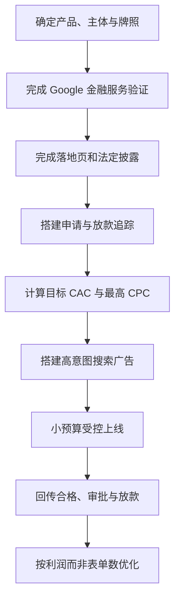
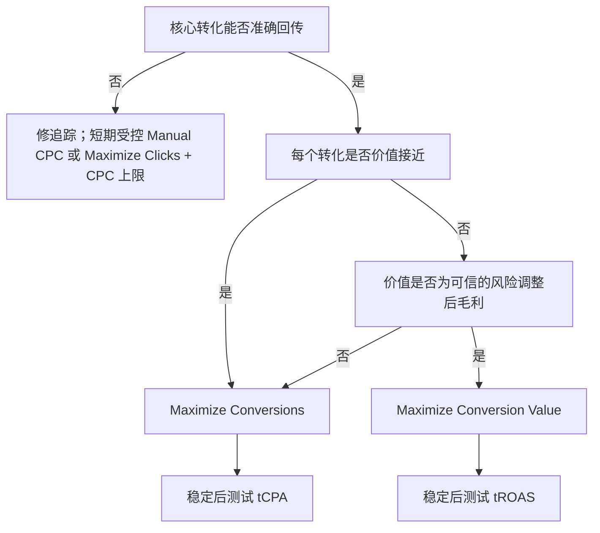
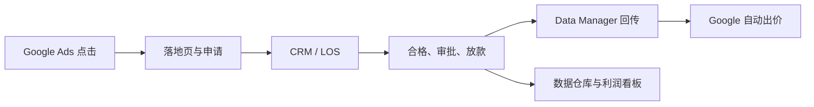

# Google Ads 信贷产品从 0 到 1 投放实战教程（澳大利亚版）

> 版本：1.0  
> 更新日期：2026-09-07  
> 适用范围：面向澳大利亚消费者、期限固定的个人信贷/个人贷款产品；贷款机构、经纪商、比价或获客平台均可参考。  
> 重要说明：本文是投放与运营指南，不构成法律、信贷牌照、隐私或财务建议。产品上线前，应由澳大利亚持牌合规负责人或律师审核最终页面、广告、数据流和业务流程。若投放国家、主体或产品类型不同，请重新核对当地法律与 Google 的国家级验证规则。

---

## 目录

1. [先看结论：从 0 到上线的最短路径](#1-先看结论从-0-到上线的最短路径)
2. [先定义你卖的究竟是什么](#2-先定义你卖的究竟是什么)
3. [先算清单位经济模型，再谈预算](#3-先算清单位经济模型再谈预算)
4. [合规闸门：没有全部通过就不要上线](#4-合规闸门没有全部通过就不要上线)
5. [落地页：用户和 Google 都要看懂](#5-落地页用户和-google-都要看懂)
6. [Google Ads 账户初始化](#6-google-ads-账户初始化)
7. [先把转化追踪搭好](#7-先把转化追踪搭好)
8. [关键词研究与账户结构](#8-关键词研究与账户结构)
9. [手把手创建第一条搜索广告系列](#9-手把手创建第一条搜索广告系列)
10. [出价与预算：新账户应该怎么选](#10-出价与预算新账户应该怎么选)
11. [写出可投放、可合规、可转化的广告](#11-写出可投放可合规可转化的广告)
12. [上线前完整验收清单](#12-上线前完整验收清单)
13. [上线后的日、周、月优化方法](#13-上线后的日周月优化方法)
14. [如何读数据并定位问题](#14-如何读数据并定位问题)
15. [实验、扩量与渠道拓展](#15-实验扩量与渠道拓展)
16. [信贷业务的回传、看板与预警](#16-信贷业务的回传看板与预警)
17. [常见故障与处理方式](#17-常见故障与处理方式)
18. [第一个 30 天执行计划](#18-第一个-30-天执行计划)
19. [可直接复制的工作模板](#19-可直接复制的工作模板)
20. [术语表](#20-术语表)
21. [官方资料索引](#21-官方资料索引)

---

## 1. 先看结论：从 0 到上线的最短路径

信贷投放不是“注册账户—选几个词—充值”这么简单。正确顺序是：



### 第一版建议配置

| 项目 | 第一版建议 |
|---|---|
| 广告类型 | 只做 Search（搜索广告） |
| 地域 | 只投有牌照、能实际服务的澳大利亚地区；位置选项使用“所在地/经常所在地”思路，不依赖“对该地感兴趣” |
| 网络 | 先关闭 Display Network；Search Partners 先关闭，主搜索稳定后单独测试 |
| 关键词 | 高购买意图的 Exact + Phrase；Broad 暂缓 |
| 广告组 | 一组一个明确搜索意图，不按几十个细碎词拆组 |
| 广告 | 每组 2 条 RSA，内容真实且与页面一致 |
| 转化 | 页面查看不作为核心转化；至少区分申请提交、合格申请、审批、放款 |
| 核心优化目标 | 早期可暂用“合格申请”，最终必须向“放款”或经风险调整后的业务价值迁移 |
| 数据周期 | 不按单日结论频繁改动；至少覆盖业务转化延迟和一个有意义的样本周期 |
| 扩量顺序 | 新关键词/地域 → Broad 小实验 → Search Partners → PMax/视频等增量渠道 |

### 上线前的 10 个“一票否决项”

以下任一项为“否”，就先不要投：

- [ ] 产品、放贷主体、经纪/获客关系和责任主体已写清楚。
- [ ] 所需的澳大利亚信贷牌照、授权或代表关系已由合规确认。
- [ ] Google 澳大利亚金融服务验证及广告主验证已经通过。
- [ ] 若属于 Google 定义的 personal loan，要求全额还款的最短期限不少于 61 天。
- [ ] 页面显著展示最短/最长还款期、最高 APR，以及包含费用的代表性总成本示例。
- [ ] 页面包含实体地址、全部相关费用以及所有对外资质/认证主张的证明链接。
- [ ] 如广告提及利率，比较利率（comparison rate）及相应警示已经合规审核。
- [ ] 页面、表单、标签和数据回传不会把敏感信贷信息泄露到 URL、广告标签或未经授权的第三方。
- [ ] 申请提交和后端结果能够去重，并能把合格、审批、放款与原始点击关联。
- [ ] 已算出目标获客成本和最高可承受 CPC，而不是只凭平台建议设置预算。

---

## 2. 先定义你卖的究竟是什么

投放前先做一张“产品事实表”。广告、落地页、客服话术、审批系统和 Google 验证提交的信息，都应以它为唯一事实来源。

### 2.1 产品事实表

| 字段 | 必须写清的内容 |
|---|---|
| 法律主体 | 公司法定名称、ABN/ACN、注册地址、网站域名 |
| 业务角色 | 直接贷款人、信贷经纪、获客平台、比较平台，还是受托代理商 |
| 牌照关系 | Australian Credit Licence（ACL）号码，或 credit representative 号码和授权方 |
| 产品类别 | 固定期限个人贷款、循环信贷、信用卡、汽车贷款、抵押贷款、商业贷款等 |
| 使用目的 | 允许与禁止的贷款用途；广告不得暗示实际不提供的用途 |
| 额度 | 最低与最高可借金额 |
| 期限 | 最短与最长还款期限；确认是否满足 Google 的 61 天规则 |
| 定价 | 利率/APR 范围、最高 APR、comparison rate、风险定价逻辑 |
| 费用 | 申请费、设立费、月费、提前结清费、逾期费及其他费用 |
| 代表性示例 | 借款额、期限、利率、费用、总还款额、还款频率和假设条件 |
| 申请资格 | 年龄、澳大利亚居住/签证条件、收入、就业、银行账户、服务地区等 |
| 决策与到账 | 实际审批时长与放款时长；所有“即时”“分钟级”说法都要有证据 |
| 客诉与争议 | 内部投诉渠道、AFCA 信息和升级路径 |
| 隐私 | 隐私政策、数据收集用途、第三方共享、营销同意和撤回方式 |
| 页面证据 | 能证明每条广告主张的页面、制度或统计记录 |

### 2.2 判断是否属于 Google 的 personal loan

Google 将 personal loan 概括为：个人一次性借入资金、且不用于购买固定资产或教育的非循环贷款。其政策通常覆盖直接贷款人、潜在客户生成商以及将用户连接到第三方贷款人的平台。按揭、汽车贷款、学生贷款、商业贷款、循环信用额度和信用卡等可能不落入这个特定定义，但仍受金融服务、当地法律、误导性陈述、数据与验证等其他规则约束。

不要仅凭产品内部名称判断。比如把短期现金贷改名为“额度服务”，不会改变其实际性质。应让合规根据真实合同、还款机制和消费者用途做分类。

官方依据：[Google Personal loans policy](https://support.google.com/adspolicy/answer/15188216?hl=en-AU)。

---

## 3. 先算清单位经济模型，再谈预算

### 3.1 核心公式

不要用“同行一天花多少”来定预算。先计算每笔放款能承受多少营销成本。

**单笔预期贡献毛利**：

\[
M = \text{预期利息与费用收入} - \text{资金成本} - \text{预期信用损失} - \text{服务与催收成本} - \text{可变运营成本}
\]

若目标是贡献毛利与获客成本之比为 \(R\)，则：

\[
\text{目标放款 CAC} = \frac{M}{R}
\]

从点击到放款的概率为：

\[
P(\text{Funded}\mid\text{Click}) = \text{提交率} \times \text{合格率} \times \text{审批率} \times \text{放款率}
\]

可承受的理论最高 CPC：

\[
\text{最高 CPC} = \text{目标放款 CAC} \times P(\text{Funded}\mid\text{Click})
\]

如果平台早期只优化申请提交，目标申请 CPA 应为：

\[
\text{目标申请 CPA} = \text{目标放款 CAC} \times P(\text{Funded}\mid\text{Submit})
\]

### 3.2 一个完整示例

假设：

- 单笔放款的预期贡献毛利：AUD 600；
- 希望毛利/CAC 至少为 3；
- 点击到申请提交率：8%；
- 提交后合格率：70%；
- 合格后审批率：40%；
- 审批后放款率：75%。

则：

- 目标放款 CAC = 600 ÷ 3 = **AUD 200**；
- 点击到放款率 = 8% × 70% × 40% × 75% = **1.68%**；
- 理论最高 CPC = 200 × 1.68% = **AUD 3.36**；
- 提交到放款率 = 70% × 40% × 75% = **21%**；
- 目标申请 CPA = 200 × 21% = **AUD 42**。

如果实际 CPC 为 AUD 6，虽然平台可能带来很多申请，按当前漏斗仍可能不赚钱。此时真正需要改善的是关键词质量、页面提交率、申请质量、审批或放款率，而不是单纯把“目标 CPA”调高。

### 3.3 预算公式

若希望每月获得 100 笔放款，目标放款 CAC 为 AUD 200：

\[
\text{月度媒体预算} = 100 \times 200 = \text{AUD 20,000}
\]

Google Ads 的平均每日预算约为：

\[
\text{平均每日预算} = \frac{20,000}{30.4} \approx \text{AUD 658}
\]

注意：对大多数广告系列，Google 某一天可能花到平均每日预算的约 2 倍，但月度计费上限通常按 30.4 倍平均每日预算控制。预算机制见 [Google Ads spending limits](https://support.google.com/google-ads/answer/10486637?hl=en)。

### 3.4 不要忽略“坏客户成本”

信贷产品的转化价值不能只写成贷款本金或审批金额。更合理的价值应基于预期贡献毛利，并纳入：

- 资金成本；
- 欺诈概率；
- 预计违约损失（PD × LGD × EAD 或公司采用的其他模型）；
- 首期未还、早期拖欠或取消概率；
- 经纪佣金、人工审核、验证与支付成本；
- 回收和服务成本。

平台先学到“谁容易提交表单”，不等于学到“谁会成为优质放款客户”。所以后端回传是信贷投放的核心，而不是高级可选项。

---

## 4. 合规闸门：没有全部通过就不要上线

本节将三类要求分开：Google 平台硬性规则、澳大利亚法律/监管要求，以及本文的稳健运营建议。最终以最新官方政策和合规意见为准。

### 4.1 Google 对个人贷款广告的硬性要求

如果产品属于 Google 的 personal loan：

1. 只允许宣传要求在 **61 天或更长时间**内全额还款的个人贷款。
2. 落地页必须显著披露：
   - 最短与最长还款期限；
   - 最高年化百分比率（maximum APR），且不能只藏在代表性示例里；
   - 包含适用费用的代表性总成本示例。
3. 该要求同样可能适用于直接贷款人、lead generator，以及把消费者连接给第三方贷款人的平台。

美国还有 APR 不得达到或超过 36% 的额外限制；这不是澳大利亚规则，但投放美国时必须单独核对。

来源：[Google Financial products and services policy](https://support.google.com/adspolicy/answer/2464998?hl=en)、[Personal loans](https://support.google.com/adspolicy/answer/15188216?hl=en-AU)。

### 4.2 金融服务页面披露

Google 要求金融产品和服务的广告目的地提供：

- 商家的实体地址；
- 所有相关费用；
- 对任何第三方认证、认可或背书主张的证明链接。

披露应立即、清楚可见，不能要求用户悬停、点击标签页或进入另一个页面才看到。来源：[Financial services disclosures](https://support.google.com/adspolicy/answer/15187149?hl=en)。

### 4.3 澳大利亚金融服务验证

面向澳大利亚推广金融服务时，Google 要求相关广告主完成澳大利亚金融服务验证，且验证通常按目标国家分别处理，覆盖不同广告格式和素材。

#### 直接贷款人或受监管金融服务提供者

通常流程为：

1. 确认广告账户中的法定主体、网站域名和 ASIC 记录完全一致；
2. 通过 Google 指定的外部合规合作方 G2RS 申请第三方验证；
3. 完成 Google Advertiser Verification；
4. 使用获得的唯一验证码向 Google 提交金融服务验证表；
5. 验证通过后再提交广告。

#### 经纪、营销代理、联盟或获客平台

如果你是获授权的第三方，通常需要由已获澳大利亚验证的授权广告主发起或确认关系，并列出获批域名；然后第三方向 Google 直接申请。不要把代理商写成贷款人，也不要借用不相关公司的资质。

#### 关键注意事项

- 公司名称、域名、地址、牌照或授权信息必须与 ASIC 记录和申请资料一致。
- 一个国家通过验证，不代表其他国家自动通过。
- 变更主体、域名、账户或授权关系时，应重新检查验证状态。
- 提供虚假信息可能导致验证撤销或账户暂停。

完整流程以 [Google Australia financial services verification](https://support.google.com/adspolicy/answer/15332527?co=GENIE.CountryCode%3DAU&hl=en) 为准。广告主身份验证说明见 [Advertiser verification](https://support.google.com/adspolicy/answer/9703665?hl=en)。

### 4.4 澳大利亚广告监管重点

ASIC Regulatory Guide 234 的实务原则包括：

- 整体印象不得误导或欺骗；标题造成的错误印象不能靠页面深处的小字纠正。
- 收益或便利与风险、条件和限制应保持平衡。
- 所有事实、比较、速度、通过率和“最低/最佳”等主张应有可复核证据。
- 警示和免责声明应醒目、易读，并在消费者形成决定之前出现。
- 谨慎使用 “from”“up to”等可能让用户只注意最佳情形的表达。
- 中文广告如需要警示，不能只用用户难以理解的英文小字来补救。
- 点击进入另一页面，不能修复第一屏或广告本身已经产生的误导印象。
- 广告若提及利率，通常需要同时展示正确计算的 comparison rate，且不得明显弱化，并遵守所需警示。

请直接参考 2026 年 6 月更新的 [ASIC RG 234](https://www.asic.gov.au/regulatory-resources/find-a-document/regulatory-guides/rg-234-advertising-financial-products-and-services-including-credit) 和 [National Credit Code 指引](https://www.asic.gov.au/regulatory-resources/credit/credit-general-conduct-obligations/national-credit-code)。责任贷款义务参见 [ASIC Responsible lending](https://www.asic.gov.au/regulatory-resources/credit/responsible-lending)。

### 4.5 高风险文案清单

| 表述 | 风险 | 建议 |
|---|---|---|
| “Guaranteed approval / 100% approved” | 通常无法真实保证，易构成误导 | 不使用；说明需评估并适用资格条件 |
| “No credit check” | 可能与真实风控/责任贷款义务冲突 | 除非事实、合法且经书面合规批准，否则不使用 |
| “Instant cash / money in minutes” | 审批、银行入账和个案差异使其难以保证 | 用有证据的条件化表达，如“approved applications may…” |
| “Lowest rate / best loan” | 绝对比较主张需要充分、持续的市场证据 | 改为真实的利率范围和适用条件 |
| “From X%” | 容易突出极少数人的最佳条件 | 同屏说明适用条件、范围和 comparison rate |
| “Government approved/backed” | 容易产生虚假关联 | 只有具备明确正式依据时才可使用 |
| “Bad credit guaranteed” | 可能触发敏感金融困境、误导和掠夺性贷款风险 | 避免；用中性资格和评估流程说明 |
| “Fix debt now / emergency cash” | 利用消费者困境，且可能落入负面财务状态敏感分类 | 避免用恐惧或压力驱动申请 |
| “Pre-approved” | 若并未基于足够评估，可能误导 | 明确“预资格不等于最终批准”并经合规审核 |
| “No fees” | 只要存在任何相关收费就有风险 | 列清费用；只有确实为零才可使用 |

Google 将严重误导、虚假身份或规避政策视为严重问题，某些情形可在无预警情况下暂停账户。被拒登后不要新建账户、换域名或改拼写绕过审核，应先纠正根因并按官方流程申诉。参见 [Misrepresentation](https://support.google.com/adspolicy/answer/6020955?hl=en) 和 [Circumventing systems](https://support.google.com/adspolicy/answer/15938075?hl=en-AU)。

### 4.6 受限个性化定向

与负面财务状况相关的内容属于 Google 的敏感兴趣类别。破产、高债务、失业、无家可归、福利领取、掠夺性贷款或债务困境等主题，不应使用广告主自行创建的个性化受众来定向，包括 Customer Match、自己的数据细分、类似受众或某些扩展功能。Google 预定义受众是否可用，应以界面和当前政策为准。

实践建议：

- 第一阶段以搜索意图、地理范围和合规关键词为主，不上传“被拒贷”“高负债”“逾期”等名单。
- 不用用户的信用评分、负债、拒绝原因或困境状态创建受众或相似人群。
- 不对未成年人做个性化广告。
- 若未来投放美国或加拿大的消费者金融产品，还要遵守年龄、性别、婚姻/父母状态和邮编等定向限制。

来源：[Personalized advertising—negative financial status](https://support.google.com/adspolicy/answer/16700443?hl=en)、[Consumer finance targeting in US and Canada](https://support.google.com/adspolicy/answer/16700846?hl=en)。

### 4.7 隐私与数据最小化

- 表单和付款/身份信息页面必须使用 HTTPS。
- 不要把姓名、邮箱、电话、收入、借款用途、信用评分或审批结果放在 URL 查询参数中。
- 不要让广告标签、分析工具、聊天插件或会话回放工具读取不必要的表单字段。
- 对营销、分析和广告用途提供清晰告知与适当同意；提供易用的退订/撤回渠道。
- 上传 Google 的客户数据只能使用合规取得的第一方数据，并遵守 Google Customer Data Policies。
- 对信贷困境等敏感信息，切勿默认认为“哈希后就可以上传”。哈希降低直接识别性，不会自动解决目的、同意和敏感信息问题。
- OAIC 在 2026 年明确强调第三方 tracking pixel 的隐私风险；敏感信息经追踪像素处理通常需要明确同意。上线前应完成标签清单、数据流图和供应商评估。

来源：[Google Data collection and use](https://support.google.com/adspolicy/answer/6020956?hl=en)、[Google Customer Data Policies](https://support.google.com/adspolicy/answer/7475709?hl=en)、[OAIC Tracking pixels and privacy obligations](https://www.oaic.gov.au/privacy/privacy-guidance-for-organisations-and-government-agencies/organisations/tracking-pixels-and-privacy-obligations)、[OAIC APP 7—Direct marketing](https://www.oaic.gov.au/privacy/australian-privacy-principles/australian-privacy-principles-guidelines/chapter-7-app-7-direct-marketing)。

---

## 5. 落地页：用户和 Google 都要看懂

### 5.1 页面推荐结构

1. **首屏**：产品是什么、金额/期限范围、真实且条件化的核心价值、主 CTA、关键定价/资格提示。
2. **费用与价格**：利率/APR、最高 APR、comparison rate、全部相关费用、影响个人报价的条件。
3. **代表性示例**：借款金额、期限、还款频率、利率、费用、总还款额和假设。
4. **资格条件**：年龄、居住、收入、就业、银行账户、用途、地区等。
5. **申请流程**：申请、核验、评估、签约、放款；明确预资格和最终审批的区别。
6. **风险与责任借贷**：逾期后果、影响、困难援助入口和理性借贷提示。
7. **身份与监管信息**：公司法定名称、实体地址、ACL/credit representative 信息和业务角色。
8. **投诉与支持**：内部投诉方式、AFCA 信息、联系方式和服务时间。
9. **法律链接**：Credit Guide、Target Market Determination（如适用）、Privacy Policy、Terms、Fees、Complaints。
10. **重复 CTA**：在用户已看到足够信息后再次提供申请入口。

### 5.2 首屏最低信息建议

首屏不要只有“大额、低息、秒批”三个词。建议至少让用户立即看见：

- 贷款产品类别；
- 可借金额和期限范围；
- 利率/比较利率的合规呈现或明确入口；
- “申请须经资格和信用评估”等实质条件；
- 贷款人/经纪商的真实身份；
- 清晰的 CTA，例如 “Check eligibility” 或 “Start application”。

### 5.3 代表性披露模板

下面仅是结构模板，不是可直接发布的法律文案。所有数值和措辞必须由产品、财务和合规填写：

> **Rates and fees**  
> Loans from AUD `[最低金额]` to `[最高金额]`, with terms from `[最短期限]` to `[最长期限]`. Interest rates range from `[最低利率]` to `[最高利率]` p.a. The maximum APR is `[最高 APR]`. The comparison rate is `[比较利率]` based on `[法定假设]`. Fees may include `[逐项列示]`.
>
> **Representative example**  
> For a loan of AUD `[金额]` over `[期限]` at `[利率]` p.a., with `[费用]`, `[还款频率]` repayments would be `[金额]` and the total amount payable would be `[总额]`. Actual rates, fees and approval depend on individual circumstances and assessment.

模板中的“最高 APR”应在示例之外单独披露。若广告或页面提及利率，comparison rate 的计算、位置、字号和警示须按澳大利亚法律由专业人员审核。

### 5.4 页面技术检查

- 页面返回正常的 HTTP 状态，移动端和桌面端都可访问。
- 不按地区、设备或机器人向 Google 展示与用户不同的内容。
- Google AdsBot 可抓取；不要误被 CDN/WAF/robots 规则拦截。
- 页面加载稳定，核心内容不要等待复杂脚本才能出现。
- 域名与广告显示域名一致；跳转链短且目的地不变。
- CTA、表单和成功页可用；错误状态给出清晰解释。
- 不自动下载、不弹出无法关闭的遮罩、不制造虚假倒计时。
- 隐私、条款、费用和联系信息链接都有效。
- 对手机号、邮箱、地址、银行与身份资料使用适当安全控制。
- 可访问性：字体、对比度、键盘导航、错误提示和屏幕阅读器标签基本合格。

Google 目的地要求见 [Destination requirements](https://support.google.com/adspolicy/answer/6368661?hl=en)。

---

## 6. Google Ads 账户初始化

### 6.1 所有权和权限

- 使用公司拥有的邮箱和付款资料，不把账户永久建在离职风险较高的个人邮箱下。
- 公司至少保留两名管理员；代理商使用独立访问权限，不共享密码。
- 若管理多个账户，可使用 Manager Account，但每个业务主体、国家与计费关系要清楚。
- 按最小权限原则分配 Admin、Standard、Read-only、Billing 等角色。
- 开启两步验证。官方说明：[2-Step Verification](https://support.google.com/google-ads/answer/12864186?hl=en)。

### 6.2 建户时不可随意填写的项目

- **国家、币种、时区**应与业务和财务报表一致。
- Google Ads 账户时区创建后通常不能自行修改；建立前确认使用 Australia/Sydney 等正确业务时区，而不是沿用 UTC。参见 [Change your time zone](https://support.google.com/google-ads/answer/9842104?hl=en)。
- 付款主体和税务资料应与真实法律关系一致。计费说明：[Google Ads billing](https://support.google.com/google-ads/answer/2375433?hl=en)。

### 6.3 必做账户设置

- 开启 auto-tagging，以便落地 URL 附带 GCLID 等点击标识。路径通常为 **Admin → Account settings → Auto-tagging**。参见 [Auto-tagging](https://support.google.com/google-ads/answer/3095550?hl=en)。
- 完成 Advertiser Verification 和澳大利亚 Financial Services Verification。
- 把自动应用的建议（auto-apply recommendations）逐项检查；新账户不要默认允许系统改变匹配方式、预算或出价。
- 建立命名规范、标签、预算负责人和变更日志。
- 设置拒登、付款失败、转化骤降和预算异常通知。

### 6.4 推荐命名规范

```text
广告系列：AU_Credit_Search_NonBrand_HighIntent_202609
广告组：PersonalLoan_Core
广告：RSA_ProductFact_V1
转化：AU_Web_ApplicationSubmit
线下转化：AU_Offline_Funded
实验：EXP_BroadMatch_202610
```

名称至少包含：国家、业务、渠道、品牌/非品牌、意图或主题、版本/日期。不要把个人信息写入广告名称或标签。

---

## 7. 先把转化追踪搭好

### 7.1 正确的信贷漏斗

| 阶段 | 建议事件名 | Google Ads 用途 | 说明 |
|---|---|---|---|
| 落地页访问 | `page_view` | 不作为核心转化 | 用于流量与页面诊断 |
| 开始申请 | `application_start` | Secondary | 判断首屏与表单启动率 |
| 完成申请 | `application_submit` | 早期可临时 Primary，成熟后多为 Secondary | 必须排除垃圾、重复和测试提交 |
| 合格申请 | `qualified_application` | 早期主要优化目标候选 | 使用中性业务资格，不向标签泄露敏感细节 |
| 审批 | `approved` | Primary 候选 | 注意审批延迟、撤销和重复更新 |
| 放款 | `funded` | 最终主要优化目标 | 最接近真实收入与 CAC |
| 首期还款/拖欠 | 内部 BI 事件 | 通常不直接上传广告平台 | 供风险、队列和利润分析；先做隐私与政策评估 |

不要同时把 `application_submit`、`qualified_application`、`approved` 和 `funded` 都设为同一个广告系列的 Primary 并直接相加，否则一次客户旅程会被当作多次业务成功。Google 的 Account-default goals 和 campaign-specific goals 应有明确治理。参见 [Conversion goals](https://support.google.com/google-ads/answer/4677036?hl=en) 和 [Campaign-specific goals](https://support.google.com/google-ads/answer/9143218?hl=en)。

### 7.2 基础埋点方案

推荐组合：

1. 网站部署 Google tag；可通过 Google Tag Manager 管理。
2. 在 Google Ads 创建 website conversion actions。
3. GA4 用于行为分析，并与 Google Ads 链接。
4. 核心竞价转化尽量由一个权威来源导入，避免 Google Ads 原生标签和 GA4 同一事件同时都设为 Primary。
5. 后端保存点击标识并回传合格、审批、放款结果。

官方指南：[Set up web conversions](https://support.google.com/google-ads/answer/16560108?hl=en)、[Google tag](https://support.google.com/google-ads/answer/7548399?hl=en)、[Link Google Ads and GA4](https://support.google.com/analytics/answer/9379420?hl=en)。

### 7.3 每个转化动作的推荐设置

| 设置 | Lead 类建议 | 原因 |
|---|---|---|
| Goal/Category | Submit lead form、Qualified lead 或 Converted lead | 与真实阶段对应 |
| Value | 早期可先不用；成熟后用预期贡献价值 | 不要把贷款本金当收入 |
| Count | 通常选 **One** | 同一点击产生多次表单触发时只计一次；销售购买才常用 Every |
| Attribution | Data-driven attribution（可用时） | Google 对多数转化默认采用数据驱动归因 |
| Click-through window | 按实际考虑期设置 | 应覆盖从点击到该阶段的合理时长 |
| Primary/Secondary | 只有当前出价真正要优化的事件设 Primary | 避免重复学习和虚假总量 |

参见 [Conversion counting options](https://support.google.com/google-ads/answer/3438531?hl=en)、[Data-driven attribution](https://support.google.com/google-ads/answer/6394265?hl=en)、[Conversion windows](https://support.google.com/google-ads/answer/3123169?hl=en)。

### 7.4 去重设计

前端成功页刷新、后退、重复提交或跨设备都可能导致重复。至少做到：

- 每次申请生成不可预测的 `application_id`；
- Google Ads web conversion 使用 transaction/order ID 去重；
- 后端为每个“申请 ID × 转化阶段”建立唯一键；
- 状态只能按业务规则前进，撤销和更正另建审计记录；
- 测试数据、员工流量、自动化监控和欺诈提交标记并排除。

### 7.5 保存点击标识

Auto-tagging 可在广告点击后的 URL 中带入 GCLID；部分环境可能使用 GBRAID/WBRAID 等标识。落地页应：

1. 读取允许使用的点击标识；
2. 安全写入第一方 cookie/session；
3. 表单提交时把它与 `application_id` 一起传到后端；
4. 在状态变化时，从后端向 Google 回传对应线下转化；
5. 保留来源、时间、同意记录和回传审计日志。

不要将信贷信息追加到广告 URL。ValueTrack 仅添加所需的广告上下文参数，例如 campaign、keyword、matchtype 或 device，并通过 tracking template/final URL suffix 规范管理。参见 [ValueTrack parameters](https://support.google.com/google-ads/answer/2375447?hl=en)。

### 7.6 线下转化回传

截至本文日期，新实施应优先采用 Google Ads Data Manager 支持的当前连接/API 流程，并按官方模板上传点击标识、转化名称、转化时间、价值、币种和可选的订单 ID。Google 已在 2026 年调整部分 offline conversion / enhanced conversions for leads 的 API 路径；不要照抄数年前只基于 Google Ads API 的旧教程。先查看账户中的 Data Manager 与最新 [Offline data diagnostics](https://support.google.com/google-ads/answer/15249267?hl=en) 和 [Enhanced conversions for leads](https://support.google.com/google-ads/answer/15713840?hl=en)。

推荐的内部回传表结构：

| 字段 | 示例 | 说明 |
|---|---|---|
| `application_id` | `APP_...` | 内部不可重复 ID |
| `click_id_type` | `gclid` | 标识类型 |
| `click_id` | 值不在日志明文展示 | 广告点击关联键 |
| `conversion_name` | `AU_Offline_Funded` | 必须与账户动作一致 |
| `conversion_time` | 含时区的时间戳 | 使用真实状态发生时间 |
| `conversion_value` | `185.00` | 建议为预期贡献价值，而非本金 |
| `currency` | `AUD` | 与价值一致 |
| `order_id` | 阶段唯一 ID | 用于去重 |
| `consent_status` | 内部枚举 | 保存当时的告知/同意依据 |
| `upload_status` | success/error | 用于重试和监控 |

### 7.7 回传质量监控

每天至少监控四件事：

- **覆盖率**：可关联点击标识的有效申请 ÷ 来自 Google Ads 的有效申请；
- **延迟**：业务事件发生到成功上传的 P50/P90/P99；
- **一致性**：CRM 放款数与 Ads 接收数的差异；
- **错误与重复**：API/文件错误率、未知 conversion action、过期点击、时间格式错误、重复 order ID。

建议预警例子：覆盖率较 7 日基线下降 20%；P90 延迟超过业务 SLA；连续 2 个批次无回传；CRM 与 Ads 差异超过设定阈值。阈值应根据真实量级设定，不要机械照抄。

### 7.8 Consent Mode 与验证

如果使用同意管理平台，可按法律和业务要求配置 Consent Mode 的 `ad_storage`、`analytics_storage`、`ad_user_data`、`ad_personalization` 等信号。Consent Mode 不是获得同意的工具，也不会替代隐私告知；它只是根据用户选择调整标签行为。参见 [Consent mode reference](https://support.google.com/google-ads/answer/13802165?hl=en)。

上线前使用 Tag Assistant 和 Google Ads 的 tag diagnostics 验证：

- 页面首次加载时的默认同意状态；
- 用户接受/拒绝后的更新；
- 转化只触发一次；
- 页面之间点击标识未丢失；
- 域名跳转和支付/身份验证流程不会截断归因；
- 不向标签发送表单敏感字段。

---

## 8. 关键词研究与账户结构

### 8.1 按用户意图分层

| 层级 | 例子（仅用于研究） | 初期动作 |
|---|---|---|
| 品牌 | `[品牌名] loan`、`[品牌名] apply` | 独立品牌广告系列，精确保护 |
| 高意图通用 | `personal loan apply`、`personal loans online`、`fixed term personal loan` | 第一批核心投放 |
| 价格/比较 | `personal loan rates`、`compare personal loans` | 页面具备真实比较和费率信息后投 |
| 用途 | `loan for home improvements` 等 | 只投产品允许且页面明确支持的用途 |
| 资格疑问 | `personal loan eligibility` | 可做教育型页面，注意流量意图混杂 |
| 困境/敏感 | `bad credit emergency loan`、`debt help loan` | 高政策、道德和质量风险；默认不投，除非专项合规评估通过 |
| 信息型 | `what is APR`、`loan calculator` | 转化通常较低；内容/再营销策略成熟后测试 |
| 招聘/服务 | `loan jobs`、`loan software`、`loan template` | 通常作为否定关键词 |

例词不能代替本地数据。使用 [Google Keyword Planner](https://business.google.com/uk/ad-tools/keyword-planner/) 获取澳大利亚目标地域的搜索量、竞争和预估 CPC；再结合 Search Terms Report 迭代。

### 8.2 关键词研究步骤

1. 从产品事实表提取产品、用途、金额、期限、资格和品牌词。
2. 在 Keyword Planner 选择准确国家/州、语言和 Search Network。
3. 导出关键词、搜索量区间、竞争度、顶部出价估算。
4. 人工审查每个词的真实搜索意图，而不是仅看词面。
5. 查看搜索结果页和 [Google Ads Transparency Center](https://adstransparency.google.com/)；只用于理解市场表达，不复制竞争对手未经证实的承诺。
6. 标记“可投”“需合规确认”“否定”“以后测试”。
7. 按同一意图聚类，每组写能精确回应需求的广告与页面。

### 8.3 匹配方式

| 类型 | 写法 | 实际含义 | 初期使用 |
|---|---|---|---|
| Exact | `[personal loan online]` | 可覆盖相同含义或意图，并非只匹配完全相同字符串 | 是，核心词 |
| Phrase | `"personal loan online"` | 可覆盖包含该含义的搜索，范围比 Exact 更宽 | 是，受控探索 |
| Broad | `personal loan online` | 利用更多信号扩展到相关搜索 | 数据和回传稳定后做独立实验 |

匹配不是简单的字符规则。每周必须查看真实搜索词。官方定义：[Keyword match types](https://support.google.com/google-ads/answer/7478529?hl=en)。

### 8.4 初始否定关键词清单

以下只是候选，添加前确认不会误伤真实客户：

```text
jobs, job, career, salary, training, course, definition, meaning,
template, spreadsheet, software, API, code, calculator download,
complaint, lawsuit, scam（若用户搜索品牌投诉，应由品牌与声誉策略另行处理）, 
free money, grant, government benefit,
business loan, mortgage, home loan, car loan, student loan（若产品不提供这些）
```

中文市场还应加入与招聘、教程、合同模板、软件系统、非目标国家和非目标产品有关的中文变体。负面关键词不会自动覆盖所有近似变体、同义词、单复数，应主动加入重要变体；大小写通常无需区分。来源：[Negative keywords](https://support.google.com/google-ads/answer/2453972?hl=en)。

### 8.5 推荐第一版账户结构

| 广告系列 | 广告组 | 关键词示例 | 页面 | 目标 |
|---|---|---|---|---|
| Brand | Brand_Core | 品牌 + loan/apply/rates | 品牌产品页 | 防守品牌需求 |
| NonBrand_HighIntent | PersonalLoan_Core | personal loan、personal loans online | 主产品页 | 获取高意图新增客户 |
| NonBrand_Rates | Rates_Compare | personal loan rates 等 | 定价/比较说明页 | 承接价格研究用户 |
| UseCase（后续） | 每个已获批用途一组 | 明确用途词 | 对应用途页 | 增量扩展 |

不要按每个拼写变体创建一个广告组，也不要把品牌词与非品牌词、不同国家或完全不同产品塞进同一广告系列。

---

## 9. 手把手创建第一条搜索广告系列

Google 界面会持续迭代，按钮名称可能略有不同；以下是稳定的决策顺序。官方流程见 [Create a Search campaign](https://support.google.com/google-ads/answer/9510373?hl=en)。

### 第 1 步：创建广告系列

点击 **Campaigns → + New campaign**。若界面允许，选择“不使用目标指导创建”，或选择 Leads 但手动检查系统自动带入的转化目标。

### 第 2 步：选择类型

选择 **Search**。填写真实最终网站 URL。第一阶段不建议直接用 Performance Max，因为 Search 更容易控制搜索意图、关键词、文案和合规诊断。

### 第 3 步：选择转化目标

- 只保留这个广告系列真正要用于出价的 Primary 目标。
- 新系统尚无后端数据时，可暂用经过清洗的 `application_submit`。
- 一旦 `qualified_application` 或 `funded` 有稳定回传，应设计迁移测试。
- 电话只有在能合规录入、去重并判断质量时才作为核心转化。

### 第 4 步：选择出价

按第 10 节的决策树选择。不要因为界面推荐，就在零转化、零回传的第一天强行设置激进 tCPA。

### 第 5 步：网络

- 关闭 **Display Network**。
- 第一阶段建议关闭 **Google Search Partners**；主搜索数据稳定后，单独开启并观察增量质量。

Search Partners 可能默认被勾选，应主动检查。来源：[About the Google Search Network](https://support.google.com/google-ads/answer/1722047?hl=en)。

### 第 6 步：地域

- 只选牌照允许、产品能实际服务的州/城市/地区。
- 在高级位置选项中，优先选择位于或经常位于目标地区的人，而不是仅对该地区表现出兴趣的人。
- 排除不能服务的地区，并在 CRM 验证州/邮编分布。
- 若按州定价或许可不同，分广告系列并使用对应页面和披露。

默认位置设置可能包含“所在地或对该地感兴趣”的用户，金融业务尤其需要主动确认。来源：[Advanced location options](https://support.google.com/google-ads/answer/1722038?hl=en)。

### 第 7 步：语言

选择用户实际使用、广告与落地页能够完整支持的语言。若投中文：

- 广告、关键资格、费用、风险和警示要用用户理解的语言；
- 客服与申请流程也要能够承接；
- 不要用中文吸引后把关键条件藏在英文长文里。

### 第 8 步：受众

早期如加入 Google 预定义受众，使用 **Observation（观察）** 而非 Targeting，避免把搜索覆盖面意外缩窄。不要用高负债、被拒、逾期等敏感第一方名单定向。

### 第 9 步：排期与设备

- 起步可全天运行，先获取完整时段数据；若人工电话是关键，呼叫资产仅在有人接听时显示。
- 不要凭感觉第一天把移动端降价。先看移动端页面速度、提交率、质量和放款率。
- 所有设备必须完成一次真实申请测试。

### 第 10 步：预算

使用第 3 节的单位经济模型和关键词预估。预算至少要让广告在目标时段有机会获得足够点击，但不能超过风险上限。设置账户级和财务侧的异常预警。

### 第 11 步：广告组与关键词

- 每个广告组对应一个清晰搜索意图。
- 第一版用 Exact + Phrase。
- 把明显无关词加入共享或广告系列否定列表。
- 不使用动态搜索广告组作为第一条信贷广告的主力。

### 第 12 步：RSA 和资产

每个广告组制作 2 条响应式搜索广告（RSA），加入 sitelinks、callouts、structured snippets 等有用资产。不要为了“Ad Strength”盲目写重复或不真实承诺。

### 第 13 步：发布前复核

进入 Review 页面，逐项检查目标、位置、网络、预算、转化、页面、关键词、文案、资产和验证状态。先暂停广告系列，完成第 12 节验收，再择时开启。

---

## 10. 出价与预算：新账户应该怎么选

### 10.1 出价决策树



### 10.2 各策略适用情形

| 策略 | 适用 | 风险/说明 |
|---|---|---|
| Manual CPC | 极早期、需要严格控制单次点击成本 | 依赖人工管理；无法充分利用实时信号 |
| Maximize Clicks + CPC cap | 追踪未成熟的短期流量验证 | 系统追求点击，不保证申请或质量；必须有上限和短周期 |
| Maximize Conversions | 核心转化准确，价值近似 | 先不一定设 tCPA；预算受限时会尽量花完预算 |
| Target CPA | 有相对稳定且代表未来流量的转化历史 | 目标过低会限量，过高可能抬高成本 |
| Maximize Conversion Value | 不同客户价值差异大且价值可信 | 错误的价值会让系统主动放大坏流量 |
| Target ROAS | 价值回传和量都稳定 | 对信贷应使用风险调整后的价值，而非贷款本金 |

Google 的策略说明见 [Choose a bid strategy](https://support.google.com/google-ads/answer/2472725?hl=en) 和 [Smart Bidding](https://support.google.com/google-ads/answer/7065882?hl=en)。

### 10.3 不存在万能“50 个转化门槛”

平台可以在低于某个民间阈值时运行自动出价，但数据越少、延迟越长、转化定义越噪，结果越不稳定。判断是否切换，不只看数量，还看：

- 最近数据能否代表未来投放；
- 转化是否准确且能去重；
- 转化延迟是否已覆盖；
- 搜索量和预算是否足够；
- 产品、页面和审批政策近期是否改变；
- 质量分布是否稳定。

自动出价变更后可能进入学习期。Google 表示校准可能需要最多约 3 周或 1–2 个转化周期，具体取决于转化量和延迟。来源：[Bid strategy learning](https://support.google.com/google-ads/answer/13020501?hl=en)。

### 10.4 预算控制规则

- 设预算前算出公司能够接受的最坏情形，而不只看平均情形。
- 将品牌和非品牌分开预算，避免品牌低成本转化掩盖新增获客问题。
- 不在同一天同时大改预算、出价、关键词和页面。
- 单次调整幅度和观察周期应与量级、转化周期相匹配。
- 按 click cohort（点击发生日）评估最终放款，避免最近几天因转化尚未成熟而被误判。
- 如果预算每天很早花完，先看搜索词、地域、网络和小时质量，再决定加预算。

---

## 11. 写出可投放、可合规、可转化的广告

### 11.1 RSA 基础规则

响应式搜索广告最多可提供 15 个标题和 4 个描述。常见字符上限为标题 30 个字符、描述 90 个字符、路径字段 15 个字符；中文等双宽字符可能按 2 个字符计算。系统会组合不同素材，不能假设每条都会同时展示。来源：[Responsive Search Ads](https://support.google.com/google-ads/answer/7684791?hl=en)。

建议每个广告组：

- 2 条 RSA；
- 标题覆盖产品、用户意图、真实差异、资格提示、品牌与行动；
- 描述覆盖范围、流程、条件和披露入口；
- 所有任意组合都应语义通顺且不误导；
- 如果某句法律要求每次展示，考虑固定到 H1/H2 或 Description 1，并让合规确认；固定会减少系统组合空间。

### 11.2 标题素材框架

不要逐字照抄，先替换为已核实事实：

```text
[Brand] Personal Loans
Personal Loans From $[X]
Terms From [X] to [Y] Months
Check Your Eligibility Online
See Rates, Fees & Terms
Clear Repayment Information
Apply Online With [Brand]
For Eligible Australian Residents
Credit Assessment Applies
View a Representative Example
```

### 11.3 描述素材框架

```text
View loan amounts, terms, rates and applicable fees before you apply. Eligibility and credit assessment apply.

Check whether a [Brand] personal loan suits your needs. See the representative example, comparison rate and full terms.

Apply online for $[X]–$[Y] over [term range]. Actual rates and approval depend on your circumstances and assessment.
```

只有当金额、期限、速度、地域和流程完全真实且页面同屏支持时才能使用。不要为了更高点击率删除关键限定。

### 11.4 一组示范广告

> **示范结构，不是已经合规批准的成品。**

**标题候选**

1. `[Brand] Personal Loans`
2. `Loans From $[X] to $[Y]`
3. `Terms From [X]–[Y] Months`
4. `Check Eligibility Online`
5. `See Rates & Fees Upfront`
6. `Credit Assessment Applies`
7. `View Repayment Details`
8. `For Eligible AU Residents`

**描述候选**

1. `Review amounts, terms, rates, comparison rate and fees before applying. Eligibility and credit assessment apply.`
2. `Start an online application with [legal role]. Actual rates, approval and timing depend on your circumstances.`

### 11.5 广告资产

| 资产 | 推荐内容 | 注意事项 |
|---|---|---|
| Sitelink | Rates & Fees、Eligibility、How It Works、Contact/Complaints、Responsible Lending、FAQ | 每个链接到真实对应页面 |
| Callout | Transparent Fees、Online Application、Australian Support 等 | 必须真实，不写不可证明的绝对词 |
| Structured snippet | Loan amounts、Term options、Support channels | 选择与字段含义匹配的 header |
| Call | 客服/销售电话 | 只在有人接听时展示，能记录质量和同意 |
| Image | 后期谨慎测试 | 不得制造政府、银行或第三方背书错觉 |
| Lead form asset | 初期不建议作为核心 | 自有页面更容易完整展示信贷披露、隐私和资格条件 |

资产说明：[About assets](https://support.google.com/google-ads/answer/7331111?hl=en)。Google 的 Ad Strength 是素材覆盖度诊断，不是审批或盈利保证；Quality Score 也只是关键词级诊断，不是 KPI。参见 [Ad Strength](https://support.google.com/google-ads/answer/9921843?hl=en) 和 [Quality Score](https://support.google.com/google-ads/answer/6167118?hl=en)。

---

## 12. 上线前完整验收清单

### 12.1 法务与政策

- [ ] Google 金融服务验证、广告主验证均已通过且主体/域名正确。
- [ ] 产品期限、APR、费用和页面披露符合 Google personal loan policy。
- [ ] ACL/代表关系和业务角色已核实。
- [ ] 利率、comparison rate、代表性示例和警示经合规签字。
- [ ] 没有 guaranteed、instant、lowest、no-check 等未经证明或误导主张。
- [ ] 广告、页面、表单、客服话术一致。
- [ ] 无伪造背书、虚假倒计时、隐藏条件或规避审核行为。
- [ ] Credit Guide、隐私、条款、费用、投诉/AFCA、实体地址链接正常。

### 12.2 账户与定向

- [ ] 国家、币种、时区和付款主体正确。
- [ ] 两步验证已开，至少两名公司管理员。
- [ ] 只选可服务地域，位置选项已人工确认。
- [ ] Display Network 已关闭；Search Partners 状态符合测试计划。
- [ ] 语言与页面、客服能力一致。
- [ ] 未使用受限的敏感自建受众。
- [ ] 品牌与非品牌预算分开。

### 12.3 关键词与广告

- [ ] 每个广告组只有一个清晰意图。
- [ ] 第一版 Exact/Phrase 和否定词已复核。
- [ ] 每个广告组至少 2 条内容不同的 RSA。
- [ ] 所有标题与描述任意组合都真实、通顺、不误导。
- [ ] 必显法律信息已用正确方式固定或在页面显著展示。
- [ ] Sitelinks 等资产都指向正确页面。
- [ ] Final URL、移动 URL、tracking template 和参数没有 PII。

### 12.4 页面与技术

- [ ] HTTPS、移动端、桌面端、主流浏览器都测试通过。
- [ ] 无 404、循环跳转、地区拦截或 AdsBot 误封。
- [ ] 首屏价格/条件、最高 APR、期限、费用和身份信息可见。
- [ ] 表单校验、错误提示、重复提交、成功页工作正常。
- [ ] 页面速度和交互稳定，CTA 不被 cookie banner 遮挡。
- [ ] 隐私同意与撤回流程按预期工作。

### 12.5 测量

- [ ] Auto-tagging 已开。
- [ ] 使用真实广告测试点击，GCLID/相关点击标识可跨页保留。
- [ ] 每个转化只触发一次，order ID 去重有效。
- [ ] Google Ads 与 GA4 没有把同一事件重复设为 Primary。
- [ ] CRM 能保存来源和 `application_id`。
- [ ] 测试合格、审批和放款状态能成功回传。
- [ ] 转化时间、币种、价值和时区正确。
- [ ] 回传失败有重试、日志和预警。
- [ ] 标签未收到收入、信用评分、贷款用途等不必要的敏感字段。

### 12.6 商业控制

- [ ] 目标放款 CAC、目标申请 CPA 和最高 CPC 已计算并批准。
- [ ] 每日、每周和月度最大媒体支出已设置。
- [ ] 有账户异常和信用风险恶化时的停投权限人。
- [ ] 客服、承保和资金能力能承接预期申请量。
- [ ] 已记录上线基线、版本、批准人和回滚方案。

---

## 13. 上线后的日、周、月优化方法

### 13.1 第 1–3 天：确认系统健康，不急着“优化”

每天检查：

- 广告是否 Eligible、Limited 或 Disapproved；
- 实际支出与预算节奏；
- 搜索词是否明显跑偏；
- 国家/州、网络、设备是否异常；
- 点击后页面、表单和转化是否正常；
- CRM 是否能找到对应申请；
- 是否出现欺诈或重复线索。

此阶段只修明显错误：错误 URL、错误地域、无关搜索词、重复转化、失效页面、政策问题。不要因为几个点击没转化就重建广告系列。

### 13.2 第 4–7 天：第一次流量质量清理

- 查看 Search Terms Report，而非只看关键词表。
- 把明确无关查询加为否定词，并记录原因。
- 检查 Phrase 是否扩展到不同意图。
- 比较品牌/非品牌、州、设备、时段和广告组的申请质量。
- 抽样听电话或看经脱敏的申请质检结果。
- 确认 Ads 表单数、CRM 有效申请数和回传数差异。

搜索词报告说明：[Search terms report](https://support.google.com/google-ads/answer/2472708?hl=en)。

### 13.3 第 2–4 周：开始按漏斗优化

1. 将花费关联到申请、合格、审批和放款。
2. 识别“申请便宜但放款贵”的词、地域、设备和网络。
3. 对低量单元不要过早下结论，可聚合到合理主题或延长观察期。
4. 先处理明显低质量，再扩预算。
5. 对落地页、匹配方式和出价分别做实验，不一次改多个变量。
6. 当后端转化稳定后，把主要竞价目标从申请逐步迁到合格/放款。

### 13.4 每日、每周、每月节奏

| 频率 | 工作 |
|---|---|
| 每日 | 政策/拒登、花费异常、页面故障、转化故障、搜索词重大浪费、回传失败 |
| 每周 | 搜索词、否定词、预算分配、RSA/页面表现、漏斗质量、地域/设备/时段、变更复盘 |
| 每月 | 单位经济、放款 cohort、坏账早期信号、渠道增量、实验结论、合规与标签审计 |

### 13.5 变更纪律

- 每次变更写清假设、指标、范围、开始时间和停止条件。
- 不因单日 CPA 波动连续调整 tCPA。
- 考虑转化延迟后再评价最近日期。
- 大的页面、审批或价格变化相当于数据分布改变，应重新建立基线。
- 自动出价学习期间只修严重问题，避免反复震荡。

---

## 14. 如何读数据并定位问题

### 14.1 核心指标公式

| 指标 | 公式 | 用途 |
|---|---|---|
| CTR | 点击 ÷ 展示 | 搜索意图与广告吸引力 |
| Avg. CPC | 花费 ÷ 点击 | 流量价格 |
| 申请提交率 | 有效申请 ÷ 点击 | 页面和表单效率 |
| 合格率 | 合格申请 ÷ 有效申请 | 流量与资格匹配 |
| 审批率 | 审批 ÷ 合格申请（或公司统一口径） | 承保匹配 |
| 放款率 | 放款 ÷ 审批或申请 | 成交和流程效率 |
| 申请 CPA | 花费 ÷ 有效申请 | 上游获客效率 |
| 放款 CAC | 花费 ÷ 放款数 | 核心业务成本 |
| Value/Cost | 风险调整贡献价值 ÷ 花费 | 接近真实商业回报 |
| Search Impression Share | 获得展示 ÷ 有资格获得展示 | 市场覆盖诊断 |
| Lost IS (budget/rank) | 因预算/排名损失的份额 | 判断扩预算还是改善排名 |

展示份额说明见 [Impression share](https://support.google.com/google-ads/answer/7103314?hl=en)。Ad Rank 同时受出价、广告与页面质量、竞争、上下文和资产预期影响，参见 [Ad Rank](https://support.google.com/google-ads/answer/1722122?hl=en)。

### 14.2 诊断矩阵

| 现象 | 可能原因 | 优先检查 | 动作 |
|---|---|---|---|
| 展示少 | 关键词量小、排名低、地域太窄、政策限制、预算/出价不足 | 状态、搜索量、Lost IS、验证 | 先修资格/政策，再决定扩词或出价 |
| 展示多、CTR 低 | 意图不准、广告泛、竞争不匹配 | 搜索词、广告组主题、RSA 组合 | 加否定、重组意图、写更具体文案 |
| CTR 高、启动率低 | 广告承诺与首屏不一致、页面慢 | 页面速度、首屏、设备 | 对齐承诺、减摩擦、修技术 |
| 启动高、提交低 | 表单过长、错误、资格说明太晚 | 字段级掉线、错误日志 | 提前资格说明、修校验、分步表单 |
| 申请便宜、合格率低 | 宽泛词、诱导文案、资格不清 | 查询、地域、广告承诺 | 收紧意图、显著资格、改 Primary 目标 |
| 合格高、审批低 | 定义不一致、承保政策变化 | CRM 状态口径、审批原因 | 校准定义和回传；不要上传敏感原因做受众 |
| 审批高、放款低 | 报价/费用、文档、联系、竞争 | 报价接受率、联络时延 | 优化后流程和定价表达 |
| 平台转化多、CRM 少 | 重复触发、垃圾、测试、归因错误 | order ID、日志、成功页 | 去重、过滤、服务器端核对 |
| CRM 多、平台少 | 点击标识丢失、回传延迟/失败 | 覆盖率、API 错误、跳转 | 修保存、重试、同意与跨域配置 |
| 预算很早耗尽 | 查询过宽、时段/地域集中、预算不足 | 搜索词、小时、Lost IS | 先清浪费，再按利润扩预算 |

### 14.3 两种 cohort 视角都要有

- **点击 cohort**：某天点击最终带来多少放款和价值。用于评估营销获客质量。
- **转化 cohort**：某天发生多少审批/放款。用于运营产能和财务现金流。

最近点击 cohort 天然“不成熟”。例如平均点击到放款为 7 天，昨天的点击不能用昨天已发生的放款数判断。看板应显示成熟度或预计未完成量。

---

## 15. 实验、扩量与渠道拓展

### 15.1 扩量前置条件

至少满足：

- 核心转化准确、稳定、有监控；
- 政策和验证没有持续问题；
- 预算增加不会超过承保、客服和资金能力；
- 非品牌放款 CAC 或风险调整回报达到目标；
- 已理解最主要的搜索词、地域和质量来源；
- 数据覆盖至少一个合理转化周期。

### 15.2 推荐扩量顺序

1. 扩充同一高意图主题中的 Exact/Phrase。
2. 扩到已获许可、单位经济相近的新地区。
3. 提高受预算限制但边际回报合格的广告系列预算。
4. 用 50/50 Search experiment 测 Broad Match 或新出价。
5. 单独测试 Search Partners，并按后端质量判断。
6. 有足够创意、受众与放款价值信号后，再评估 Performance Max、Demand Gen 或 YouTube。

Performance Max 会跨 Google 多个广告资源位投放，控制与解释方式和 Search 不同；它适合在目标、素材、追踪和价值信号成熟后作为增量渠道，而不是用来掩盖搜索基础问题。官方概览：[Performance Max](https://support.google.com/google-ads/answer/10724817?hl=en)。

### 15.3 做实验的原则

- 一个实验只回答一个主要问题。
- 预先写主指标，例如成熟后的放款 CAC，而不是挑结果最好看的指标。
- 品牌和非品牌不要混在一个结论中。
- 保持页面、资格政策和预算等其他条件尽量一致。
- 覆盖足够转化延迟，避免提前停止。
- 记录合规影响和流量质量，不只记录平台 CPA。

Google Search campaign experiments 支持拆分原广告系列流量；通常可从 50/50 开始。参见 [Set up a custom experiment](https://support.google.com/google-ads/answer/6261395?hl=en)。

---

## 16. 信贷业务的回传、看板与预警

### 16.1 推荐数据链路



### 16.2 最小可用看板

按日期、广告系列、广告组、关键词/搜索词、州、设备、网络切分以下字段：

| 层 | 指标 |
|---|---|
| 媒体 | 展示、点击、CTR、CPC、花费、Impression Share、Lost IS |
| 页面 | 会话、申请开始、有效提交、提交率、页面错误 |
| 质量 | 合格申请、合格率、欺诈/重复率 |
| 信贷 | 审批、审批率、审批金额、放款、放款率 |
| 经济 | 申请 CPA、合格 CPA、放款 CAC、风险调整价值、Value/Cost |
| 数据健康 | 点击标识覆盖率、回传量、错误率、P90 延迟、Ads/CRM 差异 |

### 16.3 推荐预警

- 今日花费超过计划节奏且无相应有效申请；
- CPC 或申请 CPA 相比同星期基线突增；
- 有效申请量突降，但点击未下降；
- 点击标识覆盖率骤降；
- 线下转化连续批次为零或大量报错；
- 页面错误率、表单错误率或加载时间恶化；
- 某地域/搜索词的低质或欺诈率显著升高；
- 放款 CAC 或风险调整回报跌破停止线；
- 政策拒登、验证失效或付款失败。

预警应先通知，再由有权限的人判断是否自动暂停。小样本账户不要因单笔波动频繁触发停投。

---

## 17. 常见故障与处理方式

### 17.1 广告完全没有展示

按顺序检查：

1. 账户、广告系列、广告组、关键词和广告是否启用；
2. 付款和账户暂停状态；
3. 金融服务验证及广告主验证；
4. 广告/关键词是否 Under review、Limited 或 Disapproved；
5. 地域、语言、排期、受众是否过窄；
6. 关键词是否 Low search volume；
7. 预算、出价和 Ad Rank；
8. 否定关键词是否误伤；
9. 用 Ad Preview and Diagnosis 检查，不要自己反复搜索并点击广告。

### 17.2 因 personal loan policy 被拒

- 确认真实产品期限是否至少 61 天；不满足则不能靠改广告文案解决。
- 在页面显著补齐最短/最长期限、最高 APR、代表性总成本和费用。
- 确认披露不是折叠、悬停或另页后才出现。
- 确认最终 URL 与审核 URL 相同，移动端也显示。
- 修改后再申请复审；不要重复提交没有实质修改的申诉。

### 17.3 金融服务验证失败

- 对照 ASIC 记录逐字符检查主体、地址、牌照/授权和域名。
- 确认是直接提供者还是 approved third party 路径。
- 确认授权广告主已正确发起并包含使用域名。
- 不混用母公司、品牌名、代理商和付款主体。
- 根据拒绝原因向 G2RS 或 Google 提供真实支持材料。

### 17.4 Destination not working

- 从澳大利亚网络、移动端、无登录/无 cookie 环境测试。
- 查看服务器、CDN、WAF、DNS、SSL 和重定向日志。
- 确认 Google AdsBot 未被防火墙阻挡。
- 检查页面是否要求不支持的应用、文件或地区权限。
- 修复后再请求审核，不要把审核机器人导向特殊页面。

### 17.5 转化为零

- 用 Tag Assistant 完成一次测试申请。
- 检查转化 ID/label、触发条件和 consent 状态。
- 检查成功事件是在页面加载、history change 还是自定义事件触发。
- 检查跨域、iframe、支付/身份验证跳转和浏览器拦截。
- 确认 Google Ads 日期、时区和“转化日期/互动日期”口径。
- 核对该转化是否 Include in Conversions/Primary。

### 17.6 表单很多但没有放款

先按搜索词、广告、地域、设备、网络和小时做漏斗拆解。常见根因是：

- 关键词触发了找工作、商业贷款、政府福利或债务救助意图；
- 广告用“秒批/人人可借”吸引了不符合资格的人；
- 资格条件在表单末尾才出现；
- 申请转化重复或垃圾提交；
- 审批政策改变，但投放仍在学习旧数据；
- 放款跟进慢、报价接受度低或文档流程困难。

解决方案不是直接屏蔽“低信用人群”。应从意图、真实资格说明、页面流程、反欺诈、运营和合规的状态定义入手。

### 17.7 账户被暂停

1. 立即停止尝试新账户或新域名绕过。
2. 阅读账户通知中的具体政策类型。
3. 审计所有关联账户、主体、域名、付款资料和页面。
4. 修复根因并准备真实证据。
5. 只通过官方申诉流程提交清晰说明。

---

## 18. 第一个 30 天执行计划

| 时间 | 目标 | 具体交付 |
|---|---|---|
| 第 1–3 天 | 定义业务与经济模型 | 产品事实表、牌照关系、目标 CAC、最高 CPC、服务地区 |
| 第 4–7 天 | 完成政策与页面设计 | 验证材料、披露矩阵、落地页线框、隐私数据流 |
| 第 8–12 天 | 实现页面与测量 | 页面、Google tag/GA4、申请事件、点击 ID 保存、测试日志 |
| 第 13–15 天 | 完成后端回传 | 合格/审批/放款定义、Data Manager 流程、去重、预警 |
| 第 16–18 天 | 关键词与广告 | Keyword Planner 研究、分组、否定词、2 条 RSA/组、资产 |
| 第 19–20 天 | 全链路 QA | 广告点击到 CRM/LOS，再到线下转化回传 |
| 第 21 天 | 小预算上线 | 只开高意图 Search，记录基线和责任人 |
| 第 22–24 天 | 健康检查 | 政策、花费、搜索词、页面、去重、回传修复 |
| 第 25–27 天 | 第一次质量复盘 | 有效申请、合格率、审批率、放款早期信号 |
| 第 28–30 天 | 制定下一周期 | 预算保留/缩减、关键词清理、一个实验计划、合规复核 |

如果 Google 验证、合规审批或后端追踪未完成，时间表应顺延，而不是为了“赶第 21 天”跳过闸门。

---

## 19. 可直接复制的工作模板

### 19.1 产品与合规简报

```markdown
# 产品简报
- 法律主体：
- 品牌：
- 网站域名：
- 业务角色（贷款人/经纪/获客平台）：
- ACL / credit representative：
- Google 金融服务验证状态：
- 产品类别：
- 金额范围：
- 期限范围：
- 利率/APR 范围：
- 最高 APR：
- Comparison rate 及假设：
- 全部费用：
- 代表性总成本示例：
- 服务地区：
- 申请资格：
- 不接受的用途/人群：
- 审批和放款时长的可证明口径：
- 客诉/AFCA：
- 隐私与同意依据：
- 合规批准人/日期：
```

### 19.2 关键词工作表字段

```text
Campaign | Ad group | Keyword | Match type | Intent | Landing page |
Policy risk | Expected CPC | Negative? | Launch status | Owner | Notes
```

### 19.3 广告审查表

```markdown
- 广告组/意图：
- Final URL：
- 标题/描述：
- 每一项数值的来源：
- 是否有绝对或速度主张：
- 是否展示必要条件：
- 与页面是否逐项一致：
- 任意 RSA 组合是否仍真实：
- 必显文字是否正确固定：
- 合规审查人/日期：
- Google 审核状态：
```

### 19.4 变更日志

```markdown
| 日期时间 | 操作者 | 对象 | 原设置 | 新设置 | 假设 | 主指标 | 观察截止日 | 结果/回滚 |
|---|---|---|---|---|---|---|---|---|
```

### 19.5 每周复盘问题

1. 花费带来了多少有效申请、合格、审批和成熟放款？
2. 品牌与非品牌各自的放款 CAC 是多少？
3. 哪些查询有量但与产品/资格不匹配？
4. 哪些单元申请便宜但后端质量差？
5. 归因覆盖率、回传延迟和重复率是否健康？
6. 最近变更是否已经覆盖足够转化周期？
7. 是否出现新政策、页面或审批流程变化？
8. 下周只优先解决哪一个最大瓶颈？

---

## 20. 术语表

| 术语 | 含义 |
|---|---|
| Campaign | 广告系列；预算、地域、网络和出价等主要设置层级 |
| Ad group | 广告组；把同一意图的关键词和广告放在一起 |
| RSA | Responsive Search Ad，响应式搜索广告 |
| Search term | 用户真正输入的查询，不等同于你设置的 keyword |
| Match type | 关键词匹配范围：Exact、Phrase、Broad |
| Negative keyword | 阻止某些查询触发广告的否定词 |
| CPC | 每次点击成本 |
| CPA | 每次指定转化成本 |
| CAC | 获得一位实际客户的成本；本文核心为 funded customer CAC |
| CTR | 点击率 |
| CVR | 转化率 |
| GCLID | Google Click Identifier，用于把广告点击与后端转化关联 |
| Primary conversion | 用于 Conversions 栏及自动出价的主要转化 |
| Secondary conversion | 观察用转化，通常不直接用于主要出价 |
| DDA | Data-driven attribution，数据驱动归因 |
| tCPA | Target CPA，目标每次转化费用 |
| tROAS | Target ROAS，目标广告支出回报 |
| Impression Share | 实际展示占可获得展示机会的比例 |
| Ad Rank | 决定广告是否展示及位置的综合值 |
| Learning | 自动出价在变化后重新校准的状态 |
| APR | 年化百分比率；具体法律口径须由当地专业人员确认 |
| Comparison rate | 澳大利亚消费者信贷中用于综合反映利率及多数费用的比较利率 |
| ACL | Australian Credit Licence |
| AFCA | Australian Financial Complaints Authority |
| LOS | Loan Origination System，贷款发起/审批系统 |
| Cohort | 以同一发生日期或条件分组追踪的一批用户 |

---

## 21. 官方资料索引

以下链接均为本教程核对时使用的官方或监管来源；政策和界面会变化，上线前应再次查看。访问/核对日期：2026-09-07。

### Google Ads 政策与验证

- [Financial products and services policy](https://support.google.com/adspolicy/answer/2464998?hl=en)
- [Personal loans policy](https://support.google.com/adspolicy/answer/15188216?hl=en-AU)
- [Financial services disclosures](https://support.google.com/adspolicy/answer/15187149?hl=en)
- [Australia financial services verification](https://support.google.com/adspolicy/answer/15332527?co=GENIE.CountryCode%3DAU&hl=en)
- [Advertiser verification](https://support.google.com/adspolicy/answer/9703665?hl=en)
- [Misrepresentation](https://support.google.com/adspolicy/answer/6020955?hl=en)
- [Circumventing systems](https://support.google.com/adspolicy/answer/15938075?hl=en-AU)
- [Destination requirements](https://support.google.com/adspolicy/answer/6368661?hl=en)
- [Data collection and use](https://support.google.com/adspolicy/answer/6020956?hl=en)
- [Personalized advertising—negative financial status](https://support.google.com/adspolicy/answer/16700443?hl=en)
- [Customer Data Policies](https://support.google.com/adspolicy/answer/7475709?hl=en)

### Google Ads 创建、优化与测量

- [Create a Search campaign](https://support.google.com/google-ads/answer/9510373?hl=en)
- [Search Network and Search Partners](https://support.google.com/google-ads/answer/1722047?hl=en)
- [Advanced location options](https://support.google.com/google-ads/answer/1722038?hl=en)
- [Keyword match types](https://support.google.com/google-ads/answer/7478529?hl=en)
- [Negative keywords](https://support.google.com/google-ads/answer/2453972?hl=en)
- [Search terms report](https://support.google.com/google-ads/answer/2472708?hl=en)
- [Responsive Search Ads](https://support.google.com/google-ads/answer/7684791?hl=en)
- [Choose a bid strategy](https://support.google.com/google-ads/answer/2472725?hl=en)
- [Smart Bidding](https://support.google.com/google-ads/answer/7065882?hl=en)
- [Quality Score](https://support.google.com/google-ads/answer/6167118?hl=en)
- [Impression share](https://support.google.com/google-ads/answer/7103314?hl=en)
- [Google tag](https://support.google.com/google-ads/answer/7548399?hl=en)
- [Auto-tagging](https://support.google.com/google-ads/answer/3095550?hl=en)
- [Set up web conversions](https://support.google.com/google-ads/answer/16560108?hl=en)
- [Enhanced conversions for leads](https://support.google.com/google-ads/answer/15713840?hl=en)
- [Offline data diagnostics](https://support.google.com/google-ads/answer/15249267?hl=en)
- [Consent mode](https://support.google.com/google-ads/answer/13802165?hl=en)

### 澳大利亚监管与消费者资料

- [ASIC RG 234—Advertising financial products and services, including credit](https://www.asic.gov.au/regulatory-resources/find-a-document/regulatory-guides/rg-234-advertising-financial-products-and-services-including-credit)
- [ASIC National Credit Code](https://www.asic.gov.au/regulatory-resources/credit/credit-general-conduct-obligations/national-credit-code)
- [ASIC Responsible lending](https://www.asic.gov.au/regulatory-resources/credit/responsible-lending)
- [ASIC Responsible lending disclosure obligations](https://www.asic.gov.au/regulatory-resources/credit/responsible-lending/responsible-lending-disclosure-obligations-overview-for-credit-licensees-and-representatives)
- [Moneysmart—Personal loans](https://moneysmart.gov.au/loans/personal-loans)
- [OAIC—Tracking pixels and privacy obligations](https://www.oaic.gov.au/privacy/privacy-guidance-for-organisations-and-government-agencies/organisations/tracking-pixels-and-privacy-obligations)
- [OAIC—APP 7 Direct marketing](https://www.oaic.gov.au/privacy/australian-privacy-principles/australian-privacy-principles-guidelines/chapter-7-app-7-direct-marketing)

---

## 最终原则

一个健康的信贷 Google Ads 系统，应同时满足四件事：

1. **广告说的是真的**：主体、价格、速度、资格和风险没有误导。
2. **用户看得明白**：关键信息在决定前出现，而不是藏在小字里。
3. **平台学到的是业务结果**：最终优化合格、审批、放款和风险调整价值，而不是廉价表单。
4. **你知道为什么赚钱或亏钱**：每一笔花费能追到搜索意图、申请质量、放款与预期利润。

如果只能先做好一件事，先把“合规的真实产品事实 + 可验证的后端放款回传”做好；它们决定后面的广告能否长期运行，也决定自动出价是在放大优质业务，还是更快地放大错误。
