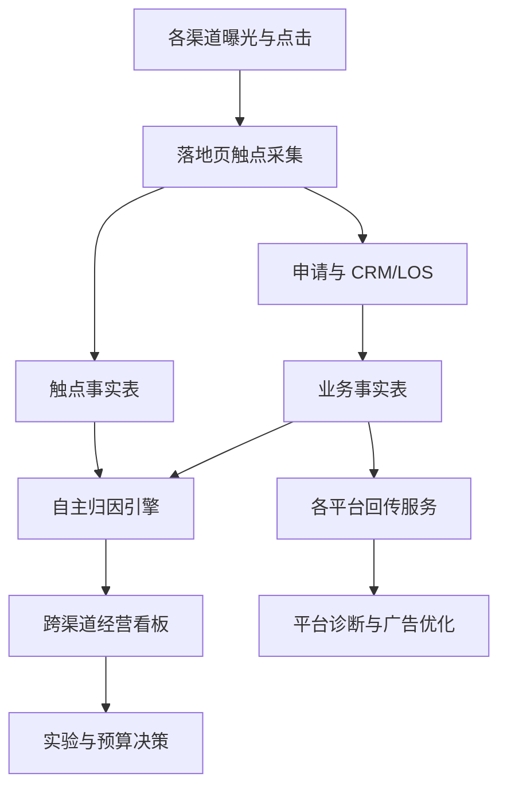
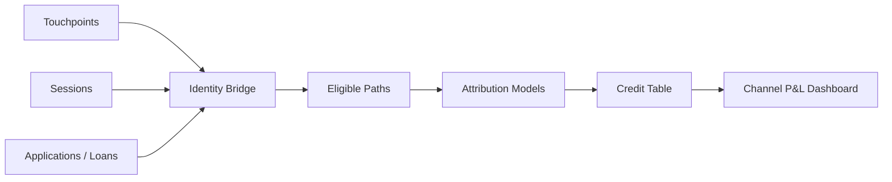
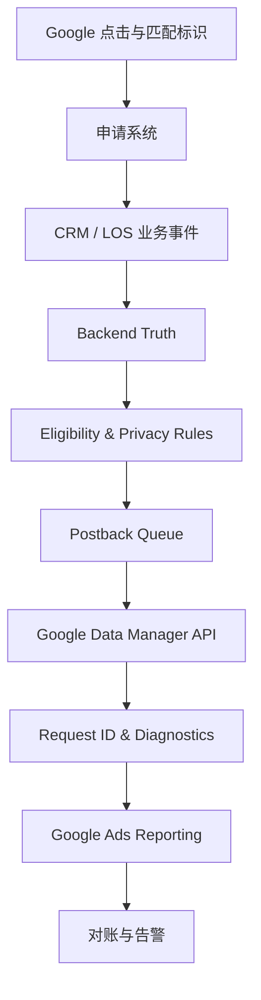

# 信贷产品多渠道归因与投放监控完整手册（澳大利亚版）

> 版本：1.0  
> 更新日期：2026-09-07  
> 适用业务：澳大利亚消费信贷/个人贷款的 Web 获客，覆盖 Google Ads、Meta、TikTok、联盟、CRM、自然流量等渠道。  
> 核心漏斗：`曝光 → 点击 → 访问 → 开始申请 → 申请提交 → 合格 → 审批/授信 → 签约 → 放款 → 还款`  
> 重要说明：本文是数据、归因和监控实施手册，不构成法律或隐私建议。信贷数据、客户匹配和广告标签上线前，应由澳大利亚隐私及信贷合规负责人审核。

---

## 目录

1. [先看结论：这套监控最终要回答什么](#1-先看结论这套监控最终要回答什么)
2. [先统一事实、口径和事件](#2-先统一事实口径和事件)
3. [完整监控体系与指标地图](#3-完整监控体系与指标地图)
4. [多渠道归因分析](#4-多渠道归因分析)
5. [渠道标记、点击 ID 与数据采集](#5-渠道标记点击-id-与数据采集)
6. [如何使用 Google 的归因数据](#6-如何使用-google-的归因数据)
7. [如何搭建自主归因](#7-如何搭建自主归因)
8. [自主归因模型详解](#8-自主归因模型详解)
9. [信贷业务推荐的归因决策体系](#9-信贷业务推荐的归因决策体系)
10. [回传架构与 Google 实施方案](#10-回传架构与-google-实施方案)
11. [回传四维监控：覆盖率、时延、质量、一致性](#11-回传四维监控覆盖率时延质量一致性)
12. [Google 与后端如何正确对账](#12-google-与后端如何正确对账)
13. [完整监控看板设计](#13-完整监控看板设计)
14. [告警体系与处理责任](#14-告警体系与处理责任)
15. [底表、字段和数据模型](#15-底表字段和数据模型)
16. [SQL 与计算逻辑模板](#16-sql-与计算逻辑模板)
17. [日、周、月监控机制](#17-日周月监控机制)
18. [典型异常排查手册](#18-典型异常排查手册)
19. [增量实验与 MMM](#19-增量实验与-mmm)
20. [隐私、合规和数据安全](#20-隐私合规和数据安全)
21. [从 0 到 1 的建设计划](#21-从-0-到-1-的建设计划)
22. [上线验收清单](#22-上线验收清单)
23. [术语表](#23-术语表)
24. [官方资料索引](#24-官方资料索引)

---

## 1. 先看结论：这套监控最终要回答什么

一套完整的信贷投放监控，不是做一张 Google Ads 报表，而是同时回答六个问题：

1. **钱花到哪里了**：各渠道、Campaign、素材、关键词实际花费多少？
2. **带来了什么人**：多少有效申请、合格申请、审批和放款？
3. **业务是否赚钱**：放款 CAC、风险调整后贡献价值、回收周期是否达标？
4. **功劳属于谁**：Google、Meta、联盟、CRM、自然流量各自贡献多少？
5. **数据有没有丢**：点击 ID、申请关联、事件回传、平台匹配分别丢了多少？
6. **广告是否真的带来增量**：如果不投广告，这些申请和放款是否仍会发生？

### 1.1 必须同时保留“四套事实”

| 事实层 | 内容 | 主要用途 | 不能替代什么 |
|---|---|---|---|
| 业务事实 | CRM/LOS 中真实申请、审批、放款、还款 | 财务、风险、经营结果 | 不能说明哪个广告触发了结果 |
| 触点事实 | 用户的渠道、点击、会话和触点链 | 自主归因、路径分析 | 不能证明广告造成了增量 |
| 平台事实 | Google、Meta 等平台各自认领的转化 | 平台竞价、平台内优化 | 不能跨平台直接相加 |
| 因果事实 | 随机实验、地域实验或可信增量模型 | 判断真实增量与预算边际回报 | 通常不能逐笔给客户分配来源 |

### 1.2 最重要的原则

> **平台回传是为了让平台学得更好；自主归因是为了让公司算得更清；增量实验是为了判断广告是否真的创造了结果。**

三者不能混成一个数字：

- 同一笔放款可能被 Google 和 Meta 同时认领，这是平台自归因的正常现象。
- 公司自主归因必须保证一笔放款的总功劳等于 1，或明确标为未归因。
- 即使自主归因给 Google 100% 功劳，也不等于 Google 创造了 100% 增量。

### 1.3 推荐整体架构



### 1.4 管理层每天只需要先看 12 个指标

| 模块 | 指标 |
|---|---|
| 投放 | Spend、Clicks、有效申请、放款数 |
| 效率 | CPC、CPA-Submit、CPA-Approved、CAC-Funded |
| 质量 | 合格率、审批率、Submit-to-Funded Rate |
| 价值 | 风险调整后 Value/Cost 或 Contribution ROAS |
| 数据健康 | 回传 Coverage、Google Reported Ratio/Match Proxy |

管理层看总览；投放、数据和研发通过下钻页面处理搜索词、素材、触点、丢数、时延和接口错误。

---

## 2. 先统一事实、口径和事件

监控项目最常见的失败，不是 BI 图表画得不好，而是不同团队对“申请”“审批”“放款”有不同定义。

### 2.1 唯一事实源

| 数据 | 唯一事实源 | 负责人 |
|---|---|---|
| 曝光、点击、平台花费 | 各广告平台或其正式 API | 投放/数据 |
| Web 会话和行为 | 第一方埋点/GA4，二者口径要分别命名 | 产品/数据 |
| 申请提交 | CRM/申请主表，而不是前端按钮点击 | 业务/数据 |
| 合格、审批、放款 | LOS/核心信贷系统 | 风险/信贷运营 |
| 还款和收益 | 核心账务系统 | 财务/风险 |
| 渠道触点 | 自建 touchpoint 表 | 数据团队 |
| 回传发送结果 | postback log / queue | 研发/数据平台 |
| Google 最终报告 | Google Ads API/UI | 投放/数据 |

### 2.2 信贷事件字典

| 标准事件 | 业务定义 | 唯一键 | 建议平台用途 |
|---|---|---|---|
| `ad_impression` | 平台记录一次合格曝光 | 平台聚合口径 | 只做媒体分析 |
| `ad_click` | 平台记录一次广告点击 | platform + click_id | 只做媒体分析 |
| `landing_session` | 页面产生一次有效会话 | session_id | 页面诊断，不作核心竞价 |
| `application_started` | 用户产生第一项有效申请输入或进入正式申请步骤 | application_id 或 session_id | Secondary |
| `application_submitted` | 后端成功创建、字段完整且非测试/重复的申请 | application_id | 冷启动期可临时 Primary，成熟后通常 Secondary |
| `qualified_application` | 满足预先约定的中性业务资格，不是单纯前端通过 | application_id | 早期 Primary 候选 |
| `kyc_passed` | 身份验证按统一规则通过 | application_id | 内部或 Secondary |
| `approved` | 正式审批/授信通过 | application_id + approval_version | Primary 候选 |
| `offer_accepted` | 客户接受正式报价并满足定义 | application_id | 内部或 Primary 候选 |
| `funded` / `disbursed` | 资金实际成功支付且未立即撤销 | loan_id | 最终 Primary |
| `first_repayment` | 首期真实还款成功 | loan_id + schedule_id | 默认仅内部 BI |
| `conversion_retracted` | 原结果因欺诈、取消或错误需要撤回 | original_event_id | 转化调整流程 |

### 2.3 每个事件都要写清 10 个属性

1. 业务定义；
2. 触发系统；
3. 发生时间 `event_time`；
4. 唯一键与去重逻辑；
5. 是否允许反转；
6. 哪种状态变更算一次新事件；
7. 是否回传各平台；
8. 是否是 Primary conversion；
9. 转化价值计算方式；
10. 数据、业务和合规责任人。

### 2.4 计数口径

- 同一 `application_id` 的申请提交只计一次。
- 同一申请可有多次模型评分，但审批事件必须按正式业务决策计数。
- 撤回后重新审批是否算新审批，应由业务制度明确，不能由 SQL 临时决定。
- 放款以核心账务成功为准，不以“点击确认”或“支付请求已发出”为准。
- 平台报表出现小数并不一定是错误；数据驱动归因可能把一笔转化拆成小数功劳。
- 所有报表必须显示事件版本、数据更新时间和时区。

### 2.5 转化价值不要直接使用贷款本金

推荐的放款价值：

\[
\text{Expected Contribution}
= \text{Expected Interest and Fees}
- \text{Funding Cost}
- \text{Expected Credit Loss}
- \text{Servicing and Collection Cost}
- \text{Variable Operating Cost}
\]

如果尚无稳定价值模型，可暂时让同类放款使用统一价值，或先优化数量；不要把 AUD 5,000 本金当作 AUD 5,000 收入。精确到个人的风险/信用信息是否能传给平台，必须单独通过隐私和广告政策审查。

---

## 3. 完整监控体系与指标地图

### 3.1 六层监控

| 层级 | 核心问题 | 指标示例 |
|---|---|---|
| 媒体交付层 | 广告有没有正常买到流量 | Spend、Impressions、Clicks、CPM、CTR、CPC、Impression Share |
| 页面行为层 | 点击后用户是否正常进入和申请 | Sessions、Click-to-Session、Start Rate、Submit Rate、页面错误 |
| 信贷漏斗层 | 流量是否能通过业务流程 | 合格率、KYC 通过率、审批率、Offer Accept Rate、放款率 |
| 经济价值层 | 投放是否赚钱 | CPA、CAC、风险调整价值、Contribution ROAS、Payback |
| 归因质量层 | 渠道来源是否完整可信 | UTM 完整率、Click ID 覆盖率、Unknown/Direct Rate、模型差异、路径长度 |
| 回传健康层 | 后端结果是否及时正确进入平台 | Coverage、Latency、API Success、Destination Status、Reported Ratio |

### 3.2 指标优先级

#### P0：决定是否立即停投或修复

- 花费异常或失控；
- 网站/申请页不可用；
- 有效申请或放款突然归零；
- 核心转化重复回传；
- 回传完全中断；
- 错误 Conversion Action、币种或价值大规模进入 Google；
- 敏感信息被发送到 URL、标签或第三方；
- 账户暂停、验证失效或严重政策异常。

#### P1：决定本周预算和流量质量

- CPA-Submit、CAC-Funded；
- 合格率、审批率、放款率；
- 搜索词/素材/地域/设备质量；
- Click ID 与 UTM 覆盖；
- 回传 Send Coverage、P90 时延、Google destination status；
- Google 与后端的成熟期差异。

#### P2：决定中长期增长

- 首次触点和助攻价值；
- 跨渠道路径与协同；
- 增量转化、Incremental CAC；
- 风险调整后的 LTV/CAC；
- MMM 的边际 ROI 和预算曲线。

### 3.3 统一漏斗公式

| 指标 | 公式 |
|---|---|
| Click-to-Session Rate | 有效落地会话 ÷ 广告点击 |
| Application Start Rate | 开始申请 ÷ 有效落地会话 |
| Submit Rate | 有效申请提交 ÷ 有效落地会话 |
| Start-to-Submit Rate | 有效申请提交 ÷ 开始申请 |
| Qualified Rate | 合格申请 ÷ 有效申请 |
| Approval Rate | 审批通过 ÷ 有效申请，另保留审批通过 ÷ 合格申请 |
| Approval-to-Funded Rate | 放款 ÷ 审批通过 |
| Submit-to-Funded Rate | 放款 ÷ 有效申请 |
| CPC | Spend ÷ Clicks |
| CPA-Submit | Spend ÷ 归因有效申请 |
| CPA-Approved | Spend ÷ 归因审批 |
| CAC-Funded | Spend ÷ 归因放款 |
| Contribution ROAS | 归因风险调整贡献价值 ÷ Spend |
| Payback Period | 累计贡献覆盖获客成本所需时间 |

桥接关系：

\[
\text{CAC-Funded}
= \frac{\text{CPA-Submit}}
{\text{Qualified Rate} \times \text{Approval Rate} \times \text{Funding Rate}}
\]

当 CPA-Submit 稳定但 CAC-Funded 上升时，必须先按三率逐项反推，不能先归因于“Google 变贵”。

### 3.4 必须支持的切分维度

- 日期、周、月与成熟 cohort；
- 渠道、source、medium、source platform；
- account、campaign、ad group/ad set、creative/ad；
- Google keyword、match type、search term；
- 国家、州、城市或合规允许的地域层级；
- 设备、操作系统、浏览器、落地页；
- 新客/老客、品牌/非品牌；
- 产品、金额/期限的内部聚合段；
- 风险/价值分层只在受控内部环境聚合分析，默认不回传广告平台。

---

## 4. 多渠道归因分析

### 4.1 为什么不能把平台数字相加

假设一名客户经历：

```text
9/1  Meta 广告点击
9/4  Google 自然搜索访问
9/6  Google Ads 品牌词点击
9/8  直接访问并提交
9/10 放款
```

可能出现：

- Meta 在自己的窗口中认领该放款；
- Google Ads 也根据自己的广告互动认领；
- GA4 将功劳按它的跨渠道模型分配；
- 自建最后付费点击把 100% 给 Google Ads；
- 财务系统只有 1 笔放款。

所以：

\[
\sum \text{各平台报告的转化} \neq \text{公司真实转化}
\]

正确方法是保留平台报告，但用自主归因结果做跨渠道统一比较。

### 4.2 每个渠道要同时看四个角度

| 角度 | 回答的问题 | 推荐指标 |
|---|---|---|
| 最后触点 | 谁临门一脚促成转化 | Last Paid / Last Non-direct Funded、CAC |
| 首次触点 | 谁把新用户带进漏斗 | First-touch Applications/Funded |
| 助攻 | 谁参与但没有拿到最后功劳 | Assisted Funded、Assist Rate、Path Position |
| 增量 | 没有广告时还会发生吗 | Incremental Funded、Lift、Incremental CAC |

### 4.3 渠道经营对比表

| Channel | Spend | Clicks | Valid Apps | Approved | Funded | CPA-Submit | CAC-Funded | Contribution ROAS | First-touch Funded | Assisted Funded |
|---|---:|---:|---:|---:|---:|---:|---:|---:|---:|---:|
| Google Search |  |  |  |  |  |  |  |  |  |  |
| Google PMax |  |  |  |  |  |  |  |  |  |  |
| Meta |  |  |  |  |  |  |  |  |  |  |
| TikTok |  |  |  |  |  |  |  |  |  |  |
| Affiliate |  |  |  |  |  |  |  |  |  |  |
| CRM/Email |  |  |  |  |  |  |  |  |  |  |
| Organic/Referral |  |  |  |  |  |  |  |  |  |  |

所有转化列必须在标题或筛选器标记所用模型，例如 `Funded — Last Paid Click 30d v1.2`。没有模型名的“渠道放款数”不可用于预算会议。

### 4.4 多渠道路径指标

| 指标 | 定义 | 说明 |
|---|---|---|
| Path Length | 转化前有效触点数 | 看用户决策复杂度 |
| Days to Submit/Fund | 首次或指定触点至事件的天数 | 设归因窗口和成熟期 |
| Single-touch Rate | 只有一个有效触点的转化占比 | 越高，简单最后点击越可能稳定 |
| Multi-touch Rate | 两个及以上有效触点占比 | 越高，助攻和模型差异越重要 |
| Cross-channel Rate | 路径含两个及以上渠道的转化占比 | 判断渠道协同 |
| First/Last Divergence | 首触渠道与末触渠道不同的占比 | 发现被最后点击低估的渠道 |
| Assist Rate | 该渠道作为非最后触点参与的转化 ÷ 含该渠道的转化 | 看启发/助攻角色 |
| Direct Closing Rate | 最后会话为 Direct 的转化占比 | 高值可能正常，也可能是来源丢失 |
| Unknown Rate | 无法识别任何合格来源的转化 ÷ 全部转化 | 归因数据健康指标 |

### 4.5 渠道重叠监控

如果能获取平台级事件主张或实验数据，增加：

- 同一 `application_id` 被几个平台认领；
- Google + Meta、Google + Affiliate 等重叠矩阵；
- 各平台认领总和 ÷ 后端真实转化；
- 平台认领与自主归因赢家的差异；
- 品牌搜索是否大量收割前序社媒/联盟触点。

平台通常不会提供足够的逐事件归因细节，因此重叠矩阵可能只能覆盖可确定匹配的子集。不要把无法匹配的部分强行分配。

### 4.6 多渠道分析顺序

1. 先对齐各渠道成本、时区、币种和 Campaign ID。
2. 检查点击与会话是否完整。
3. 用后端事实计算各渠道漏斗质量。
4. 同时输出 First Touch、Last Paid Touch 和助攻路径。
5. 比较各平台自归因与自主归因，但不要求它们完全相等。
6. 对预算较大或争议最大的渠道做增量实验。
7. 最后再做预算调整。

---

## 5. 渠道标记、点击 ID 与数据采集

### 5.1 UTM 命名规范

| 参数 | 用途 | 示例 | 规则 |
|---|---|---|---|
| `utm_source` | 渠道来源 | `google`、`meta`、`tiktok`、`affiliate_x` | 小写、固定枚举 |
| `utm_medium` | 媒介类型 | `cpc`、`paid_social`、`affiliate`、`email` | 不把 campaign 名写在这里 |
| `utm_campaign` | 可读 Campaign 名 | `au_pl_nonbrand_highintent_202609` | 与内部命名规范一致 |
| `utm_id` | 稳定 Campaign ID | `cmp_au_00124` | 名称改动时仍保持不变 |
| `utm_content` | 素材/广告变体 | `rsa_fact_v2`、`video_15s_v3` | 不含个人信息 |
| `utm_term` | 关键词或投放项 | 由渠道规则生成 | 不存用户输入的敏感内容 |

GA4 可将这些参数映射到 Manual source、medium、campaign、term 和 content 等维度；官方映射见 [Traffic-source dimensions, manual tagging, and auto-tagging](https://support.google.com/analytics/answer/11242870?hl=en)。

### 5.2 推荐渠道字典

| 原始来源 | 规范 Channel | Source | Medium |
|---|---|---|---|
| Google Search Ads | Paid Search | `google` | `cpc` |
| Google PMax/Display/YouTube | Google Cross-network / Paid Video 等内部分类 | `google` | 按公司固定枚举 |
| Meta Facebook/Instagram | Paid Social | `meta` | `paid_social` |
| TikTok Ads | Paid Social | `tiktok` | `paid_social` |
| Affiliate | Affiliate | 唯一合作方代码 | `affiliate` |
| Email/SMS/Push | CRM | `crm` 或具体系统 | `email` / `sms` / `push` |
| Organic Search | Organic Search | `google`/`bing` 等 | `organic` |
| Organic Social | Organic Social | 平台名 | `organic_social` |
| Referring site | Referral | 推荐域名规范值 | `referral` |
| 无可识别来源 | Direct/Unknown | `(direct)` / `(unknown)` | `(none)` |

保留 `raw_source/raw_medium/raw_campaign`，再通过版本化规则映射到 normalized channel；不要直接覆盖原始值。

### 5.3 平台点击标识

| 平台 | 常见点击标识示例 | 内部建议字段 |
|---|---|---|
| Google | `gclid`、`gbraid`、`wbraid` | `platform_click_id` + `click_id_type` |
| Meta | `fbclid` 或平台/服务端匹配标识 | 同上 |
| TikTok | `ttclid` 等 | 同上 |
| Microsoft Ads | `msclkid` | 同上 |
| Affiliate | 合作方 click/sub ID | `partner_click_id` |

平台字段会变化，实施时以各平台当前官方文档为准。数据库使用统一字段模型，同时保留原字段名和值。

### 5.4 点击到业务事件的桥接链

```text
platform_click_id
→ anonymous_visitor_id
→ session_id
→ application_id
→ user_id
→ approval_id
→ loan_id
→ repayment_schedule_id
```

每一步都要能向前追溯，也要记录建立关系的时间和依据。不要在公开 URL、前端日志或 BI 导出中暴露姓名、手机号、收入、信用评分、银行流水或审批原因。

### 5.5 首次访问需要保存什么

- 原始 landing URL 和 referrer；
- UTM 全字段；
- 平台、click ID 类型和值；
- 第一次触点时间、当前会话触点时间；
- 设备与页面的非敏感诊断字段；
- consent 状态与版本；
- anonymous visitor/session ID；
- 渠道映射规则版本。

同时保存 `first_touch_*` 与 `latest_touch_*`，但不要仅依赖 cookie 中的一份可覆盖字段。

### 5.6 关键采集测试

- 点击经过短链、CDN、重定向、登录、KYC 和跨域后，click ID 是否仍保留；
- 用户拒绝/接受不同 consent 选择时，行为是否符合设计；
- 同一个人跨浏览器/设备时，不进行未经同意的指纹追踪；
- URL 中出现敏感字段时立即阻断并报警；
- 前端标签失败时，后端申请仍保留业务事实；
- 申请重复提交时不产生多个有效业务事件；
- 员工、QA、机器人和压力测试有明确标识并排除。

### 5.7 Google 自动标记注意事项

Google Ads 应开启 auto-tagging，以获取 GCLID 等标识。GA4 官方提醒：如果已有 GCLID，又在事件中错误地附加手工 Campaign 信息，可能导致来源被 UTM 错误覆盖。Google 链路以 auto-tagging 为主；如为内部仓库同时保留 UTM，应经过完整测试，不让手工参数破坏 `google/cpc` 识别。参见 [Scopes of traffic-source dimensions](https://support.google.com/analytics/answer/11080067?hl=en)。

---

## 6. 如何使用 Google 的归因数据

### 6.1 先区分 Google Ads 与 GA4

| 系统 | 主要视角 | 最适合 | 局限 |
|---|---|---|---|
| Google Ads | Google 广告互动内部归因 | 出价、Campaign/关键词/广告优化 | 不是完整跨媒体财务事实 |
| GA4 | 网站/App 用户与跨渠道触点 | 行为、路径、渠道比较 | 受 consent、身份、标签、模型和数据处理影响 |
| 公司后端 | 真实申请、审批、放款、还款 | 财务和信贷经营 | 需要自己建设触点与归因 |

### 6.2 Google Ads 必加报表列

#### 媒体列

- Impressions、Clicks、CTR、Avg. CPC、Cost；
- Search Impression Share、Lost IS (budget)、Lost IS (rank)；
- Invalid clicks/invalid interactions（诊断时）。

#### 转化列

- Conversions；
- Conversion rate；
- Cost / conv.；
- Conversion value；
- Conv. value / cost；
- All conversions；
- All conversion value；
- View-through conversions；
- Cross-device conversions（适用时）；
- Conversions (by conv. time)；
- All conv. (by conv. time)；
- Conv. value (by conv. time)。

### 6.3 Conversions 与 All conversions

- `Conversions` 主要反映被设为 Primary、用于目标和竞价的转化。
- `All conversions` 包含 Primary、Secondary 和部分特殊来源，例如 view-through conversions，因此更全面，但不能直接当“核心业务成功”。
- 按 `Conversion action` 分段，避免 `application_submitted + approved + funded` 被相加成三笔客户。
- 每个广告系列要明确它实际使用的 Goal；账户总览不等于该广告系列的竞价目标。

Google 对这些列的定义见 [Understand your conversion tracking data](https://support.google.com/google-ads/answer/6270625?hl=en)。

### 6.4 点击日期与转化日期

Google Ads 主要转化列默认通常把转化归到广告互动发生日。例如 9 月 1 日点击、9 月 7 日放款，默认报表可能把该放款记回 9 月 1 日。这是计算 Campaign CPA/ROAS 的正确视角，因为花费也发生在点击日。

但与 CRM 对账时，应使用：

> **All conv. (by conv. time) + Segment by Conversion action**

它按转化实际发生时间展示，更适合和后端 `event_time` 比较。Google 官方也明确建议线下转化对账采用该方法：[Offline conversion imports FAQs](https://support.google.com/google-ads/answer/10029210?hl=en)。

### 6.5 Google Ads Attribution 报告怎么用

路径通常为 **Goals → Attribution**。根据账户和界面可见性，重点查看：

| 报告 | 看什么 | 采取什么动作 |
|---|---|---|
| Conversion paths | Google Ads 内部的互动顺序 | 判断 Search、YouTube、PMax 等如何协同 |
| Path metrics | Days to conversion、interactions to conversion | 设观察周期、归因窗口和再营销节奏 |
| Assisted conversions | 哪个网络/Campaign 经常助攻而非最后点击 | 避免仅按最后点击误砍上游 Campaign |
| Model comparison | Last Click 与 Data-driven 的 CPA/ROAS 差异 | 识别被最后点击低估的关键词/Campaign |

Google Ads attribution report 的 lookback control 通常可查看 30、60 或 90 天；它与 Conversion Action 的 conversion window 不是一回事。前者控制报告回看路径多远，后者决定一次广告互动后多长时间内的转化可被记录。官方说明见 [About attribution reports](https://support.google.com/google-ads/answer/1722023?hl=en)。

### 6.6 Google Ads 归因模型

当前实务重点是：

- **Last click**：最后一个合格 Google 广告互动获得 100% 功劳；
- **Data-driven attribution（DDA）**：根据转化与未转化路径，给多个 Google Ads 互动分配功劳。

DDA 可能产生小数转化，这是功劳被拆分，而不是“半个人放款”。用 Model comparison 比较两种模型的 Campaign、广告组、关键词、设备的 CPA 或 ROAS。旧教程里的 First click、Linear、Time decay、Position-based 已在 GA4 等场景被逐步下线，不要假设当前账户仍能直接选择。Google Ads 模型说明：[About attribution models](https://support.google.com/google-ads/answer/6259715?hl=en)。

### 6.7 Google Ads 数据的正确用途

| 用途 | 使用数据 |
|---|---|
| 自动出价 | 当前 Primary conversion 及相应 value |
| Campaign/关键词优化 | 点击日期口径的 Conversions、Cost/conv.、Value/Cost |
| 与 CRM 事件量对账 | By conversion time + Conversion action |
| 判断路径/助攻 | Attribution paths、Assisted conversions、Model comparison |
| 判断技术质量 | Goals → Conversion summary → Diagnostics、Data Manager diagnostics |
| 跨 Google、Meta、联盟预算 | 不只用 Google Ads；使用自主归因和实验 |

### 6.8 GA4 归因数据怎么用

#### 三种 traffic-source scope

| Scope | 常见维度 | 回答的问题 |
|---|---|---|
| User-scoped | First user source/medium/campaign | 这个用户最初从哪里被获取 |
| Session-scoped | Session source/medium/campaign | 这次会话从哪里开始 |
| Event-scoped | Source/medium/campaign、Default channel group | 这个关键事件按报告模型把功劳给谁 |

修改 GA4 的 reporting attribution model，会影响使用 event-scoped traffic dimensions 的关键事件报表，但不会改变 First user 和 Session 维度。数据驱动模型下出现 fractional credit 是正常的。参见 [Select attribution settings](https://support.google.com/analytics/answer/10597962?hl=en)。

#### Attribution 设置

在 **Admin → Data display / Events → Attribution settings 或 Key events attribution** 中检查：

- Reporting attribution model；
- Channels that can receive credit；
- Key event lookback window。

对 Web conversion，可选择 Google paid channels，或 Paid and organic channels。后者给出更完整的跨渠道视角，但改变设置可能影响共享到 Google Ads 的报表和竞价，必须记录变更时间并评估。官方说明：[Creating and managing conversions](https://support.google.com/analytics/answer/14710559?hl=en)。

#### GA4 Attribution Paths

路径通常为 **Advertising → Key event attribution paths**。按事件分别看 `application_submitted`、`approved`、`funded`，不要默认聚合所有 key events。重点观察：

- 哪些渠道 Initiate、Assist、Close；
- Days to key event；
- Touchpoints to key event；
- 早期触点和末端触点变化；
- 不同 key event 的路径是否不同。

官方说明：[Key event attribution paths report](https://support.google.com/analytics/answer/10595568?hl=en)。

### 6.9 GA4 BigQuery 的作用

将 GA4 原始事件导出 BigQuery，可以：

- 查看事件级路径；
- 与 `application_id` 和业务事实关联；
- 自行计算 session/first touch/last touch；
- 审查 UTM、referrer、GCLID 的丢失位置；
- 与其他渠道和 CRM 合并。

Google 当前 BigQuery schema 中可使用 `session_traffic_source_last_click` 获取 session-scoped last-click 信息，并通过 traffic-source 字段做转化事件归因分析。参见 [Traffic attribution data in BigQuery](https://developers.google.com/analytics/bigquery/traffic-attribution-data)。

BigQuery 原始事件、自建 SQL 与 GA4 UI 不保证完全相同，因为身份、建模、处理、归因规则、数据更新时间和阈值可能不同。自主归因必须拥有自己的版本和口径，不要伪装成“复刻 GA4”。

### 6.10 Google Ads 与 GA4 常见差异

- Click 不等于 Session；一次会话可包含多次点击，也可能点击后未加载标签。
- Google Ads 会过滤部分无效点击，GA4 的会话处理不同。
- 两者时区可能不同。
- 默认日期归属不同：广告互动时间 vs 事件发生时间。
- 归因模型、窗口、Primary/Secondary、计数方式不同。
- GCLID 被跳转或服务器重写移除。
- consent、浏览器限制、跨设备和 modeled conversions 导致差异。
- 转化处理和线下上传存在延迟。

Google 官方排查说明：[Clicks and Sessions discrepancy](https://support.google.com/analytics/answer/14452452?hl=en)。不要把所有差异都定义为 bug；先分类为“口径差异、处理延迟、真实漏数、模型差异”。

---

## 7. 如何搭建自主归因

### 7.1 自主归因的目标

自主归因系统应做到：

- 每一笔真实申请/放款只存在一份业务事实；
- 能还原转化前的有效触点序列；
- 能同时计算多个归因模型；
- 每个模型中一笔转化的功劳总和等于 1；
- 能解释为什么某渠道获得功劳；
- 规则、窗口和输出可以版本化和重算；
- 平台数字变化不改写历史业务事实。

### 7.2 数据链路



### 7.3 身份关联优先级

1. 明确的 `application_id`；
2. 登录后的 `user_id`；
3. 合规的一方 anonymous visitor ID；
4. session ID；
5. 平台 click ID；
6. 经批准的人工/客服来源编码。

不要使用未经授权的设备指纹或模糊匹配来强行提高归因率。无法确定时标为 Unknown，比错误归因更可靠。

### 7.4 有效触点规则

触点进入归因路径前，至少检查：

- 时间早于转化；
- 落在该模型的 lookback window 内；
- channel/source/medium 有效；
- 不是员工、测试、机器人或已确认欺诈流量；
- 用户和 consent 状态允许处理；
- 没有重复 click/session；
- 关联证据达到设定级别。

### 7.5 归因窗口怎么定

不要凭行业惯例永久写死 30 天。先计算：

- Click → Application 的 P50/P90/P95/P99；
- Application → Approval；
- Approval → Funded；
- First Touch → Funded；
- 不同渠道和产品的延迟分布。

建议初期可用 **30 天点击窗口**作为统一分析基线，再用历史数据验证。窗口应覆盖主要决策周期，但过长会让很早的弱触点获得过多功劳。联盟结算窗口、平台回传窗口和公司分析窗口可以不同，必须分别命名。

### 7.6 Direct 的处理

推荐：Direct 不覆盖窗口内已知的合格营销触点。只有路径内没有其他可识别来源时，才把功劳给 Direct。否则书签、手输网址或来源丢失会收割前面渠道的功劳。

### 7.7 平台回传与自主归因赢家分开

假设客户先点 Google、再点 Meta、最后放款：

- Google 和 Meta 的回传服务可分别按各自合规的匹配条件发送真实 `funded` 事件，供各平台竞价；
- 自主 Last Paid Click 只能给其中一个渠道 100% 功劳；
- 财务只计一笔放款；
- 平台自归因数字不得相加。

字段上应分开保存：

```text
eligible_for_google_postback
eligible_for_meta_postback
owned_attribution_channel
owned_attribution_model
owned_attribution_version
```

---

## 8. 自主归因模型详解

### 8.1 Last Paid Click

把 100% 功劳给转化前最后一个付费触点；Direct 和通常的自然回访不覆盖已有付费触点。

**优点**：简单、稳定、可审计，适合日常预算和联盟结算基线。  
**缺点**：低估种草和启发渠道，品牌搜索容易收割功劳。

### 8.2 Last Non-direct Click

把功劳给转化前最后一个非 Direct 触点，可能是 Paid、Organic、Referral 或 CRM。

**优点**：比纯最后会话更合理。  
**缺点**：仍然偏向末端，而且 Organic/CRM 可能覆盖真实付费获客。

### 8.3 First Touch / First Paid Touch

把 100% 功劳给最早的有效触点，或最早付费触点。

**优点**：看新客起点、渠道拓新能力。  
**缺点**：忽略后续促成，不能单独用于全部预算。

### 8.4 Linear

路径有 \(n\) 个有效触点，每个获得：

\[
w_i = \frac{1}{n}
\]

**优点**：所有参与渠道都有功劳。  
**缺点**：默认每个触点同等重要，容易奖励无意义的重复访问。

### 8.5 Position-based

示例规则：首触 40%、末触 40%，中间触点均分 20%。

\[
w_{first}=0.4, \quad w_{last}=0.4, \quad
w_{middle}=\frac{0.2}{n-2}
\]

**优点**：兼顾获取和促成。  
**缺点**：40/20/40 是人为假设，不是因果证据。

### 8.6 Time-decay

离转化越近权重越大。可使用半衰期 \(h\)：

\[
raw\_w_i = 2^{-\Delta t_i/h}, \qquad
w_i = \frac{raw\_w_i}{\sum_j raw\_w_j}
\]

**优点**：适合较长决策路径。  
**缺点**：仍是规则模型，半衰期选择会显著影响结果。

### 8.7 Markov Chain

把渠道看成路径状态，估计用户从一个渠道走向另一个渠道及转化/流失的概率。移除某渠道后，整体转化概率下降多少，即该渠道的 removal effect。

**优点**：能利用路径顺序和渠道协同。  
**缺点**：对样本量、路径清洗和状态定义敏感；相关性不等于因果。

### 8.8 Shapley Value

将渠道视为合作博弈参与者，按渠道加入各种组合后的边际贡献平均分配功劳。概念公式：

\[
\phi_i = \sum_{S \subseteq N \setminus \{i\}}
\frac{|S|!(|N|-|S|-1)!}{|N|!}
\left[v(S \cup \{i\})-v(S)\right]
\]

**优点**：理论上公平考虑组合贡献。  
**缺点**：渠道多时计算与估计困难，结果强依赖价值函数；仍不自动成为因果结论。

### 8.9 自建数据驱动模型

可用转化/未转化路径训练分类或生存模型，再通过移除、扰动或边际贡献分配触点价值。必须做到：

- 使用转化与未转化样本；
- 按时间切分训练/验证，防止未来信息泄漏；
- 控制频次、渠道选择偏差和用户基础意愿；
- 监控校准、稳定性和版本漂移；
- 与简单规则模型及增量实验对照；
- 不把“预测能力”误说成“因果贡献”。

### 8.10 模型对比表

| 模型 | 易解释 | 多触点 | 可用于结算 | 可证明增量 |
|---|---:|---:|---:|---:|
| Last Paid Click | 高 | 否 | 高 | 否 |
| Last Non-direct | 高 | 否 | 中 | 否 |
| First Touch | 高 | 否 | 中 | 否 |
| Linear | 高 | 是 | 低 | 否 |
| Position-based | 中 | 是 | 低 | 否 |
| Time-decay | 中 | 是 | 低 | 否 |
| Markov | 中/低 | 是 | 低 | 否 |
| Shapley | 低 | 是 | 低 | 否 |
| Randomized Lift | 高 | 渠道/人群级 | 不用于逐笔结算 | **是** |
| MMM | 中 | 渠道聚合级 | 不用于逐笔结算 | 需校准，接近因果决策 |

---

## 9. 信贷业务推荐的归因决策体系

### 9.1 不要只选一个模型

推荐固定输出四套口径：

| 口径 | 推荐方法 | 用途 |
|---|---|---|
| 财务总数 | Backend Truth | 全公司申请、审批、放款和价值 |
| 预算主口径 | Last Eligible Paid Click，窗口版本化 | 跨渠道 CAC、日常预算和结算 |
| 经营分析 | First Paid + Last Paid + Assisted Paths + 可选 Markov | 发现拓新、助攻和收割渠道 |
| 因果校准 | Conversion Lift、Geo Holdout、其他随机实验、MMM | 判断真实增量和边际预算 |

### 9.2 推荐第一版规则

```text
模型名：owned_last_paid_click_30d_v1

1. 只考虑转化前 30 天的合格付费点击；
2. 排除测试、机器人、已知欺诈和时间异常触点；
3. Direct 不覆盖已知付费点击；
4. 选择距离转化最近的付费点击；
5. 同时保留 First Paid Touch 和完整路径；
6. 没有合格付费触点时，按 Last Non-direct 或 Unknown 分类；
7. 一笔 conversion 的归因权重总和必须等于 1；
8. 规则修改必须产生新版本，不覆盖历史结果。
```

30 天只是初始基线。积累数据后，根据 First/Last Touch → Submit/Funded 的延迟分布和业务合同重新确定窗口。

### 9.3 品牌搜索单独看

品牌搜索常处于路径末端。至少输出：

- 纯品牌单触点放款；
- 品牌收口但前面存在非品牌 Google 的放款；
- 品牌收口但前面存在 Meta/TikTok/Affiliate 的放款；
- Brand Last Click 与 First Paid 的差异；
- 品牌投放的增量实验结果。

不要用品牌词的低 CAC 证明整个 Google 新客获客都很高效。

### 9.4 联盟渠道的结算规则

- 合同归因与经营归因分开字段保存。
- 约定 click window、去重优先级、重复申请、老客、欺诈、撤销和放款定义。
- 结算前与 Google/Meta 等付费触点做重复检查。
- 合作方 sub ID 必须能追到具体来源，但不能承载个人敏感信息。
- 归因规则更新后保留旧版本和生效日。

### 9.5 预算决策矩阵

| 自主归因回报 | 增量实验 | 决策 |
|---|---|---|
| 高 | 高 | 优先扩量，观察边际回报 |
| 高 | 低 | 可能在收割自然需求；控制预算并重做实验 |
| 低 | 高 | 归因可能低估上游价值；保留并改善承接 |
| 低 | 低 | 优先缩减或停止 |
| 不稳定 | 未测 | 保持受控预算，先修数据并做实验 |

---

## 10. 回传架构与 Google 实施方案

### 10.1 回传链路



### 10.2 2026 年新实施建议

对新的 Google 线下转化项目，优先使用 **Google Ads Data Manager / Data Manager API + Enhanced Conversions for Leads** 的当前方案，不以多年前的 legacy file/API 教程作为主架构。Google 的 Data Manager API 支持发送 Google Ads offline conversions 和 enhanced conversions for leads；成功请求返回 `requestId`，之后可查询 diagnostics。

从 2026 年 4 月起，Google Ads 将 web 与 leads 的 enhanced conversions 设置整合为统一开关。新实施应核对当前账户状态，并继续尽可能在事件中提供 GCLID；官方说明见 [Enhanced conversions for leads](https://support.google.com/google-ads/answer/15713840?hl=en) 和 [Data Manager API events](https://developers.google.com/data-manager/api/devguides/events)。

### 10.3 推荐平台转化映射

| 业务事件 | Google Conversion Action | Primary/Secondary | Value |
|---|---|---|---|
| 申请提交 | `AU_Application_Submitted` | 冷启动临时 Primary；成熟后 Secondary | 可为空或统一早期值 |
| 合格申请 | `AU_Qualified_Application` | 早期 Primary 候选 | 历史转放款概率 × 预期放款贡献 |
| 审批 | `AU_Approved` | Primary 候选 | 审批后放款概率 × 预期贡献 |
| 放款 | `AU_Funded` | 最终 Primary | 风险调整后预期贡献价值 |
| 首期还款/逾期 | 默认不设平台 Action | 内部 BI | 不上传敏感负面财务状态 |

不要把四个动作同时设为同一广告系列的 Primary 后直接相加。切换出价目标时应有平行观察期、回传稳定性检查和变更记录。

### 10.4 每笔回传至少需要的内部字段

```text
event_id
application_id
loan_id
event_name
event_time
event_value
currency

source_platform
click_id_type
click_id
consent_status

conversion_action_id/name
upload_destination
payload_version

queue_time
send_time
response_time
request_id
destination_status

http_status
error_code
error_message
retry_count
next_retry_time
final_status
```

### 10.5 Enhanced Conversions for Leads

在有合法基础、清晰告知和适当同意的前提下，可使用网站表单中由用户提供的一方数据，例如规范化并哈希后的邮箱或电话，辅助匹配线下结果。实践要求：

- 前端标签和后端回传使用一致、正确规范化的字段；
- 继续提供 GCLID 等点击标识；
- 电话按 E.164 等要求规范；
- 不发送信用评分、高负债、逾期、拒绝原因、银行流水等敏感信贷字段；
- 哈希不是法律许可，不能替代同意、告知和数据最小化；
- 使用 Tag Assistant 和 Enhanced Conversions diagnostics 验证。

### 10.6 上传时间与窗口

Google 当前指南提示：

- 普通 offline conversion 若在相关最后点击超过 90 天后上传，通常不会导入；
- Enhanced conversions for leads 若超过相关最后点击 63 天后上传，通常不会导入；
- 成功导入的统计常约数小时后出现；某些 GBRAID/WBRAID 转化的处理可能更久；
- 这些是外部上限/处理时间，不是内部 SLA。内部申请、审批、放款应尽量在事件确认后的分钟至小时级回传。

来源：[Guidelines for importing offline conversions](https://support.google.com/google-ads/answer/15081888?hl=en) 和 [Fix discrepancies and errors](https://support.google.com/google-ads/answer/13321563?hl=en)。

### 10.7 队列、重试与幂等

- 业务系统只写真实事件，不直接阻塞等待 Google。
- Postback service 从 durable queue/table 取数。
- 发送前做 schema、时间、币种、action 和 consent 验证。
- 使用稳定 `event_id` 与内部唯一键保证幂等。
- 可重试错误采用指数退避并限制最大次数。
- 不可重试错误进入 dead-letter queue，附责任人和修复说明。
- 认证失败、权限错误和目标配置错误应触发高优先级告警。
- Data Manager API 使用 fast-fail 模式时，一个错误记录可能使整个请求失败；发送前严格校验，并用可控批次降低影响范围。官方迁移说明：[Data Manager API upgrade steps](https://developers.google.com/data-manager/api/devguides/events/google-ads/offline/upgrade/steps)。

### 10.8 请求成功不等于归因成功

状态应拆成：

```text
CREATED
→ ELIGIBLE
→ QUEUED
→ SENT
→ API_ACCEPTED
→ DESTINATION_PROCESSING
→ DESTINATION_SUCCESS / PARTIAL_SUCCESS / FAILURE
→ REPORTED_AGGREGATE
```

HTTP 200 或返回 `request_id` 只说明请求被接收，不说明每笔事件最终被 Google 归因。Google 建议对成功请求保留 `request_id`，约 30 分钟后调用 `RetrieveRequestStatus`，并通过指数退避持续查询直到到达终态。参见 [Data Manager API diagnostics](https://developers.google.com/data-manager/api/devguides/diagnostics)。

### 10.9 转化调整

如果放款因欺诈、取消或数据错误需要修正，可根据 Google 当前支持情况使用：

- **Restate**：修改 conversion value，不修改转化次数；
- **Retract**：永久撤销转化并将价值归零。

信贷场景必须事先定义哪些业务状态需要调整、允许期限、审批人和审计日志。不要因后期表现差而任意撤回真实发生的事件。官方说明：[About conversion adjustments](https://support.google.com/google-ads/answer/7686447?hl=en)。

---

## 11. 回传四维监控：覆盖率、时延、质量、一致性

### 11.1 第一维：Coverage

覆盖率一定要从业务真实事件向下看，而不是只算 API 成功。

#### 分母分层

| 人群 | 定义 |
|---|---|
| Backend Truth | 后端去重后的全部真实业务事件 |
| Expected Google Population | 按公司规则应该给 Google 处理的真实事件，例如具有 Google 触点且符合用途规则 |
| Matchable Population | Expected 中至少有一个允许使用的有效 click/user-provided identifier |
| Upload-eligible Population | 同时满足时限、格式、consent、action 已配置等要求 |

“全部公司放款”不能直接作为 Google 匹配率分母；非 Google 获客、无可用标识或超出合法处理范围的事件本来就不会被 Google 认领。但它们仍应在总体事实看板中显示。

#### 指标公式

| 指标 | 公式 | 定位问题 |
|---|---|---|
| Attribution Coverage | 有至少一个可识别营销触点的事件 ÷ Backend Truth | 自主归因是否有来源 |
| Google Identifier Coverage | 有允许 Google 匹配标识的 Expected Google Events ÷ Expected Google Events | click ID/增强匹配是否丢失 |
| Queue Coverage | 进入回传队列的唯一事件 ÷ Upload-eligible Events | 业务到回传链路是否漏数 |
| Send Coverage | 实际发送的唯一事件 ÷ Upload-eligible Events | 调度/队列是否漏发 |
| API Accepted Rate | API accepted 请求/事件 ÷ 实际发送 | 接口是否成功接收 |
| Destination Success Rate | destination success 事件 ÷ accepted 事件 | Google 后续处理质量 |
| Reported Ratio | Google 按转化时间报告数 ÷ Expected Google Events | 最终报表覆盖代理指标 |

Reported Ratio 是聚合代理值，不等于逐事件精确匹配率，因为 Google 可能使用数据驱动归因、小数功劳、跨设备或 modeled conversion。

### 11.2 第二维：Latency

每条事件至少记录：

```text
event_time
truth_ready_time
queue_time
send_time
api_response_time
diagnostic_terminal_time
first_report_seen_time（若可监控）
```

分段时延：

| 指标 | 公式 |
|---|---|
| Source latency | truth_ready_time − event_time |
| Queue latency | queue_time − truth_ready_time |
| Send latency | send_time − queue_time |
| API latency | api_response_time − send_time |
| Destination latency | diagnostic_terminal_time − api_response_time |
| Report latency | first_report_seen_time − event_time |

每项至少展示 P50、P90、P99 和最大值。平均值会掩盖长尾，例如 99% 在 5 分钟内、1% 卡 24 小时，平均值仍可能看起来不严重，但自动出价丢失的恰好可能是高价值事件。

内部初始 SLA 示例：

| 事件 | P50 | P90 | P99 |
|---|---:|---:|---:|
| Application | < 5 min | < 15 min | < 60 min |
| Qualified/Approved | < 10 min | < 30 min | < 2 hr |
| Funded | < 15 min | < 60 min | < 4 hr |

这些是内部示例，不是 Google 的官方硬性阈值。应根据系统批次、业务确认时间和竞价需要调整。

### 11.3 第三维：Quality

| 指标 | 公式/内容 |
|---|---|
| API Success Rate | 成功请求或事件 ÷ 发送总量 |
| Retry Rate | 发生至少一次重试的事件 ÷ 发送事件 |
| Final Failure Rate | 达到最大重试仍失败 ÷ Upload-eligible |
| DLQ Size/Age | 死信数量与最老事件年龄 |
| Duplicate Rate | 被识别为重复的事件 ÷ 发送事件 |
| Invalid Schema Rate | 字段/格式错误 ÷ 发送事件 |
| Auth/Permission Error | 认证、权限或目标账号错误数 |
| Wrong Action/Currency Rate | action/币种/价值配置异常数 |
| Diagnostic Quality | Google Excellent/Good/Needs attention/No recent data |

Google Offline Data Diagnostics 将 well-formed 和 valid 作为数据质量核心，并提供 Overall data quality、Alerts、按天/按 job 的错误历史。官方页面：[Offline data diagnostics](https://support.google.com/google-ads/answer/13812240?hl=en)。

### 11.4 第四维：Consistency

| 对账 | 公式 | 作用 |
|---|---|---|
| Truth vs Queue | Queue unique − Expected truth | 查事件生成/筛选问题 |
| Queue vs Sent | Sent unique − Queue unique | 查调度与积压 |
| Sent vs Accepted | Accepted − Sent | 查 API/认证/格式 |
| Accepted vs Destination | Destination success − Accepted | 查 Google 后处理 |
| Truth vs Google Report | By-conv-time report − Expected truth | 查最终归因/窗口/模型/处理差异 |
| Platform vs Owned Attribution | Platform claimed − Owned credited | 看平台自归因与公司口径差异 |

差异率统一写法：

\[
\text{Diff Rate} = \frac{\text{Observed} - \text{Expected}}{\text{Expected}}
\]

同时展示绝对差和相对差。小样本只看百分比容易制造假警报。

### 11.5 四维健康卡

看板顶部固定：

| Coverage | P90 Latency | API Success | Google Reported Ratio |
|---:|---:|---:|---:|
|  |  |  |  |

然后必须能按 Application、Qualified、Approved、Funded 分别下钻；不要只显示所有事件混合后的平均健康度。

---

## 12. Google 与后端如何正确对账

### 12.1 对账的五个条件必须一致

1. **同一事件**：只比较 `AU_Funded` 与后端 `funded`，不混申请和审批；
2. **同一时间口径**：后端 `event_time` 对 Google `by conv. time`；
3. **同一时区**：Google Ads account timezone 与数据仓库明确转换；
4. **同一计数方式**：One/Every、去重和撤销规则一致；
5. **同一成熟度**：给 Google 留出处理和归因延迟。

### 12.2 正确对账方式

```text
Backend:
deduped funded events
WHERE event_time in [start, end)
AND expected_google_population = true

versus

Google Ads:
All conv. (by conv. time)
Segment = Conversion action
Conversion action = AU_Funded
same account timezone/date range
```

不要拿 upload date 对 Google 报表；Google 不提供以上传日为核心的转化报表口径。也不要拿默认点击日期的 Conversions 与当天后端放款直接比较。

### 12.3 数据成熟期

Google 官方说明，线下转化处理通常少于 12 小时，但以 GBRAID/WBRAID 为键的转化可能最长约 72 小时。因此建议：

| 检查时点 | 用途 |
|---|---|
| 实时/T+0 | 检查 Truth、Queue、Sent、API Accepted |
| 约 30 分钟后 | 查询 Data Manager request diagnostics |
| T+1 | 初步 Google 报表对账 |
| T+3 | 覆盖 GBRAID/WBRAID 等较长处理情况 |
| T+7/业务成熟期 | 稳定归因和漏斗分析 |

实际成熟期还要加上 Click → Funded 的业务延迟。比如平均 7 天放款，就不能用昨天点击的放款数判断昨天流量好坏。

### 12.4 对账矩阵

| Event | Backend Truth | Expected Google | Matchable | Queued | Sent | API Accepted | Destination Success | Google by Conv. Time | Diff |
|---|---:|---:|---:|---:|---:|---:|---:|---:|---:|
| Application |  |  |  |  |  |  |  |  |  |
| Qualified |  |  |  |  |  |  |  |  |  |
| Approved |  |  |  |  |  |  |  |  |  |
| Funded |  |  |  |  |  |  |  |  |  |

### 12.5 平台少于后端的排查顺序

1. Backend 是否把重复/测试/非 Google 来源多算；
2. Google Expected population 规则是否正确；
3. UTM/GCLID/GBRAID/WBRAID 是否在跳转或跨域丢失；
4. `application_id → click_id` 是否关联失败；
5. Truth → queue 是否漏生成；
6. queue 是否积压或漏发；
7. API 是否失败、重试耗尽或 action 配错；
8. destination diagnostics 是否仍 processing/partial/failure；
9. conversion time、时区、窗口和 click age 是否有效；
10. 是否尚未等满 Google 处理时间；
11. 报表是否用了错误列、错误 Conversion Action 或 Primary 筛选；
12. Google 模型/隐私处理造成的合理差异。

### 12.6 平台多于后端的排查顺序

1. 前端 success page 或事件重复触发；
2. Google Ads 原生 tag 与 GA4 导入同一事件都为 Primary；
3. Application、Approved、Funded 被聚合在 All conversions 中；
4. Counting method 使用 Every；
5. 同一业务事件的时间/名称变化导致去重失效；
6. View-through、engaged-view、cross-device 或 modeled conversions 被包含；
7. 后端事件被撤销/延迟入仓但 Google 尚未调整；
8. 对账时间范围或时区不一致；
9. 自主后端漏数。

---

## 13. 完整监控看板设计

### 13.1 页面一：管理层总览

#### 顶部 KPI 卡

| Spend | Valid Applications | Approved | Funded | CAC-Funded | Contribution ROAS |
|---:|---:|---:|---:|---:|---:|
|  |  |  |  |  |  |

第二行：

| Qualified Rate | Approval Rate | Submit-to-Funded | Attribution Coverage | Postback Coverage | P90 Latency |
|---:|---:|---:|---:|---:|---:|
|  |  |  |  |  |  |

#### 趋势图

- Spend 与 Funded 双轴趋势；
- CPA-Submit、CAC-Funded、目标线；
- Contribution ROAS 与目标线；
- 成熟 cohort 与未成熟 cohort 用不同颜色/阴影。

#### 渠道表

展示各渠道 Spend、申请、审批、放款、CAC、价值、首触、末触、助攻、增量结论。默认按风险调整后贡献排序，而不是按表单数量排序。

### 13.2 页面二：渠道与漏斗

漏斗按 Channel → Campaign → Ad group/Ad set → Creative/Keyword 下钻：

| 维度 | Spend | Click | Session | Start | Submit | Qualified | Approved | Funded | CPC | CPA | CAC |
|---|---:|---:|---:|---:|---:|---:|---:|---:|---:|---:|---:|

配套图：

- 各阶段转化率热力图；
- 渠道 × 州/设备质量矩阵；
- Google 搜索词花费—放款四象限；
- 素材的点击率与后端质量散点图。

### 13.3 页面三：归因分析

- First Touch vs Last Paid Touch 渠道对比；
- Last Click vs DDA/Markov 的 credit、CAC、ROAS 差异；
- Top conversion paths；
- Path Length 和 Days to Fund 分布；
- Initiator、Assister、Closer 占比；
- 品牌收口路径；
- Direct/Unknown 趋势；
- 平台自归因 vs 自主归因 vs Backend Truth。

### 13.4 页面四：Google 专项

| 模块 | 内容 |
|---|---|
| Media | Spend、Clicks、CPC、Impression Share、Lost IS |
| Conversion | Primary/All、by interaction time/by conversion time |
| Funnel | Submit、Qualified、Approved、Funded 与各率 |
| Value | Conversion value、Value/Cost、CAC-Funded |
| Attribution | Paths、Assists、Days/Interactions、DDA vs Last Click |
| Data health | Conversion status、Diagnostics、GCLID coverage、processing lag |

Google Search 还要支持 keyword、match type、search term、brand/non-brand；PMax/YouTube 等则按可获得的 channel/campaign/asset 维度单独设计，不强行套关键词口径。

### 13.5 页面五：回传健康

顶部四卡：Coverage、P90 Latency、API Success、Google Reported Ratio。

下方依次展示：

1. Backend → Expected → Matchable → Queued → Sent → Accepted → Destination → Reported 漏斗；
2. Application/Qualified/Approved/Funded 的 Coverage 趋势；
3. 各阶段 P50/P90/P99 时延；
4. Error code 数量和占比；
5. GCLID/GBRAID/WBRAID/Enhanced Data 覆盖；
6. retry、DLQ、最老积压年龄；
7. Backend vs Google 对账矩阵；
8. request_id/application_id 单笔追踪入口。

### 13.6 页面六：数据质量

- UTM 完整率和枚举违规；
- Click ID 入站、申请提交、CRM 入库各阶段留存率；
- `application_id` 关联成功率；
- 重复事件、孤儿事件、转化早于点击；
- 时区/币种异常；
- Source/Medium Unknown、Direct 激增；
- GA4 clicks/sessions 与平台 clicks 差异；
- 数据更新时间、任务 SLA 和表分区完整性。

### 13.7 必备筛选器

- 日期、成熟期状态；
- 国家/州；
- 产品；
- Channel/source/medium；
- account/campaign/ad group/creative；
- 品牌/非品牌；
- event/conversion action；
- platform attribution / owned attribution model；
- device/network；
- 数据版本。

---

## 14. 告警体系与处理责任

### 14.1 告警设计原则

- 绝对阈值 + 环比基线同时判断；
- 设置最小样本量，避免 1 笔数据造成 100% 波动告警；
- 连续两个或多个窗口异常再触发非 P0 告警；
- 区分业务自然波动与数据链路故障；
- 每条告警包含当前值、预期值、影响事件、开始时间、负责人和排查链接；
- 有恢复通知和 incident close 记录；
- 自动暂停广告仅用于明确定义、可逆且高风险的 P0 场景。

### 14.2 示例阈值

以下只作为第一版模板，需按你们真实基线调整：

| 级别 | 条件示例 | 动作 |
|---|---|---|
| P0 | 核心页面不可用 5 分钟；Funded 回传连续 30 分钟为 0 且后台有事件；敏感字段外泄；花费严重失控 | 立即通知研发/投放/合规，必要时暂停相关 Campaign |
| P0 | 错误 Action、币种或价值批量发送；重复回传突增 | 停止发送任务，隔离批次，评估 adjustment |
| P1 | Send Coverage < 98% 持续 30 分钟且样本 ≥ 50 | 检查 event generation、queue、filter |
| P1 | API Success < 99% 或 final failure > 1% | 查看 error distribution、认证和 payload |
| P1 | Funded P90 postback latency > 60 分钟 | 检查 source、batch 和 queue latency |
| P1 | Identifier Coverage 较 7 日同星期基线下降 10 个百分点 | 检查跳转、cookie/consent、发布变更 |
| P1 | T+3 Google reported ratio 低于成熟基线 15% | 对账 action、时区、window、diagnostics |
| P2 | Direct/Unknown 连续 3 天上升 20% | 审查 UTM、referrer 和跨域 |
| P2 | CAC-Funded 较成熟 4 周基线上升 20% | 用桥接公式拆 CPC、CVR、三率 |

### 14.3 告警路由

| 问题 | 第一责任人 | 协同 |
|---|---|---|
| Spend/预算异常 | 投放 | 财务、数据 |
| 页面/表单故障 | 产品/前端 | 投放、QA |
| Truth 事件缺失 | 业务系统/数据 | 风险、运营 |
| Click ID/UTM 丢失 | Web/数据 | 投放 |
| Queue/API/认证 | 后端/数据平台 | 投放 |
| Google diagnostics | 投放/MarTech | 后端、数据 |
| 对账差异 | 数据 | 投放、业务系统 |
| 隐私/敏感数据 | 隐私与合规 | 安全、研发、投放 |

### 14.4 告警消息模板

```text
[P1][Google Funded Postback] Send Coverage 下降
开始时间：2026-09-07 10:00 AEST
当前值：91.2%（目标 ≥98%）
样本：Backend eligible 318，Sent 290，Missing 28
影响：AU_Funded / Account xxx / All campaigns
初步定位：24 条未进入 queue，4 条 payload validation failed
Owner：Data Platform
Runbook：<内部链接>
下次更新：30 min
```

---

## 15. 底表、字段和数据模型

### 15.1 `marketing_touchpoint`

```text
touchpoint_id
anonymous_visitor_id
session_id
user_id
application_id

touch_time
touch_type               -- impression/click/session/manual
source_raw
medium_raw
campaign_raw
source_normalized
medium_normalized
channel_normalized

platform_account_id
campaign_id
ad_group_id
ad_id
creative_id
keyword
match_type

click_id_type
platform_click_id
landing_page
referrer
device
geo

consent_status
is_valid_touch
invalid_reason
taxonomy_version
ingested_at
```

### 15.2 `credit_event_truth`

```text
event_id
application_id
user_id
loan_id
event_name
event_time
truth_ready_time
event_status
event_value
currency

is_test
is_duplicate
is_reversed
original_event_id
source_system
definition_version
created_at
updated_at
```

### 15.3 `identity_bridge`

```text
bridge_id
anonymous_visitor_id
session_id
application_id
user_id
loan_id
platform
click_id_type
platform_click_id
link_method
link_confidence
consent_status
valid_from
valid_to
```

### 15.4 `attribution_credit`

```text
conversion_event_id
model_name
model_version
lookback_window_days
touchpoint_id
channel
campaign_id
credit_weight
attributed_value
reason_code
calculated_at
```

约束：同一 `conversion_event_id + model_version` 的 `credit_weight` 总和应为 1；没有有效触点时生成一条 `Unknown` credit，而不是缺行。

### 15.5 `platform_postback_log`

```text
postback_id
event_id
application_id
platform
destination_account_id
conversion_action_id

click_id_type
click_id_present
enhanced_data_present
consent_status

event_time
event_value
currency
payload_version

eligibility_status
eligibility_reason
queue_time
send_time
response_time
request_id
destination_status

http_status
error_code
error_message
retry_count
next_retry_time
final_status
created_at
updated_at
```

敏感匹配数据不要以可读明文进入通用日志。日志只保留存在性、格式校验结果和受控引用；原始值在必要、合规且加密的专用存储中处理。

### 15.6 `platform_daily_report`

```text
report_date
date_basis               -- interaction_time / conversion_time
platform
account_id
campaign_id
ad_group_id
ad_id
conversion_action

impressions
clicks
spend
platform_conversions
platform_conversion_value
view_through_conversions
currency
pulled_at
report_version
```

### 15.7 `attribution_model_registry`

```text
model_name
model_version
description
eligible_channels
lookback_rule
direct_rule
identity_rule
credit_rule
effective_from
effective_to
owner
approval_ticket
code_version
```

---

## 16. SQL 与计算逻辑模板

以下为数据库无关的伪 SQL，应由数据团队按实际表结构改写。

### 16.1 Last Paid Click

```sql
WITH eligible_touches AS (
  SELECT
    e.event_id,
    e.event_time,
    t.touchpoint_id,
    t.touch_time,
    t.channel_normalized,
    t.campaign_id,
    ROW_NUMBER() OVER (
      PARTITION BY e.event_id
      ORDER BY t.touch_time DESC, t.touchpoint_id DESC
    ) AS rn
  FROM credit_event_truth e
  JOIN identity_bridge b
    ON e.application_id = b.application_id
  JOIN marketing_touchpoint t
    ON t.anonymous_visitor_id = b.anonymous_visitor_id
  WHERE e.event_name = 'funded'
    AND e.is_test = FALSE
    AND e.is_duplicate = FALSE
    AND t.is_valid_touch = TRUE
    AND t.medium_normalized IN ('cpc', 'paid_social', 'affiliate')
    AND t.touch_time <= e.event_time
    AND t.touch_time >= e.event_time - INTERVAL '30 day'
)
SELECT
  event_id,
  touchpoint_id,
  channel_normalized AS attributed_channel,
  campaign_id,
  1.0 AS credit_weight,
  'owned_last_paid_click_30d_v1' AS model_version
FROM eligible_touches
WHERE rn = 1;
```

生产实现还要处理多个 identity、Direct fallback、Unknown、时区、撤回和模型生效日期。

### 16.2 Coverage 漏斗

```sql
SELECT
  DATE(event_time) AS event_date,
  event_name,
  COUNT(DISTINCT event_id) AS backend_truth,
  COUNT(DISTINCT CASE WHEN expected_google = 1 THEN event_id END) AS expected_google,
  COUNT(DISTINCT CASE WHEN identifier_present = 1 THEN event_id END) AS matchable,
  COUNT(DISTINCT CASE WHEN queue_time IS NOT NULL THEN event_id END) AS queued,
  COUNT(DISTINCT CASE WHEN send_time IS NOT NULL THEN event_id END) AS sent,
  COUNT(DISTINCT CASE WHEN final_status = 'API_ACCEPTED' THEN event_id END) AS accepted,
  SAFE_DIVIDE(
    COUNT(DISTINCT CASE WHEN send_time IS NOT NULL THEN event_id END),
    COUNT(DISTINCT CASE WHEN upload_eligible = 1 THEN event_id END)
  ) AS send_coverage
FROM postback_reconciliation
GROUP BY 1, 2;
```

### 16.3 时延分位数

```sql
SELECT
  event_name,
  APPROX_PERCENTILE(TIMESTAMP_DIFF(send_time, event_time, SECOND), 0.50) AS p50_sec,
  APPROX_PERCENTILE(TIMESTAMP_DIFF(send_time, event_time, SECOND), 0.90) AS p90_sec,
  APPROX_PERCENTILE(TIMESTAMP_DIFF(send_time, event_time, SECOND), 0.99) AS p99_sec
FROM platform_postback_log
WHERE final_status IN ('API_ACCEPTED', 'DESTINATION_SUCCESS')
GROUP BY event_name;
```

### 16.4 CAC-Funded 桥接

```sql
SELECT
  channel,
  spend,
  valid_applications,
  qualified_applications,
  approvals,
  funded_loans,
  spend / NULLIF(valid_applications, 0) AS cpa_submit,
  qualified_applications / NULLIF(valid_applications, 0) AS qualified_rate,
  approvals / NULLIF(qualified_applications, 0) AS approval_rate,
  funded_loans / NULLIF(approvals, 0) AS funding_rate,
  spend / NULLIF(funded_loans, 0) AS cac_funded
FROM channel_funnel_daily;
```

### 16.5 归因权重校验

```sql
SELECT
  conversion_event_id,
  model_version,
  SUM(credit_weight) AS total_credit
FROM attribution_credit
GROUP BY 1, 2
HAVING ABS(SUM(credit_weight) - 1.0) > 0.000001;
```

该查询正常应返回 0 行。

### 16.6 Click ID 丢失定位

```sql
SELECT
  landing_date,
  source_normalized,
  COUNT(DISTINCT session_id) AS paid_sessions,
  COUNT(DISTINCT CASE WHEN platform_click_id IS NOT NULL THEN session_id END) AS id_sessions,
  COUNT(DISTINCT CASE WHEN application_id IS NOT NULL THEN application_id END) AS applications,
  COUNT(DISTINCT CASE WHEN application_id IS NOT NULL
                       AND platform_click_id IS NOT NULL
                      THEN application_id END) AS applications_with_id
FROM touchpoint_application_bridge
WHERE medium_normalized IN ('cpc', 'paid_social')
GROUP BY 1, 2;
```

依次看“入站会话有 ID”“提交申请仍有 ID”“CRM 入库仍有 ID”，即可定位丢失发生在哪一层。

---

## 17. 日、周、月监控机制

### 17.1 实时/小时级

- 网站、申请接口、核心页面可用性；
- Spend pacing；
- Truth/queue/sent/accepted 数量；
- API error、认证、DLQ；
- P50/P90/P99 postback latency；
- 敏感字段或异常 payload 阻断；
- 核心事件是否突然归零或重复激增。

### 17.2 每日

- 渠道花费、点击、有效申请、CPA；
- 搜索词/素材明显异常；
- 申请、合格、审批、放款的事件日漏斗；
- Identifier、UTM、attribution coverage；
- T+1 初步 Google by-conv-time 对账；
- error distribution 与未处理 incident；
- 昨日发布/配置变更影响。

### 17.3 每周

- 按成熟 cohort 的 CAC-Funded 和 Contribution ROAS；
- 渠道、Campaign、素材、关键词、地域、设备质量；
- First vs Last、助攻和路径变化；
- 品牌/非品牌与跨渠道重叠；
- T+3/T+7 Google 对账；
- 回传四维趋势与 SLA；
- 模型/规则/审批政策变更；
- 下周预算动作和唯一优先实验。

### 17.4 每月

- 财务认可的投放 P&L；
- 风险调整后价值、早期还款与损失信号；
- 自主归因模型稳定性和版本审查；
- 增量实验与 MMM 校准；
- 渠道边际 ROI 和预算曲线；
- 隐私、权限、标签和数据供应商审计；
- 监控阈值、Runbook 和责任人更新。

### 17.5 周报模板

```markdown
# 投放与归因周报

## 1. 本周结论
- Spend：
- Mature Funded：
- CAC-Funded：
- Contribution ROAS：
- 最大变化及原因：

## 2. 渠道
- Google：
- Meta：
- Affiliate：
- Organic/CRM：

## 3. 漏斗
- CPC / Submit Rate / Qualified Rate / Approval Rate / Funding Rate：
- 桥接结果：

## 4. 归因
- First vs Last 主要差异：
- Top paths：
- Direct/Unknown：

## 5. 回传健康
- Coverage：
- P90/P99：
- API Success：
- Google T+3 Reported Ratio：
- 主要错误：

## 6. 本周变更和实验
- 变更：
- 结果：
- 下周唯一优先动作：
```

---

## 18. 典型异常排查手册

### 18.1 平台申请比后端真实申请少 15%

按三类反向排查：

| 类别 | 检查 | 指标 |
|---|---|---|
| 漏报 | 标签未触发、click ID 丢失、事件未入队、API 失败、尚在处理 | Tag trigger rate、Identifier Coverage、Queue/Send Coverage、API/Diagnostic status、Latency |
| 匹配失败 | GCLID/增强数据缺失或格式错误、超窗口、consent/跨设备 | Matchable Rate、invalid identifier、click age、Google Reported Ratio |
| 后端多算 | 重复/测试/垃圾申请、状态定义不同、时区不同 | backend dedup rate、test rate、definition version、event-time reconciliation |

### 18.2 平台申请比后端多

- 成功页刷新重复触发；
- GTM 与原生 tag 双触发；
- GA4 导入和 Google Ads tag 双 Primary；
- Google 报表聚合多个 conversion actions；
- Counting = Every；
- view-through/modeling/cross-device 被包含；
- 后端事实延迟或漏数。

### 18.3 CPA-Submit 稳定，但 CAC-Funded 上涨

先计算：

\[
\text{Submit-to-Funded}
= \text{Qualified Rate} \times \text{Approval Rate} \times \text{Funding Rate}
\]

再比较本周与基线三率：

- Qualified Rate 下滑：搜索词、素材承诺、资格条件或欺诈问题；
- Approval Rate 下滑：流量结构、风险策略、资料质量或定义变化；
- Funding Rate 下滑：定价、报价接受、文档、联络时效或资金流程；
- 三率不变：检查花费和归因放款数的口径/成熟度。

验证推断时按 channel/campaign/search term/geo/device/application cohort 切分，同时确认风险策略和产品价格是否同期改变。

### 18.4 Direct/Unknown 突然上升

1. 检查 UTM 发布和短链；
2. 检查 GCLID/其他 click ID 是否被重定向移除；
3. 检查 consent banner 或标签发布；
4. 检查跨域、KYC、App/Web 切换；
5. 检查 referrer policy 与 HTTPS/HTTP；
6. 检查 channel mapping 新版本；
7. 对比浏览器、设备、落地页和发布时间定位。

### 18.5 API Success 100%，Google 报表仍少

- API accepted 不是 destination success；查询 request diagnostics；
- 标识存在但不一定可匹配；
- 点击超出窗口；
- Conversion Action 在点击发生时未正确配置或状态异常；
- conversion time 早于 click 或时区错误；
- 等待数小时至适用的 72 小时处理期；
- 使用 by conv. time 和 Conversion Action 分段；
- 检查模型、view/engaged-view、Primary/Secondary 与计数方式。

### 18.6 回传时延平均值正常，用户仍受影响

看 P90/P99 和事件价值分布。如果 95% 在 5 分钟内，5% 卡 12 小时，平均时延可能仍看似正常；若长尾恰好集中在高价值放款，自动出价收到的信号会系统性偏差。需要按 event、channel、批次、价值段和 error/retry 分层检查。

### 18.7 多渠道归因总数超过后端

先确认你是否在相加平台自归因。正确展示：

- Backend Truth：唯一真实转化；
- Google claimed、Meta claimed、Affiliate claimed：分别展示，可重叠；
- Owned attribution：一笔事件在同一模型下总权重 = 1；
- Overlap：单独展示，而不是从任一平台偷偷删除。

### 18.8 Spend 对不上财务

- 平台时区、报表日期和发票周期；
- 币种与汇率日期；
- 税费、credit、invalid activity adjustment；
- API 拉取是否漏 account/campaign；
- 当日数据是否仍回补；
- 手工上传非 Google cost 是否重复；
- 财务按账单、投放按 serving date 的差异。

---

## 19. 增量实验与 MMM

### 19.1 归因不等于增量

Last Click、DDA、Markov 都在回答“已发生的转化如何分功劳”。它们不能单独证明广告造成了转化。真正问题是：

\[
\text{Incremental Conversions}
= Y(\text{有广告}) - Y(\text{无广告})
\]

同一客户无法同时处于两种状态，因此需要随机对照或可信准实验估计。

### 19.2 Conversion Lift

Google Conversion Lift 将用户或地域分为 treatment 与 control，比较广告曝光带来的增量转化。适合验证：

- 品牌 Search 是否只是收割自然需求；
- YouTube/PMax 是否真的创造下游放款；
- 扩量后的增量 CAC；
- 平台自归因被高估或低估的程度。

官方概览：[About Conversion Lift](https://support.google.com/google-ads/answer/12003020?hl=en)、[Geography-based Conversion Lift](https://support.google.com/google-ads/answer/14097193?hl=en)。可用性、最小预算和 Campaign 类型以账户为准。

### 19.3 实验指标

| 指标 | 公式 |
|---|---|
| Absolute Lift | Treatment 转化 − 反事实 Control 转化 |
| Relative Lift | Absolute Lift ÷ Control 转化 |
| Incremental Funded | 实验估计的新增放款 |
| Incremental CAC | 实验期间增量媒体成本 ÷ Incremental Funded |
| Incremental Contribution ROAS | 增量风险调整价值 ÷ 增量媒体成本 |

实验应以 `funded` 或可信下游事件为最终指标，同时关注审批/风险质量；只看表单 Lift 可能扩大低质申请。

### 19.4 Geo Holdout

若无法用户级随机，可选择可比地域：

- 用历史趋势、规模、季节、产品覆盖和风险结构匹配；
- Treatment 正常投放，Control holdback/go-dark；
- 避免地域媒体溢出；
- 预先定义周期、功效、停止规则和主指标；
- 使用差分、Synthetic Control 或 Bayesian 方法估计并给置信区间。

不要根据实验中途结果频繁换 Control，否则显著性失真。

### 19.5 MMM

当渠道多、隐私限制增强、需要预算曲线时，可建设 Marketing Mix Model：

- 周/日粒度的渠道花费或曝光；
- 地域差异；
- 业务 KPI（建议风险调整后放款价值）；
- 价格、利率、审批策略、季节、宏观和促销等控制变量；
- adstock、饱和效应和边际 ROI；
- 用实验结果校准先验和验证。

Google 的开源 [Meridian](https://developers.google.com/meridian/docs/basics/meridian-introduction) 可用于自建 MMM。MMM 更适合中长期预算，不用于逐笔客户归因，也不能在样本短、渠道共线严重时凭模型自动给出确定答案。

### 19.6 三角校验

最终预算决策同时看：

1. 自主 MTA/Last Paid 的日常效率；
2. 平台 DDA 和平台内路径；
3. Lift/MMM 的真实增量。

三个结果一致时信心最高；不一致时，应把差异作为研究问题，而不是挑一个最有利的数字。

---

## 20. 隐私、合规和数据安全

### 20.1 信贷监控的高风险数据

以下信息默认不应进入广告 URL、dataLayer、通用分析标签或广告受众：

- 信用评分、负债、逾期、破产或拒贷原因；
- 银行流水、收入明细、雇佣与福利困境；
- 身份证件、银行账户和完整地址；
- 精确贷款用途中的敏感情况；
- 风险模型标签和内部黑名单。

Google Customer Data Policies 明确将低信用评级、高负债等负面财务状态视为敏感信息。参见 [Customer data policies](https://support.google.com/adspolicy/answer/7475709?hl=en)。

### 20.2 澳大利亚隐私要求

OAIC 在 2026 年特别强调 tracking pixel 的数据最小化和敏感信息风险；敏感信息通过 tracking pixel 收集通常需要明确同意。实施前应：

- 建立所有标签、SDK、会话回放和聊天工具清单；
- 绘制收集、使用、披露、跨境处理和保留的数据流；
- 在用户输入敏感信息的页面限制第三方脚本；
- 使用字段 allowlist，而不是默认发送整个表单/dataLayer；
- 保存 consent 版本和发生时间；
- 做隐私影响评估、供应商审查和删除流程。

官方指引：[OAIC—Tracking pixels and privacy obligations](https://www.oaic.gov.au/privacy/privacy-guidance-for-organisations-and-government-agencies/organisations/tracking-pixels-and-privacy-obligations) 和 [Your life, pixelated](https://www.oaic.gov.au/news/blog/your-life%2C-pixelated-how-tracking-pixels-watch-your-every-click)。

### 20.3 数据安全控制

- 点击标识与个人资料分库存储或逻辑隔离；
- 传输和静态加密；
- 生产、测试、BI 使用最小权限；
- 日志脱敏，不记录完整 payload；
- 密钥放在 secret manager，定期轮换；
- 导出有审计、到期和水印；
- 建立保留期限和删除任务；
- 表和模型变更有审批、版本和回滚；
- 异常访问和大批量导出告警。

### 20.4 不要为了提高匹配率越界

- 哈希后的敏感数据仍可能受政策和法律限制；
- Unknown 不应通过未经同意的模糊匹配或指纹强行补齐；
- 平台允许上传不等于本公司有权上传；
- 归因提升必须服从数据最小化、目的限制和用户选择。

---

## 21. 从 0 到 1 的建设计划

### 阶段 1：口径与对账底表（第 1 周）

- 完成事件字典、唯一键、时区、撤销和责任人；
- 建 `credit_event_truth`；
- 统一渠道字典和 UTM 规范；
- 拉取各平台成本、点击和 Campaign 主数据；
- 先做一张按日、渠道、事件的 Backend 对账底表。

**验收**：任意申请可追到真实状态；全公司事件总数与业务报表一致。

### 阶段 2：端到端触点与自主归因（第 2 周）

- 落地页保存 UTM/click ID；
- 建 identity bridge 和 touchpoint 表；
- 实现 First Touch、Last Paid 30d、Last Non-direct；
- 输出路径、Direct/Unknown 和 attribution coverage；
- 为模型加版本。

**验收**：同一转化在同一模型中 credit 总和为 1；能解释归因赢家。

### 阶段 3：回传服务与四维监控（第 3 周）

- 配置 Google Conversion Actions；
- 建 queue、validation、retry、DLQ；
- 接入 Data Manager/API；
- 保存 request_id 并轮询 diagnostics；
- 建 Coverage、Latency、Quality、Consistency 看板和告警。

**验收**：测试申请→审批→放款能完整回传、去重、查询状态并对账。

### 阶段 4：完整经营看板（第 4 周）

- 管理层总览；
- 渠道/Campaign/关键词/素材漏斗；
- Google 专项；
- 归因模型对比；
- T+1/T+3/T+7 cohort；
- 日报、周报和 incident 流程。

**验收**：投放、数据、风险和财务对同一周的 Spend、Funded、CAC 和价值口径签字。

### 阶段 5：优化与增量（第 2 个月起）

- 将 Google Primary 从表单逐步迁到合格/放款；
- 引入风险调整后价值；
- 做 Conversion Lift/Geo experiment；
- 量级足够后测试 Markov、DDA 对比和 MMM；
- 用增量结果校准预算。

---

## 22. 上线验收清单

### 22.1 业务口径

- [ ] Application、Qualified、Approved、Funded 定义已签字。
- [ ] 每个事件有唯一键、时间、撤销和去重规则。
- [ ] Backend Truth 与核心业务报表一致。
- [ ] 转化价值不是贷款本金，且计算逻辑经财务/风险认可。

### 22.2 渠道与归因

- [ ] Source/Medium/Channel 字典和 UTM 规范已发布。
- [ ] Google auto-tagging 已开，其他渠道 click ID 已按规则保存。
- [ ] 原始值与规范值同时保留。
- [ ] First Touch、Last Paid、Last Non-direct 可重算。
- [ ] 模型名、窗口、版本和生效日完整。
- [ ] 一笔转化在同一模型中的 credit 总和等于 1。
- [ ] Direct/Unknown 有独立监控。
- [ ] 平台自归因不会跨平台直接求和。

### 22.3 Google 数据

- [ ] Google Ads 与 GA4 正确链接，账户时区已核对。
- [ ] Primary/Secondary、One/Every、窗口和 attribution model 有清单。
- [ ] `application_submit`、`approved`、`funded` 没有重复设为同一总目标后相加。
- [ ] Google Ads 已保存业务视图和 by-conv-time 对账视图。
- [ ] Attribution paths、assists 和 model comparison 可用时已验证。
- [ ] GA4 user/session/event scope 被正确区分。

### 22.4 回传

- [ ] Truth → eligible → queue → sent → accepted → diagnostics 状态完整。
- [ ] event_id、application_id、request_id 能端到端追踪。
- [ ] GCLID/GBRAID/WBRAID 在关键链路未丢失。
- [ ] payload 发送前有 schema、时间、币种、action、consent 校验。
- [ ] 幂等、重试、指数退避和 DLQ 已测试。
- [ ] 重复、超窗口、转化早于点击和认证错误已做异常测试。
- [ ] Google by-conv-time 对账已跑通。
- [ ] Adjustment 的 restate/retract 流程有审批和审计。

### 22.5 监控与告警

- [ ] 管理层、渠道、归因、Google、回传、数据质量六页看板上线。
- [ ] Coverage、P50/P90/P99、API Success、Consistency 有目标线。
- [ ] 告警有样本量、连续窗口、Owner、Runbook 和恢复通知。
- [ ] T+0/T+1/T+3/T+7 的检查逻辑已配置。
- [ ] 看板显示更新时间、时区、模型版本和 cohort 成熟度。

### 22.6 隐私与安全

- [ ] URL、标签和日志无信用评分、收入、银行流水等敏感字段。
- [ ] Enhanced data 的合法基础、告知、同意和用途已审核。
- [ ] 字段 allowlist、加密、权限、保留和删除流程已落实。
- [ ] QA/测试账号和生产数据隔离。
- [ ] 隐私、合规与安全完成最终批准。

---

## 23. 术语表

| 术语 | 含义 |
|---|---|
| Attribution | 将转化功劳分配给营销触点的规则或模型 |
| Platform attribution | 平台根据自己的数据、窗口和模型认领转化 |
| Owned attribution | 公司使用第一方事实和自定规则计算的统一归因 |
| Incrementality | 与不投广告的反事实相比，广告真正增加的结果 |
| Touchpoint | 曝光、点击、会话、邮件等营销接触点 |
| Lookback window | 从转化向前寻找合格触点的时间范围 |
| Conversion window | 广告互动之后多长时间内可记录转化 |
| First Touch | 最早有效触点 |
| Last Paid Click | 转化前最后一个有效付费点击 |
| Last Non-direct | 转化前最后一个非 Direct 触点 |
| Assist | 参与路径但不是最后触点的互动 |
| Fractional credit | 一笔转化被拆成小数功劳分给多个触点 |
| DDA | Data-driven attribution，数据驱动归因 |
| MTA | Multi-touch attribution，多触点归因 |
| MMM | Marketing Mix Modeling，营销组合模型 |
| GCLID | Google Click Identifier |
| GBRAID/WBRAID | Google 在特定隐私/应用环境使用的广告点击标识 |
| UTM | URL 中的手工 Campaign 标记参数 |
| Primary conversion | 用于主要报告和自动出价的转化 |
| Secondary conversion | 主要用于观察、不直接驱动主要竞价的转化 |
| Backend Truth | 经业务定义、去重后的后端真实事件 |
| Coverage | 真实应处理事件中进入某链路阶段的比例 |
| Latency | 业务事件发生到发送、处理或报告的时间 |
| API Accepted | 接口接收成功，不等于最终归因成功 |
| DLQ | Dead-letter queue，超过重试或不可处理事件的隔离队列 |
| CAC-Funded | 媒体花费 ÷ 归因放款客户数 |
| Contribution ROAS | 风险调整贡献价值 ÷ 媒体花费 |
| Cohort maturity | 一批点击/申请是否已经过足够时间完成下游转化 |

---

## 24. 官方资料索引

以下资料在本文编写时核对，访问日期：2026-09-07。Google 产品、API 和政策会变化，实施前需再次查看最新版本。

### Google Ads 归因与报表

- [About attribution reports](https://support.google.com/google-ads/answer/1722023?hl=en)
- [About attribution models](https://support.google.com/google-ads/answer/6259715?hl=en)
- [About data-driven attribution](https://support.google.com/google-ads/answer/6394265?hl=en)
- [Understand your conversion tracking data](https://support.google.com/google-ads/answer/6270625?hl=en)
- [Offline conversion imports FAQs](https://support.google.com/google-ads/answer/10029210?hl=en)
- [Fix discrepancies and errors in offline conversion imports](https://support.google.com/google-ads/answer/13321563?hl=en)
- [Guidelines for importing offline conversions](https://support.google.com/google-ads/answer/15081888?hl=en)
- [About conversion adjustments](https://support.google.com/google-ads/answer/7686447?hl=en)

### GA4 与跨渠道

- [Get started with attribution](https://support.google.com/analytics/answer/10596866?hl=en)
- [Select attribution settings](https://support.google.com/analytics/answer/10597962?hl=en)
- [Key event attribution models report](https://support.google.com/analytics/answer/10596865?hl=en)
- [Key event attribution paths report](https://support.google.com/analytics/answer/10595568?hl=en)
- [Creating and managing conversions](https://support.google.com/analytics/answer/14710559?hl=en)
- [Traffic-source dimensions and UTM mapping](https://support.google.com/analytics/answer/11242870?hl=en)
- [Traffic-source dimension scopes](https://support.google.com/analytics/answer/11080067?hl=en)
- [Import non-Google campaign data](https://support.google.com/analytics/answer/10071305?hl=en)
- [GA4 BigQuery export](https://developers.google.com/analytics/bigquery/overview)
- [GA4 BigQuery traffic attribution data](https://developers.google.com/analytics/bigquery/traffic-attribution-data)

### Google 回传与诊断

- [Data Manager API—Events overview](https://developers.google.com/data-manager/api/devguides/events)
- [Data Manager API—Send events](https://developers.google.com/data-manager/api/devguides/events/send-events)
- [Data Manager API—Diagnostics](https://developers.google.com/data-manager/api/devguides/diagnostics)
- [Google Ads offline conversions with Data Manager API](https://developers.google.com/data-manager/api/devguides/events/google-ads/offline)
- [Enhanced conversions for leads](https://support.google.com/google-ads/answer/15713840?hl=en)
- [Enhanced conversions for leads diagnostics](https://support.google.com/google-ads/answer/15249267?hl=en)
- [Offline data diagnostics](https://support.google.com/google-ads/answer/13812240?hl=en)

### 增量与 MMM

- [About Conversion Lift](https://support.google.com/google-ads/answer/12003020?hl=en)
- [Conversion Lift based on users](https://support.google.com/google-ads/answer/12005564?hl=en)
- [Conversion Lift based on geography](https://support.google.com/google-ads/answer/14097193?hl=en)
- [Google Meridian](https://developers.google.com/meridian/docs/basics/meridian-introduction)

### 隐私与信贷数据

- [Google Customer data policies](https://support.google.com/adspolicy/answer/7475709?hl=en)
- [Negative financial status in personalized advertising](https://support.google.com/adspolicy/answer/16700443?hl=en)
- [OAIC—Tracking pixels and privacy obligations](https://www.oaic.gov.au/privacy/privacy-guidance-for-organisations-and-government-agencies/organisations/tracking-pixels-and-privacy-obligations)
- [OAIC—Your life, pixelated](https://www.oaic.gov.au/news/blog/your-life%2C-pixelated-how-tracking-pixels-watch-your-every-click)

---

## 最终落地原则

真正可用的投放监控，必须把下面四条链同时打通：

1. **媒体链**：Spend → Impression → Click；
2. **业务链**：Application → Qualified → Approved → Funded → Value；
3. **归因链**：Touchpoint → Identity → Path → Credit → Channel P&L；
4. **回传链**：Truth → Queue → Sent → Accepted → Diagnostics → Google Report。

最终判断投放好坏时：

- 用 Backend Truth 确认真实业务结果；
- 用自主归因统一比较多个渠道；
- 用平台归因指导平台内部出价；
- 用回传四维监控保证数据可信；
- 用增量实验和 MMM 校准预算，而不是相信任一平台单方面报告。

如果只能先建设最小版本，按这个顺序：

> **一张 Backend 对账底表 → 统一 UTM/Click ID → Last Paid 自主归因 → 四维回传看板 → 告警 → application_id 端到端追踪 → 增量实验。**
