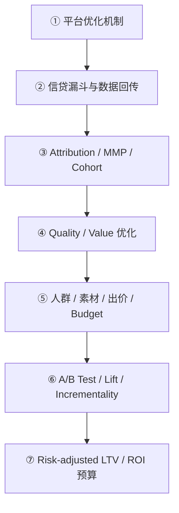

# 消费信贷广告投放优化：从平台算法到 Risk-adjusted LTV / ROI 的完整学习路径

> 适用对象：已经具备消费信贷、风险模型或经营分析背景，但尚未系统做过广告投放优化的人。  
> 学习目标：不是只会看 CTR、CPA 和调预算，而是能够建立“广告平台—转化回传—用户质量—因果评估—风险收益—预算分配”的完整闭环。  
> 示例说明：文中的数字均为教学用假设数据，不代表任何真实业务水平。

---

## 一、先理解整条链路



这条学习链路，本质上是在依次回答 7 个问题：

| 阶段 | 要回答的核心问题 | 最终产出 |
|---|---|---|
| ① 平台机制 | 平台为什么把广告展示给这个人？ | 能解释优化目标、竞价、学习期和信号质量 |
| ② 漏斗与回传 | 平台带来的用户，最后走到了信贷流程哪一步？ | 漏斗指标树、事件字典、回传链路和质量监控 |
| ③ 归因与 Cohort | 这笔转化应该算给谁？不同批次用户质量如何？ | 三方对账、归因口径、成熟 Cohort 报告 |
| ④ Quality / Value | 什么样的转化才是真正有价值的转化？ | 质量事件、价值标签、回传 value |
| ⑤ 四大优化杠杆 | 具体应该改人群、素材、出价还是预算？ | 可执行的诊断与优化动作 |
| ⑥ 因果实验 | 指标变好真的是广告造成的吗？ | A/B Test、Lift Test、增量成本与增量收益 |
| ⑦ 风险收益预算 | 下一块钱应该投到哪里？ | Risk-adjusted LTV、边际 ROI 和预算方案 |

**补充：为什么七个阶段按这个顺序排列**

链条的前四步是"信号工程"：② 把事件生产出来并回传（数据生产），③ 为已记录的事件定记账口径（数据加工），④ 把信号从数量升级为价值（信号升级）；后三步才是"动手—验证—决策"：⑤ 在正确信号下操作，⑥ 验证操作效果，⑦ 按利润分配预算。

两个局部顺序的原因：② 必须在 ③ 之前——归因是给"已发生的转化"记账的规则，若漏斗未打通、事件未回传，归因规则再精细也是垃圾进、垃圾出（先有凭证，再谈分摊）；④ 必须在 ⑤ 之前——平台只优化你回传的目标，先把"追求什么"从申请量升级为价值信号，再动手调人群/素材/出价/预算，否则只是在错误目标下做精细优化；且 ⑤ 中的 tROAS、Max Conversion Value 出价方式本身就依赖 ④ 提供的差异化 value。

### 三个容易混淆、但必须分开的概念

| 概念 | 回答的问题 | 典型方法 |
|---|---|---|
| Attribution（归因） | 某个已发生的转化，按规则记给哪个渠道？ | Last click、view-through、MMP 归因 |
| Incrementality（增量） | 如果不投广告，这个转化是否仍会发生？ | 随机 Holdout、Conversion Lift、Geo Test |
| Profitability（收益） | 广告带来的增量业务，扣除风险和成本后是否赚钱？ | Risk-adjusted LTV、增量 ROI、边际 ROI |

归因不等于因果，平台 ROAS 也不等于真实利润。最终预算必须同时参考归因、增量和风险收益。

**补充：ROAS 是什么、三个口径数字的大小关系**

ROAS（Return on Ad Spend，广告支出回报率）= 广告带来的转化收入 ÷ 广告花费，回答"每花 1 元广告费带回多少毛收入"。它与 ROI 的区别：ROAS 分子是毛收入、只扣媒体费；ROI 是净利润口径、扣全部成本，所以 ROAS 高不代表赚钱。

"平台 ROAS ≠ 真实利润"有三层原因：① 归因口径——平台 ROAS 的转化是归因口径，含"不投广告也会发生"的非增量转化；② value 口径——分子是回传的 value，若把放款本金当收入会严重失真（本金是借出的钱，不是赚的钱）；③ 成本口径——ROAS 只扣媒体费，不扣资金成本、信用损失、催收成本等信贷特有成本。

归因转化数、增量转化数、风险调整利润三个数字依次收紧：归因转化 ≥ 增量转化（先扣掉非增量部分）；风险调整利润 = 增量价值 − 各项风险成本 − 媒体花费，是净额、可能为负，而不是"收入"。

---

## 二、阶段 ①：理解广告平台到底怎么优化

### 1. 本阶段要解决什么

理解广告平台并不是“帮你找最多点击的人”，而是在给定目标、预算、出价和约束后，预测每一次展示的结果，并在竞价中选择预期价值更高的机会。

平台内部算法是黑箱，但可以把核心逻辑抽象为：

```text
一次展示的预期价值 ≈ 预估行动概率 × 转化价值 × 出价/目标约束 × 广告质量修正
```

这不是任何平台的精确公开公式，但足以用于业务判断。这个预期价值由平台计算，广告主无法直接查看或设定：广告主只能提供"原料"——出价/目标约束、素材（影响预估行动率与质量分）、回传信号（影响转化价值与平台对广告的转化预估）；预估行动概率与质量修正均是平台模型的输出。

### 2. 必须掌握的知识

#### 2.1 广告账户的基本层级

- Campaign：定义业务目标、预算方式、地域等大方向。
- Ad set / Ad group：定义人群、版位、出价和优化事件。
- Ad / Creative：具体图片、视频、标题、文案和落地页。
- Conversion event：平台真正被要求寻找的结果，例如申请提交、审批通过或放款。

你需要能回答：一个指标变化，到底应该在哪一层定位和调整。

#### 2.2 竞价与广告交付

需要理解：

- Auction：多个广告竞争同一次展示机会。
- Bid：愿意为目标结果支付多少，或希望达到什么 CPA / ROAS。
- Predicted action rate：平台预测用户完成目标动作的概率。
- Ad quality：素材体验、负反馈、相关性等质量信号。
- Pacing：平台如何在一天或整个周期内花完预算。
- Saturation：预算增加后，优质流量逐渐耗尽，边际成本上升。

#### 2.3 常见优化目标与出价方式

| 方式 | 平台倾向寻找什么 | 适合阶段 | 主要风险 |
|---|---|---|---|
| CPM / Reach | 便宜展示 | 品牌曝光 | 与信贷转化较远 |
| CPC / Traffic | 容易点击的人 | 冷启动、落地页测试 | 可能带来低意向点击 |
| Max Conversions | 尽量多的目标事件 | 已有稳定转化回传 | 只追数量，不区分价值 |
| tCPA | 在目标成本附近获得转化 | 转化量较稳定 | 目标过紧会限制交付 |
| Max Conversion Value | 最大化总转化价值 | 已能回传差异化 value | value 错误会放大偏差 |
| tROAS | 在目标回报约束下最大化价值 | 价值回传稳定且量足够 | 延迟、稀疏和价值漂移会影响学习 |

#### 2.4 学习期与信号质量

平台需要反复观察“什么样的人最终发生了目标事件”。需要掌握：

- 事件量：事件太少，模型难以区分人群。
- 事件延迟：申请实时发生，但放款或逾期可能数天至数月后才知道。
- 事件稳定性：定义频繁变化，平台学到的目标会漂移。
- 事件可区分性：所有事件 value 都相同，就无法做价值排序。
- 大幅频繁修改：可能让交付重新探索，短期波动变大。

不要机械套用某个平台的固定“最低转化数”。真正应该检查的是：事件是否足够多、延迟是否稳定、标签是否与长期利润同向。

### 3. 信贷示例：优化“申请”与优化“优质申请”的区别

假设两类用户：

| 用户类型 | 申请概率 | 放款概率 | DPD30 | 单个申请预期价值 |
|---|---:|---:|---:|---:|
| A：高意向、低质量 | 20% | 5% | 25% | AUD 4 |
| B：中意向、高质量 | 10% | 35% | 5% | AUD 22 |

如果目标是“申请提交”，平台可能偏向 A，因为其申请概率更高；如果回传的是“预测风险调整价值”，平台才有机会增加 B 的流量。

这就是后续所有阶段的主线：**平台只会优化你提供给它的目标，不会自动理解你的信贷利润。**

### 4. 本阶段实操任务

1. 选择一个真实广告平台，画出 Campaign—Ad set—Ad 的账户结构。
2. 找出当前账户的优化事件、归因窗口、出价方式和预算方式。
3. 任选 3 个 Campaign，解释平台当前“被要求寻找什么人”。
4. 设计一个简单模拟：申请率高但坏账高的人群，与申请率低但价值高的人群，比较不同目标下的结果。

### 5. 阶段产出与过关标准

应完成一页《平台优化机制说明》，并能够清楚回答：

- 为什么 CTR 上升，放款成本却可能变差？
- 为什么把目标从申请切到放款后，交付量可能突然下降？
- 为什么 tCPA 设得过低可能花不出去？
- 为什么预算扩大后平均 CPA 往往上升？
- 为什么平台学习目标必须从业务价值反推，而不是从容易回传的事件决定？

---

## 三、阶段 ②：搭建信贷转化漏斗与数据回传

### 1. 本阶段要解决什么

把广告点击与后端的申请、审批、放款、还款结果连起来，让每一笔投放都能追踪到最终业务结果，并能把适合的事件及时、准确地回传给广告平台。

### 2. 先建立标准信贷漏斗

建议至少覆盖：

```text
曝光 → 点击 → 落地页 → 开始申请 → 提交申请 → 身份/KYC完成
→ 银行数据连接 → 规则/模型初筛 → 审批通过 → 接受报价 → 放款
→ 首期正常还款 → DPD7/DPD30 → 结清/核销
```

不同产品可以删减，但事件命名和口径必须固定。

### 3. 必须掌握的漏斗指标

| 指标 | 公式 | 说明 |
|---|---|---|
| CPM | Spend ÷ Impressions × 1,000 | 千次曝光成本 |
| CTR | Clicks ÷ Impressions | 素材吸引力与流量相关性 |
| CPC | Spend ÷ Clicks | 单次点击成本 |
| Click-to-start CVR | Application starts ÷ Clicks | 点击后的申请意愿 |
| Completion rate | Submitted applications ÷ Starts | 申请流程完成率 |
| Approval rate | Approved ÷ Submitted | 进件与准入规则匹配程度 |
| Take-up rate | Accepted offers ÷ Approved | 报价竞争力与用户意愿 |
| Funding rate | Disbursed ÷ Submitted | 从申请到放款的整体效率 |
| CPA-submit | Spend ÷ Submitted | 每个提交申请成本 |
| CAC-funded | Spend ÷ Disbursed | 每个放款客户获客成本 |
| Cost per good loan | Spend ÷ 成熟后仍表现正常的放款数 | 同时考虑获客与资产质量 |
| DPD30 rate | 满足 DPD30 定义的账户 ÷ 已到观察期账户 | 必须明确分母和成熟期 |

不要单独写“CPA”。必须写清楚是 CPA-start、CPA-submit、CPA-approved 还是 CPA-funded。

### 4. 漏斗数字示例

假设某月：

| 环节 | 数量 | 环节转化率 | 累计成本 |
|---|---:|---:|---:|
| 曝光 | 5,000,000 | — | CPM = AUD 20.00 |
| 点击 | 100,000 | CTR = 2.0% | CPC = AUD 1.00 |
| 开始申请 | 20,000 | 20.0% | CPA-start = AUD 5.00 |
| 提交申请 | 12,000 | 60.0% | CPA-submit = AUD 8.33 |
| 审批通过 | 4,800 | 40.0% | CPA-approved = AUD 20.83 |
| 放款 | 3,600 | 75.0%（相对审批） | CAC-funded = AUD 27.78 |
| 首期正常还款 | 3,240 | 90.0% | Cost per first-pay-good = AUD 30.86 |

总花费为 AUD 100,000。这个例子说明：即使 CPC 和 CPA-submit 很漂亮，真正的 CAC-funded 仍可能因为审批率或接受率下降而恶化。

### 5. 事件字典：需要学会怎样设计

#### 5.1 推荐事件

| 事件 | 触发时点 | 建议来源 | 主要用途 |
|---|---|---|---|
| `landing_view` | 落地页有效加载 | Web / App | 落地页到达率 |
| `application_started` | 开始填写核心字段 | 前端 | 申请意愿 |
| `application_submitted` | 后端成功生成申请 | 后端 | 基础转化优化 |
| `identity_verified` | KYC 成功 | 后端 | 流程质量 |
| `bank_data_connected` | 银行数据成功拉取 | 后端 | 数据链路与服务能力 |
| `qualified_application` | 满足稳定的业务质量条件 | 后端 | 中层质量优化 |
| `application_approved` | 审批通过 | 决策系统 | 准入质量 |
| `offer_accepted` | 用户接受报价 | 核心业务系统 | 意愿与定价效果 |
| `loan_disbursed` | 放款成功 | 核心账务系统 | 深层转化优化 |
| `first_payment_on_time` | 首期按时还款 | 贷后系统 | 早期资产质量 |
| `dpd30_matured` | 到达观察期并形成 DPD30 标签 | 贷后系统 | 风险评估，不宜直接作为唯一实时目标 |

#### 5.2 每个事件至少要有的字段

| 字段 | 作用 |
|---|---|
| `event_id` | 全局唯一，用于幂等与去重 |
| `event_name` | 固定事件名称 |
| `event_time` | 业务真实发生时间，而不是上传时间 |
| `event_value` / `currency` | 差异化业务价值及币种 |
| `application_id` | 串联信贷申请 |
| 内部用户键 | 串联同一用户；对外传输前按合规要求处理 |
| MMP / 广告点击标识 | 连接媒体触点与后端事件 |
| `source` | SDK、Web、S2S 或批量回补 |
| `status` / `version` | 支持撤销、修正和口径升级 |
| consent / privacy 状态 | 判断是否允许处理和回传 |

### 6. 数据回传必须掌握的技术点

- Client-side 与 Server-to-server（S2S）的区别。
- Pixel / SDK / MMP / 广告平台 API 的分工。
- 点击标识、设备标识、内部用户键如何匹配。
- Event time 与 upload time 的区别。
- At-least-once 传输下的幂等和去重。
- 回传失败重试、死信、补数和状态修正。
- 时区、币种、事件名称和 value 版本管理。
- Web 与 App、Android 与 iOS 的统一口径。
- 隐私同意、数据最小化、保存期限和访问控制。

不得把银行流水、收入明细、拒绝原因、证件信息或受保护属性直接当作广告事件参数发送。用户标识是否可传、如何哈希、哪些业务信号可用于广告优化，都应由当地隐私、信贷合规及平台政策共同确认。

### 7. 回传质量监控

至少监控四类指标：

| 维度 | 指标示例 | 建议判断方式 |
|---|---|---|
| 覆盖率 | 已回传事件数 ÷ 后端真实事件数 | 按事件、平台、OS、日期拆分 |
| 时延 | upload_time - event_time | 看 P50 / P90 / P99，不只看平均值 |
| 一致性 | 金额、状态、事件时间一致率 | 与核心业务表逐日核对 |
| 唯一性 | 重复 event_id、重复业务事件率 | 设唯一键和重复告警 |

还要检查漏报、错配、重复、错误归因、回补后重复计算，以及事件定义变更造成的断点。

### 8. 本阶段实操任务

1. 画出当前产品的完整信贷漏斗。
2. 输出事件字典，明确每个事件的触发逻辑、系统来源、负责人和 SLA。
3. 建立广告平台、MMP、后端三方的日级对账表。
4. 设计回传监控看板，至少覆盖覆盖率、时延、一致性和重复率。
5. 用一条申请记录完整追踪：点击 → 申请 → 审批 → 放款 → 还款。

### 9. 阶段过关标准

- 能在 30 分钟内定位“平台申请数比后端多 20%”的主要可能原因。
- 能区分事件丢失、匹配失败、归因窗口差异、时区差异和重复回传。
- 能说明哪个事件适合报表分析，哪个事件适合直接作为平台优化目标。

---

## 四、阶段 ③：学习 Attribution / MMP / Cohort

### 1. 本阶段要解决什么

建立统一的渠道效果口径，知道每个数字是按什么规则产生的，并避免拿尚未成熟的信贷 Cohort 做错误比较。

### 2. Attribution 必须掌握什么

#### 2.1 常见归因规则

- Click-through attribution：用户点击广告后，在窗口内发生转化。
- View-through attribution：用户看过但未点击广告，之后发生转化。
- Last touch：最后一个满足条件的触点获得归因。
- First touch：第一个触点获得归因。
- Multi-touch：按规则或模型在多个触点间分配贡献。
- Re-engagement / Retargeting attribution：已安装或已有账户用户再次被广告激活。

#### 2.2 必须明确的归因参数

- 点击归因窗口和曝光归因窗口。
- 安装、注册、申请、放款分别按哪个时间字段统计。
- 时区与币种。
- 同一用户跨 Web / App、跨设备的合并逻辑。
- 新客、老客、重装、再归因的定义。
- Organic 的定义。
- 广告平台自归因网络与普通媒体的差异。
- 隐私框架下的聚合、建模和延迟回传。

### 3. MMP 要掌握什么

MMP 的核心作用是统一移动端归因与事件采集，但它不是“绝对真相”。需要掌握：

- SDK 初始化与首开归因。
- Attribution link、deep link、deferred deep link。
- Install、re-attribution、re-engagement 的区别。
- In-app event 与 S2S event。
- Postback：MMP 如何把事件发送给媒体。
- SAN / SRN：部分大型媒体自行完成归因计算。
- Raw data、聚合报表和隐私限制。
- Fraud：点击注入、点击洪水、异常设备和虚假事件。
- Customer User ID 与内部 application_id 的衔接。

### 4. 三方数字为什么不一致

| 数据源 | 更适合回答什么 | 常见偏差来源 |
|---|---|---|
| 广告平台 | 平台认为自己带来了多少结果 | 自身归因窗口、view-through、建模转化 |
| MMP | 跨媒体采用相对统一规则后的归因 | SDK 覆盖、隐私限制、SAN 规则、重归因 |
| 后端系统 | 实际发生了多少申请、审批、放款和还款 | 缺少媒体触点、用户匹配失败、状态回补 |

正确做法不是强行让三者完全相等，而是建立稳定的差异解释表，并明确：

- 经营事实以核心后端系统为准。
- 媒体优化使用平台可接收且稳定的回传信号。
- 跨渠道对比使用统一归因和统一 Cohort 口径。

### 5. Cohort 必须掌握什么

Cohort 是把具有共同起点的一组用户放在一起，观察他们随时间的表现。信贷投放最常用的是 acquisition cohort 或 funded cohort。

#### 5.1 两种常见口径

- Acquisition Cohort：按点击、安装或申请发生日期分组，适合评估获客来源。
- Funded Cohort / Vintage：按放款月份分组，适合观察还款、逾期和利润表现。

#### 5.2 信贷 Cohort 的关键难点：成熟期

9 月 1 日获得的用户和 8 月 1 日获得的用户，不能在 9 月 6 日直接比较 DPD30，因为观察窗口不同。需要：

- 使用相同 MOB / DPD 观察窗口。
- 只比较已经成熟的 Cohort。
- 将实际已实现收益与预测剩余收益分开。
- 明确 right censoring（右截尾）问题。
- 固定坏账、核销和收入的定义版本。

#### 5.3 推荐 Cohort 表

| acquisition_week | media_source | campaign | D0_submit | D7_funded | D30_first_pay_good | D60_DPD30 | D90_risk_adjusted_value |
|---|---|---|---:|---:|---:|---:|---:|
| 2026-W30 | Meta | Broad_A | … | … | … | … | … |

### 6. 信贷示例：便宜申请不一定是好渠道

| 指标 | 渠道 A | 渠道 B |
|---|---:|---:|
| Spend | AUD 40,000 | AUD 40,000 |
| Submitted | 5,000 | 3,200 |
| CPA-submit | AUD 8.00 | AUD 12.50 |
| Funded | 1,800 | 1,600 |
| CAC-funded | AUD 22.22 | AUD 25.00 |
| 成熟 DPD30 | 12% | 5% |
| 每个 funded 的风险调整贡献 | AUD 45 | AUD 80 |
| 风险调整贡献总额 | AUD 81,000 | AUD 128,000 |
| 风险调整 ROI | 102.5% | 220.0% |

如果只看 CPA-submit，会选择 A；加入成熟风险和价值后，B 明显更优。

### 7. 建议掌握的 SQL 分析能力

```sql
-- 示意：按申请周和渠道观察成熟后的放款与 DPD30
WITH base AS (
    SELECT
        application_id,
        DATE_TRUNC('week', application_time) AS acquisition_week,
        media_source,
        campaign_id,
        MAX(CASE WHEN disbursed_flag = 1 THEN 1 ELSE 0 END) AS funded_flag,
        MAX(CASE WHEN dpd30_matured_flag = 1 THEN 1 ELSE 0 END) AS dpd30_matured_flag,
        MAX(CASE WHEN dpd30_flag = 1 THEN 1 ELSE 0 END) AS dpd30_flag,
        MAX(risk_adjusted_value) AS risk_adjusted_value
    FROM marketing_credit_joined
    GROUP BY 1, 2, 3, 4
)
SELECT
    acquisition_week,
    media_source,
    campaign_id,
    COUNT(*) AS applications,
    SUM(funded_flag) AS funded,
    SUM(CASE WHEN dpd30_matured_flag = 1 THEN dpd30_flag ELSE 0 END)
        / NULLIF(SUM(dpd30_matured_flag), 0) AS matured_dpd30_rate,
    SUM(risk_adjusted_value) AS total_risk_adjusted_value
FROM base
GROUP BY 1, 2, 3;
```

真实使用时还要处理用户去重、多申请、跨渠道触点、状态快照、数据回补及分母成熟条件。

### 8. 本阶段实操任务与过关标准

实操任务：

1. 用同一日期范围导出广告平台、MMP 和后端数据。
2. 按 media source / campaign / date 做三方差异桥接。
3. 建立 D0、D7、D30、D60、D90 Cohort 表。
4. 找出一个“CPA 好但 DPD 差”的渠道或人群，并解释原因。

过关标准：看到任意渠道报表时，先主动问清楚归因窗口、分母、事件时间和 Cohort 成熟度，而不是直接比较数字。

---

## 五、阶段 ④：从 CPA 优化升级到 Quality / Value 优化

### 1. 本阶段要解决什么

把“获得更多申请”升级为“获得更多高质量、可放款、能产生风险调整利润的申请”。这是信贷投放与普通电商投放最大的差异之一。

### 2. 学会设计质量信号阶梯

| 信号 | 延迟 | 数量 | 与最终利润的相关性 | 典型用途 |
|---|---:|---:|---:|---|
| Application submitted | 分钟级 | 高 | 低至中 | 冷启动、基础转化 |
| Qualified application | 小时级 | 中高 | 中 | 早期质量优化 |
| Approved | 小时至天级 | 中 | 中高 | 准入质量优化 |
| Funded | 天级 | 中低 | 高 | 深层转化优化 |
| First payment on time | 数周 | 低 | 更高 | 评估或训练早期价值模型 |
| Matured DPD / loss | 数月 | 低 | 高 | 最终校准，不适合作为唯一实时信号 |

选择平台目标时，需要在三件事之间平衡：

1. 事件量足够，平台能够学习。
2. 回传足够快，优化不会长期滞后。
3. 与最终风险调整利润足够相关。

### 3. Quality 优化需要掌握什么

- Qualified application 的业务定义：不能每天变化，也不能只复制当前审批规则。
- Approval / funding 概率模型与校准。
- Early risk proxy：用早期行为预测后续逾期，但需持续用成熟表现校准。
- Good funded loan：明确好客户的观察期与坏客户定义。
- Event hierarchy：浅层事件用于保量，深层事件用于提质。
- Guardrail：申请量、审批率、放款量、DPD、客诉与合规指标同时监控。

### 4. Value 优化需要掌握什么

对每个申请计算一个“广告发生后、但不扣媒体费”的预期业务价值：

```text
Expected pre-marketing value
= P(funded | 当前可用信息)
 × [PV(利息及合规费用)
    - PV(资金成本)
    - Expected Credit Loss
    - 欺诈损失
    - 可变运营、支付与催收成本]
```

其中：

```text
Expected Credit Loss ≈ PD × LGD × EAD
```

- PD：违约概率。
- LGD：违约后损失比例。
- EAD：违约时风险暴露。

注意：放款本金不是收入。不能把 disbursed amount 直接当成 conversion value 或 revenue。

### 5. 平台 value 的设计原则

- 使用事件发生当时可获得的信息，避免未来信息泄漏。
- value 与最终利润应保持单调关系：value 越高，长期平均利润应越高。
- 定期校准预测值与成熟实际值。
- 不把媒体成本包含进单用户回传 value，避免目标循环依赖。
- 当平台不适合接收负值时，可用 `max(0, predicted_value)`、分档值或单调变换；精确利润仍保留在内部数仓。
- 避免少量极端大值支配平台学习，可按业务合理范围截尾或分桶。
- value 口径更新必须版本化，并监控新旧版本分布。
- 不向广告平台传输敏感原始信贷字段或受保护属性。

### 6. Value 示例

| 申请 | P(funded) | 预期利息/费用 | 资金与运营成本 | ECL + 欺诈损失 | 预期 value |
|---|---:|---:|---:|---:|---:|
| X | 50% | AUD 200 | AUD 40 | AUD 80 | AUD 40.00 |
| Y | 35% | AUD 300 | AUD 50 | AUD 30 | AUD 77.00 |

计算：

- X：`50% × (200 - 40 - 80) = 40`
- Y：`35% × (300 - 50 - 30) = 77`

Y 的放款概率更低，但风险调整后的预期贡献更高。如果只优化 funded 数量，可能偏向 X；如果优化 value，则可能更合理地提高 Y 的竞价权重。

### 7. 从 CPA 到 Value 的迁移顺序

建议分阶段迁移：

1. 确保 application / approved / funded 事件准确。
2. 先回传一个稳定的 `qualified_application`。
3. 在内部验证 quality score 与成熟利润、DPD 的单调性。
4. 将预测 value 作为只观察、不参与出价的字段运行一段时间。
5. 小流量实验 Value-based bidding。
6. 对照 CPA、funded、DPD、增量 value 和预算消耗。
7. 稳定后再逐步扩大，不一次性切换所有 Campaign。

### 8. 本阶段实操任务与过关标准

实操任务：

1. 为所有可选优化事件制作“数量—延迟—价值相关性”矩阵。
2. 定义一个 `qualified_application`，并用成熟 Cohort 检验其 DPD 和利润区分度。
3. 构建简化版 expected value，并按十分位观察实际利润是否单调。
4. 写出从 application 优化迁移至 value 优化的灰度方案。

过关标准：能够回答“为什么不直接回传最终坏账”“为什么不只回传审批通过”“为什么 value 不能等于贷款本金”。

---

## 六、阶段 ⑤：人群 + 素材 + 出价 + Budget 优化

### 1. 本阶段要解决什么

把指标诊断翻译成具体操作，并知道四类杠杆之间的先后关系。建议先确认追踪和优化目标，再谈素材、人群、出价和预算，否则容易在错误数据上做精细优化。

### 2. 人群优化

需要掌握：

- Broad prospecting：让平台在较宽人群中自主学习。
- Seed / Lookalike：用成熟的 good funded 或高 value 用户做种子，而不是只用申请用户。
- Retargeting：对开始申请但未完成、已审批未接受等人群分层触达。
- Suppression / Exclusion：排除不应重复获客的现有客户、已完成申请者或不符合业务规则的人群。
- 新客与老客、获客与召回必须分开核算。
- 人群重叠、频次、规模和饱和度。
- 地域、设备、时间段差异。
- 合规约束：不得使用受保护属性或具有明显歧视风险的代理变量进行不当定向。

人群效果不能只看 CTR。至少要追踪到 approval、funding、成熟 DPD 和 value。

### 3. 素材优化

需要掌握一个基本素材矩阵：

```text
目标人群 × 用户痛点 × 核心卖点 × 表达形式 × Hook × CTA
```

信贷素材可以测试的方向：

| 方向 | 合规、准确的表达示例 | 需要观察的后端指标 |
|---|---|---|
| 流程便捷 | “查看是否符合条件，流程约 2 分钟” | click-to-start、completion |
| 价格透明 | “接受前查看预计还款安排” | approval-to-accept、客诉 |
| 灵活用途 | 用真实适用场景解释产品 | 申请率、用途分布、风险表现 |
| 信任与安全 | 说明数据用途和隐私保护 | 银行数据连接率、流失率 |
| 预筛选 | 清楚说明基础条件，减少无效申请 | approval rate、qualified rate |

“保证通过”“零成本”“立即到账”等表述只有在完全真实且符合当地法律、平台政策和产品条款时才可使用。素材提升点击的同时，不能通过模糊关键信息制造低质量申请。

建议同时评估：

- Hook rate / 视频前段留存。
- CTR、CPC。
- 落地页到达率。
- Application CVR。
- Approval / funded rate。
- 成熟风险和 value。
- 负反馈、投诉及合规审核结果。

### 4. 出价优化

| 现状 | 更适合的方向 | 原因 |
|---|---|---|
| 事件少、链路未稳定 | Max conversions 或较浅事件 | 先建立足够学习信号 |
| 事件稳定、目标成本清晰 | tCPA | 控制目标事件成本 |
| value 已稳定且有差异 | Max conversion value | 在预算内追求总价值 |
| value 稳定且需要回报约束 | tROAS | 在回报目标下分配出价 |

常见错误：

- 目标 CPA 低于当前可实现水平太多，导致花不出去。
- value 数据尚不稳定就切 tROAS。
- 同时修改出价、素材、人群和预算，无法解释结果。
- 只用 1—2 天波动判断策略失败。
- 忽略转化延迟，数据尚未回全就下结论。

### 5. Budget 优化

需要从“平均效果”升级到“边际效果”：

- Average ROI：历史全部花费平均赚了多少。
- Marginal ROI：下一笔新增预算预计能赚多少。

预算扩张时，平均 CPA 很好不代表下一笔预算仍然好。应建立 spend tier 或响应曲线，观察预算从 10k → 20k → 30k 时边际 funded、边际 value 和边际风险如何变化。

可使用一个起始组合，但不能当成固定规则：

- 约 70%：已验证的稳定 Campaign。
- 约 20%：有希望、正在扩量的 Campaign。
- 约 10%：新素材、新人群和新优化目标探索。

比例应随业务成熟度、风险偏好和实验需求调整。

### 6. 指标异常的诊断顺序

| 现象 | 优先排查 | 可能动作 |
|---|---|---|
| 花不出去 | 目标过紧、人群过小、素材质量、事件量 | 放宽目标、扩大人群、补充素材、合并碎片 Campaign |
| CTR 下降 | 素材疲劳、Hook、受众不匹配 | 换首帧/卖点/格式，控制频次 |
| 点击多但申请少 | 落地页、加载、信息不一致、低意向点击 | 优化落地页，校准素材承诺 |
| 申请多但审批低 | 流量资格不匹配、预筛选不足、政策变化 | 调整人群/素材条件表达，检查准入变更 |
| 审批高但接受低 | 价格、额度、期限、流程体验 | 优化报价呈现与后续触达 |
| 放款多但风险差 | 目标过浅、渠道/素材引入低质量用户 | 切更深质量目标，优化 seed 与 value |
| 平台好但后端差 | 归因口径、重复、建模转化、成熟期 | 三方对账并做增量实验 |

### 7. 一个 Campaign 决策示例

| Campaign | CPA-submit | CAC-funded | 成熟 DPD30 | Value / funded | 判断 | 动作 |
|---|---:|---:|---:|---:|---|---|
| Broad_A | 低 | 中 | 低 | 高 | 可扩量 | 小步增加预算并看边际 ROI |
| LAL_Applicant | 很低 | 高 | 高 | 低 | 种子目标过浅 | 改用 good-funded / high-value seed |
| Video_Convenience | 低 | 中 | 偏高 | 中低 | 可能过度吸引低质量需求 | 优化条件表达并做素材实验 |
| Search_HighIntent | 高 | 低 | 低 | 高 | 申请贵但最终优质 | 保留并测试 tROAS / value |

### 8. 日常与周度优化节奏

每日：

- 检查花费、回传、异常波动和重大故障。
- 只处理需要及时止损的问题，不因小波动频繁改动。

每周：

- 分渠道 / Campaign / 素材查看完整漏斗。
- 检查转化延迟后的回补情况。
- 更新素材疲劳、人群饱和和边际成本判断。
- 形成“观察—假设—动作—预期—验证时间”的记录。

每月或按成熟期：

- 回看成熟风险、LTV 与预测校准。
- 调整 value 模型、预算组合和实验优先级。

### 9. 阶段过关标准

面对一个异常指标，能够先定位漏斗环节，再判断应该动哪一个杠杆，并提前写出预期影响和风险 Guardrail，而不是直接“降预算”或“换素材”。

---

## 七、阶段 ⑥：A/B Test / Conversion Lift / Incrementality

### 1. 本阶段要解决什么

判断指标变化是不是由投放动作造成，而不是季节性、审批策略变化、渠道抢功、用户自然转化或随机波动造成。

### 2. A/B Test 必须掌握什么

- Hypothesis：明确改变什么，以及为什么会影响哪一指标。
- Randomization unit：按用户、设备、地域或 Campaign 随机。
- Control / Treatment：除测试变量外尽量保持一致。
- Primary metric：只能有清晰的主要指标。
- Guardrail metrics：防止主指标提高但风险、投诉或利润恶化。
- MDE：业务值得检测的最小变化。
- Power 与 sample size：避免样本太小。
- Test duration：覆盖完整业务周期和回传延迟。
- Pre-registration：测试前固定口径，避免看完结果再换指标。
- Multiple testing：同时测试过多版本会增加假阳性。

比例指标的粗略样本量公式：

```text
每组样本量 ≈ 2 × (Zα/2 + Zβ)² × p × (1-p) ÷ δ²
```

例如基线转化率为 20%，希望检测 2 个百分点的绝对提升，在双侧 95% 置信水平、80% power 下，每组约需要 6,300 个样本。正式实验建议使用可靠的 power calculator，并结合聚类、重复用户和转化延迟修正。

### 3. 三类实验怎么区分

| 方法 | 适合回答什么 | 典型设计 |
|---|---|---|
| A/B Test | 新素材、新页面、新出价是否更好？ | 用户或流量随机分组 |
| Conversion Lift | 广告是否带来额外转化？ | 可投放组 vs 随机 Holdout |
| Geo / Incrementality Test | 无法做用户级随机时，渠道是否有增量？ | 匹配地域、分阶段投放、差分方法 |

平台 Campaign Experiment 适合比较两个投放设置；Conversion Lift 更接近“投与不投”的因果问题。二者不要混用。

### 4. 增量指标

```text
Incremental conversions
= Treatment conversions
- Control conversions × (Treatment population / Control population)

Lift rate
= Incremental conversions / Scaled control conversions

Incremental CAC
= Incremental ad spend / Incremental funded loans

Incremental ROI
= (Incremental risk-adjusted value - Incremental spend)
   / Incremental spend
```

### 5. Conversion Lift 示例

| 组别 | 人数 | Funded |
|---|---:|---:|
| Treatment | 100,000 | 2,300 |
| Holdout | 100,000 | 2,000 |

- 增量 funded：`2,300 - 2,000 = 300`
- Lift：`300 ÷ 2,000 = 15%`
- 广告花费：AUD 30,000
- Incremental CAC-funded：`30,000 ÷ 300 = AUD 100`
- 若每个增量 funded 的风险调整贡献为 AUD 140，则增量 value 为 AUD 42,000。
- Incremental ROI：`(42,000 - 30,000) ÷ 30,000 = 40%`

平台可能归因了 2,300 个 funded，但真正由广告额外创造的只有 300 个。预算决策应更重视这 300 个的成本和价值。

### 6. 信贷实验的特殊要求

- 随机化发生在广告触达或产品体验层，不得为了实验任意改变合规审批标准。
- 主指标可以是 funded 或 risk-adjusted value；DPD、投诉、接受率等作为 Guardrail。
- 贷后指标成熟慢，测试结束后仍要等待风险观察窗口。
- 测试期间记录审批策略、定价、产品资格、节假日和资金供给变化。
- 防止同一用户跨设备进入不同组。
- Retargeting 实验尤其需要排除自然会转化的高意向用户影响。

### 7. 标准实验卡模板

```markdown
## 实验名称

- 业务问题：
- 假设：
- 唯一测试变量：
- Randomization unit：
- Control：
- Treatment：
- Primary metric：
- Guardrail metrics：
- Baseline / MDE / Power：
- 样本量与预计周期：
- 归因与成熟窗口：
- 停止规则：
- 数据异常处理：
- 决策标准：扩大 / 继续 / 停止：
```

### 8. 本阶段实操任务与过关标准

实操任务：

1. 设计一个素材 A/B Test。
2. 设计一个“投放 vs Holdout”的 Conversion Lift Test。
3. 同时写出 primary metric、Guardrail、MDE、样本量和成熟窗口。
4. 用历史数据模拟 attributed ROI 与 incremental ROI 的差异。

过关标准：任何“效果提升”结论，都能说明对照组是谁、随机化单位是什么、样本是否足够、风险指标是否成熟。

---

## 八、阶段 ⑦：用 Risk-adjusted LTV / ROI 驱动最终预算

### 1. 本阶段要解决什么

把营销、审批、风险、资金成本和贷后收益放到同一经济口径中，按“下一块预算带来的增量风险调整利润”分配资源。

### 2. 必须掌握的利润瀑布

```text
利息及合规费用收入
- 资金成本
- Expected Credit Loss / 实际信用损失
- 欺诈损失
- 支付、服务、客服与催收等可变成本
= Pre-marketing contribution

Pre-marketing contribution
- Acquisition spend
= Risk-adjusted profit
```

收入、损失与成本要按同一 Cohort、同一时间窗口和同一折现口径计算。

### 3. Risk-adjusted LTV 核心公式

申请时点的简化估计：

```text
Risk-adjusted LTV_application
= P(funded | x)
 × [PV(利息及合规费用)
    - PV(资金成本)
    - ECL
    - 欺诈损失
    - 可变运营成本]
```

渠道或 Campaign 层：

```text
Risk-adjusted ROI
= (Σ Expected pre-marketing value - Media spend)
   / Media spend
```

有实验时优先计算：

```text
Incremental risk-adjusted ROI
= (Incremental value - Incremental spend)
   / Incremental spend
```

### 4. 需要掌握的高级概念

- Realized LTV 与 predicted residual LTV 分开。
- D0 / D7 的早期预测如何用 D90 / D180 成熟表现校准。
- 不同贷款期限的现金流折现。
- Vintage / MOB 曲线、还款曲线、提前结清与复借。
- PD / LGD / EAD 与定价、额度、期限的联动。
- Break-even CAC：每个客户最多能承受的获客成本。
- Payback period：累计贡献覆盖 CAC 需要多久。
- Uncertainty：给 LTV、坏账和 ROI 提供置信区间或上下界。
- Average ROI 与 marginal ROI 的区别。
- 预算约束：风险偏好、审批能力、资金容量、渠道集中度和合规约束。

### 5. 为什么必须看边际 ROI

某渠道过去花 AUD 100k 的平均 ROI 为 80%，不代表再增加 AUD 20k 仍有 80%。新增预算往往进入更贵、意向更弱的人群。

预算分配应近似解决：

```text
最大化：所有渠道预算档位的预计增量利润之和

约束：
- 总预算不超过上限
- 成熟 DPD / ECL 不超过风险偏好
- 资金、审核与运营容量不超限
- 渠道集中度满足要求
- 必要实验预算得到保留
```

### 6. 新增 AUD 10,000 的边际预算示例

| 渠道 | 预计增量 funded | 每个 funded 风险调整贡献 | 增量 value | 边际 ROI | 风险约束 | 决策 |
|---|---:|---:|---:|---:|---|---|
| Google High Intent | 80 | AUD 170 | AUD 13,600 | 36% | 通过 | 优先增加 |
| Meta Broad | 120 | AUD 110 | AUD 13,200 | 32% | 通过 | 第二优先 |
| Affiliate | 200 | AUD 55 | AUD 11,000 | 10% | DPD 超限 | 暂不增加 |

Affiliate 的增量 funded 最多，但风险不满足约束；Google 的数量最少，却带来最高的边际风险调整利润。

### 7. 预算评审表至少包含什么

| 维度 | 必看内容 |
|---|---|
| Scale | Spend、impressions、applications、funded |
| Efficiency | CPC、CPA-submit、CAC-funded |
| Quality | qualified rate、approval、take-up、成熟 DPD / loss |
| Value | value / application、value / funded、总 value |
| Causality | incremental funded、incremental value、iCAC |
| Economics | risk-adjusted ROI、payback、边际 ROI |
| Confidence | 样本量、成熟率、预测区间、数据质量 |
| Constraints | 风险偏好、资金容量、合规和渠道集中度 |

### 8. 标准预算动作

- Increase：边际增量 ROI 为正，风险与容量均通过。
- Hold：平均表现好，但新增预算的不确定性大或渠道接近饱和。
- Test：理论价值高但证据不足，分配受控实验预算。
- Reduce：边际 ROI 低于资金门槛，或成熟风险持续恶化。
- Stop：追踪失真、合规异常、风险越界或增量价值为负。

### 9. 阶段过关标准

能够写出一份预算建议，明确说明：增加哪个渠道、减少哪个渠道、依据的是平均还是边际表现、风险是否成熟、结论是否来自增量实验，以及预测错误时如何止损。

---

## 九、贯穿全链路的完整信贷案例

### 背景

某消费信贷产品当前以 `application_submitted` 为广告平台优化目标。过去一个月 CPA-submit 下降 18%，但审批率、放款率与 DPD30 均恶化。

### 分析步骤

#### Step 1：检查平台目标

发现平台被要求最大化申请提交，因此主动寻找“容易申请”的用户，而不是“最终能产生利润”的用户。

#### Step 2：检查回传链路

- `application_submitted` 覆盖率 99%，P90 时延 5 分钟。
- `application_approved` 覆盖率 91%，部分状态更新丢失。
- `loan_disbursed` 覆盖率 87%，存在重复回补。

结论：暂时不能直接切换 funded 优化，先修数据。

#### Step 3：做 Attribution 与 Cohort 对账

发现平台包含 view-through 与 modeled conversions，MMP 使用不同窗口；内部报表按申请时间，平台按转化上报时间。统一口径后，差距从 22% 降至 7%。

#### Step 4：定义 Quality / Value

建立小时级 `qualified_application`：

- 当前可用字段完整。
- 通过基础身份与欺诈检查。
- 预测放款概率和风险调整价值超过稳定阈值。

同时计算预测 value，并用 D90 成熟 Cohort 校准。

#### Step 5：调整四大杠杆

- 人群：Lookalike seed 从所有 applicant 改为成熟 good-funded / high-value 用户。
- 素材：减少只强调速度的素材，增加资格条件与价格透明表达。
- 出价：先测试 qualified tCPA，再灰度测试 value optimization。
- Budget：保留对照组，不同时大改所有 Campaign。

#### Step 6：做因果实验

对 20% 符合条件人群设置 Holdout，测量 incremental funded 和 incremental value；等待风险指标成熟后再做最终判断。

#### Step 7：重新分配预算

按边际 incremental risk-adjusted ROI 排序；对高 CPA 但高 value 的 Search 保留并扩量，对低 CPA 但低质量的部分社媒 Campaign 降预算，对尚未验证的新 Value Campaign 保留实验预算。

### 最终应形成的管理层结论

> CPA 的下降主要来自更低质量的申请，并未转化为风险调整利润增长。下一阶段将以 qualified / predicted value 作为早期优化信号，以成熟 DPD 和增量 Risk-adjusted ROI 做最终校准，并按边际收益重新分配预算。

---

## 十、10 周学习与实战计划

建议每周投入 6—8 小时，最好直接使用脱敏后的真实数据完成练习。

| 周次 | 学习重点 | 实操任务 | 必须交付 |
|---|---|---|---|
| 第 1 周 | 平台层级、竞价、优化目标、学习期 | 拆解 3 个现有 Campaign | 平台机制一页纸 |
| 第 2 周 | 信贷漏斗、指标口径 | 画完整漏斗并计算各层 CVR / CPA | 漏斗指标树 |
| 第 3 周 | Pixel / SDK / S2S、事件设计、数据质量 | 建事件字典与回传监控 | Event spec + QA 看板 |
| 第 4 周 | Attribution、MMP、三方差异 | 完成平台 / MMP / 后端对账 | Attribution bridge |
| 第 5 周 | Cohort、Vintage、成熟窗口 | 建 D0—D90 渠道 Cohort | 成熟质量报告 |
| 第 6 周 | Quality label、value 设计 | 构建 qualified 与简化 value | Value 十分位校准表 |
| 第 7 周 | 人群、素材、出价、Budget | 为 5 个 Campaign 制定优化动作 | 周度优化清单 |
| 第 8 周 | A/B Test、Lift、MDE、样本量 | 写两份实验卡 | Test design |
| 第 9 周 | LTV、ECL、ROI、边际收益 | 建渠道利润瀑布和预算档位 | Budget allocator |
| 第 10 周 | 综合项目 | 完成端到端案例复盘 | 管理层决策稿 |

### 推荐的学习比例

- 20%：平台概念和官方文档。
- 30%：数据链路、归因与 Cohort。
- 25%：Quality / Value 与信贷经济学。
- 15%：实验和因果推断。
- 10%：账户实际操作。

对于已有信贷背景的人，真正的增量重点应放在：**平台如何学习、如何把信贷结果变成可学习信号、如何做增量评估，以及如何用边际 ROI 分预算。**

---

## 十一、建议完成的 7 个作品

学完后不要只保留笔记，至少完成以下作品：

1. 《广告平台优化机制一页纸》
2. 《消费信贷投放漏斗与指标字典》
3. 《广告事件回传字段表与质量监控》
4. 《平台—MMP—后端三方归因对账》
5. 《渠道 Cohort 与成熟资产质量报告》
6. 《Quality / Value 优化实验方案》
7. 《Risk-adjusted LTV 与边际预算分配表》

这 7 个作品可以直接组成一套完整的信贷投放优化项目。

---

## 十二、常见错误清单

- 只看 CPA-submit，不看 funded、成熟风险和利润。
- 用“CPA”一个词指代多个不同漏斗事件。
- 直接把贷款本金当收入或 conversion value。
- 回传深层事件，却不检查数量和延迟是否足够学习。
- 使用未来表现构造实时 value，形成标签泄漏。
- 平台、MMP 和后端口径不同，却直接横向比较。
- 用尚未成熟的新 Cohort 与成熟老 Cohort 比 DPD。
- 同时修改素材、人群、出价和预算，无法归因变化。
- 把平台归因转化全部当作增量转化。
- 按平均 ROI 扩量，不看下一档预算的边际 ROI。
- 忽视数据回补、重复、时区、币种和状态修正。
- 将敏感信贷信息、受保护属性或未经许可的用户数据发送给媒体。
- 只追求规模和收益，不设置风险、客诉与合规 Guardrail。

---

## 十三、官方资料学习入口

以下资料用于补充平台与工具操作。产品界面和规则会持续更新，实际工作时应以最新官方文档及公司合规要求为准。

### 广告平台优化与 Value-based bidding

- [Google Ads：App Campaign 最佳实践](https://support.google.com/google-ads/answer/14104492?hl=en)
- [Google Ads：Value-based bidding 最佳实践](https://support.google.com/google-ads/answer/14792795?hl=en-GB)
- [Google Ads：用 Campaign Experiment 测试 Value-based bidding](https://support.google.com/google-ads/answer/14147337?hl=en-GB)

阅读重点：优化目标、事件量与延迟、tCPA 与 tROAS 的适用条件，以及为什么测试时只改变一个主要变量。

### 数据回传

- [Meta：Conversions API 概览](https://www.facebook.com/business/help/AboutConversionsAPI)
- [Meta：Pixel 与 Conversions API 事件去重](https://www.facebook.com/business/help/823677331451951)
- [Google Ads：Enhanced conversions for leads](https://support.google.com/google-ads/answer/15713840?hl=en)
- [AppsFlyer：Mobile S2S Events API](https://support.appsflyer.com/hc/en-us/articles/207034486-Server-to-server-events-API-for-mobile-S2S-mobile)

阅读重点：S2S、用户与点击匹配、event time、去重、回补、隐私与诊断。

### Attribution / MMP / Cohort

- [AppsFlyer：Attribution model](https://support.appsflyer.com/hc/en-us/articles/207447053-AppsFlyer-attribution-model)
- [AppsFlyer：In-app events 概览](https://support.appsflyer.com/hc/en-us/articles/115005544169-In-app-events-Overview)
- [AppsFlyer：Cohort and retention dashboard](https://support.appsflyer.com/hc/en-us/articles/207040496-Cohort-and-retention-dashboard)
- [Google Analytics：Cohort exploration](https://support.google.com/analytics/answer/9670133?hl=en)

阅读重点：归因窗口、Install / re-engagement、S2S event、Cohort 维度和生命周期表现。

### Conversion Lift / Incrementality

- [Meta：Conversion Lift 概览](https://www.facebook.com/business/help/221353413010930)
- [Meta：Lift 与 Holdout](https://www.facebook.com/business/help/552097218528551)
- [Meta：Conversion Lift 结果解读](https://www.facebook.com/business/help/2943790779140325)

阅读重点：随机 Holdout、增量转化、置信区间，以及归因结果与 Lift 结果为什么不同。

### 实验与因果推断补充读物

- *Trustworthy Online Controlled Experiments*：系统学习线上 A/B Test。
- *Causal Inference: The Mixtape*：学习因果推断、实验与准实验。
- *Causal Inference for the Brave and True*：适合结合代码练习。

---

## 十四、最终能力自测

如果以下问题都能独立回答并用数据证明，说明已经完成这条学习链路：

- 平台当前究竟在优化什么人、什么事件？
- 从曝光到成熟还款，哪一层漏斗正在损失最多？
- 平台、MMP 与后端为什么不一致，经营口径以谁为准？
- 当前 Cohort 是否已经成熟，可以比较 DPD 和 LTV 吗？
- 哪个早期质量信号最适合回传，为什么？
- value 如何计算，是否排除了本金和媒体成本？
- 指标异常应该先改人群、素材、出价还是预算？
- 报表里的转化有多少是真正增量？
- 每个增量 funded 的风险调整成本和价值是多少？
- 下一块预算投向哪里，依据的是平均 ROI 还是边际 ROI？

真正完成学习的标志，不是会操作某个广告后台，而是能把下面这句话变成稳定的数据和决策系统：

> 用准确、及时且合规的信贷价值信号训练广告平台；用成熟 Cohort 和因果实验验证真实增量；最终按边际 Risk-adjusted LTV / ROI 分配预算。
