# 为什么同样是投流，有人赚钱有人亏？——**聊聊投放这件事**

本文是「流量与风控」合集的第一篇，尝试把“投放到底是什么”这件事讲清楚。

主要聊三件事：**投放的本质是什么，投放关注什么，以及怎么才能做得更好。**

### 一、什么是投放？

“什么是投放”听起来像是一个不需要回答的问题——投放不就是花钱买流量吗？在抖音投广告、在Google投关键词、在Facebook投信息流，把钱花出去，把人带进来。

这个理解不能算错，但太浅了。

如果投放只是“花钱买流量”，那为什么同样的预算、同样的平台，有人越投越赚钱，有人越投越亏？为什么有些团队花100万能带来200万的价值，有些团队花100万只拿回80万？

**根本区别在于：前者把投放当成“系统”在运营，后者把投放当成“动作”在执行。**

投放本质上解决的是三个问题：**谁（目标客群）、在哪（渠道）、怎么触达（素材+出价）**

精准是手段，获取是动作，而真正的目的：**在可持续的成本内，获取能产生正向收益的用户。**

所以，如果让我用一句话定义投放：

> **投放的本质 = 如何更精准地获取能产生可持续正向收益的目标客群。**

**对于信贷的投放，我会把这句话再往前推一步：**

> **信贷投放的目标 = 在风控约束下，以可控成本精准获取“能通过审核、愿意借款、按时还款、持续复借”的用户。**

### 二、投放关注什么指标？怎么算？

投放的指标很多，但不需要全部记住。按照“从浅到深”的层次，可以分成三层：

* **第一层：前端效率指标** ——流量进得顺不顺
* **第二层：后端效果指标** ——钱花得值不值
* **第三层：经营健康度指标** ——体系是否良性

此外，**信贷投放**还必须在前后端指标之外，增加 **风控相关指标** ——这是信贷投放区别于其他投放最核心的地方。

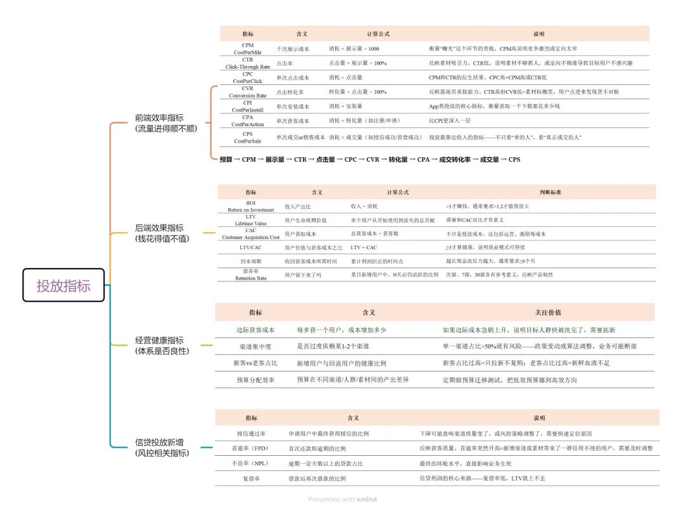

### 三、投放做的到底是什么？

投放的日常工作可以拆解为六个模块：

* **预算分配：** 预算是“分散下注”还是“集中押注”？
* **渠道选择：** 在对的地方出现。选择“流量精准但贵”还是“流量便宜但不那么精准”？
* **人群定向：** 找对的人。定向越精准，量越少、价越高；定向越宽，量越大、价越低但质量波动也越大。
* **素材创意：** 说对的话。同一套素材在不同渠道效果完全不一样，需要针对性适配。
* **出价策略：** 在对的时机出现。出价低了跑不动，出价高了亏本，找到平衡点就是投手的核心价值。
* **数据复盘与迭代：** 数据不是用来看的，是用来指导下一步行动的。

这六个模块不是孤立的，而是一个 **循环** ：

> 预算分配 → 渠道选择 → 人群定向 → 素材创意 → 出价策略 → 数据复盘 → 调整预算分配 → ……

**每跑完一轮，你手上的信息就比上一轮更多、更准，下一轮的决策质量就更高。**

### 四、如何更好地做投放？

理解本质和指标之后，最后落到那个最实际的问题：**怎么才能做得更好？**

* **目标要对，把“目的”和“手段”分清楚**

投放的最终目的是 **在可控成本内获取能产生正向收益的用户** ，而不是把某个指标做得漂亮。目标设错了，后面做得再好也是白费。

* **账要算细，把每一分钱的流向都搞清楚**

“大概还行”、“差不多”是投放的大忌。算不清账就不知道钱花在哪、花得值不值、下一步该往哪走。

* **拆解要细，大盘是幻觉，拆解才是真相**

同一个渠道拆到广告系列级别，同一套素材拆到人群包级别。拆得越细，真相越清晰。不拆解，你看到的一切都是平均数，而平均数最容易骗人。

* **测试要勤，把**A/B测试**变成工作习惯**

投放没有标准答案——别人跑得好的素材，你拿来不一定跑得动；昨天有效的策略，今天可能就失效了。唯一可靠的方法，是持续测试。

* **归因要准，功劳是谁的？如何优化？**

用户可能看了你的Facebook广告、又点了你的Google搜索广告、最后直接搜索下载了App——这个用户算谁的？归因不准，后续所有决策都可能被误导。

## 写在最后

投放不是花钱买流量——**是在用预算和数据，买入有价值的用户资产。**

信贷投放，从来不是追求“量大”，而是追求  **“精准识别”** ：

> **识别谁需要你，识别谁能借，识别谁会还，识别谁值钱。**

流量只是入口，真正的价值在于：**你带进来的这个人，在他的生命周期里，到底能贡献多少。**

信贷投放的四大渠道：Google、Facebook、TikTok、应用商店怎么选？怎么配？
聊完投放的本质和指标，接下来自然要回答一个更实际的问题：预算到底该往哪投？

Google、Facebook、TikTok 以及应用商店，是目前出海信贷投放的四大主战场。它们之间不是简单的“哪个更好”的关系，而是各自扮演着完全不同的角色。

一、Google Ads：最精准的“需求拦截”
核心逻辑：人找信息

用户在搜索框里输入关键词的那一刻，意图已经非常明确。Google 搜索广告的转化链路是所有渠道里最短的——用户主动搜索“loan”“cash”时，已经处在决策的最后一环。

从搜索到下载、付费、使用行为，Google 能看到完整的用户行为链条，模型能预测 LTV 和 ROAS。

信贷场景下的定位：
最适合做 “收割” ——当用户搜索“快速贷款”“印尼现金贷”时，Google 广告是拦截这些高意向流量的最佳工具。

二、Facebook/Meta Ads：最精准的“人群圈选”
核心逻辑：信息找人

如果说 Google 是“人找信息”，那 Facebook 就是“信息找人”——用户在刷动态、看视频，你通过精准定向把广告推到他面前。

通过类似受众（LAL）、兴趣包等方法，基于用户的兴趣、行为、社交关系做精准圈人。创意质量直接决定广告成败，一个好素材甚至可以“拉爆”一个广告系列。

信贷场景下的定位：
Facebook 是海外 APP 投放的稳量核心渠道。适合在用户还没有明确借款需求时，通过社交场景建立品牌认知。

三、TikTok Ads：最低成本的“兴趣引爆”
核心逻辑：算法推荐 + 内容种草

用户在刷短视频时被你的内容吸引，从“不知道”到“被种草”可能只需要 3 秒。爆发力极强——单个素材一旦命中算法，安装量可能在极短时间内指数级增长，低预算即可撬动海量曝光。

信贷场景下的定位：
海外 APP 投放的爆发拉新渠道，核心触达年轻增量用户。

需要注意：TikTok 投放效果起伏较大，单个素材的黄金投放周期只有几天，需要持续不断地产出大量素材。此外，TikTok 点击归因周期只有 1 天，对长周期转化的信贷产品来说，归因难度较大。

四、应用商店（ASA / Google Play）：最高质量的“精准流量”
核心逻辑：意图截获

应用商店投放与其他三个渠道有本质区别——用户已经打开了应用商店，意图已经非常明确：我要下载一个 APP。

ASO（应用商店优化）：通过优化标题、关键词、图标、截图等提升自然搜索排名，是一种“低成本获客”手段，效应是累积的。

ASA（Apple Search Ads）：仅限 iOS 生态，覆盖 App Store 搜索和推荐位，用户质量高、转化率高。

信贷场景下的定位：
最适合 “补量”和“精准获客” 。如果信贷产品的目标客群偏高端，ASA 是绕不开的渠道。

补充说明：Google Play 的投放逻辑与 Google Ads UAC 有重叠，实际投放中建议统一规划，避免内部竞争。

五、一张图看懂四大渠道的差异
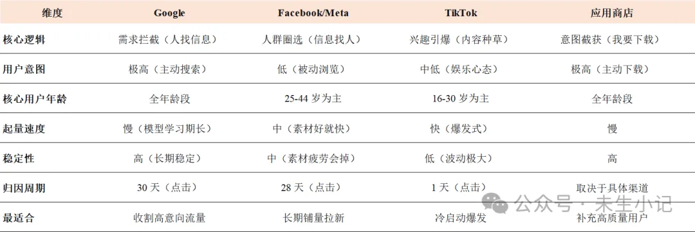
六、信贷投放的特殊考量
信贷投放选择渠道时，有几个特殊问题需要额外注意

1. 合规风险是第一道坎

金融类广告在海外属于“高敏感”类别。Google、Facebook、TikTok 对金融广告的审核政策各不相同，开户前务必搞清楚每个平台的政策要求。

以 Google 为例，金融广告有三条红线：年化利率（APR）、还款期限、产品透明度。任何一条踩线，都可能面临封户风险。

2. 归因周期与信贷回款周期不匹配

TikTok 的归因周期只有 1 天，但信贷产品的回款周期可能是 7 天、14 天甚至 30 天。这意味着 TikTok 带来的用户质量，可能需要一个月后才能准确评估。

3. 用户质量 vs 用户数量

Facebook 早期拉量快，但用户留存和 LTV 通常不如 Google。信贷投放的核心是 “找能还钱的人”而不是“找愿意借钱的人” ——渠道选择时要优先考虑用户质量，而非单纯的获客成本。

4. 多渠道投放的数据衔接

三个渠道的归因逻辑和周期不同，需要建立统一的归因框架（如 AppsFlyer）来评估各渠道的真实贡献，避免重复计算或漏算。

七、小结
没有哪个渠道是“最好”的，关键是 在正确的时候、用正确的渠道、达成正确的目标。

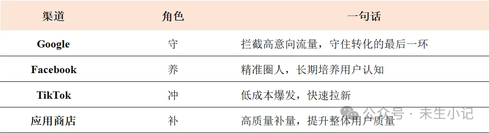
一个成熟的信贷投放组合：

主力：Google + Facebook（占 70-80%）

创新测试：TikTok（10-15%）

补充：应用商店（10-15%）

剩余预算：用于探索新渠道

附录：ROAS 是什么？
ROAS = Return On Advertising Spend，中文叫广告支出回报率。

衡量的是：每花一块钱广告费，能直接赚回多少钱的营收。

计算公式：

ROAS = 广告带来的收入 ÷ 广告花费 × 100%

ROAS vs ROI（千万别搞混）
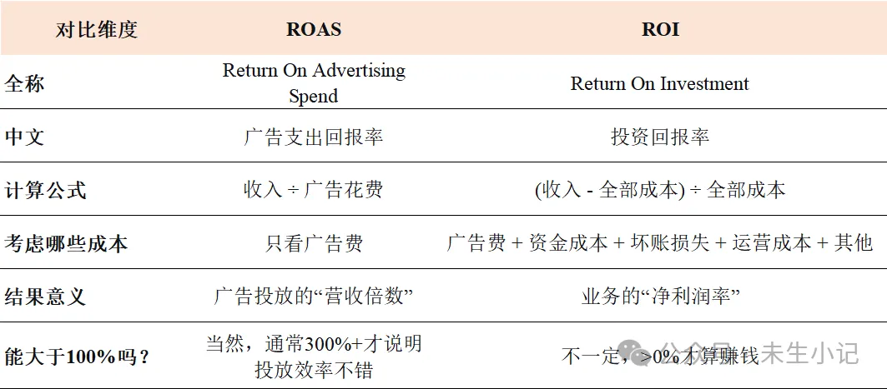
核心结论：ROAS 高 ≠ 一定赚钱。ROAS 是广告侧的效率指标，ROI 才是业务侧的生死指标。信贷投放尤其要关注长期 ROAS（D30、D90、D180），把时间拉长到回款周期结束，才能真正判断一个渠道值不值得继续投入。

信贷投放的核心逻辑之一： 不是看今天花出去的钱今天能回来多少，而是跟踪这个用户在未来3个月、6个月里累计贡献的收入，计算“长期 ROAS”（本质就是 LTV / CAC 的另一种表达方式）。

预算与节奏：钱要花在“值”的地方
前两篇我们聊了投放的本质、指标体系，以及四大渠道怎么选、怎么配。这一篇，我们把视角从“投什么”转向“怎么投”？预算怎么定？节奏怎么控？钱怎么花才算“值”？
钱怎么花？什么时候花？花多少？
这不是简单的“预算分配”，而是投放的节奏控制。预算花得太慢，量起不来，市场被竞品抢占；花得太快，成本失控，ROI被打穿。

预算是投放节奏的方向盘——花在哪儿、花多少、什么时候花，决定了投放这辆车是平稳行驶还是冲出赛道。

这篇文章，我们把预算与节奏的核心逻辑拆开来看：买量线怎么定？边际CPS怎么算？预算节奏怎么把控？

一、预算目标：先算账，再花钱

1. 算清盈亏线：LTV 是预算的起点
   投放预算不是拍脑袋定的——它由业务端反推而来。

预算 = 目标放款量 × CPS

预算的上限，取决于你能接受的获客成本。而获客成本的底线，由用户的生命周期价值（LTV） 决定。

逻辑链条是这样的：

用户LTV → 可接受的CPS上限 → 可接受的CPA上限 → 反推各环节转化率要求 → 确定各渠道预算分配

举个例子：

一个新客的LTV = 500元（利息收入 − 资金成本 − 坏账损失 − 其他成本）

你要求投放端 LTV/CAC ≥ 3，即获客成本 ≤ 167元

如果当前授信通过率 = 20%、放款转化率 = 60%，那么当CPS = 167元时，CPA（发起借款的成本）= 167 × 20% × 60% = 20元

每个环节的成本都不能超过这个天花板，否则整体模型算不过账。

也就是说，每个环节的成本上限，都是由LTV倒推出来的——不是“能花多少花多少”，而是“花到能赚回来的程度”。

2. 三个关键的预算线

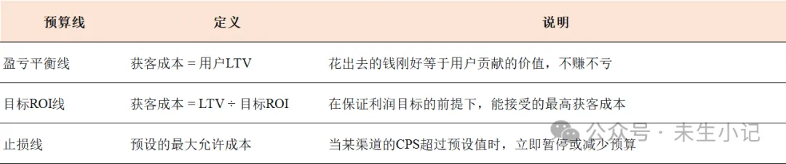
二、买量线：每获客一个放款用户，最多花多少钱不亏
买量线是预算管理中最重要的概念——它定义了：为了获取一个放款用户，你最多愿意花多少钱。

1. 买量线的核心逻辑
   理想情况：实际 CPS = 买量线，说明刚好达到成本预期

实际情况：实际 CPS < 买量线，说明可加大投放力度；实际 CPS > 买量线，说明需要优化或暂停

2. 买量线的计算公式
   买量线 = 用户LTV × 目标利润率系数

注：目标利润率系数取决于业务阶段。如果是扩张期，可以接受微亏换规模，系数可能 >1；如果是盈利期，系数 <1。

3. 简化的计算示例 (其它成本暂不考虑)
   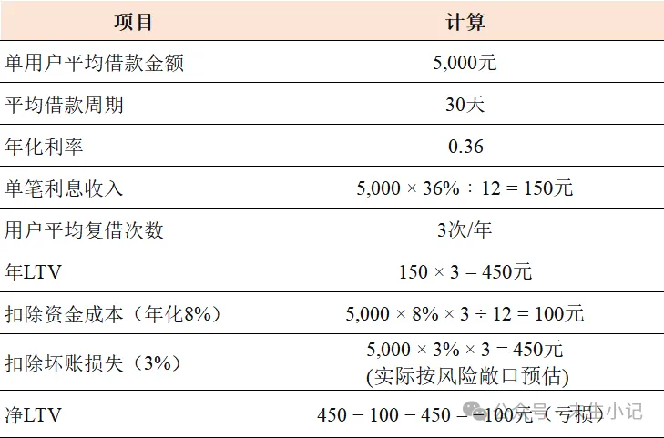
   简化例子说明：如果LTV算出来是负的，整个业务模型就不成立。要么提高利率/复借率，要么降低坏账率/资金成本，要么降低获客成本，否则投得越多亏得越多。

如果调整策略后，净LTV变成300元，且目标ROI为20%，那么：

最大可接受CPS = 300 ÷ (1+20%) = 250元

买量线就定在 250元。

三、边际CPS：新增用户到底值不值
预算管理不是“算总账”就完了——新增量的成本可能完全不同于存量。

1. 什么是边际CPS？
   边际CPS衡量的是：每多花一笔预算，每多获取一个放款用户，新增的成本是多少。
2. 计算示例
   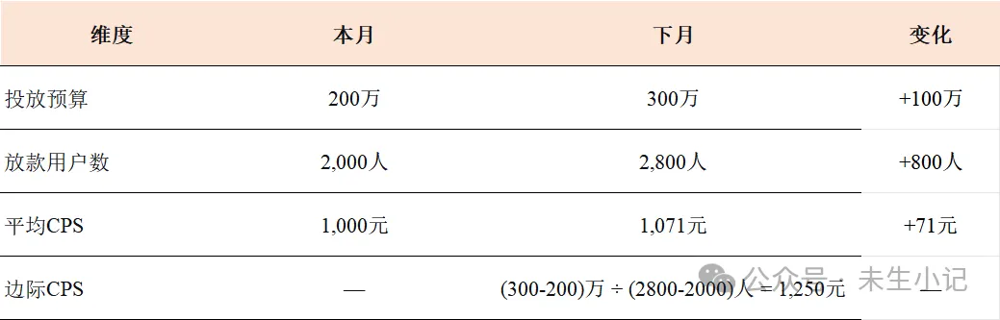
   解读

平均CPS从1,000元涨到1,071元，看起来涨幅不大

但边际CPS达到了1,250元——说明新增的800个用户，每个花了1,250元

如果买量线是1,100元，那这批新增用户就是亏钱的

3. 边际CPS的三种形态
   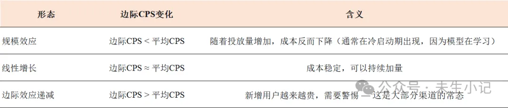
   四、预算节奏：什么时候花、花多少
4. 预算节奏的两个维度
   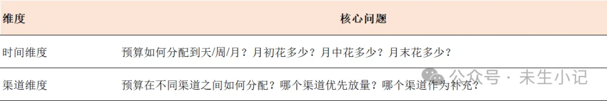
5. 预算节奏的常见误区
   预算平均分配：每天花一样的钱，忽略了用户行为的周期性

（如：周末/发薪日转化率不同）

预算一次性花完：月初狂烧，月中预算耗尽，错过了后续的优质流量

预算集中投单一渠道：渠道政策变化可能导致全盘崩掉

预算不设止损：某个渠道ROI下降却不暂停，持续亏损

3. 预算节奏的实操策略
   冷启动期：小预算测试、多方向探索，找到盈利渠道和素材方向

放量期：将预算集中到已验证的高ROI渠道和素材上

稳定期：主力渠道匀速放量，测试渠道保持15-20%的探索预算

收缩期：当市场成本普涨超过买量线时，缩减预算、只保留核心渠道

4. 预算节奏的“生命周期”管理
   任何一个渠道、一套素材，都有自己的生命周期

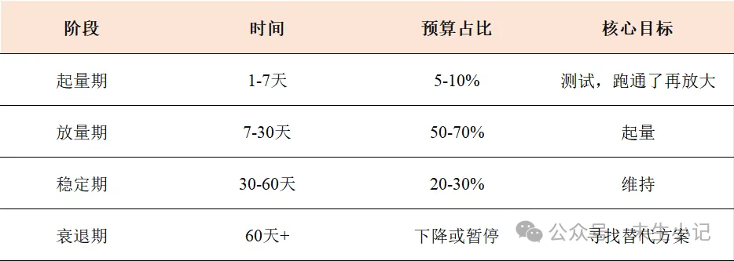
写在最后
预算和节奏管理，表面是控成本，本质是提效率
花钱之前先算账——这笔钱花出去，能赚回来多少？低于买量线，大胆投；高于买量线，果断停。

出价高不一定赢？广告竞价的底层逻辑
投放不是在“买流量”，而是在“竞拍用户注意力”。
这一篇，我们把视角拉到最底层：广告竞价到底是怎么运作的？“竞拍”到底怎么拍？出价最高就一定赢吗？赢了之后付多少钱？为什么同样的出价，在Google和Facebook上效果完全不同？

一、主流的出价方式：CPM、CPC、CPA、oCPX
在竞价之前，广告主首先需要选择以什么方式出价。这是广告主主动选择的策略，决定了“你愿意为什么样的结果付费”。

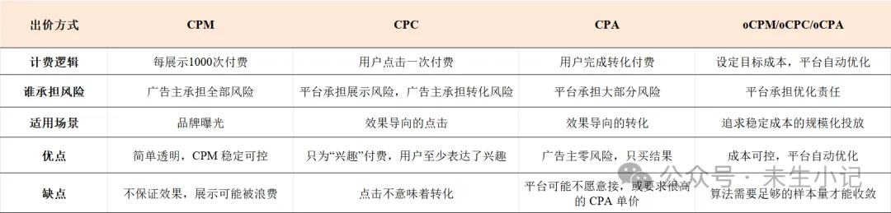
oCPX 的本质是：广告主表达“我想要什么成本”，平台用算法去实现这个成本目标。

 在 oCPX 模式下的 eCPM 计算会动态调整：平台会尝试不同的出价组合，找到既能达成广告主目标成本、又能最大化自身 eCPM 的平衡点。

二、eCPM：平台的“通用货币”

1. eCPM 解决了什么问题？
   理解了出价方式，下一个问题是：广告主用不同方式出价（有人出 CPM，有人出 CPC，有人出 CPA），平台怎么放在一起排序？

这就需要引入 eCPM（Effective CPM，有效千次展示成本）。

互联网广告早期的交易非常简单：媒体卖广告位，广告主买广告位，按展示次数付费。这就是 CPM。一个固定的价格，买 1000 次展示，付 1000 次的钱。

问题在于：同样的广告位，不同的广告带来的价值完全不同。

一个卖奢侈品的广告和一个卖快消品的广告，放在同一个位置，点击率可能差 10 倍，转化率可能差 20 倍。如果按同样的 CPM 收费，媒体觉得亏了（好广告应该收更贵），广告主也觉得亏了（差广告凭什么收一样的钱）。

于是行业开始思考：能不能让价格“浮动”？让好广告付更多钱，差广告付更少钱？

这就是 eCPM 的由来——不是“你愿意付多少”，而是 “平台实际能赚多少”。

2. eCPM 的公式逻辑
   eCPM = 出价 × 预估点击率（pCTR）× 预估转化率（pCVR）× 1000

这个公式的核心思想是：平台不关心你“想”付多少钱，平台关心的是“每次展示能帮我赚多少钱”。

出价：你愿意为一次点击/转化付多少钱

pCTR：平台预估用户看到广告后点击的概率

pCVR：平台预估用户点击后完成转化（下载/注册/借款）的概率

这次展示，我能赚多少？ 你出价 1 元，预估点 10%，预估转 20% → eCPM = 20 元。

3. 为什么 eCPM 是“通用货币”？
   因为无论你在哪个平台投放，无论你用什么出价方式，最终所有广告都要被转换成 eCPM 来参与排序。

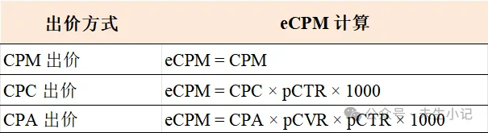
CPM 和 eCPM 的区别在于：CPM 是你“愿意付”的价格，eCPM 是平台“实际能赚”的价格——后者才是平台真正关心的。

谁的广告能给平台带来最高的 eCPM，谁的广告就能赢得展示机会。你不是在和“人”竞争，你是在和“数据”竞争。

这意味着：出价低不一定输，出价高不一定赢。如果你的素材点击率高、落地页转化好，即使出价低于竞争对手，你的 eCPM 仍可能更高——这就是“以小博大”的空间。

eCPM 只是平台的“算账逻辑”

真正决定谁赢、谁付多少钱的，是每个平台自己设计的竞价规则。

三、主流的竞价机制：平台如何决定“谁赢、付多少”

1. 出价方式 vs 竞价机制
   出价方式（CPM/CPC/CPA）是“广告主怎么报价”，而竞价机制是“平台怎么定输赢、怎么收费”。

两者是完全不同的概念——前者是广告主的策略选择，后者是平台的规则设计。

任何一个广告竞价机制，都需要回答两个核心问题：

问题一：谁赢？ —— 在众多 competing 广告中，如何决定哪个广告获得展示？

问题二：付多少？ —— 赢家需要支付多少钱？

这两个问题的答案，决定了平台的收入、广告主的成本、以及整个生态的效率和公平性。

2. 主流竞价机制一览
   当前主流的广告竞价机制主要有三种：GSP、VCG和GFP

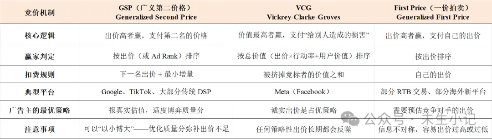
三种机制的本质区别是扣费规则：

GSP：付“下一名”的价格（出价高的人不用付自己的最高价）

VCG：付“给别人造成的损害”

GFP：付自己的出价

四、Google：GSP + Ad Rank，价格优先，质量为辅

1. 为什么 Google 选择了 GSP？
   Google 的核心业务是搜索。用户带着明确意图来到搜索框，广告是“对搜索结果的补充”——广告越相关，用户越满意。

GSP 的逻辑天然契合搜索场景：

出价高的人赢，但质量得分可以帮你“打折”

质量得分衡量的是广告与搜索词的相关性

相关性越高，用户越满意，Google 的长期价值越大

2. Ad Rank：Google 的排名公式
   Google 的排名并不仅仅只看价格，而是看 Ad Rank（广告评级）。

Ad Rank = 出价 × 质量得分 + 广告附加信息影响

质量得分 基于三个核心因素：预估点击率、广告相关性、落地页体验。

实际扣费逻辑：

实际 CPC = 下一名的 Ad Rank ÷ 你的质量得分 + $0.01

这意味着：即使竞争对手出价更高，只要你的质量分足够高，你仍可能以更低出价赢得更好位置。优化质量分比单纯加价更可持续。

3. GSP 的工程优势
   GSP 计算简单、系统负载低，适合处理 Google 每秒数百万次的搜索广告请求。在工业界，“够用且好用”往往比“理论上最优”更重要。

五、Meta：VCG，用户体验优先的“个性化拍卖”

1. 为什么 Meta 选择了 VCG？
   Meta 的核心业务是社交。用户在刷信息流，广告是“内容流的一部分”——广告如果太“硬”，用户直接划走，甚至屏蔽。Meta 的核心逻辑是：让广告看起来不像广告，而像内容。

Meta 的 VCG 逻辑天然契合社交场景：

它不仅把广告和广告放在一起排名，还把广告和“所有其他可能出现在用户信息流里的内容”放在一起排名

“用户价值”直接体现在排名公式中

总价值 = 广告主出价 × 预估行动率 + 用户价值

其中“用户价值”包括点赞、评论、分享等正向反馈，以及屏蔽、投诉等负向反馈。用户不喜欢你的广告，即使出价再高，也拿不到好位置。

2. 激励兼容：诚实出价是占优策略
   VCG 最核心的理论优势是 “激励兼容”（Incentive Compatibility） ——诚实出价是每个广告主的占优策略（Dominant Strategy）。

这意味着：不要试图“玩弄”出价策略。任何偏离真实估值的出价，长期都会损害自身利益。与其花时间琢磨如何“骗过”算法，不如把精力放在提高广告质量和用户价值上。

六、Google vs Meta：两种机制的关键对比
选择不同的竞价机制，本质在于两家公司的商业模式完全不同——Google 的用户带着明确意图来搜索，广告越相关越好；Meta 的用户在刷社交内容，广告如果太“硬”或太“泛”，用户会直接划走甚至屏蔽。

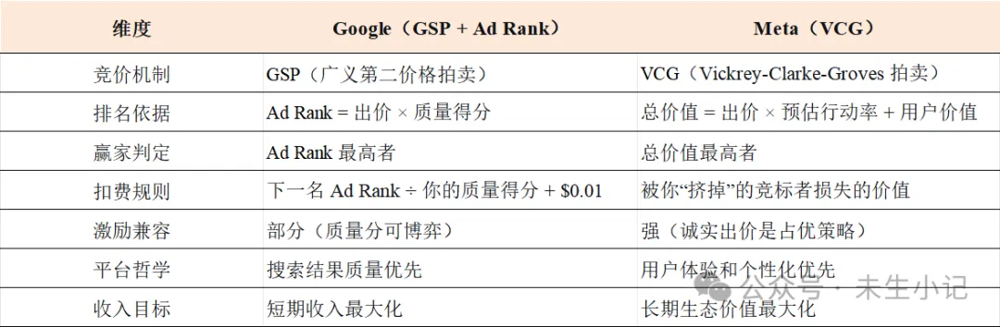
差异化的投放策略
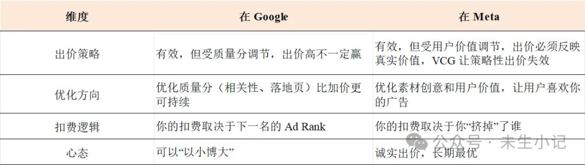
总结：Google 的 GSP 是 “价格优先、质量为辅” ——出价高的人赢，但质量分可以帮你“打折”；Meta 的 VCG 是 “价值优先” ——谁能给用户创造更多价值谁赢，价格只是价值的一部分。

七、广告出价与计费方式示例
示例一：CPC 出价 + eCPM 排名（通用场景）
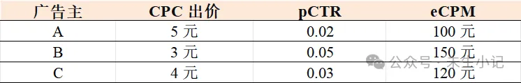
B 出价最低（3元），但 eCPM 最高（150元），排名第一。

结论：出价低不一定输，点击率可以弥补出价的不足。

示例二：CPM 出价 + GSP（Google 场景）
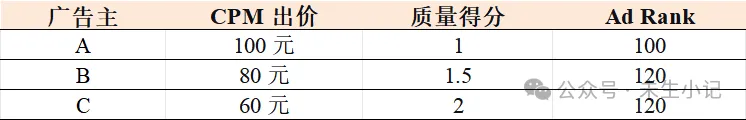
A 出价最高（100元），但质量分最低，Ad Rank 反而最低

B 和 C 的 Ad Rank 并列第一，但 B 出价更高，B 赢得展示

B 实际付：120 ÷ 1.5 + $0.01 = 80.01 元

结论：出价最高不一定赢，优化质量分可以“以小博大”。

示例三：Meta VCG 场景
假设三个广告主竞争同一个信息流广告位，平台计算出的“总价值”如下：

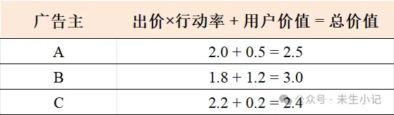
B 总价值最高，赢得展示

B 支付的是“他给 A 和 C 造成的损害”：4.9 − 3.0 = 1.9 元

结论：用户价值高可以弥补出价的不足，但支付价格可能高于自己的出价部分。

八、投放的启示

1. 在 Google：把优化质量分当作长期投资
   提高广告相关性：让广告文案与搜索词紧密匹配

优化落地页体验：加载速度、移动端适配、信息清晰度

善用广告附加信息：站点链接、标注、结构化摘要等

与其在竞价中不断加价，不如花时间优化质量分。 一个高质量分的广告，可以用更低的出价赢得更好的位置。

2. 在 Meta：诚实出价，专注内容质量
   不要试图“压价”或“虚报”——VCG 的激励兼容设计会让这种行为反噬

把精力放在素材创意和用户价值上——用户喜欢你的广告，平台就给你更低的成本

关注“用户价值”信号：点赞、评论、分享、屏蔽率——这些直接影响你的总价值得分

3. 跨平台投放：理解规则差异，制定差异化策略
   同一个出价策略，在 Google 和 Meta 上效果完全不同。不要用同一套出价逻辑打两个平台。

写在最后
广告竞价的底层逻辑，本质上就三句话：

1. eCPM 是平台算账的通用货币

理解 eCPM 的公式，你就知道优化点击率和转化率比单纯加价更划算。

2. Google — GSP 是“价格优先、质量为辅”

把精力花在优化相关性、落地页体验上，这是对抗高预算竞品最有效的武器。

3. Meta — VCG 是“价值优先”

诚实出价是最优策略，试图“玩弄”出价长期来看只会伤害自己。

理解这些，不是为了“玩弄”平台——而是在规则之内做最聪明的选择。

没有归因，投放就是浪费钱——归因（上篇）已付费
这一篇开始，我们进入一个更隐秘但更关键的领域——归因与回传。先讲归因：什么是归因？为什么必须做归因？归因在信贷场景下的特殊价值。
一、什么是归因？
归因要回答的问题是：这个转化（下载、注册、借款），到底应该算在哪个渠道、哪次广告的头上？

这个问题听起来简单，但在真实世界中极其复杂。

一个典型的信贷用户旅程可能是这样的：

周一在 Facebook 上刷到你的广告，没点；
周三在 TikTok 上又刷到一条，点进去看了看，没下载；
周五在 Google 搜索“现金贷”，点击了搜索广告，下载了 App，最终完成了借款。

这个借款，算谁的？

算 Facebook？它是用户第一次看到的地方。

算 TikTok？它是用户第一次点击的地方。

算 Google？它是用户最终下载的地方。

不同的答案，意味着完全不同的预算分配决策。

这就是归因要解决的问题。

二、没有归因，投放就是“盲打”
回到开篇那个问题：一个用户辗转三个渠道才完成转化——这次的转化功劳到底归谁？

如果你没有归因，答案就是：你永远不知道。

而“不知道”的代价，远比想象中沉重。

你每天在 Google、Facebook、TikTok 上花着几万、几十万的预算，换来一堆下载、一堆注册、一堆借款申请。

然后呢？

面对两个现实问题，你完全无法回答：

问题一：账算不清—哪个渠道真正在赚钱？
你看到 TikTok 的 CPI 最低，Facebook 的量最大，Google 的留存最高。但如果你把后端的还款数据拉回来：

TikTok 来的用户首逾率 35%

Facebook 来的用户首逾率 25%

Google 来的用户首逾率 15%

只看前端成本，TikTok 最便宜；看后端质量，Google 最值钱。

如果没有归因，你根本不知道这些借款、这些还款分别来自哪个渠道。

你只知道“总量”，不知道分渠道的真实 ROI。你甚至可能把大量预算持续砸在一个“看似便宜、实则亏钱”的渠道上，而真正赚钱的渠道因为没有数据支撑，迟迟拿不到更多预算。

问题二：优化没方向—出了问题，找不到原因
首逾率突然飙升，你翻遍后台也找不到答案。因为这些数据没有和渠道绑定。

你不知道是 TikTok 新素材带来的用户不行？还是 Facebook 某个人群包出了问题？还是 Google 的某个关键词精准度在下降？

你只能“凭感觉”猜，然后“凭运气”调整。

没有归因，你手上的数据是“无源之水”。看到波动，却不知道源头在哪。投放就变成了玄学。失去了整个投放体系赖以运转的根基。

三、归因的商业价值：让每一分钱都有“档案”
归因的本质，就是把 “转化”和“源头”绑定——让每一个下载、注册、借款，都能追溯到它来自哪个渠道、哪条广告、哪个关键词、哪个人群。

有了归因，你能做到三件事：

1. 真正算清楚 ROI

不只是“整体赚不赚钱”，而是“每个渠道赚不赚钱、每个素材赚不赚钱、每个人群赚不赚钱”。你甚至可以按渠道做 LTV 预测，知道哪个渠道来的用户 3 个月后贡献最大。

2. 精准调配预算

知道谁在赚钱，就把钱往那里集中；知道谁在亏钱，就果断停掉或优化。预算决策从“拍脑袋”变成“看数据”。

3. 让平台算法为你工作

把后端转化的数据（尤其是授信、放款、还款）回传给平台，让算法学习“什么样的人能还钱”，而不是学习“什么样的人会注册”。算法越接近你的真实目标，投放效率就越高。

四、一张表看懂：有归因 vs 没有归因

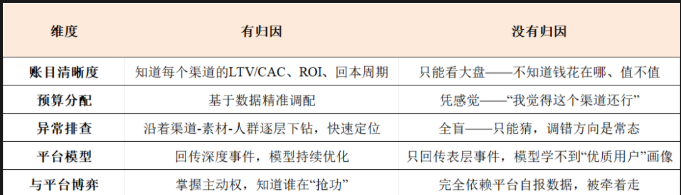

五、信贷场景下，归因的四大硬核价值
价值一：反欺诈—识别“假量”和“坏人”

没有归因，你只能看到“来了多少人”；有了归因，你能看到“这些人是怎么来的”。

如果某个渠道的点击量暴增，但后续的注册、申请转化率极低（甚至设备指纹大量重复），归因数据会直接暴露这种异常。

结合 IP、设备指纹、点击时间戳，系统能识别出机器刷量、点击农场等作弊手段。对于按 CPA/CPS 结算的信贷产品，这直接省的是真金白银。

同时，如果某个渠道带来的用户首逾率显著高于其他渠道（比如高出一倍），归因能帮你快速锁定“坏流量源”，在投放端直接拉黑或降低出价，从源头阻断欺诈用户进入风控漏斗。

价值二：打破数据孤岛—把投放、产品、风控、财务串起来

在很多公司，投放数据在投手手里，用户行为数据在产品/BI 手里，风控数据在风控团队手里，财务数据在财务手里—各部门各看各的数据，谁也说服不了谁。

归因是唯一能把这几块数据用“用户 ID”串联起来的工具：

投放 + 风控：知道这个用户是哪个渠道来的，首逾多少。

投放 + 财务：知道这个渠道花了多少钱，收回了多少利息。

投放 + 产品：知道哪个渠道的用户在哪个环节流失最多。

有了归因，所有部门看的是同一套数字——投放说“我带来了 1 万个注册”，风控说“这里面只有 2000 个能通过”，财务说“这 2000 个用户贡献了 50 万利息”。

价值三：算法优化的“燃料”—让模型学得更准

这一点容易被忽视：归因不只是用来算账的，它还是广告平台机器学习模型的 “训练标签”。

当你把归因后的深度事件（比如授信成功、放款成功、甚至还款正常）回传Google/Meta，平台就知道：“哦，这类用户才是广告主真正想要的。”

于是算法会学着去找“看起来像这些能还款用户”的相似人群。

回传的事件越深、越准，平台找人的精度就越高。归因的颗粒度决定了算法优化的天花板。

价值四：渠道议价的“底气”—不被平台牵着走

当媒体（尤其是大媒体如 Google、Meta）拿着它们自己的“自归因”数据告诉你“你看，我给你带来了这么多转化”时，当你只有平台的数据，那么只能被动接受。

如果你有一套独立于平台的 第三方归因（MMP）数据：

你可以跟平台对账：“你说你带来了 100 个转化，为什么我的归因系统只认领了 80 个？”

你可以做增量测试：“暂停你这个渠道一周，我的整体转化只掉了 5%，说明你夸大了自己的贡献。”

你有数据支撑去谈判返点、争取更宽松的归因窗口、或者要求平台提供更细颗粒度的数据回传。

有独立归因，你才不是“盲人摸象”，才不会被平台牵着走。

写在最后
归因不是“选配”，是 “标配”。

它是你投放的 导航仪：有了它，你才知道钱应该往哪花、花多少、什么时候停。

它是你平台的 驾驶舱：有了它，你才能看到完整的业务全景。

在信贷领域，它更是你 风控的第一道防线：不是等用户进来了再筛，而是在投放的那一刻就知道：哪些渠道值得深耕，哪些渠道要设防。

归因做得越扎实，你在投放上的账本越厚、子弹越准、底气越足。

# 归因的底层架构与隐私时代的归因——**归因（下篇）**

归因的底层架构与隐私时代的归因——归因（下篇）已付费
上一篇我们聊了为什么要做归因——没有归因，投放就是盲打。
这一篇，我们进入归因的底层架构：归因有哪些核心要素？有哪些归因模型？归因工具怎么选？归因瀑布如何运作？以及隐私时代归因该怎么做？
一、归因的核心要素
在深入具体模型之前，先理解归因系统的三个底层要素。

1. 归因窗口（Attribution Window）
   归因窗口是指从广告触点到转化发生，系统允许追溯的最大时间跨度。

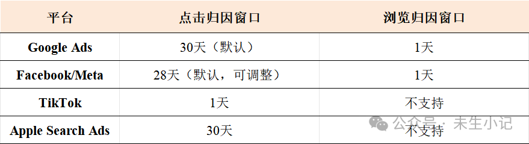
对信贷投放的意义：信贷产品的转化周期长，从点击广告到最终借款，可能间隔数天甚至数周。如果归因窗口过短（如TikTok），大量真实转化将无法被归因，渠道价值被严重低估。

窗口的本质是一道“时间沙盒”：系统会在内存中为每次广告交互设置一个过期销毁时间（TTL）。如果用户在点击广告后的第8天才下载App，而窗口期是7天，那么这次交互的记录早已被系统自动释放，该用户将被判定为“自然量”。

2. 归因触点（Attribution Touchpoint）
   触点是指用户与广告发生的每一次交互——包括曝光（Impression，看到但没点）和点击（Click，点了）。

归因系统需要决定：哪些触点应该被纳入考量？只算点击，还是连曝光也算？

通常的优先级是：点击 > 曝光。也就是说，如果同一个用户既有曝光又有点击，系统优先用点击来做归因。

3. 归因方法（Attribution Method）
   归因方法决定了用什么技术手段来匹配“广告触点”和“转化行为”。这是归因系统最底层的技术选择。

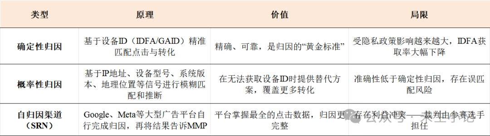

归因的优先级顺序是：确定性归因优先，仅在确定性归因不可用时才自动启用概率性归因。

二、归因模型的分类
理解了底层要素，再看归因模型——也就是 “功劳怎么分”的规则。

1. 单触点归因模型（Single-Touch Attribution）
   单触点模型将100%的转化功劳分配给用户旅程中的某一个触点。

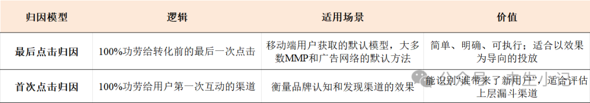
最后点击归因是当前行业的绝对主导。
它的优势在于简单、明确、可执行。广告主和媒体都清楚“最后一次点击是谁，钱就付给谁”。
2. 多触点归因模型（Multi-Touch Attribution, MTA）
多触点归因根据用户从发现到转化全过程中的多次触点，按权重分配转化贡献。

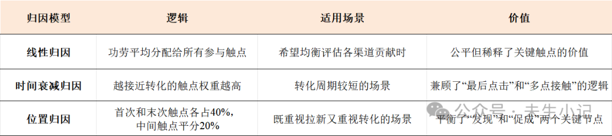
多触点归因能更全面地评估广告展示、搜索点击和再营销等行为对转化的合力影响。
但它也有明显局限：依赖于用户旅程的可见性，而隐私政策正在不断压缩精细化用户数据的获取空间。
3. 算法驱动归因（Data-Driven Attribution, DDA）
Google等平台提供的数据驱动归因，基于历史转化数据，用机器学习模型动态计算每个触点的贡献权重。

它不预设固定的分配规则，而是让数据“说话”——哪个渠道在历史转化中实际贡献更大，模型就给它更高的权重。

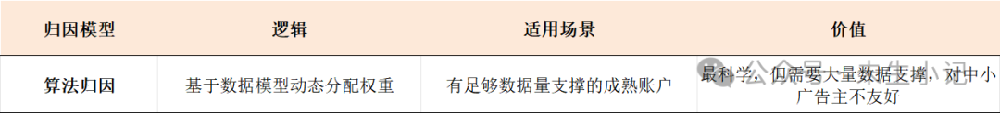
局限：需要足够的数据量支撑，对中小广告主不友好；且模型本身是“黑箱”，广告主难以验证其公平性。
三、归因的技术实现：谁来做？
归因不是广告主自己说了算的。在移动广告生态中，归因的技术实现主要有三种角色。

1. MMP（移动归因平台）
   MMP（Mobile Measurement Partner） 是独立的第三方归因工具，充当“裁判”的角色——中立地追踪和匹配点击与转化。

通过归因链接或SDK，追踪用户的点击、安装、激活等行为，再通过确定性归因（基于设备ID匹配）或概率性归因（基于IP、设备型号等信号推断）来匹配渠道来源。

MMP的核心价值在于独立、客观——广告主不用完全信任任何一个媒体平台自报的数据。

主流MMP的定位差异：

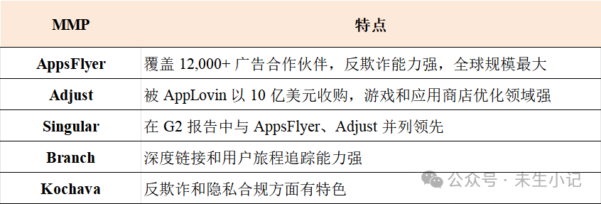
2. SRN（自归因渠道）
SRN（Self-Attributing Network） 是指自己完成归因、再把结果告诉MMP的大型广告平台。Google、Meta都是SRN。

这意味着：裁判的数据，有一部分来自参赛选手的“自报”。

当多个平台同时对一个转化进行自归因时，就会出现 “各算各账”的数据偏差：同一个真实用户，可能被Google、Facebook同时判定为自己的功劳，导致企业的整体激活数被膨胀数倍。

3. 归因瀑布（Attribution瀑布模型）
   归因瀑布是MMP内部的一套归因决策流。即，当一次转化可能匹配到多个广告触点时，MMP按照既定规则决定“功劳最终归谁”。

理解归因瀑布，需要先区分两个层面：

系统层面决定“有没有数据”，MMP层面决定“有数据的话怎么算”。

先看系统层面——它能提供什么信号，决定了归因瀑布的起点。

以iOS为例：

授权用户（IDFA可用）→ 确定性归因（IDFA匹配）→ MMP归因
未授权用户（IDFA不可用）→ SKAdNetwork聚合归因

再看MMP层面——在系统提供了数据之后，各MMP用自己的规则决定归因归属。不同MMP的归因瀑布略有差异：

以Adjust为例：精确归因（确定性）优先于概率模型。

以AppsFlyer为例：点击优先于展示，同时确定性匹配优先于概率匹配。

这意味着：即使用户先看到了TikTok的广告，后点击了Google的广告，只要Google的点击能被确定性匹配，功劳就归Google——而不是TikTok。

归因的优先级：直接归因 > 概率归因 > 聚合归因。

这也解释了为什么同一投放在媒体后台、第三方归因和内部BI中会出现数据差异——三套系统用的归因逻辑和数据源不同。

四、隐私时代的归因革命

1. iOS 14.5 与 ATT 框架
   2021年，Apple推出 AppTrackingTransparency（ATT）框架，要求App在访问设备广告标识符（IDFA）之前必须获得用户明确同意。

由于大多数用户选择退出，确定性归因的基石：设备ID大面积失效了。IDFA的获取率从接近100%骤降至20%-35%。

2. SKAdNetwork：Apple的“隐私优先”答案
   SKAdNetwork（SKAN） 是Apple为iOS应用广告开发的隐私保护归因框架。

SKAdNetwork对归因的根本改变：广告主不再拥有独立的中间机构来验证点击发生的确切时间，必须信任Apple（以及各广告平台）报告的数据。

3. 归因博弈的底层逻辑
   当“最后点击归因”遇上“隐私优先”的环境，一个根本性的问题浮现了：

如果没有人能验证点击时间的真实性，每个平台都有动机策略性地延迟报告自己的点击时间——谁的点击被记录为“更晚发生”，谁就更可能成为“最后一次点击”，从而独占全部功劳。

当所有平台都这样做时，归因就成了一场 “逐底竞争” ——归因准确性持续下降，广告主的数据可信度持续恶化。

五、信贷场景下的归因实践建议
信贷在归因配置上可以遵循以下原则：

1. 统一归因窗口
   信贷产品转化周期长，建议在MMP层面统一设置点击归因窗口30天，避免因各平台默认窗口不同导致渠道价值被系统性低估。
2. 以MMP数据为准，不迷信平台自报
   各平台自归因数据存在“抢功”问题，建议以MMP的归因结果作为内部决策和渠道评估的基准。
3. 内部采用多触点归因（MTA）
   虽然效果广告结算以最后点击为主，但内部评估渠道价值时，建议采用多触点归因模型，识别“助攻”渠道的贡献。
4. 隐私时代的归因策略
   iOS端：双轨并行
   iOS端的归因策略本质上是 “双轨并行” ：

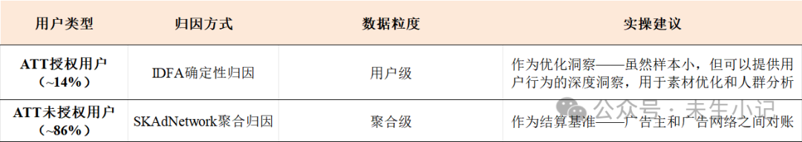
注意：两个数据源不要尝试去重——Apple的设计本身就不支持去重。
Android端：隐私沙盒的动荡
Android的隐私环境相对稳定，但非一成不变

在Android端，短期内继续以GAID确定性归因为主，但同时关注Google的后续政策变化，提前做好切换到聚合归因的心理和技术准备。

写在最后
归因不是“算账”这么简单。

它是广告生态的底层协议——决定了钱怎么分、预算怎么花、谁被奖励、谁被淘汰。理解归因的底层逻辑，不是为了寻找规则的缝隙，而是为了在日益复杂的生态中，做出更理性的决策。

归因的黄金时代已经结束，但归因本身不会消失——只是换了一种形式存在。

回传的博弈：广告主如何“喂”算法，平台如何反制已付费
归因解决“功劳归谁”，回传解决“数据给谁、给多少”。
如果说归因是“算账”，那回传就是“报账”——广告主把用户的转化行为数据发回给广告平台，告诉平台“什么样的人是我想要的”。

但“报多少、怎么报、什么时候报”——每一个决策背后，都是一场精密的博弈。

一、什么是回传？为什么它如此重要？

1. 回传的定义
   回传（Postback） 是指广告主把用户在App内的行为数据（注册、申请、授信、借款、还款等）发送回广告平台的过程。

在oCPX（按转化目标优化的智能出价）模式下，回传是算法运转的命脉：

没有回传，平台的模型就是瞎子。 不知道哪些用户最终转化了，就无法找到相似的人群，无法优化出价。

回传的质量，直接决定了算法学习的方向和效率。

2. 回传的底层逻辑
   广告平台通过你回传的转化数据让模型找到更多类似的人。你给的信号越多、越准、越及时，模型找人越准确。

这句话的背后，是整个oCPX模式的运行逻辑：

广告主回传转化数据 → 平台训练出价模型 → 模型预估每次展示的转化价值 → 自动出价 → 持续优化

回传是“数据闭环”的最后一公里，也是第一公里

没有回传，算法就没有“学习材料”；回传质量差，算法就学偏了。

3. 回传的演变：从T+1到准实时
   过去，回传数据进模型很多都是T+1（隔天）。但现在的回传信号在主流媒体平台基本都是准实时进模型。

这意味着：广告主的每一个回传决策，都在实时影响模型的判断。回传什么、回传多少、何时回传——每一个变量都在被算法实时消化。

二、如何把数据回传给平台？
回传的技术实现方式，决定了数据能不能准确、及时地到达平台。

目前主流的回传方式有三种：

方式一：通过SDK直接上报（App端）

这是最基础的方式——在App中集成广告平台（如Google、Meta）或第三方归因工具（如AppsFlyer、Adjust）的SDK，当用户触发转化事件时，SDK直接向平台发送回传数据。

优点：实时性高，数据链路短

缺点：受限于App端的数据采集能力；iOS隐私政策下，部分用户级数据无法获取

方式二：通过MMP回传（服务端聚合）

这是目前最主流的方式——广告主将转化事件上报给MMP（AppsFlyer/Adjust），MMP完成归因后，统一将归因结果回传给各广告平台。

优点：一套回传配置对接所有渠道，降低重复开发成本；MMP提供数据校验和去重能力

缺点：数据经过中转，存在延迟风险；依赖MMP与各平台的对接稳定性

方式三：通过媒体API回传（服务端）

以Meta的CAPI（Conversions API） 为代表——广告主将关键行为数据直接从服务器端发送给媒体平台，绕过App端和浏览器端的限制。

优点：不受浏览器端事件追踪能力减弱的影响（如iOS隐私政策、广告拦截器等）；数据更稳定、更完整

缺点：需要技术开发投入；需要与Pixel配合去重

三种方式的对比：

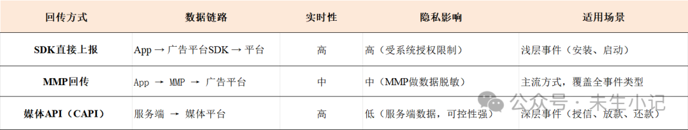
对于信贷产品，建议采用“MMP回传 + CAPI补充”的双轨策略：

MMP回传：作为主通道，覆盖归因和对账需求

CAPI补传：作为增强通道，补传深层转化事件（尤其是授信、放款、还款），确保关键信号不被浏览器端限制所影响

三、广告主的回传策略工具箱
既然回传决定算法，广告主自然有动机通过控制回传来引导算法。

但策略的选择远非“回传”或“不回传”这么简单——回传什么事件、回传多少比例、何时回传、是否延迟、是否加权？每一个变量都对应着不同的策略路径，也各自承担着不同的风险。

以下是广告主在实际操作中常用的几种回传策略

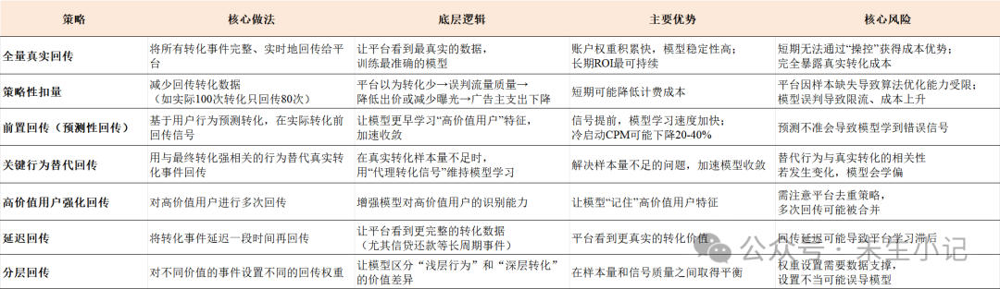
四、平台的识别与反制机制
广告主有策略，平台就有反制。以下是平台识别和反制“策略性回传”的主要手段。

1. 信号验证与签名校验
   平台会对回传数据进行签名验证——广告主回传数据时附带签名，平台根据相同规则生成签名进行比对，一致则校验通过，否则回传失败。

这意味着：篡改回传数据会被直接拒绝，且部分平台不会返回错误提示——广告主甚至不知道自己被“静默拒绝”了。

2. 异常行为识别体系
   平台建立了完整的异常行为识别体系，包括：

回传比例异常检测：如果某个广告主的回传比例显著低于行业基准或历史水平，系统会自动标记

转化模式异常检测：如果转化时间分布、用户行为路径出现异常模式，系统会触发预警

计费比监控：平台通过监控计费比（预期成本与实际成本的比率）来确保自身利益。如果计费比偏高，平台可能采取缩量或掺量等措施，将计费比拉回到正常水平

平台通过历史数据积累了对不同类型预算的转化事件和真实转化率的基准认知。任何偏离基准的操作都可能被敏锐捕捉。

3. 模型对抗性训练
   平台的机器学习模型会进行对抗性训练——在训练数据中混入各种“策略性回传”的模拟数据，让模型学会识别和抵御这类操作。

这意味着：广告主的“创新”回传策略，可能很快就被平台的模型学会并反制。

4. 实时惩罚与恢复机制
   当平台识别到策略性回传后，会触发一系列实时惩罚：

限流：减少该广告主的流量分配

成本上升：提高该广告主的竞价门槛

账户降权：降低该广告主的账户权重

恢复机制：当广告主恢复正常的回传行为后，账户权重可以逐步恢复。

5. 归因巡查系统
   部分平台建立了广告归因巡查系统来监测广告主的漏报和错报。

它能解决：广告主非主动的漏报和错报，以及其他场景被抢归因的问题。

它不能解决：广告主主动卡回传的问题。“你永远都无法叫醒一个装睡的人”——对于主动策略性扣量，巡查系统的作用有限。

五、博弈的本质：非合作均衡
广告主和平台之间的回传博弈，本质上是一场非合作博弈——双方都追求自身利益最大化，而非整体效率最优。

1. 博弈的起点：oCPX 的“对赌”结构
   oCPX广告的本质是“以一价为优化目标”——广告主设定目标CPA，平台承诺“帮你把成本控制在出价附近”。

但这份承诺有一个前提：广告主必须把转化数据完整回传给平台。

这个结构本身就埋下了博弈的种子——双方的利益并不天然一致。

2. 广告主的动机：“卡回传”
   广告主有主动“卡回传”（减少回传）的动机。

逻辑很简单：通过扣留部分转化数据，广告主可以降低计费成本。

比如一个渠道实际带来了100个转化，广告主只回传80个——平台以为转化效率低于预期，就会降低出价或减少曝光，广告主的实际支出随之下降。

但这把双刃剑的另一面是：广告主扣留数据的同时，平台因样本缺失导致算法优化能力受限。平台无法准确识别相似人群，后续的投放效率反而下降。

结果：短期获得了成本节约，长期却牺牲了模型效果——成本最终可能反弹甚至上升。

3. 平台的反制：技术权力格局的重塑
   博弈不只是广告主“卡回传”，平台也在通过技术手段重塑权力格局：

数据黑箱化：SKAdNetwork、隐私沙盒等框架让广告主失去用户级数据的可见性

算法控制权收拢：模型驱动的自动化投放逐渐成为主流，人工干预的空间正在收窄

归因主动权转移：广告主越来越依赖平台“自报”的归因结果，而非第三方独立验证

平台正在逐渐收回广告主的投放控制权，构建“黑箱化”的自动化生态。 广告主必须“在数据归因与效果优化中重建主动权”。

4. 博弈的均衡：谁也无法“赢”
   回传博弈的本质是：

广告主想用最少的数据换取平台最好的模型服务；平台想用最多的数据训练最强的模型，同时掌握定价权。

双方在“数据换效率”和“数据换控制权”之间反复拉锯——谁也无法单方面“赢”。

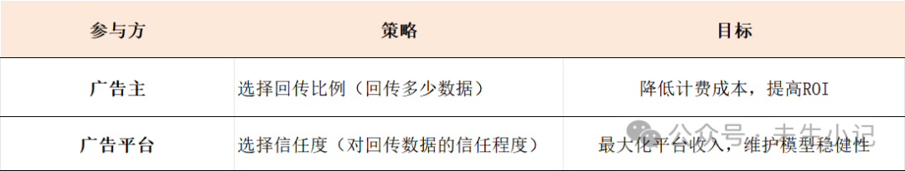
六、信贷场景下的回传实践建议
基于以上分析，信贷广告主在回传策略上可以遵循以下原则：

1. 从“扣量”转向“巧传”
   物理扣量是一条死路。正确的方向是巧传：

前置回传：基于用户行为预测转化，提前回传信号

关键行为替代：用强相关行为替代真实转化事件回传

分层回传：对不同价值的用户设置不同的回传权重

2. 分阶段设计回传策略
   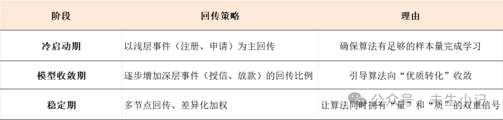
3. 利用好Meta CAPI
   随着iOS隐私策略的持续升级，浏览器端的事件追踪能力正在减弱。

CAPI（Conversions API） 是Meta推出的服务器端事件回传方式，能把关键行为直接从服务器发送给Meta。

CAPI的核心价值：补传真实成交信号，让系统重新“看见”真实转化。

4. 保持回传策略的相对稳定性
   频繁调整回传策略可能导致转化率的剧烈波动，这会对买量模型产生负面影响。

模型需要在稳定的状态下进行学习和优化。

转化率的忽高忽低会使模型陷入非稳态，需要不断重新学习和探索。

结果可能是：模型长时间无法收敛，最终导致买量失败；或模型在长期探索过程中增加成本，影响买量效益。

5. 接受平台的“利润空间阈值”
   平台通过历史数据建立了对不同类型预算的基准认知。在平台允许的范围内优化回传策略，而不是试图突破底线。

写在最后
回传是广告主与平台之间最隐秘的博弈场。

广告主的逻辑：通过控制回传什么、回传多少、何时回传，引导算法向自己定义的“优质用户”收敛。

平台的逻辑：通过信号验证、异常检测、模型对抗、实时惩罚，确保算法不被“带偏”。

博弈的结局：系统会收敛到某个均衡点。试图突破平台利润空间阈值的操作，最终都会被识别和反制。

真正聪明的做法：

不要扣量——短期获益，长期受损

学会巧传——前置回传、关键行为替代、分层回传

保持稳定——频繁调整会让模型陷入非稳态

接受边界——在平台允许的范围内做最优解

回传策略会衰退，就像素材会衰退一样。不要一直盯着一个回传策略，要持续挖掘新的方法。当然，不同的回传策略要搭配不同的投放策略。

素材与创意：海外信贷投放的“第一道风控”已付费
我们从投放的本质聊到渠道选择，从预算节奏聊到竞价机制，从归因架构聊到回传博弈
但有一个问题始终没有深入回答：在海外的信贷投放中，什么样的素材能打动人？怎么持续产出好素材？

这一篇，我们专门聊素材与创意，视角聚焦在海外信贷市场。

一、为什么素材是海外信贷投放的“第一道风控”？
在海外信贷广告投放中，素材决定点击率（CTR）

素材不只是“广告内容”——它是投放的第一道筛选器。

为什么这么说？

第一，素材决定了“谁来”

一套素材吸引什么样的人，直接决定了后续风控通过率和首逾率。

如果你用“No credit check”“Instant approval”这类素材，吸引来的大概率是资质差、还款意愿低的用户——首逾率会教你做人。

反之，一套突出“合规持牌、利率透明”的素材，虽然量可能小一些，但进来的用户质量会明显更高。

第二，素材决定了成本

CTR每提升1个百分点，CPC可能下降10%-20%。

在海外市场，同样的预算，好的素材能撬动3-5倍的优质流量。这不是夸张——东南亚信贷市场的一线实战数据验证了这一点。

第三，素材是合规的第一道关卡

海外金融监管机构（如印尼OJK、菲律宾SEC）对信贷广告有严格的政策要求

利率展示、资金方信息、禁止误导性宣传。

素材踩了合规红线，轻则审核不通过，重则账户被封。

素材不是在“做广告”，而是在“做筛选”。

好的素材自带风控属性——它天然吸引对的人，天然劝退错的人。

二、什么样的素材能打动人？
“打动用户”不是靠灵感，而是靠对用户心理的精准把握。

1. 海外信贷用户的三大决策特征
   特征一：“资金需求”驱动

大部分借款用户是因为他们当下有真实的资金缺口

薪资花完了需要周转、店铺进货缺一笔钱、临时有大额支出。他们的核心状态是“缺钱”。

与国内信贷广告有本质区别。海外新兴市场的用户画像更加多元化

很多人不是“被银行拒绝的人”。他们的核心是“我需要一笔钱来解决当下的问题，越快越好”。

特征二：即时性

用户希望“当天申请、当天放款”。在他们最需要资金的时刻，快速响应就是最大的价值。

在海外新兴市场，传统银行审批流程慢、门槛高，数字信贷的 “速度”本身就是核心卖点。

特征三：信任依赖

海外用户对借贷平台的信任度普遍较低——担心信息泄露、担心隐性费用、担心暴力催收。

专业背书（如OJK注册号、银行合作标识、用户真实评价）能显著提升转化率。

基于这三个特征，素材要回应的核心诉求是：唤醒需求、承诺速度、建立信任。

唤醒需求：用真实的用款场景（交房租、进货、发工资前周转）让用户产生“对，我现在就需要这个”的共鸣。不是制造焦虑，而是帮助用户识别自己的真实需求。

承诺速度：用具体、可信的方式展示“申请流程简单、放款快速”。让用户看到清晰的路径和预期，而不是喊口号。

建立信任：用合规资质、用户评价、透明条款消除顾虑。信任是转化的最后一公里。

2. 高转化素材的结构化公式
   基于以上逻辑，信贷素材的“爆款公式” 可以概括为：

真实场景切入（前3秒）+ 简单流程展示（中段）+ 清晰行动引导（结尾）

可以拆解为四个核心公式：

公式一：3秒真实场景开场 + 解决方案

这是信息流广告最经典的打法：

开场：用真实的用款场景切入。比如“下周要交房租了，但工资还没发怎么办？”“店铺进货缺钱，银行审批要两周？”——让用户产生“对，这就是我”的代入感。

中段：展示申请全流程。“只需身份证+手机号，3步完成申请”——让用户看到清晰的路径。

结尾：用信任元素收尾。“已服务XX万用户”“OJK注册持牌机构”——让用户放心点击。

数据参考：东南亚信贷市场的一线实战数据显示，此类素材的CTR可以稳定在2.5%-4.5%之间，远高于纯促销型素材的0.8%-1.5%。

公式二：信任感前置

海外用户对借贷平台天然警惕。

在素材中前置信任元素，是东南亚信贷市场验证过的关键打法：

合规牌照展示：在视频前5秒或图片核心位置展示OJK/SEC注册号

用户评价切片：真实用户的还款成功截图或评价（需脱敏）

数据背书：“已服务XX万用户”“累计放款XX亿”

信任感前置的素材，转化率通常比纯利益驱动型素材高出30%-50%。

公式三：动态信息植入

根据用户特征动态调整素材内容：

地域化：自动匹配用户所在城市，展示“本地用户已成功借款”

客群定制：根据设备特征或人群标签，展示不同的用款场景

个性化素材的转化率通常比通用素材高出50%-80%。

公式四：场景剧 vs 口播——因“客群”而异

本地场景剧：面向大众客群（小额消费贷、薪资周转）—— 代入感强，CTR普遍更高

专业口播：面向小微商户/大额贷（经营贷、进货贷）—— 信任度提升明显

两种类型没有绝对的“谁更好”，关键是匹配你的目标客群。

3. 素材的“需求逻辑”
   最后，回到一个本质问题：用户在刷到借贷广告时，他的状态是什么？

不是“我在找贷款”，而是 “我在刷信息流” 。他要的不是一个“贷款产品介绍”，而是一个 “对我有用的信息”。

所以素材要回答的核心问题是：“这个广告对我有什么用？”

“急需一笔钱周转”是一个情境

“3步申请当天放款”是一个解决方案

“已服务10万用户”是一个信任背书

三者结合，就是素材的价值。

用户不想看“贷款广告”，用户想看“能解决我燃眉之急的信息”。

这个认知，是海外素材创意的起点。

三、不同平台、不同市场的素材策略
同一套素材，在不同平台、不同市场，效果可能天差地别。

1. 海外主流平台的素材适配
   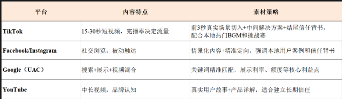
2. 海外各市场的差异化打法
   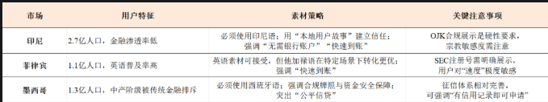
3. 本地化的真实含义
   海外素材的“本地化”，不是把中文素材翻译成英文/印尼语/西班牙语就完了。

真正的本地化是四个层面的深度融合

语言本地化：用本地用户的日常表达方式，而不是“翻译腔”。印尼人不说“pinjaman cepat”，他们更常说“pinjaman online cepat cair”——加了“online”和“cair”（到账）才更贴近真实搜索习惯。

场景本地化：用本地用户熟悉的场景做切入。印尼用户对“warung”（小卖部）的场景比“办公室白领”更有共鸣。菲律宾用户对“sari-sari store”（社区小杂货店）的亲近感远高于“购物中心”。

视觉本地化：用本地面孔、本地场景、本地服装风格。一个“看起来像本地人”的素材，信任度远高于“外国面孔+本地字幕”。

信任逻辑本地化：不同市场对“信任”的定义不同。印尼用户更信任OJK牌照和本地银行合作标识；菲律宾用户更看重用户评价和SEC注册；墨西哥用户更关注“是否合法合规”。

本地化做得越深，用户越觉得“这是给我的”，转化率自然越高。

一个真实的案例：某现金贷App深耕拉美与东南亚市场，通过“信任感型+对比型+情景剧情型”的素材组合，配合本地化语言和视觉风格，最终实现CTR翻倍、CPC降低30%-40%。

四、海外信贷素材的合规边界
海外信贷素材的特殊性在于：它不仅要“打动用户”，还要“满足各国监管要求”。

1. 海外各市场的合规要点
   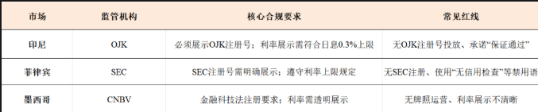
2. 平台审核的通用红线
   Google、Facebook、TikTok对金融广告的审核政策各不相同，但有以下通用红线：

禁止承诺“保证批准”或“100%通过”

禁止展示误导性的利率（必须展示APR）

禁止使用“无信用检查”作为卖点

必须清晰展示资金方/贷款方身份

3. 合规的代价
   一个素材踩了合规红线，不只是“审核不通过”这么简单：

广告账户可能被暂停或永久封禁

品牌域名可能被加入黑名单

公司主体可能被平台标记为“高风险”

合规不仅仅是“法务的事”，从投放端就要开始 。素材踩线，代价是预算白花、账户被封、品牌受损。

五、如何持续产出好素材？
好素材不能靠“灵感”，要靠 “体系”。

1. 素材的“速死”宿命
   信息流广告素材的衰减周期极短。在有人群定向的条件下，素材衰减周期约为2-7天。

一套素材上线后，CTR会迅速下降，必须持续迭代。靠“碰运气”产出素材，注定跟不上衰减的速度。

2. 素材生产的三步走
   第一步：需求洞察

每日分析各市场的关键词搜索趋势和竞品素材

跟踪各市场的政策变化和用户反馈

实时监测素材衰退信号（建议CTR下降1.5%触发迭代）

第二步：创意生产

本地团队主导创意方向，总部提供方法论支持

演员库覆盖本地各类型的借贷用户群体

场景库复刻本地真实的用款场景

第三步：快速迭代

素材上线后48小时内完成效果评估

跨平台效果对标，识别高转化素材的特征

每周固定产出一定数量的新素材

3. AI赋能素材生产
   AI正在改变海外素材的生产效率：

智能翻译与本地化：AI辅助翻译+本地人工校验，快速生成多语言版本

批量生成：一套素材自动生成横版、竖版、不同时长版本

效果预测：基于历史数据预测新素材的可能表现

效率的提升，让“持续产出”从理想变成了现实。

六、海外信贷素材的实战检查清单
每次素材制作前，用以下清单做自检：

合规层面：

是否展示了当地监管要求的注册号（如OJK/SEC）？
年化利率是否清晰、透明地展示？
是否避免了“保证通过”“无信用检查”等敏感词？
内容层面：

前3秒是否用真实场景切入，而非推销式开场？
是否展示了清晰的申请流程？
结尾是否有明确的行动引导（CTA）？
是否根据平台特性做了适配？
本地化层面：

语言是否使用本地用户的日常表达方式？
场景和角色是否符合本地文化？
信任背书是否符合本地用户的信任逻辑？
效果层面：

是否准备了多版本进行A/B测试？
是否设置了CTR衰退监控（建议1.5%触发线）？
是否有备用素材准备迭代？
写在最后
素材是信贷投放的 “第一道风控” 。

好的素材不是“广告”，而是 “筛选器” 。

海外素材的终极能力：理解本地用户、理解各国合规、理解平台规则、理解数据——然后把这四个理解揉进每一套素材里。

回传策略会衰退，出价策略会失效，但素材能力的积累是复利的。

你今天了解的一个本地用户的真实需求，可以被反复验证和复用。

你今天踩的一个合规坑，可以避免下次再犯。

素材不是成本，是资产。

回传的博弈：广告主如何“喂”算法，平台如何反制已付费
归因解决“功劳归谁”，回传解决“数据给谁、给多少”。
如果说归因是“算账”，那回传就是“报账”——广告主把用户的转化行为数据发回给广告平台，告诉平台“什么样的人是我想要的”。

但“报多少、怎么报、什么时候报”——每一个决策背后，都是一场精密的博弈。

一、什么是回传？为什么它如此重要？

1. 回传的定义
   回传（Postback） 是指广告主把用户在App内的行为数据（注册、申请、授信、借款、还款等）发送回广告平台的过程。

在oCPX（按转化目标优化的智能出价）模式下，回传是算法运转的命脉：

没有回传，平台的模型就是瞎子。 不知道哪些用户最终转化了，就无法找到相似的人群，无法优化出价。

回传的质量，直接决定了算法学习的方向和效率。

2. 回传的底层逻辑
   广告平台通过你回传的转化数据让模型找到更多类似的人。你给的信号越多、越准、越及时，模型找人越准确。

这句话的背后，是整个oCPX模式的运行逻辑：

广告主回传转化数据 → 平台训练出价模型 → 模型预估每次展示的转化价值 → 自动出价 → 持续优化

回传是“数据闭环”的最后一公里，也是第一公里

没有回传，算法就没有“学习材料”；回传质量差，算法就学偏了。

3. 回传的演变：从T+1到准实时
   过去，回传数据进模型很多都是T+1（隔天）。但现在的回传信号在主流媒体平台基本都是准实时进模型。

这意味着：广告主的每一个回传决策，都在实时影响模型的判断。回传什么、回传多少、何时回传——每一个变量都在被算法实时消化。

二、如何把数据回传给平台？
回传的技术实现方式，决定了数据能不能准确、及时地到达平台。

目前主流的回传方式有三种：

方式一：通过SDK直接上报（App端）

这是最基础的方式——在App中集成广告平台（如Google、Meta）或第三方归因工具（如AppsFlyer、Adjust）的SDK，当用户触发转化事件时，SDK直接向平台发送回传数据。

优点：实时性高，数据链路短

缺点：受限于App端的数据采集能力；iOS隐私政策下，部分用户级数据无法获取

方式二：通过MMP回传（服务端聚合）

这是目前最主流的方式——广告主将转化事件上报给MMP（AppsFlyer/Adjust），MMP完成归因后，统一将归因结果回传给各广告平台。

优点：一套回传配置对接所有渠道，降低重复开发成本；MMP提供数据校验和去重能力

缺点：数据经过中转，存在延迟风险；依赖MMP与各平台的对接稳定性

方式三：通过媒体API回传（服务端）

以Meta的CAPI（Conversions API） 为代表——广告主将关键行为数据直接从服务器端发送给媒体平台，绕过App端和浏览器端的限制。

优点：不受浏览器端事件追踪能力减弱的影响（如iOS隐私政策、广告拦截器等）；数据更稳定、更完整

缺点：需要技术开发投入；需要与Pixel配合去重

三种方式的对比：

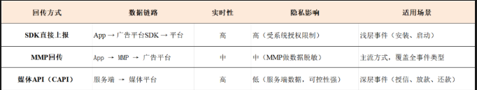
对于信贷产品，建议采用“MMP回传 + CAPI补充”的双轨策略：

MMP回传：作为主通道，覆盖归因和对账需求

CAPI补传：作为增强通道，补传深层转化事件（尤其是授信、放款、还款），确保关键信号不被浏览器端限制所影响

三、广告主的回传策略工具箱
既然回传决定算法，广告主自然有动机通过控制回传来引导算法。

但策略的选择远非“回传”或“不回传”这么简单——回传什么事件、回传多少比例、何时回传、是否延迟、是否加权？每一个变量都对应着不同的策略路径，也各自承担着不同的风险。

以下是广告主在实际操作中常用的几种回传策略

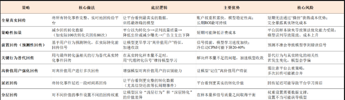
四、平台的识别与反制机制
广告主有策略，平台就有反制。以下是平台识别和反制“策略性回传”的主要手段。

1. 信号验证与签名校验
   平台会对回传数据进行签名验证——广告主回传数据时附带签名，平台根据相同规则生成签名进行比对，一致则校验通过，否则回传失败。

这意味着：篡改回传数据会被直接拒绝，且部分平台不会返回错误提示——广告主甚至不知道自己被“静默拒绝”了。

2. 异常行为识别体系
   平台建立了完整的异常行为识别体系，包括：

回传比例异常检测：如果某个广告主的回传比例显著低于行业基准或历史水平，系统会自动标记

转化模式异常检测：如果转化时间分布、用户行为路径出现异常模式，系统会触发预警

计费比监控：平台通过监控计费比（预期成本与实际成本的比率）来确保自身利益。如果计费比偏高，平台可能采取缩量或掺量等措施，将计费比拉回到正常水平

平台通过历史数据积累了对不同类型预算的转化事件和真实转化率的基准认知。任何偏离基准的操作都可能被敏锐捕捉。

3. 模型对抗性训练
   平台的机器学习模型会进行对抗性训练——在训练数据中混入各种“策略性回传”的模拟数据，让模型学会识别和抵御这类操作。

这意味着：广告主的“创新”回传策略，可能很快就被平台的模型学会并反制。

4. 实时惩罚与恢复机制
   当平台识别到策略性回传后，会触发一系列实时惩罚：

限流：减少该广告主的流量分配

成本上升：提高该广告主的竞价门槛

账户降权：降低该广告主的账户权重

恢复机制：当广告主恢复正常的回传行为后，账户权重可以逐步恢复。

5. 归因巡查系统
   部分平台建立了广告归因巡查系统来监测广告主的漏报和错报。

它能解决：广告主非主动的漏报和错报，以及其他场景被抢归因的问题。

它不能解决：广告主主动卡回传的问题。“你永远都无法叫醒一个装睡的人”——对于主动策略性扣量，巡查系统的作用有限。

五、博弈的本质：非合作均衡
广告主和平台之间的回传博弈，本质上是一场非合作博弈——双方都追求自身利益最大化，而非整体效率最优。

1. 博弈的起点：oCPX 的“对赌”结构
   oCPX广告的本质是“以一价为优化目标”——广告主设定目标CPA，平台承诺“帮你把成本控制在出价附近”。

但这份承诺有一个前提：广告主必须把转化数据完整回传给平台。

这个结构本身就埋下了博弈的种子——双方的利益并不天然一致。

2. 广告主的动机：“卡回传”
   广告主有主动“卡回传”（减少回传）的动机。

逻辑很简单：通过扣留部分转化数据，广告主可以降低计费成本。

比如一个渠道实际带来了100个转化，广告主只回传80个——平台以为转化效率低于预期，就会降低出价或减少曝光，广告主的实际支出随之下降。

但这把双刃剑的另一面是：广告主扣留数据的同时，平台因样本缺失导致算法优化能力受限。平台无法准确识别相似人群，后续的投放效率反而下降。

结果：短期获得了成本节约，长期却牺牲了模型效果——成本最终可能反弹甚至上升。

3. 平台的反制：技术权力格局的重塑
   博弈不只是广告主“卡回传”，平台也在通过技术手段重塑权力格局：

数据黑箱化：SKAdNetwork、隐私沙盒等框架让广告主失去用户级数据的可见性

算法控制权收拢：模型驱动的自动化投放逐渐成为主流，人工干预的空间正在收窄

归因主动权转移：广告主越来越依赖平台“自报”的归因结果，而非第三方独立验证

平台正在逐渐收回广告主的投放控制权，构建“黑箱化”的自动化生态。 广告主必须“在数据归因与效果优化中重建主动权”。

4. 博弈的均衡：谁也无法“赢”
   回传博弈的本质是：

广告主想用最少的数据换取平台最好的模型服务；平台想用最多的数据训练最强的模型，同时掌握定价权。

双方在“数据换效率”和“数据换控制权”之间反复拉锯——谁也无法单方面“赢”。

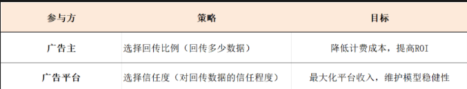
六、信贷场景下的回传实践建议
基于以上分析，信贷广告主在回传策略上可以遵循以下原则：

1. 从“扣量”转向“巧传”
   物理扣量是一条死路。正确的方向是巧传：

前置回传：基于用户行为预测转化，提前回传信号

关键行为替代：用强相关行为替代真实转化事件回传

分层回传：对不同价值的用户设置不同的回传权重

2. 分阶段设计回传策略
   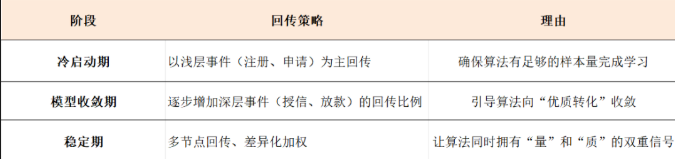
3. 利用好Meta CAPI
   随着iOS隐私策略的持续升级，浏览器端的事件追踪能力正在减弱。

CAPI（Conversions API） 是Meta推出的服务器端事件回传方式，能把关键行为直接从服务器发送给Meta。

CAPI的核心价值：补传真实成交信号，让系统重新“看见”真实转化。

4. 保持回传策略的相对稳定性
   频繁调整回传策略可能导致转化率的剧烈波动，这会对买量模型产生负面影响。

模型需要在稳定的状态下进行学习和优化。

转化率的忽高忽低会使模型陷入非稳态，需要不断重新学习和探索。

结果可能是：模型长时间无法收敛，最终导致买量失败；或模型在长期探索过程中增加成本，影响买量效益。

5. 接受平台的“利润空间阈值”
   平台通过历史数据建立了对不同类型预算的基准认知。在平台允许的范围内优化回传策略，而不是试图突破底线。

写在最后
回传是广告主与平台之间最隐秘的博弈场。

广告主的逻辑：通过控制回传什么、回传多少、何时回传，引导算法向自己定义的“优质用户”收敛。

平台的逻辑：通过信号验证、异常检测、模型对抗、实时惩罚，确保算法不被“带偏”。

博弈的结局：系统会收敛到某个均衡点。试图突破平台利润空间阈值的操作，最终都会被识别和反制。

真正聪明的做法：

不要扣量——短期获益，长期受损

学会巧传——前置回传、关键行为替代、分层回传

保持稳定——频繁调整会让模型陷入非稳态

接受边界——在平台允许的范围内做最优解

回传策略会衰退，就像素材会衰退一样。不要一直盯着一个回传策略，要持续挖掘新的方法。当然，不同的回传策略要搭配不同的投放策略。

# 海外信贷投放：印尼、菲律宾、墨西哥的差异化打法

同样的方法论，换一个市场还work吗？

这一篇，我们把视角拉到具体的市场——印尼、菲律宾、墨西哥，这三个目前中资信贷出海最热的目的地。它们的监管环境、用户特征、竞争格局、获客成本完全不同——用同一套策略打三个市场，注定行不通。数据来源：各国监管机构、政府公报、行业报告等，数据截至202608。

一、为什么要单独聊“市场差异”？
信贷投放的通用能力——渠道操作、数据分析、素材创意，在任何市场都适用。

但，真正决定成败的是对每个市场独特性的理解和尊重。

国内信贷市场经过了十几年的发展，征信体系成熟、数据源丰富、用户画像清晰。但海外新兴市场完全不同：征信体系缺失、数据分散、用户行为差异巨大、监管框架在快速变化。

在国内，你是在“优化”；在海外，你是在“探索”。

这三个市场代表了三种完全不同的状态

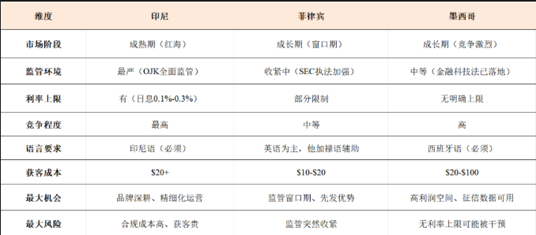
接下来，一个一个拆。

二、印尼市场：合规最严，但规模最大

1. 监管环境：OJK的“铁腕”治理
   印尼是三个市场中监管最严、也最成型的。金融服务管理局（OJK）对金融科技贷款有完整的监管框架，且仍在持续收紧。

2025-2026年的关键监管动作：

利率上限阶梯式下调：OJK早在2023年就发布了利率下调路线图

2024年1月1日起日息上限降至0.3%；2025年降至0.2%；2026年降至0.1%。

虽然2024年底OJK将6个月及以下期限产品日息放宽至最高不超过千分之三，但长期来看，利率下行是不可逆的趋势。

这对投放意味着什么？利润空间被压缩，获客成本的容忍度必须同步下降。

POJK 30/2025（治理与风险管理） ：2025年发布，2026年7月1日正式生效，对金融科技平台的治理和风险管理提出了系统性要求。

POJK 8/2026（数据报送） ：2026年8月发布，要求在线借贷平台向OJK完整、准确、及时地报送融资交易数据。平台须通过OJK管理的报告系统提交数据，并指定一名董事负责数据报送工作。这意味着监管从“结果导向”转向了“过程导向”——不仅要看你的逾期率，还要看你的数据是否透明。

TWP90监管门槛：OJK要求在线借贷行业TWP90率（逾期90天以上贷款率）不超过4% 。但截至2026年5月，行业整体TWP90率仍高于4%  。这说明合规压力仍在加大，风控能力不足的平台正在被加速淘汰。

对投放的影响

素材必须严格合规，利率展示、还款期限、产品透明度是三条红线

平台必须有OJK注册号，否则无法在主流渠道正常开户投放

合规成本高，但好处是市场秩序相对规范，头部玩家的竞争环境更可预测

2. 市场格局：从蓝海到红海
   印尼曾是出海的第一站。早期获客成本仅需几美元，如今已涨到十几甚至几十美元。

竞争激烈程度在三个市场中最高——头部玩家已经建立起品牌和规模壁垒。印尼下载量前十的现金贷APP中，60%以上具有中资背景。

但市场规模依然可观：印尼2.7亿人口，40%成年人缺乏银行服务，数字信贷覆盖率低。OJK数据显示，2025年7月印尼P2P部门贷款总额达到约84.66万亿印尼盾，同比增长约22%。

3. 用户特征与投放策略
   用户特征

18-35岁年轻群体为主，女性占比近40%

借款目的多为日常周转、紧急需求（交房租、看病等）

件均较低，通常在几百元人民币量级

用户搜索习惯高度本地化——印尼用户常用 “pinjaman online cepat cair”（快速到账在线贷款） 等本土关键词

投放策略

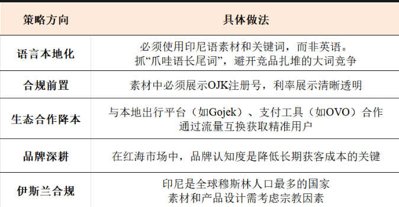
一句话总结印尼：合规是生命线，品牌是护城河。获客成本已经很高，比拼的是精细化运营和用户生命周期管理，而不是谁更敢花钱。
三、菲律宾市场：窗口期正在打开

1. 监管环境：SEC解除五年禁令
   菲律宾是三个市场中变化最大的。

2026年7月，菲律宾证券交易委员会（SEC）正式解除了长达近五年的在线贷款平台注册禁令，自2026年8月1日起，新平台可以重新申请注册。

解除禁令的同时，SEC也大幅提高了准入门槛

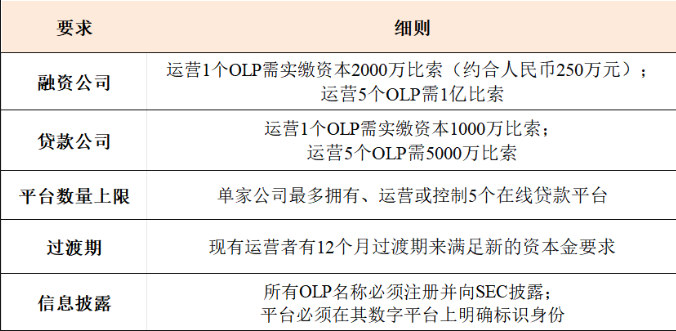
借款人保护规则也全面升级：贷款确认前必须清晰披露贷款总额、实际放款金额、适用利率、实际利率、费用、还款计划和贷款期限；借款人必须明确确认这些披露信息。催收活动必须公平、透明地进行。
对投放的影响

窗口期已经打开，但门槛大幅提高——不是谁都能进来，资本金要求会淘汰一批小玩家

合规成本上升，但竞争格局可能比印尼更健康——不会出现“千团大战”的混乱局面

广告素材必须符合SEC的披露要求，否则面临行政处罚

2. 市场格局
   菲律宾数字贷款市场估值约560亿比索（约合10亿美元）。2025年下半年，菲律宾数字贷款市场预计突破10亿美元，其中非银行数字贷款机构占55.2%（约5.565亿美元）。

竞争激烈程度低于印尼，机会相对更大。但菲律宾市场也有其独特挑战。

3. 用户特征与投放策略
   用户特征

菲律宾人口约1.1亿，智能手机普及率较高

年轻人口占比高，政策鼓励现金贷机构接入征信系统

用户对“快速到账”有强烈需求

英语普及率高，但本地语言（他加禄语）在特定场景下转化优势明显

投放策略
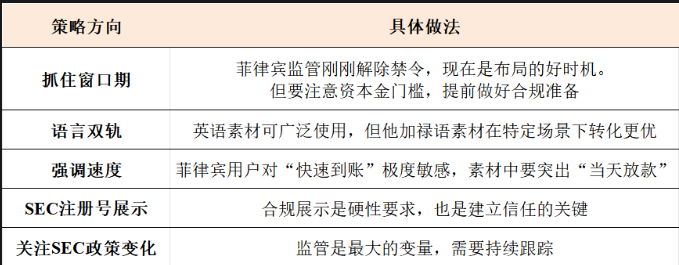
一句话总结菲律宾：抓住窗口期快速布局，用速度换空间。但不要以为监管放松就是“随便搞”——SEC的门槛已经大幅提高，合规是入场券。

四、墨西哥市场：高回报、高门槛

1. 监管环境：金融科技法已落地，但利率无上限
   墨西哥是拉美最大的金融科技市场之一。

2023年实施的金融科技法（FinTech Law） 为在线贷款平台建立了法律框架。CNBV（国家银行和证券委员会） 是核心监管机构。

2026年的关键监管动向

CNBV加强身份验证要求：2026年7月，CNBV发布决议，将面部识别正式纳入经批准的身份验证机制，与指纹验证并列。信贷机构有90个工作日（至2026年10月底或11月初）全面合规。

反洗钱要求升级：金融科技平台需获得CNBV关于反洗钱/反恐融资的技术意见（dictamen técnico） 后才能向CONDUSEF注册。

与印尼最大的不同：墨西哥 没有明确的短期消费贷款利率上限。这意味着定价空间更大、利润天花板更高。

但“无利率上限”是一把双刃剑——利润空间大，但也容易吸引监管关注。

对投放的影响

利率无上限意味着更高的利润空间，但也意味着更高的坏账风险

合规门槛高于菲律宾，需要专业的法务和合规团队

面部识别等生物识别要求正在成为标配，产品和技术需要提前适配

2. 市场格局
   墨西哥人口约1.28亿，金融覆盖率不足30%，但数字基建完善。

信用卡渗透率低，为数字信贷留下了巨大空间。

获客成本：单个借款人超过20美元，部分机构报告的平均获客成本在50-100美元之间。

好消息是：部分平台的客户获取成本环比下降了19%，盈利环比提升。这可能意味着市场正在从“野蛮增长”走向“精细化运营”阶段。

3. 用户特征与投放策略
   用户特征

墨西哥成年人口约50%拥有银行账户，智能手机拥有率接近80%

中产阶级被传统金融排斥——有稳定收入但缺乏信用记录的人群是核心客群

墨西哥有相对完善的征信体系，这是与菲律宾最大的不同

靠近美国，部分用户有跨境借贷需求

投放策略

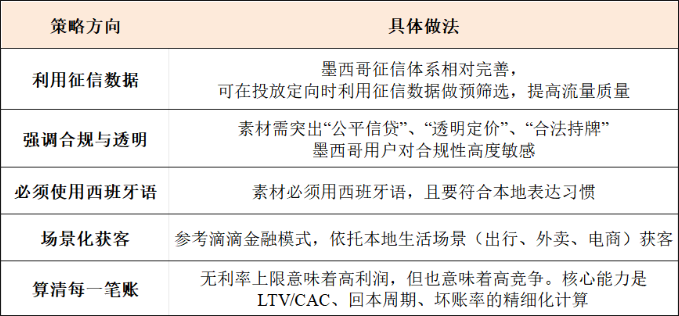
一句话总结墨西哥：不要被“无利率上限”冲昏头。高利润吸引的是高度竞争，核心能力是“算得清账”——而不是“敢投”。
六、投放的三个建议
建议一：不要用同一套策略打三个市场
三个市场的差异化程度远超想象

印尼要“守” ：合规是生命线，品牌是护城河。获客成本已经很高，比拼的是精细化运营和用户生命周期管理。

菲律宾要“抢” ：窗口期不会永远存在。在SEC新规框架下快速合规、建立市场份额，是降低长期获客成本的关键。

墨西哥要“算” ：无利率上限意味着高利润，但也意味着高竞争。核心能力是“算得清账”——LTV/CAC、回本周期、坏账率，每一个数字都要算到骨子里。

建议二：本地化不是翻译，是重新理解用户
很多团队做“本地化”，就是把素材翻译成当地语言——这远远不够。

印尼：要考虑伊斯兰合规、爪哇语长尾词、与本地出行/支付平台的生态合作

菲律宾：要理解“快速到账”对用户的极端重要性，素材要强调“速度”而非“利率”；同时要抓住SEC解除禁令的窗口期

墨西哥：要理解中产阶级被传统金融排斥的痛点，强调“公平信贷”和“透明定价”；利用征信数据做精准投放

建议三：把风控“前置”到投放环节
不同市场的风控数据源不同——印尼、墨西哥征信体系相对完善，菲律宾则在发展中。

这意味着

在印尼和墨西哥：可以在投放定向时就利用征信数据做预筛选，提高流量质量

在菲律宾：需要更依赖设备指纹、多头借贷等替代数据做前置风控

理想的状态是通过RTA（Real-Time API） 实现更精细的实时前置筛选

在广告曝光前，广告主的自有风控系统通过API接口直接判断该用户的风险等级，返回"参竞"或"不参竞"的决策，让每一分预算只花在风险可接受的用户身上。

不过在海外信贷市场，RTA生态远不如国内成熟，落地需评估平台支持程度和数据合规要求。

无论哪个市场，“投放带来的人，风控能接住多少”都是核心命题。 获客成本越高，风控前置的价值就越大。

写在最后
印尼、菲律宾、墨西哥——三个市场，三种完全不同的打法。

印尼是“红海中的红海” ，合规成本高、竞争激烈，但规模最大、生态最成熟。在这里，比拼的是精细化运营和品牌深耕。

菲律宾是“窗口期的蓝海” ，SEC刚刚解除禁令，竞争尚未饱和。但门槛已经大幅提高——资本金要求、信息披露、借款人保护——合规是入场券。

墨西哥是“高回报的高地” ，无利率上限带来高利润空间，在这里，核心能力是“算账”。

三个市场的共同点是：获客成本都在上升，合规门槛都在提高，竞争都在加剧。不同的是各自所处的阶段和节奏。

通用能力是基础，真正决定成败的是：对每个市场独特性的理解和尊重。

iOS数据不准，信贷投放的A/B测试还能信吗？
投放预算每天都在烧，素材每天在换，定向每天在调——但你凭什么说“这个素材比那个好”？凭什么说“这个渠道值得加预算”？

海外信贷渠道投放的A/B测试怎么做？怎么判断？以及iOS归因不准的时候怎么处理？

创作素材来源：A/B测试做了200组素材后，我总结出"3个必测变量"让ROI翻倍

一、为什么信贷投放需要A/B测试？

信贷投放和电商投放有一个根本区别：信贷的转化周期长、反馈信号滞后。

电商投流今天换素材，明天就能看到ROI变化。

信贷投流今天换素材，用户可能要3-7天才能完成注册→申请→授信→借款的全流程，首逾率要30天甚至更久才能验证。

反馈越滞后，越需要科学的方法论来区分“有效变化”和“随机波动”。

A/B测试的价值在于：基于证据而非假设或直觉来做出决策。

在信贷领域，A/B测试尤其重要，因为信贷投放的决策链条长、变量多、成本高——一个错误的渠道判断，可能导致数十万预算的浪费。

A/B测试在信贷投放中可以应用于多个场景：

图片
二、A/B测试的核心原则
原则一：每次只测一个变量
这是A/B测试最基础、也最容易被忽视的原则。

如果同时改变素材和定向，你无法判断效果提升来自素材还是定向。

在信贷投放中，常见的单一变量测试包括：

图片
Garanti Bank的信用卡申请A/B测试是一个典型案例。他们发现申请流程过长导致用户放弃填写，于是测试了三种不同的横幅文案变体，最终第一个变体（强调“每月有300多个优惠”）将申请量提升了24%。
关键操作：测试期间，除测试变量外，所有其他因素（预算、出价、时段、版位）保持一致。

原则二：样本量要够，统计显著性要验证
A/B测试最大的陷阱是“看到数字变化就下结论”。

信贷投放的特殊性：转化率通常较低（1%-5%），意味着需要更大的样本量才能达到统计显著性。

行业基准：对于金融App的A/B测试，转化率提升20%不一定意味着真的有提高，还需要进行统计学检验。

实操建议：

使用统计学工具（如T检验、卡方检验）验证显著性

设定显著性水平（通常p<0.05）

确保控制组和测试组的样本量足够大（建议每组至少1000个点击）

信贷场景下，由于转化周期长，建议测试周期至少覆盖一个完整的转化窗口（7-14天）

原则三：关注后端指标，而非前端指标
这是信贷投放与电商投放最核心的区别。

电商投流的A/B测试：看CTR、CVR、ROI就够了。
信贷投流的A/B测试：CTR高不一定好——可能吸引来大量低质量用户；CVR高不一定好——可能吸引来大量申请但通不过风控的用户。

信贷A/B测试的指标体系：

图片
核心原则：一个A/B测试的“赢家”应该是后端表现更好的那个，而不是前端数据更好看的那个。

原则四：考虑外部变量的干扰
信贷市场受季节性、政策变化、竞品动作等外部因素影响极大。

常见的干扰因素：

发薪日前后（用户借款需求波动）

节假日（流量质量和成本变化）

监管政策变化（利率上限调整、广告合规要求变化）

竞品大促（竞争加剧，成本上升）

应对方法：

控制组和测试组同时运行（而非先后运行），消除时间因素影响

测试周期覆盖完整的业务周期（包含工作日和周末）

信贷测试周期建议至少2-4周，以覆盖完整的用户转化窗口

三、iOS归因不准——信贷A/B测试的最大挑战
这是海外信贷投放中最棘手的问题：iOS端的归因数据严重不准，A/B测试的结果还能信吗？

1. iOS归因不准的根源
   ATT（App Tracking Transparency）框架实施后，iOS端的归因发生了根本性变化：

ATT授权用户（约14%-35%） ：可获取IDFA，支持精确归因

ATT未授权用户（约65%-86%） ：无法获取IDFA，只能依赖SKAdNetwork的聚合归因

行业数据显示，iOS 18的归因数据缺失率可能达到50%-70%。

归因不准的四个维度：

图片
对信贷A/B测试的影响：

如果你在iOS端做A/B测试，直接对比两个组的转化数据——你对比的可能不是“效果差异”，而是“归因偏差差异”。

2. 解决方案一：单一变量测试 + 固定归因窗口
   核心思路：既然归因不准，那就通过“控制变量”来最小化归因偏差对结论的干扰。

具体做法：

（1）归因窗口统一

不同平台的归因窗口不同（Google 30天、Facebook 28天、TikTok 1天）。在MMP层面统一设置归因窗口（建议信贷产品30天），确保A/B测试的两个组使用相同的归因规则。

（2）设备级分流 + 渠道级汇总

这是最关键的实操方案：

方案A：按设备ID分流（推荐）

在MMP（AppsFlyer/Adjust）层面，按设备ID将用户随机分配到控制组和测试组。两组用户看到的素材/定向不同，但归因逻辑完全相同。

优点：归因偏差对两组的影响是对称的，差异主要来自测试变量本身

实施：在广告平台设置两个独立的广告系列，使用相同的归因链接但不同的素材/定向

信贷场景：信贷产品转化周期长，建议将测试周期拉长至4-6周，覆盖完整的转化窗口

方案B：地理区域分流

在特定地理区域投放测试组，其他区域作为控制组。这种方法可以规避设备级归因不准的问题，但需要确保两个区域的用户特征可比。

（3）只看“相对差异”，不看“绝对数值”

在iOS归因不准的环境下，绝对数值不可信，相对差异可信。

错误做法：“测试组CPI是5美元，控制组是7美元，测试组更好”

正确做法：“测试组CPI比控制组低28%，且这种差异在两组归因偏差对称的前提下是可信的”

3. 解决方案二：SKAdNetwork + 转化值（Conversion Value）
   SKAdNetwork是Apple的隐私归因方案，虽然数据粒度粗，但数据是确定的、可对比的。

实操方法：

（1）设置转化值（Conversion Value）

在SKAdNetwork中，广告主可以根据用户安装后的行为设置转化值（0-63的整数），用于区分不同深度的转化。

信贷场景的转化值设计：

图片
（2）A/B测试时对比转化值分布

即使无法精确知道“每个用户来自哪个广告”，但可以通过转化值的分布差异来判断两个测试组的效果差异。

如果测试组的转化值3（授信通过）占比显著高于控制组 → 测试组吸引了更高质量的用户

如果测试组的转化值1（注册）占比高但转化值4（借款）占比低 → 测试组吸引的用户质量可能偏低

4. 解决方案三：增量测试（Incrementality Testing）
   这是最可靠但成本最高的方法。

核心逻辑：不依赖归因数据，而是通过“有无广告”的对比来测量广告的真实增量效果。

实施方法：

（1）地理区域增量测试（Geo-Lift）

选择两个相似的地理区域：

测试区域：正常投放广告

控制区域：暂停投放广告

对比两个区域的转化差异 → 广告的真实增量效果

（2）时间增量测试

在特定时间段暂停投放（或降低预算），对比投放期间和非投放期间的转化差异。

信贷场景的特殊考量：

信贷转化周期长，增量测试的观察期需要至少4-8周

需要考虑季节性因素（如发薪日、节假日）

控制区域和测试区域的用户特征需要可比

5. 解决方案四：Android作为“参考系”
   核心思路：Android端的归因相对准确（GAID获取率高），可以作为iOS端的“参照系”。

实操方法：

在Android端运行与iOS端完全相同的A/B测试

Android端的结果作为“真实效果”的参考基准

iOS端的结果与Android端对比，判断iOS归因偏差的方向和幅度

局限性：iOS和Android的用户群体可能存在差异，不能完全等同。

四、实战案例：PrimeCredit的A/B测试
PrimeCredit是一家香港贷款公司，通过Meta的Advanced Efficiency Shopping Campaigns（ASC+）进行了一次A/B测试。

数据来源：https://insights.topkee.com.sg/dynamic/ai-facebook-ads-loan-leads

测试设置：
图片
测试周期：2023年12月18日至2024年1月1日，确保在市场条件相似的情况下公平对比。
结果：
图片
对信贷A/B测试的启示：

测试周期虽然只有2周，但信贷产品的申请转化窗口相对较短（从点击到提交申请通常在1-3天内完成）

对于需要评估后端表现（首逾率、LTV）的测试，需要延长观察期至30天以上

AI驱动的自动化投放正在成为趋势，人工干预的作用正在逐渐减弱

五、信贷A/B测试的完整流程
第一步：定义假设
好的假设是可量化的：

例如，“将视频素材的前3秒从‘快速到账’改为‘低利率’，对比申请提交率”。

信贷场景的特殊性：假设不仅要考虑前端指标（CTR、CVR），还要考虑后端指标（授信通过率、首逾率）。一个素材CTR很高，但如果吸引来的用户首逾率飙升，这个素材就是失败的。

第二步：设计测试
确定变量：只改一个变量（如前3秒的卖点）
确定样本量：基于历史数据估算所需样本量
确定周期：信贷产品建议至少2-4周
确定指标：前端指标（CTR、CPC）+ 中端指标（申请提交率、授信通过率）+ 后端指标（放款率、首逾率）

第三步：执行测试
关键操作：

控制组和测试组同时运行

除测试变量外，所有其他因素保持一致

记录测试期间的外部变化（竞品动作、政策变化、节假日等）

第四步：分析结果
Step 1：验证统计显著性

金融App的A/B测试中，转化率提升20%不一定真的有提高，需要进行统计学检验。

Step 2：分层分析

按渠道分层：不同渠道的效果是否一致？

按市场分层：印尼 vs 菲律宾 vs 墨西哥的效果是否一致？

按设备分层：iOS vs Android的效果是否一致？（iOS归因偏差需要特别关注）

Step 3：关注后端表现

信贷A/B测试的“赢家”应该是后端表现更好的那个，而不是前端数据更好看的那个。

第五步：决策与迭代
效果显著且后端表现良好 → 全量上线

前端效果好但后端表现差 → 分析原因，可能是素材吸引了低质量用户

效果不显著 → 分析原因，调整假设，重新测试

效果显著但存在市场差异 → 分市场差异化执行

写在最后
信贷渠道投放的A/B测试，本质上是在回答三个问题：

什么有效？ —— 哪些素材、定向、渠道能带来真正高质量的信贷用户

为什么有效？ —— 有效背后的逻辑是什么，能否复制和规模化

在iOS归因不准时，还能相信什么？ —— 当数据不可靠时，方法论和实验设计比数据本身更重要

A/B测试的价值，在于让决策基于证据而非直觉。在信贷投放中，一个错误的渠道判断可能导致数十万预算的浪费——A/B测试的投入，是成本最低的保险。

三条核心建议：

每次只测一个变量 —— 在iOS归因不准的环境下，单一变量测试是唯一能确保结论可靠的方法

关注后端，而非前端 —— 信贷投放的终极指标是LTV和首逾率，不是CTR和CPI

接受iOS归因的不完美 —— 用“相对差异”替代“绝对数值”，用“增量测试”替代“归因依赖”

信贷投放的A/B测试，不是在做“精准科学”，而是在做“在不确定中寻找确定性”的决策艺术。
