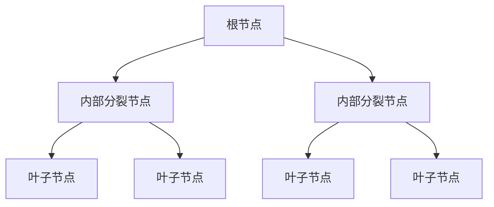
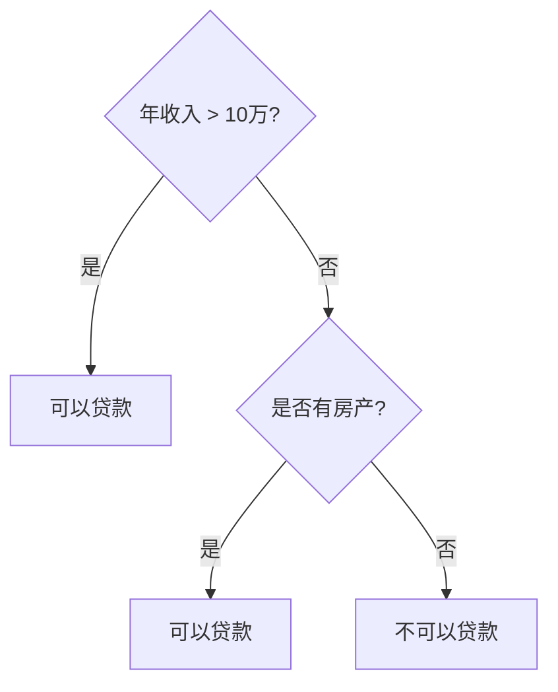
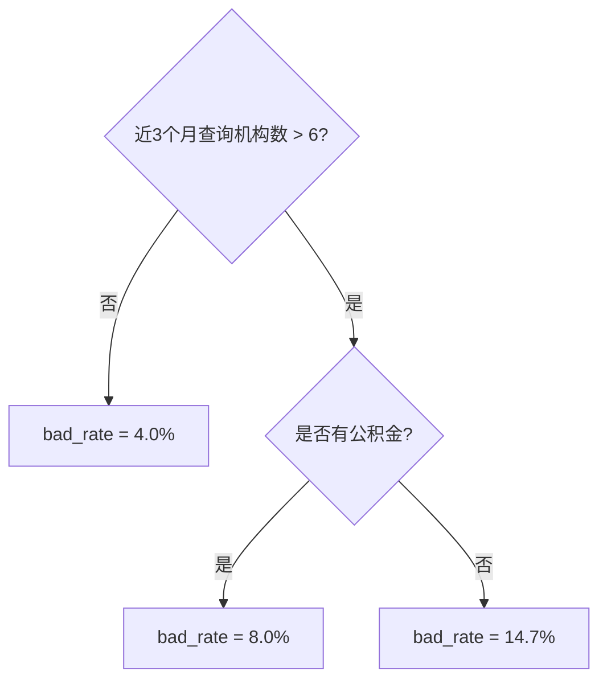

# 策略开发文档（最全完整合并版）

> 生成说明：本文件以 策略开发文档.md 为主文件，完整保留主文档全文；同时将 规则开发补充文档.md 的补充专题完整并入，避免摘要式压缩导致信息缺失。
> 使用说明：前半部分为主文档原文，后半部分为补充专题全文。若需要进一步人工去重，可在此版本基础上继续精修，但当前版本优先保证“最全、完整、不丢信息”。

---

## 主文档原文

# 上传PDF内容完整提取整理（Markdown版）

> 本文件将上传的 PDF 逐页整理为 Markdown。处理口径：保留标题、正文、公式、表格、流程图/概念图说明；图片本身不保留，但已转写为文字、表格或 Mermaid 流程图。

> 说明：两个“规则泛化效果评估”PDF内容一致，文档3保留完整整理，文档4逐页标注为重复文件，避免重复占用阅读空间。

## 文件清单

- 文档1：07-WOE和IV计算应用（15页）
- 文档2：Lift提升度指标计算（7页）
- 文档3：规则泛化效果评估（理论篇）（8页）
- 文档4：规则泛化效果评估（理论篇，重复文件）（8页）
- 文档5：规则生成：决策树（含实操）（22页）
- 文档6：规则篇：基于交叉表生成规则（理论介绍）（14页）
- 文档7：规则篇：基于单变量生成规则（理论介绍）（19页）
- 文档8：规则篇：规则集认识和结构（8页）
- 文档9：规则集性能测试：理论介绍（8页）

---


# 文档1：07-WOE和IV计算应用

- 原文件名：`07-WOE和IV计算应用-已加水印 (1)-已解锁(7).pdf`
- 页数：15

## 第 1 页：一、WOE的概念、理解、计算

**正文：**
（本页主要为章节标题或封面，无更多正文。）

**表格 / 图示 / 公式说明：**
本页未发现需要额外重建的复杂表格或图示；页面主要信息已在正文中转写。

---

## 第 2 页：1.1. 什么是WOE？

**正文：**
- 1）WOE公式
WOE（Weight of Evidence ）证据权重，是变量的一种编码方法，属于有监督学习的编码类型。
WOE编码计算需要两个前提条件：1）样本需匹配Y标签，即确定好客户还是坏客户；2）需提前对变量进行
分箱操作，按照适合的统计数量进行划分。具体公式如下：
公式符号含义：
- 
Bad_i：每个分箱内的坏客户数量
- 
Bad_T：总的坏客户数量，即所有分箱坏客户数量求和
- 
Good_i：每个分箱内的好客户数量
- 
Good_T：总的好客户数量，即所有分箱好客户数量求和
边际好/坏客户占比之差
分箱坏好比与总体坏好比之差

**表格 / 图示 / 公式说明：**
**公式重建：**

$$
WOE_i=\ln\left(\frac{Bad_i/Bad_T}{Good_i/Good_T}\right)
=\ln\left(\frac{Bad_i}{Good_i}\right)-\ln\left(\frac{Bad_T}{Good_T}\right)
$$

图中两层含义：一是“边际好/坏客户占比之差”；二是“分箱坏好比与总体坏好比之差”。

---

## 第 3 页：1.2. WOE计算示例

**正文：**
- 2）WOE计算过程
以下为某连续型变量分箱后进行的WOE编码计算过程。
以第一箱(bins=1)为例：
margin_bad_rate(边际坏占比) = 5/215=2.33%
margin_good_rate(边际好占比) = 195/1385=14.08%
WOE = ln(margin_bad_rate) – ln(margin_good_rate) = ln(2.33%)-ln(14.08%)=-1.80
- ①分箱
- ②边际坏占比
- ③边际好占比
- ④计算WOE

**表格 / 图示 / 公式说明：**
**表格重建：WOE计算示例。**

| bins | total | good | bad | bad_rate | margin_bad_rate | margin_good_rate | WOE | IV |
|---:|---:|---:|---:|---:|---:|---:|---:|---:|
| 1 | 200 | 195 | 5 | 2.5% | 2.33% | 14.08% | -1.80 | 0.21 |
| 2 | 200 | 190 | 10 | 5.0% | 4.65% | 13.72% | -1.08 | 0.10 |
| 3 | 200 | 185 | 15 | 7.5% | 6.98% | 13.36% | -0.65 | 0.04 |
| 4 | 200 | 180 | 20 | 10.0% | 9.30% | 13.00% | -0.33 | 0.01 |
| 5 | 200 | 175 | 25 | 12.5% | 11.63% | 12.64% | -0.08 | 0.00 |
| 6 | 200 | 165 | 35 | 17.5% | 16.28% | 11.91% | 0.31 | 0.01 |
| 7 | 200 | 155 | 45 | 22.5% | 20.93% | 11.19% | 0.63 | 0.06 |
| 8 | 200 | 140 | 60 | 30.0% | 27.91% | 10.11% | 1.02 | 0.18 |
| total | 1600 | 1385 | 215 | 13.4% | 100.00% | 100.00% |  | 0.62 |

第一箱计算：`margin_bad_rate=5/215=2.33%`，`margin_good_rate=195/1385=14.08%`，`WOE=ln(2.33%)-ln(14.08%)=-1.80`。

---

## 第 4 页：1.3. WOE的含义

**正文：**
- 3）WOE的含义
通过下面示例观察，每个分箱都有一个对应的WOE值，其值有如下含义：
- 
WOE越大，bad_rate越高。
- 
WOE值描述了样本是否属于坏客户的方向和大小。当WOE为正时，说明客户是坏客户的方向，当WOE为
负时，说明客户不是坏客户的方向。而值的大小则说明了在方向上的影响程度，值越大越倾向坏客户。
- 
WOE的取值范围是全体实数，经验上取值在(-3,3)之间。

**表格 / 图示 / 公式说明：**
**图表说明：**表格展示 bad_rate 从 2.5% 逐箱上升至 30.0%，对应 WOE 从 -1.80 上升至 1.02。WOE越大，区间坏账率越高，越倾向于坏客户方向。

| bins | total | good | bad | bad_rate | margin_bad_rate | margin_good_rate | WOE | IV |
|---:|---:|---:|---:|---:|---:|---:|---:|---:|
| 1 | 200 | 195 | 5 | 2.5% | 2.33% | 14.08% | -1.80 | 0.21 |
| 2 | 200 | 190 | 10 | 5.0% | 4.65% | 13.72% | -1.08 | 0.10 |
| 3 | 200 | 185 | 15 | 7.5% | 6.98% | 13.36% | -0.65 | 0.04 |
| 4 | 200 | 180 | 20 | 10.0% | 9.30% | 13.00% | -0.33 | 0.01 |
| 5 | 200 | 175 | 25 | 12.5% | 11.63% | 12.64% | -0.08 | 0.00 |
| 6 | 200 | 165 | 35 | 17.5% | 16.28% | 11.91% | 0.31 | 0.01 |
| 7 | 200 | 155 | 45 | 22.5% | 20.93% | 11.19% | 0.63 | 0.06 |
| 8 | 200 | 140 | 60 | 30.0% | 27.91% | 10.11% | 1.02 | 0.18 |
| total | 1600 | 1385 | 215 | 13.4% | 100.00% | 100.00% |  | 0.62 |

---

## 第 5 页：1.4. WOE公式的进一步理解

**正文：**
- 4）WOE的公式理解
- ①
一般公式含义：表示每个分箱里的坏好比(Odds)相对于总体的坏好比之间的差异性
第i个分箱的WOE = ln (第i个分箱的坏人数 / 第i个分箱的好人数) - ln (总坏人数 / 总好人数)
- ②
贝叶斯角度含义：用以衡量对先验认识修正的增量
参考链接：https://zhuanlan.zhihu.com/p/80134853
先验
后验
修正增量

**表格 / 图示 / 公式说明：**
**公式与概念图重建：**

- 一般 odds 视角：第 i 箱的 WOE 等于“该箱坏好比”相对“总体坏好比”的对数差。
- 贝叶斯视角：WOE 可理解为后验认知相对先验认知的修正增量。

$$
\ln\frac{P(Y=Bad\mid X)}{P(Y=Good\mid X)}
=\ln\frac{P(X\mid Y=Bad)}{P(X\mid Y=Good)}
+\ln\frac{P(Y=Bad)}{P(Y=Good)}
$$

其中：

$$
WOE=\ln\frac{Bad_i/Bad_T}{Good_i/Good_T}
$$

---

## 第 6 页：1.5. 为什么要做WOE？

**正文：**
- 5）WOE的优点
对于使用逻辑回归算法的评分卡模型来说，为什么要做WOE编码的转换呢？
- ①
增强泛化能力
- 将取值较多的连续型变量转换成固定的分箱WOE值（一般不超过8个），一定程度上可以增加泛化能力
- ②
可解释性
- WOE值的正负关系可以代表离散区间样本的好坏程度，有较好的解释意义
- WOE值的分布可以体现出数据分布的单调性趋势，便于特征变量的筛选
- ③
变量稳定性
- 分箱可以对变量取值起到平滑处理作用（比如说年龄异常值为300，分在年龄>60这箱里，排除异常值的影响；再比如对
缺失值可以单独分一箱处理），提高了变量的鲁棒性
- WOE编码对原数据有标准化的意义，将所有变量转换为统一的量纲下，利于逻辑回归线性模型的拟合
- ④
IV值计算基础
- WOE值转换后更便于IV值的推导与分析

**表格 / 图示 / 公式说明：**
本页未发现需要额外重建的复杂表格或图示；页面主要信息已在正文中转写。

---

## 第 7 页：1.6. WOE的注意事项

**正文：**
- 6）WOE的注意事项
- ①
最小数量
- 为确保有统计意义，每箱样本数量不能过少，占比一般要求5%以上。
- ②
极值处理
- 分箱内可能会出现只有坏客户或只有好客户的情况，当0作为分母计算时，可能会导致计算报错。
- ③
缺失值处理
- 在分箱时，通常将缺失值单独分为一箱。因为缺失值和非缺失值是无法比较的，因此看变量区间坏账率单调性时，可将缺
失值一箱忽略不计，只看非缺失分箱的单调性。
- ④
分箱数量
- 分箱数量不易过多，一般来说不要超过8箱。因为IV是建立在WOE基础上计算出来的，箱数越多，会导致IV值越大，对
变量筛选不公平。
- ⑤
分箱合并
- 如果相邻分箱的WOE值相同，则将其合并为一个分箱

**表格 / 图示 / 公式说明：**
本页未发现需要额外重建的复杂表格或图示；页面主要信息已在正文中转写。

---

## 第 8 页：二、IV的概念、理解、评估标准

**正文：**
（本页主要为章节标题或封面，无更多正文。）

**表格 / 图示 / 公式说明：**
本页未发现需要额外重建的复杂表格或图示；页面主要信息已在正文中转写。

---

## 第 9 页：2.1. 什么是IV？

**正文：**
- 1）IV公式
IV（Information Value）是用来衡量变量预测能力的，它在WOE基础上做了一定的加权，具体公式如下：
公式符号含义：
- Bad_i：每个分箱内的坏客户数量
- Bad_T：总的坏客户数量，即所有分箱坏客户数量求和
- Good_i：每个分箱内的好客户数量
- Good_T：总的好客户数量，即所有分箱好客户数量求和
- WOE_i：每个分箱的WOE值
- IV_i：每个分箱的IV值
- IV：变量的IV值，即所有分箱IV值之和

**表格 / 图示 / 公式说明：**
**IV公式重建：**

$$
IV_i=\left(\frac{Bad_i}{Bad_T}-\frac{Good_i}{Good_T}\right)\times WOE_i
$$

$$
IV=\sum_{i=1}^{n} IV_i
$$

---

## 第 10 页：2.2. IV计算示例

**正文：**
- 2）IV计算过程
以第一箱(bins=1)为例：
margin_bad_rate(边际坏占比) = 5/215=2.33%
margin_good_rate(边际好占比) = 195/1385=14.08%
WOE = ln(margin_bad_rate) – ln(margin_good_rate) = ln(2.33%)-ln(14.08%)=-1.80
IV = (margin_bad_rate - margin_bad_rate)*WOE = (2.33%-14.08%)*(-1.80) = 0.21
变量总IV值 = 0.21+0.10+0.04+…+0.06+0.18=0.62

**表格 / 图示 / 公式说明：**
**表格重建：IV计算示例。**

| bins | total | good | bad | bad_rate | margin_bad_rate | margin_good_rate | WOE | IV |
|---:|---:|---:|---:|---:|---:|---:|---:|---:|
| 1 | 200 | 195 | 5 | 2.5% | 2.33% | 14.08% | -1.80 | 0.21 |
| 2 | 200 | 190 | 10 | 5.0% | 4.65% | 13.72% | -1.08 | 0.10 |
| 3 | 200 | 185 | 15 | 7.5% | 6.98% | 13.36% | -0.65 | 0.04 |
| 4 | 200 | 180 | 20 | 10.0% | 9.30% | 13.00% | -0.33 | 0.01 |
| 5 | 200 | 175 | 25 | 12.5% | 11.63% | 12.64% | -0.08 | 0.00 |
| 6 | 200 | 165 | 35 | 17.5% | 16.28% | 11.91% | 0.31 | 0.01 |
| 7 | 200 | 155 | 45 | 22.5% | 20.93% | 11.19% | 0.63 | 0.06 |
| 8 | 200 | 140 | 60 | 30.0% | 27.91% | 10.11% | 1.02 | 0.18 |
| total | 1600 | 1385 | 215 | 13.4% | 100.00% | 100.00% |  | 0.62 |

> 原页公式中“IV = (margin_bad_rate - margin_bad_rate) * WOE”应按上下文理解为 `IV=(margin_bad_rate-margin_good_rate)*WOE`。第一箱：`(2.33%-14.08%)*(-1.80)=0.21`；变量总IV约为 `0.62`。

---

## 第 11 页：2.3. IV和WOE的关系

**正文：**
- 3）IV和WOE的关系
WOE表示每个分箱里的坏好比(Odds)相对于总体的坏好比之间的差异性，但未考虑分组中的样本占整体样
本比例的因素，而IV则增加了样本权重的因素。如果一个分组的WOE值很高，但是样本数占整体样本数很低，虽
然组内坏好比差异大，但并不能真实反映变量整体的预测能力。
背景：case2在case1基
础上做了一些改动，样
本数量由200变为50，
保持bad_rate不变，对
比WOE和IV的变化。
观察结果：case2第8箱
的WOE为1.17，高于
case1的1.02，但是IV
值却只有0.07，远低于
case1的0.18
case1
case2

**表格 / 图示 / 公式说明：**
**图表重建：case1 / case2 对比。**

case1 为等量分箱，每箱 total=200，总样本 1600；case2 将第8箱 total 从 200 改为 50，且保持该箱 bad_rate=30.0%。结论是：case2 第8箱 WOE=1.17，高于 case1 的 1.02，但 case2 第8箱 IV=0.07，低于 case1 的 0.18；原因是 IV 加入了样本权重，样本占比低会降低变量整体预测贡献。

**case1 第8箱与总计：**

| case | bins | total | good | bad | bad_rate | margin_bad_rate | margin_good_rate | WOE | IV |
|---|---:|---:|---:|---:|---:|---:|---:|---:|---:|
| case1 | 8 | 200 | 140 | 60 | 30.0% | 27.91% | 10.11% | 1.02 | 0.18 |
| case1 | total | 1600 | 1385 | 215 | 13.4% | 100.00% | 100.00% |  | 0.62 |

**case2 第8箱与总计：**

| case | bins | total | good | bad | bad_rate | margin_bad_rate | margin_good_rate | WOE | IV |
|---|---:|---:|---:|---:|---:|---:|---:|---:|---:|
| case2 | 8 | 50 | 35 | 15 | 30.0% | 8.82% | 2.73% | 1.17 | 0.07 |
| case2 | total | 1450 | 1280 | 170 | 11.7% | 100.00% | 100.00% |  | 0.54 |

---

## 第 12 页：2.4. IV的应用

**正文：**
- 4）IV的应用
在评分卡建模过程中，IV值通常用来筛选变量。IV值越大，代表好坏区分能力越强。
其评价标准可参考以下：
- ①
不同风控场景下的变量预测能力是各有差异的。例如，贷中的行为变量（额度使用率、逾期行为等）和
预测目标的关联性更强，所以其IV值一般会非常高，和贷前授信审批时的多头、负债等变量相比效果更
强。因此，在做ABC卡时，对于变量IV值的筛选标准也需要差异化对待。
- ②
建模筛选变量需要考虑变量IV的相对值。例如，在一些建模环境下（比如某维度数据的子模型）缺少有
效区分的变量，可能所有变量IV值均小于0.1，此时需要看IV相对值选择更优的。

**表格 / 图示 / 公式说明：**
**表格重建：IV评价标准。**

| IV值区间 | 区分效果 |
|---|---|
| <= 0.02 | 微弱 |
| (0.02, 0.1] | 弱 |
| (0.1, 0.3] | 中 |
| (0.3, 0.5] | 强 |
| > 0.5 | 超强 |

---

## 第 13 页：2.5. IV的注意事项

**正文：**
- 5）IV的注意事项
- ①
IV是非负值
- ②
同一变量的分组越多，IV值越大
- 分组过多会使每个分组数量变少，导致分布不稳定；同时分组多可能会打破变量的单调性。因此基于IV值筛选
变量时，不能为了提高IV值一味地将分箱的数目提高，也要兼顾变量的业务含义和分布的稳定性。
- ③
IV值异常高，需要排除是否有“数据穿越”
- IV值代表变量和预测目标之间的关系，如果IV值高的离谱，比如贷前变量IV>0.5或者贷中IV>1，则需要检查是
否存在数据穿越的问题。因为数据穿越是建模的作弊行为，会导致过拟合，线上效果变差不达预期。
- 如果某一分箱下全部为坏客户数，则权重会变为100%，导致该分箱的IV值异常高，进而导致变量整体IV
- ④
调整分箱时，注意IV值陷阱
值也升
高。此时的高IV值并不代表变量真实的预测能力。

**表格 / 图示 / 公式说明：**
本页未发现需要额外重建的复杂表格或图示；页面主要信息已在正文中转写。

---

## 第 14 页：2.6. WOE和IV的Python代码实现

**正文：**
- 6）Python代码
- ①
Python手动实现公式

**表格 / 图示 / 公式说明：**
**代码截图转写：Python手动实现WOE/IV的核心逻辑。**

```python
def feature_woe_iv(x, y, boundary=None, nan=-1):
    x = x.fillna(nan)
    split = boundary if boundary else optimal_binning_boundary(x, y, nan)
    df = pd.concat([x, y], axis=1)
    df.columns = ["x", "y"]
    df["bins"] = pd.cut(x=df["x"], bins=split, right=False)
    grouped = df.groupby("bins")["y"]
    result_df = grouped.agg([
        ("good", lambda s: (s == 0).sum()),
        ("bad",  lambda s: (s == 1).sum()),
        ("total", "count")
    ])
    result_df["good_pct"] = result_df["good"] / result_df["good"].sum()
    result_df["bad_pct"] = result_df["bad"] / result_df["bad"].sum()
    result_df["total_pct"] = result_df["total"] / result_df["total"].sum()
    result_df["bad_rate"] = result_df["bad"] / result_df["total"]
    result_df["woe"] = np.log(result_df["bad_pct"] / result_df["good_pct"])
    result_df["iv"] = (result_df["bad_pct"] - result_df["good_pct"]) * result_df["woe"]
    result_df["feature"] = x.name
    iv_value = result_df["iv"].sum()
    return result_df, iv_value
```

---

## 第 15 页：6）Python代码

**正文：**
- ②
scorecardpy
scorecardpy官方文档：https://shichen.name/scorecard/index.html
- ③
toad
Toad官方文档：https://toad.readthedocs.io/en/stable/tutorial_chinese.html
2.6. WOE和IV的Python代码实现

**表格 / 图示 / 公式说明：**
**代码截图转写：三方包实现。**

```python
# scorecardpy
import scorecardpy as sc
nm = df_1.columns.difference(["ID"]).tolist()
sc.iv(df_1[nm], y="target")
```

scorecardpy示例输出字段包括 `variable / info_value`，截图示例中变量如 `certId_dist_ratio`、`lmt`、`bankCard_last3_edu_encoder` 等输出对应 IV 值。

```python
# toad
import toad
toad.quality(df_1, "target", iv_only=True)
```

toad示例输出字段包括 `iv / gini / entropy / unique`。页面给出官方文档链接：scorecardpy `https://shichen.name/scorecard/index.html`；toad `https://toad.readthedocs.io/en/stable/tutorial_chinese.html`。

---


# 文档2：Lift提升度指标计算

- 原文件名：`Lift提升度指标计算-已解锁(7).pdf`
- 页数：7

## 第 1 页：Lift提升度指标计算

**正文：**
（本页主要为章节标题或封面，无更多正文。）

**表格 / 图示 / 公式说明：**
本页未发现需要额外重建的复杂表格或图示；页面主要信息已在正文中转写。

---

## 第 2 页：1. 什么是Lift？

**正文：**
Lift（提升度）是评估模型或者规则是否有效的一个度量指标，它表示模型或规则对于目标用户的预测能力
相对于随机预测的提升程度（倍数）。
Lift提升度最初是应用在营销场景中的，举个例子，比如现在我们给100个客户营销，其中有10个响应，那
么响应率就是10%，这是我们不使用任何手段的条件下随机营销的结果。对于这个结果公司可能不满意，于是针
对该场景开发了营销响应模型，通过模型的预测结果进行营销。现在使用模型预测结果对其它条件相同的100个
客户营销，发现有30个客户响应，那么响应率就是30%。从10%到30%，响应率指标提升了3倍，这个就是Lift
提升度，用来衡量模型相对于随机情况下的效用，倍数越高代表提升越多，效果越好。
Lift提升度的指标不仅限于营销场景，也可以应用在风控场景中。本质是一样的，只是场景不同。比如现在
我们有样本数量有5000个，其中坏客户数500个，坏客户浓度为10%。如果我们从中“随机地”选择500个通过，
那么则有差不多500*10%=50个坏客户。但如果我们使用了“风控模型或规则”对样本预测并排序，只选择结果
最好的500个通过，假设这500个客户全部用信并且最终坏账的只有10户。那么和随机选择相比，模型或规则的
应用就是有效的。

**表格 / 图示 / 公式说明：**
本页未发现需要额外重建的复杂表格或图示；页面主要信息已在正文中转写。

---

## 第 3 页：2. Lift计算逻辑

**正文：**
Lift = 分箱下的区间坏账率/总样本坏账率。计算步骤为：
- 1）首先对被计算对象（模型或规则）进行分箱，比如10等分或20等分的等频分箱
- 2）统计各箱体下的样本数量、坏样本数量、区间坏账率；区间坏账率=每箱坏样本数/每箱总样本数；
- 3）计算“区间坏账率/总样本坏账率”

**表格 / 图示 / 公式说明：**
**表格重建：按区间坏账率计算Lift。**

| xgb_score | sum | bad_count | good_count | badrate | lift |
|---|---:|---:|---:|---:|---:|
| (205.388, 448.898] | 1000 | 150 | 850 | 15.00% | 3.00 |
| (448.898, 483.828] | 1000 | 100 | 900 | 10.00% | 2.00 |
| (483.828, 508.842] | 1000 | 70 | 930 | 7.00% | 1.40 |
| (508.842, 530.35] | 1001 | 50 | 951 | 5.00% | 1.00 |
| (530.35, 550.93] | 1001 | 45 | 956 | 4.50% | 0.90 |
| (550.93, 570.996] | 998 | 35 | 963 | 3.51% | 0.70 |
| (570.996, 592.425] | 1000 | 20 | 980 | 2.00% | 0.40 |
| (592.425, 618.716] | 1000 | 15 | 985 | 1.50% | 0.30 |
| (618.716, 654.116] | 1000 | 10 | 990 | 1.00% | 0.20 |
| (654.116, 852.1] | 1000 | 5 | 995 | 0.50% | 0.10 |
| all | 10000 | 500 | 9500 | 5.00% | 1.00 |

---

## 第 4 页：2. Lift计算逻辑

**正文：**
Lift = 累计坏样本占比/累计总样本占比。计算步骤为：
- 1）首先对被计算对象（模型或规则）进行分箱，比如10等分的等频分箱
- 2）统计各箱体下的样本数量、坏样本数量、累计坏样本占比、累计总样本占比；
数/总的坏样本数；总样本占比=每箱样本数/
坏样本占比=每箱坏样本
总的样本数。
- 3）计算“累计坏样本占比/累计总样本占比”

**表格 / 图示 / 公式说明：**
**表格重建：按累计坏样本占比 / 累计总样本占比计算累计Lift。**

| xgb_score | sum | bad_count | good_count | badpct | allpct | cum_badpct | cum_allpct | cum_lift |
|---|---:|---:|---:|---:|---:|---:|---:|---:|
| (205.388, 448.898] | 1000 | 150 | 850 | 30.00% | 10.00% | 30.00% | 10.00% | 3.00 |
| (448.898, 483.828] | 1000 | 100 | 900 | 20.00% | 10.00% | 50.00% | 20.00% | 2.50 |
| (483.828, 508.842] | 1000 | 70 | 930 | 14.00% | 10.00% | 64.00% | 30.00% | 2.13 |
| (508.842, 530.35] | 1001 | 50 | 951 | 10.00% | 10.01% | 74.00% | 40.01% | 1.85 |
| (530.35, 550.93] | 1001 | 45 | 956 | 9.00% | 10.01% | 83.00% | 50.02% | 1.66 |
| (550.93, 570.996] | 998 | 35 | 963 | 7.00% | 9.98% | 90.00% | 60.00% | 1.50 |
| (570.996, 592.425] | 1000 | 20 | 980 | 4.00% | 10.00% | 94.00% | 70.00% | 1.34 |
| (592.425, 618.716] | 1000 | 15 | 985 | 3.00% | 10.00% | 97.00% | 80.00% | 1.21 |
| (618.716, 654.116] | 1000 | 10 | 990 | 2.00% | 10.00% | 99.00% | 90.00% | 1.10 |
| (654.116, 852.1] | 1000 | 5 | 995 | 1.00% | 10.00% | 100.00% | 100.00% | 1.00 |
| all | 10000 | 500 | 9500 | 100.00% | 100.00% |  |  |  |

---

## 第 5 页：3. Lift应用和评估标准

**正文：**
应用对象
Lift
况下的提升倍数，值越高代表提升越高，效果越好。同时，
提升度可以应用在模型、规则上。模型的输出结果为一个概率或者概率转化后的分数，可以作为风险分
层使用，也可以作为强规则使用。当模型作为规则使用时，模型和规则本质一样，此时Lift用于评估相较随机情
Lift值的大小也可用来作为制定阈值cutoff的标准。
评估标准
Lift指标的数值以“1”为界线，代表的含义列举如下。那Lift指标具体要达到多少比较合适？这个需要结
合具体的业务成本等指标综合分析确定。在信贷业务场景中，一般情况下，如果大于3说明有较好的提升效果。
与1比较
含义
Lift值大于1
表示预测能力优于随机预测，且值越高预测能力越强。
Lift值等于1
表示预测能力与随机预测相同，即没有提供额外的预测能力，和盲猜一样。
Lift值小于1
表示预测能力不如随机预测，即预测准确率比盲猜都低，起反作用。

**表格 / 图示 / 公式说明：**
**表格重建：Lift 与 1 的比较。**

| 与1比较 | 含义 |
|---|---|
| Lift值大于1 | 表示预测能力优于随机预测，且值越高预测能力越强。 |
| Lift值等于1 | 表示预测能力与随机预测相同，即没有提供额外预测能力，和盲猜一样。 |
| Lift值小于1 | 表示预测能力不如随机预测，即预测准确率比盲猜还低，起反作用。 |

---

## 第 6 页：4. Lift计算的Python代码

**正文：**
Lift = 累计坏样本占比/累计总样本占比
Lift = 分箱下的区间坏账率/总样本坏账率

**表格 / 图示 / 公式说明：**
**代码图示说明：**页面展示两种Lift计算方式的Python实现：

- `Lift = 累计坏样本占比 / 累计总样本占比`
- `Lift = 分箱下的区间坏账率 / 总样本坏账率`

代码截图中核心字段包括分箱、总样本数、坏样本数、好样本数、区间坏账率、分箱Lift、累计坏样本占比、累计总样本占比、累计Lift。

---

## 第 7 页：4. Lift-chart可视化

**正文：**
一般来说，Lift越平滑，
并且越陡峭，效果越好。

**表格 / 图示 / 公式说明：**
**图表说明：**页面左侧为绘制 Lift-chart 的代码，右侧为两张折线图。两张图均显示 Lift 从左到右递减。一般而言，模型或规则在头部样本越能集中坏样本，Lift 曲线越陡峭；曲线越平滑且越陡峭，效果越好。

---


# 文档3：规则泛化效果评估（理论篇）

- 原文件名：`规则泛化效果评估(1)：理论篇 (1)_unlocked(7).pdf`
- 页数：8

## 第 1 页：规则泛化效果评估

**正文：**
（本页主要为章节标题或封面，无更多正文。）

**表格 / 图示 / 公式说明：**
本页未发现需要额外重建的复杂表格或图示；页面主要信息已在正文中转写。

---

## 第 2 页：目录

**正文：**
一、规则泛化效果评估
1.1. 概念理解
1.2. 分析流程
1.3. 逾期率效果评估—泛化样本
1.4. 逾期率效果评估—评估指标
1.5. 通过率效果评估
二、规则泛化效果评估(案例)

**表格 / 图示 / 公式说明：**
本页未发现需要额外重建的复杂表格或图示；页面主要信息已在正文中转写。

---

## 第 3 页：一、规则泛化效果评估

**正文：**
（本页主要为章节标题或封面，无更多正文。）

**表格 / 图示 / 公式说明：**
本页未发现需要额外重建的复杂表格或图示；页面主要信息已在正文中转写。

---

## 第 4 页：1.1. 概念理解

**正文：**
筛选规则的评估指
标：命中率、精准
率、召回率
评估对业务的
影响：逾期率、
通过率
当规则生成并筛选完成后，还需要对规则进行泛化效果评估，这里的效果评估和前面提到的规则评估
指标不一样，有不一样的含义。
- ①
规则生成后：需要通过命中率、精准率、召回率等指标筛选出符合要求的规则；
- ②
规则筛选后：需要用分析样本以外的其他样本来评估规则对业务的影响，主要关注逾期率、通过率；该
评估方式可针对单个规则，也可以针对整个规则集；

**表格 / 图示 / 公式说明：**
**流程图转写：规则离线开发和评估。**


---

## 第 5 页：最后一个环节

**正文：**
1.2. 分析流程
泛化效果评估的一般分析流程如下，对于评估逾期率、通过率均适用。
- ①
选择合适的泛化样本；
- ②
将规则所涉及的底层变量进行回溯和加工；
- ③
基于宽表变量复现规则或规则集，应用在泛化样本上；
- ④
评估规则在泛化样本上的效果，并与分析样本进行对比；
但我们要注意一点，虽然规则泛化效果评估是规则整体离线开发过程的最后一个环节，但在准备开发
规则的前期就需要梳理好全盘的工作内容，泛化样本的设计方案一般都是提前制定好的，并且和分析样本一
次性的进行变量回溯，这样可以避免因为回溯而造成开发时间的延迟。

**表格 / 图示 / 公式说明：**
**流程图转写：规则离线开发和评估。**


**补充说明：**效果评估是规则整体离线开发流程的最后环节，但泛化样本设计和变量回溯要提前规划。

---

## 第 6 页：1.3. 逾期率效果评估—泛化样本

**正文：**
泛化评估的基本逻辑是：通过历史数据推演规则来预测未来。在信贷风控中也是同理，规则制定完成
后是要上线并且预测未来申请客户风险的，为了规则在线上能够有好的风险识别效果，上线前需要检验规则
的泛化能力，即在分析样本后的时间外样本（OOT）上进行风险效果评估。
对于分析样本的选择有以下几点要求：
- ①
时间外样本时间窗口需在分析样本之后；
- ②
时间外样本数量需满足统计意义上的最小数量要求，一般选取3个月以上的样本，并按月分别评估；
- ③
时间外样本需要和分析样本一样，具有一定的贷后时间表现；
- ④
时间外样本的客群与风险水平与分析样本相同；

**表格 / 图示 / 公式说明：**
**时间轴转写：逾期率泛化样本。**

- 分析样本：示例为 12 个月分析样本，时间约从 2021-11-01 到 2022-11-01。
- 时间外样本（OOT）：示例为分析样本之后的 3 个月，约 2022-11-01 到 2023-01-01。
- 观察截止：示例延伸到 2024-01-01，以确保 OOT 样本有足够贷后表现。

核心逻辑：用历史数据推演规则来预测未来，因此上线前要在分析样本之后的 OOT 样本上检验规则的风险识别能力。

---

## 第 7 页：1.4. 逾期率效果评估—评估指标

**正文：**
当完成分析流程前三个步骤后，需要评估规则在时间外样本上的效果，关于逾期率评估指标主要有：
命中率、精准率、召回率、LIFT提升度、逾期率下降幅度等。
- 命中率：规则命中样本数/样本总数
- 精准率：规则命中样本中坏客户数/规则命中样本数
- 召回率：规则命中样本中坏客户数/样本总坏客户数
- lift提升度：精准率/样本总的坏账率badrate
- 逾期率下降幅度：(样本总的坏账率-规则通过样本坏账率)/样本总的坏账率
对分析样本和时间外样本分别计算规则应用后的以上指标，并进行对比。如果时间外样本上的指标在
分析样本指标的一定范围内浮动，则说明泛化样本上效果达标，如果超出范围下降严重则说明不达标，浮动
范围一般不超过10%，严格的不超过5%。
比如，分析样本lift值为3，时间外样本lift为1，效果衰减严重相差甚远则为过拟合，需要重新调整规则；
如时间外样本lift为2.7-3.3之间，在不超过10%范围内浮动，则说明规则的泛化能力达标。

**表格 / 图示 / 公式说明：**
**公式重建：逾期率效果评估指标。**

$$命中率=\frac{规则命中样本数}{样本总数}$$

$$精准率=\frac{规则命中样本中的坏客户数}{规则命中样本数}$$

$$召回率=\frac{规则命中样本中的坏客户数}{样本总坏客户数}$$

$$Lift=\frac{精准率}{样本总坏账率}$$

$$逾期率下降幅度=\frac{样本总坏账率-规则通过样本坏账率}{样本总坏账率}$$

---

## 第 8 页：1.5. 通过率效果评估

**正文：**
在逾期率效果评估时，我们已经完成了通过率统计，即（1-命中率）。但有一个问题需要注意：时间
外样本因需要有足够时长的贷后表现，样本时间窗口距离当前一般比较久远，客群可能发生变化，对于评估
通过率可能不是非常准确。
那么如何准确的评估规则应用后对业务的通过率影响呢？
评估通过率无需贷后表现，因此可以用距离当前比较近的新鲜样本来测算。
评估逾期率
的泛化样本
评估通过率
的泛化样本
评估通过率的指标只需看命中率（通过率）即可，主要看在泛化样本上应用规则前后的通过率变化。
但需要注意的是，评估通过率所用的泛化样本也需要进行变量回溯，因此也需要提前规划好。

**表格 / 图示 / 公式说明：**
**时间轴转写：通过率泛化样本。**

- 逾期率泛化样本需要足够贷后表现，通常距离当前较久，可能不适合准确评估当前通过率影响。
- 通过率泛化样本不需要贷后表现，可以选择距离当前更近的新鲜样本。
- 通过率评估指标主要看命中率和通过率变化；但新鲜样本也需要提前进行变量回溯。

---


# 文档4：规则泛化效果评估（理论篇，重复文件）

- 原文件名：`规则泛化效果评估(1)：理论篇-已解锁(7).pdf`
- 页数：8
- 内容状态：与文档3重复，已逐页标注。

## 第 1 页：规则泛化效果评估

**正文：**
（本页主要为章节标题或封面，无更多正文。）

**表格 / 图示 / 公式说明：**
**重复文件说明：**本页与“文档3：规则泛化效果评估（理论篇）”第 1 页内容一致。为避免重复冗余，请参考文档3对应页的完整正文、公式和图示说明。

---

## 第 2 页：目录

**正文：**
一、规则泛化效果评估
1.1. 概念理解
1.2. 分析流程
1.3. 逾期率效果评估—泛化样本
1.4. 逾期率效果评估—评估指标
1.5. 通过率效果评估
二、规则泛化效果评估(案例)

**表格 / 图示 / 公式说明：**
**重复文件说明：**本页与“文档3：规则泛化效果评估（理论篇）”第 2 页内容一致。为避免重复冗余，请参考文档3对应页的完整正文、公式和图示说明。

---

## 第 3 页：一、规则泛化效果评估

**正文：**
（本页主要为章节标题或封面，无更多正文。）

**表格 / 图示 / 公式说明：**
**重复文件说明：**本页与“文档3：规则泛化效果评估（理论篇）”第 3 页内容一致。为避免重复冗余，请参考文档3对应页的完整正文、公式和图示说明。

---

## 第 4 页：1.1. 概念理解

**正文：**
筛选规则的评估指
标：命中率、精准
率、召回率
评估对业务的
影响：逾期率、
通过率
评估方式可针对单个规则，
当规则生成并筛选完成后，还需要对规则进行泛化效果评估，这里的效果评估和前面提到的规则评估
指标不一样，有不一样的含义。
- ①
规则生成后：需要通过命中率、精准率、召回率等指标筛选出符合要求的规则；
- ②
规则筛选后：需要用分析样本以外的其他样本来评估规则对业务的影响，主要关注逾期率、通过率；该
也可以针对整个规则集；

**表格 / 图示 / 公式说明：**
**重复文件说明：**本页与“文档3：规则泛化效果评估（理论篇）”第 4 页内容一致。为避免重复冗余，请参考文档3对应页的完整正文、公式和图示说明。

---

## 第 5 页：最后一个环节

**正文：**
1.2. 分析流程
泛化效果评估的一般分析流程如下，对于评估逾期率、通过率均适用。
- ①
选择合适的泛化样本；
- ②
将规则所涉及的底层变量进行回溯和加工；
- ③
基于宽表变量复现规则或规则集，应用在泛化样本上；
- ④
评估规则在泛化样本上的效果，并与分析样本进行对比；
但我们要注意一点，虽然规则泛化效果评估是规则整体离线开发过程的最后一个环节，但在准备开发
规则的前期就需要梳理好全盘的工作内容，泛化样本的设计方案一般都是提前制定好的，并且和分析样本一
次性的进行变量回溯，这样可以避免因为回溯而造成开发时间的延迟。

**表格 / 图示 / 公式说明：**
**重复文件说明：**本页与“文档3：规则泛化效果评估（理论篇）”第 5 页内容一致。为避免重复冗余，请参考文档3对应页的完整正文、公式和图示说明。

---

## 第 6 页：1.3. 逾期率效果评估—泛化样本

**正文：**
泛化评估的基本逻辑是：通过历史数据推演规则来预测未来。在信贷风控中也是同理，规则制定完成
后是要上线并且预测未来申请客户风险的，为了规则在线上能够有好的风险识别效果，上线前需要检验规则
的泛化能力，即在分析样本后的时间外样本（OOT）上进行风险效果评估。
对于分析样本的选择有以下几点要求：
- ①
时间外样本时间窗口需在分析样本之后；
- ②
时间外样本数量需满足统计意义上的最小数量要求，一般选取3个月以上的样本，并按月分别评估；
- ③
时间外样本需要和分析样本一样，具有一定的贷后时间表现；
- ④
时间外样本的客群与风险水平与分析样本相同；

**表格 / 图示 / 公式说明：**
**重复文件说明：**本页与“文档3：规则泛化效果评估（理论篇）”第 6 页内容一致。为避免重复冗余，请参考文档3对应页的完整正文、公式和图示说明。

---

## 第 7 页：1.4. 逾期率效果评估—评估指标

**正文：**
当完成分析流程前三个步骤后，需要评估规则在时间外样本上的效果，关于逾期率评估指标主要有：
命中率、精准率、召回率、LIFT提升度、逾期率下降幅度等。
- 命中率：规则命中样本数/样本总数
- 精准率：规则命中样本中坏客户数/规则命中样本数
- 召回率：规则命中样本中坏客户数/样本总坏客户数
- lift提升度：精准率/样本总的坏账率badrate
- 逾期率下降幅度：(样本总的坏账率-规则通过样本坏账率)/样本总的坏账率
对分析样本和时间外样本分别计算规则应用后的以上指标，并进行对比。如果时间外样本上的指标在
分析样本指标的一定范围内浮动，则说明泛化样本上效果达标，如果超出范围下降严重则说明不达标，浮动
范围一般不超过10%，严格的不超过5%。
比如，分析样本lift值为3，时间外样本lift为1，效果衰减严重相差甚远则为过拟合，需要重新调整规则；
如时间外样本lift为2.7-3.3之间，在不超过10%范围内浮动，则说明规则的泛化能力达标。

**表格 / 图示 / 公式说明：**
**重复文件说明：**本页与“文档3：规则泛化效果评估（理论篇）”第 7 页内容一致。为避免重复冗余，请参考文档3对应页的完整正文、公式和图示说明。

---

## 第 8 页：1.5. 通过率效果评估

**正文：**
在逾期率效果评估时，我们已经完成了通过率统计，即（1-命中率）。但有一个问题需要注意：时间
外样本因需要有足够时长的贷后表现，样本时间窗口距离当前一般比较久远，客群可能发生变化，对于评估
通过率可能不是非常准确。
那么如何准确的评估规则应用后对业务的通过率影响呢？
评估通过率无需贷后表现，因此可以用距离当前比较近的新鲜样本来测算。
评估逾期率
的泛化样本
评估通过率
的泛化样本
评估通过率的指标只需看命中率（通过率）即可，主要看在泛化样本上应用规则前后的通过率变化。
但需要注意的是，评估通过率所用的泛化样本也需要进行变量回溯，因此也需要提前规划好。

**表格 / 图示 / 公式说明：**
**重复文件说明：**本页与“文档3：规则泛化效果评估（理论篇）”第 8 页内容一致。为避免重复冗余，请参考文档3对应页的完整正文、公式和图示说明。

---


# 文档5：规则生成：决策树（含实操）

- 原文件名：`规则生成(3)：决策树(含实操)-已加水印_unlocked(7).pdf`
- 页数：22

## 第 1 页：第1页

**正文：**
（本页主要为章节标题或封面，无更多正文。）

**表格 / 图示 / 公式说明：**
本页未发现需要额外重建的复杂表格或图示；页面主要信息已在正文中转写。

---

## 第 2 页：目录

**正文：**
一、决策树概念
1.1. 什么是决策树？
1.2. 决策树的生成过程
二、决策树算法
2.1. 算法分类
2.2. CART分类树—基尼系数
2.3. CART分类树—变量二分法
2.4. CART分类树—递归生成
2.5. CART回归树—预测方式
2.6. CART回归树—残差平方和
三、决策树生成规则
3.1. 决策树规则生成过程
3.2. 决策树规则注意事项
四、Python代码案例实操
4.1. Sklearn.tree的API方法
4.2. Sklearn.tree的API参数
4.3. Python代码实操

**表格 / 图示 / 公式说明：**
本页未发现需要额外重建的复杂表格或图示；页面主要信息已在正文中转写。

---

## 第 3 页：一、决策树的概念

**正文：**
（本页主要为章节标题或封面，无更多正文。）

**表格 / 图示 / 公式说明：**
本页未发现需要额外重建的复杂表格或图示；页面主要信息已在正文中转写。

---

## 第 4 页：1.1. 什么是决策树？

**正文：**
决策树是一个if-then规则的集合，自顶向下按照某种度量标准不断地进行分裂，形状上如
同一个树形的结构。
在树结构中（如下图），包括两种类型的节点：分裂节点、末端节点。分裂节点按照特征
变量阈值的判断会向下分裂；而末端节点，也叫叶子节点是决策树的末梢终点，不会继续分裂。
分裂节点中又分根节点、内部分裂点，本质上是一样的，二者区别是根节点是决策树的起
始节点，而内部分裂点在决策树内部。

**表格 / 图示 / 公式说明：**
**树结构图转写：**



根节点是起始节点；内部分裂节点继续按变量阈值分裂；叶子节点是末端节点，不再继续分裂。

---

## 第 5 页：1.2. 决策树的生成过程

**正文：**
那么决策树是如何生成的呢？
简单来说，决策树从根节点开始，
在每个分裂节点均会按照“一定的度量
标准”从特征变量池中筛选出最合适的
变量以及变量对应的阈值，并不断地向
下分裂，直到达到某种条件后停止分裂，
最终输出叶子节点的数值或类别结果。
右侧示例就是决策树的一般生成过
程，相当于通过特征变量的选择对样本
的特征空间做非线性地划分，因此我们
说决策树也是一种“非线性模型”。

**表格 / 图示 / 公式说明：**
**图示转写：决策树生成示例。**

示例树：



右侧特征空间图表示：用“年收入”和“房产数量”两个特征将样本空间划分为不同区域；绿色区域为“可以贷款”，红色区域为“不可以贷款”。这体现了决策树对特征空间的非线性划分。

---

## 第 6 页：二、决策树算法

**正文：**
（本页主要为章节标题或封面，无更多正文。）

**表格 / 图示 / 公式说明：**
本页未发现需要额外重建的复杂表格或图示；页面主要信息已在正文中转写。

---

## 第 7 页：2.1. 算法分类

**正文：**
决策树有三种算法：ID3、C4.5、CART，其中ID3和C4.5用于分类，而CART既可以分类，也可
以回，并且是二叉树计算更快。下面我们以最常用的CART算法来举例说明，因为它也是后面模型篇
各种集成树模型的基础，是比较重要的。

**表格 / 图示 / 公式说明：**
**算法分类图转写：**

- ID3：用于分类；使用信息增益；通常只支持离散型数据，不能处理缺失值，不能剪枝。
- C4.5：用于分类；使用信息增益率；支持离散型和连续型数据，能处理缺失值，可以剪枝。
- CART：既可分类也可回归；分类树使用 Gini 系数，回归树使用残差平方和；支持离散型或连续型数据，能处理缺失值，可以剪枝；CART 是二叉树。

---

## 第 8 页：2.2. CART分类树—基尼系数

**正文：**
CART是 "Classification and Regression Trees" 的缩写，意思是 "分类回归树"。从它的名字
上就不难理解了，CART算法是既可以用于分类的，也可以用于回归的。
基尼系数(Gini)
CART分类树算法使用“基尼系数(Gini)”选择特征，基尼系数代表了模型的不纯度，基尼系数
越小，不纯度越低，特征越好。公式如下：
这个公式中，p(x_k)表示分类x_k出现的概率，K是分类的数目。比如在信贷风控中，我们的分
类是好坏客户只有两类，基尼指数就等于2p(1-p)。
当n=2时

**表格 / 图示 / 公式说明：**
**公式重建：CART分类树基尼系数。**

$$Gini(p)=\sum_{k=1}^{K}p(x_k)(1-p(x_k))=1-\sum_{k=1}^{K}p(x_k)^2$$

二分类时：

$$Gini(p)=2p(1-p)$$

---

## 第 9 页：2.2. CART分类树—基尼系数

**正文：**
对于给定的样本集合D，其基尼指数定义为：
其中，k 代表类别，Ck是D中属于第k类的样本子集。
当 CART 为二分类时，则在特征A的条件下，集合D的基尼指数定义为：

**表格 / 图示 / 公式说明：**
**公式重建：样本集合 D 的基尼指数。**

$$Gini(D)=\sum_{k=1}^{K}\frac{|C_k|}{|D|}\left(1-\frac{|C_k|}{|D|}\right)=1-\sum_{k=1}^{K}\left(\frac{|C_k|}{|D|}\right)^2$$

在特征 A 条件下：

$$Gini(D|A)=\sum_{i=1}^{n}\frac{|D_i|}{|D|}Gini(D_i)$$

二叉划分时：

$$Gini(D|A)=\frac{|D_1|}{|D|}Gini(D_1)+\frac{|D_2|}{|D|}Gini(D_2)$$

---

## 第 10 页：2.2. CART分类树—基尼系数

**正文：**
在信贷场景中我们想区分好坏客户，那么目标变量有两类：好客户和坏客户。我们举两个极端
的情况说明。
- 2）如果分裂后的节点中好客户占比100%，坏客户
占比0%或者反过来，基尼系数为0，不纯度达到最小值，
此时区分效果最强，完全是好或者坏客户，一边倒。
- 1）如果分裂后的节点中好坏客户各占50%，此时
基尼指数为0.5，不纯度达到最大值，说明完全没有任何
区分效果。
基尼指数反映了从数据集D中随机抽取两个样本，其类别标记不一致的概率。因此，Gini(D)越
小，则数据集D的纯度越高。

**表格 / 图示 / 公式说明：**
**图示说明：Gini极端情况。**

- 若节点中好客户与坏客户各占 50%，则 $Gini=2\times 0.5\times(1-0.5)=0.5$，不纯度最大，区分效果最弱。
- 若节点中好客户 100%、坏客户 0%，或反过来，则 $Gini=0$，不纯度最小，区分效果最强。

---

## 第 11 页：2.3. CART分类树—变量二分法

**正文：**
对于连续型变量，假如变量a有连续值m个，从小到大排列。m个数值就有m-1个切分点，分别
使用每个切分点把连续数值离散划分成两类，将分裂前数据集D按照划分点分为D1和D2两个子集，
然后计算每个划分点下对应的基尼指数，选择值最小的一个作为最终的变量划分。

**表格 / 图示 / 公式说明：**
**变量二分图转写：连续变量。**

连续变量 a 有 m 个从小到大排列的取值，则存在 m-1 个候选切分点。每次取一个切分点，将样本分成 `D1` 与 `D2`，计算该切分点下的 Gini 指数，选择 Gini 最小的切分点作为最优划分。

---

## 第 12 页：2.3. CART分类树—变量二分法

**正文：**
对于离散型变量，如果离散值多于两个，CART同样会不停的二分，将其中一个类别作为一类，
其余所有类别归为一类。比如下图示例中，离散变量a有m个类别，split1中将a1作为一类，剩余a2-
am归为一类，split2中将a2作为一类，其余归为另一类，直到split(m-1)划分都是同理。
与连续型变量处理方式一样，每次划分后分为D1和D2两个子集，然后计算每个划分点下对应
的基尼指数，选择值最小的一个作为最终的变量划分。

**表格 / 图示 / 公式说明：**
**变量二分图转写：离散变量。**

若离散变量 a 有 m 个类别，CART 也采用二分方式：

- split1：`a1` 作为一类，`a2...am` 作为另一类；
- split2：`a2` 作为一类，其余类别作为另一类；
- 依次遍历至 `split(m-1)`。

每次划分后计算 Gini，取 Gini 最小的类别切分作为最终划分。

---

## 第 13 页：2.4. CART分类树—递归生成

**正文：**
输入：训练集D，基尼系数的阈值，切分的最少样本个数阈值
输出：分类树T
算法从根节点开始，用训练集递归建立CART分类树。
- ①对于当前节点的数据集为D，如果样本个数小于阈值或没有特征，则返回决策子树，当前节点停
止递归；
- ②计算样本集D的基尼系数，如果基尼系数小于阈值，则返回决策树子树，当前节点停止递归 ；
- ③计算当前节点现有各个特征的各个值的基尼指数；
- ④在计算出来的各个特征的各个值的基尼系数中，选择基尼系数最小的特征A及其对应的取值a作
为最优特征和最优切分点。 然后根据最优特征和最优切分点，将本节点的数据集划分成两部分
D1和D2，同时生成当前节点的两个子节点，左节点的数据集为D1 ，右节点的数据集为D2；
- ⑤对左右的子节点递归调用1-4步，生成CART分类树；
对生成的CART分类树做预测时，假如测试集里的样本落到了某个叶子节点，而该节点里有多个
训练样本。则该测试样本的类别为这个叶子节点里概率最大的类别。

**表格 / 图示 / 公式说明：**
本页未发现需要额外重建的复杂表格或图示；页面主要信息已在正文中转写。

---

## 第 14 页：2.5. CART回归树—预测方式

**正文：**
与分类树不同，回归树的预测变量是连续值，比如预测一个人的年龄，又或者预测季度的销售
额等等。另外，回归树在选择特征的度量标准和决策树建立后预测的方式上也存在不同。
- ①预测方式
一个回归树对应着输入特征空间的一个划分，以及在划分单元上的输出值。现在假设数据集已
被划分，R_1,R_2,...,R_m共m的子集，回归树要求每个划分R_m中都对应一个固定的输出值c_m。
这个c_m值其实就是每个子集中所有样本的目标变量y的平均值，并以此c_m作为该子集的预测
值。所有分支节点都是如此，叶子节点也不例外。因此，可以知道回归树的预测方式是：将叶子节点
中样本的y均值作为回归的预测值。而分类树的预测方式则是：叶子节点中概率最大的类别作为当前
节点的预测类别。

**表格 / 图示 / 公式说明：**
**公式重建：CART回归树预测方式。**

将输入空间划分为 $R_1,R_2,\dots,R_m$，每个区域 $R_m$ 对应一个常数预测值 $c_m$，该值等于该区域内样本目标变量 $y$ 的均值。

$$f(x)=\sum_{m=1}^{M}c_m I(x\in R_m)$$

$$c_m=avg(y_i\mid x_i\in R_m)$$

---

## 第 15 页：2.6. CART回归树—残差平方和

**正文：**
- ②选择特征的度量标准
CART回归树对于变量类型的处理与分类树一样，连续值与离散值分开对待，并只能生成二叉树。
但是CART回归树对于选择变量的度量标准则完全不同。
分类树的特征选择标准使用基尼指数，而回归树则使用残差平方和(RSS)，通过最小化残差平方
和作为判断标准，公式如下：
yi：样本目标变量的真实值；
R1&R2：被划分的两个子集；
c1&c2：R1&R2子集的样本均值；
j：当前的样本特征；
s：划分点；
上面公式的含义是：计算所有的“变量和切分点”组合的残差平方和，找到一组(变量j，切分
点s)，以分别最小化左子树和右子树的残差平方和，并在此基础上再次最小化二者之和。
其实，回归树也有分类的思想。所谓 “物以类聚”，相同类之间的目标变量值才会更接近，方
差值也就会更小。

**表格 / 图示 / 公式说明：**
**公式重建：CART回归树残差平方和（RSS）。**

$$
\min_{j,s}\left[\min_{c_1}\sum_{x_i\in R_1(j,s)}(y_i-c_1)^2+\min_{c_2}\sum_{x_i\in R_2(j,s)}(y_i-c_2)^2\right]
$$

含义：遍历所有“变量 j + 切分点 s”的组合，找到使左、右子树残差平方和之和最小的划分。

---

## 第 16 页：三、决策树生成规则

**正文：**
（本页主要为章节标题或封面，无更多正文。）

**表格 / 图示 / 公式说明：**
本页未发现需要额外重建的复杂表格或图示；页面主要信息已在正文中转写。

---

## 第 17 页：3.1. 决策树生成规则过程

**正文：**
以信贷风控场景为例，假如样本的整体坏账率badrate为6%，有征信、公积金、房屋资产
等维度的数据，现在基于以上所有变量和目标变量生成一个决策树，树深为2，具体如下。
规则制定：（过于3个月查询机构数>6）且（是否有公积金=否），触发则拒绝，反之通过。

**表格 / 图示 / 公式说明：**
**规则树图转写：**



据此制定规则：`近3个月查询机构数 > 6` 且 `是否有公积金 = 否`，触发则拒绝，反之通过。

---

## 第 18 页：3.2. 决策树规则注意事项

**正文：**
- ①规则的复杂度
随着树深度不断增加，对客群的划分更加细致精准，但也容易出现两个问题，一是容易过
拟合，在训练样本上效果好，但在时间外OOT样本上效果差；二是树深度过深，会导致生成的
规则过于复杂，不利于上线后的监控和运营维护。比如，当规则出现异常时，需要定位变量的
原因，对于一条包含很多个变量的规则，排查难度会增加。在信贷风控中，一条规则包含的变
量数不超过3个。
- ②规则评估指标
与单变量、交叉表的评估指标相同，综合考虑精准率、召回率、命中率等指标，以此评估
规则的可用性。
- ③规则可解释性
通过决策树生成的规则也需要满足业务的可解释性。

**表格 / 图示 / 公式说明：**
本页未发现需要额外重建的复杂表格或图示；页面主要信息已在正文中转写。

---

## 第 19 页：四、Python代码案例实操

**正文：**
（本页主要为章节标题或封面，无更多正文。）

**表格 / 图示 / 公式说明：**
本页未发现需要额外重建的复杂表格或图示；页面主要信息已在正文中转写。

---

## 第 20 页：4.1. Sklearn.tree的API方法

**正文：**
Sklearn中有两个决策树API方法，分别是：
- ①tree.DecisionTreeClassifier：CART分类树
- ②tree.DecisionTreeRegressor：CART回归树
要注意的是，Sklearn没有对ID3和C4.5算法的实现，就只有CART算法，并且是调优过的。
下面是官方文档的说明。
https://scikit-learn.org/stable/modules/tree.html#tree-algorithms-id3-c4-5-c5-0-and-cart

**表格 / 图示 / 公式说明：**
**API截图说明：**sklearn 中决策树API包括：

- `sklearn.tree.DecisionTreeClassifier`：CART分类树；
- `sklearn.tree.DecisionTreeRegressor`：CART回归树。

页面强调：sklearn 未实现 ID3 和 C4.5，仅实现调优后的 CART。官方文档说明链接为 `https://scikit-learn.org/stable/modules/tree.html#tree-algorithms-id3-c4-5-c5-0-and-cart`。

---

## 第 21 页：4.2. Sklearn.tree的API参数

**正文：**
DecisionTreeClassifier参数如下：
1. Criterion: 特征选择的度量标准，可以选择 "gini" 或 "entropy"。默认情况下使用 "gini"，是
CART算法的标准。
2. Splitter: 用于指定节点分裂的方式，可以选择 "best" 或 "random"。默认情况下是 "best"，
即在所有可能的划分点中选择最优的划分点。"random" 则是随机选择局部最优的划分点。
3. Max_Depth: 用于限制决策树的深度，如果没有设置，则表示没有限制。这是一个重要的参数，
因为它可以帮助防止决策树变得过于复杂，从而避免过拟合。
4. Min_Samples_Split: 指定节点分裂所需的最低样本数。如果某个节点的样本数量少于这个值，
则不会进行分裂。
5. Min_Samples_Leaf: 指定叶子节点所需的最低样本数。如果某个叶子节点的样本数量少于这个
值，会与它的兄弟节点合并。

**表格 / 图示 / 公式说明：**
本页未发现需要额外重建的复杂表格或图示；页面主要信息已在正文中转写。

---

## 第 22 页：4.2. Sklearn.tree的API参数

**正文：**
6. Max_Features: 用于控制每次寻找最优划分时考虑的特征数量的上限。这有助于减少决策树
的复杂性，同时保持模型的准确性。
7. Random_State: 随机种子，用于确保每次训练的结果一致性。如果没有设置随机种子，则每次
训练可能会得到不同的结果。
8. Class_Weight: 用于指定不同类别的权重，以平衡数据集中的类别不平衡问题。
9. Min_Impurity_Decrease: 指定分割后的信息增益阈值，如果小于这个值就不继续分裂。
10.CCP_Alpha: 剪枝复杂度惩罚项系数，用于指导剪枝过程。

**表格 / 图示 / 公式说明：**
本页未发现需要额外重建的复杂表格或图示；页面主要信息已在正文中转写。

---


# 文档6：规则篇：基于交叉表生成规则（理论介绍）

- 原文件名：`规则篇-基于交叉表生成规则(1)：理论介绍_unlocked(7).pdf`
- 页数：14

## 第 1 页：目录

**正文：**
一、交叉表介绍
1.1. 交叉表的概念
1.2. 交叉表的特点
1.3. 交叉表的前置条件
二、交叉表规则生成与评估
2.1. 三个步骤
2.2. 交叉表规则生成(1)：透视表
2.3. 交叉表规则生成(2)：计算指标
2.4. 交叉表规则生成(3)：制定和评估
三、交叉表应用场景
3.1. 策略D类调优
四、Python代码案例实操

**表格 / 图示 / 公式说明：**
本页未发现需要额外重建的复杂表格或图示；页面主要信息已在正文中转写。

---

## 第 2 页：三个步骤

**正文：**
交叉表生成规则和单变量相同，一般也是三个步骤：
对变量进行描述性统计分析，进行初步筛选；
对筛选后保留的变量进行分箱处理，计算分箱下的统计量和指标，基于IV
值再次对变量进行筛选；
对再次筛选后的变量进行交叉分析，可以是二维交叉，也可以是多维交叉；

**表格 / 图示 / 公式说明：**
**三步骤流程图转写：**

1. 对变量进行描述性统计分析，进行初步筛选。
2. 对筛选后保留的变量进行分箱处理，计算分箱下统计量和指标，基于 IV 值再次筛选变量。
3. 对再次筛选后的变量进行交叉分析，可以是一维交叉，也可以是多维交叉。

---

## 第 3 页：一、交叉表介绍

**正文：**
（本页主要为章节标题或封面，无更多正文。）

**表格 / 图示 / 公式说明：**
本页未发现需要额外重建的复杂表格或图示；页面主要信息已在正文中转写。

---

## 第 4 页：1.1. 交叉表的概念

**正文：**
什么是交叉表？
交叉表，顾名思义，就是两个或者两个以上的变量进行交叉判断。
交叉表的形成，本质上就是变量的“笛卡尔积”
比如下面这个示例，一个变量是“最近6个月新开信贷账户数”，另一个变量是“当前公
积金状态”，这就是两个变量的交叉表形式，也叫“二维交叉表”，如果是两个以上的变量就
是“多维交叉表”。
。

**表格 / 图示 / 公式说明：**
**二维交叉表重建：区间坏账率 bad_rate。**

| 最近6个月新开信贷账户数 \ 当前公积金状态 | -9999 | 1 | 2 | ALL |
|---|---:|---:|---:|---:|
| (-0.001,0.5] | 4.43% | 1.62% | 3.07% | 2.78% |
| (0.5,1.5] | 14.41% | 6.52% | 15.00% | 11.00% |
| (1.5,2.5] | 27.78% | 9.68% | 21.88% | 17.69% |
| (2.5,28.0] | 23.73% | 14.49% | 51.52% | 25.47% |
| ALL | 9.29% | 3.81% | 10.62% | 6.91% |

该表本质是变量的笛卡尔积：行变量为“最近6个月新开信贷账户数”的分箱，列变量为“当前公积金状态”。

---

## 第 5 页：1.2. 交叉表的特点

**正文：**
交叉表有什么特点？
按照规则的复杂度和数据维度
两个角度来看，交叉表规则处于单变
量规则和评分卡模型之间的中间形态。
与单变量规则相比，交叉表拥
有更多的维度，对于客户风险评估更
加准确。
与评分卡模型相比，交叉表虽
变量维度少，但复杂度更低，迭代开
发速度更快。
在所有的工具中，交叉表属于
一种中间的形态，同时兼顾了维度和
复杂度两点。
简单、维度少
复杂、维度多

**表格 / 图示 / 公式说明：**
**概念图说明：**交叉表规则处于“单变量规则”和“评分卡模型”之间：比单变量维度更多、识别更准确；比评分卡模型维度少、复杂度低、迭代更快。

一维示例只看单变量 bad_rate；二维示例同时看“最近6个月新开信贷账户数”和“当前公积金状态”。二维交叉示例：

| 最近6个月新开信贷账户数 \ 当前公积金状态 | -9999 | 1 | 2 | ALL |
|---|---:|---:|---:|---:|
| (-0.001,0.5] | 4.43% | 1.62% | 3.07% | 2.78% |
| (0.5,1.5] | 14.41% | 6.52% | 15.00% | 11.00% |
| (1.5,2.5] | 27.78% | 9.68% | 21.88% | 17.69% |
| (2.5,28.0] | 23.73% | 14.49% | 51.52% | 25.47% |
| ALL | 9.29% | 3.81% | 10.62% | 6.91% |

---

## 第 6 页：1.3. 交叉表的前置条件

**正文：**
要生成二维交叉表，有3个前提条件：
- 1）基于IV筛选出预测效果好的变量池，从中选择交叉所需的变量组。一般的原则是：交叉变量最好是
不同维度的，且相互间的相关性不高，这样综合效果才会达到最优。
- 2）对变量进行分箱操作，连续型变量需要有排序性；
仍以下面的二维交叉表为例，我们看到“最近6个月新开信贷账户数”是连续型变量，“当前公积金状
态” 是离散性变量。这里公积金状态有三个离散值，因此不需要分箱；而最近6个月新开账户数由于是连续
型变量，是需要做分箱处理的。

**表格 / 图示 / 公式说明：**
本页未发现需要额外重建的复杂表格或图示；页面主要信息已在正文中转写。

---

## 第 7 页：1.3. 交叉表的前置条件

**正文：**
- 3）总样本和坏样本数量足够多。交叉表通过两两组合，有更多的格子。比如下面一维变量只有4个格
子，而二维交叉表有12个格子，而总数量和总坏客户数是相同的，那么经过稀释后交叉表的每个格子数据量
会变少。如果总样本数和坏客户数不够的话，那么分散到每个格子的数量就可能出现过少，或者没有数据的
情况，导致无统计意义无法分析。因此如要保证每个格子都有足够的数据，总样本和坏样本数就必须足够多。

**表格 / 图示 / 公式说明：**
本页未发现需要额外重建的复杂表格或图示；页面主要信息已在正文中转写。

---

## 第 8 页：二、交叉表规则生成与评估

**正文：**
（本页主要为章节标题或封面，无更多正文。）

**表格 / 图示 / 公式说明：**
本页未发现需要额外重建的复杂表格或图示；页面主要信息已在正文中转写。

---

## 第 9 页：2.1. 交叉表规则生成：三个步骤

**正文：**
交叉表规则制定一般有以下三个步骤：
基于透视表统计坏客户数和总客户数；
基于坏客户数和总客户数统计量，计算出区间坏账率(badrate)和客户数占
比；
基于格子的区间坏账率和客户占比制定规则。

**表格 / 图示 / 公式说明：**
本页未发现需要额外重建的复杂表格或图示；页面主要信息已在正文中转写。

---

## 第 10 页：2.2. 交叉表规则生成(1)：透视表

**正文：**
对当前逾期“求和”
对当前逾期“计数”
步骤一：透视表统计坏客户数和总客户数。

**表格 / 图示 / 公式说明：**
**透视表重建：坏客户数与总客户数。**

坏客户数（对当前逾期“求和”）：

| 最近6个月新开信贷账户数 \ 当前公积金状态 | -9999 | 1 | 2 | ALL |
|---|---:|---:|---:|---:|
| (-0.001,0.5] | 19 | 11 | 8 | 38 |
| (0.5,1.5] | 16 | 9 | 9 | 34 |
| (1.5,2.5] | 10 | 6 | 7 | 23 |
| (2.5,28.0] | 14 | 10 | 17 | 41 |
| ALL | 59 | 36 | 41 | 136 |

总客户数（对当前逾期“计数”）：

| 最近6个月新开信贷账户数 \ 当前公积金状态 | -9999 | 1 | 2 | ALL |
|---|---:|---:|---:|---:|
| (-0.001,0.5] | 429 | 677 | 261 | 1367 |
| (0.5,1.5] | 111 | 138 | 60 | 309 |
| (1.5,2.5] | 36 | 62 | 32 | 130 |
| (2.5,28.0] | 59 | 69 | 33 | 161 |
| ALL | 635 | 946 | 386 | 1967 |

---

## 第 11 页：2.3. 交叉表规则生成(2)：计算指标

**正文：**
步骤二：基于坏客户数和总客户数统计量，计算出区间坏账率(badrate)和客户数占比。
区间坏账率=每个格子的坏客户数/对应格子的总客户数，是上下两个交叉表每个格子对应位置的计算，
比如蓝色框示例，4.43%=19/429；
客户占比=每个格子的客户数/总客户数，只需总客户数一个交叉表即可，比如红色框示例，
3%=59/1967；

**表格 / 图示 / 公式说明：**
**计算指标表重建：**

区间坏账率（badrate）：

| 最近6个月新开信贷账户数 \ 当前公积金状态 | -9999 | 1 | 2 | ALL |
|---|---:|---:|---:|---:|
| (-0.001,0.5] | 4.43% | 1.62% | 3.07% | 2.78% |
| (0.5,1.5] | 14.41% | 6.52% | 15.00% | 11.00% |
| (1.5,2.5] | 27.78% | 9.68% | 21.88% | 17.69% |
| (2.5,28.0] | 23.73% | 14.49% | 51.52% | 25.47% |
| ALL | 9.29% | 3.81% | 10.62% | 6.91% |

客户占比：

| 最近6个月新开信贷账户数 \ 当前公积金状态 | -9999 | 1 | 2 | ALL |
|---|---:|---:|---:|---:|
| (-0.001,0.5] | 21.81% | 34.42% | 13.27% | 69.50% |
| (0.5,1.5] | 5.64% | 7.02% | 3.05% | 15.71% |
| (1.5,2.5] | 1.83% | 3.15% | 1.63% | 6.61% |
| (2.5,28.0] | 3.00% | 3.51% | 1.68% | 8.19% |
| ALL | 32.28% | 48.09% | 19.62% | 100.00% |

计算示例：`4.43%=19/429`；`3%=59/1967`。

---

## 第 12 页：2.4. 交叉表规则生成(3)：制定和评估

**正文：**
步骤三：基于格子的区间坏账率和客户占比制定规则。
生成规则：“最近6个月新开信贷账户数在(2.5,28]之间”且“当前公积金状态为2”，触发则拒绝，
反之通过。

**表格 / 图示 / 公式说明：**
**制定与评估表重建：**

区间坏账率：

| 最近6个月新开信贷账户数 \ 当前公积金状态 | -9999 | 1 | 2 | ALL |
|---|---:|---:|---:|---:|
| (-0.001,0.5] | 4.43% | 1.62% | 3.07% | 2.78% |
| (0.5,1.5] | 14.41% | 6.52% | 15.00% | 11.00% |
| (1.5,2.5] | 27.78% | 9.68% | 21.88% | 17.69% |
| (2.5,28.0] | 23.73% | 14.49% | 51.52% | 25.47% |
| ALL | 9.29% | 3.81% | 10.62% | 6.91% |

客户占比：

| 最近6个月新开信贷账户数 \ 当前公积金状态 | -9999 | 1 | 2 | ALL |
|---|---:|---:|---:|---:|
| (-0.001,0.5] | 21.81% | 34.42% | 13.27% | 69.50% |
| (0.5,1.5] | 5.64% | 7.02% | 3.05% | 15.71% |
| (1.5,2.5] | 1.83% | 3.15% | 1.63% | 6.61% |
| (2.5,28.0] | 3.00% | 3.51% | 1.68% | 8.19% |
| ALL | 32.28% | 48.09% | 19.62% | 100.00% |

生成规则：`最近6个月新开信贷账户数在(2.5,28]之间` 且 `当前公积金状态为2`，触发则拒绝，反之通过。该格 badrate 为 `51.52%`，客户占比为 `1.68%`。

---

## 第 13 页：三、交叉表应用场景

**正文：**
（本页主要为章节标题或封面，无更多正文。）

**表格 / 图示 / 公式说明：**
本页未发现需要额外重建的复杂表格或图示；页面主要信息已在正文中转写。

---

## 第 14 页：3.1. 策略D类调优

**正文：**
➢背景介绍
某机构发现，近期市场环境不好，客户
的贷后逾期率不断升高，业务部门提出需求：
需要风控策略人员对贷前审批策略进行收紧，
降低逾期风险，但同时不降低太多通过率，因
为业务规模是本年的考核指标。
➢策略方案
该需求属于策略D类调优。可新增二维
交叉表规则，比如右侧这条规则，命中率仅为
1.68%，但拒绝客户中一半以上都是坏客户。
如果使用单变量规则，比如最近6个月
新开信贷账户数>=3时拒绝，区间坏账率为
25.47%，命中率则为8.19%，会降低很大通
过率。
二维交叉表规则：“最近6个月新开信贷账户数在(2.5,28]之间”
且“当前公积金状态为2”，触发则拒绝，反之通过。

**表格 / 图示 / 公式说明：**
**策略D类调优图表重建：**

区间坏账率：

| 最近6个月新开信贷账户数 \ 当前公积金状态 | -9999 | 1 | 2 | ALL |
|---|---:|---:|---:|---:|
| (-0.001,0.5] | 4.43% | 1.62% | 3.07% | 2.78% |
| (0.5,1.5] | 14.41% | 6.52% | 15.00% | 11.00% |
| (1.5,2.5] | 27.78% | 9.68% | 21.88% | 17.69% |
| (2.5,28.0] | 23.73% | 14.49% | 51.52% | 25.47% |
| ALL | 9.29% | 3.81% | 10.62% | 6.91% |

客户占比：

| 最近6个月新开信贷账户数 \ 当前公积金状态 | -9999 | 1 | 2 | ALL |
|---|---:|---:|---:|---:|
| (-0.001,0.5] | 21.81% | 34.42% | 13.27% | 69.50% |
| (0.5,1.5] | 5.64% | 7.02% | 3.05% | 15.71% |
| (1.5,2.5] | 1.83% | 3.15% | 1.63% | 6.61% |
| (2.5,28.0] | 3.00% | 3.51% | 1.68% | 8.19% |
| ALL | 32.28% | 48.09% | 19.62% | 100.00% |

二维交叉表规则：`最近6个月新开信贷账户数在(2.5,28]之间` 且 `当前公积金状态为2`，触发拒绝。该规则命中率为 `1.68%`，但拒绝客户中一半以上为坏客户。若使用单变量规则 `最近6个月新开信贷账户数>=3`，区间坏账率为 `25.47%`，命中率为 `8.19%`，会明显降低通过率。

---


# 文档7：规则篇：基于单变量生成规则（理论介绍）

- 原文件名：`规则篇-基于单变量生成规则(1)：理论介绍 (1)_unlocked(7).pdf`
- 页数：19

## 第 1 页：目录

**正文：**
一、变量初筛
二、变量分箱、指标计算
2.1. 分箱-概念
2.2. 分箱-算法分类
2.3. 分箱-统计量
2.4. 分箱-统计量含义
2.5. WOE-公式和含义
2.6. IV-公式和含义
2.7. IV-使用标准
2.8. IV-Python代码实现
三、制定规则阈值
3.1. 规则效果-两点期望
3.2. 规则效果-5个评估项
3.3. 规则阈值制定方法-基于分箱的IV分析法
3.4. 规则阈值制定方法-极端值检测
四、Python代码实操
4.1. 变量初筛
4.2. IV筛选变量
4.3. 基于分箱及分箱二次调整进行阈值分析
4.4. 极端值的筛选、指标评估

**表格 / 图示 / 公式说明：**
本页未发现需要额外重建的复杂表格或图示；页面主要信息已在正文中转写。

---

## 第 2 页：三个步骤

**正文：**
单一变量规则从筛选到制定生成，一般有以下三个步骤：
对变量进行描述性统计分析，进行初步筛选；
对筛选后保留的变量进行分箱处理，计算分箱下的统计量和指标，基于IV
值再次对变量进行筛选；
基于分箱IV分析法、极端值检测两种方法确认规则的阈值；

**表格 / 图示 / 公式说明：**
**三步骤流程图转写：**

1. 对变量进行描述性统计分析，进行初步筛选。
2. 对筛选后保留的变量进行分箱处理，计算分箱下统计量和指标，基于 IV 值再次筛选变量。
3. 基于分箱 IV 分析法、极端值检测两种方法确认规则阈值。

---

## 第 3 页：一、变量初筛

**正文：**
（本页主要为章节标题或封面，无更多正文。）

**表格 / 图示 / 公式说明：**
本页未发现需要额外重建的复杂表格或图示；页面主要信息已在正文中转写。

---

## 第 4 页：1.1. 变量初筛

**正文：**
什么要进行变量筛选？
假如，我们现在手上有几千个变量，很明显不可能全部用于制定规则，一是变量效果有好
有坏，并且部分变量之间效果也存在效果重叠；二是规则多太复杂会导致稳定性变差；三是规
则多也会大大提升不必要的工作量。因此要对变量进行层层筛选。
变量初筛的过程，主要对变量进行描述性统计（如平均值、最大值、最小值、标准差等）
以及缺失率、众数占比等指标计算，对不符合要求的变量先进行一轮剔除，这样可以减少后面
二轮筛选规则时的压力。

**表格 / 图示 / 公式说明：**
**变量初筛示例表重建：**

| 变量名 | 变量含义 | 缺失率 | 众数占比 | 平均值 | 最大值 | 最小值 | 标准差 |
|---|---|---:|---:|---:|---:|---:|---:|
| A | 现行消费贷机构数 | 5% | 2% | 2.5 | 8 | 0 | 1 |
| B | 近12个月逾期出行次数 | 60% | 90% | 0.1 | 1 | 0 | 0 |
| C | 月均夜间短信数 | 10% | 5% | 3 | 50 | 0 | 1.5 |
| D | 同WIFI地址一个月出现贷款次数 | 8% | 6% | 2 | 15 | 0 | 0.5 |

表中 B 的缺失率和众数占比异常高，属于初筛阶段应重点关注或剔除的变量。

---

## 第 5 页：1.2. 变量初筛

**正文：**
（本页主要为章节标题或封面，无更多正文。）

**表格 / 图示 / 公式说明：**
**代码截图转写：变量初筛函数。**

```python
def simple_statics():
    df = pd.read_csv("data_rule.csv")
    stats = []
    for col in df.columns:
        stats.append([
            col,
            df[col].nunique(),
            (df[col].isnull()).sum() * 100 / df.shape[0],
            (df[col] == -999).sum() * 100 / df.shape[0],
            df[col].value_counts(normalize=True, dropna=False).values[0] * 100,
            df[col].dtype
        ])
    stats_df = pd.DataFrame(
        stats,
        columns=["Feature", "Unique_values", "Percentage_of_null", "Percentage_of_999", "Percentage_of_mode", "Type"]
    )
    stats_df.sort_values("Unique_values", ascending=False, inplace=True)
    return stats_df

sts_df = simple_statics()
sts_df.head(100)
```

示例输出字段：Feature、Unique_values、Percentage_of_null、Percentage_of_999、Percentage_of_mode、Type。截图中示例变量包括 `lmt`、`job`、`badLevel`、`noseCreditCard`、`repayNormalLoan`、`target`。

---

## 第 6 页：二、变量分箱、指标计算

**正文：**
（本页主要为章节标题或封面，无更多正文。）

**表格 / 图示 / 公式说明：**
本页未发现需要额外重建的复杂表格或图示；页面主要信息已在正文中转写。

---

## 第 7 页：2.1. 分箱-概念

**正文：**
分箱定义
- ①
将连续变量离散化；
- ②
将多状态的离散变量合并为数量更少的几箱；
分箱的用处
- ①
对变量分层，易于对变量进行统计分析；
- ②
避免了异常值的干扰，鲁棒性好；
分箱的注意事项
- ①
分箱必须包括变量的所有数值，不能丢失信息；
- ②
分箱数量不宜太多，一般控制在5-8之间；
- ③
每箱数量占比至少在5%以上，数量太少没有统计意义；
- ④
如果有缺失值，需要单独分一箱；

**表格 / 图示 / 公式说明：**
**概念图转写：考试成绩分箱。**

- 40、55、58 被归为“不及格”；
- 66、71、77 被归为“及格”；
- 83、91、98 被归为“优秀”。

图示说明分箱可以将连续值离散化，也可将多状态离散变量合并成更少箱。

---

## 第 8 页：2.2. 分箱-算法分类

**正文：**
（本页主要为章节标题或封面，无更多正文。）

**表格 / 图示 / 公式说明：**
**分箱算法分类图转写：**

- 连续变量：
  - 合并：有监督/无监督。常见方法包括卡方分箱、最优分箱等。
  - 分裂：有监督/无监督。常见方法包括决策树、Best-KS、等频、等距、KMeans 等。
- 类别变量：
  - 有序类别：可转化为数值排序后分箱。
  - 无序类别：类别数较少可直接逐项或按 badrate 合并；类别数较多可按统计量或业务含义合并。

---

## 第 9 页：2.3. 分箱-统计量

**正文：**
比如“最近3个月新型非银金融机构的查询次数”征信变量，数值类型范围从0-16，下面分为6箱。
- ①
数量统计：各分箱下客户的数量求和，比如好/坏/总客户数量。
- ②
边际占比：分箱下的XX数量/XX总数量，XX可以是好/坏/总客户。比如，[0.0,0.5)分箱下边际好客户占
比=分箱下的好客户数/总的好客户数=796/1980=40.2%，同理边际坏客户占比=28/136=20.59%，边
际总客户占比=824/2116=38.94%。
- ③
区间占比：分箱下的XX数量/分箱内总客户数，XX可以是好/坏/总客户，一般我们只关注坏客户，也叫
区间坏账率，比如[0.0,0.5)分箱下的区间坏账率=坏客户数/总客户数=28/824=3.4%。

**表格 / 图示 / 公式说明：**
**分箱统计量表重建：**

| 分箱 | 好客户数 | 坏客户数 | 总客户数 | 好客户占比 | 坏客户占比 | 总客户占比 | 区间坏账率 |
|---|---:|---:|---:|---:|---:|---:|---:|
| [0.0,0.5) | 796 | 28 | 824 | 40.20% | 20.59% | 38.94% | 3.40% |
| [0.5,1.5) | 533 | 36 | 569 | 26.92% | 26.47% | 26.89% | 6.33% |
| [1.5,2.5) | 301 | 23 | 324 | 15.20% | 16.91% | 15.31% | 7.10% |
| [2.5,3.5) | 166 | 18 | 184 | 8.38% | 13.24% | 8.70% | 9.78% |
| [3.5,4.5) | 98 | 11 | 109 | 4.95% | 8.09% | 5.15% | 10.09% |
| [4.5,16.0) | 86 | 20 | 106 | 4.34% | 14.71% | 5.01% | 18.87% |
| 总计 | 1980 | 136 | 2116 | 100% | 100.01% | 100.00% | 6.43% |

第9页重点解释数量统计、边际占比、区间占比：如 `[0.0,0.5)` 的边际好客户占比为 `796/1980=40.20%`，边际坏客户占比为 `28/136=20.59%`，区间坏账率为 `28/824=3.40%`。
---

## 第 10 页：2.4. 分箱-统计量含义

**正文：**
比如“最近3个月新型非银金融机构的查询次数”征信变量，数值类型范围从0-16，下面分为6箱。
- ①
总客户占比：代表每个分箱内的样本数据占总量的比例，比如最后一箱[4.5,16)，如果我们将4.5设置规
则阈值，那么此时总客户占比就等同于规则的命中率(hit_rate)了。
- ②
区间坏账率：该示例中最后一列可以明显看到一个从小到大的排序。这个就是我们前面总提到的“排序
性”，一般要求排序具有明显的单调性，这样符合业务的可解释性。
- ③
好/坏客户占比：可用于评估制定规则的阈值，比如，我们设计该变量值大于4时为拒绝，那么将会拒掉
最后一箱的客户，其中坏账客户占全部坏客户中的14.71%，但也会误拒掉全部好客户中的4.34%。

**表格 / 图示 / 公式说明：**
**分箱统计量含义表重建：**

| 分箱 | 好客户数 | 坏客户数 | 总客户数 | 好客户占比 | 坏客户占比 | 总客户占比 | 区间坏账率 |
|---|---:|---:|---:|---:|---:|---:|---:|
| [0.0,0.5) | 796 | 28 | 824 | 40.20% | 20.59% | 38.94% | 3.40% |
| [0.5,1.5) | 533 | 36 | 569 | 26.92% | 26.47% | 26.89% | 6.33% |
| [1.5,2.5) | 301 | 23 | 324 | 15.20% | 16.91% | 15.31% | 7.10% |
| [2.5,3.5) | 166 | 18 | 184 | 8.38% | 13.24% | 8.70% | 9.78% |
| [3.5,4.5) | 98 | 11 | 109 | 4.95% | 8.09% | 5.15% | 10.09% |
| [4.5,16.0) | 86 | 20 | 106 | 4.34% | 14.71% | 5.01% | 18.87% |
| 总计 | 1980 | 136 | 2116 | 100% | 100.01% | 100.00% | 6.43% |

核心解释：总客户占比可以近似规则命中率；区间坏账率体现排序性；好/坏客户占比可用于评价阈值的误拒和召回。
---

## 第 11 页：2.5. WOE-公式和含义

**正文：**
WOE（Weight of Evidence）叫做证据权重，计算公式如下：
公式中的计算项正是我们前面介绍的边际好坏客户的占比，因此我们只需取ln然后相减即可得到WOE
结果。比如，[0.0,0.5)分箱下WOE=ln(20.59%)-ln(40.20%)=-0.6692，其他分箱同理。
- ①
WOE含义：从公式上理解，WOE为每个分箱里的坏客分布相对于好客分布之间的差异性。
- ②
WOE计算示例

**表格 / 图示 / 公式说明：**
**WOE公式与表格重建：**

$$WOE_i=\ln\left(\frac{Bad_i/Bad_T}{Good_i/Good_T}\right)=\ln\left(\frac{Bad_i}{Bad_T}\right)-\ln\left(\frac{Good_i}{Good_T}\right)$$

| 分箱 | 好客户数 | 坏客户数 | 总客户数 | 好客户占比 | 坏客户占比 | 总客户占比 | 区间坏账率 | WOE |
|---|---:|---:|---:|---:|---:|---:|---:|---:|
| [0.0,0.5) | 796 | 28 | 824 | 40.20% | 20.59% | 38.94% | 3.40% | -0.6692 |
| [0.5,1.5) | 533 | 36 | 569 | 26.92% | 26.47% | 26.89% | 6.33% | -0.0168 |
| [1.5,2.5) | 301 | 23 | 324 | 15.20% | 16.91% | 15.31% | 7.10% | 0.1066 |
| [2.5,3.5) | 166 | 18 | 184 | 8.38% | 13.24% | 8.70% | 9.78% | 0.4566 |
| [3.5,4.5) | 98 | 11 | 109 | 4.95% | 8.09% | 5.15% | 10.09% | 0.4911 |
| [4.5,16.0) | 86 | 20 | 106 | 4.34% | 14.71% | 5.01% | 18.87% | 1.2196 |
| 总计 | 1980 | 136 | 2116 | 100% | 100.01% | 100.00% | 6.43% | 1.5879 |

示例：`[0.0,0.5)` 分箱 WOE=`ln(20.59%)-ln(40.20%)=-0.6692`。
---

## 第 12 页：2.6. IV-公式和含义

**正文：**
IV（Information Value）信息价值，是基于WOE计算出来的一个指标，在风控策略和模型中常用来评
估变量对目标变量Y的预测能力，其公式如下。
基于每箱的WOE结果再乘以坏客户和好客户的边际占比之差，可得到每箱的IV值，最后将所有分箱的
IV值求和得到最终IV结果，此例中基于该分箱的最终IV值=0.2972。
每个分箱下的IV值
所有分箱IV值求和

**表格 / 图示 / 公式说明：**
**IV公式与表格重建：**

$$IV_i=\left(\frac{Bad_i}{Bad_T}-\frac{Good_i}{Good_T}\right)\times WOE_i$$

$$IV=\sum_{i=1}^n IV_i$$

| 分箱 | 好客户数 | 坏客户数 | 总客户数 | 好客户占比 | 坏客户占比 | 总客户占比 | 区间坏账率 | WOE | IV |
|---|---:|---:|---:|---:|---:|---:|---:|---:|---:|
| [0.0,0.5) | 796 | 28 | 824 | 40.20% | 20.59% | 38.94% | 3.40% | -0.6692 | 0.1313 |
| [0.5,1.5) | 533 | 36 | 569 | 26.92% | 26.47% | 26.89% | 6.33% | -0.0168 | 0.0001 |
| [1.5,2.5) | 301 | 23 | 324 | 15.20% | 16.91% | 15.31% | 7.10% | 0.1066 | 0.0018 |
| [2.5,3.5) | 166 | 18 | 184 | 8.38% | 13.24% | 8.70% | 9.78% | 0.4566 | 0.0222 |
| [3.5,4.5) | 98 | 11 | 109 | 4.95% | 8.09% | 5.15% | 10.09% | 0.4911 | 0.0154 |
| [4.5,16.0) | 86 | 20 | 106 | 4.34% | 14.71% | 5.01% | 18.87% | 1.2196 | 0.1264 |
| 总计 | 1980 | 136 | 2116 | 100% | 100.01% | 100.00% | 6.43% | 1.5879 | 0.2972 |

最终 IV 值为 `0.2972`。
---

## 第 13 页：2.7. IV-使用标准

**正文：**
- ①IV值的衡量标准是什么？
- ②筛选变量的标准：
好而不同，单体预测能力强，相互关联性弱。因此除了用IV值评估变量预测能力以外，还要
考虑变量之间的相关性，选择IV值高的并且彼此之间相关性低的规则组合，和做模型筛选入模变
量是一个道理。同时也需要考虑变量的区间坏账排序性，即业务可解释性。

**表格 / 图示 / 公式说明：**
**IV使用标准与变量示例表重建：**

| IV范围 | 预测效果 |
|---|---|
| IV < 0.02 | 几乎没有 |
| 0.02 <= IV < 0.1 | 弱 |
| 0.1 <= IV < 0.3 | 中 |
| 0.3 <= IV < 0.5 | 强 |
| 0.5 <= IV | 需要排查，可能穿越 |

| 变量名 | IV | 预测能力 |
|---|---:|---|
| 最近12月贷款信用卡查询次数 | 0.4246 | 强 |
| 最近6月线下信用卡查询次数 | 0.3489 | 强 |
| 现行贷记卡（R2）账户数（人民币） | 0.3032 | 强 |
| 现行当前月度房贷应还金额（房贷） | 0.2372 | 中 |
| 最近24个月信贷账户最大持续逾期月份数 | 0.2069 | 中 |
| 贷记卡现行账户计数 | 0.2028 | 中 |
| 最近3月贷款信用卡查询机构数 | 0.1871 | 中 |
| 最近3月贷款信用卡查询次数 | 0.1871 | 中 |
| 现行经营性账户数 | 0.1697 | 中 |
| 学历 | 0.1586 | 中 |
| 最近12个月所有信贷产品最大的历史逾期期数 | 0.1303 | 中 |
| 现行房贷账户数 | 0.0803 | 弱 |
| 现行贷记卡（R2）爆近6个月1-29天无期次数 | 0.0762 | 弱 |
| 金近公积金纳比的健个人缴存比例+公司缴存比例 | 0.0548 | 弱 |

---

## 第 14 页：2.8. IV-Python代码实现

**正文：**
一些用于做模型的三方Python包，如toad、scorecardpy已经封装好了分箱、WOE和IV的
计算函数，可直接调用函数实现IV的计算。此外，如果对三方包的函数功能不满意，也可以基于
WOE和IV公式自行手写一个，过程不算复杂。

**表格 / 图示 / 公式说明：**
**代码截图转写：手写 IV 计算核心函数。**

```python
def cat_iv(x, y):
    """x: variable; y: label"""
    crtab = pd.crosstab(x, y, margins=True)
    crtab.columns = ["good", "bad", "total"]
    crtab["factor_per"] = crtab["total"] / len(y)
    crtab["bad_per"] = crtab["bad"] / crtab["total"]
    crtab["p"] = crtab["bad"] / crtab.loc["All", "bad"]
    crtab["q"] = crtab["good"] / crtab.loc["All", "good"]
    crtab["woe"] = np.log(crtab["p"] / crtab["q"])
    crtab = crtab.replace([np.inf, -np.inf], np.nan)
    crtab["iv"] = (crtab["p"] - crtab["q"]) * np.log(crtab["p"] / crtab["q"])
    crtab.reset_index(inplace=True)
    return crtab
```

页面同时说明：toad、scorecardpy 已封装分箱、WOE、IV计算函数；如不满足需求，也可按公式手写。

---

## 第 15 页：三、制定规则阈值

**正文：**
（本页主要为章节标题或封面，无更多正文。）

**表格 / 图示 / 公式说明：**
本页未发现需要额外重建的复杂表格或图示；页面主要信息已在正文中转写。

---

## 第 16 页：3.1. 规则效果-

**正文：**
两个期限
对于规则效果而言，我们有以下两点期望：
a) 拒绝客户占总体客户的比例（命中率）不易过高；
一是拒绝客户占比过高会影响通过率，进而影响业务规模；
二是整个风控策略流程中有很多个判断风险的环节，类似一个漏斗，对客户进行层层筛选，
各个环节维度不同，可以对风险识别互为补充，是一种协作的关系。因此每个环节只会做最有
把握的事情，即拒绝最差的客户，剩下的部分交给其它环节来判断。如果单个规则的拒绝率过
高，那么将会损失过多好的客户。
因此，规则阈值的设置一般会比较极端，要实现的效果就是通过大部分客户，而只拒绝一
少部分客户，一般拒绝比例不超过5%。
b) 拒绝客户中，坏客户占比越高越好，同时好客户占比越低越好；
我们希望尽量抓到更多的坏客户，而减少对好客户的误杀。

**表格 / 图示 / 公式说明：**
本页未发现需要额外重建的复杂表格或图示；页面主要信息已在正文中转写。

---

## 第 17 页：3.2. 规则效果-5个评估项

**正文：**
- ②精准率
(bad_rate)
- ③召回率
(recall_rate)
- ④排序性
- ⑤可解释性
a）定义：指的是规则拒
绝的人中坏用户的占比
b）解释：理想情况越接
近100%越好，但实际情
况中由于坏样本浓度过
低，很难达到一个很高
的精确率。因此一般精
准率的高低是和整体样
本的坏账率作比较的。
比如，整体坏账率为6%，
精准率为18%，高于3倍。
a）定义：指的是规则拒
绝的坏用户占总的坏用
户的比例，简单说就是
规则抓出了多少坏人。
b）解释：比如，一个规
则精确率达到了80%，
但拒绝的坏用户只占了
0.1%，那这条规则对于
降低风控坏账其实没什
么用，大部分坏用户还
是被它放过了。
a）定义：指的是区间坏
账率的排序性，是针对弱
规则的评估指标。
b）解释：例如一个评分
规则，我们希望分箱下的
区间坏账率和分数大小是
呈现单调性的，即分数越
低，区间坏账率越高。这
样我们就能根据业务需求
对它进行收紧或放松，实
现对贷后逾期的可控性。
可解释性指的是评估规
则本身是否符合业务感
知，比如征信机构查询
次数一般是拒绝查询次
数非常多的客群，但规
则是拒绝查询次数少的
客户，那这条规则就不
具有解释性了。
另一方面可解释性是用
于向业务人员解释规则
拒绝是否科学合理。
- ①命中率
(hit_rate)
a）定义：指的是规则拒
绝的客户占总客户的比
例
b）解释：一般拒绝比例
不超过5%，否则将对业
务通过率有很大影响。

**表格 / 图示 / 公式说明：**
**规则效果5个评估项重建：**

| 评估项 | 定义 | 解释 |
|---|---|---|
| 命中率 hit_rate | 规则拒绝客户数 / 总客户数 | 一般拒绝比例不超过 5%，否则会明显影响通过率。 |
| 精准率 bad_rate | 规则拒绝人群中坏用户占比 | 越高越好，通常与整体坏账率比较，如整体坏账率6%、精准率18%即约3倍。 |
| 召回率 recall_rate | 规则拒绝坏用户数 / 总坏用户数 | 说明规则抓出了多少坏人；精确率高但召回极低，对降低坏账帮助有限。 |
| 排序性 | 分箱区间坏账率是否呈单调趋势 | 适用于弱规则或评分规则；要求风险随阈值变化可控。 |
| 可解释性 | 规则是否符合业务认知 | 便于向业务解释，避免出现方向与常识相反的规则。 |

---

## 第 18 页：3.3. 规则阈值制定方法-基于分箱的IV分析法

**正文：**
- ①基于分箱的IV分析法
第一种是比较常用的方法，就是基于分箱计算各统计量和IV值。
比如下面这个变量，基于分箱结果，我们将最后一箱（区间坏账率最高的）定为规则的阈值：最近3个月
新型非银金融机构的查询次数>4，触发则拒绝，反之通过。
通过
拒绝
- 1）命中率（hit_rate）为5.01%；
- 2）拒绝客户的坏账率（精准率）为18.87%，Lift=18.87%/6.43%=2.93；
- 3）坏客户占比（召回率）为14.71%，即抓到了坏客户中的14.71%，并且仅拒绝了好客户中的4.34%；
- 4）区间坏账率有明显的排序性，且有业务可解释性。

**表格 / 图示 / 公式说明：**
**基于分箱IV分析法阈值表：**

| 分箱 | 好客户数 | 坏客户数 | 总客户数 | 好客户占比 | 坏客户占比 | 总客户占比 | 区间坏账率 | WOE | IV |
|---|---:|---:|---:|---:|---:|---:|---:|---:|---:|
| [0.0,0.5) | 796 | 28 | 824 | 40.20% | 20.59% | 38.94% | 3.40% | -0.6692 | 0.1313 |
| [0.5,1.5) | 533 | 36 | 569 | 26.92% | 26.47% | 26.89% | 6.33% | -0.0168 | 0.0001 |
| [1.5,2.5) | 301 | 23 | 324 | 15.20% | 16.91% | 15.31% | 7.10% | 0.1066 | 0.0018 |
| [2.5,3.5) | 166 | 18 | 184 | 8.38% | 13.24% | 8.70% | 9.78% | 0.4566 | 0.0222 |
| [3.5,4.5) | 98 | 11 | 109 | 4.95% | 8.09% | 5.15% | 10.09% | 0.4911 | 0.0154 |
| [4.5,16.0) | 86 | 20 | 106 | 4.34% | 14.71% | 5.01% | 18.87% | 1.2196 | 0.1264 |
| 总计 | 1980 | 136 | 2116 | 100% | 100.01% | 100.00% | 6.43% | 1.5879 | 0.2972 |

选择最后一箱作为阈值：`最近3个月新型非银金融机构的查询次数 > 4`，触发拒绝，反之通过。

评估结果：

1. 命中率 `hit_rate=5.01%`；
2. 拒绝客户坏账率（精准率）`18.87%`，`Lift=18.87%/6.43%=2.93`；
3. 坏客户占比（召回率）`14.71%`，好客户误拒占比 `4.34%`；
4. 区间坏账率排序性明显，且具有业务可解释性。

---

## 第 19 页：3.4. 规则阈值制定方法-极端值检测

**正文：**
- ②极端值检测
极端值检测的方法的思想是：高风险客群属于一群异常的客户，他们的变量特征是异于常人的，会集中
在比较极端的范围内，即变量值越大或者越小，客户的风险越高。极端值检测通过“枚举分位数”的方式，枚
举可能得极端值，作为备选的阈值，以此制定出规则。
比如下面设置了8个分位点 [0.005, 0.01, 0.02, 0.05, 0.95, 0.98, 0.99, 0.995])，分别基于这些点位制定出规
则，然后输出评估指标。我们看到，综合hit_rate、hit_bad_rate、lift等指标，该变量阈值定为4.25为最佳。

**表格 / 图示 / 公式说明：**
**极端值检测图示说明：**

方法思想：高风险客群往往是变量取值极端的人群。通过枚举分位数寻找候选阈值。页面示例设置 8 个分位点：

```python
[0.005, 0.01, 0.02, 0.05, 0.95, 0.98, 0.99, 0.995]
```

分别基于这些分位点生成规则并输出评估指标。综合 `hit_rate`、`hit_bad_rate`、`lift` 等指标后，示例中该变量阈值定为 `4.25` 最优。

---


# 文档8：规则篇：规则集认识和结构

- 原文件名：`规则篇-规则集认识和结构-脱敏_unlocked(8).pdf`
- 页数：8

## 第 1 页：目录

**正文：**
一、规则集概念
1.1. 规则集定义
二、规则集结构
2.1. 三种结构
2.2. 串行结构
2.3. 并行结构
2.4. 串行结构V.S.并行结构

**表格 / 图示 / 公式说明：**
本页未发现需要额外重建的复杂表格或图示；页面主要信息已在正文中转写。

---

## 第 2 页：一、规则集概念

**正文：**
（本页主要为章节标题或封面，无更多正文。）

**表格 / 图示 / 公式说明：**
本页未发现需要额外重建的复杂表格或图示；页面主要信息已在正文中转写。

---

## 第 3 页：1.1. 规则集定义

**正文：**
规则集是一系列规则的集合，在策略中一般是一个决策节点。比如下面示例，我们把多个
人行征信规则集合在一起就称为“人行征信规则集”；再比如多头规则集，可以包括来自不同
数据源方的变量或者模型分制定出的多头规则，是一个规则的集合体。

**表格 / 图示 / 公式说明：**
**流程图转写：策略节点中的规则集。**


示例说明：将多个人行征信规则组合在一起，称为“人行征信规则集”；多头规则集可包含不同数据源变量或模型分制定出的多头规则。

---

## 第 4 页：二、规则集结构

**正文：**
（本页主要为章节标题或封面，无更多正文。）

**表格 / 图示 / 公式说明：**
本页未发现需要额外重建的复杂表格或图示；页面主要信息已在正文中转写。

---

## 第 5 页：2.1. 三种结构

**正文：**
规则集内主要有规则串行、并行、串行并行组合的三种形式。

**表格 / 图示 / 公式说明：**
**三种结构图转写：**

1. 串行规则集：`规则1 -> 规则2 -> 规则3 -> 规则4 -> 规则N`。
2. 并行规则集：一个节点同时连接 `规则1、规则2、规则3、规则4、规则N`。
3. 串行并行组合规则集：前段规则串行，例如 `规则1 -> 规则2`，之后进入并行分支 `规则3、规则4、规则5、规则6、规则N`。

---

## 第 6 页：2.2. 串行结构

**正文：**
串行结构就是将各个规则按照一定的顺序依次的执行。串行结构有如下特点：
- ①
串行规则集中，某一规则一旦被触发后，其后面的规则将不会再被执行。因此，从第一个规则到最后一个规
则每个条规则都有一些拒量，会形成一个流量漏斗。
- ②
串行规则集中所有规则拒量之和（即总拒绝客户量），拒绝占比之和为100%。
- ③
串行规则集中通过的客户会经过所有规则，且所有规则均未命中。
- ④
串行规则集的顺序要根据策略制定，可能存在一定的优先级。比如，一个黑名单规则集内，会优先使用公司
内部黑名单，然后再调取外部付费黑名单，这样可以节省数据调用成本。

**表格 / 图示 / 公式说明：**
**串行结构图示说明：**规则按顺序执行，例如 `规则1 -> 规则2 -> 规则3 -> 规则4 -> 规则N`。若规则1命中，则后续规则不再执行；若规则2命中，则规则3以后不执行。因此串行结构天然形成拒绝漏斗。

---

## 第 7 页：2.3. 并行结构

**正文：**
并行结构的规则集主要特点为：
- ①各个规则彼此之间独立，没有先后顺
序，因此规则会全部执行，并给出触
发结果。
- ②规则的命中是可以重复的，即一个客
户可以命中多条规则。
- ③并行的N条规则中，只要命中其中一条
规则就会被拒绝。
- ④全部规则都未触发才会通过。

**表格 / 图示 / 公式说明：**
**并行结构图示说明：**所有规则独立执行并给出命中结果。客户可同时命中多条规则；只要命中任一规则即可拒绝；只有全部规则未触发时才通过。

---

## 第 8 页：2.4. 串行结构V.S.并行结构

**正文：**
差异内容
串行规则集
并行规则集
执行效率
当规则数量非常多时，执行效果更高
当规则数量非常多时，执行效率低
数据获取
部分规则由于未执行，没有命中表现，
不利于规则监控和迭代优化分析
全部规则执行，可以获取所有规则
的命中情况，用来分析单一命中和
组合命中
使用场景
有优先级排序的场景
规则无优先级，需要进行贷后监控
和调优分析

**表格 / 图示 / 公式说明：**
**表格重建：串行结构 V.S. 并行结构。**

| 差异内容 | 串行规则集 | 并行规则集 |
|---|---|---|
| 执行效率 | 当规则数量非常多时，执行效率更高 | 当规则数量非常多时，执行效率低 |
| 数据获取 | 部分规则由于未执行，没有命中表现，不利于规则监控和迭代优化分析 | 全部规则执行，可以获取所有规则命中情况，用于分析单一命中和组合命中 |
| 使用场景 | 有优先级排序的场景 | 规则无优先级，需要进行贷后监控和调优分析 |

---


# 文档9：规则集性能测试：理论介绍

- 原文件名：`规则集性能测试(1)：理论介绍_unlocked(7).pdf`
- 页数：8

## 第 1 页：贷前策略规则集应用(1)：线下性能测试

**正文：**
（本页主要为章节标题或封面，无更多正文。）

**表格 / 图示 / 公式说明：**
本页未发现需要额外重建的复杂表格或图示；页面主要信息已在正文中转写。

---

## 第 2 页：1. 贷前策略规则集分析流程

**正文：**
01
规则挖掘
单变量规则、二维交叉
规则、多维决策树规则
03
规则集线下性能测试
将备选规则组成规则集，
进行性能测试和评估
05
规则调优
根据监控指标，进行A
类调优、D类调优
02
计算规则效果指标，如
命中率、召回率、精准
率等，筛选备选规则
规则评估
04
规则集线上效果监控
按一定时间周期对规则
集中的单一规则、组合
规则的命中率监控

**表格 / 图示 / 公式说明：**
**流程图转写：贷前策略规则集分析流程。**


---

## 第 3 页：2. 规则集线下性能测试

**正文：**
将规则组合成并行规则集后，需要对规则集进行离线的性能测试，性能测试的指标有主要3个：
综合命中率、整体坏账率、相互覆盖率。前两个指标是规则集作为整体的最终决策结果，第三个是
规则集内部反映每个单一规则相互覆盖度或者独立贡献度的指标。
规则集线下性能测试
规则决策的拒绝率
综合命中率
规则通过的响应率
整体坏账率
规则交互的重复率
相互覆盖率

**表格 / 图示 / 公式说明：**
**指标结构图转写：**规则集线下性能测试包含三类指标：

- 综合命中率：规则决策的拒绝率；
- 整体坏账率：规则通过或命中客群对应的响应/坏账表现；
- 相互覆盖率：规则交互的重复率，用于判断单一规则之间的重叠与独立贡献。

---

## 第 4 页：2.1. 综合命中率

**正文：**
综合命中率就是规则集作为整体的最终命中率，它是由内部规则共同作用后得到的一个综合结
果。但是综合命中率一般不等于内部每个规则命中率之和，因为内部规则大概率是会有交叉命中情
况的，也就是同时命中的情况，一般来说坏客户更容易触发多条规则，也就是同时命中多条。
样本
规则1
规则2
规则集（命中1）规则集（命中2）
1
1
0
1
0
2
1
1
1
1
3
0
0
0
0
4
0
1
1
0
5
0
0
0
0
6
0
1
1
0
7
1
1
1
1
8
0
0
0
0
规则
命中率
规则1
3/8=37.5%
规则2
4/8=50.0%
规则集
5/8=62.5%
命中至少1条
以上即拒绝
规则
命中率
规则1
3/8=37.5%
规则2
4/8=50.0%
规则集
2/8=25.0%
命中至少2条
以上即拒绝

**表格 / 图示 / 公式说明：**
**表格重建：综合命中率。**

| 样本 | 规则1 | 规则2 | 规则集（命中1） | 规则集（命中2） |
|---:|---:|---:|---:|---:|
| 1 | 1 | 0 | 1 | 0 |
| 2 | 1 | 1 | 1 | 1 |
| 3 | 0 | 0 | 0 | 0 |
| 4 | 0 | 1 | 1 | 0 |
| 5 | 0 | 0 | 0 | 0 |
| 6 | 0 | 1 | 1 | 0 |
| 7 | 1 | 1 | 1 | 1 |
| 8 | 0 | 0 | 0 | 0 |

命中至少1条即拒绝：

| 规则 | 命中率 |
|---|---:|
| 规则1 | 3/8=37.5% |
| 规则2 | 4/8=50.0% |
| 规则集 | 5/8=62.5% |

命中至少2条即拒绝：

| 规则 | 命中率 |
|---|---:|
| 规则1 | 3/8=37.5% |
| 规则2 | 4/8=50.0% |
| 规则集 | 2/8=25.0% |

---

## 第 5 页：2.2. 整体坏账率

**正文：**
整体坏账率也是针对规则集整体而言的，同样的内部单一规则的坏账率之和也不等于整体坏账
率，计算逻辑为：1）根据单一规则命中统计规则集命中情况，任何一条命中即规则集命中；2）统
计规则集命中客户中坏客户数的比例。
样本
规则1
规则2
规则集
好坏y标签
1
1
0
1
1
2
1
1
1
0
3
0
0
0
0
4
0
1
1
1
5
0
0
0
0
6
0
1
1
1
7
1
1
1
1
8
0
0
0
0
规则
命中率
坏账率
规则1
3/8=37.5%
=2/3=66.7%
规则2
4/8=50.0%
=3/4=75.0%
规则集
5/8=62.5%
=4/5=80.0%
命中至少1条以上即拒绝

**表格 / 图示 / 公式说明：**
**表格重建：整体坏账率。**

| 样本 | 规则1 | 规则2 | 规则集 | 好坏y标签 |
|---:|---:|---:|---:|---:|
| 1 | 1 | 0 | 1 | 1 |
| 2 | 1 | 1 | 1 | 0 |
| 3 | 0 | 0 | 0 | 0 |
| 4 | 0 | 1 | 1 | 1 |
| 5 | 0 | 0 | 0 | 0 |
| 6 | 0 | 1 | 1 | 1 |
| 7 | 1 | 1 | 1 | 1 |
| 8 | 0 | 0 | 0 | 0 |

| 规则 | 命中率 | 坏账率 |
|---|---:|---:|
| 规则1 | 3/8=37.5% | 2/3=66.7% |
| 规则2 | 4/8=50.0% | 3/4=75.0% |
| 规则集 | 5/8=62.5% | 4/5=80.0% |

---

## 第 6 页：2.3. 相互覆盖率&单一命中率

**正文：**
相互覆盖率是对规则集内部规则覆盖情况的统计，如果一个规则的命中可以完全被其他规则覆
盖，那么该规则在规则集中就没有存在的价值了。或者从是否有独立贡献（命中）的角度来考虑，
也就是单一命中率，即规则独立命中的比例有多少。完全被覆盖与单一命中率为0是等价的。
样本
规则1
规则2
规则3
1
1
0
1
2
1
1
1
3
0
0
0
4
0
1
1
5
0
0
0
6
0
1
0
7
1
1
1
8
0
0
0
规则
命中率
单一命中率
规则1
3/8=37.5%
0%
规则2
4/8=50.0%
=1/8=12.5%
规则3
4/8=50.0%
=1/8=12.5%
命中至少1条以上即拒绝
- ①规则1被规则3覆盖，选择将规则1从规则集中剔除。规则2和规则3之
间互相有独立命中，无法互相完全覆盖，均保留。
- ②剔除规则1后计算规则2和3的单一命中率为12.5%。如果不剔除规则
1的话计算单一命中率，那么规则3也是0的，所以这里有个先后顺序，
先剔除无效规则，然后再重新计算单一命中率进行评估。

**表格 / 图示 / 公式说明：**
**表格重建：相互覆盖率与单一命中率。**

| 样本 | 规则1 | 规则2 | 规则3 |
|---:|---:|---:|---:|
| 1 | 1 | 0 | 1 |
| 2 | 1 | 1 | 1 |
| 3 | 0 | 0 | 0 |
| 4 | 0 | 1 | 1 |
| 5 | 0 | 0 | 0 |
| 6 | 0 | 1 | 0 |
| 7 | 1 | 1 | 1 |
| 8 | 0 | 0 | 0 |

| 规则 | 命中率 | 单一命中率 |
|---|---:|---:|
| 规则1 | 3/8=37.5% | 0% |
| 规则2 | 4/8=50.0% | 1/8=12.5% |
| 规则3 | 4/8=50.0% | 1/8=12.5% |

结论：规则1被规则3覆盖，可剔除；规则2和规则3互相有独立命中，均保留。先剔除无效规则，再重新计算单一命中率。

---

## 第 7 页：3.1. 案例实操数据介绍

**正文：**
序号
变量名称
标签含义
分布类型
数据类型
1
ID
客户ID
离散型
char
2
TARGET
好坏标签（0/1：好/坏）
离散型
int
3
V01
外部黑名单
离散型
int
4
V02
近1年信贷违约次数
连续型
int
5
V03
征信逾期最高天数
连续型
int
6
V04
近3个月手机通话次数
连续型
int
7
V05
近6个月APP安装卸载次数
连续型
int
8
V06
近1个月银行卡交易是否有余额不足
离散型
int
9
V07
旅游出行综合指数
连续型
float
10
V08
欺诈风险评级
离散型
int
11
V09
近6个月申请贷款机构数
连续型
int
12
V10
贷前A卡信用风险评分
连续型
int

**表格 / 图示 / 公式说明：**
**表格重建：案例实操数据字典。**

| 序号 | 变量名称 | 标签含义 | 分布类型 | 数据类型 |
|---:|---|---|---|---|
| 1 | ID | 客户ID | 离散型 | char |
| 2 | TARGET | 好坏标签（0/1：好/坏） | 离散型 | int |
| 3 | V01 | 外部黑名单 | 离散型 | int |
| 4 | V02 | 近1年信贷违约次数 | 连续型 | int |
| 5 | V03 | 征信逾期最高天数 | 连续型 | int |
| 6 | V04 | 近3个月手机通话次数 | 连续型 | int |
| 7 | V05 | 近6个月APP安装卸载次数 | 连续型 | int |
| 8 | V06 | 近1个月银行卡交易是否有余额不足 | 离散型 | int |
| 9 | V07 | 旅游出行综合指数 | 连续型 | float |
| 10 | V08 | 欺诈风险评级 | 离散型 | int |
| 11 | V09 | 近6个月申请贷款机构数 | 连续型 | int |
| 12 | V10 | 贷前A卡信用风险评分 | 连续型 | int |

---

## 第 8 页：3.2. 案例实操规则集结果分析

**正文：**
rule_id
rule_name
bad_rate（%）
hit_rate（%）
recall_rate（%）
lift
rule0
(V10<=491.5) & (V01>0.5)
97.50
0.80
4.21
5.27
rule1
V10<=491.5
93.33
1.65
8.32
5.04
rule2
(V10<=491.5) & (V01<=0.5)
89.41
0.85
4.11
4.83
rule3
V05>183.0
58.08
2.29
7.19
3.14
rule4
(V10>491.5) & (V05>183.0)
58.08
2.29
7.19
3.14
rule5
V01>0.5
48.47
4.91
12.86
2.62
rule6
V02>5.0
45.79
3.21
7.94
2.47
rule7
(V10>491.5) & (V05<=183.0) &
(V02>5.0)
45.79
3.21
7.94
2.47
rule8
V06>0.5
35.85
3.18
6.16
1.94

**表格 / 图示 / 公式说明：**
**表格重建：案例实操规则集结果分析。**

| rule_id | rule_name | bad_rate(%) | hit_rate(%) | recall_rate(%) | lift |
|---|---|---:|---:|---:|---:|
| rule0 | (V10<=491.5) & (V01>0.5) | 97.50 | 0.80 | 4.21 | 5.27 |
| rule1 | V10<=491.5 | 93.33 | 1.65 | 8.32 | 5.04 |
| rule2 | (V10<=491.5) & (V01<=0.5) | 89.41 | 0.85 | 4.11 | 4.83 |
| rule3 | V05>183.0 | 58.08 | 2.29 | 7.19 | 3.14 |
| rule4 | (V10>491.5) & (V05>183.0) | 58.08 | 2.29 | 7.19 | 3.14 |
| rule5 | V01>0.5 | 48.47 | 4.91 | 12.86 | 2.62 |
| rule6 | V02>5.0 | 45.79 | 3.21 | 7.94 | 2.47 |
| rule7 | (V10>491.5) & (V05<=183.0) & (V02>5.0) | 45.79 | 3.21 | 7.94 | 2.47 |
| rule8 | V06>0.5 | 35.85 | 3.18 | 6.16 | 1.94 |

---


---

## 补充专题全文（来自《规则开发补充文档》）

# 风控规则开发实战：从认知到落地

> **课程定位**：面向策略分析师的风控规则开发系统性课程，覆盖规则认知、分类体系、量化开发方法（单变量/交叉表/决策树）及完整生命周期管理。
> **知识标签**：`#风控策略` `#规则引擎` `#贷前审批` `#IV值` `#决策树` `#CART算法`

---

## 一、核心概念与基础认知

### 1.1 什么是风控规则

风控规则是基于**特征变量**的一系列**判断条件（或条件组合）**，用于在信贷流程中识别和筛选不同风险水平的人群。

规则的本质覆盖了三个层面：

```
┌─────────┐    ┌─────────┐    ┌─────────┐
│  数据层  │ → │  规则层  │ → │  决策层  │
│特征变量  │    │判断条件  │    │通过/拒绝 │
└─────────┘    └─────────┘    └─────────┘
```

**示例**：
- 单变量规则：`年龄 > 60` → 拒绝
- 组合规则：`性别 = 男` **且** `年龄 > 60` → 拒绝（多条件为"与"关系，需同时满足才触发）

### 1.2 规则的核心作用

在信贷风控中，规则的核心作用是**风险识别**——通过历史数据分析，将客户按风险水平分层，拒绝高风险客群，通过低风险客群。

**数据验证案例**：基于征信报告"过去12个月逾期次数"变量制定规则

| 客群分层 | 逾期次数阈值 | 逾期率 | 风险等级 |
|:------:|:---------:|:-----:|:------:|
| 拒绝组 | > 3 | 8% | 高风险 |
| 通过组 | ≤ 3 | 2% | 低风险 |

> **经验型观点**：逾期次数越多的客户，违约概率越高。这一判断需要通过历史数据进行验证。

### 1.3 规则与策略的关系

策略是对**模型**和**规则**的综合应用。规则是策略的"工具"，策略是规则的"管理者"。

**贷前授信审批流程示例**：

```
客户申请 → 授信审批策略流程
              │
              ├── 规则判断（第一环）
              │      ├── 触发 → 拒绝
              │      └── 未触发 → 进入模型
              │
              ├── 模型评分（第二环）
              │      └── 输出概率值 0~1
              │
              └── 最终决策：通过 / 拒绝
```

规则只对自身风险识别能力负责，而策略需要考虑数据选择、阈值定位、调用顺序、使用位置等全局问题。

### 1.4 规则 vs 模型：关键特点对比

| 对比维度 | 规则 | 模型 |
|:------:|:---:|:---:|
| **识别能力** | 针对单一变量，识别特定风险 | 基于海量变量，综合评分 |
| **解释性** | 好，判断条件直观明确 | 差（除逻辑回归外），黑盒特性 |
| **灵活性** | 高，可根据风险变化快速调整 | 低，需建模人员重新开发，周期长 |
| **输出形式** | 通过/拒绝的二元决策 | 0~1 的概率值 |
| **开发方式** | 人工经验 + 量化分析 | 机器学习/深度学习算法 |

---

## 二、规则分类体系

### 2.1 按数据维度分类

| 规则类型 | 数据来源 | 典型内容 | 示例 |
|:------:|:------:|:------:|:---:|
| **征信类** | 征信报告（银行接口） | 查询次数、逾期记录 | 近3个月查询机构数 > 6 → 拒绝 |
| **多头类** | 征信报告 + 三方数据 | 多头借贷行为识别 | 某盾、某龙数据 |
| **欺诈类** | 三方数据源 | 欺诈行为标记 | 某物、某联黑名单 |
| **运营商类** | 短信运营商 | 社交逾期数据 | 运营商通讯录风险评估 |
| **司法类** | 司法数据 | 法院执行信息 | 罚款、诉讼记录 |
| **设备类** | SDK抓取 | 设备信息、APP列表、GPS、IP | 极光、恶推数据 |
| **消费类** | 银行卡消费数据 | 经济能力评估 | 银联消费记录 |

> **关键数据源说明**：征信报告通过银行接口获取；三方数据主要对接征信公司（百行、朴道等）。

### 2.2 按策略维度分类

| 规则类型 | 核心用途 | 细分类型 |
|:------:|:------:|:------:|
| **准入规则** | 基础合规筛选 | 年龄、职业、地域限制（如18 ≤ 年龄 ≤ 60） |
| **黑名单规则** | 极高风险拦截 | 逾期类、法院类、限高类、欺诈类 |
| **反欺诈规则** | 识别欺诈行为 | 个人欺诈、团伙欺诈、中介骗贷 |
| **身份校验规则** | 验证身份真实性 | 三要素一致性、在网状态、联系人号码状态 |
| **多头共债规则** | 识别多头借贷 | 征信 + 三方数据源的多头行为标记 |
| **评分规则** | 模型化风险评分 | 综合评分、欺诈分、信用分、消费分（0~100 或 300~800） |

### 2.3 按强弱程度分类

| 维度 | 强规则（硬规则 / HC） | 弱规则 |
|:----:|:------------------:|:------:|
| **条件设置** | 非常严格 | 相对柔和灵活 |
| **数据类型** | 离散型变量为主 | 连续型数值变量，具排序性 |
| **用途** | 拦截极端高风险客户 | 评估信用风险，日常调优 |
| **调整频率** | 不轻易调整，底线原则 | 需根据客群风险变化持续调整 |
| **典型类别** | 黑名单、反欺诈、身份校验 | 多头类、消费类、设备类 |
| **风险特征** | 一旦触发，风险极高 | 触发风险较高，但需结合其他维度 |

**强弱规则判断示例**（某手机厂商设备数据规则）：

| 规则描述 | 强度判定 | 理由 |
|:------:|:------:|:----:|
| 设备沉默天数 ≥ 180天 | **强规则** | 半年不活跃的设备大概率非真人使用，严重异常 |
| 当前安装APP类别数 < 3 | **强规则** | 正常用户不可能安装如此少的APP，严重异常 |
| 设备开机天数 ≥ 360天 | **弱规则** | 正常人应会关机重启，但存在长期不关机的情况，异常程度中等 |

---

## 三、规则完整生命周期流程

```
┌─────────────────────────────────────────────────────────────────────┐
│                        规则完整生命周期                               │
├─────────────────────────────┬───────────────────────────────────────┤
│    模块一：离线开发评估        │      模块二：上线验证监控调整            │
├─────────────────────────────┼───────────────────────────────────────┤
│ 1. 变量开发                   │ 1. 规则上线（部署至决策引擎）            │
│    └── 多维度变量衍生          │ 2. 规则验证（配置正确性、AB测试、        │
│ 2. 样本选取                   │    线上线下命中率对比）                  │
│    ├── 样本设计方案            │ 3. 规则监控（按日/周/月监控命中率        │
│    ├── 目标变量定义            │    稳定性，异常排查）                    │
│    └── 训练集/测试集划分       │ 4. 规则调整（贷后分析→调整阈值→         │
│ 3. 量化规则生成               │    重新上线，形成闭环）                  │
│    ├── IV分析筛选变量          │                                       │
│    ├── Lift指标制定Cut-off     │                                       │
│    └── 三种生成形式            │                                       │
│        ├── 单变量规则          │                                       │
│        ├── 交叉表规则          │                                       │
│        └── 决策树规则          │                                       │
│ 4. 规则效果评估               │                                       │
│    ├── 测试样本验证            │                                       │
│    └── 授信样本验证            │                                       │
└─────────────────────────────┴───────────────────────────────────────┘
```

### 3.1 规则制定两条路线对比

| 维度 | 人工制定规则 | 量化制定规则 |
|:----:|:---------:|:---------:|
| **流程** | 风险识别 → 开发变量 → 效果评估 | 暴力衍生变量 → 数据分析筛选 → 制定规则 |
| **起点** | 先有规则目标（已知风险点） | 先有海量变量，再数据驱动筛选 |
| **风险覆盖** | 目标明确，但覆盖不全面 | 覆盖全面，可能发现未知风险模式 |
| **阈值设置** | 大部分基于业务经验 | 基于数据分析和统计指标 |
| **投入成本** | 较低 | 高（需团队投入，分阶段实施） |
| **实际应用** | 两者配合使用，经验 + 量化结合 | 两者配合使用，经验 + 量化结合 |

### 3.2 变量开发要点

变量开发是规则制定的基础，需分阶段实施：

| 阶段 | 内容 | 示例 |
|:----:|:----:|:---:|
| 第一期 | 衍生核心维度变量（约1000个） | 基础征信衍生变量 |
| 第二期 | 扩展补充维度 | 设备类、消费类变量 |
| 第三期 | 持续迭代增加 | 新数据源接入衍生变量 |

---

## 四、单变量规则开发方法

### 4.1 开发三步流程

```
Step 1: 变量初步筛选（描述性统计分析）
    │
    ├── 统计量：平均值、最大值、最小值、标准差
    ├── 缺失率计算
    ├── 众数占比计算
    └── 剔除不合格变量（缺失率过高/众数占比过高/无信息量）
    │
Step 2: 变量分箱 + 指标计算
    │
    ├── 连续性变量离散化
    ├── 离散型变量合并归类
    ├── 计算分箱统计量（数量/边际占比/区间占比）
    ├── 计算 WOE 和 IV 值
    └── 基于 IV 进行二次筛选
    │
Step 3: 规则阈值制定
    │
    ├── 方法一：基于分箱的 IV 分析法
    └── 方法二：极端值检测法
```

### 4.2 变量初筛淘汰标准

| 淘汰原因 | 判断标准 | 案例 |
|:------:|:------:|:----:|
| **缺失率过高** | 缺失率显著影响稳定性 | 变量B（近12个月旅行出行次数）缺失率60% |
| **众数占比过高** | 绝大多数值为单一值，无区分能力 | 变量B众数占比90%，几乎全部值为0 |
| **无法分箱** | 连续性被破坏，缺乏排序性 | 虽有数值但信息含量极低 |

### 4.3 分箱（Binning）核心知识

**分箱概念**：将连续型变量离散化，或对离散型变量合并归类，便于统计分析和规则制定。

**分箱示例**：

| 原始值 | 分箱后 |
|:-----:|:-----:|
| 考试成绩 < 60 | 不及格 |
| 60 ≤ 成绩 < 80 | 及格 |
| 成绩 ≥ 80 | 优秀 |

**分箱四大原则**：

| 原则 | 要求 |
|:----:|:----:|
| 全覆盖 | 必须包含变量的所有取值，不丢失信息 |
| 数量适中 | 一般控制在 5~8 个箱 |
| 每箱有量 | 每一箱的样本占比至少 5% 以上，保证统计意义 |
| 缺失值单独成箱 | 缺失值本身可能包含风险信息 |

**常用分箱算法**：

| 变量类型 | 适用算法 |
|:------:|:------:|
| 连续型变量 | 卡方分箱、最优分箱、决策树分箱、KS最优分箱、等频分箱、等距分箱 |
| 离散型变量 | 类别合并归类 |

### 4.4 分箱核心统计指标

以"近3个月新型非银机构查询次数"变量为例（数值范围 0~16，分为6箱）：

| 指标 | 定义 | 计算方向 | 用途 |
|:----:|:----:|:------:|:----:|
| **数量统计** | 各箱内好客户数、坏客户数、总客户数 | — | 基础数据 |
| **边际好客户占比** | 箱内好客户数 / 全部好客户数 | 纵向计算 | 评估规则对好客户的误拒程度 |
| **边际坏客户占比** | 箱内坏客户数 / 全部坏客户数 | 纵向计算 | 评估规则对坏客户的拦截能力（召回率） |
| **区间占比** | 箱内客户数 / 该箱总客户数 | 横向计算 | 等同于规则命中率 |
| **区间坏账率** | 箱内坏客户数 / 箱内总客户数 | 横向计算 | 等同于规则精准率，需具有排序性 |

### 4.5 WOE 与 IV 值

#### WOE（Weight of Evidence，证据权重）

反映每个分箱中坏客户分布相对于好客户分布的**差异性**：

```
WOE = ln( 边际坏客户占比 / 边际好客户占比 )
```

#### IV（Information Value，信息价值）

基于 WOE 计算，评估变量对目标变量的**预测能力**：

```
IV_i = WOE_i × (边际坏客户占比 - 边际好客户占比)
IV_total = Σ IV_i
```

**IV 值预测能力评估标准**：

| IV 值范围 | 预测能力评估 | 业务处理建议 |
|:--------:|:---------:|:---------:|
| < 0.02 | 几乎无预测效果 | 建议剔除 |
| 0.02 ~ 0.1 | 效果偏弱 | 谨慎使用，需结合业务判断 |
| 0.1 ~ 0.3 | 预测效果中等 | 可用，效果良好 |
| 0.3 ~ 0.5 | 预测效果较强 | 优先使用 |
| ≥ 0.5 | 效果极强 | 需排查是否发生数据穿越 |

> **重要原则**：筛选变量时遵循"好而不同"——单体预测能力强（IV高），且变量间相关性低。

---

## 五、规则阈值制定与评估

### 5.1 规则效果两大期望

| 期望 | 具体含义 | 业务原因 |
|:----:|:------:|:------:|
| **命中率不宜过高** | 单条规则拒绝比例一般不超过 5% | 避免影响通过率（业务规模），风控是漏斗式层层筛选，各维度协作互补 |
| **精准率尽可能高** | 拒绝客户中坏客户占比越高越好，好客户占比越低越好 | 最大程度抓住坏客户，减少好客户误杀 |

### 5.2 五大评估指标

| 指标 | 定义 | 计算公式 | 理想标准 |
|:----:|:----:|:------:|:------:|
| **命中率（Hit Rate）** | 规则拒绝客户占总客户比例 | 拒绝客户数 / 总客户数 | 不超过 5% |
| **精准率（Precision）** | 拒绝客户中坏客户的占比 | 拒绝坏客户数 / 总拒绝客户数 | 越高越好，通过 Lift 衡量 |
| **召回率（Recall）** | 规则拒绝的坏客户占全部坏客户的比例 | 拒绝坏客户数 / 全部坏客户数 | 精准率达标基础上尽量提高 |
| **排序性** | 区间坏账率随分箱呈单调变化 | — | 具有单调性，符合业务可解释性 |
| **可解释性** | 规则是否符合业务感知 | — | 规则逻辑可被业务理解和接受 |

**精准率与召回率的关系**：

```
精准率 ↑ → 召回率 ↓   （互斥关系，需平衡）
精准率 ↓ → 召回率 ↑

示例：精准率80%，但只拒绝了0.1%的坏客户 → 规则无效（99.9%坏客户仍通过）
```

### 5.3 阈值制定方法一：基于分箱的 IV 分析法

**操作步骤**：

1. 对变量进行分箱处理
2. 计算各箱的区间坏账率、客户占比等指标
3. 选择区间坏账率最高的分箱作为规则阈值
4. 输出规则评估指标（命中率、精准率、召回率、Lift）

**案例**：近3个月非银机构查询次数规则

| 评估指标 | 数值 | 解读 |
|:------:|:----:|:----:|
| 规则定义 | 查询次数 > 4 | 触发即拒绝 |
| 命中率 | 5.01% | 拒绝5.01%的客户，符合标准 |
| 精准率（坏账率） | 18.87% | 拒绝客户中坏客户浓度高 |
| 整体坏账率 | 6.43% | 基线对比 |
| **Lift 值** | **2.93** | 精准率是整体坏账率的2.93倍 |
| 召回率 | 14.71% | 抓到14.71%的坏客户 |
| 好客户误拒率 | 4.34% | 误杀比例可控 |

> **注意**：规则阈值依赖分箱结果，当分箱不合适时需调整分箱算法、箱数或直接指定分箱点。

### 5.4 阈值制定方法二：极端值检测法

**核心思想**：高风险客群属于"异常客户"，其变量特征集中在极端范围内（极大或极小）。

**操作步骤**：

1. 选择极端分位点作为备选阈值：0.5%、1%、2%、5%、95%、98%、99%、99.5%
2. 基于各分位点分别制定规则
3. 输出各规则对应的评估指标（Hit Rate、精准率、Lift、召回率）
4. 综合对比选择最优阈值

**为何设置两端分位点**：

| 变量逻辑类型 | 风险特征 | 示例 |
|:---------:|:------:|:----:|
| 变量值**极小**时风险高 | 数值越小，还款能力越弱 | 公积金缴存基数 |
| 变量值**极大**时风险高 | 数值越大，多头风险越高 | 征信查询次数 |

### 5.5 Lift 值计算

```
Lift = 规则精准率 / 整体样本坏账率

示例：
- 整体坏账率 = 6%
- 规则精准率 = 18%
- Lift = 18% / 6% = 3（该规则的区分能力是基准的3倍）
```

---

## 六、交叉表规则开发方法

### 6.1 交叉表定位

交叉表规则处于**单变量规则**和**评分卡模型**之间的中间形态：

```
单变量规则 ←————————→ 交叉表规则 ←————————→ 评分卡模型
 维度少                  维度适中                  维度多
 简单准确                兼顾维度和复杂度           复杂黑盒
 快速迭代                开发速度较快              开发周期长
```

### 6.2 交叉表核心特点

| 特点 | 说明 |
|:----:|:----:|
| **多维度评估** | 两个及以上变量交叉，对客户风险刻画更准确 |
| **信息更丰富** | 同一变量分箱在不同交叉维度下呈现不同的坏账率分布 |
| **复杂度适中** | 比单变量复杂但比模型简单，迭代速度较快 |

### 6.3 生成交叉表的三大前置条件

| 条件 | 要求 | 说明 |
|:----:|:----:|:----:|
| **变量筛选** | 基于 IV 筛选预测效果好的变量 | 交叉变量最好来自**不同维度**，且相关性低 |
| **分箱处理** | 连续型变量需分箱且有排序性 | 离散型变量若取值过多也需分箱（如地址归为大类） |
| **样本充足** | 总样本数和坏样本数足够多 | 交叉后格子数量增加（一维4格→二维12格），需保证每格数据量有统计意义 |

### 6.4 交叉表规则生成三步法

**Step 1：制作透视表**

```
宽表数据（含目标变量Y）
    │
    ├── 透视表A：各格子内 坏客户数（对Y求和）
    └── 透视表B：各格子内 总客户数（对Y计数）
```

**Step 2：计算指标**

```
区间坏账率(Bad Rate) = 透视表A对应格子的值 / 透视表B对应格子的值
客户数占比 = 透视表B对应格子的值 / 总客户数
```

**Step 3：制定规则**

- 优先寻找区间坏账率最高的格子
- 同时查看对应客户数占比（命中率/通过率影响）
- 综合评估后确定规则阈值

### 6.5 交叉表应用案例

**业务背景**：市场环境恶化，逾期风险上升，业务部门要求风控收紧但不能大幅降低通过率（业务规模是年度考核指标）。

**方案对比**：

| 方案 | 规则定义 | 命中率 | 区间坏账率 | Lift |
|:----:|:------:|:------:|:---------:|:----:|
| **交叉表规则（推荐）** | 近6个月新开信贷账户数 ≥ 3 **且** 公积金状态为特定值 | **1.68%** | **51.52%** | **~7x** |
| 单变量规则 | 近6个月新开信贷账户数 ≥ 3 | 8.19% | 25.47% | ~4x |

**结论**：交叉表规则在**命中率极低（1.68%）**的情况下实现了**极高的坏账率（51.52%）**，是策略精细化调优的理想方案。

---

## 七、决策树规则开发方法

### 7.1 决策树核心概念

决策树是一个**规则的集合**，自顶向下按度量标准不断分裂，形状呈树形结构：

```
                    ┌─────────────┐
                    │   根节点     │  ← 起始分裂点
                    │ (分裂节点)   │
                    └──────┬──────┘
                           │
              ┌────────────┼────────────┐
              │是                       │否
        ┌─────┴─────┐            ┌──────┴──────┐
        │ 内部分裂点  │            │  内部分裂点   │  ← 继续分裂
        │  (变量A)   │            │   (变量B)    │
        └─────┬─────┘            └──────┬──────┘
              │                         │
        ┌─────┴─────┐            ┌──────┴──────┐
        │  叶子节点   │            │   叶子节点    │  ← 末梢终点，输出结果
        │ (坏账率12%) │            │  (坏账率3%)   │
        └───────────┘            └─────────────┘
```

| 节点类型 | 功能 |
|:------:|:----:|
| **根节点** | 决策树起始节点，按特征变量阈值判断向下分裂 |
| **内部分裂点** | 树内部分裂节点，继续按变量阈值分裂 |
| **叶子节点** | 末梢终点，不继续分裂，输出数值或类别结果 |

### 7.2 决策树三种算法对比

| 算法 | 适用场景 | 特点 |
|:----:|:------:|:----:|
| **ID3** | 分类 | 较早算法，对连续变量处理不佳 |
| **C4.5** | 分类 | ID3改进版，处理连续变量 |
| **CART** | 分类 + 回归 | **二叉树**，计算速度快，是集成树模型基础 |

> 风控规则开发重点使用 **CART算法**。

### 7.3 CART分类树：基尼指数（Gini Index）

基尼指数代表模型的**不纯度**，越小越好：

**二分类场景简化公式**（好客户、坏客户两类）：

```
Gini = 2 × p × (1 - p)

其中 p = 某类别出现概率
```

**基尼指数含义解读**：

| 场景 | 基尼指数值 | 含义 |
|:----:|:--------:|:----:|
| 好坏客户各占50% | 0.5（最大值） | 完全没有区分度，纯度最低 |
| 好客户100%或坏客户100% | 0（最小值） | 区分度最强，纯度最高 |

**CART分类树变量选择过程**：

1. 对连续变量：排序后取相邻值均值作为切分点，遍历所有切分点
2. 对离散变量：将其中一个类别作为一类，其余归为另一类
3. 计算每个划分点对应的基尼指数
4. 选择基尼指数最小的变量和划分点作为最优分裂

### 7.4 CART回归树

| 对比维度 | 分类树 | 回归树 |
|:------:|:------:|:------:|
| **预测目标** | 类别（好/坏） | 连续值（如年龄、销售额） |
| **度量标准** | 基尼指数 | 残差平方和（最小化） |
| **预测方式** | 叶子节点概率最大的类别 | 叶子节点样本Y的均值 |
| **变量处理** | 均为二分法 | 均为二分法 |

### 7.5 决策树生成规则示例

**场景**：整体坏账率 6%，基于征信、公积金、房屋资产等维度生成决策树。

**生成规则**：`过去3个月查询机构数 > 6` **且** `没有公积金` → 拒绝

| 客群分组 | 坏账率 | 特征描述 |
|:------:|:------:|:------:|
| 优质客群 | 3% | 查询机构数 ≤ 6 **且** 有房 |
| 中等客群 | 5% | 查询机构数 > 6 **且** 有房 |
| 中等风险客群 | 8% | 查询机构数 ≤ 6 **且** 无公积金 |
| **高风险客群** | **12%** | 查询机构数 > 6 **且** 无公积金 |

### 7.6 决策树生成规则注意事项

| 注意事项 | 具体内容 |
|:------:|:------:|
| **控制复杂度** | 树深度不宜过深，信贷风控中一条规则包含的变量数**一般不超过3个** |
| **防止过拟合** | 深度过大在训练集效果好，但时间外(OOT)样本效果差 |
| **便于维护** | 规则过于复杂会增加异常排查难度，不利于线上监控 |
| **可解释性** | 生成的规则需满足业务可解释性 |
| **综合评估** | 结合精准率、召回率、命中率等指标综合评估 |

---

## 八、Python 实操要点汇总

### 8.1 常用三方库

| 库名 | 用途 |
|:----:|:----:|
| `toad` | 分箱、WOE、IV 计算（风控专用） |
| `scorecardpy` | 评分卡开发，含 WOE/IV 计算函数 |
| `sklearn` | `DecisionTreeClassifier` / `DecisionTreeRegressor` |
| `graphviz` | 决策树可视化 |
| `pydotplus` | 决策树节点信息更新优化 |

### 8.2 IV 计算代码思路

```python
# 核心步骤（基于 WOE 和 IV 公式）
# 1. 先进行分箱（可用 toad / scorecardpy 或自定义）
# 2. 计算各箱边际好坏客户占比
# 3. 计算 WOE = ln(边际坏客户占比 / 边际好客户占比)
# 4. 计算 IV_i = WOE × (边际坏客户占比 - 边际好客户占比)
# 5. 求和得 IV_total
```

### 8.3 决策树可视化优化要点

```python
# 优化目标：将 sklearn 默认输出替换为风控规则评估指标
# 
# 替换项：
#   - gini → bad_rate（坏账率）
#   - class_names → reject_rate（命中率）
#   - 新增：召回率等指标
#
# 实现方式：
#   1. export_graphviz 导出 dot 文件
#   2. 正则表达式替换节点信息
#   3. 标记符合条件的规则分支（如红色高亮）
```

### 8.4 规则筛选标准示例

```python
rule_standard = {
    "bad_rate_min": 1.5 * overall_bad_rate,  # 精准率 ≥ 1.5倍整体坏账率
    "hit_rate_min": 0.01                      # 命中率 ≥ 1%
}
```

---

## 九、规则上线与监控

### 9.1 上线后四步闭环

```
┌─────────┐   ┌─────────┐   ┌─────────┐   ┌─────────┐
│ 规则上线 │ → │ 规则验证 │ → │ 规则监控 │ → │ 规则调整 │
│         │   │         │   │         │   │         │
│ 部署至   │   │ 验证配置 │   │ 按周期   │   │ 贷后分析 │
│ 决策引擎 │   │ 正确性   │   │ 监控命中 │   │ 调整阈值 │
│         │   │ AB测试  │   │ 率稳定性 │   │         │
│         │   │ 线上线下│   │ 异常排查 │   │ 重新上线 │
│         │   │ 误差对比│   │         │   │         │
└─────────┘   └─────────┘   └─────────┘   └────┬────┘
                                                │
                                                └────→ 形成闭环
```

### 9.2 监控周期与要点

| 监控项 | 周期 | 异常处理 |
|:------:|:----:|:------:|
| 命中率稳定性 | 按日/周/月 | 出现异常及时排查原因 |
| 规则命中率偏差 | 上线后立即验证 | 对比线下测算命中率，偏差过大需排查 |
| 坏账率走势 | 按贷后表现周期 | 根据表现调整阈值 |

---

## 十、关键经验总结与常见误区

### 10.1 核心原则速查

| 序号 | 原则 |
|:----:|:----:|
| 1 | 规则开发前必须先完成**变量开发**和**样本设计** |
| 2 | 单条规则命中率**不超过5%**，规则阈值应偏极端 |
| 3 | 变量筛选遵循**"好而不同"**原则（IV高 + 相关性低） |
| 4 | 连续型变量分箱后需检查**排序性/单调性** |
| 5 | IV > 0.5 时需**排查数据穿越** |
| 6 | 精准率和召回率**需同时兼顾**，不可偏废 |
| 7 | 决策树规则变量数**不超过3个**，防止过拟合 |
| 8 | 所有规则必须有**业务可解释性** |

### 10.2 经验型观点 vs 数据验证结论对照

| 类型 | 内容 |
|:----:|:----:|
| **经验型观点** | "查询次数越多的客户，多头风险越高" |
| **数据验证结论** | 近3个月查询次数 > 4 的客户群体逾期率为18.87%，是整体坏账率的2.93倍（Lift=2.93） |
| **经验型观点** | "设备半年不活跃大概率非真人使用" |
| **数据验证结论** | 沉默天数 ≥ 180天的设备需列为强规则，命中率低但精准率极高 |

### 10.3 常见误区

| 误区 | 正确做法 |
|:----:|:------:|
| 规则越多越好 | 规则过多会导致业务稳定性变差，工作量上升，需层层筛选 |
| IV高的变量全部保留 | 需考虑变量间相关性，含义相似的变量只保留一个 |
| 精准率越高越好 | 精准率高但召回率极低（如0.1%）的规则对降低风险无实质作用 |
| 一条规则解决所有问题 | 风控是漏斗式协作，每个环节只做最有把握的拒绝 |
| 决策树越深越好 | 过深会导致过拟合和规则过于复杂，变量数控制在3个以内 |

---

## 附录：快速参考表

### A. 核心公式汇总

| 公式 | 用途 |
|:----:|:----:|
| `WOE = ln(边际坏占比 / 边际好占比)` | 衡量分箱区分能力 |
| `IV = Σ [WOE_i × (边际坏占比 - 边际好占比)]` | 评估变量预测能力 |
| `Lift = 精准率 / 整体坏账率` | 衡量规则区分倍数 |
| `Gini = 2p(1-p)` | CART分类树分裂标准 |

### B. 规则开发三种方法对比

| 方法 | 变量数 | 复杂度 | 精准度 | 适用场景 |
|:----:|:-----:|:------:|:------:|:------:|
| 单变量规则 | 1个 | 低 | 中等 | 快速筛选、硬规则设置 |
| 交叉表规则 | 2个 | 中等 | 较高 | 精细化调优、低命中率高精度场景 |
| 决策树规则 | ≤3个 | 较高 | 高 | 复杂非线性关系挖掘、自动特征组合 |

### C. IV值参考标准

| IV 范围 | 效果评估 |
|:-------:|:------:|
| < 0.02 | 无效果 |
| 0.02 ~ 0.1 | 弱 |
| 0.1 ~ 0.3 | 中等 |
| 0.3 ~ 0.5 | 强 |
| ≥ 0.5 | 极强（需排查穿越） |

