# 贷前策略与产品设计

> 说明：本文件根据录音转写稿整理，已剔除闲聊、重复表述和明显口语噪声。原始内容以**贷前策略**为主，延伸到**贷中额度调整、调价、客户生命周期运营**等内容，因此本整理按“贷前主流程 + 贷中延展”的知识库结构重组。

---

## 0. 一页总结

这份培训的核心逻辑是：信贷策略不是孤立规则，而是一套从**数据 → 指标 → 规则 / 模型 → 策略节点 → 决策流 → 额度定价 → 后续迭代**的完整体系。

### 核心框架

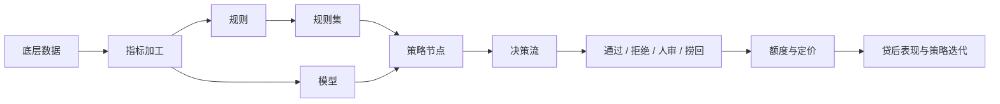

### 关键结论

| 模块 | 核心结论 | 对策略工作的启发 |
|---|---|---|
| 风险分类 | 信贷风险主要分为欺诈风险和信用风险 | 欺诈要尽量杜绝，信用风险则是可调节、可定价的风险 |
| 审批流程 | 先确认本人和信息真实性，再评估还款意愿与还款能力 | 身份验证和信息验证是后续风险判断的前提 |
| 策略节点 | 常见形态包括规则集、决策矩阵、决策树 | 不同节点形式对应不同决策复杂度和可解释性 |
| 规则集 | 并行规则集利于保留规则命中数据，串行规则集利于效率 | 策略设计要在数据留存和执行成本之间取平衡 |
| 风险定价 | 风险越高，风险溢价越高 | 定价本质是覆盖成本和风险，同时争取合理利润 |
| 额度策略 | 额度既影响风险敞口，也影响客户动支和收益 | 额度不是越高越好，也不是越低越好，核心是风险与需求的平衡 |
| 收入测算 | 社保、公积金、房贷、信用卡额度都可反推收入 | 推算收入前必须判断“有效性”，否则容易高估或低估还款能力 |
| 策略评估 | 离线测算快但依赖假设，AB 测试真实但周期长 | 策略上线前后都要建立可量化评估体系 |
| 模型应用 | A 卡模型可用于准入，也可用于额度 / 定价分层 | 准入看尾部识别能力，额度定价看整体排序性 |

---

## 1. 背景：信贷策略到底在解决什么问题

信贷策略的目标不是“把所有风险客户拒掉”，而是在不同业务目标下，对客户做出差异化决策：

1. 是否允许进入流程；
2. 是否通过审批；
3. 是否需要人工审核；
4. 是否可以拒绝回捞；
5. 给多少额度；
6. 给什么价格；
7. 后续是否提额、降额、调价、激活或挽留。

### 1.1 两类核心风险

| 风险类型 | 本质 | 典型表现 | 策略目标 |
|---|---|---|---|
| 欺诈风险 | 还款意愿问题 | 恶意骗贷、盗用身份、黑产团伙、多设备异常、GPS 命中风险区域 | 尽量杜绝 |
| 信用风险 | 还款能力问题 | 收入不足、负债高、多头借贷、历史逾期、征信恶化 | 降低并定价覆盖 |

培训中特别强调：**欺诈风险和信用风险的处理方式不同。**

- 对欺诈风险：容忍度低，应尽量拦截。
- 对信用风险：不是绝对不能做，而是要看风险是否可控、价格是否覆盖、额度是否合适。

### 1.2 风控判断的前置条件

在评估还款意愿和还款能力之前，必须先确认两个前提：

| 前置问题 | 判断方式 | 目的 |
|---|---|---|
| 申请人是否为本人 | OCR、人脸比对、活体检测 | 防止身份冒用和第三方欺诈 |
| 申请信息是否真实 | 三要素 / 四要素核验，运营商、银行卡、身份信息比对 | 保证后续风险评估的输入可靠 |

如果本人身份和信息真实性都不成立，那么后面的模型、规则、额度、定价都会失真。

---

## 2. 策略体系的基本构成

### 2.1 从数据到决策流

策略不是直接写规则，而是逐层构建出来的：

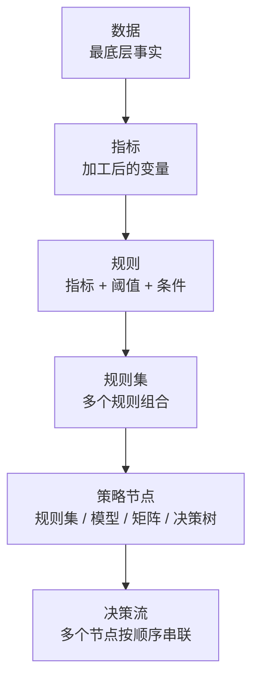

### 2.2 各层含义

| 层级 | 含义 | 示例 |
|---|---|---|
| 数据 | 最小颗粒度的原始事实 | 查询记录表、申请表、征信报告、设备信息 |
| 指标 | 对数据加工后的变量 | 近 90 天查询机构数 |
| 规则 | 对指标设定判断条件 | 近 90 天查询机构数 > 3 |
| 规则集 | 多条规则组合 | 内部黑名单规则集、征信强规则集 |
| 策略节点 | 决策流中的一个模块 | 准入节点、反欺诈节点、信用风险节点 |
| 决策流 | 线上决策引擎最终执行的完整流程 | 进件 → 验证 → 准入 → 反欺诈 → 信用 → 额度定价 |

### 2.3 常见数据来源

| 数据类型 | 具体来源 | 常见字段 / 内容 | 主要用途 |
|---|---|---|---|
| 内部申请数据 | 进件表 | 手机号、紧急联系人、工作单位、收入、职业 | 基础身份和画像判断 |
| 埋点数据 | App / SDK | 设备、地理位置、点击行为、页面停留 | 欺诈识别、需求识别 |
| 内部历史库 | 平台沉淀 | 黑名单、历史逾期、核销记录 | 老客 / 黑名单 / 历史风险判断 |
| 征信报告 | 银行征信 | 逾期、授信、负债、公积金、查询记录 | 信用风险、收入负债、额度策略 |
| 三方数据源 | 百行、百融、同盾、银联等 | 多头、欺诈、复杂网络、交易信息 | 补充外部风险和行为信息 |

---

## 3. 策略节点的三种常见形式

策略节点内部可以是规则集、决策矩阵，也可以是决策树。

### 3.1 规则集

规则集是贷前策略里最常见的节点形式。

#### 并行规则集 vs 串行规则集

| 规则集形式 | 机制 | 优点 | 缺点 | 适用场景 |
|---|---|---|---|---|
| 并行规则集 | 客户进入节点后，所有规则都执行 | 能保留每条规则命中情况，便于命中率分析和后续迭代 | 规则很多时执行效率低 | 常规策略节点、规则数量可控的场景 |
| 串行规则集 | 规则按顺序执行，前面命中后后面不再执行 | 执行效率高，节省计算和调用成本 | 后续规则无命中数据，不利于分析 | 规则数量极多、强拦截、成本敏感场景 |

#### 示例：内部信息匹配规则集

| 规则类型 | 业务含义 | 可能决策 |
|---|---|---|
| 存在未结清贷款账户 | 客户上一笔未还清，又申请新贷款 | 拒绝或限制 |
| 历史逾期次数过多 | 已结清但历史逾期次数超过阈值 | 拒绝 |
| 出现核销记录 | 历史坏账程度严重 | 拒绝 |
| 身份证 / 手机号 / 设备命中内部黑名单 | 与平台沉淀风险名单撞库 | 拒绝 |
| 同一手机号关联多个姓名 | 身份关系异常，可能存在团伙或资料包装 | 拒绝 |

#### 示例：征信强规则集

| 规则类型 | 业务含义 | 可能决策 |
|---|---|---|
| 还款状态出现代偿、担保人代还等 | 严重信用问题 | 拒绝 |
| 征信白户 / 查无交易数据 | 信用信息不足，风险不可判断 | 拒绝或人工 |
| 法院执行记录未结案 | 司法风险 | 拒绝 |
| 民事判决记录 > 0 | 法律纠纷风险 | 拒绝 |
| 贷记卡当前逾期数 ≥ 1 | 当前信用风险已暴露 | 拒绝 |
| 贷款 / 信用卡审批查询次数过多 | 近期融资需求强，多头风险高 | 拒绝或收紧 |
| 近 5 年贷款逾期笔数 ≥ 5 | 历史信用表现差 | 拒绝 |

---

### 3.2 决策矩阵

决策矩阵通常用于两个模型分、两个强变量，或“模型分 + 关键变量”的二维交叉。

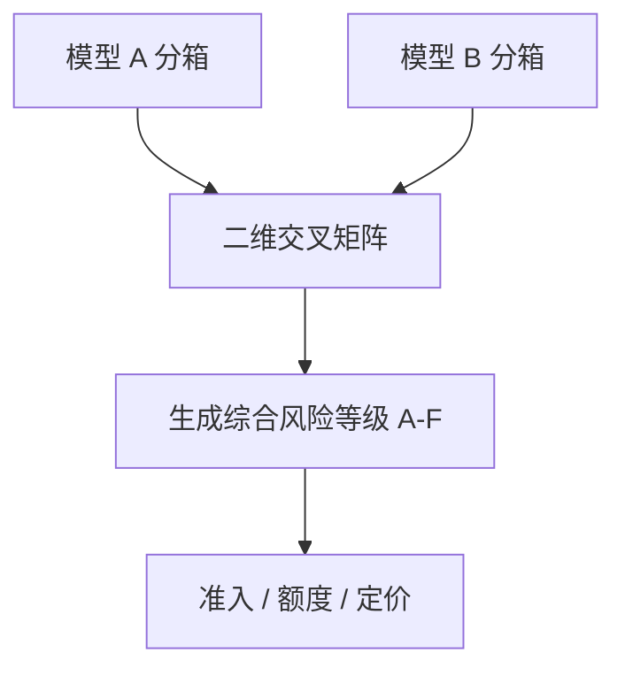

#### 典型逻辑

- 模型 A 和模型 B 都认为客户好：综合等级高。
- 模型 A 和模型 B 都认为客户差：综合等级低。
- 两个模型意见不一致：根据业务风险偏好折中。

#### 示例矩阵

| 模型 A \ 模型 B | B 高分 | B 中高分 | B 中低分 | B 低分 |
|---|---:|---:|---:|---:|
| A 高分 | A | A | B | C |
| A 中高分 | A | B | C | D |
| A 中低分 | B | C | D | E |
| A 低分 | C | D | E | F |

> A-F 代表风险等级，A 最优，F 最差。实际矩阵需要基于样本坏账率、排序性、通过率和业务目标制定。

---

### 3.3 决策树

决策树适合将多个条件按层级拆分，常用于额度制定。

#### 示例：额度决策树

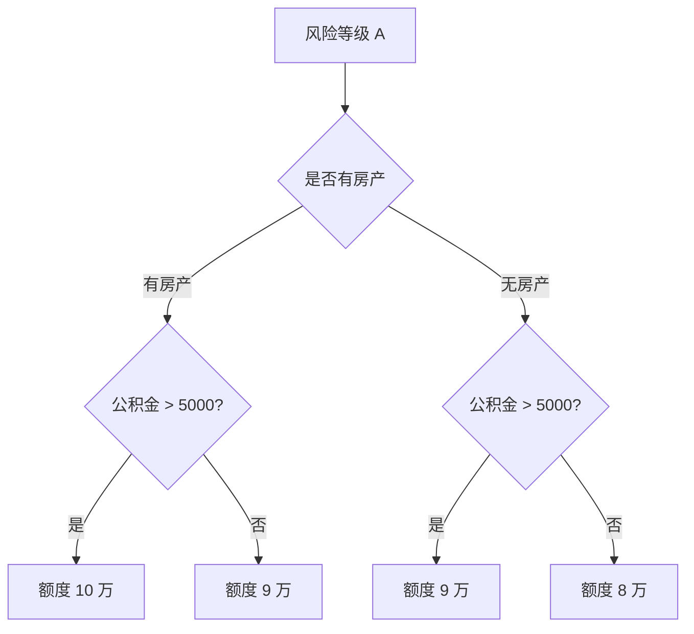

这个例子体现了额度策略的基本思想：

1. 先按风险等级做第一层分裂；
2. 再按资产情况判断客户资金实力；
3. 再按公积金等收入稳定性指标细分；
4. 最后给出差异化额度。

---

## 4. 贷前审批策略流程设计

### 4.1 通用审批决策流


### 4.2 各模块作用

| 模块 | 主要目标 | 常见手段 |
|---|---|---|
| 进件 | 收集客户资料和授权 | 三 / 四要素、婚姻、收入、职业、居住地、联系人、授权征信 |
| 信息验证 | 确认本人和信息真实 | OCR、人脸比对、活体检测、运营商 / 银行核验 |
| 准入策略 | 政策和产品层面的硬约束 | 年龄、地域、行业、职业、产品准入条件 |
| 反欺诈策略 | 判断还款意愿和欺诈可能 | 身份验证、设备、GPS、复杂网络、欺诈模型 |
| 黑名单策略 | 拒绝有明显黑历史客户 | 内部黑名单、外部黑名单、司法、税务、历史逾期 |
| 信用风险策略 | 判断还款能力 | 征信规则、多头规则、A 卡模型、负债收入判断 |
| 拒绝回捞 | 对部分被拒客户二次判断 | 多维数据、模型分、严格组合条件 |
| 额度定价 | 对通过客户给出权益 | 授信额度、利率、有效期、产品权益 |

### 4.3 流程顺序设计原则

| 原则 | 含义 | 业务取舍 |
|---|---|---|
| 减少数据成本 | 免费 / 内部数据优先，付费三方数据靠后 | 避免明显应拒客户仍触发付费查询 |
| 留存更多数据 | 可先打标签不立即拒绝，让客户继续走流程 | 有利于策略迭代，但会增加数据成本 |
| 强风险策略在前 | 准入、黑名单、强欺诈等优先判断 | 降低成本，也避免欺诈样本污染信用模型 |
| 弱风险策略在后 | 模型分层、人审、边界客群处理放后 | 减少误杀和用户体验损失 |
| 人工审核靠后 | 人审过早会影响客户体验和效率 | 更适合处理模型 / 规则无法确定的中间风险 |

### 4.4 典型案例一：小贷公司简化流程

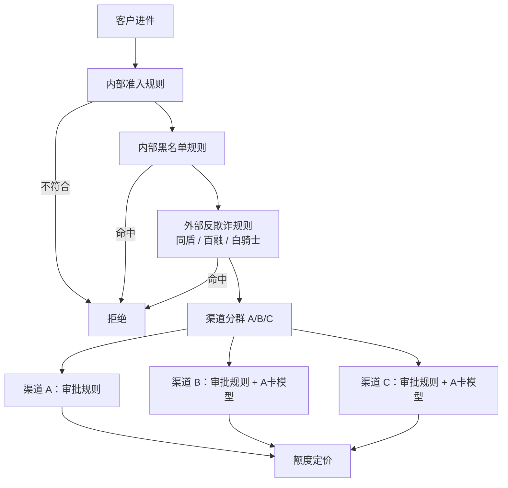

核心特点：

- 前置内部规则和外部反欺诈规则；
- 通过后按渠道分群；
- 不同渠道使用不同规则和模型；
- 优质渠道可能只用简单规则，风险更复杂的渠道需要模型分层。

### 4.5 典型案例二：互联网大厂 + 银行联合风控

该案例分为两段：

1. **互联网侧前置风控**：政策准入、流量分层、反欺诈规则 / 模型、信用规则；
2. **银行侧后置风控**：银行征信维度分层、反欺诈规则、信用规则、信用模型、额度定价。

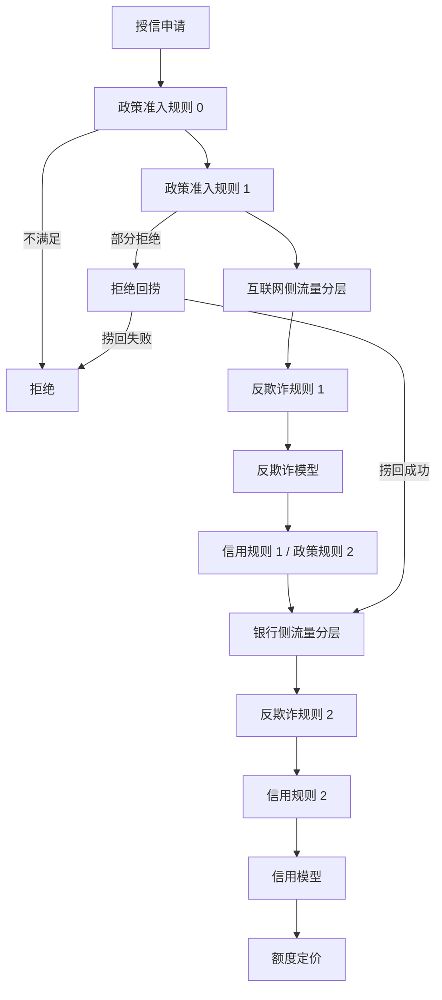

#### 拒绝回捞逻辑

拒绝回捞不是放松，而是对前面被拒客户用更严格条件重新评估。示例条件包括：

- 近两年有负债但无逾期；
- 近两个月网贷无逾期；
- 资金紧张程度低；
- 违约成本高；
- 多个条件通常采用 **AND** 关系，而不是 OR 关系。

---

## 5. 定价策略：从基础定价到风险定价

### 5.1 什么是定价

在信贷风控中，定价是指金融机构综合客户信用状况、贷款期限、市场利率、资金成本、风险溢价等因素，确定贷款利率的过程。

| 视角 | 关注重点 | 典型问题 |
|---|---|---|
| 财务视角 | 算总账、看业务是否盈利 | 定价是否覆盖资金成本、运营成本、营销成本、风险成本 |
| 风控视角 | 做差异化、控制风险收益比 | 不同风险客户应给什么价格 |
| 产品 / 经营视角 | 客户转化和生命周期运营 | 定价是否影响动支、留存、流失挽回 |

### 5.2 定价的五个影响因素

| 影响因素 | 含义 | 策略启发 |
|---|---|---|
| 监管要求 | 利率上限、合规红线 | 不可突破，是硬约束 |
| 客户需求 | 客户对价格的敏感度 | 优质客户更敏感，下沉客户更看重能否借到和额度 |
| 盈利能力 | 定价能否覆盖成本并形成利润 | 核心取决于风险成本是否可控 |
| 产品要素 | 期限、还款方式、额度结构 | 产品设计本身会改变风险 |
| 同业竞争 | 市场竞品利率和额度 | 优质客群争夺激烈，价格更关键 |

### 5.3 不同客群的定价经营模式

| 客群类型 | 客户特征 | 定价敏感度 | 经营逻辑 |
|---|---|---:|---|
| 低风险 / 优质客群 | 选择多、违约成本高、资金不一定饥渴 | 高 | 用较低定价提升转化和留存 |
| 高风险 / 下沉客群 | 选择少、资金需求强、多头和历史风险高 | 低 | 高定价覆盖高风险，差异化空间较小 |
| 中间客群 | 风险和需求都不极端 | 中 | 依靠模型分层、额度和价格组合优化 |

培训中的核心观点：**低定价客群拼的是价格、体验和权益；高定价客群拼的是风险能否被价格覆盖。**

### 5.4 定价框架体系

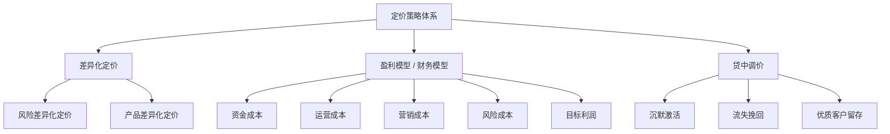

---

## 6. 风险定价与风险分层

### 6.1 风险定价公式

风险定价的核心是：**固定成本 + 风险成本 + 目标利润 = 贷款定价**。

```text
定价 = 固定成本 + 风险溢价 + 目标利润
```

示例：

| 风险等级 | 固定成本 | 风险成本 / 风险溢价 | 目标利润 | 建议定价 |
|---|---:|---:|---:|---:|
| A | 6% | 2% | 3% | 11% |
| B | 6% | 3% | 3% | 12% |
| C | 6% | 5% | 3% | 14% |
| D | 6% | 7% | 3% | 16% |

这个示例说明：当目标利润和固定成本不变时，定价差异主要来自风险成本差异。

### 6.2 如何做风险分层

风险分层依赖有风险区分能力的变量。变量可分为两类：

| 变量类型 | 说明 | 优点 | 局限 |
|---|---|---|---|
| 单变量 | 单一指标，如查询次数、逾期次数、收入、负债 | 简单、可解释 | 区分能力有限 |
| 模型变量 | 多个变量通过算法聚合，如 A 卡模型分 | 区分能力强、排序性好 | 开发复杂、解释成本高 |

常用流程：


### 6.3 模型分层的要求

| 要求 | 含义 |
|---|---|
| 整体排序性 | 分数越高，风险应越低；或分数越低，风险应越高 |
| 分层差异明显 | 不同等级之间坏账率要有明显差异 |
| 通过样本内有效 | 如果模型也用于准入拒绝，定价只能作用于模型通过的人群 |
| 分层不宜过粗 | 分层越细，定价越灵活；实际常见 5-10 档 |

### 6.4 单变量对风险定价的补充方式

| 模式 | 做法 | 示例 |
|---|---|---|
| 顶层分群 | 先用单变量分群，再在群内用模型分层 | 有公积金 / 无公积金分别定价 |
| 调整系数 | 先用模型给基础定价，再用单变量调整 | 单位等级 A 系数 0.8，C 系数 1.2 |
| 个性化定价 | 对特定优质组合单独下探价格 | 单位等级 A 且模型分 > 800，定价下探到 5% |

### 6.5 银行风险定价案例

案例逻辑：

1. 用两个评分卡交叉生成基础定价；
2. 对基础定价 ≤ 10% 的优质客群，参考客户在其他机构的现行消费贷平均利率；
3. 基础定价与外部参考利率取低值，以提升优质客群吸引力；
4. 最终定价设置上下限，如 8%-18%。

公式可以表达为：

```text
若 基础定价 ≤ 10%：
    rate1 = min(基础定价, 他行消费贷平均利率)
否则：
    rate1 = 基础定价

最终定价 = max(8%, min(rate1, 18%))
```

---

## 7. 定额策略 / 额度管理

### 7.1 授信额度 vs 借款额度

| 概念 | 含义 | 示例 |
|---|---|---|
| 授信额度 | 金融机构授予客户的最大可借金额，是一种权益额度 | 给客户 10 万授信 |
| 借款额度 | 客户在授信额度内实际支用的金额 | 客户实际借 5 万 |
| 分期贷款 | 授信额度通常等于借款额度 | 消费分期买商品 |
| 循环贷款 | 借款额度可以小于授信额度，还款后额度恢复 | 现金贷、信用卡循环额度 |

### 7.2 定额策略在流程中的位置


定额策略只对通过审批的客户生效，核心任务是：**在风险可控的前提下，给出能促进客户使用、又不会放大损失的额度。**

### 7.3 额度策略的价值

额度策略影响三件事：

| 影响方向 | 额度过低 | 额度过高 |
|---|---|---|
| 动支 / 转化 | 额度没有吸引力，客户不使用 | 可能提升动支，但未必是好客户动支 |
| 风险 | 风险敞口较小 | 坏客户损失放大 |
| 收益 | 业务规模和利息收入不足 | 坏账损失吞噬收益 |

核心矛盾是：**好客户通常需求低，坏客户通常需求强。**

这就是额度策略中的逆向选择：

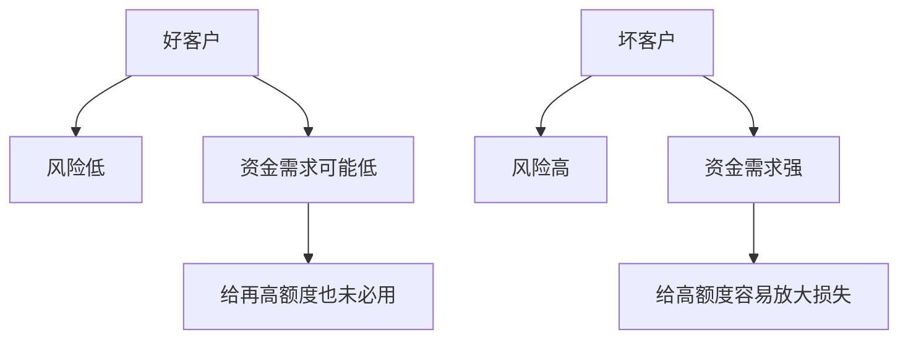

### 7.4 额度策略的三类数据维度

| 维度 | 解决的问题 | 常见数据 |
|---|---|---|
| 风险维度 | 客户会不会坏 | A 卡模型、征信分、查询多头、历史逾期、三方风险分 |
| 收入 / 负债维度 | 客户还不还得起 | 社保、公积金、房贷、信用卡额度、工资流水、未结清贷款月供 |
| 需求维度 | 客户会不会用、用多少 | 埋点、营销响应、动支模型、征信查询、外部借贷意向 |

### 7.5 风险维度与额度的关系

培训中提到经典公式：

```text
EL = PD × EAD × LGD
```

| 符号 | 含义 | 对额度策略的意义 |
|---|---|---|
| EL | 预期损失 | 最终要控制的损失 |
| PD | 违约概率 | 风险越高，额度应越低 |
| EAD | 风险敞口 | 授信额度本质上就是风险敞口 |
| LGD | 违约损失率 | 违约后最终损失比例 |

在不考虑 LGD 的情况下，如果想让 EL 稳定：

```text
PD 上升 → EAD 应下降
```

也就是：**风险越高，额度越低。**

### 7.6 额度策略的发展阶段

| 业务阶段 | 数据基础 | 常见做法 | 优点 | 缺点 |
|---|---|---|---|---|
| 冷启动 | 几乎无数据 | 统一额度 / 专家经验 / 外部模型分 | 快速上线 | 粗糙，无法精细区分客户 |
| 发展中期 | 有一定贷前和贷后数据 | 风险分层、收入矩阵、需求调整、决策树 | 可解释、易配置、较实用 | 评估周期较长 |
| 成熟阶段 | 数据积累丰富 | 最优额度模型、聚类模型、机器学习额度模型 | 理论上更精准 | 实现复杂、解释性弱、部署成本高 |

### 7.7 额度矩阵设计流程

额度矩阵是培训中反复强调的实用方法。它的优点是：**可解释、可配置、可逐步迭代。**

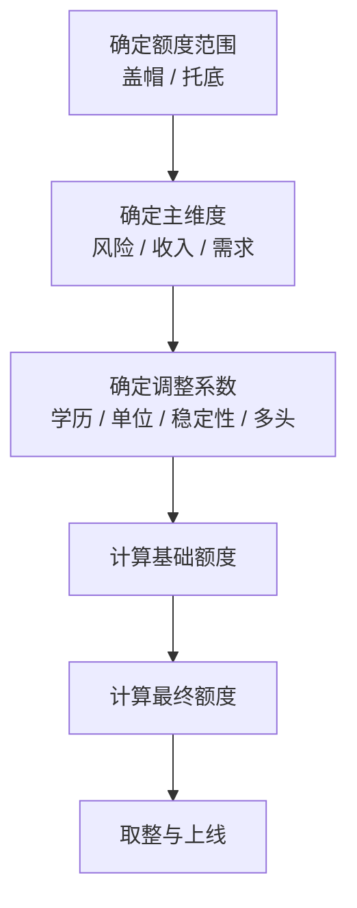

### 7.8 最终额度公式

```text
最终额度 = min(盖帽额度, max(托底额度, 基础额度 × 调整系数))
```

含义：

| 环节 | 作用 |
|---|---|
| 基础额度 × 调整系数 | 基于主维度和辅助维度修正额度 |
| max(托底额度, ...) | 防止额度过低，保证最低权益 |
| min(盖帽额度, ...) | 防止额度过高，控制风险敞口 |

### 7.9 额度矩阵设计的三个框架

#### 框架一：风险盖帽 + 收入推算基础额度

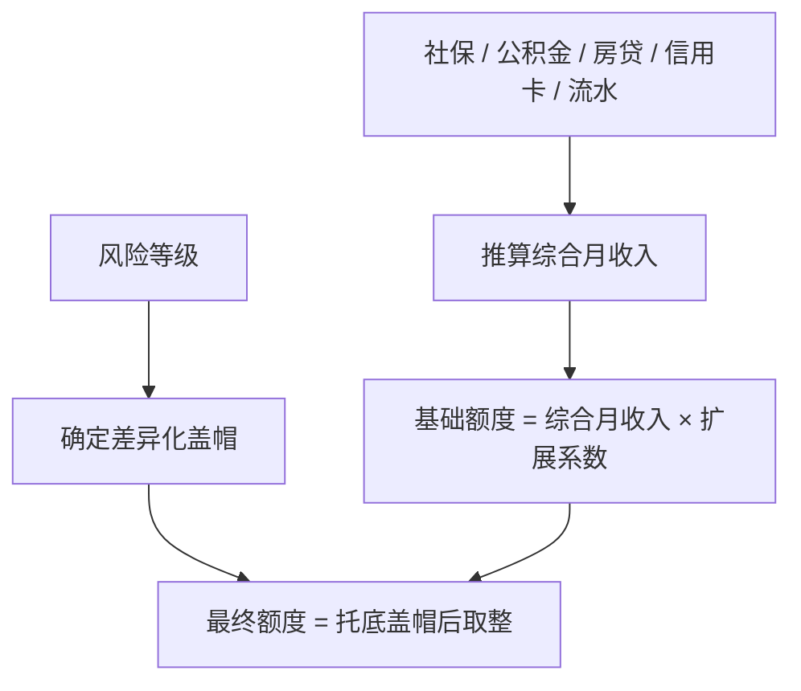

适用场景：收入数据相对丰富，希望额度跟还款能力更直接挂钩。

#### 框架二：风险 × 偿债能力矩阵 + 调整系数

| 风险等级 \ 偿债能力 | 强 | 中 | 弱 |
|---|---:|---:|---:|
| 低风险 | 高基础额度 | 中高基础额度 | 中基础额度 |
| 中风险 | 中高基础额度 | 中基础额度 | 中低基础额度 |
| 高风险 | 中基础额度 | 低基础额度 | 最低基础额度 |

再根据客户等级、学历、单位稳定性等生成调整系数。

适用场景：想保持额度取值相对稳定、易解释、易监控。

#### 框架三：条件式差异化盖帽

示例：

| 条件 | 处理 |
|---|---|
| 征信白户且风险等级较高 | 盖帽降至较低额度 |
| 多头查询指数高且收入等级低 | 盖帽进一步压低 |
| 优质单位且高收入低风险 | 允许更高盖帽 |

优点是灵活，缺点是后续监控和解释复杂度更高。

---

## 8. 收入测算：社保、公积金、房贷、信用卡额度

收入测算服务于额度策略，核心问题是：**客户到底有多强的还款能力。**

培训中把收入相关数据分为：

| 类型 | 示例 | 特点 |
|---|---|---|
| 强相关数据 | 社保、公积金、房贷、信用卡额度、工资流水 | 与收入 / 负债直接相关，优先使用 |
| 弱相关数据 | 年龄、学历、职业、城市、手机价格、地址稳定性 | 间接反映收入或资金实力，可作为补充 |

### 8.1 社保反推收入

社保缴费额与缴费基数、缴费比例有关：

```text
推算月收入 ≈ 社保月缴纳额 ÷ 缴费比例
```

可以用：

- 养老保险缴纳额；
- 医疗保险缴纳额；
- 失业保险缴纳额；
- 单位缴纳额；
- 个人缴纳额；
- 单位 + 个人总缴纳额。

#### 注意事项

| 情况 | 对收入推算的影响 |
|---|---|
| 工资超过缴费基数上限 | 推算收入偏低 |
| 工资低于缴费基数下限 | 推算收入偏高 |
| 企业按最低基数缴纳 | 推算收入偏低 |
| 城市政策不同 | 需要维护城市、年份、缴费比例和上下限映射表 |

### 8.2 公积金反推收入

公积金公式：

```text
公积金月缴纳额 = 缴存基数 × 缴存比例 × 2
```

因此：

```text
推算月收入 ≈ 公积金月缴纳额 ÷ (个人比例 + 单位比例)
```

#### 公积金有效性判断

| 判断项 | 目的 |
|---|---|
| 姓名 / 身份证是否匹配 | 确认数据属于本人 |
| 当前缴存状态是否正常 | 排除停缴、断缴 |
| 近 12 个月是否连续缴存 | 判断收入稳定性 |
| 城市政策是否更新 | 避免使用过期比例和上下限 |

### 8.3 房贷反推收入

房贷不是直接工资数据，但可以从“按期偿还月供”反推还款能力。

常用逻辑：

```text
推算月收入 ≈ 未结清房贷月还款额 ÷ 房贷负担系数
```

示例：

| 月供 | 房贷负担系数 | 推算月收入 |
|---:|---:|---:|
| 10,000 | 40% | 25,000 |

#### 房贷有效性判断

| 判断项 | 含义 |
|---|---|
| 贷款状态 / 五级分类正常 | 排除当前风险已暴露客户 |
| 贷款进度 | 快还清客户违约成本更高 |
| 房贷利率 | 可间接反映客户风险水平 |
| 房贷个数 | 多套房贷可能代表资产，也可能代表高负债 |

可加入惩罚系数：

```text
有效月收入 = 未结清房贷月还款额 × 惩罚系数 ÷ 房贷负担系数
```

### 8.4 信用卡额度反推收入

信用卡额度一般与收入、负债、信用历史和用卡情况有关。培训中的基本逻辑是：

```text
信用卡额度 × 最低还款比例 ≈ 每月可支配收入
```

因此：

```text
推算月收入 = 信用卡平均账户额度 × 最低还款比例 ÷ 收入可支配比例
```

示例：

| 信用卡平均额度 | 最低还款比例 | 收入可支配比例 | 推算月收入 |
|---:|---:|---:|---:|
| 50,000 | 10% | 40% | 12,500 |

#### 信用卡有效性判断

| 判断项 | 说明 |
|---|---|
| 当前状态正常 | 排除逾期、冻结等异常账户 |
| 有正常使用行为 | 排除未激活、从未使用账户 |
| 使用时长足够 | 新开卡时间太短，不足以判断收入 |
| 剔除大额专项分期 | 车贷、装修贷等专项额度可能异常偏高 |
| 剔除极端额度 | 过高或过低额度可能失真 |
| 考虑额度使用率 | 使用率过高可能代表资金饥渴 |
| 考虑多头 | 信用卡账户数和机构数越多，多头压力越高 |

---

## 9. 新旧额度策略测试

额度策略优化后，必须回答一个问题：**新策略是否真的比旧策略好，是否值得上线。**

培训中介绍了两种测试方式：

| 方法 | 数据要求 | 优点 | 缺点 | 适用场景 |
|---|---|---|---|---|
| 历史样本离线测算 | 需要历史通过样本、授信额度、用信行为、贷后表现、收益成本数据 | 快，不需要等待线上表现 | 依赖假设，可能有偏差 | 有充足历史样本和表现期 |
| 线上 AB 测试 | 需要线上随机分流 | 真实、准确 | 周期长，需要等待风险和收益表现 | 新策略最终验证 |

### 9.1 离线测算样本要求

| 要求 | 说明 |
|---|---|
| 历史通过样本 | 因为只有通过客户才有额度和贷后表现 |
| 有授信额度和用信行为 | 用于比较旧额度和新额度 |
| 表现期充足 | 示例中提到至少 6 个月表现期 |
| 定义好坏客户 | 示例：DPD30+ MOB6 为坏；历史最大逾期天数 ≤ 3 为好 |
| 样本量足够 | 示例建议总样本 5000+，坏客户 500+ |
| 新策略所需变量齐全 | 若新策略使用新字段，需要历史回溯 |
| 盈利数据 | 实收利息、资金成本、风险成本等 |

### 9.2 离线测算分析维度

| 分析维度 | 目的 |
|---|---|
| 额度分布 | 看新旧策略在额度区间、均值、分位点上的差异 |
| 风险表现 | 看不同额度区间的坏账率、金额逾期率 |
| 盈利表现 | 看新策略是否把额度更多分配给盈利更高的区间 |
| 分群表现 | 按风险、收入、渠道、客群等维度看局部效果 |
| 共通样本 | 利用新旧策略都落在同一区间的样本估计新策略表现 |

### 9.3 盈利测算的关键逻辑

不能简单把旧策略下各区间盈利直接相加来代表新策略，因为历史真实盈利是旧策略产生的。

更合理的方式是：

1. 建立新额度区间 × 旧额度区间矩阵；
2. 找到新旧策略都认为属于同一额度区间的“共通部分”；
3. 用共通部分的平均盈利代表该新额度区间的盈利水平；
4. 再乘以新策略在该区间的客户数；
5. 各区间加总，得到新策略预估盈利。

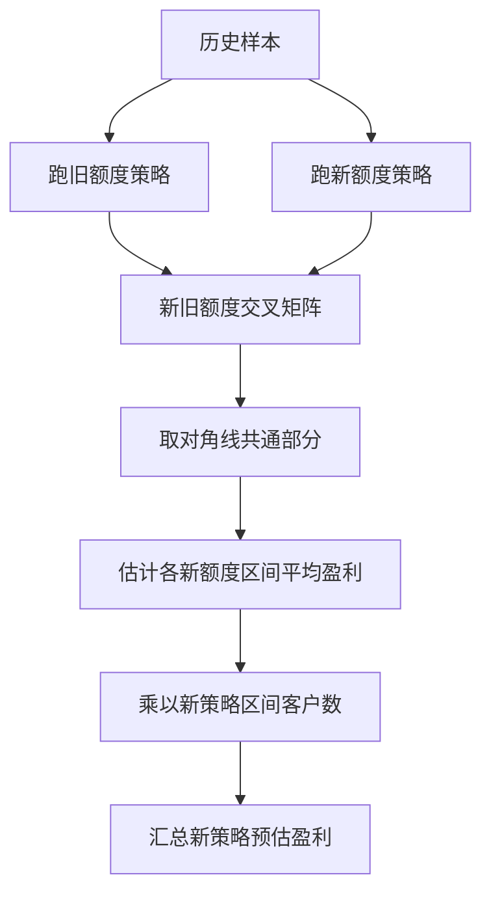

### 9.4 AB 测试设计

| 数据基础 | 测试方式 | 原因 |
|---|---|---|
| 历史样本充足 | 先充分离线测算，再少量测试组上线 | 离线已有较强支撑，测试组可以少一些 |
| 历史样本不足 | 多设计几套策略，多个测试组同时观察 | 不确定性高，需要线上试探 |
| 流量稳定 | 可设置测试组 30%、对照组 70% | 快速积累测试组样本 |
| 流量有限 | 测试组过多会拉长观察期 | 每组分到的样本少，表现期更长 |

---

## 10. 额度策略效果评估

### 10.1 为什么额度策略难评估

额度策略同时受两个因素影响：

| 维度 | 问题 |
|---|---|
| 风险 | 额度越高，坏客户损失越大 |
| 需求 | 额度越低，好客户可能不用，业务规模不足 |

客户真实借款需求通常无法直接观测，还会受到竞品额度、市场环境、价格等因素影响。因此额度策略不是简单的风险控制问题，而是**风险、需求、收益三者的平衡问题**。

### 10.2 损失率拆解

```text
损失率 = 坏账总额 ÷ 总贷款额
```

可拆解为：

```text
损失率
= (坏账户数 ÷ 总账户数) × (平均坏账额 ÷ 平均贷款额)
```

| 拆解项 | 对应策略 |
|---|---|
| 坏账户数 ÷ 总账户数 | 审批策略 / 风险准入 |
| 平均坏账额 ÷ 平均贷款额 | 额度策略 |

这说明：即使户数逾期率不变，额度策略也会影响金额损失率。

### 10.3 额度有效系数

培训中介绍了两类有效系数：

```text
额度有效系数 = 额度逾期率 ÷ 户数逾期率
金额有效系数 = 金额逾期率 ÷ 户数逾期率
```

| 系数区间 | 解释 | 额度策略评价 |
|---:|---|---|
| < 0.6 | 明显降低金额风险 | 非常有效 |
| 0.6 - 0.8 | 有较好控制作用 | 比较有效 |
| 0.8 - 0.9 | 有一定控制作用 | 一般有效 |
| 0.9 - 1.0 | 略低于户数风险 | 略微有效 |
| > 1.0 | 金额风险高于户数风险 | 失效或反向 |

### 10.4 额度逾期率 vs 金额逾期率

| 指标 | 分子 | 特点 | 适合用途 |
|---|---|---|---|
| 额度逾期率 | 逾期客户的授信额度 | 更严格，直接评估授信额度是否给高了 | 评估额度策略本身 |
| 金额逾期率 | 实际逾期未还金额 | 更接近真实损失，但受支用率和还款进度影响 | 评估真实损失和经营结果 |

培训中的判断是：如果目标是评估“额度策略是否合理”，额度逾期率更直接；如果目标是评估“真实损失”，金额逾期率更贴近财务结果。

### 10.5 排序性评估

额度策略应具备风险排序性：

| 额度区间 | 理想现象 |
|---|---|
| 低额度区间 | 客户风险较高，坏账率较高 |
| 高额度区间 | 客户质量较好，坏账率较低 |

如果额度越高，坏账率反而越高，说明额度策略可能反向或失效。

---

## 11. 贷前风控模型应用与多模型组合

### 11.1 A 卡模型的特点

A 卡模型用于贷前授信阶段，是基于历史通过客户的数据和贷后表现，预测未来申请客户风险的有监督学习模型。

| 特点 | 说明 |
|---|---|
| 样本 | 历史授信通过客户 |
| 特征时间点 | 授信时点及之前 |
| 标签 | 授信通过后的贷后表现 |
| 特征类型 | 静态特征 + 动态时间切片特征 |
| 标签示例 | MOB6 DPD30+、FPD、LBD10 / LBD15 / LBD20 |
| 算法 | 逻辑回归评分卡、XGBoost、GBM 等 |
| 输出 | 风险概率或风险分数 |

### 11.2 模型的两类应用场景

| 应用场景 | 用法 | 模型要求 |
|---|---|---|
| 审批准入 | 把模型当成强规则，低分拒绝；或与规则交叉形成弱规则；也可用于拒绝回捞 | 头部 / 尾部区分能力强 |
| 额度定价分层 | 将模型输出分成风险等级，作为额度或定价主维度 | 整体排序性强 |

### 11.3 准入场景：模型当规则

示例逻辑：

```text
若 A卡分 < cutoff：
    拒绝
否则：
    继续流程
```

准入场景关注的是尾部极差客群的识别能力，因此常看：

- 坏账率提升度；
- 低分箱坏账率；
- 拒绝率；
- 通过率影响；
- 人群稳定性。

### 11.4 额度定价场景：模型做分层

额度和定价不是只抓最差客户，而是要对通过客户做整体排序，因此更关注：

- 分箱坏账率是否单调；
- 各风险等级是否有明显差异；
- 分层样本量是否足够；
- 额度 / 定价结果是否符合业务预期。

### 11.5 多模型组合方式

| 方式 | 做法 | 优点 | 风险点 |
|---|---|---|---|
| 单模型使用 | 一个模型输出一个分层 | 简单、可解释 | 维度有限 |
| 多模型二维交叉 | 模型 A × 模型 B 生成新风险等级 | 能捕捉互补信息，风险切分更细 | 格子样本量可能不足 |
| 模型融合 | 多个子模型输出作为新特征，再训练融合模型 | 理论效果更优 | 开发复杂、周期长、解释性弱 |

### 11.6 模型交叉的判断要点

| 判断项 | 说明 |
|---|---|
| 模型相关性 | 如果相关性过高，增益有限；培训中提到相关性高于 0.7 通常偏高 |
| 交叉排序性 | 固定模型 A 分层后，模型 B 是否还能进一步区分风险；反之亦然 |
| 单元格样本量 | 矩阵切得越细，每格样本越少，必须保证统计意义 |
| 新模型变量回溯 | 如果其中一个是新模型，需要回溯历史变量，保证新旧模型在同一样本口径下比较 |
| 决策前后评估 | 同时看坏账率和通过率，避免只看风险不看业务量 |

### 11.7 模型融合

模型融合的思路：

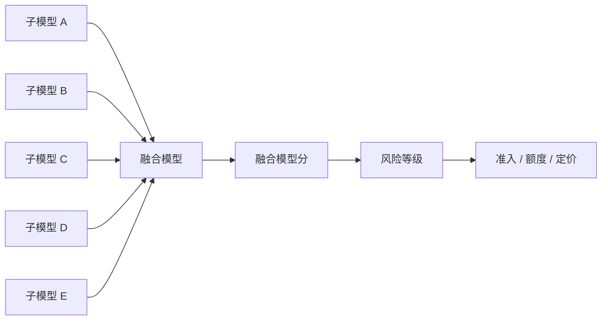

模型融合比二维交叉更算法化，理论上效果更好，但需要更完整的建模流程、开发周期和团队协作。

---

## 12. 策略落地风险点

| 风险点 | 具体表现 | 建议 |
|---|---|---|
| 数据成本失控 | 太早调用三方付费数据 | 内部免费数据和强规则优先 |
| 数据留存不足 | 前置拒绝导致后续节点无数据 | 对部分规则先打标签、后决策 |
| 欺诈样本污染模型 | 欺诈未前置拦截，进入信用模型训练样本 | 强欺诈策略尽量靠前 |
| 规则过度串行 | 后续规则没有命中数据 | 常规规则集优先并行 |
| 额度策略反向 | 坏客户拿高额度，好客户拿低额度 | 监控额度有效系数和排序性 |
| 收入推算失真 | 社保 / 公积金断缴、按最低基数缴纳、信用卡异常额度 | 做有效性判断和惩罚系数 |
| 定价无法覆盖风险 | 高风险低定价导致亏损 | 建立成本 + 风险 + 利润的定价模型 |
| AB 测试周期过短 | 贷后表现未充分暴露 | 结合风险表现期设定观察窗口 |
| 模型交叉过细 | 每格样本量不足 | 控制分箱数量，合并低样本格子 |
| 过度复杂难监控 | 条件式盖帽和多维矩阵太复杂 | 优先保证可解释、可复盘、可监控 |

---

## 13. 可复用的策略设计清单

### 13.1 贷前审批策略检查清单

- [ ] 是否明确区分欺诈风险和信用风险？
- [ ] 是否先验证本人身份？
- [ ] 是否先验证核心信息真实性？
- [ ] 免费 / 内部数据是否优先使用？
- [ ] 强风险规则是否足够前置？
- [ ] 是否有必要保留被拒客户的后续节点数据？
- [ ] 是否设置拒绝回捞？
- [ ] 是否评估通过率、拒绝率、人审率、坏账率？
- [ ] 是否有策略上线后的监控方案？

### 13.2 定价策略检查清单

- [ ] 是否满足监管利率上限？
- [ ] 是否测算资金成本、运营成本、营销成本、风险成本？
- [ ] 是否区分优质客群和高风险客群？
- [ ] 是否建立风险分层？
- [ ] 是否用模型分作为基础定价主维度？
- [ ] 是否用单变量做补充调整？
- [ ] 是否设置定价上下限？
- [ ] 是否考虑贷中调价、激活、挽留？

### 13.3 额度策略检查清单

- [ ] 是否明确授信额度和借款额度区别？
- [ ] 是否区分分期贷和循环贷？
- [ ] 是否考虑风险、收入、需求三类维度？
- [ ] 是否设置额度托底和盖帽？
- [ ] 是否有基础额度和调整系数？
- [ ] 是否验证收入推算有效性？
- [ ] 是否评估额度有效系数？
- [ ] 是否看额度分层坏账率排序性？
- [ ] 是否对新旧额度做离线测算或 AB 测试？

---

## 14. 最终沉淀：一句话理解整套策略

信贷策略的本质，是在数据有限、风险不确定、客户需求不可完全观测的情况下，用规则、模型、矩阵和决策树，把客户分成不同层级，并给出差异化的准入、额度和价格，让风险、转化和收益达到相对最优的平衡。
