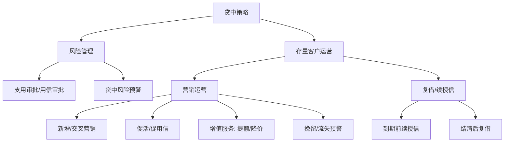
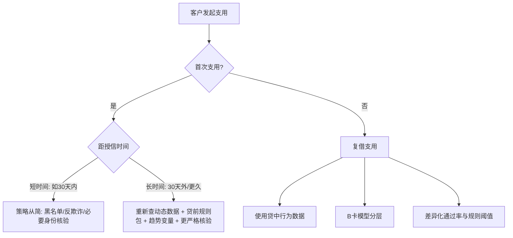
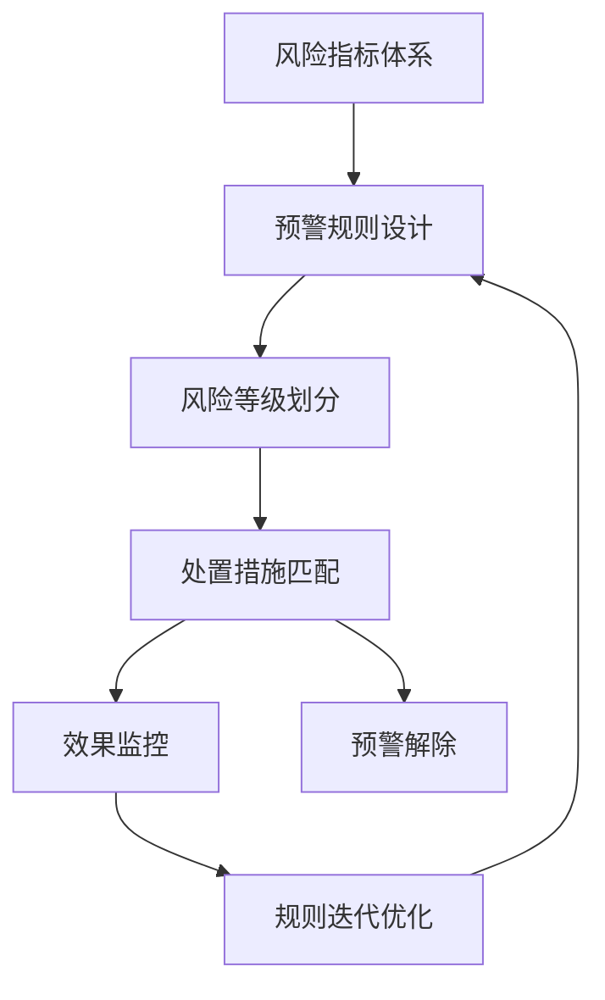
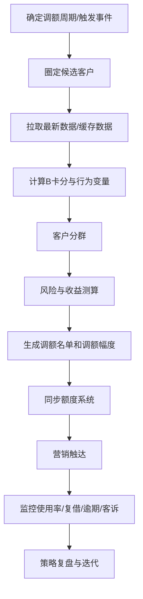

# 贷中策略方法论

> 来源：贷中策略培训录音转写  
> 整理方式：非逐字稿。已剔除口语重复、串音、噪声与明显 ASR 错词，并将“代工/贷工”统一为“贷中”，“附件/负债/付借”统一为“复借”，“调和”统一为“调额”，“直用/知用/用金”统一为“支用/用信”。

---

## 0. 一句话总结

贷中策略的核心，不是简单地“管风险”，而是在客户授信通过之后，基于持续产生的行为数据，对客户的**风险变化、资金需求、客户价值和生命周期状态**进行动态识别，并通过支用审批、风险预警、调额调价、促活、复借、挽留等动作，实现：

```text
风险可控 + 客户活跃 + 复借提升 + 生命周期延长 + 收益最大化
```

---

## 1. 背景：什么是贷中策略

### 1.1 贷前、贷中、贷后的边界

本培训中采用的边界口径是：

```text
授信通过之前 = 贷前
授信通过之后，发生严重逾期之前 = 贷中
客户逾期后进入催收处置 = 贷后
```

不同机构可能有不同划分方式。有的机构会以“放款成功”作为贷中起点，但本培训更强调：**只要客户授信通过，后续围绕客户权益、支用、风险变化、运营触达的管理，都可以纳入贷中策略范畴。**

| 阶段 | 核心目标 | 主要动作 | 数据特点 | 策略重点 |
|---|---|---|---|---|
| 贷前 | 识别欺诈风险与信用风险 | 准入、审批、定额、定价 | 以申请资料、征信、三方数据为主 | 控制首道风险 |
| 贷中 | 动态识别风险与需求 | 支用审批、风险预警、调额调价、促活、复借、挽留 | 增加借款、还款、逾期、额度使用、扣款、平台行为等数据 | 精细化运营 |
| 贷后 | 处置已发生风险 | 催收、清收、核销、法诉 | 逾期与回款数据为主 | 减少损失 |

### 1.2 贷中策略的本质

贷前面对的是“陌生人”，对客户的风险和需求掌握有限，所以额度和定价通常会偏谨慎。客户授信并发生后续行为之后，机构可以通过客户的还款、借款、逾期、额度使用、扣款等表现逐步了解客户。

因此，贷中策略本质上是：

```text
用贷中行为数据修正贷前判断误差，
对好客户提供更好的权益，
对风险升高客户及时收紧或拦截。
```

对应到实际动作：

| 客户表现 | 贷中判断 | 可能动作 |
|---|---|---|
| 持续按时还款、无逾期、额度使用合理 | 风险低，价值高 | 提额、降价、延长期限、提升复借 |
| 长期未用信 | 可能沉默、无需求，或风险已变化 | 促活、重新评估风险、谨慎唤醒 |
| 额度使用率高、多头上升、近期查询增加 | 资金需求强，风险可能升高 | 支用二次审批、预警、降额、冻结 |
| 已出现轻度逾期或扣款失败 | 风险苗头出现 | 预催收、提高监控频率、冻结未用额度 |
| 严重逾期或风险持续恶化 | 高风险客户 | 清退、冻结、催收、限制后续业务 |

---

## 2. 贷中策略总体框架

贷中策略可以拆成两大块：

1. **风险管理**
2. **存量客户运营**



### 2.1 风险管理

| 模块 | 业务含义 | 关键问题 | 常见动作 |
|---|---|---|---|
| 支用审批 | 循环额度客户每次提款前，再做一次风险判断 | 授信通过后，客户风险是否发生变化？ | 拒绝高风险支用、身份核验、重新查征信/三方 |
| 风险预警 | 持续监控客户在贷中阶段的风险变化 | 好客户是否变坏？风险是否有提前信号？ | 预催收、降额、冻结额度、提价、清退 |

### 2.2 存量客户运营

| 模块 | 业务含义 | 目标 |
|---|---|---|
| 新增/交叉营销 | 对已有客户营销其他产品 | 提升客户综合价值 |
| 促活/促用信 | 授信后未支用客户，推动其发起用信 | 提高提现率/支用率 |
| 增值 | 对优质客户提额、降价、优化还款方式 | 提升客户体验与复借意愿 |
| 挽留 | 对有流失倾向客户做触达与权益调整 | 延长生命周期 |
| 复借/续授信 | 客户结清或临近结清后，推动再次借款 | 复用获客成本，提高长期收益 |

---

## 3. 产品差异：循环额度 vs 非循环额度

贷中策略更适合循环额度产品，因为循环额度会产生更丰富的贷中行为数据。

| 维度 | 循环额度产品 | 非循环额度产品 |
|---|---|---|
| 典型产品 | 现金贷、信用卡循环额度 | 车贷、房贷、消费分期、大额专项分期 |
| 是否可多次支用 | 可以 | 通常不可以 |
| 是否可恢复额度 | 还款/结清后额度释放，可再次使用 | 一次性使用，逐期还款 |
| 额度使用率 | 不一定 100%，由客户需求决定 | 通常 100% |
| 贷中行为数据 | 丰富：支用、复借、额度使用、提前结清等 | 相对较少，主要是还款与逾期 |
| 贷中策略空间 | 大，可做支用审批、调额调价、复借、预警 | 小，更多是风险监控 |
| 核心管理方式 | 动态权益调整 + 风险控制 | 还款表现监控 + 定期征信复查 |

---

## 4. 老客户定义：核心是账龄和场景

### 4.1 老客户定义不是固定的

老客户的定义要结合业务场景。只要客户授信通过，就可以进入贷中视角，但不同账龄客户的数据丰富度差异很大。

| 老客户阶段 | 行为表现 | 数据丰富度 | 典型用途 |
|---|---|---|---|
| 授信通过但未支用 | 只有授信结果，无还款表现 | 很低 | 首次支用审批、促用信 |
| 已支用，MOB1-MOB3 | 有初步还款表现 | 较低到中等 | 短账龄风险观察 |
| 已支用，MOB3-MOB6 | 有一定还款表现 | 中等 | 初步调额、复借判断 |
| 已支用，MOB6-MOB12 | 风险暴露更充分 | 较高 | 续授信、权益调整 |
| 已结清一次以上 | 完成完整借据周期 | 高 | 提额、复借、优质客户经营 |
| 多次复借且表现稳定 | 多笔借款与还款历史 | 很高 | 高价值客户经营、差异化权益 |

### 4.2 不同场景下的老客户定义

| 场景 | 老客户定义重点 | 常见账龄门槛 | 策略含义 |
|---|---|---|---|
| 支用审批 | 授信后是否发起用信，距离授信多久 | 通常关注授信后 30 天内/外 | 时间越久，风险变化越可能发生 |
| 权益调整 | 是否积累足够贷中行为 | 3个月、6个月、结清一次以上 | 账龄越长，提额/降价依据越充分 |
| 续授信/复借 | 风险是否充分暴露 | 6个月以上、临结清、结清后 | 越保守越要求结清后再授信 |
| 新老客分群 | 风险和数据维度是否有明显差异 | 授信未放款、在贷未到期、已到期/已结清 | 分群后才能制定差异化策略 |

### 4.3 账龄门槛的业务取舍

| 策略取向 | 老客门槛 | 优点 | 风险 |
|---|---|---|---|
| 贷前保守，贷中主动 | 3个月还款表现即可考虑提额 | 可快速激活优质客户，减少流失 | 对贷中数据和监控要求高 |
| 贷前一步到位，贷中谨慎 | 至少结清一次后再提额 | 风险更稳，依据更充分 | 运营动作慢，客户可能流失 |
| 风险优先的续授信 | 必须结清当前贷款 | 风险暴露完整 | 业务量较保守 |
| 业务优先的续授信 | 还款 6 期左右即可续授信 | 更早获得复借机会 | 客户剩余在贷 + 新额度，负债压力上升 |
| 折中方式 | 临结清前 2-3 个月触发 | 平衡风险和业务 | 需要精细监控和策略支持 |

---

## 5. 贷中业务指标体系

贷中指标可以分为五大类：

| 指标类别 | 关注内容 | 典型指标 |
|---|---|---|
| 权益管理 | 额度、定价、期限、还款方式调整后效果 | 提额使用率、提额后逾期率、调价响应率 |
| 运营维度 | 客户是否支用、是否复借、是否留存 | 提现率、复借率、留存率 |
| 支用管理 | 支用审批策略效果 | 支用通过率、规则命中率、支用后逾期率 |
| 资产质量 | 在贷资产风险变化 | Vintage、迁徙率、结清率、逾期率 |
| 风险维度 | 客户风险状态与风险变化 | B卡分、多头、负债、逾期、扣款失败 |

### 5.1 三个核心运营指标

在忽略贷前获客和贷后催收影响时，贷中运营收益可以粗略理解为：

```text
贷中收益 ≈ 提现率 × 复借率 × 留存率 × 其他收益因素
```

| 指标 | 含义 | 业务目标 |
|---|---|---|
| 提现率/支用率 | 授信客户中，实际发起用信的人数占比 | 让授信额度转化为真实资产 |
| 复借率 | 已借款客户后续再次借款的比例 | 提高单客生命周期价值 |
| 留存率 | 客户在未来仍继续使用平台借款的比例 | 降低流失，延长生命周期 |

### 5.2 群组分析 / Vintage 思路

提现率、复借率、留存率都适合用 cohort/vintage 的方式分析。

```text
按授信日 / 结清日 / 首借日分组
      ↓
把不同日期的客户拉到同一个账龄起点
      ↓
观察 N 天、N 月后的表现
      ↓
横向看不同批次差异，纵向看同一批次随账龄变化
```

| 分析方向 | 含义 | 能发现的问题 |
|---|---|---|
| 横向对比 | 同一账龄下，不同批次表现差异 | 某批次策略、渠道、产品变化是否异常 |
| 纵向观察 | 同一批客户随账龄变化 | 指标何时趋于平稳，客户行为集中在哪个阶段 |
| 拐点识别 | 指标增速明显放缓的时间点 | 标签表现期、触达窗口、策略时点选择 |

---

## 6. 提现率 / 支用率

### 6.1 定义

提现/支用是指：客户授信通过后，将授信额度中的部分或全部金额划转到个人账户或用于消费。

```text
授信后 N 天提现率 = 授信后 N 天内提现用户数 / 授信成功用户数
```

### 6.2 业务含义

| 现象 | 解释 | 策略启发 |
|---|---|---|
| 授信当天支用占比较高 | 真正有资金需求的客户通常会尽快用信 | T+0/T+3 是关键转化窗口 |
| 3 天内提现率贡献大 | 短期内支用意愿最强 | 促用信应尽早触达 |
| 30 天后增长趋缓 | 需求衰减或客户流失 | 30 天可作为促支用模型表现期 |
| 长时间后突然大额支用 | 可能出现新增风险 | 支用审批需要更严格 |

### 6.3 典型时间窗口

| 时间点 | 业务意义 | 可用策略 |
|---|---|---|
| T+0 | 授信当天，支用意愿最强 | 尽量减少摩擦，保证体验 |
| T+3 | 大部分支用行为已发生 | 对未支用客户做促活触达 |
| T+30 | 支用率基本趋稳 | 可作为促支用模型的标签表现期 |
| T+60/T+90 | 增长有限，风险变化更多 | 若支用需重新评估风险 |

---

## 7. 复借率

### 7.1 定义

复借是相对于首借而言的：

```text
首借 = 授信通过后的第一次借款
复借 = 首借之后的第二次、第三次及后续借款
```

### 7.2 复借率的两种口径

不同产品设计会导致复借率口径不同。

| 产品设计 | 分母 | 分子 | 适用场景 |
|---|---|---|---|
| 必须结清上一笔后才能借下一笔 | 当前借款已结清客户数 | 结清后一定时间内再次借款客户数 | 风险更保守的产品 |
| 不要求结清即可再次借款 | 当前至少有一笔在贷或已结清的客户数 | 观察期后发生一次以上新借款客户数 | 循环额度、允许多笔并存的产品 |

### 7.3 复借率的解读

| 表现 | 可能含义 | 风险/运营启发 |
|---|---|---|
| 结清后短期复借率很高 | 客户资金需求旺盛 | 可能存在多头借贷或资质下沉风险 |
| 长期复借率低 | 产品吸引力不足或客户流失 | 需要评估额度、价格、触达和竞品影响 |
| 优质客户复借低 | 不是无风险问题，而是经营问题 | 可通过降价、提额、挽留提升粘性 |
| 高风险客户复借高 | 业务量增加但风险可能恶化 | 需要限制额度或加强支用审批 |

---

## 8. 留存率

### 8.1 定义

贷中场景下，留存率通常可以用“结清客户未来是否再次借款”来定义。它与复借率非常接近，但留存更强调客户粘性与生命周期。

| 口径 | 定义 | 适用场景 |
|---|---|---|
| 人数留存率 | 结清客户未来 N 天/月内新开借据人数 / 总结清人数 | 看客户是否回来 |
| 余额留存率 | 结清用户未来 MOB 余额留存 / 初始余额 | 看资产余额是否留住 |
| 流失率 | 1 - 留存率 | 看客户流失趋势 |

### 8.2 留存率下降的可能原因

| 原因类型 | 具体表现 |
|---|---|
| 产品吸引力不足 | 额度低、价格高、期限不合适 |
| 竞品分流 | 其他平台提供更高额度或更低价格 |
| 触达不足 | 客户不知道可复借、可提额、可降价 |
| 风险策略过严 | 好客户被误拒或体验变差 |
| 生命周期自然衰减 | 客户需求消失或转向其他金融产品 |

---

## 9. 贷中行为变量及衍生方法

### 9.1 行为变量的作用

贷中行为变量是贷中策略和 B 卡模型的核心数据基础。相对于贷前变量，贷中行为变量更贴近客户真实表现，通常在贷中模型中权重更高。

```text
底层行为数据
  → 借款、还款、逾期、额度使用、权益调整、扣款、平台行为
  → 衍生行为变量
  → 支用审批 / 风险预警 / 调额调价 / 复借 / B卡模型
```

### 9.2 变量衍生方法论

一个变量通常由以下要素组成：

```text
变量 = 时间维度 + 主维度/条件维度 + 度量对象 + 算子函数
```

示例：

```text
最近12个月借据提前结清次数求和
= 最近12个月（时间维度）
+ 借据（条件/主体）
+ 提前结清次数（度量对象）
+ 求和（算子）
```

| 要素 | 解释 | 示例 |
|---|---|---|
| 时间维度 | 观察窗口 | 近1个月、近3个月、近6个月、近12个月 |
| 主维度/条件维度 | 统计对象或限定条件 | 借据、账户、逾期、支用、扣款 |
| 度量对象 | 被统计的指标 | 次数、金额、天数、比例、余额 |
| 算子函数 | 统计方法 | sum、max、min、avg、count、ratio |

### 9.3 行为变量类别

| 类别 | 典型变量 | 业务含义 |
|---|---|---|
| 还款行为 | 近 N 月还款次数、提前结清次数、到期结清次数、逾期后还款次数 | 反映还款能力与还款意愿 |
| 借款行为 | 近 N 月借款次数、最近一次借款距今天数、近 N 月金额占近 M 月金额比例 | 反映资金需求强弱、近期需求是否集中 |
| 逾期行为 | 近 N 月逾期次数、最大逾期期数、最大逾期天数、最近一次逾期距今天数 | 反映历史风险严重程度和近期风险变化 |
| 额度使用 | 平均额度使用率、最大额度使用率、最小额度使用率、近 N 月/近 M 月额度使用率占比 | 既反映风险，也反映资金需求 |
| 权益调整 | 历史提额次数、提额频率、平均提额幅度、历史降额次数、历史提价/降价次数 | 反映历史经营状态与风险变化 |
| 扣款行为 | 扣款失败次数、失败月数、失败率、最近一次失败距今天数 | 反映账户资金充足性和短期还款能力 |

### 9.4 重要变量的业务解释

#### 还款行为

| 变量 | 正向/负向 | 解释 |
|---|---|---|
| 提前结清次数高 | 偏正向 | 客户有还款能力，且负债管理较主动 |
| 到期结清次数高 | 正向 | 客户按合同正常履约 |
| 逾期 M 天以上后还款次数高 | 中性偏负 | 有一定还款能力，但还款意愿或资金稳定性不足 |
| 连续逾期次数高 | 负向 | 风险严重程度较高 |

#### 借款行为

| 变量 | 解释 |
|---|---|
| 最近一次借款距今天数短 | 近期资金需求强 |
| 近3月借款金额 / 近6月借款金额 = 100% | 借款需求集中在近期，可能短期资金压力大 |
| 近3月借款金额 / 近6月借款金额 = 50% | 借款需求更平滑，持续性较强 |

#### 额度使用率

额度使用率有双重含义：

| 场景 | 含义 |
|---|---|
| 风险视角 | 使用率越高，可能代表资金饥渴、风险下沉 |
| 营销视角 | 使用率越高，说明客户需求越强，是潜在提额对象 |

因此，额度使用率不能单独判断好坏，必须和风险分、逾期、收入/还款能力等变量交叉。

#### 扣款失败

| 表现 | 解释 |
|---|---|
| 偶发单月失败 | 可能是短期资金周转或忘记存款 |
| 连续多月失败 | 长期还款能力弱 |
| 失败率高 | 账户资金不稳定，未来逾期概率更高 |
| 最近一次失败距今天数短 | 近期风险更高 |

---

## 10. 长周期风险与短周期风险

### 10.1 定义

| 类型 | 说明 | 常见标签 |
|---|---|---|
| 短周期风险 | 表现期短，反映近期、突发、局部风险 | FPD7、FPD10、MOB1 DPD 等 |
| 长周期风险 | 表现期长，反映客户长期信用资质 | MOB6 DPD30+、MOB12 DPD30+ |

### 10.2 差异

| 维度 | 短周期风险 | 长周期风险 |
|---|---|---|
| 风险变化速度 | 快，波动大 | 慢，相对稳定 |
| 离线模型效果 | 往往 KS/AUC 较高 | 可能略低 |
| 上线稳定性 | 容易衰减 | 更稳定 |
| 主要原因 | 临时资金压力、突发事件、欺诈、多头上升 | 收入、资产、工作稳定性、还款能力、长期信用 |
| 典型特征 | 多头、负债、额度使用率、近期查询 | 学历、工作稳定性、住址稳定性、公积金、收入、资产、现金流、消费 |

### 10.3 在贷中策略中的应用

| 场景 | 更关注哪类风险 | 原因 |
|---|---|---|
| 支用审批 | 短周期风险 | 每次支用前要判断近期风险是否变化 |
| 风险预警 | 短周期 + 长周期 | 既要捕捉突发风险，也要判断资质是否变差 |
| 存量运营 | 长周期风险为主 | 提额降价不能频繁受短期波动影响，否则客户体验差 |

### 10.4 标签构造注意事项

如果以 MOB3 为短周期边界，MOB3-MOB12 为长周期风险，则长周期样本应剔除 MOB3 内已经发生短周期风险的样本。

```text
短周期风险：MOB3 内发生 DPD30+
长周期风险：剔除短周期坏样本后，观察 MOB3 到 MOB12 是否发生 DPD30+
```

这样做是为了避免长周期标签混入短周期风险，导致模型或策略口径不清。

---

## 11. 支用策略

### 11.1 支用的业务含义

支用，也叫提现或用信，是指客户授信通过后，在额度有效期内将可用额度划转到账户或用于消费。

支用是资金真正流出的时点，因此它是：

```text
授信之后、资金流出之前的最后一道风控门槛
```

### 11.2 为什么授信通过后还要做支用审批

核心原因是：**风险会随时间变化。**

| 授信时点 | 支用时点 |
|---|---|
| 风险是当时评估结果 | 风险可能已经变化 |
| 数据是贷前快照 | 可补充授信后新增数据 |
| 机构仍掌握主动权 | 放款后主动权转移给客户 |
| 额度只是权益 | 支用后形成真实风险敞口 |

### 11.3 支用策略两种模式

| 模式 | 适用客群 | 产品特点 | 策略特点 | 优点 | 缺点 |
|---|---|---|---|---|---|
| 轻授信、重支用 | 下沉客群 | 小额、高定价 | 授信相对宽，支用严格 | 最大化流量进入，贷中继续筛选 | 客户可能授信通过但提不出来，体验较差 |
| 重授信、轻支用 | 优质客群 | 大额、低定价 | 授信严格，支用高通过 | 客户体验好，减少优质客户流失 | 授信阶段损失部分边界流量 |

### 11.4 支用审批框架



### 11.5 首次支用策略

首次支用接近新客，因为客户尚未产生足够贷中还款行为。策略重点是按“距授信时间”分群。

| 分群 | 风险理解 | 策略原则 |
|---|---|---|
| 授信后短时间内支用，例如 30 天内 | 与授信时风险差异不大 | 策略从简，通过率高，通常 90%+ |
| 授信后较长时间支用，例如 30/60/90 天后 | 可能出现新增风险 | 重新评估风险，通过率可适当下降，但仍需保证业务量 |
| 长时间 + 大额支用 | 风险敞口大，新增风险概率高 | 最严格策略：完整规则包 + 趋势变量 + 人工审核 |

首次支用常用规则：

| 规则类型 | 示例 |
|---|---|
| 内部名单 | 内部黑名单、欺诈名单 |
| 外部名单 | 司法、失信、外部黑名单 |
| 征信/三方 | 多头查询、负债、逾期、司法、运营商 |
| 趋势变量 | 授信到支用期间多头新增、设备变化、IP/GPS 异常、绑定卡变化 |
| 身份核验 | 人脸识别、人工审核 |

### 11.6 复借支用策略

复借支用是客户已经有至少一次历史支用后的再次支用。它比首次支用多了贷中行为数据，因此风险判断更准确。

本培训建议：复借支用策略主要针对**至少有 3 个月还款表现**的老客户。

原因：

1. 账龄太短，风险未充分暴露。
2. 前 3 期通常是风险爬升较快的阶段，可以初步暴露欺诈、还款能力不足、还款意愿不足等风险。
3. 不能等完整周期结束后才做策略，否则迭代太慢。

复借支用常用数据维度：

| 数据维度 | 典型规则 |
|---|---|
| 当前还款状态 | 当前不能逾期，否则不应再支用 |
| 黑名单/司法 | 内外部黑名单、失信、被执行、未结案 |
| 反欺诈 | 人脸识别异常、设备异常、手机号/联系人异常、GPS 聚集、同设备多申请 |
| 贷中行为 | 近6月 DPD30+ 次数、最大逾期天数、额度使用率、B卡分 |
| 多头负债 | 近3月查询次数、近1月其他机构查询、非银机构查询 |
| 征信逾期 | 贷款连续违约次数、贷记卡/准贷记卡逾期次数 |

### 11.7 复借支用策略成熟度

| 阶段 | 做法 | 优点 | 缺点 |
|---|---|---|---|
| 冷启动 | 直接复用授信策略做二次审批 | 快速上线 | 粗糙，贷中差异化不足 |
| 中期 | 授信规则 + 贷中行为变量 + 趋势变量 | 开始体现贷中数据价值 | 仍依赖规则经验 |
| 成熟期 | B卡模型分层 + 差异化规则和通过率 | 精细化、成本更优 | 维护复杂，需要持续迭代 |

---

## 12. 贷中风险预警策略

### 12.1 风险预警的定义

贷中风险预警是指：在客户授信通过之后，基于客户行为和外部信息变化，对未来潜在风险进行提前感知，并匹配相应处置措施。

它是对贷前结果的动态修正：

| 贷前判断 | 贷中发现 | 修正动作 |
|---|---|---|
| 额度给低了 | 客户风险低、表现好 | 提额、降价 |
| 额度给合适 | 客户表现稳定 | 维持或轻度优化 |
| 额度给高了 | 风险上升 | 降额、冻结、提价、预催收 |

### 12.2 风险预警设计框架



### 12.3 预警指标体系

| 一级维度 | 二级风险类型 | 三级指标示例 |
|---|---|---|
| 渠道/产品/客群 | 信用风险 | 多头借贷、偿债能力下降、历史逾期、涉诉涉案 |
| 渠道/产品/客群 | 交易欺诈风险 | 扣款失败、凌晨交易、交易频繁、交易地点异常 |
| 渠道/产品/客群 | 关联风险 | 关联人风险、关联设备风险、关联地址/IP 风险 |
| 渠道/产品/客群 | 资金流向风险 | 资金流向房市、股市、赌博、诈骗等禁止场景 |

### 12.4 预警规则设计方法

| 方法 | 说明 | 示例 |
|---|---|---|
| 单一规则 | 一个变量一个阈值 | 近3月非银查询机构数 > 12 |
| 二维交叉规则 | 两个变量交叉定位高风险格子 | 新开信贷账户数高 + 当前逾期状态异常 |
| 多维组合规则 | 多变量组合，类似决策树路径 | 多头高 + 负债高 + B卡低 + 扣款失败 |
| 模型分层 | 用 B卡或机器学习模型输出风险等级 | B卡分 < 300 为极高风险 |

### 12.5 预警等级划分方式

| 方式 | 逻辑 | 适用情况 |
|---|---|---|
| 从严处理 | 命中多条预警时，取最严重等级 | 银行等风险偏好保守机构 |
| 综合评分卡 | 红/橙/黄预警赋权重，按总分定等级 | 需要兼顾命中数量与严重程度 |
| 模型分层 | 根据 B卡分或模型分切分风险等级 | 样本充足、模型能力成熟 |

综合评分示例：

```text
红色预警 = 5 分
橙色预警 = 2 分
黄色预警 = 1 分

总分 ≥ 8：红色预警
5 ≤ 总分 < 8：橙色预警
总分 < 5：黄色预警
```

### 12.6 预警处置措施

| 风险程度 | 触达渠道 | 监控频率 | 处置方式 |
|---|---|---|---|
| 低风险 | 不打扰或轻触达 | 月度 | 放行、提额、降价 |
| 中风险 | 短信、APP 推送、IVR | 提高监控频率 | 风险评级调整、支用收紧 |
| 高风险 | 人工电销、预催收 | 高频监控 | 降额、提价、额度冻结 |
| 极高风险 | 催收/清退 | 实时或高频 | 冻结、清退、停止后续业务 |

### 12.7 已逾期客户的预警处置

| 风险阶段 | 指标示例 | 风险判断 | 处置 |
|---|---|---|---|
| 轻度风险 | FPD7 | 短期风险，可能误杀好客户 | 轻触达、降额/提价、额度冻结 |
| 中度风险 | MOB3 DPD30+ | 经过二次确认，偿债能力更弱 | 催收介入、冻结、降额、必要时清退 |
| 严重风险 | 长期大额逾期 | 坏账概率高 | 清退、催收、法诉或其他资产处置 |

### 12.8 预警效果评估指标

| 指标 | 定义 | 希望方向 |
|---|---|---|
| 有效预警率 | 触发预警后 N 月内最终变坏的比例 | 越高越好 |
| 误警率 | 被预警但最终未变坏的比例 | 越低越好 |
| 漏警率 | 所有坏客户中未被预警捕捉的比例 | 越低越好 |
| 触警率 | 全体客户中触发预警的比例 | 不宜过高 |

培训中给出的参考目标：

| 指标 | 参考目标 |
|---|---|
| 有效预警率 | 70% 以上 |
| 误警率 | 30% 以下 |
| 漏警率 | 30% 以下 |
| 触警率 | 10% 以下 |

这些指标存在此消彼长关系：

```text
预警范围越窄 → 精准率高，但漏警率高
预警范围越宽 → 召回更多坏客户，但误警率高
```

因此，预警策略不是追求单一指标最优，而是追求风险、业务、客户体验之间的动态平衡。

### 12.9 预警解除

预警不是永久状态。如果客户风险改善，应有解除机制，否则会影响业务和客户体验。

| 解除方式 | 条件示例 |
|---|---|
| 持续按时还款 | 逾期已还清，未来 3-6 个月持续按时还款 |
| 负面信息改善 | 负债下降、多头下降、司法未结案解除、B卡分恢复 |
| 补充证明材料 | 提供收入流水、资产证明、纳税记录、小微企业财报/订单合同等 |
| 规则不再触发 | 后续跑批时原预警规则不再命中 |

---

## 13. 贷中运营管理

### 13.1 贷中运营的角色

贷中运营管理是风险与营销之间的动态协调中枢。

```text
风险 = 安全底线
营销 = 增长动力
贷中运营 = 在风险可控前提下，最大化客户长期价值
```

| 角色 | 目标 | 动作 |
|---|---|---|
| 风险管理 | 防止坏客户扩大损失 | 降额、提价、冻结、清退 |
| 营销增长 | 提升优质客户价值 | 提额、降价、促活、复借、挽留 |
| 贷中运营 | 协调两者 | 通过客户分层、触发机制、权益策略实现平衡 |

### 13.2 贷中运营四要素

| 要素 | 说明 | 示例 |
|---|---|---|
| 客户分层 | 找到不同客户群的风险、需求、价值差异 | 风险分层、需求分层、价值分层、价格敏感/额度敏感 |
| 触发机制 | 什么时间、什么事件触发策略 | 固定周期、即将结清、客户主动申请 |
| 运营手段 | 对客户权益进行调整 | 提额、降额、冻结、降价、提价、延长期限、缩短期限 |
| 策略制定 | 确定对象、动作、幅度、监控和迭代 | 提额名单、提额幅度、AB测试、收益测算 |

### 13.3 触发机制

| 类型 | 触发方式 | 示例 |
|---|---|---|
| 固定周期 | 按月/季度跑批 | 每月跑 B卡分，生成提额/降额名单 |
| 事件触发 | 客户进入某个生命周期节点 | 新授信未提款、近期即将结清、沉默唤醒 |
| 客户主动申请 | 客户主动提出诉求 | 申请提额、申请降价、申请优惠券 |
| 营销活动触发 | 特定节假日或消费场景 | 双11、618、假日临额 |

### 13.4 运营手段

| 权益维度 | 调整方向 | 适用场景 |
|---|---|---|
| 额度 | 提额、降额、冻结 | 提升优质客户价值，控制高风险敞口 |
| 定价 | 降价、提价 | 留住好客户，覆盖高风险成本 |
| 期限 | 延长期限、缩短期限 | 好客户提高体验，差客户缩短风险暴露周期 |
| 有效期 | 临时调整、永久调整 | 活动临额、长期提额 |
| 量级 | 单笔、批量 | 客户主动申请或系统批量跑批 |

---

## 14. 调额策略

### 14.1 调额策略落地的基础条件

贷中调额不是只写规则，还需要产品、科技、数据、营销配合。

| 基础条件 | 关键问题 |
|---|---|
| 科技基础 | 是否支持固定周期/事件触发/客户主动申请？是否支持额度系统实时更新？ |
| 数据能力 | 是否能获取最新征信、三方、贷中行为数据？缓存期限如何设置？ |
| 策略能力 | 能否识别调额对象、调额方向、调额幅度，并持续监控效果？ |
| 营销资源 | 提额结果如何触达客户？短信、APP、电销资源是否足够？ |
| 合规与客诉 | 查询征信/三方数据是否有合理原因？频率是否过高？ |

### 14.2 数据缓存期限

数据越新，风险识别越准；但查询越频繁，数据成本和客诉风险越高。

| 客群类型 | 风险变化速度 | 推荐缓存期限倾向 |
|---|---|---|
| 高风险/下沉客群 | 快 | 短，例如 15 天 |
| 中等风险客群 | 中等 | 30 天左右 |
| 优质/银行客群 | 慢 | 长，例如 60 天或更久 |
| 授信未用信客户 | 查询原因较弱 | 谨慎查询，避免客诉 |
| 在贷未结清客户 | 可用贷后管理名义 | 查询合理性更强 |

### 14.3 两类调额落地方案

| 方案 | 互联网平台精细化方案 | 地方银行保守方案 |
|---|---|---|
| 客户基础 | 大量存量客户 | 存量有限或科技较弱 |
| 风险偏好 | 可接受较高频策略迭代 | 更审慎 |
| 表现期门槛 | 3个月以上表现期 | 6个月以上表现期 |
| 历史逾期要求 | 近6月最大逾期天数较低，当前无逾期 | 近12月最大逾期天数较低，当前无逾期 |
| 数据缓存 | 15天左右 | 2个月左右 |
| 触发机制 | 每月固定日批量跑批 | 临结清前 2 个月触发 |
| 营销触达 | APP + 短信 + 电销 | 短信 + 次日电销确认 |
| 目标 | 快速盘活客户，提高使用率 | 稳健提升复借，降低客诉 |

---

## 15. 客户分群与调额对象识别

### 15.1 分群标准

有效分群应满足四个标准：

| 标准 | 说明 |
|---|---|
| 风险差异性 | 分群后坏账率、逾期率有明显排序 |
| 数据差异性 | 不同群体可用数据不同，例如沉默客户没有还款行为数据 |
| 分布稳定性 | 分群占比长期相对稳定，便于策略持续执行 |
| 可解释性 | 每个分群有明确业务含义 |

### 15.2 分群方法

| 方法 | 说明 | 示例 |
|---|---|---|
| 一维分层 | 只用一个核心变量分层 | 按 B卡分划分 A/B/C/D/E 风险等级 |
| 二维分层 | 风险 + 需求交叉 | B卡分 × 额度使用率 |
| 多维分层 | 风险 + 需求 + 历史逾期等多变量交叉 | B卡分 × 额度使用率 × 最大逾期天数 |
| 生命周期状态分层 | 先按客户生命周期状态分群，再细分 | 未用信、历史有放款但近期无新增、近期活跃 |

### 15.3 风险 × 资金需求矩阵

|  | 资金需求低：额度使用率低 | 资金需求高：额度使用率高 |
|---|---|---|
| 风险低：B卡分高 | 优质但需求弱：适合降价/提升吸引力 | 优质且需求强：适合提额 |
| 风险高：B卡分低 | 风险高但需求弱：可观察或轻度收紧 | 风险高且需求强：降额、冻结、支用收紧 |

### 15.4 生命周期状态分群

| 客户状态 | 画像 | 风险判断 | 经营动作 |
|---|---|---|---|
| 授信后一直未用信 | 沉默客户，无贷中还款数据 | 风险不确定，突然用信风险较高 | 谨慎唤醒，高门槛筛选 |
| 历史有放款，近60天无新增，当前有余额 | 曾活跃但近期需求下降，仍在还款 | 有一定贷中表现 | 结合还款比例、风险分判断 |
| 历史有放款，近60天无新增，当前无余额 | 已结清，可能从活跃转沉默 | 历史表现较好，但有流失风险 | 可适度提额/降价挽留 |
| 近60天有新增放款 | 活跃客户 | 数据丰富，需求较强 | 按风险和额度使用率做提额或控制 |
| B卡低且额度使用高 | 高风险高需求 | 风险敞口大 | 降额、冻结或维持不变 |

### 15.5 调额对象的识别逻辑

#### 基于风险

```text
低风险客户 → 提额
高风险客户 → 降额/冻结/提价
```

可用风险倍数（Lift）辅助判断：

| 风险倍数 | 解释 | 策略 |
|---|---|---|
| < 0.5 | 明显优于大盘 | 可考虑提额 |
| 0.5-2 | 中间区域 | 维持或轻度调整 |
| > 2 | 明显差于大盘 | 可考虑降额 |

#### 基于收益 / UE 模型

UE（Unit Economics，最小经济单元）模型用于判断一个客户或客群是否盈利。

```text
净利润 = 利息收入 - 资金成本 - 风险成本 - 运营成本 - 人力及其他成本
```

| 成本/收益项 | 含义 |
|---|---|
| 利息收入 | 客户实际用款产生的收入 |
| 提前结清损失 | 客户提前结清导致少收利息 |
| 资金成本 | 机构资金占用成本 |
| 风险成本 | 坏账与预期损失 |
| 运营成本 | 获客、运营、触达等成本 |
| 人力及其他成本 | 人工、电销、系统等成本 |

调额原则：

| UE 结果 | 策略 |
|---|---|
| 净利润高且风险低 | 提额、降价、延长期限 |
| 净利润为正但有限 | 适度提额或维持 |
| 净利润为负 | 降额、提价、缩短期限或限制支用 |

### 15.6 示例规则

| 客群 | 风险/需求判断 | 示例策略 |
|---|---|---|
| 授信未用信客户 | B卡分 > 800 且还款能力分 > 700 | 可小比例提额唤醒 |
| 已结清但近60天无新增 | B卡分 > 700 | 可提额或降价挽留 |
| 近60天活跃客户 | B卡分 ≥ 750 且额度使用率 > 90% | 低风险高需求，可较大幅提额 |
| 近60天活跃客户 | B卡分 ≥ 750 且额度使用率 < 90% | 低风险低需求，可适度提额 |
| 高风险客户 | B卡分 < 500 且额度使用率高 | 降额或冻结 |
| 高风险但需求低 | B卡分 < 500 且额度使用率低 | 维持或轻度降额，视收益测算决定 |

---

## 16. 策略落地 SOP

### 16.1 月度批量调额流程



### 16.2 监控指标

| 模块 | 指标 |
|---|---|
| 业务响应 | 提额触达率、提额使用率、支用率、复借率、留存率 |
| 风险表现 | 提额后 FPD、DPD、MOB3 DPD30+、Vintage |
| 收益表现 | 利息收入、净利润、UE、风险成本 |
| 客户体验 | 客诉率、退订率、触达失败率 |
| 策略稳定性 | 入选人数、分群占比、规则命中率、模型分分布漂移 |

---

## 17. 常见风险点与注意事项

| 风险点 | 说明 | 应对 |
|---|---|---|
| 只看额度使用率 | 高使用率既可能是强需求，也可能是高风险 | 必须与 B卡、逾期、还款能力交叉 |
| 提额频率过高 | 上次提额效果尚未观察，就再次提额 | 设置冷却期，例如 90 天 |
| 数据过旧 | 无法捕捉风险变化 | 按客群风险设置缓存期限 |
| 查询过频 | 数据成本高，且容易引发客诉 | 明确查询原因，控制频率 |
| 好客户误杀 | 预警或支用规则过严 | 监控误警率、客诉率、通过率 |
| 坏客户漏放 | 预警范围过窄或规则失效 | 监控漏警率，定期回测 |
| 只看风险不看收益 | 低风险不一定高收益 | 加入 UE 模型 |
| 只看收益不看风险 | 高收益可能来自高定价高风险客群 | 同时看风险成本和净利润 |
| 触达不到位 | 客户不知道提额/降价 | 营销触达要纳入策略评估 |
| 缺少解除机制 | 预警后长期限制客户 | 建立预警解除规则和观察期 |

---

## 18. 最终总结

贷中策略的核心逻辑可以概括为：

```text
1. 贷前做初始判断，但贷前不可能完全准确。
2. 授信后客户会产生行为数据，风险和需求都会变化。
3. 贷中策略用这些动态数据持续修正客户判断。
4. 对好客户：提额、降价、促活、复借、挽留。
5. 对风险客户：预警、支用拦截、降额、冻结、提价、清退。
6. 所有动作都要在风险、收益、客户体验之间做动态平衡。
```

更工程化地看，贷中策略不是单一规则，而是一套持续迭代系统：

```text
数据采集 → 行为变量 → 客户分群 → 风险/收益判断 → 策略动作 → 触达执行 → 效果监控 → 规则迭代
```

其中最重要的三条原则是：

1. **先分群，再策略**：没有差异化分群，就没有精细化运营。
2. **先控风险，再放收益**：提额、复借、促活都必须建立在风险可控基础上。
3. **先监控，再迭代**：贷中策略上线只是开始，真正的效果来自持续回测、监控和优化。
