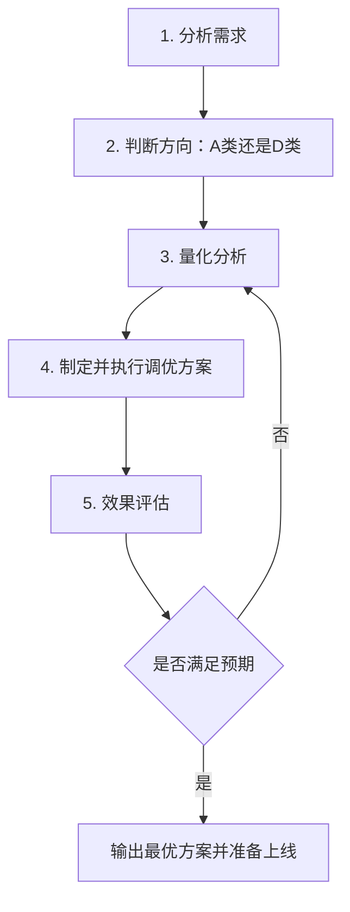
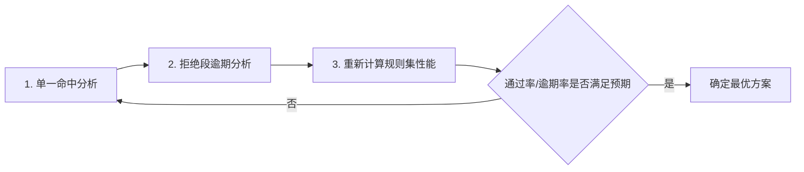
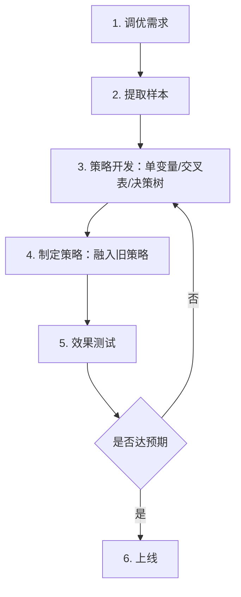
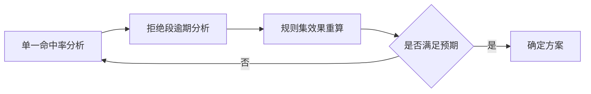

# 策略调优方法论

> 版本说明：本文件基于 `策略调优文档_原始提取.md` 与 `策略调优补充文档_讲义.md` 重新整理，目标是形成一份“最全且去重、结构统一、便于培训与实际落地”的正式版文档。
> 整理原则：保留成熟主干结构，合并重复讲义内容，补齐原始文档中的案例、公式、离线测算与上线监控细节，删除按 PDF 页码堆叠的重复壳内容。

---

## 一、策略调优概述

### 1.1 什么是策略调优

风控策略上线后并不是一成不变的。策略会受到业务目标、市场变化、数据质量、政策要求、资金状况、技术迭代等多方面因素影响，因此需要持续优化调整。

策略调优的本质是：根据当前最新变化，对现有策略做出调整，以找到在当下环境中最合适的策略组合。

核心认识：

- 没有永远最优的策略
- 只有在不同环境下更合适的策略

### 1.2 为什么需要策略调优

常见触发原因包括：

- 业务阶段变化，目标从控风险转向扩规模，或从扩规模转向保资产
- 客群质量变化，整体资质变好或变差
- 市场环境变化，行业风险上升或竞争格局变化
- 监管政策变化，例如定价约束、准入要求变化
- 数据下线、效果衰减或新数据源接入
- 监控报表提示通过率/逾期率出现异常波动

### 1.3 策略调优的核心难点

策略调优并不是简单“放一点”或“收一点”，其难点主要在于：

- 调优目标往往相互制衡
- 风险结果具有滞后性
- A 类调优中的拒绝客户通常没有贷后表现
- 新客群、新策略的真实风险常常未知
- 调优不仅影响风控，还会影响产品、业务、运营和技术实现

### 1.4 风控策略主基调

风控策略的整体基调要与公司风险偏好一致，通常可分为：

- 保守
- 平稳
- 激进

一般而言：

- 市场较好、业务扩张期，可适当偏激进
- 市场下行、资产承压期，应偏保守

风险是滞后的，因此调优时点非常关键。提前收紧通常比风险暴露后再被动收紧更有价值。

---

## 二、策略调优的两大方向

### 2.1 方向对比总览

风控策略调优围绕两个核心指标展开：

- 通过率
- 逾期率

因此可将调优分为两大方向：

- A类调优：提高通过率
- D类调优：降低逾期率

### 2.2 A类调优

A 类调优中的 A 指 `Ascending`，核心目标是提升通过率。

本质上是：从现有策略拒绝的客户中，寻找相对更好的客户重新放行。

常见业务场景：

| 场景 | 说明 |
|---|---|
| 资金充足但业绩压力大 | 现有通过率无法消耗资金 |
| 初期策略偏保守 | 风险可控，但业务规模偏小 |
| 监控发现通过率下降 | 规则/模型命中率上升导致通过率下滑 |

难点在于：被拒绝客户通常没有贷后表现，风险未知，因此量化分析难度更高。

### 2.3 D类调优

D 类调优中的 D 指 `Descending`，核心目标是降低逾期率。

本质上是：从现有通过的客户中，识别相对更差的客户并拒绝掉。

常见业务场景：

| 场景 | 说明 |
|---|---|
| 监控发现逾期率上升 | 资产质量恶化，需要及时收紧 |
| 实际逾期率超过目标 | 风险高于离线预期或经营目标 |
| 放款头寸变少 | 资金不足，需要只保留优质客群 |
| 市场环境下行 | 需要控制风险敞口 |

D 类调优相对更容易量化，因为通过客户已有贷后表现，可直接分析。

---

## 三、策略调优标准流程

### 3.1 总体流程



### 3.2 流程要点

完整调优通常包含：

1. 明确调优需求与目标
2. 选择分析对象：规则、规则集、模型或客群
3. 提取合适历史样本，并回溯变量
4. 做离线量化分析
5. 制定多个备选方案
6. 做历史样本与近期样本效果测算
7. 灰度/AB 测试
8. 上线后持续监控与迭代

### 3.3 样本设计原则

不论 A 类还是 D 类调优，样本设计都必须满足：

- 代表性：能代表当前业务客群
- 充分性：样本量足够
- 可回溯性：变量和决策链路可还原
- 时效性：与当前环境不能脱节

---

## 四、A类调优方法论

### 4.1 方法论总览

A 类调优可以分为宏观和微观两个层面。

| 层面 | 方法 | 说明 |
|---|---|---|
| 宏观 | 客群下探 | 下探更高风险等级或新客群 |
| 微观 | 策略回捞 | 在现有流程上捞回好客户 |
| 微观 | 策略放松 | 放松规则阈值或模型 cutoff |
| 微观 | 策略替换 | 用新策略替代旧策略，提高通过率 |

### 4.2 宏观层面：客群下探

客群下探是对被现有策略拒绝的一类风险客群进行适当放开的过程。

相较单条规则微调，客群下探更偏战略层面，通常需要风控、业务、产品、开发共同参与。

典型特点：

- 不是调某一条规则
- 而是调一个风险区间或一个新客群
- 常伴随产品要素变化

### 4.3 微观层面：策略回捞

拒绝回捞是 A 类调优中的经典方式，指被拒绝客户在后续节点重新被放行。

它可以是：

- 单条强规则回捞
- 多规则组合回捞
- 模型分辅助回捞

### 4.4 微观层面：策略放松

策略放松通常指放松现有规则或模型的阈值，例如：

- 原规则：`RULE0 >= 5` 拒绝
- 放松后：`RULE0 >= 6` 才拒绝

放松后会释放原拒绝段中的部分客户，从而提升通过率。

### 4.5 微观层面：策略替换

策略替换既可用于 A 类调优，也可用于 D 类调优。

A 类场景下常用于：

- 在逾期率基本可控的前提下提升通过率
- 用更细粒度的新策略替换更粗糙的旧策略

---

## 五、D类调优方法论

### 5.1 方法论总览

D 类调优同样分为宏观和微观两个层面。

| 层面 | 方法 | 说明 |
|---|---|---|
| 宏观 | 客群收紧 | 对整体风险客群收紧 |
| 微观 | 策略收紧 | 调整现有规则/模型阈值 |
| 微观 | 策略新增 | 在旧策略基础上新增规则 |
| 微观 | 策略替换 | 用新策略替换旧策略 |

### 5.2 宏观层面：客群收紧

例如：

- 收紧主模型某个高风险等级
- 无差别降低授信额度
- 缩短期限或收紧产品准入

这类方法对通过率和逾期率影响都更大。

### 5.3 微观层面：策略新增

当旧策略已经没有明显收紧空间时，可以接入新维度、新变量或新模型，在原策略不变的基础上增加新的拒绝判断。

特点：

- 旧策略保持不变
- 新策略额外命中一部分客户
- 通过率下降、风险通常同步下降

### 5.4 微观层面：策略收紧

狭义上的策略收紧，特指对规则或模型的阈值进行收紧调整，不依赖新增变量。

特点：

- 调整简单
- 可解释性强
- 适用于已有贷后表现的对象

### 5.5 微观层面：策略替换

当旧策略明显老化、新策略更优时，可以直接做置入置出分析，判断新策略是否值得替换旧策略。

---

## 六、单变量规则的A类调优详解

### 6.1 核心概念：规则阈值放松

单变量规则放松的本质，是把原来的拒绝边界向更高风险方向移动，以释放部分原拒绝客群。

示例：

- 原规则：`最近一个月贷款审批查询次数 >= 5` 拒绝
- 放松后：`>= 6` 才拒绝

### 6.2 A类调优的核心难点

难点在于：

- 拒绝客户无法借款
- 因此没有真实贷后表现
- 无法直接知道放开的客群风险到底是多少

这决定了 A 类调优必须借助“预测”或“测试”。

### 6.3 拒绝段 Bad Rate 预测方法

拒绝段 bad rate 预测常见有三类方法。

#### 方法一：回归预测

适用前提：

- 规则通过样本的分箱 bad rate 具有较明显单调性

核心思路：

1. 只用已通过样本分箱 bad rate 建模
2. 拟合出趋势线或回归方程
3. 外推预测拒绝段的 bad rate

示例方程：

$$
y = 0.0271x + 0.0286
$$

示例预测结果：

- 第 5 箱 bad rate = 0.1642
- 第 6 箱 bad rate = 0.1914

优势：

- 快
- 可解释

局限：

- 强依赖单调性
- 外推误差可能较大

#### 方法二：其他强变量

当目标规则自身单调性不足时，可以借助更强、更稳定的变量进行风险估计。

常见强变量包括：

- 主模型分
- 融合模型分
- 其他经过验证的强风险标签

核心思路：

1. 在通过样本上用强变量做风险分层
2. 将同一分层映射到拒绝样本
3. 用强变量分层下的 bad rate 估计拒绝段风险

这种方法不依赖目标规则自身的单调性，但要求强变量对通过/拒绝样本有较稳定的区分能力。

#### 方法三：实际测试

最准确的方法是直接获取拒绝样本的真实贷后表现。

常见方式：

- 历史 AB 测试
- 历史灰度测试
- 新发起随机测试

随机测试原则：

- 分流比例不宜过高，一般控制在 2% 以内
- 样本量必须满足统计要求
- 测试样本应豁免后续拒绝链路，避免表现失真

优点：

- 信息最准确

缺点：

- 需要观察周期
- 会产生真实风险损失

---

## 七、A类调优效果测算

### 7.1 测算目标

A 类调优的测算通常同时关注：

- 通过率提升多少
- 被释放客群风险有多高
- 整体资产质量是否仍在可接受范围

### 7.2 测算步骤

1. 明确释放对象与阈值变化
2. 预测或获取释放段 bad rate
3. 计算单条规则效果
4. 重新计算整个规则集或全链路策略效果
5. 在历史样本与近期样本双重验证

### 7.3 案例分析

以规则集 A 类调优为例，常用分析闭环如下：



核心结论：

- 单条规则放松后，最终提升多少通过率，不能只看该规则自然命中率
- 必须结合单一命中率与规则重叠情况重新计算规则集整体效果

---

## 八、规则集的A类调优

### 8.1 核心指标定义

在并行规则集里，A 类调优最关键的两个筛选指标是：

- 单一命中率
- 单一命中纯度

定义：

- 自然命中率：某规则命中数量 / 总样本数
- 单一命中率：只有该规则命中、其他并行规则均未命中的数量 / 总样本数
- 单一命中纯度：单一命中率 / 自然命中率

意义：

- 单一命中率越高，释放该规则对整体通过率提升越直接
- 单一命中纯度越高，说明该规则与其他规则重叠越少

### 8.2 规则筛选逻辑（两步筛选法）

#### 第一步：单一命中率分析

优先考虑：

1. 连续型、弱规则
2. 有可调空间的规则
3. 单一命中率高的规则
4. 单一命中纯度高的规则

通常排除：

- 强规则
- 政策性规则
- 几乎无单独贡献的规则

#### 第二步：贷后逾期分析

当初步筛出可调规则后，再判断释放哪些拒绝段更划算。

核心原则：

- 优先释放预估 bad rate 更低的拒绝段

两类情况：

1. 有拒绝段真实贷后表现
2. 无拒绝段真实贷后表现，需要预测

若无真实拒绝段表现，则：

- 若规则区间坏账排序性强，可做回归预测
- 若排序性弱，可优先释放排序性较差的弱规则

### 8.3 规则集性能计算与迭代

规则集 A 类调优后必须重新计算：

- 综合命中率
- 单一命中率
- 自然命中率
- 规则间重叠变化
- 整体通过率变化

如不达预期，需要继续：

- 进一步放松阈值
- 更换释放对象
- 增加或减少可调规则

---

## 九、拒绝回捞策略的完整实施流程

### 9.1 核心逻辑

拒绝回捞的核心思想是：

- 在已经被拒绝的客户中
- 找出“明显的好客户特征”
- 用新的强维度重新判断，将一部分客户捞回

回捞变量最好与前面审批策略使用的变量维度相关性较低。

为什么必须用“明显的好客户特征”：

- 因为原客群在某些维度上已经明显高风险
- 若想覆盖掉这些风险，必须用更强、更可信的好特征去抵消

### 9.2 回捞策略设计

回捞策略可以设计成：

- 单条强规则回捞
- 多维交叉规则回捞
- 并行回捞规则集

示例：

- 内部白名单直接回捞
- 优质单位员工 + 公积金收入高 回捞
- 白户 + 融合模型分 >= 800 回捞

设计原则：

- 回捞力度大：适合用单条强规则
- 回捞更精准：适合用多维交叉组合

### 9.3 流程设计

回捞前必须先界定：

1. 哪些拒绝是绝对不可回捞的
2. 哪些拒绝是可回捞的

例如：

- 政策准入、黑名单通常不回捞
- 欺诈规则、信用规则、模型分层拒绝可视情况回捞

### 9.4 离线分析步骤

1. 确定回捞变量
2. 回溯回捞变量与历史样本
3. 筛选有回捞空间的变量与规则
4. 设计回捞策略并测算效果
5. 用近期样本评估稳定性

### 9.5 回捞策略的逾期率评估

若回捞变量已有贷后表现，可直接使用。

若没有贷后表现，则需借助：

- 历史测试结果
- 随机测试
- 强变量辅助预测

一般要求：

- 回捞客群的 bad rate 相对整体有明显优势

例如：

- 整体 bad rate = 2%
- 回捞客群 bad rate 最好 <= 1.5%

否则回捞意义不大。

### 9.6 上线与监控

通常采用 AB 测试上线：

- 实验组执行回捞
- 对照组维持原策略

监控重点：

- 上线初期：回捞量占比稳定性
- 上线中期：FPD7/15/30+ 等早期风险表现
- 上线后期：DPD30+、多期表现、单一命中失效规则

若回捞风险与大盘接近甚至更差，应及时下线或重调。

---

## 十、客群下探的A类调优

### 10.1 客群下探的概念与适用场景

客群下探是对被原策略拒绝的一类风险客群进行适当开放的过程。

它更像“战略调整”而非“战术微调”，因为涉及：

- 风控策略
- 产品设计
- 业务规划
- 开发配置

适用场景：

- 冷启动后发现现有通过客群风险稳定
- 公司整体偏保守，希望扩大业务量
- 有安全垫，希望向更下沉客群扩展

### 10.2 客群下探的意义

从不同角度看，客群下探的意义包括：

- 市场端：尽量留住本应可经营的客户
- 资产端：丰富资产结构
- 风控端：提高通过率并扩大业务规模

但是否做下探，要服从公司整体风险偏好。

### 10.3 下探实现方式

当前多数贷前体系是“模型为主、策略为辅”，因此客群下探最常见方式是：

- 下探模型分层风险等级

例如：

- 原来 A、B 等级通过，C、D、E、F 拒绝
- 下探后允许 C 等级部分或全部通过

### 10.4 下探节奏

更稳妥的方式通常不是“一步到位”全量下探，而是：

- 先在更高风险等级上增设附加审批规则
- 只放过相对更优质的一部分客户
- 等观察到贷后表现后再决定是否继续扩大

这是一种阶梯式、渐进式下探。

### 10.5 效果测算

#### 风控测算

重点关注：

- 通过率可提升多少
- 新客群预估逾期率多少

例如：

- C 风险等级占整体 18.2%
- 若全量下探通过，则理论通过率提升 18.2%
- 若加审批规则筛选，则实际提升需再乘以筛选通过率

#### 业务测算

要进一步测算新增业务规模：

$$
\text{每月新增放款规模}
= \text{C等级月均申请客户数量}
\times \text{用信转化率}
\times \text{件均额度}
\times \text{额度系数}
$$

在不考虑提前结清的情况下，当月新增在贷余额可近似看作新增放款规模。

### 10.6 风险预警与处置

下探前应提前设计：

- 预警线
- 拉闸线

说明：

- 拉闸线：绝对底线，触发后应立即停业务整顿
- 预警线：提前预警，争取在到达拉闸线前完成调整

预警提前量应结合风险滞后性设置，例如：

- 先息后本：风险更滞后，预警可提前更多
- 等额本息：风险暴露更快，预警提前量可相对小一些

### 10.7 产品设计配套

客群下探通常不是简单放开，而是要配套产品设计。

常见可调整要素：

- 定价
- 额度盖帽
- 期限
- 还款方式

示例：

| 产品要素 | A/B客群 | C客群下探方案 |
|---|---|---|
| 定价 | 3%-8% | 8%-12% |
| 额度盖帽 | 20万 | 10万 |
| 还款方式 | 先息后本/等额本息 | 仅等额本息 |
| 最长期限 | 1年或3年 | 1年 |

同时要注意：

- 风险控制过强虽能提高授信通过率
- 但可能伤害用信转化率
- 最终业务规模未必真的扩大

因此要结合额度与定价做 AB 测试优化。

---

## 十一、规则的D类调优：cutoff收紧

### 11.1 概念与适用对象

狭义上的 D 类收紧，是指对规则或模型的阈值进行收紧，使原通过客群中的一部分转为拒绝。

适用对象：

- 单条规则
- 并行规则集中的具体规则
- 模型 cutoff
- 主模型某风险等级

### 11.2 阈值收紧分析步骤

1. 明确调优需求
2. 提取合适历史样本
3. 从大到小寻找风险点
4. 分箱并做量化分析
5. 制定多个收紧方案
6. 对比收紧前后通过率与逾期率
7. 灰度或 AB 测试后上线

### 11.3 量化分析方法

常见指标包括：

- 区间 bad rate
- Lift
- 分箱样本占比
- 单调性

筛选思路：

1. 优先找有业务意义的变量
2. 优先找 bad rate 单调的变量
3. 优先找 Lift 较高的变量

在信贷场景中，Lift 大于 2 通常就值得重点关注，Lift 大于 3 往往说明区分能力较强。

### 11.4 制定策略方案

例如：

- 原规则：`最近6个月申请贷款机构数 >= 4` 拒绝
- 收紧后：`>= 3` 即拒绝

制定策略时应注意：

- 不只看单条规则
- 还要看该调整对规则集其它规则单一命中率的影响

### 11.5 效果测算

理论上，收紧后：

- 通过率下降
- 逾期率下降

评价重点不是绝对值，而是“相对下降幅度的对比”。

例如：

- 逾期率下降 20%
- 通过率下降 6.79%

说明牺牲较少好客户，拦截了更多坏客户，通常是有效调整。

若是大规模收紧，还可以进一步从成本收益角度测算：

```text
其他成本 + 风险损失成本 >= 利息 + 罚息
```

---

## 十二、策略新增的D类调优

### 12.1 什么是策略新增

策略新增是指在不改变已有策略的基础上，额外增加新的拒绝策略。

适用场景：

- 旧策略已无明显收紧空间
- 需要借助新维度信息补充判断
- 需要额外拦截近期风险上升客群

### 12.2 分析流程



### 12.3 新增策略的几种形态

| 规则形态 | 特点 | 典型效果 |
|---|---|---|
| 单变量规则 | 简单、命中率相对高 | 降逾期快，但通过率损失可能较大 |
| 二维交叉规则 | 更灵活 | 更易平衡通过率和逾期率 |
| 多维规则/模型分 | 更复杂、更精准 | 适合更精细收紧 |

经验上：

- 单变量规则收紧更直接，但可能过猛
- 二维交叉规则通常更平滑

### 12.4 新增策略变量从何而来

常见来源有两类：

1. 同维度新变量
2. 新数据源或新模型补充

判断重点：

- 新变量区分能力是否好
- 与旧策略相关性是否低
- 是否能带来额外命中，而不是重复命中

### 12.5 效果测算要点

效果测算时必须使用同一批样本对比：

- 旧策略
- 旧策略 + 新增策略

关键要看：

1. 新策略能额外命中多少客户
2. 新增后通过率下降多少
3. 新增后逾期率下降多少
4. 新旧策略是否高度重叠

若新增策略与旧策略高度相关，增益可能有限。

---

## 十三、置换策略的D类调优

### 13.1 什么是置换策略

置换策略，也叫 `swap-in / swap-out` 策略，是用一个全新的策略替代旧策略。

它不同于：

- 阈值收紧
- 策略新增

因为它不是在旧策略上修修补补，而是整体替换。

### 13.2 置入与置出

定义：

- 置入：旧策略拒绝、新策略通过
- 置出：旧策略通过、新策略拒绝

示意矩阵：

| 旧策略 \\ 新策略 | 通过 | 拒绝 |
|---|---|---|
| 通过 | 双方都通过 | 置出 |
| 拒绝 | 置入 | 双方都拒绝 |

分析目标：

- D 类调优：保持通过率不变或更高时，比较逾期率
- A 类调优：保持逾期率不变或更低时，比较通过率

### 13.3 分析步骤

1. 明确调优需求
2. 提取样本并回溯数据
3. 开发设计新策略
4. 分别执行新旧策略，得到决策结果
5. 构建决策矩阵
6. 比较通过率和逾期率
7. 灰度或 AB 测试后上线

### 13.4 决策结果交叉分析

置换分析的核心是对新旧策略决策结果做交叉统计。

通常需统计：

- 各交叉区间总客户数
- 各交叉区间坏客户数
- 各交叉区间 bad rate
- 各交叉区间客户占比

其意义：

- 客户占比反映通过率影响
- bad rate 反映风险影响

### 13.5 新旧效果对比原则

在 D 类调优场景中，比较逻辑一般是：

1. 先把新旧策略通过率调到可比水平
2. 再比较置入与置出的 bad rate

若：

- 置入部分 bad rate < 置出部分 bad rate

则说明新策略通常优于旧策略。

### 13.6 置入样本坏账率预测

难点在于：旧策略拒绝样本通常没有贷后表现，因此新策略置入部分的真实 bad rate 不可直接观察。

一种常见离线预估思路：

1. 用新策略在通过样本上做风险分层
2. 统计每层 bad rate
3. 将同样分层映射到旧策略拒绝样本
4. 用各层 bad rate 乘以拒绝样本分布，估计坏客户数量
5. 计算置入部分 bad rate

该方法的局限：

- 可能低估置入部分真实风险
- 因为通过样本与拒绝样本客群天然存在差异

### 13.7 线上验证方式

若历史已有：

- AB 测试
- 灰度测试

可优先用历史测试样本估计拒绝段风险。

若没有，则可发起随机测试：

- 比例不宜过高，一般控制在 2% 以内
- 测试样本需豁免后续拒绝
- 以获取更准确真实表现

---

## 十四、总结与关键要点

### 14.1 策略调优核心框架

策略调优可以概括为：

- 宏观上调客群
- 微观上调策略
- A 类看通过率提升
- D 类看逾期率下降
- 所有动作都要做离线测算、线上验证和持续监控

### 14.2 关键经验结论

1. A 类调优难于 D 类调优，因为拒绝样本风险未知。
2. 单条规则的自然命中率不能直接等价为规则集通过率提升。
3. 回捞必须依赖明显强的好客户特征，否则说服力不足。
4. 客群下探本质上更像新产品，不只是风控放松。
5. D 类收紧时，要关注逾期率下降幅度是否明显大于通过率下降幅度。
6. 新增策略不一定有效，若与旧策略高度重叠，增益会很弱。
7. 置换策略的核心不是“新策略看起来更强”，而是“在可比通过率下是否带来更低风险”。

### 14.3 常见误区

| 误区 | 正确做法 |
|---|---|
| 通过率下降就一定是坏事 | 要看逾期率是否下降更多 |
| 通过率提升就一定是好事 | 要看释放客群风险是否可控 |
| 单条规则好就等于规则集会好 | 必须重新计算整体规则集效果 |
| 新策略区分能力强就一定值得新增 | 还要看与旧策略重叠度和增益 |
| 客群下探就是简单放宽准入 | 还要同步调整产品、额度、定价和预警机制 |
| 置换分析只看新策略整体指标 | 必须看置入/置出差异 |

---

## 附录 A：A类调优常用分析框架

### A.1 单变量放松分析框架

1. 确定放松对象与阈值变化
2. 判断拒绝段是否有真实表现
3. 若无真实表现，选择预测方法
4. 测算单条规则放松后的命中率与预估 bad rate
5. 放回规则集重新算整体效果

### A.2 规则集 A 类调优闭环



### A.3 回捞策略实施框架

1. 明确不可回捞对象
2. 确定可回捞对象
3. 挖掘回捞变量
4. 设计回捞规则
5. 测算回捞通过率与风险
6. AB 测试上线
7. 分阶段监控资产质量

---

## 附录 B：D类调优常用分析框架

### B.1 cutoff 收紧分析框架

1. 找到高风险区间
2. 看 bad rate 是否单调
3. 看 Lift 是否足够高
4. 设计多个 cutoff 方案
5. 对比通过率与逾期率相对变化

### B.2 新增策略分析框架

1. 开发新变量/新规则
2. 评估区分能力
3. 判断与旧策略重叠度
4. 融合旧策略后测算整体效果
5. 选择单变量、交叉表或多维规则形式

### B.3 置换策略分析框架

1. 运行新旧策略
2. 做决策矩阵
3. 比较置入/置出
4. 对齐通过率或逾期率后做公平对比
5. 估算置入 bad rate
6. 灰度/AB 测试

